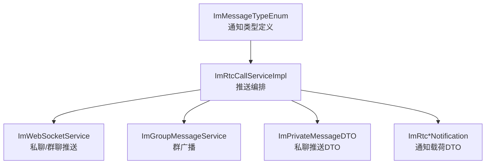
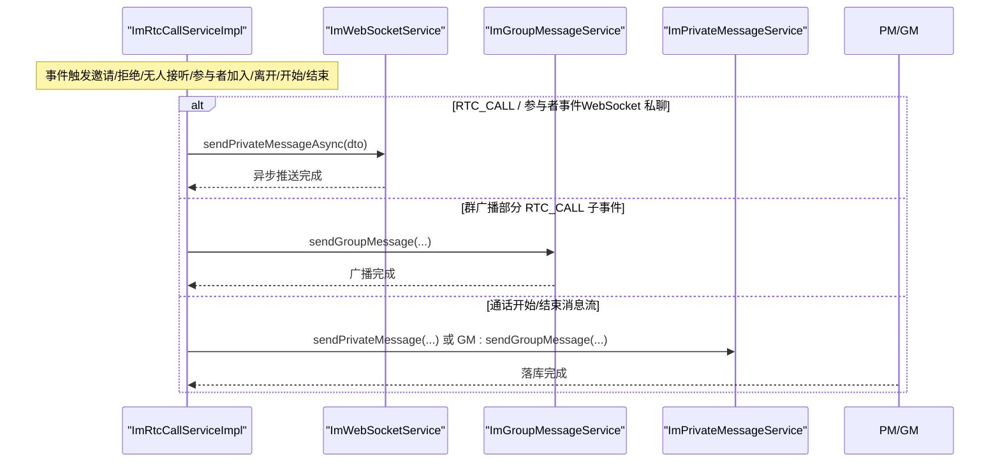
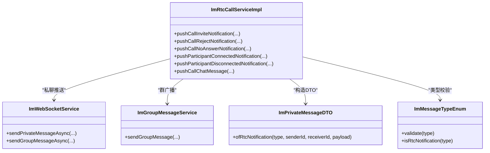

# 通知推送机制

<cite>
**本文引用的文件**
- [ImMessageTypeEnum.java](file://yudao-module-im/src/main/java/cn/iocoder/yudao/module/im/enums/message/ImMessageTypeEnum.java)
- [ImPrivateMessageDTO.java](file://yudao-module-im/src/main/java/cn/iocoder/yudao/module/im/service/websocket/dto/ImPrivateMessageDTO.java)
- [ImRtcCallServiceImpl.java](file://yudao-module-im/src/main/java/cn/iocoder/yudao/module/im/service/rtc/ImRtcCallServiceImpl.java)
- [ImWebSocketService.java](file://yudao-module-im/src/main/java/cn/iocoder/yudao/module/im/service/websocket/ImWebSocketService.java)
- [ImGroupMessageService.java](file://yudao-module-im/src/main/java/cn/iocoder/yudao/module/im/service/message/ImGroupMessageService.java)
- [ImRtcCallNotification.java](file://yudao-module-im/src/main/java/cn/iocoder/yudao/module/im/service/websocket/dto/notification/rtc/ImRtcCallNotification.java)
- [ImRtcParticipantConnectedNotification.java](file://yudao-module-im/src/main/java/cn/iocoder/yudao/module/im/service/websocket/dto/notification/rtc/ImRtcParticipantConnectedNotification.java)
- [ImRtcParticipantDisconnectedNotification.java](file://yudao-module-im/src/main/java/cn/iocoder/yudao/module/im/service/websocket/dto/notification/rtc/ImRtcParticipantDisconnectedNotification.java)
- [ImRtcCallStartNotification.java](file://yudao-module-im/src/main/java/cn/iocoder/yudao/module/im/service/websocket/dto/notification/rtc/ImRtcCallStartNotification.java)
- [ImRtcCallEndNotification.java](file://yudao-module-im/src/main/java/cn/iocoder/yudao/module/im/service/websocket/dto/notification/rtc/ImRtcCallEndNotification.java)
</cite>

## 目录
1. [引言](#引言)
2. [项目结构](#项目结构)
3. [核心组件](#核心组件)
4. [架构总览](#架构总览)
5. [详细组件分析](#详细组件分析)
6. [依赖分析](#依赖分析)
7. [性能考虑](#性能考虑)
8. [故障排查指南](#故障排查指南)
9. [结论](#结论)
10. [附录](#附录)

## 引言
本技术文档围绕实时音视频通话的通知推送机制展开，系统性地阐述通知类型设计、推送通道分流、通知格式规范、推送时机控制、可靠性保障、性能优化、安全控制以及调试与监控方法。目标是帮助开发者快速理解并正确实现 RTC 通话相关的 WebSocket 推送与消息流落库策略。

## 项目结构
IM 模块中与实时通话通知推送相关的核心文件分布如下：
- 通知类型定义：ImMessageTypeEnum
- 私聊推送 DTO：ImPrivateMessageDTO
- 通话服务实现：ImRtcCallServiceImpl（负责邀请、拒绝、无人接听、参与者加入/离开、通话开始/结束等推送）
- WebSocket 服务：ImWebSocketService（私聊/群聊推送入口）
- 群消息服务：ImGroupMessageService（群聊广播）
- 通话通知载荷：ImRtc*Notification 系列 DTO

图表来源
- [ImMessageTypeEnum.java:92-128](file://yudao-module-im/src/main/java/cn/iocoder/yudao/module/im/enums/message/ImMessageTypeEnum.java#L92-L128)
- [ImRtcCallServiceImpl.java:59-66](file://yudao-module-im/src/main/java/cn/iocoder/yudao/module/im/service/rtc/ImRtcCallServiceImpl.java#L59-L66)
- [ImWebSocketService.java](file://yudao-module-im/src/main/java/cn/iocoder/yudao/module/im/service/websocket/ImWebSocketService.java)
- [ImGroupMessageService.java](file://yudao-module-im/src/main/java/cn/iocoder/yudao/module/im/service/message/ImGroupMessageService.java)
- [ImPrivateMessageDTO.java:149-168](file://yudao-module-im/src/main/java/cn/iocoder/yudao/module/im/service/websocket/dto/ImPrivateMessageDTO.java#L149-L168)

章节来源
- [ImMessageTypeEnum.java:92-128](file://yudao-module-im/src/main/java/cn/iocoder/yudao/module/im/enums/message/ImMessageTypeEnum.java#L92-L128)
- [ImRtcCallServiceImpl.java:59-66](file://yudao-module-im/src/main/java/cn/iocoder/yudao/module/im/service/rtc/ImRtcCallServiceImpl.java#L59-L66)

## 核心组件
- 通知类型枚举：ImMessageTypeEnum 定义了 RTC_CALL、RTC_PARTICIPANT_CONNECTED、RTC_PARTICIPANT_DISCONNECTED、RTC_CALL_START、RTC_CALL_END 等类型及其持久化与普通消息属性。
- 私聊推送 DTO：ImPrivateMessageDTO 提供 ofRtcNotification 工厂方法，封装消息编号、发送人、接收人、类型、内容、状态、发送时间等字段。
- 通话服务实现：ImRtcCallServiceImpl 负责根据业务事件选择推送通道（WebSocket 私聊/群广播）、构建通知载荷并调用相应服务。
- WebSocket 服务：ImWebSocketService 提供 sendPrivateMessageAsync/sendGroupMessageAsync 等异步推送能力。
- 群消息服务：ImGroupMessageService 提供群广播能力。
- 通知载荷：ImRtc*Notification 系列 DTO 封装具体业务字段（如邀请、拒绝、无人接听、参与者加入/离开、通话开始/结束）。

章节来源
- [ImMessageTypeEnum.java:92-128](file://yudao-module-im/src/main/java/cn/iocoder/yudao/module/im/enums/message/ImMessageTypeEnum.java#L92-L128)
- [ImPrivateMessageDTO.java:149-168](file://yudao-module-im/src/main/java/cn/iocoder/yudao/module/im/service/websocket/dto/ImPrivateMessageDTO.java#L149-L168)
- [ImRtcCallServiceImpl.java:989-1146](file://yudao-module-im/src/main/java/cn/iocoder/yudao/module/im/service/rtc/ImRtcCallServiceImpl.java#L989-L1146)
- [ImWebSocketService.java](file://yudao-module-im/src/main/java/cn/iocoder/yudao/module/im/service/websocket/ImWebSocketService.java)
- [ImGroupMessageService.java](file://yudao-module-im/src/main/java/cn/iocoder/yudao/module/im/service/message/ImGroupMessageService.java)

## 架构总览
实时通话通知推送采用“事件驱动 + 通道分流”的架构：
- 事件来源：通话生命周期事件（邀请、拒绝、无人接听、参与者加入/离开、通话开始/结束）。
- 通道分流：
  - WebSocket 私聊通道：仅推给参与方（如 RTC_CALL、RTC_PARTICIPANT_CONNECTED/DISCONNECTED）。
  - 群广播通道：针对群聊场景进行全群广播（如部分 RTC_CALL 子事件在特定场景下广播）。
- 消息落库：通话开始/结束两类事件入消息流（私聊/群聊），用于聊天气泡与历史回放。

图表来源
- [ImRtcCallServiceImpl.java:989-1146](file://yudao-module-im/src/main/java/cn/iocoder/yudao/module/im/service/rtc/ImRtcCallServiceImpl.java#L989-L1146)
- [ImWebSocketService.java](file://yudao-module-im/src/main/java/cn/iocoder/yudao/module/im/service/websocket/ImWebSocketService.java)
- [ImGroupMessageService.java](file://yudao-module-im/src/main/java/cn/iocoder/yudao/module/im/service/message/ImGroupMessageService.java)

## 详细组件分析

### 通知类型设计
- RTC_CALL（1601）：通话信令统一入口，不入库，仅推参与方，状态字段复用参与者状态枚举（INVITING / JOINED / REJECTED / NO_ANSWER / LEFT）。
- RTC_PARTICIPANT_CONNECTED（1602）：参与者加入，LiveKit webhook 触发，私聊推 peer 多端 + inviter 多端，群聊全群广播，不入库。
- RTC_PARTICIPANT_DISCONNECTED（1603）：参与者离开，推送范围同 1602，不入库。
- RTC_CALL_START（1610）：通话开始，群聊入群消息流全群广播，私聊入私聊消息流用于会话列表预览，不渲染聊天 tip。
- RTC_CALL_END（1611）：通话结束，入私聊/群聊消息流，私聊渲染准气泡，群聊渲染 tip“语音通话已经结束”。

章节来源
- [ImMessageTypeEnum.java:92-128](file://yudao-module-im/src/main/java/cn/iocoder/yudao/module/im/enums/message/ImMessageTypeEnum.java#L92-L128)

### 推送通道分流
- WebSocket 私聊推送：
  - 使用 ImPrivateMessageDTO.ofRtcNotification 构造 DTO，调用 ImWebSocketService.sendPrivateMessageAsync 异步推送。
  - 适用于 RTC_CALL、RTC_PARTICIPANT_CONNECTED、RTC_PARTICIPANT_DISCONNECTED。
- 群广播推送：
  - 部分 RTC_CALL 子事件（如 REJECT、NO_ANSWER）在群聊场景下广播给全群受众。
  - 使用 ImGroupMessageService.sendGroupMessage 广播。
- 消息流落库：
  - RTC_CALL_START、RTC_CALL_END 两类事件入消息流，私聊走私聊消息服务，群聊走群消息服务。

章节来源
- [ImRtcCallServiceImpl.java:989-1146](file://yudao-module-im/src/main/java/cn/iocoder/yudao/module/im/service/rtc/ImRtcCallServiceImpl.java#L989-L1146)
- [ImPrivateMessageDTO.java:149-168](file://yudao-module-im/src/main/java/cn/iocoder/yudao/module/im/service/websocket/dto/ImPrivateMessageDTO.java#L149-L168)

### 通知格式规范
- 私聊推送 DTO 字段：
  - id：消息编号/已读位置/被撤回消息编号等（依类型而定）
  - clientMessageId：客户端消息编号
  - senderId：发送人编号
  - receiverId：接收人编号
  - type：消息类型（如 RTC_*）
  - content：JSON 字符串形式的通知载荷
  - status：消息状态（如参与者状态）
  - sendTime：发送时间
- 通知载荷 DTO：
  - ImRtcCallNotification：邀请、拒绝、无人接听等
  - ImRtcParticipantConnectedNotification：参与者加入
  - ImRtcParticipantDisconnectedNotification：参与者离开
  - ImRtcCallStartNotification：通话开始
  - ImRtcCallEndNotification：通话结束

章节来源
- [ImPrivateMessageDTO.java:25-66](file://yudao-module-im/src/main/java/cn/iocoder/yudao/module/im/service/websocket/dto/ImPrivateMessageDTO.java#L25-L66)
- [ImRtcCallNotification.java](file://yudao-module-im/src/main/java/cn/iocoder/yudao/module/im/service/websocket/dto/notification/rtc/ImRtcCallNotification.java)
- [ImRtcParticipantConnectedNotification.java](file://yudao-module-im/src/main/java/cn/iocoder/yudao/module/im/service/websocket/dto/notification/rtc/ImRtcParticipantConnectedNotification.java)
- [ImRtcParticipantDisconnectedNotification.java](file://yudao-module-im/src/main/java/cn/iocoder/yudao/module/im/service/websocket/dto/notification/rtc/ImRtcParticipantDisconnectedNotification.java)
- [ImRtcCallStartNotification.java](file://yudao-module-im/src/main/java/cn/iocoder/yudao/module/im/service/websocket/dto/notification/rtc/ImRtcCallStartNotification.java)
- [ImRtcCallEndNotification.java](file://yudao-module-im/src/main/java/cn/iocoder/yudao/module/im/service/websocket/dto/notification/rtc/ImRtcCallEndNotification.java)

### 推送时机控制
- RTC_CALL(INVITE)：被邀请人私聊直推，不入消息流。
- RTC_CALL(REJECT/NO_ANSWER)：群聊场景广播给全群受众。
- 参与者加入/离开：LiveKit webhook 触发，按会话类型决定推送范围（私聊/群广播）。
- 通话开始/结束：分别在邀请接口事务（START）与挂断/取消接口事务（END）中入消息流，天然保证顺序。

章节来源
- [ImRtcCallServiceImpl.java:989-1146](file://yudao-module-im/src/main/java/cn/iocoder/yudao/module/im/service/rtc/ImRtcCallServiceImpl.java#L989-L1146)

### 推送可靠性保障
- 异步推送：ImWebSocketService 提供异步推送方法，降低主流程阻塞风险。
- 扇出推送：对多个接收方进行批量推送，减少多次网络往返。
- 持久化落库：通话开始/结束两类事件入消息流，确保离线可拉取与历史回放。
- 幂等与锁：通过分布式锁与条件更新，避免并发竞态导致的重复推送或状态错乱。

章节来源
- [ImRtcCallServiceImpl.java:59-66](file://yudao-module-im/src/main/java/cn/iocoder/yudao/module/im/service/rtc/ImRtcCallServiceImpl.java#L59-L66)

### 推送性能优化
- 异步推送：大量使用异步方法，避免阻塞主线程。
- 扇出批处理：对群广播场景一次性构建 DTO 并批量推送。
- JSON 序列化：统一使用 JSON 字符串承载通知载荷，便于跨端解析与传输。
- 连接复用：WebSocket 连接复用，减少握手成本。

章节来源
- [ImRtcCallServiceImpl.java:1074-1081](file://yudao-module-im/src/main/java/cn/iocoder/yudao/module/im/service/rtc/ImRtcCallServiceImpl.java#L1074-L1081)
- [ImWebSocketService.java](file://yudao-module-im/src/main/java/cn/iocoder/yudao/module/im/service/websocket/ImWebSocketService.java)

### 推送安全控制
- 权限验证：推送前进行操作者身份与房间/群组权限校验（如仅参与者可邀请、仅群成员可广播等）。
- Token 签发：对私聊邀请场景签发带时效的 Token，限制访问 LiveKit 房间。
- 字段校验：DTO 构造时进行类型与载荷非空校验，防止非法类型进入推送通道。

章节来源
- [ImRtcCallServiceImpl.java:1000-1008](file://yudao-module-im/src/main/java/cn/iocoder/yudao/module/im/service/rtc/ImRtcCallServiceImpl.java#L1000-L1008)
- [ImPrivateMessageDTO.java:170-174](file://yudao-module-im/src/main/java/cn/iocoder/yudao/module/im/service/websocket/dto/ImPrivateMessageDTO.java#L170-L174)

### 调试方法与监控指标
- 调试方法：
  - 关注 ImRtcCallServiceImpl 中的推送分支逻辑，结合日志定位推送失败原因。
  - 检查 WebSocket 服务的异步回调与异常处理。
  - 校验消息类型与持久化属性是否匹配（如 RTC_* 不入消息流）。
- 监控指标建议：
  - 推送成功率/失败率
  - 异步推送耗时分布
  - 群广播扇出数量与耗时
  - 消息流落库延迟
  - WebSocket 连接数与重连次数

章节来源
- [ImRtcCallServiceImpl.java:989-1146](file://yudao-module-im/src/main/java/cn/iocoder/yudao/module/im/service/rtc/ImRtcCallServiceImpl.java#L989-L1146)

## 依赖分析
- 通知类型与 DTO 的耦合：ImMessageTypeEnum 与 ImPrivateMessageDTO 的 ofRtcNotification 方法形成强约束，确保类型与载荷一致。
- 服务层耦合：ImRtcCallServiceImpl 依赖 ImWebSocketService、ImGroupMessageService、消息服务等，承担编排职责。
- 载荷解耦：通知载荷 DTO 独立于推送通道，便于扩展与维护。

图表来源
- [ImMessageTypeEnum.java:420-424](file://yudao-module-im/src/main/java/cn/iocoder/yudao/module/im/enums/message/ImMessageTypeEnum.java#L420-L424)
- [ImPrivateMessageDTO.java:149-168](file://yudao-module-im/src/main/java/cn/iocoder/yudao/module/im/service/websocket/dto/ImPrivateMessageDTO.java#L149-L168)
- [ImRtcCallServiceImpl.java:989-1146](file://yudao-module-im/src/main/java/cn/iocoder/yudao/module/im/service/rtc/ImRtcCallServiceImpl.java#L989-L1146)
- [ImWebSocketService.java](file://yudao-module-im/src/main/java/cn/iocoder/yudao/module/im/service/websocket/ImWebSocketService.java)
- [ImGroupMessageService.java](file://yudao-module-im/src/main/java/cn/iocoder/yudao/module/im/service/message/ImGroupMessageService.java)

## 性能考虑
- 异步推送：减少 IO 阻塞，提升吞吐。
- 扇出批处理：降低网络往返次数，提高广播效率。
- JSON 序列化：统一载荷格式，便于缓存与传输优化。
- 连接复用：避免频繁握手，降低 CPU 与网络开销。

## 故障排查指南
- 推送失败：
  - 检查 WebSocket 服务可用性与连接状态。
  - 核对消息类型是否为 RTC_* 且持久化属性为 false。
- 幂等与竞态：
  - 核查分布式锁与条件更新逻辑，避免重复推送。
- 载荷异常：
  - 确认 DTO 构造时的类型校验与 JSON 序列化是否正确。

章节来源
- [ImRtcCallServiceImpl.java:59-66](file://yudao-module-im/src/main/java/cn/iocoder/yudao/module/im/service/rtc/ImRtcCallServiceImpl.java#L59-L66)
- [ImPrivateMessageDTO.java:170-174](file://yudao-module-im/src/main/java/cn/iocoder/yudao/module/im/service/websocket/dto/ImPrivateMessageDTO.java#L170-L174)

## 结论
本通知推送机制以事件驱动为核心，通过明确的类型定义、严格的 DTO 校验与清晰的通道分流，实现了 RTC 通话场景下的高效、可靠与可扩展推送。配合异步推送、扇出批处理与消息流落库，既满足实时性需求，又兼顾离线可恢复与历史回放能力。

## 附录
- 术语
  - RTC：实时通话
  - DTO：数据传输对象
  - WebSocket：长连接推送通道
  - 广播：面向全群成员的推送
  - 扇出：对多个接收方的批量推送