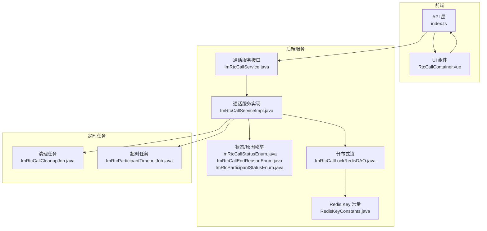
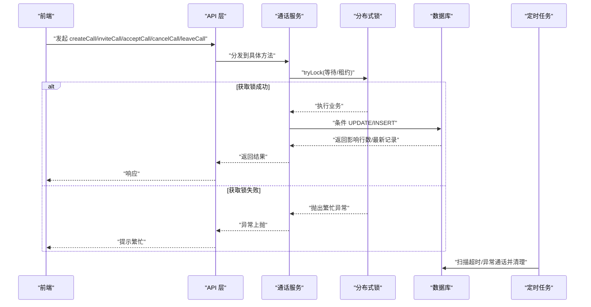
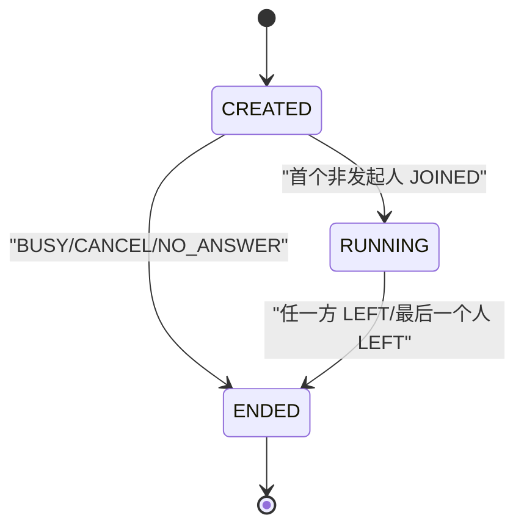
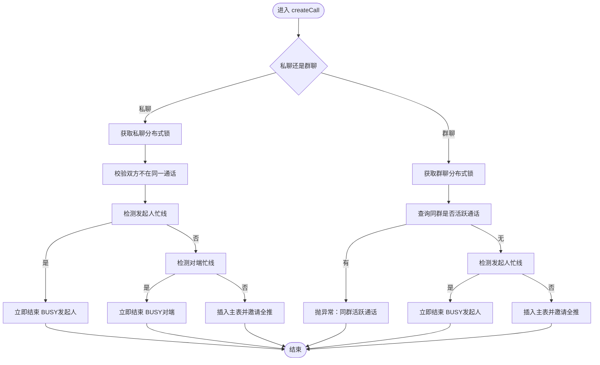
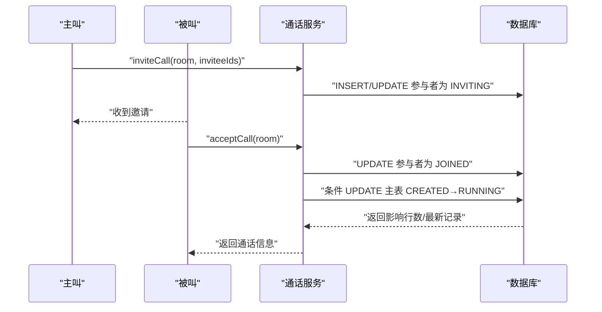
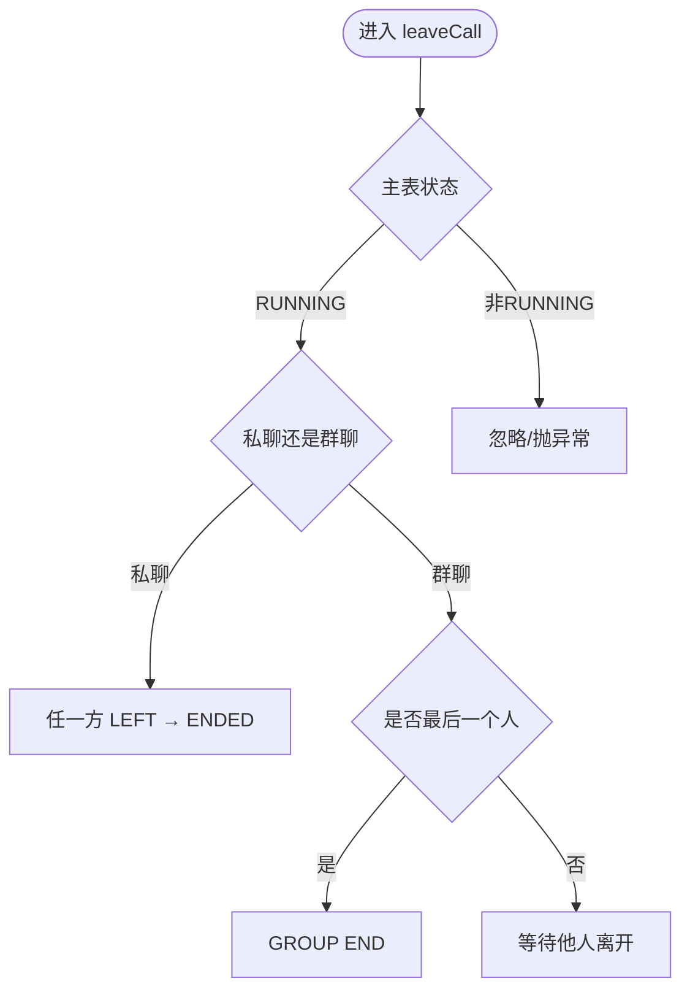
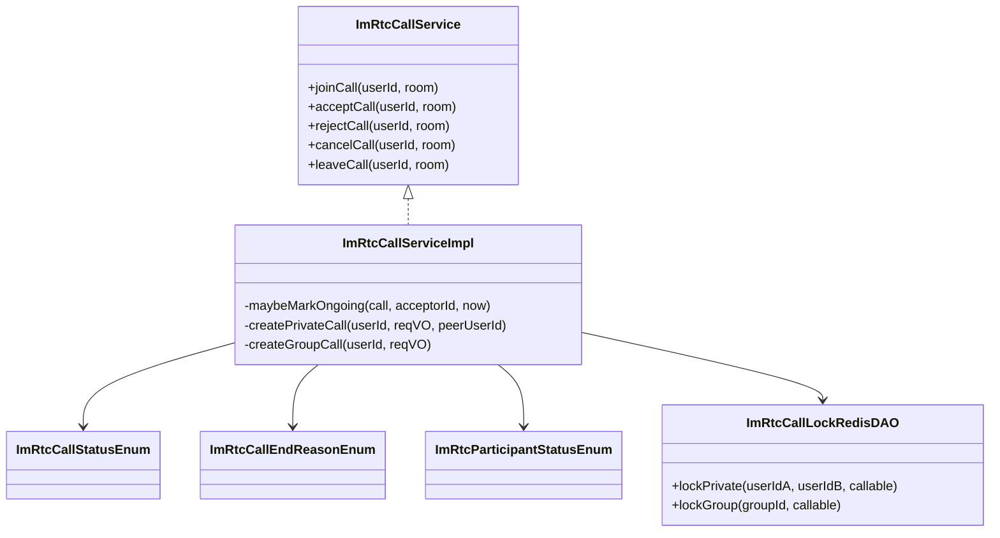

# 通话生命周期管理

<cite>
**本文引用的文件**
- [ImRtcCallServiceImpl.java](file://yudao-module-im/src/main/java/cn/iocoder/yudao/module/im/service/rtc/ImRtcCallServiceImpl.java)
- [ImRtcCallService.java](file://yudao-module-im/src/main/java/cn/iocoder/yudao/module/im/service/rtc/ImRtcCallService.java)
- [ImRtcCallStatusEnum.java](file://yudao-module-im/src/main/java/cn/iocoder/yudao/module/im/enums/rtc/ImRtcCallStatusEnum.java)
- [ImRtcCallEndReasonEnum.java](file://yudao-module-im/src/main/java/cn/iocoder/yudao/module/im/enums/rtc/ImRtcCallEndReasonEnum.java)
- [ImRtcParticipantStatusEnum.java](file://yudao-module-im/src/main/java/cn/iocoder/yudao/module/im/enums/rtc/ImRtcParticipantStatusEnum.java)
- [ImRtcCallLockRedisDAO.java](file://yudao-module-im/src/main/java/cn/iocoder/yudao/module/im/dal/redis/rtc/ImRtcCallLockRedisDAO.java)
- [RedisKeyConstants.java](file://yudao-module-im/src/main/java/cn/iocoder/yudao/module/im/dal/redis/RedisKeyConstants.java)
- [index.ts](file://yudao-ui/yudao-ui-admin-vue3/src/api/im/rtc/index.ts)
- [RtcCallContainer.vue](file://yudao-ui/yudao-ui-admin-vue3/src/views/im/home/components/rtc/RtcCallContainer.vue)
- [ImRtcCallCleanupJob.java](file://yudao-module-im/src/main/java/cn/iocoder/yudao/module/im/job/rtc/ImRtcCallCleanupJob.java)
- [ImRtcParticipantTimeoutJob.java](file://yudao-module-im/src/main/java/cn/iocoder/yudao/module/im/job/rtc/ImRtcParticipantTimeoutJob.java)
</cite>

## 目录
1. [引言](#引言)
2. [项目结构](#项目结构)
3. [核心组件](#核心组件)
4. [架构总览](#架构总览)
5. [详细组件分析](#详细组件分析)
6. [依赖关系分析](#依赖关系分析)
7. [性能考量](#性能考量)
8. [故障排查指南](#故障排查指南)
9. [结论](#结论)
10. [附录](#附录)

## 引言
本文件系统化梳理实时音视频通话的生命周期管理，覆盖状态机设计、创建与并发控制、邀请与接受、取消与离开、结束原因分类、私聊与群聊差异，以及关键流程的时序与时序图，帮助开发者与产品人员快速理解并正确集成。

## 项目结构
IM 模块围绕“通话主表 + 参与者表”的双表模型组织通话生命周期，配合 Redis 分布式锁保证并发安全，前端通过 API 触发状态转换，后台通过定时任务兜底清理与超时处理。

图表来源
- [ImRtcCallServiceImpl.java:1-200](file://yudao-module-im/src/main/java/cn/iocoder/yudao/module/im/service/rtc/ImRtcCallServiceImpl.java#L1-L200)
- [ImRtcCallService.java:1-120](file://yudao-module-im/src/main/java/cn/iocoder/yudao/module/im/service/rtc/ImRtcCallService.java#L1-L120)
- [ImRtcCallLockRedisDAO.java:1-80](file://yudao-module-im/src/main/java/cn/iocoder/yudao/module/im/dal/redis/rtc/ImRtcCallLockRedisDAO.java#L1-L80)
- [RedisKeyConstants.java:51-62](file://yudao-module-im/src/main/java/cn/iocoder/yudao/module/im/dal/redis/RedisKeyConstants.java#L51-L62)
- [ImRtcCallCleanupJob.java](file://yudao-module-im/src/main/java/cn/iocoder/yudao/module/im/job/rtc/ImRtcCallCleanupJob.java)
- [ImRtcParticipantTimeoutJob.java](file://yudao-module-im/src/main/java/cn/iocoder/yudao/module/im/job/rtc/ImRtcParticipantTimeoutJob.java)

章节来源
- [ImRtcCallServiceImpl.java:1-200](file://yudao-module-im/src/main/java/cn/iocoder/yudao/module/im/service/rtc/ImRtcCallServiceImpl.java#L1-L200)
- [ImRtcCallService.java:1-120](file://yudao-module-im/src/main/java/cn/iocoder/yudao/module/im/service/rtc/ImRtcCallService.java#L1-L120)
- [ImRtcCallLockRedisDAO.java:1-80](file://yudao-module-im/src/main/java/cn/iocoder/yudao/module/im/dal/redis/rtc/ImRtcCallLockRedisDAO.java#L1-L80)
- [RedisKeyConstants.java:51-62](file://yudao-module-im/src/main/java/cn/iocoder/yudao/module/im/dal/redis/RedisKeyConstants.java#L51-L62)

## 核心组件
- 通话状态机（主表状态）：CREATED → RUNNING → ENDED
- 参与者状态机（参与者表状态）：INVITING → JOINED/REJECTED/LEFT（私聊）、JOINER/JOINED/REJECTED（群聊）
- 结束原因：BUSY、REJECT、NO_ANSWER、CANCEL、DISCONNECT 等
- 并发控制：基于 Redisson 的分布式锁，按私聊对称键或群组粒度串行化邀请入口
- 定时任务兜底：清理过期/异常通话、检测振铃超时

章节来源
- [ImRtcCallStatusEnum.java:12-46](file://yudao-module-im/src/main/java/cn/iocoder/yudao/module/im/enums/rtc/ImRtcCallStatusEnum.java#L12-L46)
- [ImRtcCallEndReasonEnum.java](file://yudao-module-im/src/main/java/cn/iocoder/yudao/module/im/enums/rtc/ImRtcCallEndReasonEnum.java)
- [ImRtcParticipantStatusEnum.java](file://yudao-module-im/src/main/java/cn/iocoder/yudao/module/im/enums/rtc/ImRtcParticipantStatusEnum.java)
- [ImRtcCallLockRedisDAO.java:1-80](file://yudao-module-im/src/main/java/cn/iocoder/yudao/module/im/dal/redis/rtc/ImRtcCallLockRedisDAO.java#L1-L80)

## 架构总览
前端通过 API 发起通话操作，后端在分布式锁保护下完成状态转换与持久化，同时通过定时任务保障异常场景的收敛。

图表来源
- [ImRtcCallServiceImpl.java:119-178](file://yudao-module-im/src/main/java/cn/iocoder/yudao/module/im/service/rtc/ImRtcCallServiceImpl.java#L119-L178)
- [ImRtcCallLockRedisDAO.java:62-78](file://yudao-module-im/src/main/java/cn/iocoder/yudao/module/im/dal/redis/rtc/ImRtcCallLockRedisDAO.java#L62-L78)
- [ImRtcCallCleanupJob.java](file://yudao-module-im/src/main/java/cn/iocoder/yudao/module/im/job/rtc/ImRtcCallCleanupJob.java)
- [ImRtcParticipantTimeoutJob.java](file://yudao-module-im/src/main/java/cn/iocoder/yudao/module/im/job/rtc/ImRtcParticipantTimeoutJob.java)

## 详细组件分析

### 通话状态机与结束原因
- 主表状态机：CREATED → RUNNING → ENDED
  - CREATED：已创建；私聊等被叫接听；群聊发起人已进房，等其他人加入
  - RUNNING：第一个非发起人接通后进入
  - ENDED：任意一方挂断、主叫取消、Webhook 兜底等
- 参与者状态机（私聊/群聊略有差异）
  - 私聊：INVITING → JOINED/REJECTED/LEFT
  - 群聊：INVITING → JOINER/JOINED/REJECTED；旁观者“加入”为 JOINER
- 结束原因
  - BUSY：主被叫任一方忙线
  - REJECT：被叫拒接
  - NO_ANSWER：振铃超时未接听
  - CANCEL：主叫在 INVITING 期间主动取消
  - DISCONNECT：网络/异常断连

图表来源
- [ImRtcCallStatusEnum.java:12-46](file://yudao-module-im/src/main/java/cn/iocoder/yudao/module/im/enums/rtc/ImRtcCallStatusEnum.java#L12-L46)
- [ImRtcCallEndReasonEnum.java](file://yudao-module-im/src/main/java/cn/iocoder/yudao/module/im/enums/rtc/ImRtcCallEndReasonEnum.java)

章节来源
- [ImRtcCallStatusEnum.java:12-46](file://yudao-module-im/src/main/java/cn/iocoder/yudao/module/im/enums/rtc/ImRtcCallStatusEnum.java#L12-L46)
- [ImRtcCallEndReasonEnum.java](file://yudao-module-im/src/main/java/cn/iocoder/yudao/module/im/enums/rtc/ImRtcCallEndReasonEnum.java)
- [ImRtcParticipantStatusEnum.java](file://yudao-module-im/src/main/java/cn/iocoder/yudao/module/im/enums/rtc/ImRtcParticipantStatusEnum.java)

### 通话创建流程（含分布式锁与并发控制）
- 私聊创建
  - 并发入口：按私聊对称键（小 ID _ 大 ID）获取分布式锁
  - 并发校验：双方是否已在同一通话（数据异常）
  - 忙线检测：先查发起人，再查对端；任一方忙线则立即结束（BUSY）
  - 生命周期：插入主表 + 邀请全推
- 群聊创建
  - 并发入口：按群组 ID 获取分布式锁
  - 并发校验：同群是否存在活跃通话（存在则抛异常，引导走 invite/join）
  - 忙线检测：仅检测发起人；发起人忙线则立即结束（BUSY）
  - 生命周期：插入主表 + 邀请全推

图表来源
- [ImRtcCallServiceImpl.java:119-178](file://yudao-module-im/src/main/java/cn/iocoder/yudao/module/im/service/rtc/ImRtcCallServiceImpl.java#L119-L178)
- [ImRtcCallLockRedisDAO.java:43-55](file://yudao-module-im/src/main/java/cn/iocoder/yudao/module/im/dal/redis/rtc/ImRtcCallLockRedisDAO.java#L43-L55)

章节来源
- [ImRtcCallServiceImpl.java:119-178](file://yudao-module-im/src/main/java/cn/iocoder/yudao/module/im/service/rtc/ImRtcCallServiceImpl.java#L119-L178)
- [ImRtcCallLockRedisDAO.java:43-55](file://yudao-module-im/src/main/java/cn/iocoder/yudao/module/im/dal/redis/rtc/ImRtcCallLockRedisDAO.java#L43-L55)
- [RedisKeyConstants.java:51-62](file://yudao-module-im/src/main/java/cn/iocoder/yudao/module/im/dal/redis/RedisKeyConstants.java#L51-L62)

### 通话邀请与接受流程
- 邀请（inviteCall）
  - 私聊：由服务端在锁内完成 INVITING 状态推进与推送
  - 群聊：支持在已有活跃通话中追加邀请（仅群聊可用）
- 接受（acceptCall）
  - 参与者状态：INVITING → JOINED（私聊）或 JOINED（群聊）
  - 主表状态：CREATED → RUNNING（仅当首个非发起人接通时推进）
  - 幂等性：条件 UPDATE + 竞争失败 reload 最终态

图表来源
- [ImRtcCallServiceImpl.java:338-341](file://yudao-module-im/src/main/java/cn/iocoder/yudao/module/im/service/rtc/ImRtcCallServiceImpl.java#L338-L341)
- [ImRtcCallServiceImpl.java:908-931](file://yudao-module-im/src/main/java/cn/iocoder/yudao/module/im/service/rtc/ImRtcCallServiceImpl.java#L908-L931)
- [index.ts:47-88](file://yudao-ui/yudao-ui-admin-vue3/src/api/im/rtc/index.ts#L47-L88)
- [RtcCallContainer.vue:353-367](file://yudao-ui/yudao-ui-admin-vue3/src/views/im/home/components/rtc/RtcCallContainer.vue#L353-L367)

章节来源
- [ImRtcCallServiceImpl.java:338-341](file://yudao-module-im/src/main/java/cn/iocoder/yudao/module/im/service/rtc/ImRtcCallServiceImpl.java#L338-L341)
- [ImRtcCallServiceImpl.java:908-931](file://yudao-module-im/src/main/java/cn/iocoder/yudao/module/im/service/rtc/ImRtcCallServiceImpl.java#L908-L931)
- [index.ts:47-88](file://yudao-ui/yudao-ui-admin-vue3/src/api/im/rtc/index.ts#L47-L88)
- [RtcCallContainer.vue:353-367](file://yudao-ui/yudao-ui-admin-vue3/src/views/im/home/components/rtc/RtcCallContainer.vue#L353-L367)

### 通话取消与离开流程
- 取消（cancelCall）
  - 仅在 INVITING 状态允许主叫取消
  - 条件 UPDATE 参与者状态为 REJECTED 或直接结束会话
- 离开（leaveCall）
  - RUNNING 状态下生效
  - 私聊：任一方离开即结束
  - 群聊：仅当最后一个成员离开才结束

图表来源
- [ImRtcCallService.java:70-76](file://yudao-module-im/src/main/java/cn/iocoder/yudao/module/im/service/rtc/ImRtcCallService.java#L70-L76)
- [ImRtcCallServiceImpl.java](file://yudao-module-im/src/main/java/cn/iocoder/yudao/module/im/service/rtc/ImRtcCallServiceImpl.java)

章节来源
- [ImRtcCallService.java:70-76](file://yudao-module-im/src/main/java/cn/iocoder/yudao/module/im/service/rtc/ImRtcCallService.java#L70-L76)
- [ImRtcCallServiceImpl.java](file://yudao-module-im/src/main/java/cn/iocoder/yudao/module/im/service/rtc/ImRtcCallServiceImpl.java)

### 结束原因分类与处理
- BUSY：忙线导致立即结束，主被叫看到不同文案（以 operator 决定）
- REJECT：被叫拒接，参与者状态置为 REJECTED
- NO_ANSWER：振铃超时，服务端扫描并推进至 ENDED
- CANCEL：主叫在 INVITING 期间取消
- DISCONNECT：网络/异常断连，由定时任务兜底清理

章节来源
- [ImRtcCallServiceImpl.java:119-178](file://yudao-module-im/src/main/java/cn/iocoder/yudao/module/im/service/rtc/ImRtcCallServiceImpl.java#L119-L178)
- [ImRtcCallServiceImpl.java:345-360](file://yudao-module-im/src/main/java/cn/iocoder/yudao/module/im/service/rtc/ImRtcCallServiceImpl.java#L345-L360)
- [ImRtcCallCleanupJob.java](file://yudao-module-im/src/main/java/cn/iocoder/yudao/module/im/job/rtc/ImRtcCallCleanupJob.java)
- [ImRtcParticipantTimeoutJob.java](file://yudao-module-im/src/main/java/cn/iocoder/yudao/module/im/job/rtc/ImRtcParticipantTimeoutJob.java)

### 私聊与群聊生命周期差异
- 私聊
  - 并发：按私聊对称键串行化
  - 忙线：双方忙线均可立即结束 BUSY
  - 接通：首个非发起人 JOINED → 主表 RUNNING
  - 结束：任一方 LEFT → ENDED
- 群聊
  - 并发：按群组串行化
  - 忙线：仅发起人忙线立即结束 BUSY
  - 接通：首个非发起人 JOINED → 主表 RUNNING
  - 结束：最后一个人 LEFT → ENDED；支持“加入已有通话”（JOINER → JOINED）

章节来源
- [ImRtcCallServiceImpl.java:119-178](file://yudao-module-im/src/main/java/cn/iocoder/yudao/module/im/service/rtc/ImRtcCallServiceImpl.java#L119-L178)
- [ImRtcCallServiceImpl.java:338-341](file://yudao-module-im/src/main/java/cn/iocoder/yudao/module/im/service/rtc/ImRtcCallServiceImpl.java#L338-L341)
- [ImRtcCallServiceImpl.java:908-931](file://yudao-module-im/src/main/java/cn/iocoder/yudao/module/im/service/rtc/ImRtcCallServiceImpl.java#L908-L931)

## 依赖关系分析
- 服务层依赖
  - 通话服务实现依赖状态枚举、结束原因枚举、参与者状态枚举
  - 通过分布式锁 DAO 保证邀请入口的串行化
  - 通过定时任务兜底清理与超时处理
- 前端依赖
  - API 层封装了 invite/accept/reject/cancel/leave/no-answer-call-check 等接口
  - UI 组件在交互层触发对应 API，并根据返回结果推进本地状态

图表来源
- [ImRtcCallService.java:36-76](file://yudao-module-im/src/main/java/cn/iocoder/yudao/module/im/service/rtc/ImRtcCallService.java#L36-L76)
- [ImRtcCallServiceImpl.java:119-178](file://yudao-module-im/src/main/java/cn/iocoder/yudao/module/im/service/rtc/ImRtcCallServiceImpl.java#L119-L178)
- [ImRtcCallLockRedisDAO.java:43-55](file://yudao-module-im/src/main/java/cn/iocoder/yudao/module/im/dal/redis/rtc/ImRtcCallLockRedisDAO.java#L43-L55)
- [ImRtcCallStatusEnum.java:12-46](file://yudao-module-im/src/main/java/cn/iocoder/yudao/module/im/enums/rtc/ImRtcCallStatusEnum.java#L12-L46)
- [ImRtcCallEndReasonEnum.java](file://yudao-module-im/src/main/java/cn/iocoder/yudao/module/im/enums/rtc/ImRtcCallEndReasonEnum.java)
- [ImRtcParticipantStatusEnum.java](file://yudao-module-im/src/main/java/cn/iocoder/yudao/module/im/enums/rtc/ImRtcParticipantStatusEnum.java)

章节来源
- [ImRtcCallService.java:36-76](file://yudao-module-im/src/main/java/cn/iocoder/yudao/module/im/service/rtc/ImRtcCallService.java#L36-L76)
- [ImRtcCallServiceImpl.java:119-178](file://yudao-module-im/src/main/java/cn/iocoder/yudao/module/im/service/rtc/ImRtcCallServiceImpl.java#L119-L178)
- [ImRtcCallLockRedisDAO.java:43-55](file://yudao-module-im/src/main/java/cn/iocoder/yudao/module/im/dal/redis/rtc/ImRtcCallLockRedisDAO.java#L43-L55)

## 性能考量
- 分布式锁
  - 等待时间与租约时间平衡：等待过短易繁忙，租约过长增加锁持有风险
  - 自动释放兜底：Redisson 自动释放，避免业务线程长期占用
- 条件 UPDATE 幂等
  - 主表状态推进与参与者状态变更均采用“条件 UPDATE”，竞争失败时 reload 最终态
- 定时任务
  - 清理过期/异常通话与检测振铃超时，降低前端长轮询压力
- 前端体验
  - 振铃超时检查接口静默扫描，避免阻塞 UI 流程

章节来源
- [ImRtcCallLockRedisDAO.java:62-78](file://yudao-module-im/src/main/java/cn/iocoder/yudao/module/im/dal/redis/rtc/ImRtcCallLockRedisDAO.java#L62-L78)
- [ImRtcCallServiceImpl.java:908-931](file://yudao-module-im/src/main/java/cn/iocoder/yudao/module/im/service/rtc/ImRtcCallServiceImpl.java#L908-L931)
- [ImRtcCallCleanupJob.java](file://yudao-module-im/src/main/java/cn/iocoder/yudao/module/im/job/rtc/ImRtcCallCleanupJob.java)
- [ImRtcParticipantTimeoutJob.java](file://yudao-module-im/src/main/java/cn/iocoder/yudao/module/im/job/rtc/ImRtcParticipantTimeoutJob.java)

## 故障排查指南
- “繁忙”提示
  - 现象：邀请接口返回繁忙
  - 原因：分布式锁等待超时（可能对端/同群正在邀请）
  - 处理：稍后重试或引导用户走 invite/join
- “会话不存在”
  - 现象：accept/reject/cancel/leave 返回会话不存在
  - 原因：状态已变或竞争失败后 reload 的最终态已是 ENDED
  - 处理：前端刷新状态，避免重复操作
- “同群活跃通话”
  - 现象：私聊创建时报同群活跃通话
  - 原因：群内已有活跃通话
  - 处理：走 invite/join 流程，避免重复创建
- “无活跃通话”
  - 现象：查询胶囊条活跃通话为空
  - 原因：无正在进行的群聊通话或已结束
  - 处理：引导用户新建或等待他人发起

章节来源
- [ImRtcCallLockRedisDAO.java:62-78](file://yudao-module-im/src/main/java/cn/iocoder/yudao/module/im/dal/redis/rtc/ImRtcCallLockRedisDAO.java#L62-L78)
- [ImRtcCallServiceImpl.java:127-133](file://yudao-module-im/src/main/java/cn/iocoder/yudao/module/im/service/rtc/ImRtcCallServiceImpl.java#L127-L133)
- [ImRtcCallServiceImpl.java:345-360](file://yudao-module-im/src/main/java/cn/iocoder/yudao/module/im/service/rtc/ImRtcCallServiceImpl.java#L345-L360)

## 结论
本方案以“主表状态机 + 参与者状态机 + 分布式锁 + 定时任务兜底”为核心，兼顾私聊与群聊差异，确保高并发下的状态一致性与用户体验。建议在前端侧做好状态预判与重试策略，在后端侧持续优化锁等待与租约参数，结合定时任务提升系统的鲁棒性。

## 附录
- 前端 API 使用要点
  - inviteCall：群聊追加邀请
  - joinCall：加入已有群通话
  - acceptCall/rejectCall/cancelCall/leaveCall：分别对应接受、拒绝、取消、离开
  - noAnswerCallCheck：振铃超时静默检查
  - getActiveCall：查询胶囊条活跃通话

章节来源
- [index.ts:47-88](file://yudao-ui/yudao-ui-admin-vue3/src/api/im/rtc/index.ts#L47-L88)
- [RtcCallContainer.vue:311-367](file://yudao-ui/yudao-ui-admin-vue3/src/views/im/home/components/rtc/RtcCallContainer.vue#L311-L367)