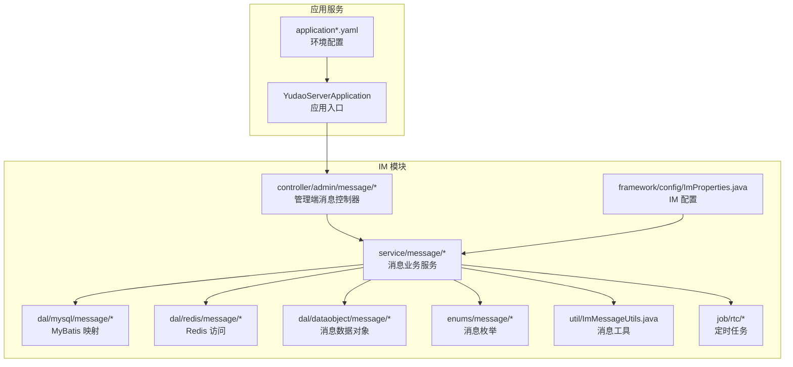
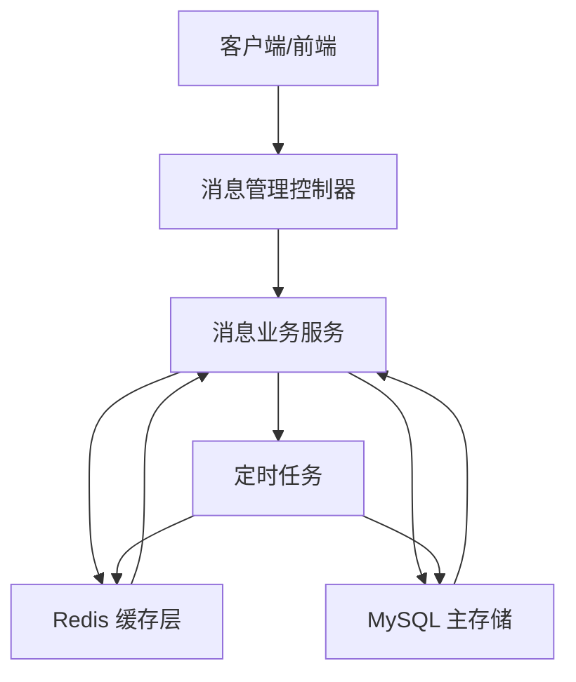
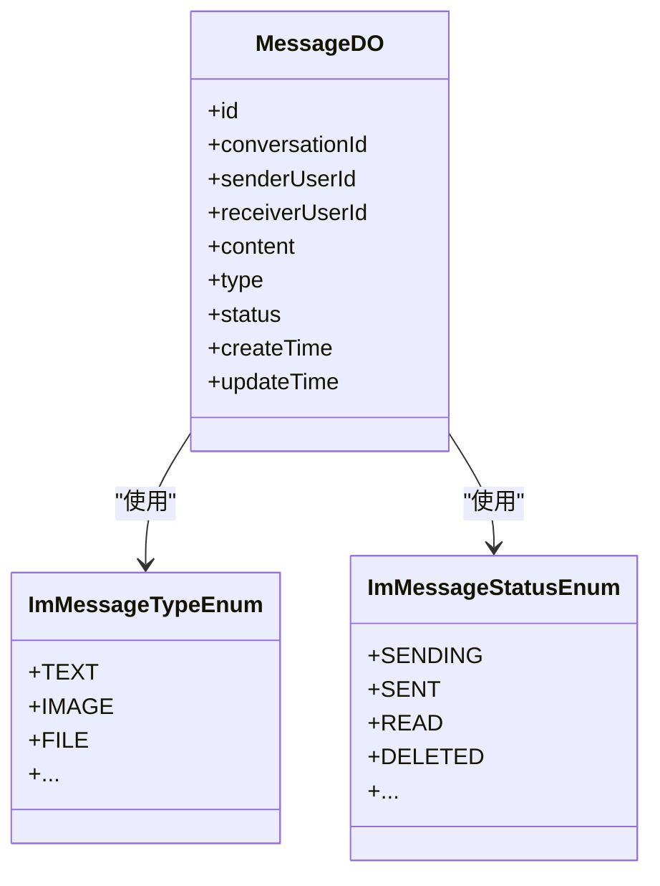
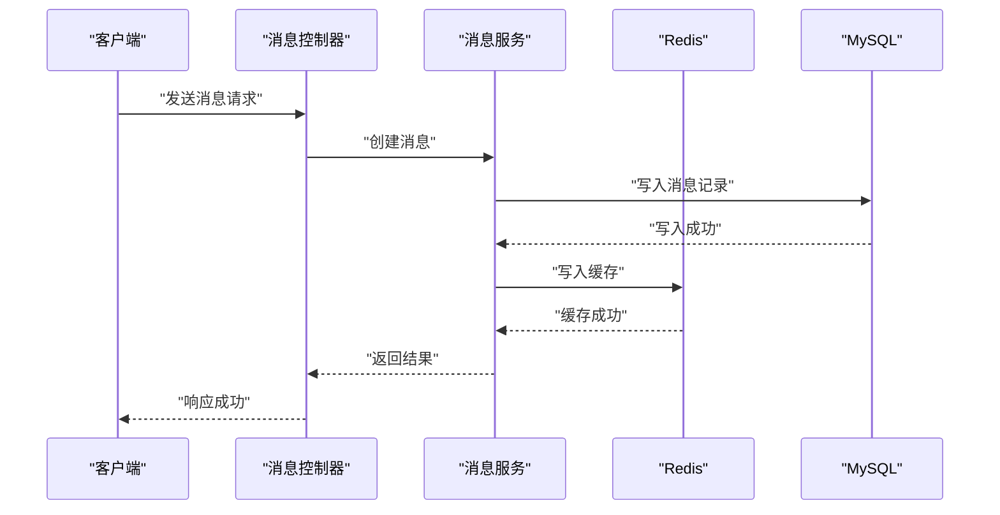
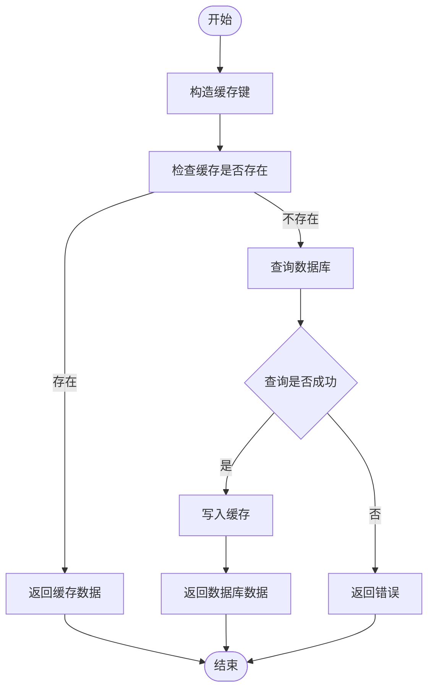
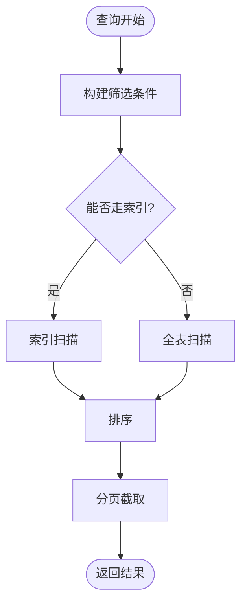
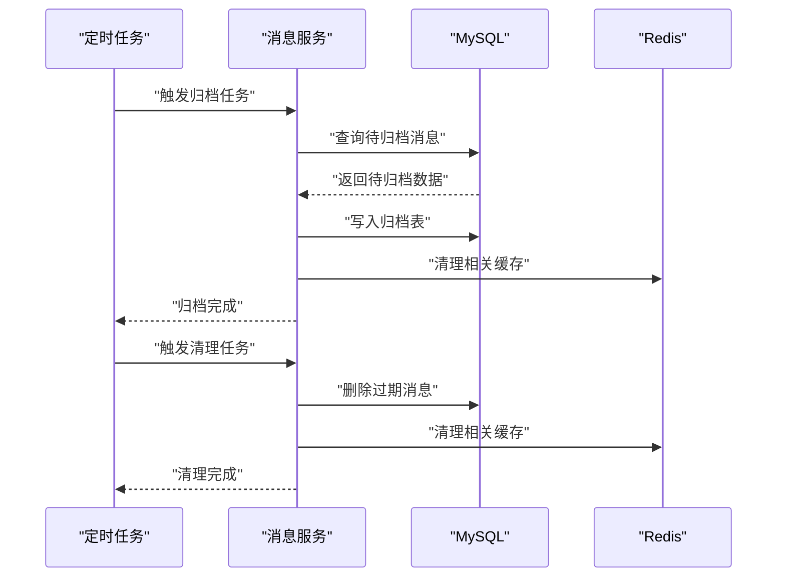
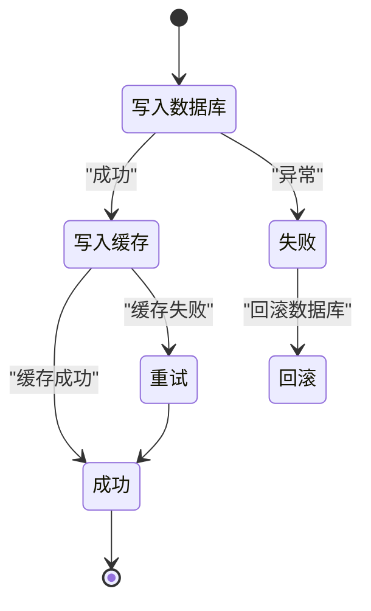
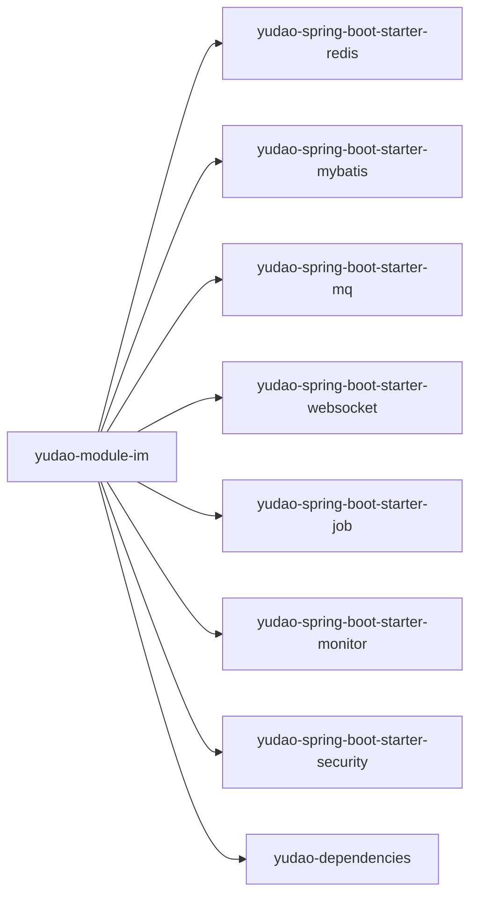

# 消息存储与检索

<cite>
**本文引用的文件**
- [ImMessageUtils.java](file://yudao-module-im/src/main/java/cn/iocoder/yudao/module/im/util/ImMessageUtils.java)
- [ImProperties.java](file://yudao-module-im/src/main/java/cn/iocoder/yudao/module/im/framework/config/ImProperties.java)
- [ImCommonConstants.java](file://yudao-module-im/src/main/java/cn/iocoder/yudao/module/im/enums/ImCommonConstants.java)
- [ImMessageTypeEnum.java](file://yudao-module-im/src/main/java/cn/iocoder/yudao/module/im/enums/message/ImMessageTypeEnum.java)
- [ImMessageStatusEnum.java](file://yudao-module-im/src/main/java/cn/iocoder/yudao/module/im/enums/message/ImMessageStatusEnum.java)
- [message目录结构](file://yudao-module-im/src/main/java/cn/iocoder/yudao/module/im/dal/mysql/message/)
- [message目录结构](file://yudao-module-im/src/main/java/cn/iocoder/yudao/module/im/dal/dataobject/message/)
- [message目录结构](file://yudao-module-im/src/main/java/cn/iocoder/yudao/module/im/dal/redis/message/)
- [message目录结构](file://yudao-module-im/src/main/java/cn/iocoder/yudao/module/im/service/message/)
- [message目录结构](file://yudao-module-im/src/main/java/cn/iocoder/yudao/module/im/controller/admin/message/)
- [message目录结构](file://yudao-module-im/src/main/java/cn/iocoder/yudao/module/im/job/rtc/)
- [RedisKeyConstants.java](file://yudao-module-im/src/main/java/cn/iocoder/yudao/module/im/dal/redis/RedisKeyConstants.java)
- [YudaoServerApplication.java](file://yudao-server/src/main/java/cn/iocoder/yudao/server/YudaoServerApplication.java)
- [application.yaml](file://yudao-server/src/main/resources/application.yaml)
- [application-dev.yaml](file://yudao-server/src/main/resources/application-dev.yaml)
- [application-local.yaml](file://yudao-server/src/main/resources/application-local.yaml)
- [pom.xml](file://yudao-module-im/pom.xml)
- [pom.xml](file://yudao-framework/yudao-spring-boot-starter-redis/pom.xml)
- [pom.xml](file://yudao-framework/yudao-spring-boot-starter-mq/pom.xml)
- [pom.xml](file://yudao-framework/yudao-spring-boot-starter-mybatis/pom.xml)
- [pom.xml](file://yudao-framework/yudao-spring-boot-starter-security/pom.xml)
- [pom.xml](file://yudao-framework/yudao-spring-boot-starter-websocket/pom.xml)
- [pom.xml](file://yudao-framework/yudao-spring-boot-starter-job/pom.xml)
- [pom.xml](file://yudao-framework/yudao-spring-boot-starter-monitor/pom.xml)
- [pom.xml](file://yudao-dependencies/pom.xml)
</cite>

## 目录
1. [简介](#简介)
2. [项目结构](#项目结构)
3. [核心组件](#核心组件)
4. [架构总览](#架构总览)
5. [详细组件分析](#详细组件分析)
6. [依赖关系分析](#依赖关系分析)
7. [性能考虑](#性能考虑)
8. [故障排查指南](#故障排查指南)
9. [结论](#结论)
10. [附录](#附录)

## 简介
本文件面向消息存储与检索系统，围绕消息数据的持久化策略（MySQL主存储 + Redis缓存）、消息索引（时间索引、用户索引、类型索引）、查询优化（分页、条件筛选、排序）、归档与清理机制、一致性保障（分布式事务与数据同步）、备份与恢复策略以及性能监控与容量规划进行系统化技术说明。文档基于实际代码仓库中的 IM 模块进行分析，结合配置文件与依赖声明，给出可操作的实现建议与最佳实践。

## 项目结构
IM 模块采用按领域分层的组织方式：controller 层负责对外接口；service 层承载业务逻辑；dal 层包含 MySQL 数据对象与 MyBatis 映射、Redis 缓存键常量与访问封装；enums 定义消息枚举；framework 提供配置与运行参数；job 提供定时清理任务；util 提供工具方法。



图示来源
- [YudaoServerApplication.java](file://yudao-server/src/main/java/cn/iocoder/yudao/server/YudaoServerApplication.java)
- [application.yaml](file://yudao-server/src/main/resources/application.yaml)
- [application-dev.yaml](file://yudao-server/src/main/resources/application-dev.yaml)
- [application-local.yaml](file://yudao-server/src/main/resources/application-local.yaml)
- [ImProperties.java](file://yudao-module-im/src/main/java/cn/iocoder/yudao/module/im/framework/config/ImProperties.java)
- [message目录结构](file://yudao-module-im/src/main/java/cn/iocoder/yudao/module/im/controller/admin/message/)
- [message目录结构](file://yudao-module-im/src/main/java/cn/iocoder/yudao/module/im/service/message/)
- [message目录结构](file://yudao-module-im/src/main/java/cn/iocoder/yudao/module/im/dal/mysql/message/)
- [message目录结构](file://yudao-module-im/src/main/java/cn/iocoder/yudao/module/im/dal/redis/message/)
- [message目录结构](file://yudao-module-im/src/main/java/cn/iocoder/yudao/module/im/dal/dataobject/message/)
- [ImMessageUtils.java](file://yudao-module-im/src/main/java/cn/iocoder/yudao/module/im/util/ImMessageUtils.java)
- [message目录结构](file://yudao-module-im/src/main/java/cn/iocoder/yudao/module/im/job/rtc/)

章节来源
- [YudaoServerApplication.java](file://yudao-server/src/main/java/cn/iocoder/yudao/server/YudaoServerApplication.java)
- [application.yaml](file://yudao-server/src/main/resources/application.yaml)
- [application-dev.yaml](file://yudao-server/src/main/resources/application-dev.yaml)
- [application-local.yaml](file://yudao-server/src/main/resources/application-local.yaml)
- [ImProperties.java](file://yudao-module-im/src/main/java/cn/iocoder/yudao/module/im/framework/config/ImProperties.java)

## 核心组件
- 消息数据对象与枚举：定义消息表结构、状态、类型等核心字段与取值范围，支撑持久化与查询约束。
- MyBatis 映射层：提供消息 CRUD、分页、条件查询与排序的 SQL 映射。
- Redis 缓存层：提供高频读取场景的缓存命中与过期策略，降低数据库压力。
- 业务服务层：编排持久化与缓存更新、索引维护、归档与清理流程。
- 控制器层：对外暴露消息管理接口，处理请求参数与响应格式。
- 工具类：提供消息 ID 生成、序列化/反序列化、时间戳处理等通用能力。
- 定时任务：清理过期会话、归档历史消息、统计指标等。

章节来源
- [ImCommonConstants.java](file://yudao-module-im/src/main/java/cn/iocoder/yudao/module/im/enums/ImCommonConstants.java)
- [ImMessageTypeEnum.java](file://yudao-module-im/src/main/java/cn/iocoder/yudao/module/im/enums/message/ImMessageTypeEnum.java)
- [ImMessageStatusEnum.java](file://yudao-module-im/src/main/java/cn/iocoder/yudao/module/im/enums/message/ImMessageStatusEnum.java)
- [ImMessageUtils.java](file://yudao-module-im/src/main/java/cn/iocoder/yudao/module/im/util/ImMessageUtils.java)

## 架构总览
消息系统采用“主存储 + 缓存”的双层架构：MySQL 作为强一致的主存储，Redis 作为高吞吐的缓存层。业务通过服务层统一编排，先查缓存，未命中则回源数据库并回填缓存；写入时同时更新数据库与缓存，保证最终一致性。查询侧通过分页、条件筛选与排序优化提升性能；归档与清理通过定时任务在低峰期执行，避免影响在线服务。



图示来源
- [message目录结构](file://yudao-module-im/src/main/java/cn/iocoder/yudao/module/im/controller/admin/message/)
- [message目录结构](file://yudao-module-im/src/main/java/cn/iocoder/yudao/module/im/service/message/)
- [message目录结构](file://yudao-module-im/src/main/java/cn/iocoder/yudao/module/im/dal/redis/message/)
- [message目录结构](file://yudao-module-im/src/main/java/cn/iocoder/yudao/module/im/dal/mysql/message/)
- [message目录结构](file://yudao-module-im/src/main/java/cn/iocoder/yudao/module/im/job/rtc/)

## 详细组件分析

### 消息数据模型与枚举
- 数据模型：消息表包含消息 ID、会话 ID、发送方、接收方、消息内容、类型、状态、时间戳等字段，支持按时间、用户、类型等维度查询。
- 枚举体系：消息类型（文本/图片/文件等）、消息状态（已发送/已签收/已销毁等）、会话类型（单聊/群聊）等，用于约束业务语义与查询过滤。



图示来源
- [message目录结构](file://yudao-module-im/src/main/java/cn/iocoder/yudao/module/im/dal/dataobject/message/)
- [ImMessageTypeEnum.java](file://yudao-module-im/src/main/java/cn/iocoder/yudao/module/im/enums/message/ImMessageTypeEnum.java)
- [ImMessageStatusEnum.java](file://yudao-module-im/src/main/java/cn/iocoder/yudao/module/im/enums/message/ImMessageStatusEnum.java)

章节来源
- [ImCommonConstants.java](file://yudao-module-im/src/main/java/cn/iocoder/yudao/module/im/enums/ImCommonConstants.java)
- [ImMessageTypeEnum.java](file://yudao-module-im/src/main/java/cn/iocoder/yudao/module/im/enums/message/ImMessageTypeEnum.java)
- [ImMessageStatusEnum.java](file://yudao-module-im/src/main/java/cn/iocoder/yudao/module/im/enums/message/ImMessageStatusEnum.java)

### 持久化策略：MySQL 主存储
- 表结构设计：以消息 ID 为主键，配合会话 ID、发送方、接收方、类型、状态、时间戳等字段，满足多维查询需求。
- 写入流程：业务服务接收消息后，先生成消息 ID，写入 MySQL，再写入 Redis 缓存，最后发布内部消息或触发后续处理。
- 读取流程：优先从 Redis 命中，未命中则回源 MySQL 并回填缓存；并发读取时注意缓存失效与热点键问题。
- 删除与归档：软删除标记与归档表分离，定期清理过期数据，避免主表膨胀。



图示来源
- [message目录结构](file://yudao-module-im/src/main/java/cn/iocoder/yudao/module/im/controller/admin/message/)
- [message目录结构](file://yudao-module-im/src/main/java/cn/iocoder/yudao/module/im/service/message/)
- [message目录结构](file://yudao-module-im/src/main/java/cn/iocoder/yudao/module/im/dal/redis/message/)
- [message目录结构](file://yudao-module-im/src/main/java/cn/iocoder/yudao/module/im/dal/mysql/message/)

章节来源
- [message目录结构](file://yudao-module-im/src/main/java/cn/iocoder/yudao/module/im/dal/mysql/message/)
- [message目录结构](file://yudao-module-im/src/main/java/cn/iocoder/yudao/module/im/dal/dataobject/message/)
- [ImMessageUtils.java](file://yudao-module-im/src/main/java/cn/iocoder/yudao/module/im/util/ImMessageUtils.java)

### 缓存策略：Redis 设计
- 键空间设计：采用统一前缀与命名规范，区分消息详情、会话列表、用户离线消息等；为不同数据设置差异化过期时间。
- 缓存命中：读取时先查缓存，未命中回源数据库并回填缓存；写入时同步更新缓存，避免脏读。
- 过期与淘汰：对离线消息、会话快照设置 TTL，防止内存膨胀；对热键采用多级缓存或分片策略。



图示来源
- [message目录结构](file://yudao-module-im/src/main/java/cn/iocoder/yudao/module/im/dal/redis/message/)
- [RedisKeyConstants.java](file://yudao-module-im/src/main/java/cn/iocoder/yudao/module/im/dal/redis/RedisKeyConstants.java)

章节来源
- [message目录结构](file://yudao-module-im/src/main/java/cn/iocoder/yudao/module/im/dal/redis/message/)
- [RedisKeyConstants.java](file://yudao-module-im/src/main/java/cn/iocoder/yudao/module/im/dal/redis/RedisKeyConstants.java)

### 索引建立与维护
- 时间索引：按创建时间建立索引，支持按时间段查询与分页；建议复合索引覆盖会话 + 时间。
- 用户索引：按发送方/接收方建立索引，支持用户维度的快速检索；可考虑分区表按时间分桶。
- 类型索引：按消息类型建立索引，便于条件筛选；与时间索引组合提升查询效率。
- 维护策略：定期重建失效索引、统计信息更新、热点表拆分与分区。

```mermaid
erDiagram
MESSAGE {
bigint id PK
varchar conversationId
bigint senderUserId
bigint receiverUserId
int type
int status
datetime createTime
datetime updateTime
}
INDEX_TIME["idx_create_time"] ||--o{ MESSAGE : "按时间索引"
INDEX_USER["idx_sender_receiver"] ||--o{ MESSAGE : "按用户索引"
INDEX_TYPE["idx_type"] ||--o{ MESSAGE : "按类型索引"
```

图示来源
- [message目录结构](file://yudao-module-im/src/main/java/cn/iocoder/yudao/module/im/dal/mysql/message/)
- [message目录结构](file://yudao-module-im/src/main/java/cn/iocoder/yudao/module/im/dal/dataobject/message/)

章节来源
- [message目录结构](file://yudao-module-im/src/main/java/cn/iocoder/yudao/module/im/dal/mysql/message/)
- [message目录结构](file://yudao-module-im/src/main/java/cn/iocoder/yudao/module/im/dal/dataobject/message/)

### 查询优化：分页、筛选与排序
- 分页查询：基于游标或时间戳 + 主键的组合分页，避免深度分页导致的性能问题；缓存分页边界。
- 条件筛选：利用索引覆盖常见筛选条件（用户、类型、状态），减少全表扫描。
- 排序性能：优先使用索引列排序；对多维排序考虑复合索引；必要时引入物化视图或汇总表。



图示来源
- [message目录结构](file://yudao-module-im/src/main/java/cn/iocoder/yudao/module/im/dal/mysql/message/)

章节来源
- [message目录结构](file://yudao-module-im/src/main/java/cn/iocoder/yudao/module/im/dal/mysql/message/)

### 归档与清理机制
- 归档策略：将历史消息迁移到归档表或冷存储，保留最近 N 天的热数据在主表；归档周期可按月/季度调整。
- 清理策略：删除超期或标记删除的消息，释放存储空间；清理任务在低峰期执行，避免影响在线服务。
- 统计与监控：记录归档/清理数量、耗时与成功率，形成运维报表。



图示来源
- [message目录结构](file://yudao-module-im/src/main/java/cn/iocoder/yudao/module/im/job/rtc/)
- [message目录结构](file://yudao-module-im/src/main/java/cn/iocoder/yudao/module/im/service/message/)
- [message目录结构](file://yudao-module-im/src/main/java/cn/iocoder/yudao/module/im/dal/mysql/message/)
- [message目录结构](file://yudao-module-im/src/main/java/cn/iocoder/yudao/module/im/dal/redis/message/)

章节来源
- [message目录结构](file://yudao-module-im/src/main/java/cn/iocoder/yudao/module/im/job/rtc/)
- [message目录结构](file://yudao-module-im/src/main/java/cn/iocoder/yudao/module/im/service/message/)

### 一致性保证：分布式事务与数据同步
- 最终一致性：写入数据库成功后，异步更新缓存；若缓存失败，通过重试与补偿机制保证一致性。
- 幂等设计：消息 ID 唯一，重复写入不产生副作用；消费端幂等处理，避免重复投递。
- 同步与异步：强一致写入使用本地事务；缓存更新与外部通知采用异步，降低延迟。



图示来源
- [message目录结构](file://yudao-module-im/src/main/java/cn/iocoder/yudao/module/im/service/message/)
- [message目录结构](file://yudao-module-im/src/main/java/cn/iocoder/yudao/module/im/dal/mysql/message/)
- [message目录结构](file://yudao-module-im/src/main/java/cn/iocoder/yudao/module/im/dal/redis/message/)

章节来源
- [message目录结构](file://yudao-module-im/src/main/java/cn/iocoder/yudao/module/im/service/message/)

### 备份与恢复策略
- 备份方案：数据库每日全备 + 增量备份，Redis 使用 RDB/AOF 或集群快照；归档数据异地容灾。
- 恢复演练：定期进行备份验证与恢复演练，验证备份完整性与恢复时效。
- 故障切换：主从切换、跨机房容灾，确保消息服务高可用。

章节来源
- [application.yaml](file://yudao-server/src/main/resources/application.yaml)
- [application-dev.yaml](file://yudao-server/src/main/resources/application-dev.yaml)
- [application-local.yaml](file://yudao-server/src/main/resources/application-local.yaml)

### 性能监控与容量规划
- 监控指标：QPS、P99 延迟、缓存命中率、数据库连接数、慢查询、归档/清理耗时。
- 告警阈值：针对延迟、错误率、缓存命中率下降、磁盘空间告警设定阈值。
- 容量规划：根据消息增长趋势、峰值 QPS、缓存命中率与存储成本进行容量评估与扩容。

章节来源
- [pom.xml](file://yudao-framework/yudao-spring-boot-starter-monitor/pom.xml)
- [ImProperties.java](file://yudao-module-im/src/main/java/cn/iocoder/yudao/module/im/framework/config/ImProperties.java)

## 依赖关系分析
IM 模块依赖于框架层的 Redis、MyBatis、WebSocket、定时任务与监控组件，整体通过 Maven 依赖管理统一版本与特性开关。



图示来源
- [pom.xml](file://yudao-module-im/pom.xml)
- [pom.xml](file://yudao-framework/yudao-spring-boot-starter-redis/pom.xml)
- [pom.xml](file://yudao-framework/yudao-spring-boot-starter-mq/pom.xml)
- [pom.xml](file://yudao-framework/yudao-spring-boot-starter-mybatis/pom.xml)
- [pom.xml](file://yudao-framework/yudao-spring-boot-starter-websocket/pom.xml)
- [pom.xml](file://yudao-framework/yudao-spring-boot-starter-job/pom.xml)
- [pom.xml](file://yudao-framework/yudao-spring-boot-starter-monitor/pom.xml)
- [pom.xml](file://yudao-framework/yudao-spring-boot-starter-security/pom.xml)
- [pom.xml](file://yudao-dependencies/pom.xml)

章节来源
- [pom.xml](file://yudao-module-im/pom.xml)
- [pom.xml](file://yudao-framework/yudao-spring-boot-starter-redis/pom.xml)
- [pom.xml](file://yudao-framework/yudao-spring-boot-starter-mq/pom.xml)
- [pom.xml](file://yudao-framework/yudao-spring-boot-starter-mybatis/pom.xml)
- [pom.xml](file://yudao-framework/yudao-spring-boot-starter-websocket/pom.xml)
- [pom.xml](file://yudao-framework/yudao-spring-boot-starter-job/pom.xml)
- [pom.xml](file://yudao-framework/yudao-spring-boot-starter-monitor/pom.xml)
- [pom.xml](file://yudao-framework/yudao-spring-boot-starter-security/pom.xml)
- [pom.xml](file://yudao-dependencies/pom.xml)

## 性能考虑
- 读写分离：热点消息读取走缓存，写入走数据库；对写密集场景控制缓存更新频率。
- 索引优化：合理建立复合索引，避免选择性差的单列索引；定期分析慢查询日志。
- 分页优化：使用基于时间戳与主键的游标分页，避免 OFFSET 深分页。
- 缓存策略：对冷数据设置短 TTL，对热数据采用多级缓存与预热；热点键分片。
- 归档与清理：定期归档历史数据，清理过期消息，保持主表规模可控。

## 故障排查指南
- 缓存未命中：检查键空间命名、TTL 设置与过期策略；确认回源数据库路径。
- 写入失败：检查数据库连接、事务提交与异常回滚；核对幂等标识。
- 查询缓慢：分析慢查询日志，确认索引使用情况；评估分页策略与排序字段。
- 归档/清理异常：检查定时任务调度与日志输出；核对目标表结构与权限。

章节来源
- [message目录结构](file://yudao-module-im/src/main/java/cn/iocoder/yudao/module/im/dal/redis/message/)
- [message目录结构](file://yudao-module-im/src/main/java/cn/iocoder/yudao/module/im/dal/mysql/message/)
- [message目录结构](file://yudao-module-im/src/main/java/cn/iocoder/yudao/module/im/job/rtc/)

## 结论
本消息存储与检索系统通过“MySQL + Redis”的双层架构实现了高可靠与高性能的消息持久化与检索。通过合理的索引设计、查询优化、归档清理与一致性保障机制，系统能够在高并发场景下稳定运行。结合完善的监控与容量规划，可进一步提升系统的可维护性与扩展性。

## 附录
- 配置参考：IM 配置项、Redis 连接参数、MyBatis 扫描路径、定时任务调度等。
- 枚举参考：消息类型、状态、会话类型等枚举定义与取值范围。
- 工具参考：消息 ID 生成、序列化/反序列化、时间戳处理等工具方法。

章节来源
- [ImProperties.java](file://yudao-module-im/src/main/java/cn/iocoder/yudao/module/im/framework/config/ImProperties.java)
- [ImCommonConstants.java](file://yudao-module-im/src/main/java/cn/iocoder/yudao/module/im/enums/ImCommonConstants.java)
- [ImMessageTypeEnum.java](file://yudao-module-im/src/main/java/cn/iocoder/yudao/module/im/enums/message/ImMessageTypeEnum.java)
- [ImMessageStatusEnum.java](file://yudao-module-im/src/main/java/cn/iocoder/yudao/module/im/enums/message/ImMessageStatusEnum.java)
- [ImMessageUtils.java](file://yudao-module-im/src/main/java/cn/iocoder/yudao/module/im/util/ImMessageUtils.java)