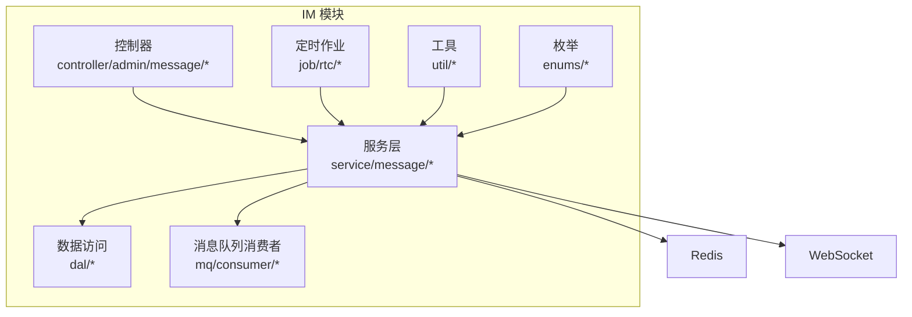
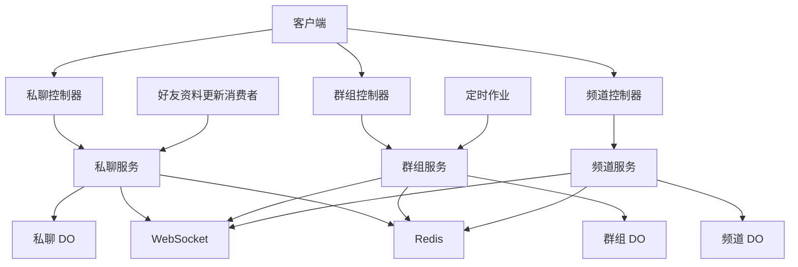
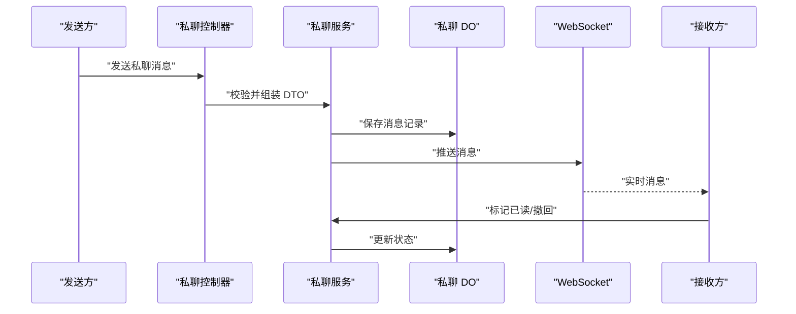
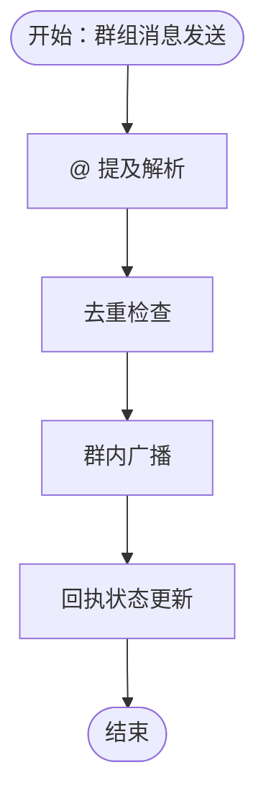
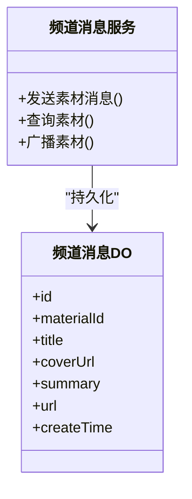
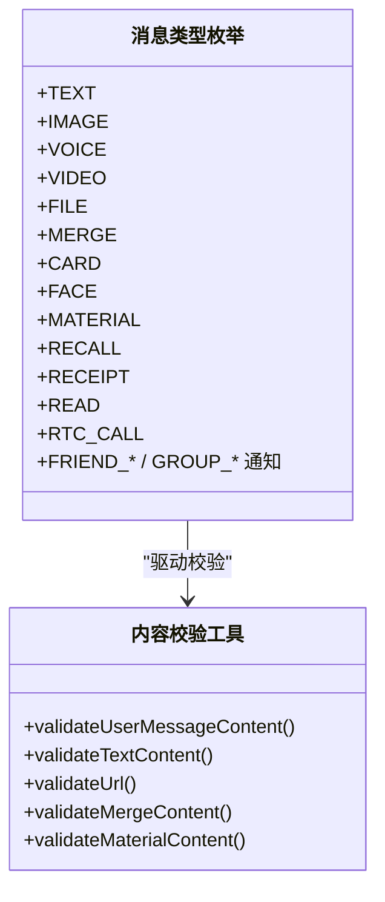
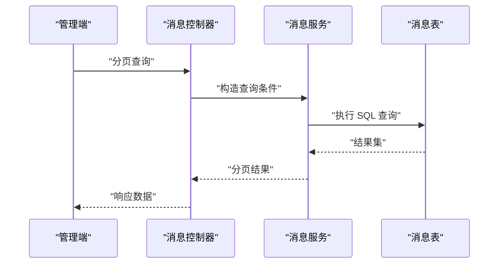
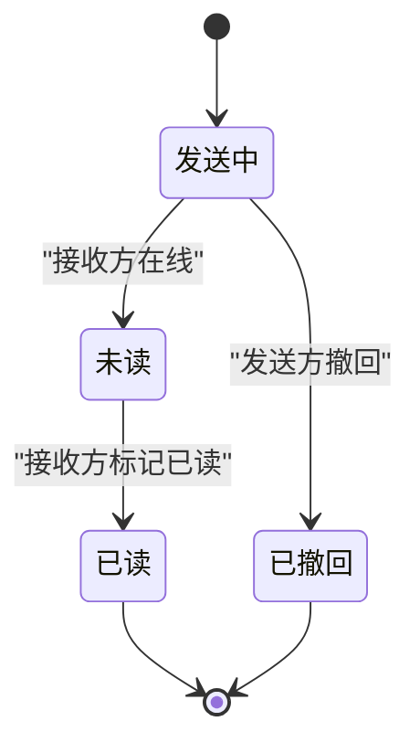
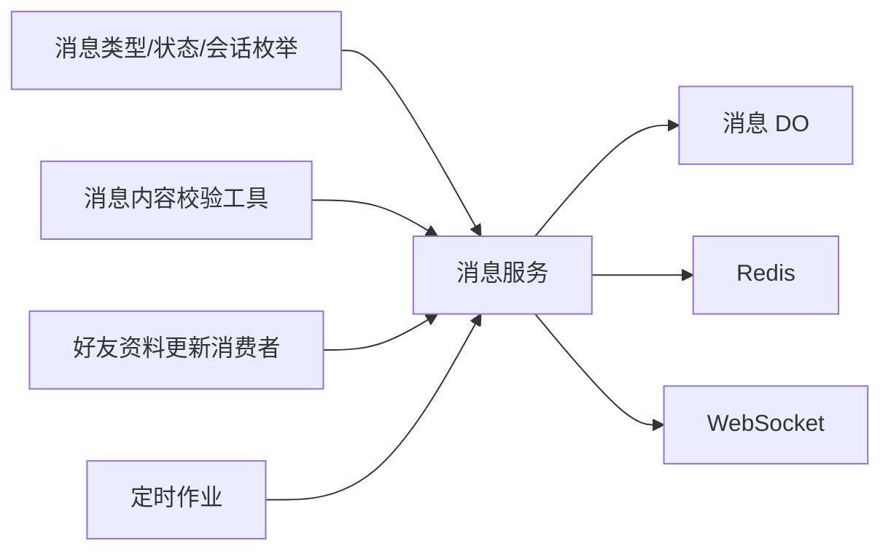

# 消息管理系统

<cite>
**本文档引用的文件**
- [ImMessageTypeEnum.java](file://yudao-module-im/src/main/java/cn/iocoder/yudao/module/im/enums/message/ImMessageTypeEnum.java)
- [ImMessageStatusEnum.java](file://yudao-module-im/src/main/java/cn/iocoder/yudao/module/im/enums/message/ImMessageStatusEnum.java)
- [ImGroupMessageReceiptStatusEnum.java](file://yudao-module-im/src/main/java/cn/iocoder/yudao/module/im/enums/message/ImGroupMessageReceiptStatusEnum.java)
- [ImConversationTypeEnum.java](file://yudao-module-im/src/main/java/cn/iocoder/yudao/module/im/enums/ImConversationTypeEnum.java)
- [ImMessageUtils.java](file://yudao-module-im/src/main/java/cn/iocoder/yudao/module/im/util/ImMessageUtils.java)
- [ImPrivateMessageService.java](file://yudao-module-im/src/main/java/cn/iocoder/yudao/module/im/service/message/ImPrivateMessageService.java)
- [ImPrivateMessageServiceImpl.java](file://yudao-module-im/src/main/java/cn/iocoder/yudao/module/im/service/message/ImPrivateMessageServiceImpl.java)
- [ImGroupMessageService.java](file://yudao-module-im/src/main/java/cn/iocoder/yudao/module/im/service/message/ImGroupMessageService.java)
- [ImGroupMessageServiceImpl.java](file://yudao-module-im/src/main/java/cn/iocoder/yudao/module/im/service/message/ImGroupMessageServiceImpl.java)
- [ImChannelMessageService.java](file://yudao-module-im/src/main/java/cn/iocoder/yudao/module/im/service/message/ImChannelMessageService.java)
- [ImChannelMessageServiceImpl.java](file://yudao-module-im/src/main/java/cn/iocoder/yudao/module/im/service/message/ImChannelMessageServiceImpl.java)
- [ImPrivateMessageDO.java](file://yudao-module-im/src/main/java/cn/iocoder/yudao/module/im/dal/dataobject/message/ImPrivateMessageDO.java)
- [ImGroupMessageDO.java](file://yudao-module-im/src/main/java/cn/iocoder/yudao/module/im/dal/dataobject/message/ImGroupMessageDO.java)
- [ImChannelMessageDO.java](file://yudao-module-im/src/main/java/cn/iocoder/yudao/module/im/dal/dataobject/message/ImChannelMessageDO.java)
- [ImPrivateMessageController.java](file://yudao-module-im/src/main/java/cn/iocoder/yudao/module/im/controller/admin/message/ImPrivateMessageController.java)
- [ImGroupMessageController.java](file://yudao-module-im/src/main/java/cn/iocoder/yudao/module/im/controller/admin/message/ImGroupMessageController.java)
- [ImChannelMessageController.java](file://yudao-module-im/src/main/java/cn/iocoder/yudao/module/im/controller/admin/message/ImChannelMessageController.java)
- [ImPrivateMessageSendDTO.java](file://yudao-module-im/src/main/java/cn/iocoder/yudao/module/im/service/message/dto/ImPrivateMessageSendDTO.java)
- [ImGroupMessageSendDTO.java](file://yudao-module-im/src/main/java/cn/iocoder/yudao/module/im/service/message/dto/ImGroupMessageSendDTO.java)
- [RedisKeyConstants.java](file://yudao-module-im/src/main/java/cn/iocoder/yudao/module/im/dal/redis/RedisKeyConstants.java)
- [ImRtcCallCleanupJob.java](file://yudao-module-im/src/main/java/cn/iocoder/yudao/module/im/job/rtc/ImRtcCallCleanupJob.java)
- [ImRtcParticipantTimeoutJob.java](file://yudao-module-im/src/main/java/cn/iocoder/yudao/module/im/job/rtc/ImRtcParticipantTimeoutJob.java)
- [AdminUserProfileUpdateConsumer.java](file://yudao-module-im/src/main/java/cn/iocoder/yudao/module/im/mq/consumer/friend/AdminUserProfileUpdateConsumer.java)
</cite>

## 目录
1. [简介](#简介)
2. [项目结构](#项目结构)
3. [核心组件](#核心组件)
4. [架构总览](#架构总览)
5. [详细组件分析](#详细组件分析)
6. [依赖分析](#依赖分析)
7. [性能考虑](#性能考虑)
8. [故障排查指南](#故障排查指南)
9. [结论](#结论)
10. [附录](#附录)

## 简介
本文件面向消息管理系统的全面技术文档，聚焦私聊消息、群组消息与频道消息的实现，涵盖消息类型体系、发送接收确认与回执机制、消息去重策略、持久化与索引、检索接口、状态管理（已读/未读/撤回/删除/历史）、以及安全机制（敏感词过滤与内容审核）。系统采用模块化设计，基于 Spring Boot 与 MyBatis Plus，结合 Redis 与 WebSocket 实现高性能消息流转与状态同步。

## 项目结构
IM 模块位于 yudao-module-im，主要目录与职责如下：
- enums：消息类型、状态、会话类型等枚举定义
- service/message：消息服务层（私聊/群组/频道）
- dal/dataobject/message：消息 DO（私聊/群组/频道）
- controller/admin/message：消息管理端控制器
- util：消息内容校验与引用消息工具
- dal/redis：Redis 键常量与已读游标等
- job/rtc：实时通话清理与超时作业
- mq/consumer：消息队列消费者（如好友资料更新）

**图表来源**
- [ImPrivateMessageService.java](file://yudao-module-im/src/main/java/cn/iocoder/yudao/module/im/service/message/ImPrivateMessageService.java)
- [ImGroupMessageService.java](file://yudao-module-im/src/main/java/cn/iocoder/yudao/module/im/service/message/ImGroupMessageService.java)
- [ImChannelMessageService.java](file://yudao-module-im/src/main/java/cn/iocoder/yudao/module/im/service/message/ImChannelMessageService.java)
- [ImPrivateMessageDO.java](file://yudao-module-im/src/main/java/cn/iocoder/yudao/module/im/dal/dataobject/message/ImPrivateMessageDO.java)
- [ImGroupMessageDO.java](file://yudao-module-im/src/main/java/cn/iocoder/yudao/module/im/dal/dataobject/message/ImGroupMessageDO.java)
- [ImChannelMessageDO.java](file://yudao-module-im/src/main/java/cn/iocoder/yudao/module/im/dal/dataobject/message/ImChannelMessageDO.java)
- [RedisKeyConstants.java](file://yudao-module-im/src/main/java/cn/iocoder/yudao/module/im/dal/redis/RedisKeyConstants.java)

**章节来源**
- [ImMessageTypeEnum.java:1-427](file://yudao-module-im/src/main/java/cn/iocoder/yudao/module/im/enums/message/ImMessageTypeEnum.java#L1-L427)
- [ImMessageStatusEnum.java:1-42](file://yudao-module-im/src/main/java/cn/iocoder/yudao/module/im/enums/message/ImMessageStatusEnum.java#L1-L42)
- [ImGroupMessageReceiptStatusEnum.java:1-40](file://yudao-module-im/src/main/java/cn/iocoder/yudao/module/im/enums/message/ImGroupMessageReceiptStatusEnum.java#L1-L40)
- [ImConversationTypeEnum.java:1-52](file://yudao-module-im/src/main/java/cn/iocoder/yudao/module/im/enums/ImConversationTypeEnum.java#L1-L52)

## 核心组件
- 消息类型体系：支持文本、图片、语音、视频、文件、合并转发、名片、表情、素材、撤回、回执、已读、通话信令、好友/群组通知等
- 会话类型：私聊、群聊、频道
- 消息状态：发送中、未读、已撤回、已读
- 群组消息回执：不需要回执、待完成、已完成
- 内容校验与引用：统一的内容格式校验、引用消息构建与注入
- 服务层：私聊/群组/频道消息服务，负责发送、广播、去重、状态更新
- 数据层：私聊/群组/频道消息 DO，配合 MyBatis Plus 存储
- 缓存层：Redis 用于已读游标、群组消息置顶、频道素材等
- 传输层：WebSocket 用于实时推送；定时作业清理通话状态

**章节来源**
- [ImMessageTypeEnum.java:20-427](file://yudao-module-im/src/main/java/cn/iocoder/yudao/module/im/enums/message/ImMessageTypeEnum.java#L20-L427)
- [ImMessageStatusEnum.java:19-42](file://yudao-module-im/src/main/java/cn/iocoder/yudao/module/im/enums/message/ImMessageStatusEnum.java#L19-L42)
- [ImGroupMessageReceiptStatusEnum.java:16-40](file://yudao-module-im/src/main/java/cn/iocoder/yudao/module/im/enums/message/ImGroupMessageReceiptStatusEnum.java#L16-L40)
- [ImConversationTypeEnum.java:17-52](file://yudao-module-im/src/main/java/cn/iocoder/yudao/module/im/enums/ImConversationTypeEnum.java#L17-L52)
- [ImMessageUtils.java:20-219](file://yudao-module-im/src/main/java/cn/iocoder/yudao/module/im/util/ImMessageUtils.java#L20-L219)

## 架构总览
消息系统采用“控制器-服务-数据访问-缓存/传输”的分层架构。消息发送通过 DTO 校验后进入服务层，根据会话类型选择私聊/群组/频道处理路径；私聊消息持久化并推送至接收方；群组消息进行广播与去重；频道消息走素材推送；状态与回执通过 Redis 游标与专用存储维护；WebSocket 实时推送；定时作业清理通话状态。

**图表来源**
- [ImPrivateMessageController.java](file://yudao-module-im/src/main/java/cn/iocoder/yudao/module/im/controller/admin/message/ImPrivateMessageController.java)
- [ImGroupMessageController.java](file://yudao-module-im/src/main/java/cn/iocoder/yudao/module/im/controller/admin/message/ImGroupMessageController.java)
- [ImChannelMessageController.java](file://yudao-module-im/src/main/java/cn/iocoder/yudao/module/im/controller/admin/message/ImChannelMessageController.java)
- [ImPrivateMessageServiceImpl.java](file://yudao-module-im/src/main/java/cn/iocoder/yudao/module/im/service/message/ImPrivateMessageServiceImpl.java)
- [ImGroupMessageServiceImpl.java](file://yudao-module-im/src/main/java/cn/iocoder/yudao/module/im/service/message/ImGroupMessageServiceImpl.java)
- [ImChannelMessageServiceImpl.java](file://yudao-module-im/src/main/java/cn/iocoder/yudao/module/im/service/message/ImChannelMessageServiceImpl.java)
- [RedisKeyConstants.java](file://yudao-module-im/src/main/java/cn/iocoder/yudao/module/im/dal/redis/RedisKeyConstants.java)
- [AdminUserProfileUpdateConsumer.java](file://yudao-module-im/src/main/java/cn/iocoder/yudao/module/im/mq/consumer/friend/AdminUserProfileUpdateConsumer.java)
- [ImRtcCallCleanupJob.java](file://yudao-module-im/src/main/java/cn/iocoder/yudao/module/im/job/rtc/ImRtcCallCleanupJob.java)
- [ImRtcParticipantTimeoutJob.java](file://yudao-module-im/src/main/java/cn/iocoder/yudao/module/im/job/rtc/ImRtcParticipantTimeoutJob.java)

## 详细组件分析

### 私聊消息实现
- 发送流程：控制器接收发送请求，封装为私聊发送 DTO，服务层执行校验与落库，随后通过 WebSocket 推送给接收方
- 接收确认与回执：私聊使用消息状态枚举，支持发送中、未读、已撤回、已读；已读通过 Redis 游标维护
- 去重策略：基于消息 ID 或幂等键进行去重，避免重复投递导致的重复显示
- 持久化：私聊消息 DO 映射到数据库表，包含发送方、接收方、消息类型、内容、时间戳、状态等字段

**图表来源**
- [ImPrivateMessageController.java](file://yudao-module-im/src/main/java/cn/iocoder/yudao/module/im/controller/admin/message/ImPrivateMessageController.java)
- [ImPrivateMessageServiceImpl.java](file://yudao-module-im/src/main/java/cn/iocoder/yudao/module/im/service/message/ImPrivateMessageServiceImpl.java)
- [ImPrivateMessageDO.java](file://yudao-module-im/src/main/java/cn/iocoder/yudao/module/im/dal/dataobject/message/ImPrivateMessageDO.java)
- [ImMessageStatusEnum.java:19-42](file://yudao-module-im/src/main/java/cn/iocoder/yudao/module/im/enums/message/ImMessageStatusEnum.java#L19-L42)

**章节来源**
- [ImPrivateMessageService.java](file://yudao-module-im/src/main/java/cn/iocoder/yudao/module/im/service/message/ImPrivateMessageService.java)
- [ImPrivateMessageServiceImpl.java](file://yudao-module-im/src/main/java/cn/iocoder/yudao/module/im/service/message/ImPrivateMessageServiceImpl.java)
- [ImPrivateMessageDO.java](file://yudao-module-im/src/main/java/cn/iocoder/yudao/module/im/dal/dataobject/message/ImPrivateMessageDO.java)
- [ImMessageStatusEnum.java:19-42](file://yudao-module-im/src/main/java/cn/iocoder/yudao/module/im/enums/message/ImMessageStatusEnum.java#L19-L42)

### 群组消息处理
- 广播与去重：群组消息服务负责将消息广播至群成员，使用去重策略避免重复投递
- @提及：消息内容支持 @ 提及，服务层解析并触发定向提醒
- 回执机制：群组消息回执状态枚举支持不需要回执、待完成、已完成三种状态
- 置顶与公告：支持群消息置顶/取消置顶，群公告变更等通知

**图表来源**
- [ImGroupMessageServiceImpl.java](file://yudao-module-im/src/main/java/cn/iocoder/yudao/module/im/service/message/ImGroupMessageServiceImpl.java)
- [ImGroupMessageReceiptStatusEnum.java:16-40](file://yudao-module-im/src/main/java/cn/iocoder/yudao/module/im/enums/message/ImGroupMessageReceiptStatusEnum.java#L16-L40)

**章节来源**
- [ImGroupMessageService.java](file://yudao-module-im/src/main/java/cn/iocoder/yudao/module/im/service/message/ImGroupMessageService.java)
- [ImGroupMessageServiceImpl.java](file://yudao-module-im/src/main/java/cn/iocoder/yudao/module/im/service/message/ImGroupMessageServiceImpl.java)
- [ImGroupMessageDO.java](file://yudao-module-im/src/main/java/cn/iocoder/yudao/module/im/dal/dataobject/message/ImGroupMessageDO.java)
- [ImGroupMessageReceiptStatusEnum.java:16-40](file://yudao-module-im/src/main/java/cn/iocoder/yudao/module/im/enums/message/ImGroupMessageReceiptStatusEnum.java#L16-L40)

### 频道消息与素材
- 素材消息：频道消息类型支持素材消息，包含标题、封面、摘要、链接等字段
- Redis 素材缓存：素材内容通过 Redis 缓存，提升加载效率
- 控制器与服务：频道消息控制器与服务负责素材消息的创建、查询与推送

**图表来源**
- [ImChannelMessageServiceImpl.java](file://yudao-module-im/src/main/java/cn/iocoder/yudao/module/im/service/message/ImChannelMessageServiceImpl.java)
- [ImChannelMessageDO.java](file://yudao-module-im/src/main/java/cn/iocoder/yudao/module/im/dal/dataobject/message/ImChannelMessageDO.java)
- [RedisKeyConstants.java](file://yudao-module-im/src/main/java/cn/iocoder/yudao/module/im/dal/redis/RedisKeyConstants.java)

**章节来源**
- [ImChannelMessageService.java](file://yudao-module-im/src/main/java/cn/iocoder/yudao/module/im/service/message/ImChannelMessageService.java)
- [ImChannelMessageServiceImpl.java](file://yudao-module-im/src/main/java/cn/iocoder/yudao/module/im/service/message/ImChannelMessageServiceImpl.java)
- [ImChannelMessageDO.java](file://yudao-module-im/src/main/java/cn/iocoder/yudao/module/im/dal/dataobject/message/ImChannelMessageDO.java)
- [RedisKeyConstants.java](file://yudao-module-im/src/main/java/cn/iocoder/yudao/module/im/dal/redis/RedisKeyConstants.java)

### 消息类型系统
- 文本：包含纯文本内容，长度限制与非法字符检测
- 图片/表情：包含 URL 与类型校验
- 语音：包含 URL 与时长（正数）
- 视频：包含 URL
- 文件：包含 URL 与文件名
- 合并转发：包含标题与消息列表，数量上限控制
- 名片：包含目标类型与 ID、名称
- 素材：包含素材 ID 或标题，URL 长度与协议白名单校验
- 信号与通知：撤回、回执、已读、通话信令、好友/群组通知等

**图表来源**
- [ImMessageTypeEnum.java:20-427](file://yudao-module-im/src/main/java/cn/iocoder/yudao/module/im/enums/message/ImMessageTypeEnum.java#L20-L427)
- [ImMessageUtils.java:41-150](file://yudao-module-im/src/main/java/cn/iocoder/yudao/module/im/util/ImMessageUtils.java#L41-L150)

**章节来源**
- [ImMessageTypeEnum.java:20-427](file://yudao-module-im/src/main/java/cn/iocoder/yudao/module/im/enums/message/ImMessageTypeEnum.java#L20-L427)
- [ImMessageUtils.java:20-219](file://yudao-module-im/src/main/java/cn/iocoder/yudao/module/im/util/ImMessageUtils.java#L20-L219)

### 消息检索接口
- 私聊：支持分页查询、按发送方/接收方过滤、按消息类型筛选、按时间范围排序
- 群组：支持按群组 ID 查询、按消息类型筛选、按时间范围排序
- 频道：支持按素材 ID 查询、按标题模糊匹配、分页与排序
- 条件筛选：消息类型、时间区间、关键词（如 @ 提及）、状态（未读/已读/撤回）

**图表来源**
- [ImPrivateMessageController.java](file://yudao-module-im/src/main/java/cn/iocoder/yudao/module/im/controller/admin/message/ImPrivateMessageController.java)
- [ImGroupMessageController.java](file://yudao-module-im/src/main/java/cn/iocoder/yudao/module/im/controller/admin/message/ImGroupMessageController.java)
- [ImChannelMessageController.java](file://yudao-module-im/src/main/java/cn/iocoder/yudao/module/im/controller/admin/message/ImChannelMessageController.java)

**章节来源**
- [ImPrivateMessageController.java](file://yudao-module-im/src/main/java/cn/iocoder/yudao/module/im/controller/admin/message/ImPrivateMessageController.java)
- [ImGroupMessageController.java](file://yudao-module-im/src/main/java/cn/iocoder/yudao/module/im/controller/admin/message/ImGroupMessageController.java)
- [ImChannelMessageController.java](file://yudao-module-im/src/main/java/cn/iocoder/yudao/module/im/controller/admin/message/ImChannelMessageController.java)

### 消息状态管理
- 私聊：发送中、未读、已撤回、已读；已读通过 Redis 游标维护
- 群聊：发送中、未读（初始状态）、已撤回；已读通过 Redis 已读位置实现
- 历史记录：消息状态变更与回执均持久化，支持历史查询与审计

**图表来源**
- [ImMessageStatusEnum.java:19-42](file://yudao-module-im/src/main/java/cn/iocoder/yudao/module/im/enums/message/ImMessageStatusEnum.java#L19-L42)
- [RedisKeyConstants.java](file://yudao-module-im/src/main/java/cn/iocoder/yudao/module/im/dal/redis/RedisKeyConstants.java)

**章节来源**
- [ImMessageStatusEnum.java:19-42](file://yudao-module-im/src/main/java/cn/iocoder/yudao/module/im/enums/message/ImMessageStatusEnum.java#L19-L42)
- [RedisKeyConstants.java](file://yudao-module-im/src/main/java/cn/iocoder/yudao/module/im/dal/redis/RedisKeyConstants.java)

### 消息安全机制
- 敏感词过滤：消息内容在入库前进行敏感词过滤与拦截
- 内容审核：对图片、视频、文件等多媒体内容进行合规性校验
- URL 白名单：禁止 javascript:、data:、vbscript:、file: 等危险协议
- 引用消息防嵌套：引用消息内容去除嵌套引用，防止深度注入

**章节来源**
- [ImMessageUtils.java:141-150](file://yudao-module-im/src/main/java/cn/iocoder/yudao/module/im/util/ImMessageUtils.java#L141-L150)
- [ImMessageUtils.java:177-202](file://yudao-module-im/src/main/java/cn/iocoder/yudao/module/im/util/ImMessageUtils.java#L177-L202)

## 依赖分析
- 服务层依赖：消息服务依赖数据访问层、Redis、WebSocket、消息队列消费者
- 枚举与工具：消息类型、状态、会话类型与内容校验工具贯穿服务层
- 定时作业：通话清理与参与者超时作业依赖服务层进行状态清理
- 消息队列：好友资料更新消费者触发私聊通知推送

**图表来源**
- [ImMessageTypeEnum.java:20-427](file://yudao-module-im/src/main/java/cn/iocoder/yudao/module/im/enums/message/ImMessageTypeEnum.java#L20-L427)
- [ImMessageStatusEnum.java:19-42](file://yudao-module-im/src/main/java/cn/iocoder/yudao/module/im/enums/message/ImMessageStatusEnum.java#L19-L42)
- [ImMessageUtils.java:20-219](file://yudao-module-im/src/main/java/cn/iocoder/yudao/module/im/util/ImMessageUtils.java#L20-L219)
- [AdminUserProfileUpdateConsumer.java](file://yudao-module-im/src/main/java/cn/iocoder/yudao/module/im/mq/consumer/friend/AdminUserProfileUpdateConsumer.java)
- [ImRtcCallCleanupJob.java](file://yudao-module-im/src/main/java/cn/iocoder/yudao/module/im/job/rtc/ImRtcCallCleanupJob.java)
- [ImRtcParticipantTimeoutJob.java](file://yudao-module-im/src/main/java/cn/iocoder/yudao/module/im/job/rtc/ImRtcParticipantTimeoutJob.java)

**章节来源**
- [ImPrivateMessageServiceImpl.java](file://yudao-module-im/src/main/java/cn/iocoder/yudao/module/im/service/message/ImPrivateMessageServiceImpl.java)
- [ImGroupMessageServiceImpl.java](file://yudao-module-im/src/main/java/cn/iocoder/yudao/module/im/service/message/ImGroupMessageServiceImpl.java)
- [ImChannelMessageServiceImpl.java](file://yudao-module-im/src/main/java/cn/iocoder/yudao/module/im/service/message/ImChannelMessageServiceImpl.java)

## 性能考虑
- 索引设计：消息表按会话标识、时间戳、消息类型建立复合索引，加速分页与条件查询
- 缓存策略：Redis 存储已读游标、群组置顶消息、频道素材，降低数据库压力
- 广播优化：群组消息广播采用异步与批处理，减少阻塞
- 定时清理：通话状态与过期消息通过定时作业清理，保持系统整洁

## 故障排查指南
- 消息无法接收：检查 WebSocket 连接与推送逻辑，确认 Redis 已读游标是否正确更新
- 群组消息重复：核查去重策略与幂等键，确保消息 ID 唯一
- 素材加载失败：检查 Redis 缓存键与 TTL，确认素材 URL 可访问
- 定时作业异常：查看通话清理与参与者超时作业日志，确认任务调度与异常处理

**章节来源**
- [ImRtcCallCleanupJob.java](file://yudao-module-im/src/main/java/cn/iocoder/yudao/module/im/job/rtc/ImRtcCallCleanupJob.java)
- [ImRtcParticipantTimeoutJob.java](file://yudao-module-im/src/main/java/cn/iocoder/yudao/module/im/job/rtc/ImRtcParticipantTimeoutJob.java)

## 结论
本消息管理系统以清晰的分层架构与完善的枚举体系为基础，实现了私聊、群组与频道消息的高效处理，具备完善的回执、去重、检索与状态管理能力，并通过 Redis 与 WebSocket 提升实时性与性能。安全机制覆盖内容校验与敏感词过滤，满足企业级应用的安全要求。

## 附录
- 关键 DTO：私聊发送 DTO、群组发送 DTO
- 控制器：私聊/群组/频道消息控制器
- 数据模型：私聊/群组/频道消息 DO

**章节来源**
- [ImPrivateMessageSendDTO.java](file://yudao-module-im/src/main/java/cn/iocoder/yudao/module/im/service/message/dto/ImPrivateMessageSendDTO.java)
- [ImGroupMessageSendDTO.java](file://yudao-module-im/src/main/java/cn/iocoder/yudao/module/im/service/message/dto/ImGroupMessageSendDTO.java)
- [ImPrivateMessageController.java](file://yudao-module-im/src/main/java/cn/iocoder/yudao/module/im/controller/admin/message/ImPrivateMessageController.java)
- [ImGroupMessageController.java](file://yudao-module-im/src/main/java/cn/iocoder/yudao/module/im/controller/admin/message/ImGroupMessageController.java)
- [ImChannelMessageController.java](file://yudao-module-im/src/main/java/cn/iocoder/yudao/module/im/controller/admin/message/ImChannelMessageController.java)
- [ImPrivateMessageDO.java](file://yudao-module-im/src/main/java/cn/iocoder/yudao/module/im/dal/dataobject/message/ImPrivateMessageDO.java)
- [ImGroupMessageDO.java](file://yudao-module-im/src/main/java/cn/iocoder/yudao/module/im/dal/dataobject/message/ImGroupMessageDO.java)
- [ImChannelMessageDO.java](file://yudao-module-im/src/main/java/cn/iocoder/yudao/module/im/dal/dataobject/message/ImChannelMessageDO.java)