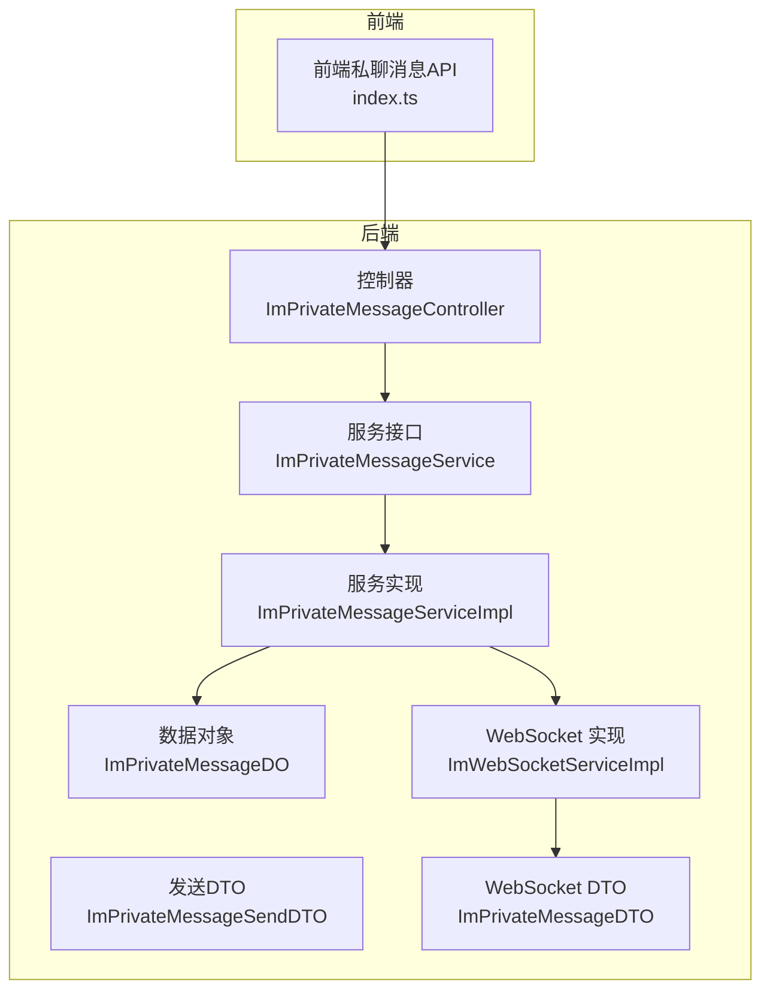
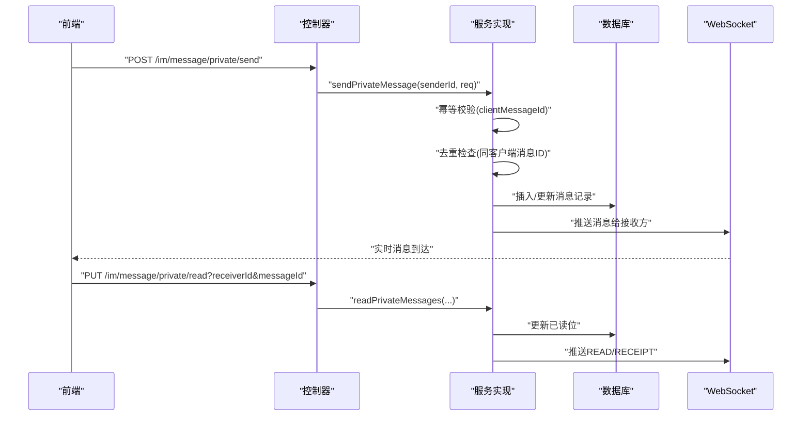
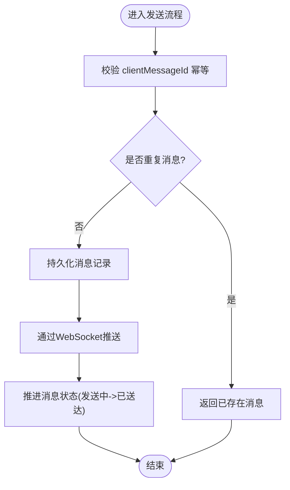
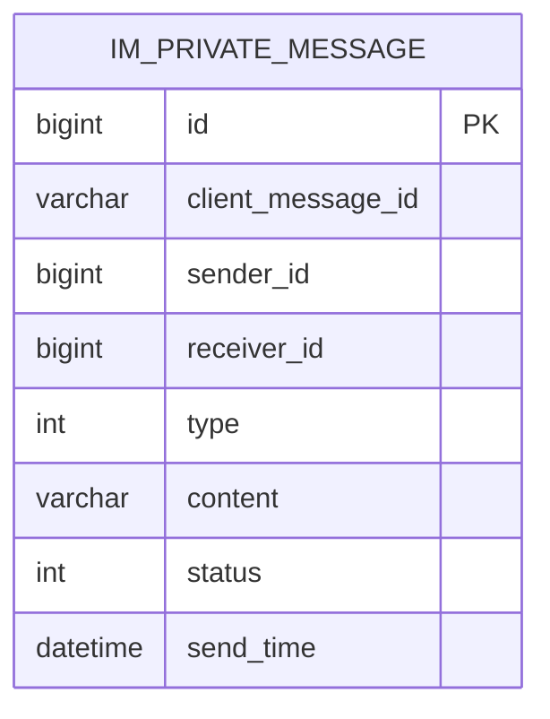
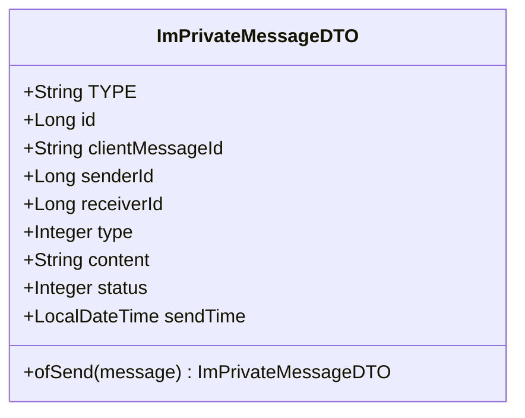
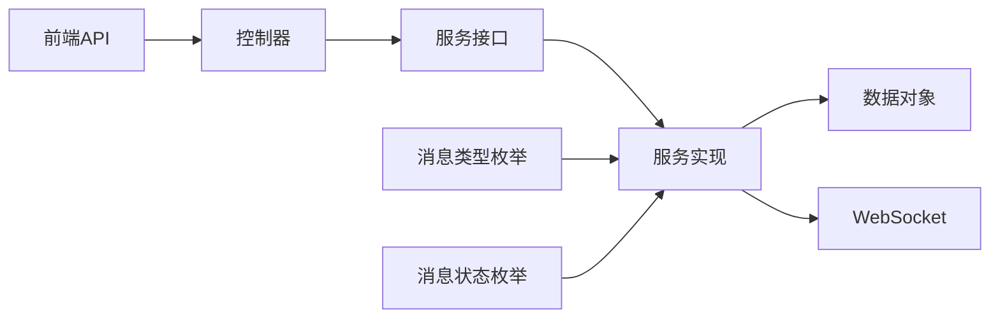

# 私聊消息

<cite>
**本文引用的文件**
- [ImPrivateMessageController.java](file://yudao-module-im/src/main/java/cn/iocoder/yudao/module/im/controller/admin/message/ImPrivateMessageController.java)
- [ImPrivateMessageService.java](file://yudao-module-im/src/main/java/cn/iocoder/yudao/module/im/service/message/ImPrivateMessageService.java)
- [ImPrivateMessageServiceImpl.java](file://yudao-module-im/src/main/java/cn/iocoder/yudao/module/im/service/message/ImPrivateMessageServiceImpl.java)
- [ImPrivateMessageSendDTO.java](file://yudao-module-im/src/main/java/cn/iocoder/yudao/module/im/service/message/dto/ImPrivateMessageSendDTO.java)
- [ImPrivateMessageDO.java](file://yudao-module-im/src/main/java/cn/iocoder/yudao/module/im/dal/dataobject/message/ImPrivateMessageDO.java)
- [ImPrivateMessageDTO.java](file://yudao-module-im/src/main/java/cn/iocoder/yudao/module/im/service/websocket/dto/ImPrivateMessageDTO.java)
- [ImMessageStatusEnum.java](file://yudao-module-im/src/main/java/cn/iocoder/yudao/module/im/enums/message/ImMessageStatusEnum.java)
- [ImMessageTypeEnum.java](file://yudao-module-im/src/main/java/cn/iocoder/yudao/module/im/enums/message/ImMessageTypeEnum.java)
- [ImWebSocketServiceImpl.java](file://yudao-module-im/src/main/java/cn/iocoder/yudao/module/im/service/websocket/ImWebSocketServiceImpl.java)
- [index.ts（前端私聊消息API）](file://yudao-ui/yudao-ui-admin-vue3/src/api/im/message/private/index.ts)
</cite>

## 目录
1. [引言](#引言)
2. [项目结构](#项目结构)
3. [核心组件](#核心组件)
4. [架构总览](#架构总览)
5. [详细组件分析](#详细组件分析)
6. [依赖关系分析](#依赖关系分析)
7. [性能考量](#性能考量)
8. [故障排查指南](#故障排查指南)
9. [结论](#结论)
10. [附录](#附录)

## 引言
本文件聚焦于“私聊消息”功能，系统性梳理一对一消息的发送与接收全流程，涵盖消息创建、存储、转发与确认、状态管理、去重与重复检测、消息回执、查询接口、撤回与删除等能力。文档以代码为依据，结合前后端交互与服务层实现，提供可操作的技术说明与可视化图示。

## 项目结构
私聊消息能力主要分布在以下模块与层次：
- 控制器层：负责HTTP接口定义与参数封装
- 服务层：负责业务编排、幂等与去重、状态机推进、消息投递
- 数据访问层：负责消息DO映射与持久化
- WebSocket层：负责实时消息推送与回执
- 前端API：负责调用后端接口并驱动UI

图表来源
- [ImPrivateMessageController.java:1-31](file://yudao-module-im/src/main/java/cn/iocoder/yudao/module/im/controller/admin/message/ImPrivateMessageController.java#L1-31)
- [ImPrivateMessageService.java:1-29](file://yudao-module-im/src/main/java/cn/iocoder/yudao/module/im/service/message/ImPrivateMessageService.java#L1-L29)
- [ImPrivateMessageServiceImpl.java:45-120](file://yudao-module-im/src/main/java/cn/iocoder/yudao/module/im/service/message/ImPrivateMessageServiceImpl.java#L45-L120)
- [ImPrivateMessageSendDTO.java:1-39](file://yudao-module-im/src/main/java/cn/iocoder/yudao/module/im/service/message/dto/ImPrivateMessageSendDTO.java#L1-L39)
- [ImPrivateMessageDO.java:1-72](file://yudao-module-im/src/main/java/cn/iocoder/yudao/module/im/dal/dataobject/message/ImPrivateMessageDO.java#L1-L72)
- [ImPrivateMessageDTO.java:27-77](file://yudao-module-im/src/main/java/cn/iocoder/yudao/module/im/service/websocket/dto/ImPrivateMessageDTO.java#L27-L77)
- [ImWebSocketServiceImpl.java](file://yudao-module-im/src/main/java/cn/iocoder/yudao/module/im/service/websocket/ImWebSocketServiceImpl.java)

章节来源
- [ImPrivateMessageController.java:1-31](file://yudao-module-im/src/main/java/cn/iocoder/yudao/module/im/controller/admin/message/ImPrivateMessageController.java#L1-L31)
- [index.ts（前端私聊消息API）:1-71](file://yudao-ui/yudao-ui-admin-vue3/src/api/im/message/private/index.ts#L1-L71)

## 核心组件
- 控制器：提供发送、拉取、查询、标记已读、查询最大已读、撤回等REST接口
- 服务接口与实现：封装发送业务逻辑（幂等、去重、状态推进、投递）
- 发送DTO：统一发送入参载体，支持持久化开关
- 数据对象：映射数据库表字段，承载消息实体
- WebSocket DTO：用于WS推送的消息载体
- 枚举：消息类型与状态枚举，约束业务取值

章节来源
- [ImPrivateMessageService.java:1-29](file://yudao-module-im/src/main/java/cn/iocoder/yudao/module/im/service/message/ImPrivateMessageService.java#L1-L29)
- [ImPrivateMessageServiceImpl.java:45-120](file://yudao-module-im/src/main/java/cn/iocoder/yudao/module/im/service/message/ImPrivateMessageServiceImpl.java#L45-L120)
- [ImPrivateMessageSendDTO.java:1-39](file://yudao-module-im/src/main/java/cn/iocoder/yudao/module/im/service/message/dto/ImPrivateMessageSendDTO.java#L1-L39)
- [ImPrivateMessageDO.java:1-72](file://yudao-module-im/src/main/java/cn/iocoder/yudao/module/im/dal/dataobject/message/ImPrivateMessageDO.java#L1-L72)
- [ImPrivateMessageDTO.java:27-77](file://yudao-module-im/src/main/java/cn/iocoder/yudao/module/im/service/websocket/dto/ImPrivateMessageDTO.java#L27-L77)
- [ImMessageTypeEnum.java](file://yudao-module-im/src/main/java/cn/iocoder/yudao/module/im/enums/message/ImMessageTypeEnum.java)
- [ImMessageStatusEnum.java](file://yudao-module-im/src/main/java/cn/iocoder/yudao/module/im/enums/message/ImMessageStatusEnum.java)

## 架构总览
私聊消息的端到端流程如下：
- 前端通过API发起发送请求
- 控制器接收并校验参数
- 服务层执行业务逻辑（幂等、去重、敏感词、类型校验等）
- 将消息持久化至数据库
- 通过WebSocket向接收方推送消息
- 接收方标记已读或触发回执上报
- 前端提供拉取增量、查询历史、撤回等能力

图表来源
- [ImPrivateMessageController.java:1-31](file://yudao-module-im/src/main/java/cn/iocoder/yudao/module/im/controller/admin/message/ImPrivateMessageController.java#L1-L31)
- [ImPrivateMessageServiceImpl.java:45-120](file://yudao-module-im/src/main/java/cn/iocoder/yudao/module/im/service/message/ImPrivateMessageServiceImpl.java#L45-L120)
- [ImWebSocketServiceImpl.java](file://yudao-module-im/src/main/java/cn/iocoder/yudao/module/im/service/websocket/ImWebSocketServiceImpl.java)
- [index.ts（前端私聊消息API）:30-71](file://yudao-ui/yudao-ui-admin-vue3/src/api/im/message/private/index.ts#L30-L71)

## 详细组件分析

### 控制器层：接口与参数
- 发送私聊消息：接收clientMessageId、receiverId、type、content，返回消息响应
- 拉取增量消息：minId、size
- 查询历史消息：receiverId、maxId、limit
- 标记已读：receiverId、messageId
- 查询最大已读：peerId
- 撤回消息：id

章节来源
- [ImPrivateMessageController.java:1-31](file://yudao-module-im/src/main/java/cn/iocoder/yudao/module/im/controller/admin/message/ImPrivateMessageController.java#L1-L31)
- [index.ts（前端私聊消息API）:30-71](file://yudao-ui/yudao-ui-admin-vue3/src/api/im/message/private/index.ts#L30-L71)

### 服务层：发送与状态管理
- 幂等与去重：基于clientMessageId进行幂等与重复检测
- 敏感词与业务校验：在服务层完成（如类型校验、好友关系等）
- 状态推进：发送中、已送达、已读等状态流转
- 持久化与推送：根据配置决定是否入库与双向推送
- 回执处理：READ/RECEIPT消息用于同步双方已读位

图表来源
- [ImPrivateMessageServiceImpl.java:45-120](file://yudao-module-im/src/main/java/cn/iocoder/yudao/module/im/service/message/ImPrivateMessageServiceImpl.java#L45-L120)
- [ImPrivateMessageSendDTO.java:1-39](file://yudao-module-im/src/main/java/cn/iocoder/yudao/module/im/service/message/dto/ImPrivateMessageSendDTO.java#L1-L39)

章节来源
- [ImPrivateMessageService.java:1-29](file://yudao-module-im/src/main/java/cn/iocoder/yudao/module/im/service/message/ImPrivateMessageService.java#L1-L29)
- [ImPrivateMessageServiceImpl.java:45-120](file://yudao-module-im/src/main/java/cn/iocoder/yudao/module/im/service/message/ImPrivateMessageServiceImpl.java#L45-L120)

### 数据模型：消息实体
- 表字段：id、clientMessageId、senderId、receiverId、type、content、status、sendTime
- 关键约束：clientMessageId用于幂等与去重；status对应状态枚举
- 结构化内容：content为JSON格式，承载具体消息体

图表来源
- [ImPrivateMessageDO.java:1-72](file://yudao-module-im/src/main/java/cn/iocoder/yudao/module/im/dal/dataobject/message/ImPrivateMessageDO.java#L1-L72)

章节来源
- [ImPrivateMessageDO.java:1-72](file://yudao-module-im/src/main/java/cn/iocoder/yudao/module/im/dal/dataobject/message/ImPrivateMessageDO.java#L1-L72)

### WebSocket推送：消息回执与已读
- DTO定义：包含消息ID、类型、内容、状态、发送时间等
- 推送场景：普通消息、READ（我已读）、RECEIPT（对方已读）、RECALL（撤回）
- 已读同步：通过READ/RECEIPT消息同步双方已读位

图表来源
- [ImPrivateMessageDTO.java:27-77](file://yudao-module-im/src/main/java/cn/iocoder/yudao/module/im/service/websocket/dto/ImPrivateMessageDTO.java#L27-L77)

章节来源
- [ImPrivateMessageDTO.java:27-77](file://yudao-module-im/src/main/java/cn/iocoder/yudao/module/im/service/websocket/dto/ImPrivateMessageDTO.java#L27-L77)
- [ImWebSocketServiceImpl.java](file://yudao-module-im/src/main/java/cn/iocoder/yudao/module/im/service/websocket/ImWebSocketServiceImpl.java)

### 消息状态与类型
- 状态枚举：用于标识发送中、已送达、已读等状态
- 类型枚举：限制消息类型（如TEXT/IMAGE等）

章节来源
- [ImMessageStatusEnum.java](file://yudao-module-im/src/main/java/cn/iocoder/yudao/module/im/enums/message/ImMessageStatusEnum.java)
- [ImMessageTypeEnum.java](file://yudao-module-im/src/main/java/cn/iocoder/yudao/module/im/enums/message/ImMessageTypeEnum.java)

### 去重策略与重复检测
- 基于clientMessageId进行幂等与重复检测
- 若发现重复，直接返回已存在消息，避免重复入库与重复推送

章节来源
- [ImPrivateMessageServiceImpl.java:45-120](file://yudao-module-im/src/main/java/cn/iocoder/yudao/module/im/service/message/ImPrivateMessageServiceImpl.java#L45-L120)

### 加密与解密
- 仓库未提供专门的加密/解密实现
- 如需端到端加密，可在content字段上扩展加解密流程（建议在服务层对content进行序列化前/反序列化后处理）

章节来源
- [ImPrivateMessageDO.java:56-58](file://yudao-module-im/src/main/java/cn/iocoder/yudao/module/im/dal/dataobject/message/ImPrivateMessageDO.java#L56-L58)

### 回执功能：单播与多播
- 单播回执：READ/RECEIPT消息用于同步单个会话的已读位
- 多播：通过WS向多端推送已读状态，确保多端一致

章节来源
- [ImPrivateMessageDTO.java:27-77](file://yudao-module-im/src/main/java/cn/iocoder/yudao/module/im/service/websocket/dto/ImPrivateMessageDTO.java#L27-L77)
- [ImWebSocketServiceImpl.java](file://yudao-module-im/src/main/java/cn/iocoder/yudao/module/im/service/websocket/ImWebSocketServiceImpl.java)

### 查询接口：时间范围、类型、状态筛选
- 增量拉取：minId + size
- 历史查询：receiverId + maxId + limit
- 已读查询：peerId获取对方已读到的最大消息ID

章节来源
- [index.ts（前端私聊消息API）:35-63](file://yudao-ui/yudao-ui-admin-vue3/src/api/im/message/private/index.ts#L35-L63)

### 撤回与删除
- 撤回：调用撤回接口，服务层标记RECALL并推送撤回消息
- 删除：可结合业务需求在服务层实现软删除或物理删除策略

章节来源
- [index.ts（前端私聊消息API）:65-71](file://yudao-ui/yudao-ui-admin-vue3/src/api/im/message/private/index.ts#L65-L71)

## 依赖关系分析
- 控制器依赖服务接口
- 服务实现依赖数据对象与WebSocket推送
- 枚举为状态与类型提供约束
- 前端API依赖控制器提供的REST接口

图表来源
- [ImPrivateMessageController.java:1-31](file://yudao-module-im/src/main/java/cn/iocoder/yudao/module/im/controller/admin/message/ImPrivateMessageController.java#L1-L31)
- [ImPrivateMessageService.java:1-29](file://yudao-module-im/src/main/java/cn/iocoder/yudao/module/im/service/message/ImPrivateMessageService.java#L1-L29)
- [ImPrivateMessageServiceImpl.java:45-120](file://yudao-module-im/src/main/java/cn/iocoder/yudao/module/im/service/message/ImPrivateMessageServiceImpl.java#L45-L120)
- [ImPrivateMessageDO.java:1-72](file://yudao-module-im/src/main/java/cn/iocoder/yudao/module/im/dal/dataobject/message/ImPrivateMessageDO.java#L1-L72)
- [ImMessageTypeEnum.java](file://yudao-module-im/src/main/java/cn/iocoder/yudao/module/im/enums/message/ImMessageTypeEnum.java)
- [ImMessageStatusEnum.java](file://yudao-module-im/src/main/java/cn/iocoder/yudao/module/im/enums/message/ImMessageStatusEnum.java)
- [index.ts（前端私聊消息API）:1-71](file://yudao-ui/yudao-ui-admin-vue3/src/api/im/message/private/index.ts#L1-L71)

## 性能考量
- 幂等与去重：通过clientMessageId降低重复写入与推送成本
- 批量拉取：前端使用minId/limit控制增量拉取，减少一次性数据量
- 状态推进：在服务层统一推进状态，避免多次查询
- WS推送：针对高频场景，建议在WS层做消息合并与去抖

## 故障排查指南
- 发送失败：检查clientMessageId是否正确传入，确认服务层幂等逻辑
- 重复消息：若出现重复，确认是否使用了相同的clientMessageId
- 未收到回执：检查WS连接状态与READ/RECEIPT推送逻辑
- 查询异常：核对receiverId、maxId、limit参数是否符合接口要求

章节来源
- [ImPrivateMessageController.java:1-31](file://yudao-module-im/src/main/java/cn/iocoder/yudao/module/im/controller/admin/message/ImPrivateMessageController.java#L1-L31)
- [index.ts（前端私聊消息API）:35-63](file://yudao-ui/yudao-ui-admin-vue3/src/api/im/message/private/index.ts#L35-L63)

## 结论
私聊消息功能以“幂等+去重+状态机+WS推送”为核心，结合前端查询与回执能力，形成完整的端到端链路。服务层承担主要业务编排职责，控制器提供清晰的REST接口，WebSocket保障实时性。后续可在content层面扩展加密能力，并持续优化增量拉取与状态推进策略。

## 附录
- 接口清单与参数参考见前端API定义
- 消息状态与类型枚举用于约束业务取值
- 数据库表结构与字段映射见消息DO定义