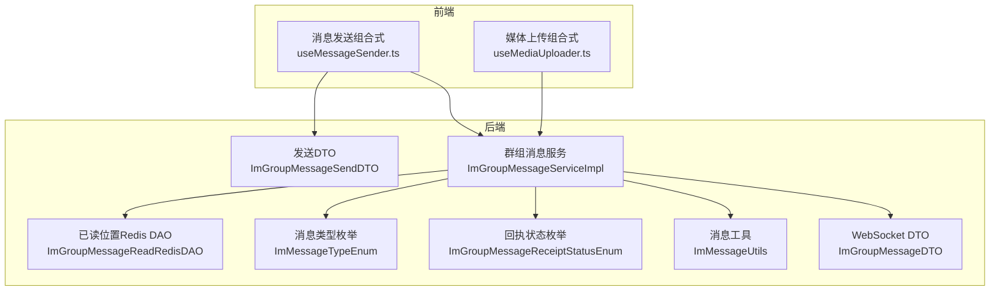
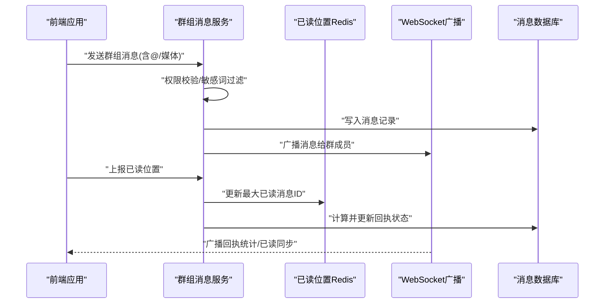
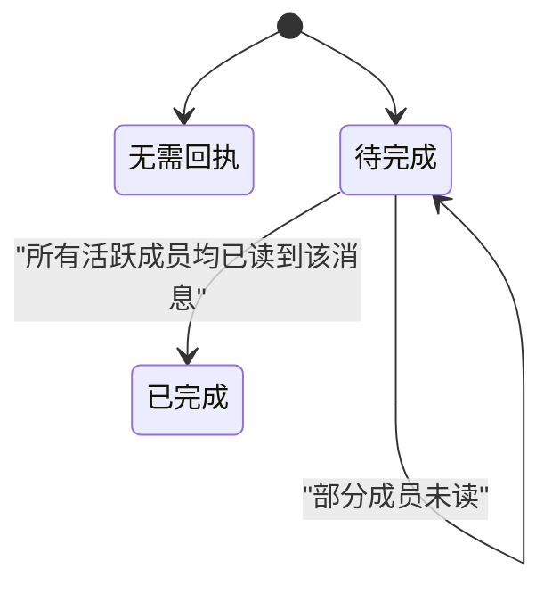
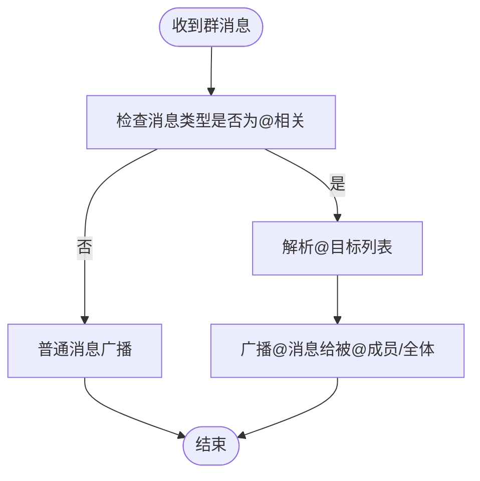
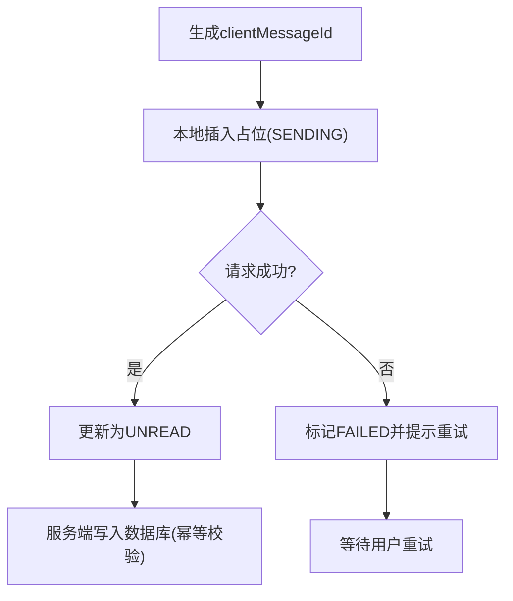
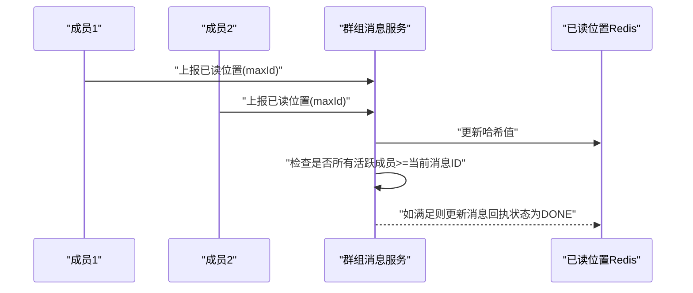
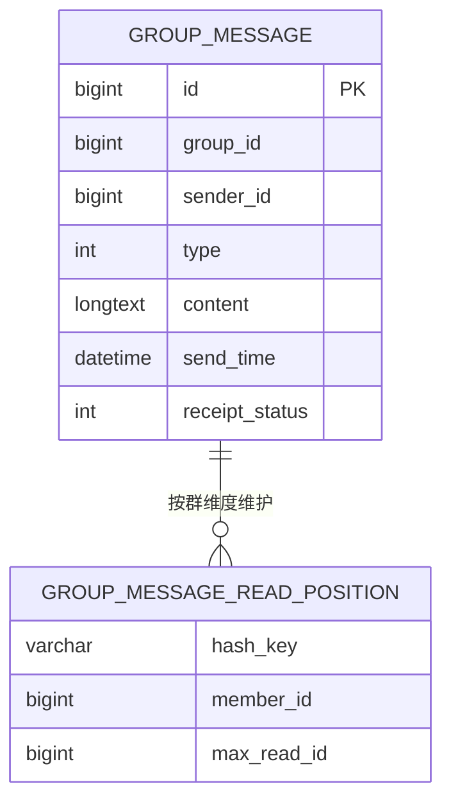
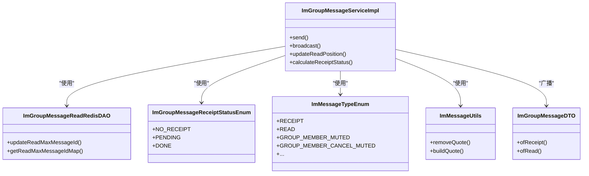

# 群组消息

<cite>
**本文档引用的文件**
- [ImGroupMessageServiceImpl.java](file://yudao-module-im/src/main/java/cn/iocoder/yudao/module/im/service/message/ImGroupMessageServiceImpl.java)
- [ImGroupMessageSendDTO.java](file://yudao-module-im/src/main/java/cn/iocoder/yudao/module/im/service/message/dto/ImGroupMessageSendDTO.java)
- [ImGroupMessageReadRedisDAO.java](file://yudao-module-im/src/main/java/cn/iocoder/yudao/module/im/dal/redis/message/ImGroupMessageReadRedisDAO.java)
- [ImGroupMessageReceiptStatusEnum.java](file://yudao-module-im/src/main/java/cn/iocoder/yudao/module/im/enums/message/ImGroupMessageReceiptStatusEnum.java)
- [ImGroupMessageDTO.java](file://yudao-module-im/src/main/java/cn/iocoder/yudao/module/im/service/websocket/dto/ImGroupMessageDTO.java)
- [ImMessageTypeEnum.java](file://yudao-module-im/src/main/java/cn/iocoder/yudao/module/im/enums/message/ImMessageTypeEnum.java)
- [ImMessageUtils.java](file://yudao-module-im/src/main/java/cn/iocoder/yudao/module/im/util/ImMessageUtils.java)
- [useMessageSender.ts](file://yudao-ui/yudao-ui-admin-vue3/src/views/im/home/composables/useMessageSender.ts)
- [useMediaUploader.ts](file://yudao-ui/yudao-ui-admin-vue3/src/views/im/home/composables/useMediaUploader.ts)
- [ImGroupMessageServiceImplTest.java](file://yudao-module-im/src/test/java/cn/iocoder/yudao/module/im/service/message/ImGroupMessageServiceImplTest.java)
</cite>

## 目录
1. [简介](#简介)
2. [项目结构](#项目结构)
3. [核心组件](#核心组件)
4. [架构总览](#架构总览)
5. [详细组件分析](#详细组件分析)
6. [依赖关系分析](#依赖关系分析)
7. [性能考虑](#性能考虑)
8. [故障排查指南](#故障排查指南)
9. [结论](#结论)
10. [附录](#附录)

## 简介
本文件系统性梳理“群组消息”能力的技术实现，重点覆盖以下方面：
- 广播机制与多播处理策略：如何将消息高效分发至群内所有成员，并区分需要回执与无需回执的消息。
- @提及功能：成员@与全体@的识别与通知机制，以及消息内容中的@标记处理。
- 消息去重：避免重复消息在群内的传播与展示。
- 成员状态与回执统计：在线离线状态、已读回执统计与状态迁移。
- 存储策略：消息分片与索引优化思路，结合Redis与MySQL的协同使用。
- 查询接口：按成员、时间、消息类型组合查询群消息的能力设计。
- 权限控制与消息过滤：发送前的权限校验与敏感词过滤等。

## 项目结构
围绕群组消息的关键模块分布如下：
- 后端模块（Java）：service层负责业务编排、消息发送与回执统计；dal层包含MySQL与Redis访问；enums定义消息类型与状态；util提供消息工具方法；websocket dto用于消息广播。
- 前端模块（Vue3）：composables封装消息发送、占位与媒体上传流程；与后端通过WebSocket进行实时交互。

**图表来源**
- [ImGroupMessageServiceImpl.java](file://yudao-module-im/src/main/java/cn/iocoder/yudao/module/im/service/message/ImGroupMessageServiceImpl.java)
- [ImGroupMessageSendDTO.java](file://yudao-module-im/src/main/java/cn/iocoder/yudao/module/im/service/message/dto/ImGroupMessageSendDTO.java)
- [ImGroupMessageReadRedisDAO.java](file://yudao-module-im/src/main/java/cn/iocoder/yudao/module/im/dal/redis/message/ImGroupMessageReadRedisDAO.java)
- [ImGroupMessageReceiptStatusEnum.java](file://yudao-module-im/src/main/java/cn/iocoder/yudao/module/im/enums/message/ImGroupMessageReceiptStatusEnum.java)
- [ImMessageTypeEnum.java](file://yudao-module-im/src/main/java/cn/iocoder/yudao/module/im/enums/message/ImMessageTypeEnum.java)
- [ImMessageUtils.java](file://yudao-module-im/src/main/java/cn/iocoder/yudao/module/im/util/ImMessageUtils.java)
- [ImGroupMessageDTO.java](file://yudao-module-im/src/main/java/cn/iocoder/yudao/module/im/service/websocket/dto/ImGroupMessageDTO.java)
- [useMessageSender.ts](file://yudao-ui/yudao-ui-admin-vue3/src/views/im/home/composables/useMessageSender.ts)
- [useMediaUploader.ts](file://yudao-ui/yudao-ui-admin-vue3/src/views/im/home/composables/useMediaUploader.ts)

**章节来源**
- [ImGroupMessageServiceImpl.java](file://yudao-module-im/src/main/java/cn/iocoder/yudao/module/im/service/message/ImGroupMessageServiceImpl.java)
- [ImGroupMessageSendDTO.java](file://yudao-module-im/src/main/java/cn/iocoder/yudao/module/im/service/message/dto/ImGroupMessageSendDTO.java)
- [ImGroupMessageReadRedisDAO.java](file://yudao-module-im/src/main/java/cn/iocoder/yudao/module/im/dal/redis/message/ImGroupMessageReadRedisDAO.java)
- [ImGroupMessageReceiptStatusEnum.java](file://yudao-module-im/src/main/java/cn/iocoder/yudao/module/im/enums/message/ImGroupMessageReceiptStatusEnum.java)
- [ImMessageTypeEnum.java](file://yudao-module-im/src/main/java/cn/iocoder/yudao/module/im/enums/message/ImMessageTypeEnum.java)
- [ImMessageUtils.java](file://yudao-module-im/src/main/java/cn/iocoder/yudao/module/im/util/ImMessageUtils.java)
- [ImGroupMessageDTO.java](file://yudao-module-im/src/main/java/cn/iocoder/yudao/module/im/service/websocket/dto/ImGroupMessageDTO.java)
- [useMessageSender.ts](file://yudao-ui/yudao-ui-admin-vue3/src/views/im/home/composables/useMessageSender.ts)
- [useMediaUploader.ts](file://yudao-ui/yudao-ui-admin-vue3/src/views/im/home/composables/useMediaUploader.ts)

## 核心组件
- 群组消息服务：负责消息发送、广播、回执统计与状态迁移。
- 发送DTO：封装群组消息发送参数，含消息类型与内容。
- 回执状态枚举：定义“无需回执/待完成/已完成”的状态机。
- 已读位置Redis DAO：以哈希结构记录每个成员在群内的最大已读消息ID。
- 消息类型枚举：统一管理消息类型，包括@相关与群运营通知类型。
- 消息工具：提供引用消息构建与quote字段清理等辅助能力。
- WebSocket DTO：用于广播“已读同步”和“回执统计”事件。
- 前端发送组合式：负责本地乐观占位、消息提交与媒体占位替换。

**章节来源**
- [ImGroupMessageServiceImpl.java](file://yudao-module-im/src/main/java/cn/iocoder/yudao/module/im/service/message/ImGroupMessageServiceImpl.java)
- [ImGroupMessageSendDTO.java](file://yudao-module-im/src/main/java/cn/iocoder/yudao/module/im/service/message/dto/ImGroupMessageSendDTO.java)
- [ImGroupMessageReadRedisDAO.java](file://yudao-module-im/src/main/java/cn/iocoder/yudao/module/im/dal/redis/message/ImGroupMessageReadRedisDAO.java)
- [ImGroupMessageReceiptStatusEnum.java](file://yudao-module-im/src/main/java/cn/iocoder/yudao/module/im/enums/message/ImGroupMessageReceiptStatusEnum.java)
- [ImMessageTypeEnum.java](file://yudao-module-im/src/main/java/cn/iocoder/yudao/module/im/enums/message/ImMessageTypeEnum.java)
- [ImMessageUtils.java](file://yudao-module-im/src/main/java/cn/iocoder/yudao/module/im/util/ImMessageUtils.java)
- [ImGroupMessageDTO.java](file://yudao-module-im/src/main/java/cn/iocoder/yudao/module/im/service/websocket/dto/ImGroupMessageDTO.java)
- [useMessageSender.ts](file://yudao-ui/yudao-ui-admin-vue3/src/views/im/home/composables/useMessageSender.ts)
- [useMediaUploader.ts](file://yudao-ui/yudao-ui-admin-vue3/src/views/im/home/composables/useMediaUploader.ts)

## 架构总览
群组消息从“发送—广播—回执—存储—查询—权限过滤”形成闭环。后端服务编排消息发送与广播，Redis缓存已读位置，MySQL持久化消息与回执状态；前端通过WebSocket接收广播并更新UI。

**图表来源**
- [ImGroupMessageServiceImpl.java](file://yudao-module-im/src/main/java/cn/iocoder/yudao/module/im/service/message/ImGroupMessageServiceImpl.java)
- [ImGroupMessageReadRedisDAO.java](file://yudao-module-im/src/main/java/cn/iocoder/yudao/module/im/dal/redis/message/ImGroupMessageReadRedisDAO.java)
- [ImGroupMessageDTO.java](file://yudao-module-im/src/main/java/cn/iocoder/yudao/module/im/service/websocket/dto/ImGroupMessageDTO.java)

## 详细组件分析

### 广播机制与多播处理策略
- 广播范围：根据群成员列表筛选活跃成员，排除发送者自身，向其余成员推送消息。
- 多播策略：
  - 无需回执消息：直接广播，不跟踪已读。
  - 需要回执消息：记录待完成状态，基于Redis中各成员最大已读ID推进至“已完成”。
- 回执状态机：
  - 无需回执：NO_RECEIPT
  - 待完成：PENDING
  - 已完成：DONE

**图表来源**
- [ImGroupMessageReceiptStatusEnum.java](file://yudao-module-im/src/main/java/cn/iocoder/yudao/module/im/enums/message/ImGroupMessageReceiptStatusEnum.java)
- [ImGroupMessageReadRedisDAO.java](file://yudao-module-im/src/main/java/cn/iocoder/yudao/module/im/dal/redis/message/ImGroupMessageReadRedisDAO.java)

**章节来源**
- [ImGroupMessageServiceImpl.java](file://yudao-module-im/src/main/java/cn/iocoder/yudao/module/im/service/message/ImGroupMessageServiceImpl.java)
- [ImGroupMessageReadRedisDAO.java](file://yudao-module-im/src/main/java/cn/iocoder/yudao/module/im/dal/redis/message/ImGroupMessageReadRedisDAO.java)
- [ImGroupMessageReceiptStatusEnum.java](file://yudao-module-im/src/main/java/cn/iocoder/yudao/module/im/enums/message/ImGroupMessageReceiptStatusEnum.java)

### @提及功能：成员@与全体@
- 类型识别：通过消息类型枚举中的“@相关”类型区分成员@与全体@。
- 内容处理：消息工具提供引用消息构建与quote字段清理，确保@消息链路稳定。
- 通知机制：服务端在广播时根据@目标进行定向或全员通知，前端据此高亮显示并触发提醒。

**图表来源**
- [ImMessageTypeEnum.java](file://yudao-module-im/src/main/java/cn/iocoder/yudao/module/im/enums/message/ImMessageTypeEnum.java)
- [ImMessageUtils.java](file://yudao-module-im/src/main/java/cn/iocoder/yudao/module/im/util/ImMessageUtils.java)

**章节来源**
- [ImMessageTypeEnum.java](file://yudao-module-im/src/main/java/cn/iocoder/yudao/module/im/enums/message/ImMessageTypeEnum.java)
- [ImMessageUtils.java](file://yudao-module-im/src/main/java/cn/iocoder/yudao/module/im/util/ImMessageUtils.java)

### 消息去重算法
- 去重依据：利用客户端消息ID（clientMessageId）在发送阶段进行幂等校验，避免重复提交。
- 前端策略：发送组合式在本地插入“发送中”占位，成功后更新为“未读”，失败则标记为“失败”，从而避免重复尝试。
- 后端策略：服务层在写入数据库前进行重复检测，结合Redis缓存快速判定。

**图表来源**
- [useMessageSender.ts](file://yudao-ui/yudao-ui-admin-vue3/src/views/im/home/composables/useMessageSender.ts)
- [ImGroupMessageServiceImpl.java](file://yudao-module-im/src/main/java/cn/iocoder/yudao/module/im/service/message/ImGroupMessageServiceImpl.java)

**章节来源**
- [useMessageSender.ts](file://yudao-ui/yudao-ui-admin-vue3/src/views/im/home/composables/useMessageSender.ts)
- [ImGroupMessageServiceImpl.java](file://yudao-module-im/src/main/java/cn/iocoder/yudao/module/im/service/message/ImGroupMessageServiceImpl.java)

### 成员状态与消息回执统计
- 成员状态：活跃成员集合用于决定广播对象与回执统计范围。
- 已读位置：Redis以哈希记录每个成员在群内的最大已读消息ID。
- 回执推进：当所有活跃成员的最大已读ID均≥当前消息ID时，状态从“待完成”迁移到“已完成”。

**图表来源**
- [ImGroupMessageReadRedisDAO.java](file://yudao-module-im/src/main/java/cn/iocoder/yudao/module/im/dal/redis/message/ImGroupMessageReadRedisDAO.java)
- [ImGroupMessageServiceImpl.java](file://yudao-module-im/src/main/java/cn/iocoder/yudao/module/im/service/message/ImGroupMessageServiceImpl.java)

**章节来源**
- [ImGroupMessageReadRedisDAO.java](file://yudao-module-im/src/main/java/cn/iocoder/yudao/module/im/dal/redis/message/ImGroupMessageReadRedisDAO.java)
- [ImGroupMessageServiceImpl.java](file://yudao-module-im/src/main/java/cn/iocoder/yudao/module/im/service/message/ImGroupMessageServiceImpl.java)

### 存储策略：分片与索引优化
- MySQL存储：消息主体与回执状态持久化，建议按群ID与发送时间建立复合索引，支撑分页与范围查询。
- Redis缓存：以哈希结构存储“群ID→成员ID→最大已读消息ID”，适合高频读写与原子更新。
- 分片建议：按群ID取模分片，降低单表压力；热点群可引入二级缓存。

**图表来源**
- [ImGroupMessageReadRedisDAO.java](file://yudao-module-im/src/main/java/cn/iocoder/yudao/module/im/dal/redis/message/ImGroupMessageReadRedisDAO.java)
- [ImGroupMessageServiceImpl.java](file://yudao-module-im/src/main/java/cn/iocoder/yudao/module/im/service/message/ImGroupMessageServiceImpl.java)

**章节来源**
- [ImGroupMessageReadRedisDAO.java](file://yudao-module-im/src/main/java/cn/iocoder/yudao/module/im/dal/redis/message/ImGroupMessageReadRedisDAO.java)
- [ImGroupMessageServiceImpl.java](file://yudao-module-im/src/main/java/cn/iocoder/yudao/module/im/service/message/ImGroupMessageServiceImpl.java)

### 查询接口：按成员/时间/类型组合查询
- 查询维度：支持按群ID、成员ID、时间范围、消息类型等条件组合查询。
- 性能优化：建议在群ID、发送时间、消息类型上建立联合索引；对大结果集采用分页与游标。
- 前端交互：查询结果用于聊天列表与消息历史展示，结合本地缓存提升体验。

**章节来源**
- [ImGroupMessageServiceImpl.java](file://yudao-module-im/src/main/java/cn/iocoder/yudao/module/im/service/message/ImGroupMessageServiceImpl.java)

### 权限控制与消息过滤
- 权限控制：发送前校验用户是否为群成员、是否被禁言、是否被封禁等。
- 敏感词过滤：消息内容在入库前进行敏感词检测与替换。
- 媒体安全：媒体占位与真实URL替换流程，防止上传失败导致的脏数据进入广播链路。

**章节来源**
- [ImGroupMessageServiceImpl.java](file://yudao-module-im/src/main/java/cn/iocoder/yudao/module/im/service/message/ImGroupMessageServiceImpl.java)
- [useMediaUploader.ts](file://yudao-ui/yudao-ui-admin-vue3/src/views/im/home/composables/useMediaUploader.ts)

## 依赖关系分析
- 服务层依赖：消息服务依赖Redis DAO进行已读位置更新，依赖枚举进行状态与类型判断，依赖工具类进行内容处理，依赖WebSocket DTO进行广播。
- 前端依赖：发送组合式依赖消息类型与状态常量，媒体组合式负责占位与替换流程。

**图表来源**
- [ImGroupMessageServiceImpl.java](file://yudao-module-im/src/main/java/cn/iocoder/yudao/module/im/service/message/ImGroupMessageServiceImpl.java)
- [ImGroupMessageReadRedisDAO.java](file://yudao-module-im/src/main/java/cn/iocoder/yudao/module/im/dal/redis/message/ImGroupMessageReadRedisDAO.java)
- [ImGroupMessageReceiptStatusEnum.java](file://yudao-module-im/src/main/java/cn/iocoder/yudao/module/im/enums/message/ImGroupMessageReceiptStatusEnum.java)
- [ImMessageTypeEnum.java](file://yudao-module-im/src/main/java/cn/iocoder/yudao/module/im/enums/message/ImMessageTypeEnum.java)
- [ImMessageUtils.java](file://yudao-module-im/src/main/java/cn/iocoder/yudao/module/im/util/ImMessageUtils.java)
- [ImGroupMessageDTO.java](file://yudao-module-im/src/main/java/cn/iocoder/yudao/module/im/service/websocket/dto/ImGroupMessageDTO.java)

**章节来源**
- [ImGroupMessageServiceImpl.java](file://yudao-module-im/src/main/java/cn/iocoder/yudao/module/im/service/message/ImGroupMessageServiceImpl.java)
- [ImGroupMessageReadRedisDAO.java](file://yudao-module-im/src/main/java/cn/iocoder/yudao/module/im/dal/redis/message/ImGroupMessageReadRedisDAO.java)
- [ImGroupMessageReceiptStatusEnum.java](file://yudao-module-im/src/main/java/cn/iocoder/yudao/module/im/enums/message/ImGroupMessageReceiptStatusEnum.java)
- [ImMessageTypeEnum.java](file://yudao-module-im/src/main/java/cn/iocoder/yudao/module/im/enums/message/ImMessageTypeEnum.java)
- [ImMessageUtils.java](file://yudao-module-im/src/main/java/cn/iocoder/yudao/module/im/util/ImMessageUtils.java)
- [ImGroupMessageDTO.java](file://yudao-module-im/src/main/java/cn/iocoder/yudao/module/im/service/websocket/dto/ImGroupMessageDTO.java)

## 性能考虑
- Redis热点：已读位置频繁更新，建议对群维度做分区或限流，避免热Key抖动。
- 批量广播：对大群采用分批推送与背压控制，避免瞬时拥塞。
- 索引优化：按群ID+发送时间+类型建立复合索引，减少扫描成本。
- 缓存一致性：Redis与MySQL通过事务或最终一致策略保证回执状态准确。

## 故障排查指南
- 回执状态异常：检查Redis中活跃成员的最大已读ID是否正确更新，确认服务层回执推进逻辑。
- 广播缺失：核对成员列表与在线状态，确认WebSocket广播通道正常。
- 媒体占位问题：确认占位URL与真实URL替换流程，避免脏数据进入消息内容。
- 测试验证：参考单元测试用例，模拟不同成员入群时间、已读进度与回执状态迁移。

**章节来源**
- [ImGroupMessageServiceImplTest.java](file://yudao-module-im/src/test/java/cn/iocoder/yudao/module/im/service/message/ImGroupMessageServiceImplTest.java)
- [ImGroupMessageReadRedisDAO.java](file://yudao-module-im/src/main/java/cn/iocoder/yudao/module/im/dal/redis/message/ImGroupMessageReadRedisDAO.java)
- [ImGroupMessageServiceImpl.java](file://yudao-module-im/src/main/java/cn/iocoder/yudao/module/im/service/message/ImGroupMessageServiceImpl.java)

## 结论
群组消息体系通过“服务编排+Redis缓存+MySQL持久化+WebSocket广播”的组合，实现了高效、可扩展的群内通信能力。@提及、回执统计、去重与权限过滤等特性共同保障了消息的准确性与用户体验。后续可在热点治理、批量广播与索引优化方面持续演进。

## 附录
- 关键流程参考路径：
  - 发送与广播：[ImGroupMessageServiceImpl.java](file://yudao-module-im/src/main/java/cn/iocoder/yudao/module/im/service/message/ImGroupMessageServiceImpl.java)
  - 已读位置更新：[ImGroupMessageReadRedisDAO.java](file://yudao-module-im/src/main/java/cn/iocoder/yudao/module/im/dal/redis/message/ImGroupMessageReadRedisDAO.java)
  - 回执状态枚举：[ImGroupMessageReceiptStatusEnum.java](file://yudao-module-im/src/main/java/cn/iocoder/yudao/module/im/enums/message/ImGroupMessageReceiptStatusEnum.java)
  - 消息类型与@相关：[ImMessageTypeEnum.java](file://yudao-module-im/src/main/java/cn/iocoder/yudao/module/im/enums/message/ImMessageTypeEnum.java)
  - 消息工具（引用/quote）：[ImMessageUtils.java](file://yudao-module-im/src/main/java/cn/iocoder/yudao/module/im/util/ImMessageUtils.java)
  - 前端发送与媒体占位：[useMessageSender.ts](file://yudao-ui/yudao-ui-admin-vue3/src/views/im/home/composables/useMessageSender.ts)、[useMediaUploader.ts](file://yudao-ui/yudao-ui-admin-vue3/src/views/im/home/composables/useMediaUploader.ts)