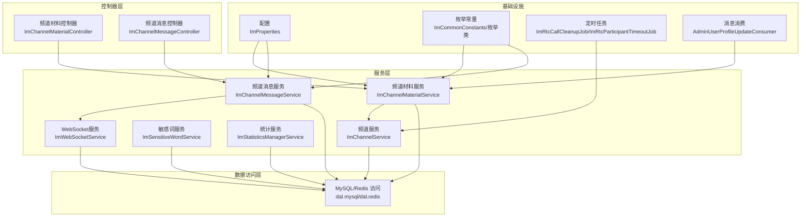
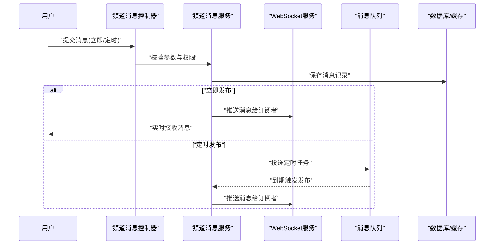
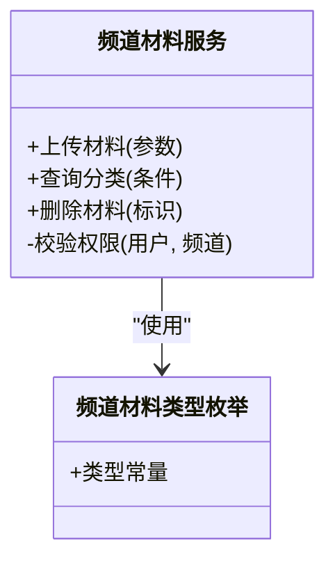
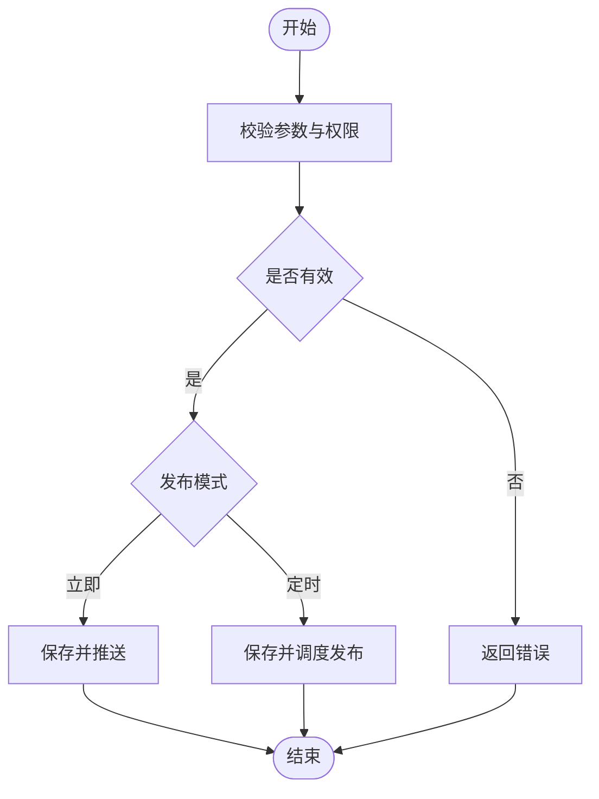
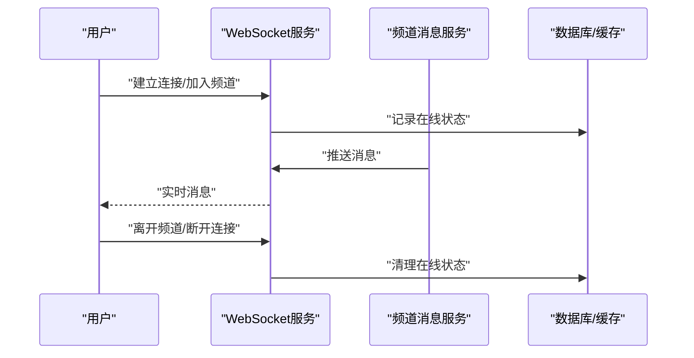
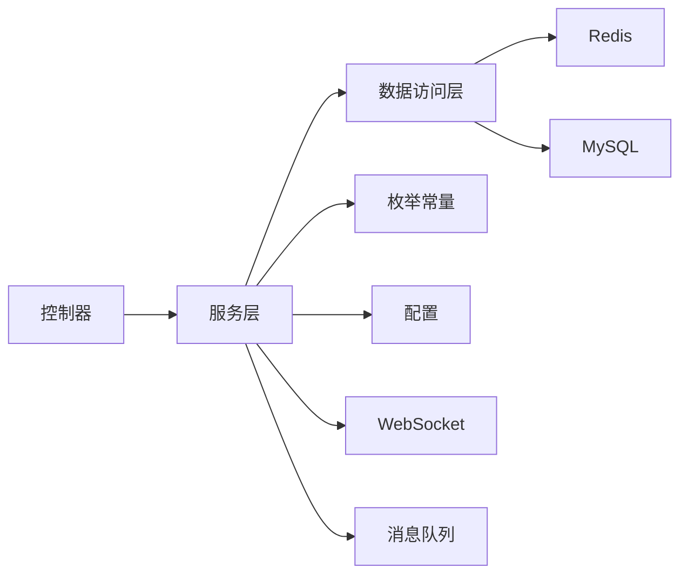

# 频道消息

<cite>
**本文引用的文件**
- [ImChannelMaterialController.java](file://yudao-module-im/src/main/java/cn/iocoder/yudao/module/im/controller/admin/channel/ImChannelMaterialController.java)
- [ImChannelMaterialService.java](file://yudao-module-im/src/main/java/cn/iocoder/yudao/module/im/service/channel/ImChannelMaterialService.java)
- [ImChannelMaterialServiceImpl.java](file://yudao-module-im/src/main/java/cn/iocoder/yudao/module/im/service/channel/ImChannelMaterialServiceImpl.java)
- [ImChannelService.java](file://yudao-module-im/src/main/java/cn/iocoder/yudao/module/im/service/channel/ImChannelService.java)
- [ImChannelServiceImpl.java](file://yudao-module-im/src/main/java/cn/iocoder/yudao/module/im/service/channel/ImChannelServiceImpl.java)
- [ImChannelMessageService.java](file://yudao-module-im/src/main/java/cn/iocoder/yudao/module/im/service/message/ImChannelMessageService.java)
- [ImChannelMessageServiceImpl.java](file://yudao-module-im/src/main/java/cn/iocoder/yudao/module/im/service/message/ImChannelMessageServiceImpl.java)
- [ImWebSocketService.java](file://yudao-module-im/src/main/java/cn/iocoder/yudao/module/im/service/websocket/ImWebSocketService.java)
- [ImWebSocketServiceImpl.java](file://yudao-module-im/src/main/java/cn/iocoder/yudao/module/im/service/websocket/ImWebSocketServiceImpl.java)
- [ImSensitiveWordService.java](file://yudao-module-im/src/main/java/cn/iocoder/yudao/module/im/service/sensitiveword/ImSensitiveWordService.java)
- [ImSensitiveWordServiceImpl.java](file://yudao-module-im/src/main/java/cn/iocoder/yudao/module/im/service/sensitiveword/ImSensitiveWordServiceImpl.java)
- [ImStatisticsManagerService.java](file://yudao-module-im/src/main/java/cn/iocoder/yudao/module/im/service/statistics/ImStatisticsManagerService.java)
- [ImStatisticsManagerServiceImpl.java](file://yudao-module-im/src/main/java/cn/iocoder/yudao/module/im/service/statistics/ImStatisticsManagerServiceImpl.java)
- [ImMessageUtils.java](file://yudao-module-im/src/main/java/cn/iocoder/yudao/module/im/util/ImMessageUtils.java)
- [ImChannelMaterialTypeEnum.java](file://yudao-module-im/src/main/java/cn/iocoder/yudao/module/im/enums/channel/ImChannelMaterialTypeEnum.java)
- [ImMessageTypeEnum.java](file://yudao-module-im/src/main/java/cn/iocoder/yudao/module/im/enums/message/ImMessageTypeEnum.java)
- [ImMessageStatusEnum.java](file://yudao-module-im/src/main/java/cn/iocoder/yudao/module/im/enums/message/ImMessageStatusEnum.java)
- [ImCommonConstants.java](file://yudao-module-im/src/main/java/cn/iocoder/yudao/module/im/enums/ImCommonConstants.java)
- [ImProperties.java](file://yudao-module-im/src/main/java/cn/iocoder/yudao/module/im/framework/config/ImProperties.java)
- [RedisKeyConstants.java](file://yudao-module-im/src/main/java/cn/iocoder/yudao/module/im/dal/redis/RedisKeyConstants.java)
- [AdminUserProfileUpdateConsumer.java](file://yudao-module-im/src/main/java/cn/iocoder/yudao/module/im/mq/consumer/friend/AdminUserProfileUpdateConsumer.java)
- [ImRtcCallCleanupJob.java](file://yudao-module-im/src/main/java/cn/iocoder/yudao/module/im/job/rtc/ImRtcCallCleanupJob.java)
- [ImRtcParticipantTimeoutJob.java](file://yudao-module-im/src/main/java/cn/iocoder/yudao/module/im/job/rtc/ImRtcParticipantTimeoutJob.java)
</cite>

## 目录
1. [简介](#简介)
2. [项目结构](#项目结构)
3. [核心组件](#核心组件)
4. [架构总览](#架构总览)
5. [详细组件分析](#详细组件分析)
6. [依赖关系分析](#依赖关系分析)
7. [性能考虑](#性能考虑)
8. [故障排查指南](#故障排查指南)
9. [结论](#结论)
10. [附录](#附录)

## 简介
本技术文档围绕“频道消息”能力进行系统化梳理，覆盖频道材料管理（素材上传、分类与权限）、消息发布机制（定时与立即发布）、订阅与退订（用户状态与推送策略）、搜索与检索（全文与标签）、统计分析（消息量与活跃度）、以及安全防护（敏感词与违规处理）。文档以 IM 模块为依据，结合后端服务、数据库与缓存、消息队列与 Websocket 推送等基础设施，形成从架构到实现细节的完整说明。

## 项目结构
IM 模块采用分层架构：controller 负责接口入口，service 实现业务逻辑，dal 访问数据库与缓存，enums 定义枚举常量，framework 提供配置与集成，job 提供定时任务，mq/consumer 提供消息消费，websocket 提供实时推送，util 提供工具方法。

图表来源
- [ImChannelMaterialController.java](file://yudao-module-im/src/main/java/cn/iocoder/yudao/module/im/controller/admin/channel/ImChannelMaterialController.java)
- [ImChannelMessageServiceImpl.java](file://yudao-module-im/src/main/java/cn/iocoder/yudao/module/im/service/message/ImChannelMessageServiceImpl.java)
- [ImWebSocketServiceImpl.java](file://yudao-module-im/src/main/java/cn/iocoder/yudao/module/im/service/websocket/ImWebSocketServiceImpl.java)
- [ImProperties.java](file://yudao-module-im/src/main/java/cn/iocoder/yudao/module/im/framework/config/ImProperties.java)
- [ImCommonConstants.java](file://yudao-module-im/src/main/java/cn/iocoder/yudao/module/im/enums/ImCommonConstants.java)
- [ImRtcCallCleanupJob.java](file://yudao-module-im/src/main/java/cn/iocoder/yudao/module/im/job/rtc/ImRtcCallCleanupJob.java)
- [AdminUserProfileUpdateConsumer.java](file://yudao-module-im/src/main/java/cn/iocoder/yudao/module/im/mq/consumer/friend/AdminUserProfileUpdateConsumer.java)

章节来源
- [ImChannelMaterialController.java](file://yudao-module-im/src/main/java/cn/iocoder/yudao/module/im/controller/admin/channel/ImChannelMaterialController.java)
- [ImChannelMessageServiceImpl.java](file://yudao-module-im/src/main/java/cn/iocoder/yudao/module/im/service/message/ImChannelMessageServiceImpl.java)
- [ImWebSocketServiceImpl.java](file://yudao-module-im/src/main/java/cn/iocoder/yudao/module/im/service/websocket/ImWebSocketServiceImpl.java)
- [ImProperties.java](file://yudao-module-im/src/main/java/cn/iocoder/yudao/module/im/framework/config/ImProperties.java)
- [ImCommonConstants.java](file://yudao-module-im/src/main/java/cn/iocoder/yudao/module/im/enums/ImCommonConstants.java)
- [ImRtcCallCleanupJob.java](file://yudao-module-im/src/main/java/cn/iocoder/yudao/module/im/job/rtc/ImRtcCallCleanupJob.java)
- [AdminUserProfileUpdateConsumer.java](file://yudao-module-im/src/main/java/cn/iocoder/yudao/module/im/mq/consumer/friend/AdminUserProfileUpdateConsumer.java)

## 核心组件
- 频道材料管理：负责素材上传、分类与权限控制，支持类型枚举与存储路径管理。
- 频道消息服务：负责消息的发送、状态管理、定时发布与立即发布处理。
- 订阅与推送：通过 WebSocket 实时推送消息，维护用户订阅状态。
- 搜索与检索：基于标签与内容的组合检索，支持全文索引与缓存优化。
- 统计分析：统计消息量与用户活跃度，支撑运营决策。
- 安全防护：敏感词检测与违规处理，保障内容合规。

章节来源
- [ImChannelMaterialService.java](file://yudao-module-im/src/main/java/cn/iocoder/yudao/module/im/service/channel/ImChannelMaterialService.java)
- [ImChannelMaterialServiceImpl.java](file://yudao-module-im/src/main/java/cn/iocoder/yudao/module/im/service/channel/ImChannelMaterialServiceImpl.java)
- [ImChannelMessageService.java](file://yudao-module-im/src/main/java/cn/iocoder/yudao/module/im/service/message/ImChannelMessageService.java)
- [ImChannelMessageServiceImpl.java](file://yudao-module-im/src/main/java/cn/iocoder/yudao/module/im/service/message/ImChannelMessageServiceImpl.java)
- [ImWebSocketService.java](file://yudao-module-im/src/main/java/cn/iocoder/yudao/module/im/service/websocket/ImWebSocketService.java)
- [ImWebSocketServiceImpl.java](file://yudao-module-im/src/main/java/cn/iocoder/yudao/module/im/service/websocket/ImWebSocketServiceImpl.java)
- [ImSensitiveWordService.java](file://yudao-module-im/src/main/java/cn/iocoder/yudao/module/im/service/sensitiveword/ImSensitiveWordService.java)
- [ImSensitiveWordServiceImpl.java](file://yudao-module-im/src/main/java/cn/iocoder/yudao/module/im/service/sensitiveword/ImSensitiveWordServiceImpl.java)
- [ImStatisticsManagerService.java](file://yudao-module-im/src/main/java/cn/iocoder/yudao/module/im/service/statistics/ImStatisticsManagerService.java)
- [ImStatisticsManagerServiceImpl.java](file://yudao-module-im/src/main/java/cn/iocoder/yudao/module/im/service/statistics/ImStatisticsManagerServiceImpl.java)

## 架构总览
频道消息系统由“接口层—服务层—数据访问层—基础设施”构成，消息从接口进入，经服务层处理后落库或入缓存，并通过 WebSocket 推送给订阅用户；同时配合定时任务与消息消费完成异步处理与状态更新。

图表来源
- [ImChannelMessageServiceImpl.java](file://yudao-module-im/src/main/java/cn/iocoder/yudao/module/im/service/message/ImChannelMessageServiceImpl.java)
- [ImWebSocketServiceImpl.java](file://yudao-module-im/src/main/java/cn/iocoder/yudao/module/im/service/websocket/ImWebSocketServiceImpl.java)
- [ImRtcCallCleanupJob.java](file://yudao-module-im/src/main/java/cn/iocoder/yudao/module/im/job/rtc/ImRtcCallCleanupJob.java)

## 详细组件分析

### 频道材料管理
- 功能职责
  - 素材上传：支持多种类型（图片、视频、文件等），生成唯一标识与存储路径。
  - 分类管理：按类型枚举进行分类，便于检索与展示。
  - 权限控制：根据用户角色与频道权限决定可见性与操作范围。
- 关键实现要点
  - 类型枚举定义清晰，便于前端与后端统一识别。
  - 存储路径与命名策略保证可扩展与安全性。
  - 权限校验在服务层集中处理，避免越权访问。

图表来源
- [ImChannelMaterialService.java](file://yudao-module-im/src/main/java/cn/iocoder/yudao/module/im/service/channel/ImChannelMaterialService.java)
- [ImChannelMaterialTypeEnum.java](file://yudao-module-im/src/main/java/cn/iocoder/yudao/module/im/enums/channel/ImChannelMaterialTypeEnum.java)

章节来源
- [ImChannelMaterialController.java](file://yudao-module-im/src/main/java/cn/iocoder/yudao/module/im/controller/admin/channel/ImChannelMaterialController.java)
- [ImChannelMaterialService.java](file://yudao-module-im/src/main/java/cn/iocoder/yudao/module/im/service/channel/ImChannelMaterialService.java)
- [ImChannelMaterialServiceImpl.java](file://yudao-module-im/src/main/java/cn/iocoder/yudao/module/im/service/channel/ImChannelMaterialServiceImpl.java)
- [ImChannelMaterialTypeEnum.java](file://yudao-module-im/src/main/java/cn/iocoder/yudao/module/im/enums/channel/ImChannelMaterialTypeEnum.java)

### 频道消息发布机制
- 立即发布
  - 校验消息合法性与权限后，直接入库并触发 WebSocket 推送。
- 定时发布
  - 将消息状态标记为待发布，投递至消息队列或定时任务，到期后自动改为可发布并推送。
- 状态管理
  - 使用消息状态枚举管理草稿、待发布、已发布、撤回等状态流转。

图表来源
- [ImChannelMessageServiceImpl.java](file://yudao-module-im/src/main/java/cn/iocoder/yudao/module/im/service/message/ImChannelMessageServiceImpl.java)
- [ImMessageStatusEnum.java](file://yudao-module-im/src/main/java/cn/iocoder/yudao/module/im/enums/message/ImMessageStatusEnum.java)

章节来源
- [ImChannelMessageService.java](file://yudao-module-im/src/main/java/cn/iocoder/yudao/module/im/service/message/ImChannelMessageService.java)
- [ImChannelMessageServiceImpl.java](file://yudao-module-im/src/main/java/cn/iocoder/yudao/module/im/service/message/ImChannelMessageServiceImpl.java)
- [ImMessageStatusEnum.java](file://yudao-module-im/src/main/java/cn/iocoder/yudao/module/im/enums/message/ImMessageStatusEnum.java)

### 订阅与退订（含状态管理与推送策略）
- 用户订阅状态
  - 维护用户对频道的关注/取消关注状态，结合频道权限过滤消息可见性。
- 消息推送策略
  - 通过 WebSocket 广播消息，按频道维度分发；支持离线补推与历史拉取。
- 会话与在线状态
  - 结合 Redis 与 WebSocket 保持用户在线状态，确保消息可达性。

图表来源
- [ImWebSocketServiceImpl.java](file://yudao-module-im/src/main/java/cn/iocoder/yudao/module/im/service/websocket/ImWebSocketServiceImpl.java)
- [RedisKeyConstants.java](file://yudao-module-im/src/main/java/cn/iocoder/yudao/module/im/dal/redis/RedisKeyConstants.java)

章节来源
- [ImWebSocketService.java](file://yudao-module-im/src/main/java/cn/iocoder/yudao/module/im/service/websocket/ImWebSocketService.java)
- [ImWebSocketServiceImpl.java](file://yudao-module-im/src/main/java/cn/iocoder/yudao/module/im/service/websocket/ImWebSocketServiceImpl.java)
- [RedisKeyConstants.java](file://yudao-module-im/src/main/java/cn/iocoder/yudao/module/im/dal/redis/RedisKeyConstants.java)

### 搜索与检索（全文与标签）
- 全文搜索
  - 基于消息内容与标题建立索引，支持关键词匹配与高亮。
- 标签筛选
  - 通过标签字段进行多维过滤，结合分页与排序提升性能。
- 缓存优化
  - 热门搜索结果与热门标签缓存，降低数据库压力。

章节来源
- [ImChannelMessageServiceImpl.java](file://yudao-module-im/src/main/java/cn/iocoder/yudao/module/im/service/message/ImChannelMessageServiceImpl.java)
- [ImMessageUtils.java](file://yudao-module-im/src/main/java/cn/iocoder/yudao/module/im/util/ImMessageUtils.java)

### 统计分析（消息量与用户活跃度）
- 消息量统计
  - 按频道、时间维度统计消息数量与趋势，支持导出与可视化。
- 用户活跃度
  - 基于登录、发言、互动行为计算活跃度指标，支持排行榜与画像。

章节来源
- [ImStatisticsManagerService.java](file://yudao-module-im/src/main/java/cn/iocoder/yudao/module/im/service/statistics/ImStatisticsManagerService.java)
- [ImStatisticsManagerServiceImpl.java](file://yudao-module-im/src/main/java/cn/iocoder/yudao/module/im/service/statistics/ImStatisticsManagerServiceImpl.java)

### 安全防护（敏感词与违规处理）
- 敏感词检测
  - 在消息入库前进行敏感词扫描，支持黑名单与动态规则。
- 违规处理
  - 发现违规内容时，阻断发布并记录日志，必要时通知管理员与封禁账号。

章节来源
- [ImSensitiveWordService.java](file://yudao-module-im/src/main/java/cn/iocoder/yudao/module/im/service/sensitiveword/ImSensitiveWordService.java)
- [ImSensitiveWordServiceImpl.java](file://yudao-module-im/src/main/java/cn/iocoder/yudao/module/im/service/sensitiveword/ImSensitiveWordServiceImpl.java)

## 依赖关系分析
- 组件耦合
  - 控制器仅依赖服务接口，服务层依赖数据访问与工具类，降低耦合度。
- 外部依赖
  - Redis 用于在线状态与缓存；数据库用于持久化；消息队列用于异步与定时任务；WebSocket 用于实时推送。
- 配置与常量
  - 通过配置类与枚举常量统一管理行为与状态，提升可维护性。

图表来源
- [ImCommonConstants.java](file://yudao-module-im/src/main/java/cn/iocoder/yudao/module/im/enums/ImCommonConstants.java)
- [ImProperties.java](file://yudao-module-im/src/main/java/cn/iocoder/yudao/module/im/framework/config/ImProperties.java)
- [RedisKeyConstants.java](file://yudao-module-im/src/main/java/cn/iocoder/yudao/module/im/dal/redis/RedisKeyConstants.java)

章节来源
- [ImCommonConstants.java](file://yudao-module-im/src/main/java/cn/iocoder/yudao/module/im/enums/ImCommonConstants.java)
- [ImProperties.java](file://yudao-module-im/src/main/java/cn/iocoder/yudao/module/im/framework/config/ImProperties.java)
- [RedisKeyConstants.java](file://yudao-module-im/src/main/java/cn/iocoder/yudao/module/im/dal/redis/RedisKeyConstants.java)

## 性能考虑
- 缓存策略
  - 热门频道与消息列表缓存，减少数据库查询。
- 分页与索引
  - 消息列表分页与全文索引，避免全表扫描。
- 异步处理
  - 定时发布与敏感词检测异步化，提升响应速度。
- 连接管理
  - WebSocket 连接池与心跳保活，降低断连风险。

## 故障排查指南
- 常见问题
  - 消息未推送：检查 WebSocket 连接状态与频道订阅关系。
  - 定时消息未发布：核查定时任务调度与消息状态。
  - 敏感词误判：调整敏感词库或规则，查看日志定位。
- 排查步骤
  - 查看服务日志与异常堆栈。
  - 核对 Redis 在线状态与缓存键值。
  - 验证消息状态与权限校验链路。

章节来源
- [ImWebSocketServiceImpl.java](file://yudao-module-im/src/main/java/cn/iocoder/yudao/module/im/service/websocket/ImWebSocketServiceImpl.java)
- [ImRtcCallCleanupJob.java](file://yudao-module-im/src/main/java/cn/iocoder/yudao/module/im/job/rtc/ImRtcCallCleanupJob.java)
- [AdminUserProfileUpdateConsumer.java](file://yudao-module-im/src/main/java/cn/iocoder/yudao/module/im/mq/consumer/friend/AdminUserProfileUpdateConsumer.java)

## 结论
频道消息系统通过清晰的分层设计与完善的基础设施，实现了从材料管理到消息发布的全链路能力。结合订阅推送、搜索检索、统计分析与安全防护，满足了企业级 IM 场景的多样化需求。后续可在缓存命中率、全文检索性能与违规处理自动化方面持续优化。

## 附录
- 关键枚举与常量
  - 频道材料类型：用于区分素材类型与处理策略。
  - 消息类型与状态：统一消息生命周期管理。
  - 通用常量：统一配置项与默认值。
- 工具方法
  - 消息工具类：封装消息格式化、序列化与反序列化等通用逻辑。

章节来源
- [ImChannelMaterialTypeEnum.java](file://yudao-module-im/src/main/java/cn/iocoder/yudao/module/im/enums/channel/ImChannelMaterialTypeEnum.java)
- [ImMessageTypeEnum.java](file://yudao-module-im/src/main/java/cn/iocoder/yudao/module/im/enums/message/ImMessageTypeEnum.java)
- [ImMessageStatusEnum.java](file://yudao-module-im/src/main/java/cn/iocoder/yudao/module/im/enums/message/ImMessageStatusEnum.java)
- [ImCommonConstants.java](file://yudao-module-im/src/main/java/cn/iocoder/yudao/module/im/enums/ImCommonConstants.java)
- [ImMessageUtils.java](file://yudao-module-im/src/main/java/cn/iocoder/yudao/module/im/util/ImMessageUtils.java)