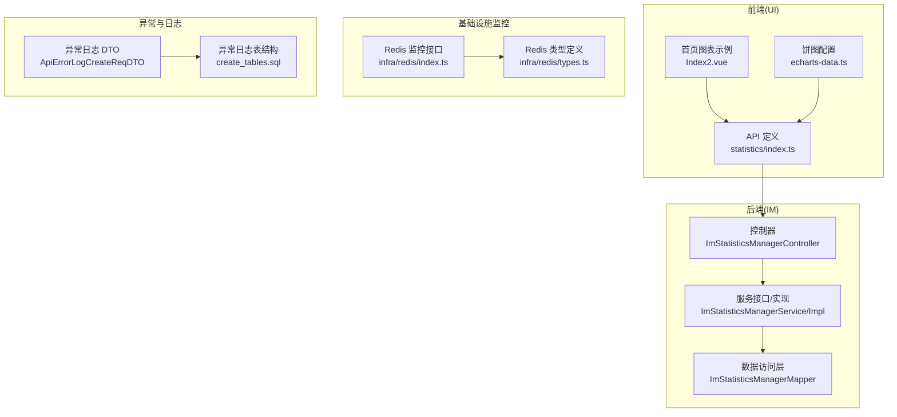
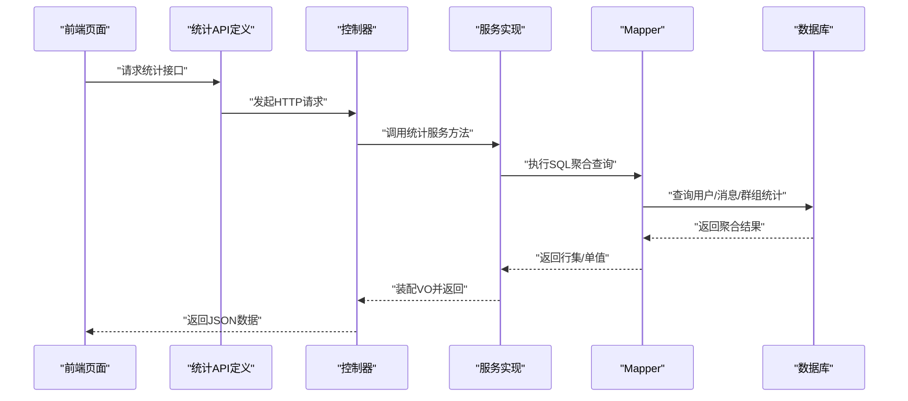
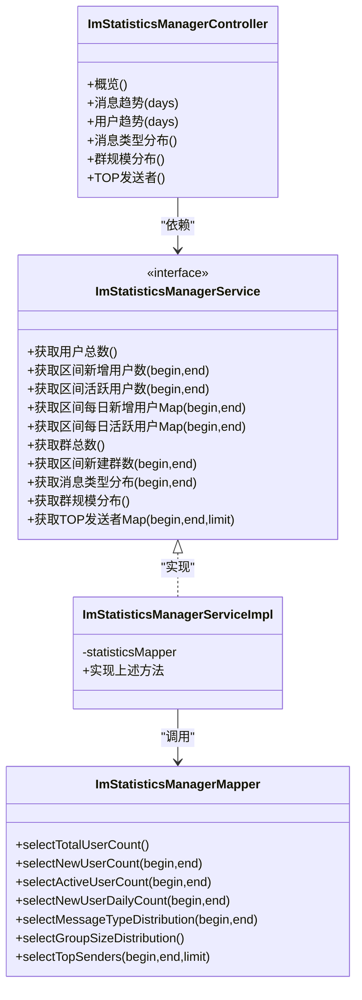
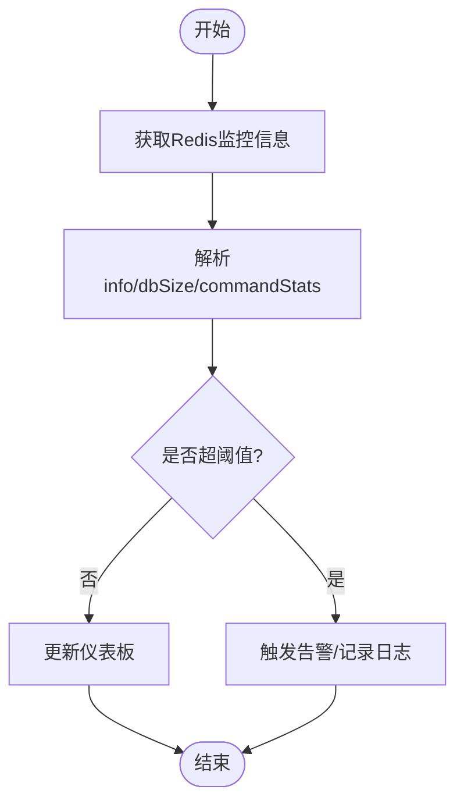
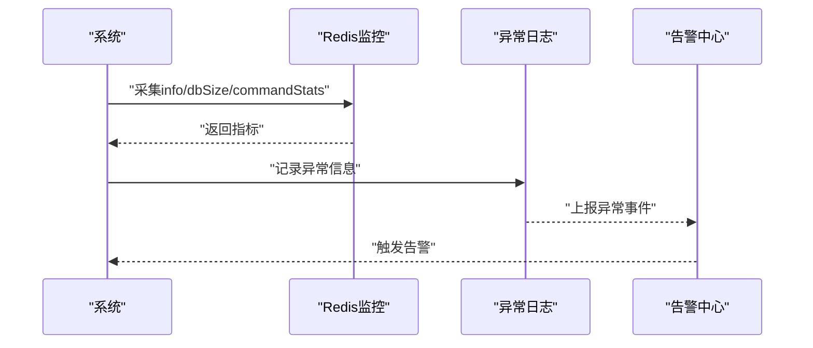
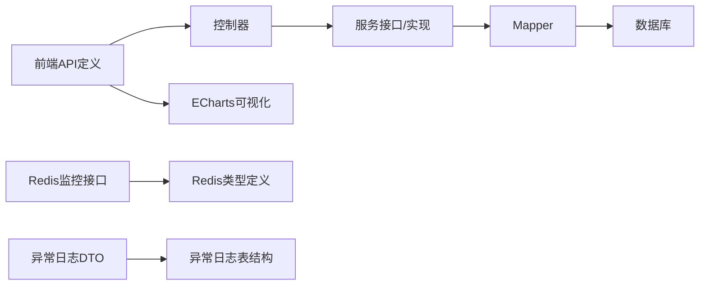

# 统计监控系统

<cite>
**本文引用的文件**
- [yudao-module-im/src/main/java/cn/iocoder/yudao/module/im/controller/admin/manager/statistics/ImStatisticsManagerController.java](file://yudao-module-im/src/main/java/cn/iocoder/yudao/module/im/controller/admin/manager/statistics/ImStatisticsManagerController.java)
- [yudao-module-im/src/main/java/cn/iocoder/yudao/module/im/service/statistics/ImStatisticsManagerService.java](file://yudao-module-im/src/main/java/cn/iocoder/yudao/module/im/service/statistics/ImStatisticsManagerService.java)
- [yudao-module-im/src/main/java/cn/iocoder/yudao/module/im/service/statistics/ImStatisticsManagerServiceImpl.java](file://yudao-module-im/src/main/java/cn/iocoder/yudao/module/im/service/statistics/ImStatisticsManagerServiceImpl.java)
- [yudao-module-im/src/main/java/cn/iocoder/yudao/module/im/dal/mysql/statistics/ImStatisticsManagerMapper.java](file://yudao-module-im/src/main/java/cn/iocoder/yudao/module/im/dal/mysql/statistics/ImStatisticsManagerMapper.java)
- [yudao-module-im/src/test/java/cn/iocoder/yudao/module/im/service/statistics/ImStatisticsManagerServiceImplTest.java](file://yudao-module-im/src/test/java/cn/iocoder/yudao/module/im/service/statistics/ImStatisticsManagerServiceImplTest.java)
- [yudao-ui/yudao-ui-admin-vue3/src/api/im/manager/statistics/index.ts](file://yudao-ui/yudao-ui-admin-vue3/src/api/im/manager/statistics/index.ts)
- [yudao-ui/yudao-ui-admin-vue3/src/views/Home/Index2.vue](file://yudao-ui/yudao-ui-admin-vue3/src/views/Home/Index2.vue)
- [yudao-ui/yudao-ui-admin-vue3/src/views/Home/echarts-data.ts](file://yudao-ui/yudao-ui-admin-vue3/src/views/Home/echarts-data.ts)
- [yudao-ui/yudao-ui-admin-vue3/src/api/infra/redis/index.ts](file://yudao-ui/yudao-ui-admin-vue3/src/api/infra/redis/index.ts)
- [yudao-ui/yudao-ui-admin-vue3/src/api/infra/redis/types.ts](file://yudao-ui/yudao-ui-admin-vue3/src/api/infra/redis/types.ts)
- [yudao-framework/yudao-common/src/main/java/cn/iocoder/yudao/framework/common/biz/infra/logger/dto/ApiErrorLogCreateReqDTO.java](file://yudao-framework/yudao-common/src/main/java/cn/iocoder/yudao/framework/common/biz/infra/logger/dto/ApiErrorLogCreateReqDTO.java)
- [yudao-module-infra/src/test/resources/sql/create_tables.sql](file://yudao-module-infra/src/test/resources/sql/create_tables.sql)
</cite>

## 目录
1. [引言](#引言)
2. [项目结构](#项目结构)
3. [核心组件](#核心组件)
4. [架构总览](#架构总览)
5. [详细组件分析](#详细组件分析)
6. [依赖关系分析](#依赖关系分析)
7. [性能考量](#性能考量)
8. [故障排查指南](#故障排查指南)
9. [结论](#结论)
10. [附录](#附录)

## 引言
本文件面向统计监控系统，围绕即时通讯（IM）模块的关键指标统计与实时监控展开，覆盖在线用户数、消息发送量、通话时长与活跃度分析；同时阐述实时监控中的在线状态跟踪、消息延迟监控与系统负载统计；统计数据存储策略（Redis 缓存、数据库落库与历史归档）、统计报表生成（日报/周报/月报与趋势分析图表）、异常检测机制（流量异常、系统故障与性能瓶颈预警）、用户行为分析（活跃时间段、消息偏好与功能使用）、系统健康检查（服务可用性、响应时间与错误率监控），以及统计结果可视化（仪表板与数据导出）。文档以仓库现有代码为依据，结合前端可视化与后端统计接口进行系统化梳理。

## 项目结构
统计监控系统主要分布在以下层次：
- 后端 IM 模块：控制器、服务层、数据访问层（MyBatis Mapper）与单元测试
- 前端 UI：IM 统计接口定义、ECharts 图表配置与首页示例
- 基础设施监控：Redis 监控接口与类型定义
- 异常日志：API 异常日志 DTO 与基础设施异常日志表结构

**图表来源**
- [yudao-module-im/src/main/java/cn/iocoder/yudao/module/im/controller/admin/manager/statistics/ImStatisticsManagerController.java](file://yudao-module-im/src/main/java/cn/iocoder/yudao/module/im/controller/admin/manager/statistics/ImStatisticsManagerController.java)
- [yudao-module-im/src/main/java/cn/iocoder/yudao/module/im/service/statistics/ImStatisticsManagerService.java](file://yudao-module-im/src/main/java/cn/iocoder/yudao/module/im/service/statistics/ImStatisticsManagerService.java)
- [yudao-module-im/src/main/java/cn/iocoder/yudao/module/im/service/statistics/ImStatisticsManagerServiceImpl.java](file://yudao-module-im/src/main/java/cn/iocoder/yudao/module/im/service/statistics/ImStatisticsManagerServiceImpl.java)
- [yudao-module-im/src/main/java/cn/iocoder/yudao/module/im/dal/mysql/statistics/ImStatisticsManagerMapper.java](file://yudao-module-im/src/main/java/cn/iocoder/yudao/module/im/dal/mysql/statistics/ImStatisticsManagerMapper.java)
- [yudao-ui/yudao-ui-admin-vue3/src/api/im/manager/statistics/index.ts](file://yudao-ui/yudao-ui-admin-vue3/src/api/im/manager/statistics/index.ts)
- [yudao-ui/yudao-ui-admin-vue3/src/views/Home/Index2.vue](file://yudao-ui/yudao-ui-admin-vue3/src/views/Home/Index2.vue)
- [yudao-ui/yudao-ui-admin-vue3/src/views/Home/echarts-data.ts](file://yudao-ui/yudao-ui-admin-vue3/src/views/Home/echarts-data.ts)
- [yudao-ui/yudao-ui-admin-vue3/src/api/infra/redis/index.ts](file://yudao-ui/yudao-ui-admin-vue3/src/api/infra/redis/index.ts)
- [yudao-ui/yudao-ui-admin-vue3/src/api/infra/redis/types.ts](file://yudao-ui/yudao-ui-admin-vue3/src/api/infra/redis/types.ts)
- [yudao-framework/yudao-common/src/main/java/cn/iocoder/yudao/framework/common/biz/infra/logger/dto/ApiErrorLogCreateReqDTO.java](file://yudao-framework/yudao-common/src/main/java/cn/iocoder/yudao/framework/common/biz/infra/logger/dto/ApiErrorLogCreateReqDTO.java)
- [yudao-module-infra/src/test/resources/sql/create_tables.sql](file://yudao-module-infra/src/test/resources/sql/create_tables.sql)

**章节来源**
- [yudao-module-im/src/main/java/cn/iocoder/yudao/module/im/controller/admin/manager/statistics/ImStatisticsManagerController.java](file://yudao-module-im/src/main/java/cn/iocoder/yudao/module/im/controller/admin/manager/statistics/ImStatisticsManagerController.java)
- [yudao-module-im/src/main/java/cn/iocoder/yudao/module/im/service/statistics/ImStatisticsManagerService.java](file://yudao-module-im/src/main/java/cn/iocoder/yudao/module/im/service/statistics/ImStatisticsManagerService.java)
- [yudao-module-im/src/main/java/cn/iocoder/yudao/module/im/service/statistics/ImStatisticsManagerServiceImpl.java](file://yudao-module-im/src/main/java/cn/iocoder/yudao/module/im/service/statistics/ImStatisticsManagerServiceImpl.java)
- [yudao-module-im/src/main/java/cn/iocoder/yudao/module/im/dal/mysql/statistics/ImStatisticsManagerMapper.java](file://yudao-module-im/src/main/java/cn/iocoder/yudao/module/im/dal/mysql/statistics/ImStatisticsManagerMapper.java)
- [yudao-ui/yudao-ui-admin-vue3/src/api/im/manager/statistics/index.ts](file://yudao-ui/yudao-ui-admin-vue3/src/api/im/manager/statistics/index.ts)
- [yudao-ui/yudao-ui-admin-vue3/src/views/Home/Index2.vue](file://yudao-ui/yudao-ui-admin-vue3/src/views/Home/Index2.vue)
- [yudao-ui/yudao-ui-admin-vue3/src/views/Home/echarts-data.ts](file://yudao-ui/yudao-ui-admin-vue3/src/views/Home/echarts-data.ts)
- [yudao-ui/yudao-ui-admin-vue3/src/api/infra/redis/index.ts](file://yudao-ui/yudao-ui-admin-vue3/src/api/infra/redis/index.ts)
- [yudao-ui/yudao-ui-admin-vue3/src/api/infra/redis/types.ts](file://yudao-ui/yudao-ui-admin-vue3/src/api/infra/redis/types.ts)
- [yudao-framework/yudao-common/src/main/java/cn/iocoder/yudao/framework/common/biz/infra/logger/dto/ApiErrorLogCreateReqDTO.java](file://yudao-framework/yudao-common/src/main/java/cn/iocoder/yudao/framework/common/biz/infra/logger/dto/ApiErrorLogCreateReqDTO.java)
- [yudao-module-infra/src/test/resources/sql/create_tables.sql](file://yudao-module-infra/src/test/resources/sql/create_tables.sql)

## 核心组件
- 控制器层：提供 IM 统计相关接口，负责接收参数、调用服务层并返回视图对象（VO）
- 服务层：定义统计接口与实现，封装聚合逻辑与数据转换
- 数据访问层：基于 SQL 的聚合查询，计算用户数、消息量、活跃度等指标
- 前端接口与可视化：定义统计 API 类型、趋势与分布数据结构，并通过 ECharts 展示
- 基础设施监控：提供 Redis 监控信息接口与类型定义
- 异常日志：定义 API 异常日志 DTO 与基础设施异常日志表结构

**章节来源**
- [yudao-module-im/src/main/java/cn/iocoder/yudao/module/im/controller/admin/manager/statistics/ImStatisticsManagerController.java](file://yudao-module-im/src/main/java/cn/iocoder/yudao/module/im/controller/admin/manager/statistics/ImStatisticsManagerController.java)
- [yudao-module-im/src/main/java/cn/iocoder/yudao/module/im/service/statistics/ImStatisticsManagerService.java](file://yudao-module-im/src/main/java/cn/iocoder/yudao/module/im/service/statistics/ImStatisticsManagerService.java)
- [yudao-module-im/src/main/java/cn/iocoder/yudao/module/im/service/statistics/ImStatisticsManagerServiceImpl.java](file://yudao-module-im/src/main/java/cn/iocoder/yudao/module/im/service/statistics/ImStatisticsManagerServiceImpl.java)
- [yudao-module-im/src/main/java/cn/iocoder/yudao/module/im/dal/mysql/statistics/ImStatisticsManagerMapper.java](file://yudao-module-im/src/main/java/cn/iocoder/yudao/module/im/dal/mysql/statistics/ImStatisticsManagerMapper.java)
- [yudao-ui/yudao-ui-admin-vue3/src/api/im/manager/statistics/index.ts](file://yudao-ui/yudao-ui-admin-vue3/src/api/im/manager/statistics/index.ts)
- [yudao-ui/yudao-ui-admin-vue3/src/api/infra/redis/index.ts](file://yudao-ui/yudao-ui-admin-vue3/src/api/infra/redis/index.ts)
- [yudao-ui/yudao-ui-admin-vue3/src/api/infra/redis/types.ts](file://yudao-ui/yudao-ui-admin-vue3/src/api/infra/redis/types.ts)
- [yudao-framework/yudao-common/src/main/java/cn/iocoder/yudao/framework/common/biz/infra/logger/dto/ApiErrorLogCreateReqDTO.java](file://yudao-framework/yudao-common/src/main/java/cn/iocoder/yudao/framework/common/biz/infra/logger/dto/ApiErrorLogCreateReqDTO.java)
- [yudao-module-infra/src/test/resources/sql/create_tables.sql](file://yudao-module-infra/src/test/resources/sql/create_tables.sql)

## 架构总览
统计监控系统采用“前端 API + 后端服务 + 数据访问层 + 数据库”的分层架构。前端通过 axios 请求后端接口，后端控制器调用服务层，服务层执行 SQL 聚合查询，最终返回给前端进行可视化展示。基础设施监控通过 Redis 接口获取运行状态，异常日志用于系统健康检查与问题定位。

**图表来源**
- [yudao-ui/yudao-ui-admin-vue3/src/api/im/manager/statistics/index.ts](file://yudao-ui/yudao-ui-admin-vue3/src/api/im/manager/statistics/index.ts)
- [yudao-module-im/src/main/java/cn/iocoder/yudao/module/im/controller/admin/manager/statistics/ImStatisticsManagerController.java](file://yudao-module-im/src/main/java/cn/iocoder/yudao/module/im/controller/admin/manager/statistics/ImStatisticsManagerController.java)
- [yudao-module-im/src/main/java/cn/iocoder/yudao/module/im/service/statistics/ImStatisticsManagerServiceImpl.java](file://yudao-module-im/src/main/java/cn/iocoder/yudao/module/im/service/statistics/ImStatisticsManagerServiceImpl.java)
- [yudao-module-im/src/main/java/cn/iocoder/yudao/module/im/dal/mysql/statistics/ImStatisticsManagerMapper.java](file://yudao-module-im/src/main/java/cn/iocoder/yudao/module/im/dal/mysql/statistics/ImStatisticsManagerMapper.java)

## 详细组件分析

### 统计接口与数据模型
- 概览接口：返回总用户数、今日新增用户、总群数、今日新增群、日/周/月活跃用户、今日私聊/群聊消息量、昨日私聊/群聊消息量
- 趋势接口：支持指定天数的消息趋势与用户趋势
- 分布接口：消息类型分布（最近30天）、群规模分布、TOP发送者（最近30天）

**图表来源**
- [yudao-module-im/src/main/java/cn/iocoder/yudao/module/im/controller/admin/manager/statistics/ImStatisticsManagerController.java](file://yudao-module-im/src/main/java/cn/iocoder/yudao/module/im/controller/admin/manager/statistics/ImStatisticsManagerController.java)
- [yudao-module-im/src/main/java/cn/iocoder/yudao/module/im/service/statistics/ImStatisticsManagerService.java](file://yudao-module-im/src/main/java/cn/iocoder/yudao/module/im/service/statistics/ImStatisticsManagerService.java)
- [yudao-module-im/src/main/java/cn/iocoder/yudao/module/im/service/statistics/ImStatisticsManagerServiceImpl.java](file://yudao-module-im/src/main/java/cn/iocoder/yudao/module/im/service/statistics/ImStatisticsManagerServiceImpl.java)
- [yudao-module-im/src/main/java/cn/iocoder/yudao/module/im/dal/mysql/statistics/ImStatisticsManagerMapper.java](file://yudao-module-im/src/main/java/cn/iocoder/yudao/module/im/dal/mysql/statistics/ImStatisticsManagerMapper.java)

**章节来源**
- [yudao-ui/yudao-ui-admin-vue3/src/api/im/manager/statistics/index.ts](file://yudao-ui/yudao-ui-admin-vue3/src/api/im/manager/statistics/index.ts)
- [yudao-module-im/src/main/java/cn/iocoder/yudao/module/im/controller/admin/manager/statistics/ImStatisticsManagerController.java](file://yudao-module-im/src/main/java/cn/iocoder/yudao/module/im/controller/admin/manager/statistics/ImStatisticsManagerController.java)
- [yudao-module-im/src/main/java/cn/iocoder/yudao/module/im/service/statistics/ImStatisticsManagerService.java](file://yudao-module-im/src/main/java/cn/iocoder/yudao/module/im/service/statistics/ImStatisticsManagerService.java)
- [yudao-module-im/src/main/java/cn/iocoder/yudao/module/im/service/statistics/ImStatisticsManagerServiceImpl.java](file://yudao-module-im/src/main/java/cn/iocoder/yudao/module/im/service/statistics/ImStatisticsManagerServiceImpl.java)
- [yudao-module-im/src/main/java/cn/iocoder/yudao/module/im/dal/mysql/statistics/ImStatisticsManagerMapper.java](file://yudao-module-im/src/main/java/cn/iocoder/yudao/module/im/dal/mysql/statistics/ImStatisticsManagerMapper.java)

### 实时监控与可视化
- 在线状态跟踪：可通过 Redis 监控接口获取实例运行状态、命令统计等，辅助判断在线用户与会话状态
- 消息延迟监控：可结合消息发送/接收时间戳与数据库记录时间差进行估算
- 系统负载统计：通过 Redis info 中的 CPU、内存、连接数等指标评估系统负载
- 可视化展示：首页提供周活跃量柱状图示例与饼图配置，前端通过 ECharts 进行渲染

**图表来源**
- [yudao-ui/yudao-ui-admin-vue3/src/api/infra/redis/index.ts](file://yudao-ui/yudao-ui-admin-vue3/src/api/infra/redis/index.ts)
- [yudao-ui/yudao-ui-admin-vue3/src/api/infra/redis/types.ts](file://yudao-ui/yudao-ui-admin-vue3/src/api/infra/redis/types.ts)
- [yudao-ui/yudao-ui-admin-vue3/src/views/Home/Index2.vue](file://yudao-ui/yudao-ui-admin-vue3/src/views/Home/Index2.vue)
- [yudao-ui/yudao-ui-admin-vue3/src/views/Home/echarts-data.ts](file://yudao-ui/yudao-ui-admin-vue3/src/views/Home/echarts-data.ts)

**章节来源**
- [yudao-ui/yudao-ui-admin-vue3/src/api/infra/redis/index.ts](file://yudao-ui/yudao-ui-admin-vue3/src/api/infra/redis/index.ts)
- [yudao-ui/yudao-ui-admin-vue3/src/api/infra/redis/types.ts](file://yudao-ui/yudao-ui-admin-vue3/src/api/infra/redis/types.ts)
- [yudao-ui/yudao-ui-admin-vue3/src/views/Home/Index2.vue](file://yudao-ui/yudao-ui-admin-vue3/src/views/Home/Index2.vue)
- [yudao-ui/yudao-ui-admin-vue3/src/views/Home/echarts-data.ts](file://yudao-ui/yudao-ui-admin-vue3/src/views/Home/echarts-data.ts)

### 统计数据存储策略
- Redis 缓存：用于高频读取的指标缓存与会话状态存储，提升查询性能
- 数据库落库：统计结果持久化至 MySQL，便于趋势分析与报表生成
- 历史归档：建议按月/季度进行冷热分离与压缩归档，降低热数据压力

说明：当前仓库未提供具体缓存实现细节与归档策略代码，以上为通用实践建议。

### 统计报表生成
- 日报/周报/月报：基于趋势接口返回的 dates 与 series 结构，前端按周期聚合生成报表
- 趋势分析图表：ECharts 提供折线/柱状/饼图配置，支持多系列对比展示

**章节来源**
- [yudao-ui/yudao-ui-admin-vue3/src/api/im/manager/statistics/index.ts](file://yudao-ui/yudao-ui-admin-vue3/src/api/im/manager/statistics/index.ts)
- [yudao-ui/yudao-ui-admin-vue3/src/views/Home/Index2.vue](file://yudao-ui/yudao-ui-admin-vue3/src/views/Home/Index2.vue)
- [yudao-ui/yudao-ui-admin-vue3/src/views/Home/echarts-data.ts](file://yudao-ui/yudao-ui-admin-vue3/src/views/Home/echarts-data.ts)

### 异常检测机制
- 流量异常：通过 Redis 监控命令统计与连接数变化检测突发流量
- 系统故障：API 异常日志 DTO 定义了异常堆栈与根因信息，可用于故障定位
- 性能瓶颈：结合数据库慢查询日志与 Redis 内存/CPU指标进行综合判断

**图表来源**
- [yudao-ui/yudao-ui-admin-vue3/src/api/infra/redis/index.ts](file://yudao-ui/yudao-ui-admin-vue3/src/api/infra/redis/index.ts)
- [yudao-ui/yudao-ui-admin-vue3/src/api/infra/redis/types.ts](file://yudao-ui/yudao-ui-admin-vue3/src/api/infra/redis/types.ts)
- [yudao-framework/yudao-common/src/main/java/cn/iocoder/yudao/framework/common/biz/infra/logger/dto/ApiErrorLogCreateReqDTO.java](file://yudao-framework/yudao-common/src/main/java/cn/iocoder/yudao/framework/common/biz/infra/logger/dto/ApiErrorLogCreateReqDTO.java)
- [yudao-module-infra/src/test/resources/sql/create_tables.sql](file://yudao-module-infra/src/test/resources/sql/create_tables.sql)

**章节来源**
- [yudao-framework/yudao-common/src/main/java/cn/iocoder/yudao/framework/common/biz/infra/logger/dto/ApiErrorLogCreateReqDTO.java](file://yudao-framework/yudao-common/src/main/java/cn/iocoder/yudao/framework/common/biz/infra/logger/dto/ApiErrorLogCreateReqDTO.java)
- [yudao-module-infra/src/test/resources/sql/create_tables.sql](file://yudao-module-infra/src/test/resources/sql/create_tables.sql)

### 用户行为分析
- 活跃时间段：通过用户趋势与周活跃量图表分析用户活跃时段
- 消息偏好：通过消息类型分布与 TOP 发送者分析用户消息偏好
- 功能使用：结合群规模分布与群组创建趋势评估功能使用情况

**章节来源**
- [yudao-ui/yudao-ui-admin-vue3/src/api/im/manager/statistics/index.ts](file://yudao-ui/yudao-ui-admin-vue3/src/api/im/manager/statistics/index.ts)
- [yudao-ui/yudao-ui-admin-vue3/src/views/Home/Index2.vue](file://yudao-ui/yudao-ui-admin-vue3/src/views/Home/Index2.vue)
- [yudao-ui/yudao-ui-admin-vue3/src/views/Home/echarts-data.ts](file://yudao-ui/yudao-ui-admin-vue3/src/views/Home/echarts-data.ts)

### 系统健康检查
- 服务可用性：通过 Redis 监控接口与 API 响应状态判断服务健康
- 响应时间与错误率：结合异常日志与数据库查询耗时进行健康评估
- 错误率监控：异常日志表结构包含处理状态与时间，可用于错误率统计

**章节来源**
- [yudao-ui/yudao-ui-admin-vue3/src/api/infra/redis/index.ts](file://yudao-ui/yudao-ui-admin-vue3/src/api/infra/redis/index.ts)
- [yudao-ui/yudao-ui-admin-vue3/src/api/infra/redis/types.ts](file://yudao-ui/yudao-ui-admin-vue3/src/api/infra/redis/types.ts)
- [yudao-framework/yudao-common/src/main/java/cn/iocoder/yudao/framework/common/biz/infra/logger/dto/ApiErrorLogCreateReqDTO.java](file://yudao-framework/yudao-common/src/main/java/cn/iocoder/yudao/framework/common/biz/infra/logger/dto/ApiErrorLogCreateReqDTO.java)
- [yudao-module-infra/src/test/resources/sql/create_tables.sql](file://yudao-module-infra/src/test/resources/sql/create_tables.sql)

### 统计结果可视化
- 仪表板展示：首页提供周活跃量与饼图示例，支持多卡片与多图表组合
- 数据导出：可在前端对趋势与分布数据进行导出操作（具体实现需在业务页面中扩展）

**章节来源**
- [yudao-ui/yudao-ui-admin-vue3/src/views/Home/Index2.vue](file://yudao-ui/yudao-ui-admin-vue3/src/views/Home/Index2.vue)
- [yudao-ui/yudao-ui-admin-vue3/src/views/Home/echarts-data.ts](file://yudao-ui/yudao-ui-admin-vue3/src/views/Home/echarts-data.ts)

## 依赖关系分析
- 控制器依赖服务接口，服务实现依赖 Mapper，Mapper 依赖数据库
- 前端 API 定义与控制器接口一一对应，前端通过 ECharts 渲染统计结果
- Redis 监控接口与类型定义相互依赖，用于系统健康检查
- 异常日志 DTO 与基础设施异常日志表结构相互对应，用于故障定位

**图表来源**
- [yudao-module-im/src/main/java/cn/iocoder/yudao/module/im/controller/admin/manager/statistics/ImStatisticsManagerController.java](file://yudao-module-im/src/main/java/cn/iocoder/yudao/module/im/controller/admin/manager/statistics/ImStatisticsManagerController.java)
- [yudao-module-im/src/main/java/cn/iocoder/yudao/module/im/service/statistics/ImStatisticsManagerService.java](file://yudao-module-im/src/main/java/cn/iocoder/yudao/module/im/service/statistics/ImStatisticsManagerService.java)
- [yudao-module-im/src/main/java/cn/iocoder/yudao/module/im/service/statistics/ImStatisticsManagerServiceImpl.java](file://yudao-module-im/src/main/java/cn/iocoder/yudao/module/im/service/statistics/ImStatisticsManagerServiceImpl.java)
- [yudao-module-im/src/main/java/cn/iocoder/yudao/module/im/dal/mysql/statistics/ImStatisticsManagerMapper.java](file://yudao-module-im/src/main/java/cn/iocoder/yudao/module/im/dal/mysql/statistics/ImStatisticsManagerMapper.java)
- [yudao-ui/yudao-ui-admin-vue3/src/api/im/manager/statistics/index.ts](file://yudao-ui/yudao-ui-admin-vue3/src/api/im/manager/statistics/index.ts)
- [yudao-ui/yudao-ui-admin-vue3/src/views/Home/echarts-data.ts](file://yudao-ui/yudao-ui-admin-vue3/src/views/Home/echarts-data.ts)
- [yudao-ui/yudao-ui-admin-vue3/src/api/infra/redis/index.ts](file://yudao-ui/yudao-ui-admin-vue3/src/api/infra/redis/index.ts)
- [yudao-ui/yudao-ui-admin-vue3/src/api/infra/redis/types.ts](file://yudao-ui/yudao-ui-admin-vue3/src/api/infra/redis/types.ts)
- [yudao-framework/yudao-common/src/main/java/cn/iocoder/yudao/framework/common/biz/infra/logger/dto/ApiErrorLogCreateReqDTO.java](file://yudao-framework/yudao-common/src/main/java/cn/iocoder/yudao/framework/common/biz/infra/logger/dto/ApiErrorLogCreateReqDTO.java)
- [yudao-module-infra/src/test/resources/sql/create_tables.sql](file://yudao-module-infra/src/test/resources/sql/create_tables.sql)

**章节来源**
- [yudao-module-im/src/main/java/cn/iocoder/yudao/module/im/controller/admin/manager/statistics/ImStatisticsManagerController.java](file://yudao-module-im/src/main/java/cn/iocoder/yudao/module/im/controller/admin/manager/statistics/ImStatisticsManagerController.java)
- [yudao-module-im/src/main/java/cn/iocoder/yudao/module/im/service/statistics/ImStatisticsManagerService.java](file://yudao-module-im/src/main/java/cn/iocoder/yudao/module/im/service/statistics/ImStatisticsManagerService.java)
- [yudao-module-im/src/main/java/cn/iocoder/yudao/module/im/service/statistics/ImStatisticsManagerServiceImpl.java](file://yudao-module-im/src/main/java/cn/iocoder/yudao/module/im/service/statistics/ImStatisticsManagerServiceImpl.java)
- [yudao-module-im/src/main/java/cn/iocoder/yudao/module/im/dal/mysql/statistics/ImStatisticsManagerMapper.java](file://yudao-module-im/src/main/java/cn/iocoder/yudao/module/im/dal/mysql/statistics/ImStatisticsManagerMapper.java)
- [yudao-ui/yudao-ui-admin-vue3/src/api/im/manager/statistics/index.ts](file://yudao-ui/yudao-ui-admin-vue3/src/api/im/manager/statistics/index.ts)
- [yudao-ui/yudao-ui-admin-vue3/src/api/infra/redis/index.ts](file://yudao-ui/yudao-ui-admin-vue3/src/api/infra/redis/index.ts)
- [yudao-ui/yudao-ui-admin-vue3/src/api/infra/redis/types.ts](file://yudao-ui/yudao-ui-admin-vue3/src/api/infra/redis/types.ts)
- [yudao-framework/yudao-common/src/main/java/cn/iocoder/yudao/framework/common/biz/infra/logger/dto/ApiErrorLogCreateReqDTO.java](file://yudao-framework/yudao-common/src/main/java/cn/iocoder/yudao/framework/common/biz/infra/logger/dto/ApiErrorLogCreateReqDTO.java)
- [yudao-module-infra/src/test/resources/sql/create_tables.sql](file://yudao-module-infra/src/test/resources/sql/create_tables.sql)

## 性能考量
- 查询优化：统计接口涉及大量聚合查询，建议在时间字段与用户/群组主键上建立索引
- 缓存策略：热点指标可引入 Redis 缓存，设置合理过期时间，避免脏读
- 分页与限流：趋势接口支持 days 参数，建议限制最大天数并增加接口限流
- 批量落库：历史数据归档时采用批量写入，减少事务开销

## 故障排查指南
- Redis 监控异常：确认 Redis 服务连通性与认证配置，检查命令统计与 dbSize 是否正常
- API 异常日志：查看异常名称、类名、方法名与栈轨迹，定位问题根因
- 数据不一致：核对 Mapper SQL 与数据库表结构，确保字段与条件一致
- 单元测试：参考服务实现类的单元测试，验证边界条件与空值处理

**章节来源**
- [yudao-ui/yudao-ui-admin-vue3/src/api/infra/redis/index.ts](file://yudao-ui/yudao-ui-admin-vue3/src/api/infra/redis/index.ts)
- [yudao-ui/yudao-ui-admin-vue3/src/api/infra/redis/types.ts](file://yudao-ui/yudao-ui-admin-vue3/src/api/infra/redis/types.ts)
- [yudao-framework/yudao-common/src/main/java/cn/iocoder/yudao/framework/common/biz/infra/logger/dto/ApiErrorLogCreateReqDTO.java](file://yudao-framework/yudao-common/src/main/java/cn/iocoder/yudao/framework/common/biz/infra/logger/dto/ApiErrorLogCreateReqDTO.java)
- [yudao-module-infra/src/test/resources/sql/create_tables.sql](file://yudao-module-infra/src/test/resources/sql/create_tables.sql)
- [yudao-module-im/src/test/java/cn/iocoder/yudao/module/im/service/statistics/ImStatisticsManagerServiceImplTest.java](file://yudao-module-im/src/test/java/cn/iocoder/yudao/module/im/service/statistics/ImStatisticsManagerServiceImplTest.java)

## 结论
本统计监控系统以 IM 模块为核心，结合前端可视化与基础设施监控，实现了关键指标的采集、聚合与展示。通过 Redis 缓存与数据库落库相结合的方式，满足实时性与持久化需求；通过异常日志与健康检查机制，保障系统稳定性。后续可在缓存策略、历史归档与告警联动方面进一步完善，以支撑更大规模的业务场景。

## 附录
- 关键接口与数据结构请参考前端 API 定义与控制器实现
- 可视化示例可参考首页图表组件与 ECharts 配置
- 健康检查与异常日志请参考 Redis 监控接口与异常日志表结构