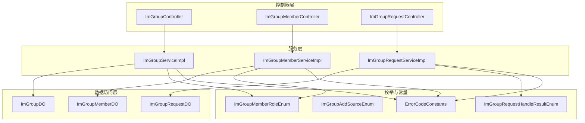
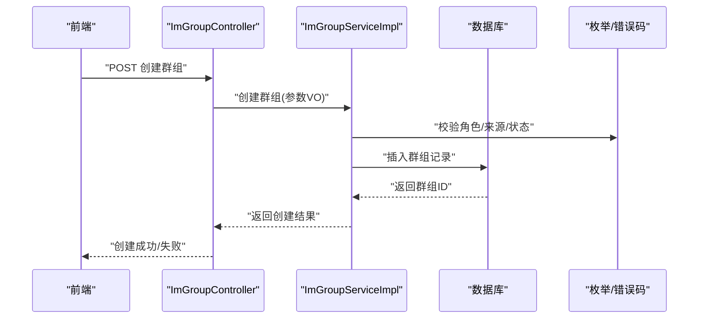
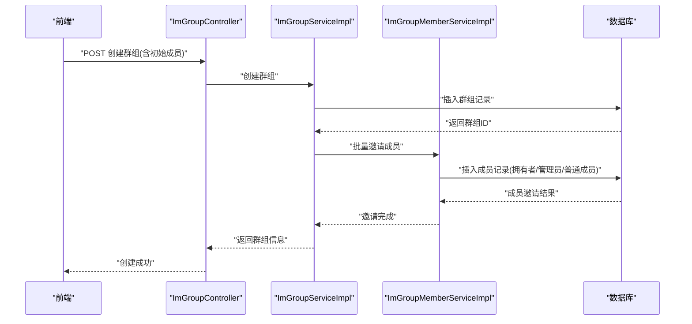
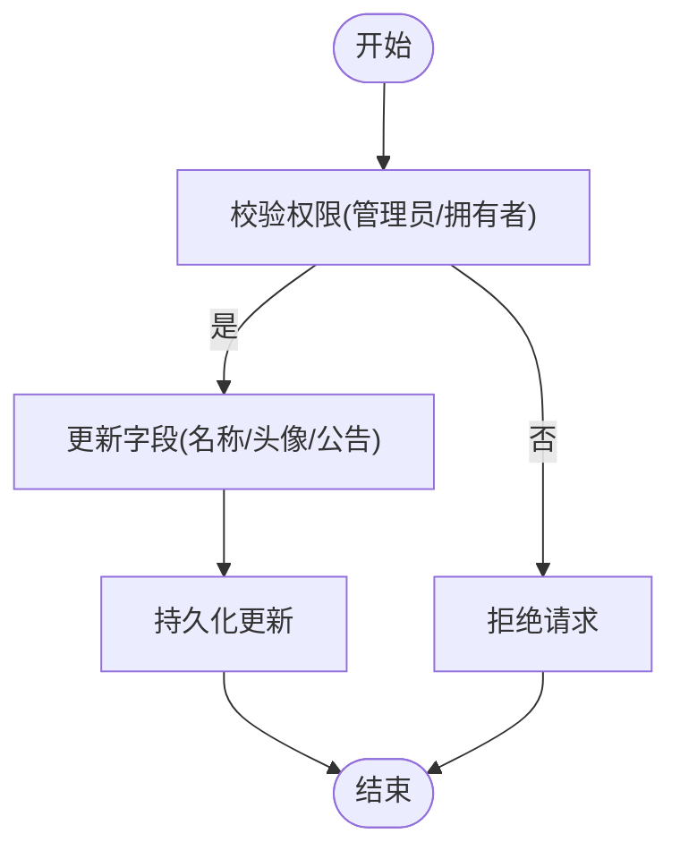
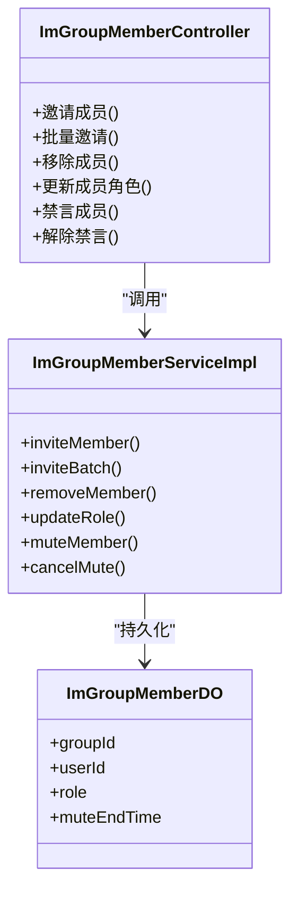
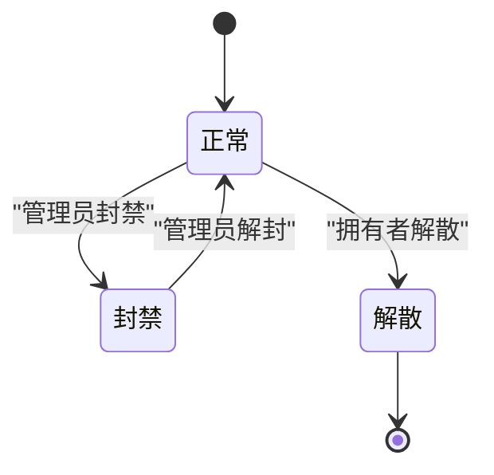
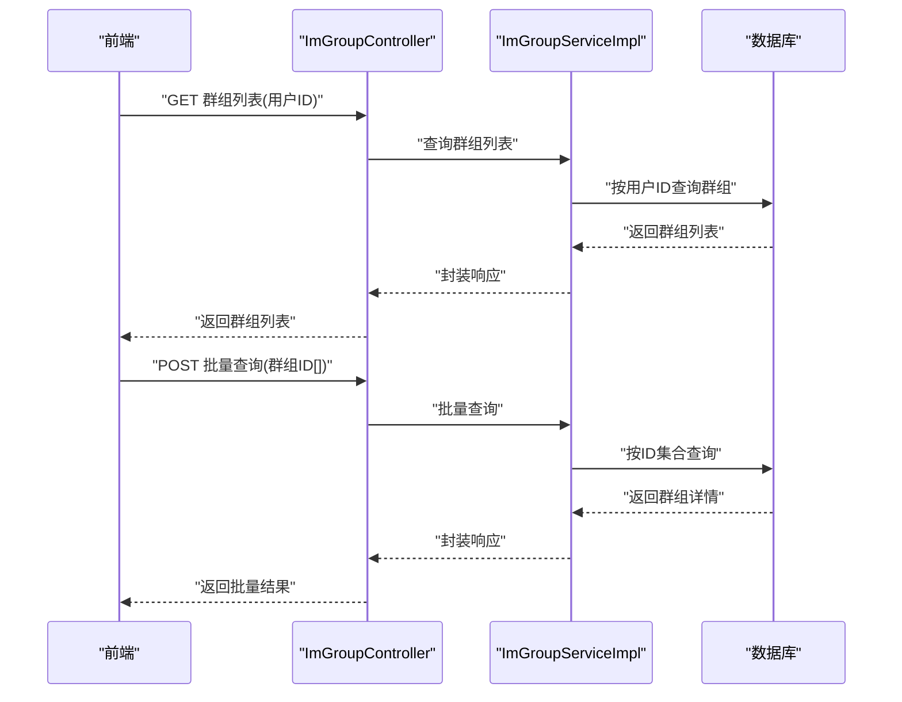
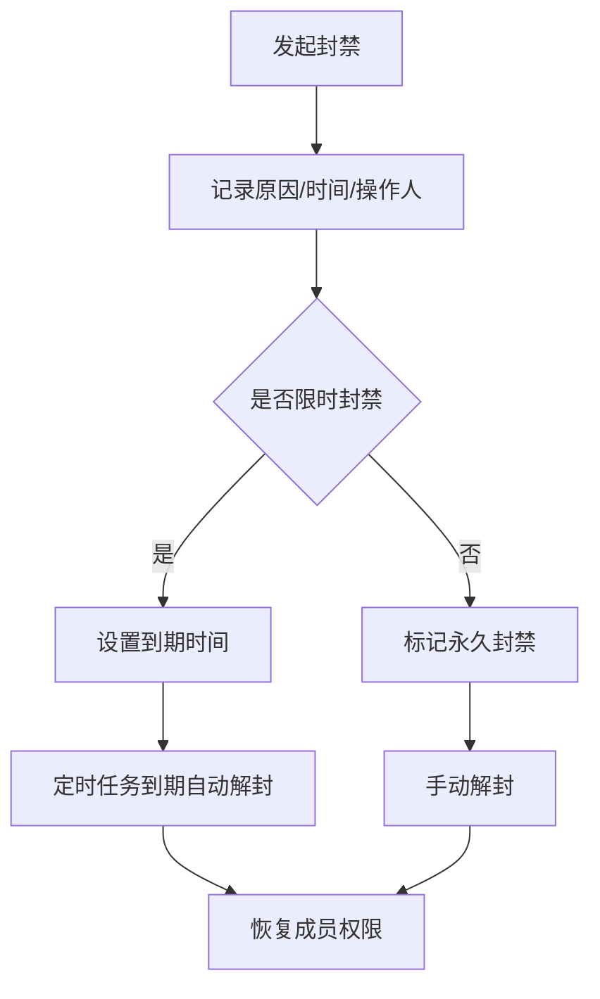
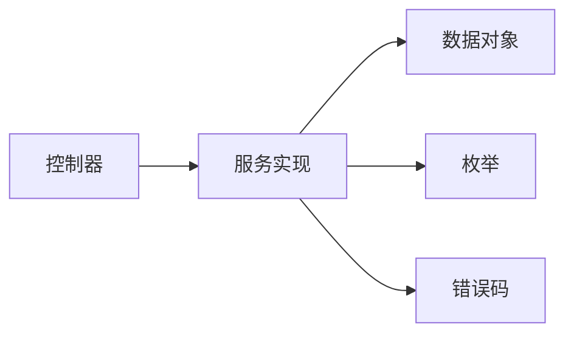
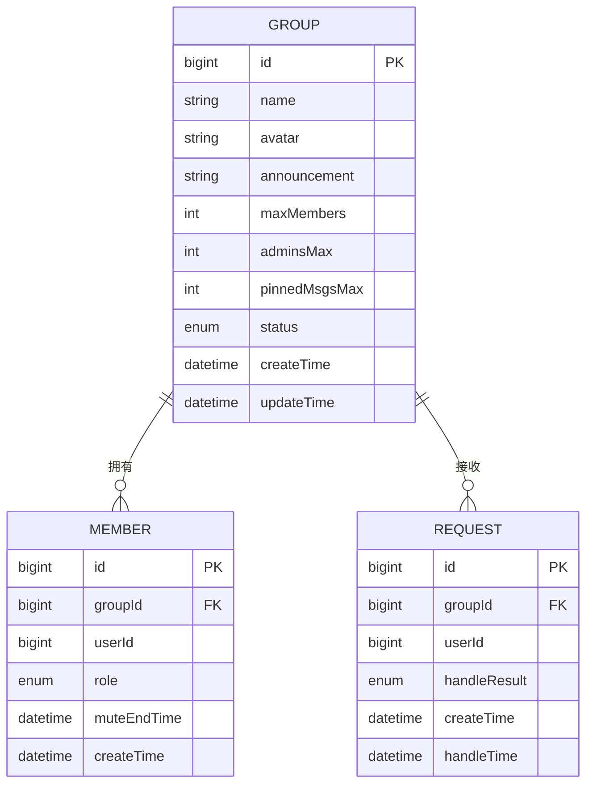

# 群组创建与管理

<cite>
**本文引用的文件**
- [ImGroupController.java](file://yudao-module-im/src/main/java/cn/iocoder/yudao/module/im/controller/admin/group/ImGroupController.java)
- [ImGroupMemberController.java](file://yudao-module-im/src/main/java/cn/iocoder/yudao/module/im/controller/admin/group/ImGroupMemberController.java)
- [ImGroupRequestController.java](file://yudao-module-im/src/main/java/cn/iocoder/yudao/module/im/controller/admin/group/ImGroupRequestController.java)
- [ImGroupServiceImpl.java](file://yudao-module-im/src/main/java/cn/iocoder/yudao/module/im/service/group/ImGroupServiceImpl.java)
- [ImGroupMemberServiceImpl.java](file://yudao-module-im/src/main/java/cn/iocoder/yudao/module/im/service/group/ImGroupMemberServiceImpl.java)
- [ImGroupRequestServiceImpl.java](file://yudao-module-im/src/main/java/cn/iocoder/yudao/module/im/service/group/ImGroupRequestServiceImpl.java)
- [ImGroupDO.java](file://yudao-module-im/src/main/java/cn/iocoder/yudao/module/im/dal/dataobject/group/ImGroupDO.java)
- [ImGroupMemberDO.java](file://yudao-module-im/src/main/java/cn/iocoder/yudao/module/im/dal/dataobject/group/ImGroupMemberDO.java)
- [ImGroupRequestDO.java](file://yudao-module-im/src/main/java/cn/iocoder/yudao/module/im/dal/dataobject/group/ImGroupRequestDO.java)
- [ImGroupCreateReqVO.java](file://yudao-module-im/src/main/java/cn/iocoder/yudao/module/im/controller/admin/group/vo/ImGroupCreateReqVO.java)
- [ImGroupSaveReqVO.java](file://yudao-module-im/src/main/java/cn/iocoder/yudao/module/im/controller/admin/group/vo/ImGroupSaveReqVO.java)
- [ImGroupUpdateReqVO.java](file://yudao-module-im/src/main/java/cn/iocoder/yudao/module/im/controller/admin/group/vo/ImGroupUpdateReqVO.java)
- [ImGroupMemberInviteReqVO.java](file://yudao-module-im/src/main/java/cn/iocoder/yudao/module/im/controller/admin/group/vo/member/ImGroupMemberInviteReqVO.java)
- [ImGroupMemberCreateReqVO.java](file://yudao-module-im/src/main/java/cn/iocoder/yudao/module/im/controller/admin/group/vo/member/ImGroupMemberCreateReqVO.java)
- [ImGroupMemberRemoveReqVO.java](file://yudao-module-im/src/main/java/cn/iocoder/yudao/module/im/controller/admin/group/vo/member/ImGroupMemberRemoveReqVO.java)
- [ImGroupMemberUpdateReqVO.java](file://yudao-module-im/src/main/java/cn/iocoder/yudao/module/im/controller/admin/group/vo/member/ImGroupMemberUpdateReqVO.java)
- [ImGroupAdminAddReqVO.java](file://yudao-module-im/src/main/java/cn/iocoder/yudao/module/im/controller/admin/group/vo/ImGroupAdminAddReqVO.java)
- [ImGroupAdminRemoveReqVO.java](file://yudao-module-im/src/main/java/cn/iocoder/yudao/module/im/controller/admin/group/vo/ImGroupAdminRemoveReqVO.java)
- [ImGroupMuteAllReqVO.java](file://yudao-module-im/src/main/java/cn/iocoder/yudao/module/im/controller/admin/group/vo/ImGroupMuteAllReqVO.java)
- [ImGroupMuteMemberReqVO.java](file://yudao-module-im/src/main/java/cn/iocoder/yudao/module/im/controller/admin/group/vo/ImGroupMuteMemberReqVO.java)
- [ImGroupCancelMuteMemberReqVO.java](file://yudao-module-im/src/main/java/cn/iocoder/yudao/module/im/controller/admin/group/vo/ImGroupCancelMuteMemberReqVO.java)
- [ImGroupMessagePinReqVO.java](file://yudao-module-im/src/main/java/cn/iocoder/yudao/module/im/controller/admin/group/vo/ImGroupMessagePinReqVO.java)
- [ImGroupPageReqVO.java](file://yudao-module-im/src/main/java/cn/iocoder/yudao/module/im/controller/admin/group/vo/ImGroupPageReqVO.java)
- [ImGroupMemberRespVO.java](file://yudao-module-im/src/main/java/cn/iocoder/yudao/module/im/controller/admin/group/vo/member/ImGroupMemberRespVO.java)
- [ImGroupRespVO.java](file://yudao-module-im/src/main/java/cn/iocoder/yudao/module/im/controller/admin/group/vo/ImGroupRespVO.java)
- [ImGroupMemberRoleEnum.java](file://yudao-module-im/src/main/java/cn/iocoder/yudao/module/im/enums/group/ImGroupMemberRoleEnum.java)
- [ImGroupAddSourceEnum.java](file://yudao-module-im/src/main/java/cn/iocoder/yudao/module/im/enums/group/ImGroupAddSourceEnum.java)
- [ImGroupRequestHandleResultEnum.java](file://yudao-module-im/src/main/java/cn/iocoder/yudao/module/im/enums/group/ImGroupRequestHandleResultEnum.java)
- [ErrorCodeConstants.java](file://yudao-module-im/src/main/java/cn/iocoder/yudao/module/im/enums/ErrorCodeConstants.java)
</cite>

## 目录
1. [引言](#引言)
2. [项目结构](#项目结构)
3. [核心组件](#核心组件)
4. [架构总览](#架构总览)
5. [详细组件分析](#详细组件分析)
6. [依赖关系分析](#依赖关系分析)
7. [性能考虑](#性能考虑)
8. [故障排查指南](#故障排查指南)
9. [结论](#结论)
10. [附录](#附录)

## 引言
本文件聚焦于即时通讯模块中的群组创建与管理能力，系统化梳理从群组创建、成员邀请与权限配置，到群组信息维护、状态管理、配置参数、查询接口以及安全控制的完整链路。文档以代码为依据，结合类图、时序图与流程图，帮助开发者快速理解实现细节与扩展点。

## 项目结构
IM 模块采用分层架构：控制器层负责对外 API；服务层封装业务逻辑；持久层映射数据库实体；枚举定义状态与角色；VO 定义请求/响应模型。群组相关代码主要分布在以下位置：
- 控制器：admin/group 下的 ImGroupController、ImGroupMemberController、ImGroupRequestController
- 服务：service/group 下的 ImGroupServiceImpl、ImGroupMemberServiceImpl、ImGroupRequestServiceImpl
- 数据对象：dal/dataobject/group 下的 ImGroupDO、ImGroupMemberDO、ImGroupRequestDO
- 枚举：enums/group 下的成员角色、加群来源、请求处理结果等
- VO：controller/admin/group/vo 及其子包下的请求/响应模型

图表来源
- [ImGroupController.java:1-200](file://yudao-module-im/src/main/java/cn/iocoder/yudao/module/im/controller/admin/group/ImGroupController.java#L1-L200)
- [ImGroupMemberController.java:1-200](file://yudao-module-im/src/main/java/cn/iocoder/yudao/module/im/controller/admin/group/ImGroupMemberController.java#L1-L200)
- [ImGroupRequestController.java:1-200](file://yudao-module-im/src/main/java/cn/iocoder/yudao/module/im/controller/admin/group/ImGroupRequestController.java#L1-L200)
- [ImGroupServiceImpl.java:1-300](file://yudao-module-im/src/main/java/cn/iocoder/yudao/module/im/service/group/ImGroupServiceImpl.java#L1-L300)
- [ImGroupMemberServiceImpl.java:1-300](file://yudao-module-im/src/main/java/cn/iocoder/yudao/module/im/service/group/ImGroupMemberServiceImpl.java#L1-L300)
- [ImGroupRequestServiceImpl.java:1-300](file://yudao-module-im/src/main/java/cn/iocoder/yudao/module/im/service/group/ImGroupRequestServiceImpl.java#L1-L300)
- [ImGroupDO.java:1-200](file://yudao-module-im/src/main/java/cn/iocoder/yudao/module/im/dal/dataobject/group/ImGroupDO.java#L1-L200)
- [ImGroupMemberDO.java:1-200](file://yudao-module-im/src/main/java/cn/iocoder/yudao/module/im/dal/dataobject/group/ImGroupMemberDO.java#L1-L200)
- [ImGroupRequestDO.java:1-200](file://yudao-module-im/src/main/java/cn/iocoder/yudao/module/im/dal/dataobject/group/ImGroupRequestDO.java#L1-L200)
- [ImGroupMemberRoleEnum.java:1-200](file://yudao-module-im/src/main/java/cn/iocoder/yudao/module/im/enums/group/ImGroupMemberRoleEnum.java#L1-L200)
- [ImGroupAddSourceEnum.java:1-200](file://yudao-module-im/src/main/java/cn/iocoder/yudao/module/im/enums/group/ImGroupAddSourceEnum.java#L1-L200)
- [ImGroupRequestHandleResultEnum.java:1-200](file://yudao-module-im/src/main/java/cn/iocoder/yudao/module/im/enums/group/ImGroupRequestHandleResultEnum.java#L1-L200)
- [ErrorCodeConstants.java:1-200](file://yudao-module-im/src/main/java/cn/iocoder/yudao/module/im/enums/ErrorCodeConstants.java#L1-L200)

章节来源
- [ImGroupController.java:1-200](file://yudao-module-im/src/main/java/cn/iocoder/yudao/module/im/controller/admin/group/ImGroupController.java#L1-L200)
- [ImGroupMemberController.java:1-200](file://yudao-module-im/src/main/java/cn/iocoder/yudao/module/im/controller/admin/group/ImGroupMemberController.java#L1-L200)
- [ImGroupRequestController.java:1-200](file://yudao-module-im/src/main/java/cn/iocoder/yudao/module/im/controller/admin/group/ImGroupRequestController.java#L1-L200)

## 核心组件
- 群组控制器：提供群组创建、保存、更新、分页查询、封禁/解封、置顶消息等接口
- 群成员控制器：提供成员邀请、移除、角色变更、禁言/解除禁言等接口
- 群请求控制器：提供入群申请处理接口
- 服务实现：封装业务规则、事务控制、权限校验与数据一致性
- 数据对象：映射群组、成员、请求的数据库表结构
- 枚举与错误码：统一状态、角色与异常编码

章节来源
- [ImGroupServiceImpl.java:1-300](file://yudao-module-im/src/main/java/cn/iocoder/yudao/module/im/service/group/ImGroupServiceImpl.java#L1-L300)
- [ImGroupMemberServiceImpl.java:1-300](file://yudao-module-im/src/main/java/cn/iocoder/yudao/module/im/service/group/ImGroupMemberServiceImpl.java#L1-L300)
- [ImGroupRequestServiceImpl.java:1-300](file://yudao-module-im/src/main/java/cn/iocoder/yudao/module/im/service/group/ImGroupRequestServiceImpl.java#L1-L300)
- [ImGroupDO.java:1-200](file://yudao-module-im/src/main/java/cn/iocoder/yudao/module/im/dal/dataobject/group/ImGroupDO.java#L1-L200)
- [ImGroupMemberDO.java:1-200](file://yudao-module-im/src/main/java/cn/iocoder/yudao/module/im/dal/dataobject/group/ImGroupMemberDO.java#L1-L200)
- [ImGroupRequestDO.java:1-200](file://yudao-module-im/src/main/java/cn/iocoder/yudao/module/im/dal/dataobject/group/ImGroupRequestDO.java#L1-L200)
- [ImGroupMemberRoleEnum.java:1-200](file://yudao-module-im/src/main/java/cn/iocoder/yudao/module/im/enums/group/ImGroupMemberRoleEnum.java#L1-L200)
- [ImGroupAddSourceEnum.java:1-200](file://yudao-module-im/src/main/java/cn/iocoder/yudao/module/im/enums/group/ImGroupAddSourceEnum.java#L1-L200)
- [ImGroupRequestHandleResultEnum.java:1-200](file://yudao-module-im/src/main/java/cn/iocoder/yudao/module/im/enums/group/ImGroupRequestHandleResultEnum.java#L1-L200)
- [ErrorCodeConstants.java:1-200](file://yudao-module-im/src/main/java/cn/iocoder/yudao/module/im/enums/ErrorCodeConstants.java#L1-L200)

## 架构总览
下图展示群组创建与管理的端到端调用链：前端通过控制器发起请求，服务层执行业务逻辑并操作数据对象，最终落库或返回结果。

图表来源
- [ImGroupController.java:1-200](file://yudao-module-im/src/main/java/cn/iocoder/yudao/module/im/controller/admin/group/ImGroupController.java#L1-L200)
- [ImGroupServiceImpl.java:1-300](file://yudao-module-im/src/main/java/cn/iocoder/yudao/module/im/service/group/ImGroupServiceImpl.java#L1-L300)
- [ImGroupCreateReqVO.java:1-100](file://yudao-module-im/src/main/java/cn/iocoder/yudao/module/im/controller/admin/group/vo/ImGroupCreateReqVO.java#L1-L100)
- [ImGroupDO.java:1-200](file://yudao-module-im/src/main/java/cn/iocoder/yudao/module/im/dal/dataobject/group/ImGroupDO.java#L1-L200)
- [ImGroupMemberRoleEnum.java:1-200](file://yudao-module-im/src/main/java/cn/iocoder/yudao/module/im/enums/group/ImGroupMemberRoleEnum.java#L1-L200)
- [ErrorCodeConstants.java:1-200](file://yudao-module-im/src/main/java/cn/iocoder/yudao/module/im/enums/ErrorCodeConstants.java#L1-L200)

## 详细组件分析

### 群组创建流程
- 输入参数：群组名称、头像、公告等基本信息，以及初始成员列表
- 初始成员邀请：支持批量邀请，内部校验用户是否存在、是否已加入该群
- 权限配置：创建者默认为拥有者，可配置管理员数量上限
- 状态初始化：创建后进入“正常”状态，可进行后续维护与封禁/解封

图表来源
- [ImGroupController.java:1-200](file://yudao-module-im/src/main/java/cn/iocoder/yudao/module/im/controller/admin/group/ImGroupController.java#L1-L200)
- [ImGroupServiceImpl.java:1-300](file://yudao-module-im/src/main/java/cn/iocoder/yudao/module/im/service/group/ImGroupServiceImpl.java#L1-L300)
- [ImGroupMemberServiceImpl.java:1-300](file://yudao-module-im/src/main/java/cn/iocoder/yudao/module/im/service/group/ImGroupMemberServiceImpl.java#L1-L300)
- [ImGroupCreateReqVO.java:1-100](file://yudao-module-im/src/main/java/cn/iocoder/yudao/module/im/controller/admin/group/vo/ImGroupCreateReqVO.java#L1-L100)
- [ImGroupMemberInviteReqVO.java:1-100](file://yudao-module-im/src/main/java/cn/iocoder/yudao/module/im/controller/admin/group/vo/member/ImGroupMemberInviteReqVO.java#L1-L100)
- [ImGroupDO.java:1-200](file://yudao-module-im/src/main/java/cn/iocoder/yudao/module/im/dal/dataobject/group/ImGroupDO.java#L1-L200)
- [ImGroupMemberDO.java:1-200](file://yudao-module-im/src/main/java/cn/iocoder/yudao/module/im/dal/dataobject/group/ImGroupMemberDO.java#L1-L200)

章节来源
- [ImGroupCreateReqVO.java:1-100](file://yudao-module-im/src/main/java/cn/iocoder/yudao/module/im/controller/admin/group/vo/ImGroupCreateReqVO.java#L1-L100)
- [ImGroupMemberInviteReqVO.java:1-100](file://yudao-module-im/src/main/java/cn/iocoder/yudao/module/im/controller/admin/group/vo/member/ImGroupMemberInviteReqVO.java#L1-L100)
- [ImGroupServiceImpl.java:1-300](file://yudao-module-im/src/main/java/cn/iocoder/yudao/module/im/service/group/ImGroupServiceImpl.java#L1-L300)
- [ImGroupMemberServiceImpl.java:1-300](file://yudao-module-im/src/main/java/cn/iocoder/yudao/module/im/service/group/ImGroupMemberServiceImpl.java#L1-L300)

### 群组信息维护
- 名称修改：仅管理员及以上可修改
- 头像更新：支持上传/更换头像
- 公告发布：支持设置/清空公告
- 成员上限管理：受配置参数约束，新增成员需满足上限

图表来源
- [ImGroupUpdateReqVO.java:1-100](file://yudao-module-im/src/main/java/cn/iocoder/yudao/module/im/controller/admin/group/vo/ImGroupUpdateReqVO.java#L1-L100)
- [ImGroupServiceImpl.java:1-300](file://yudao-module-im/src/main/java/cn/iocoder/yudao/module/im/service/group/ImGroupServiceImpl.java#L1-L300)
- [ImGroupDO.java:1-200](file://yudao-module-im/src/main/java/cn/iocoder/yudao/module/im/dal/dataobject/group/ImGroupDO.java#L1-L200)

章节来源
- [ImGroupUpdateReqVO.java:1-100](file://yudao-module-im/src/main/java/cn/iocoder/yudao/module/im/controller/admin/group/vo/ImGroupUpdateReqVO.java#L1-L100)
- [ImGroupServiceImpl.java:1-300](file://yudao-module-im/src/main/java/cn/iocoder/yudao/module/im/service/group/ImGroupServiceImpl.java#L1-L300)

### 成员邀请与权限配置
- 邀请机制：支持单个/批量邀请，自动去重与幂等处理
- 角色配置：支持添加管理员、取消管理员、调整成员角色
- 禁言管理：支持全员禁言、成员禁言、解除禁言
- 移除成员：管理员可移除成员，拥有者可转移所有权

图表来源
- [ImGroupMemberController.java:1-100](file://yudao-module-im/src/main/java/cn/iocoder/yudao/module/im/controller/admin/group/vo/member/ImGroupMemberCreateReqVO.java#L1-L100)
- [ImGroupMemberCreateReqVO.java:1-100](file://yudao-module-im/src/main/java/cn/iocoder/yudao/module/im/controller/admin/group/vo/member/ImGroupMemberCreateReqVO.java#L1-L100)
- [ImGroupMemberRemoveReqVO.java:1-100](file://yudao-module-im/src/main/java/cn/iocoder/yudao/module/im/controller/admin/group/vo/member/ImGroupMemberRemoveReqVO.java#L1-L100)
- [ImGroupMemberUpdateReqVO.java:1-100](file://yudao-module-im/src/main/java/cn/iocoder/yudao/module/im/controller/admin/group/vo/member/ImGroupMemberUpdateReqVO.java#L1-L100)
- [ImGroupMuteMemberReqVO.java:1-100](file://yudao-module-im/src/main/java/cn/iocoder/yudao/module/im/controller/admin/group/vo/ImGroupMuteMemberReqVO.java#L1-L100)
- [ImGroupCancelMuteMemberReqVO.java:1-100](file://yudao-module-im/src/main/java/cn/iocoder/yudao/module/im/controller/admin/group/vo/ImGroupCancelMuteMemberReqVO.java#L1-L100)
- [ImGroupMemberServiceImpl.java:1-300](file://yudao-module-im/src/main/java/cn/iocoder/yudao/module/im/service/group/ImGroupMemberServiceImpl.java#L1-L300)
- [ImGroupMemberDO.java:1-200](file://yudao-module-im/src/main/java/cn/iocoder/yudao/module/im/dal/dataobject/group/ImGroupMemberDO.java#L1-L200)

章节来源
- [ImGroupMemberController.java:1-200](file://yudao-module-im/src/main/java/cn/iocoder/yudao/module/im/controller/admin/group/ImGroupMemberController.java#L1-L200)
- [ImGroupMemberServiceImpl.java:1-300](file://yudao-module-im/src/main/java/cn/iocoder/yudao/module/im/service/group/ImGroupMemberServiceImpl.java#L1-L300)
- [ImGroupMemberDO.java:1-200](file://yudao-module-im/src/main/java/cn/iocoder/yudao/module/im/dal/dataobject/group/ImGroupMemberDO.java#L1-L200)

### 群组状态管理
- 正常状态：可正常收发消息、邀请成员、发布公告
- 封禁状态：禁止成员发言与部分操作，保留查看权限
- 解散状态：删除群组及所有成员关系，不可恢复
- 状态切换：管理员及以上可发起封禁/解封，拥有者可解散

图表来源
- [ImGroupServiceImpl.java:1-300](file://yudao-module-im/src/main/java/cn/iocoder/yudao/module/im/service/group/ImGroupServiceImpl.java#L1-L300)
- [ImGroupDO.java:1-200](file://yudao-module-im/src/main/java/cn/iocoder/yudao/module/im/dal/dataobject/group/ImGroupDO.java#L1-L200)

章节来源
- [ImGroupServiceImpl.java:1-300](file://yudao-module-im/src/main/java/cn/iocoder/yudao/module/im/service/group/ImGroupServiceImpl.java#L1-L300)

### 群组配置参数
- 最大成员数：超过上限则无法新增成员
- 管理员数量上限：超过上限则无法再提升新管理员
- 消息置顶数量限制：超过上限则无法继续置顶更多消息

章节来源
- [ImGroupServiceImpl.java:1-300](file://yudao-module-im/src/main/java/cn/iocoder/yudao/module/im/service/group/ImGroupServiceImpl.java#L1-L300)

### 群组查询功能
- 根据用户ID查询群组列表：返回该用户所属的所有群组
- 批量查询群组信息：按群组ID集合批量获取详情
- 群组存在性验证：检查群组是否存在，用于前置校验

图表来源
- [ImGroupPageReqVO.java:1-100](file://yudao-module-im/src/main/java/cn/iocoder/yudao/module/im/controller/admin/group/vo/ImGroupPageReqVO.java#L1-L100)
- [ImGroupRespVO.java:1-100](file://yudao-module-im/src/main/java/cn/iocoder/yudao/module/im/controller/admin/group/vo/ImGroupRespVO.java#L1-L100)
- [ImGroupServiceImpl.java:1-300](file://yudao-module-im/src/main/java/cn/iocoder/yudao/module/im/service/group/ImGroupServiceImpl.java#L1-L300)

章节来源
- [ImGroupPageReqVO.java:1-100](file://yudao-module-im/src/main/java/cn/iocoder/yudao/module/im/controller/admin/group/vo/ImGroupPageReqVO.java#L1-L100)
- [ImGroupRespVO.java:1-100](file://yudao-module-im/src/main/java/cn/iocoder/yudao/module/im/controller/admin/group/vo/ImGroupRespVO.java#L1-L100)
- [ImGroupServiceImpl.java:1-300](file://yudao-module-im/src/main/java/cn/iocoder/yudao/module/im/service/group/ImGroupServiceImpl.java#L1-L300)

### 群组安全控制
- 封禁原因记录：记录封禁发起人、原因、时间
- 封禁时间管理：支持永久/限时封禁，到期自动解封
- 解封流程：管理员可手动解封，恢复成员权限
- 请求处理：入群申请需审核，支持通过/拒绝并记录结果

图表来源
- [ImGroupMuteAllReqVO.java:1-100](file://yudao-module-im/src/main/java/cn/iocoder/yudao/module/im/controller/admin/group/vo/ImGroupMuteAllReqVO.java#L1-L100)
- [ImGroupMuteMemberReqVO.java:1-100](file://yudao-module-im/src/main/java/cn/iocoder/yudao/module/im/controller/admin/group/vo/ImGroupMuteMemberReqVO.java#L1-L100)
- [ImGroupCancelMuteMemberReqVO.java:1-100](file://yudao-module-im/src/main/java/cn/iocoder/yudao/module/im/controller/admin/group/vo/ImGroupCancelMuteMemberReqVO.java#L1-L100)
- [ImGroupRequestHandleResultEnum.java:1-200](file://yudao-module-im/src/main/java/cn/iocoder/yudao/module/im/enums/group/ImGroupRequestHandleResultEnum.java#L1-L200)
- [ImGroupRequestServiceImpl.java:1-300](file://yudao-module-im/src/main/java/cn/iocoder/yudao/module/im/service/group/ImGroupRequestServiceImpl.java#L1-L300)

章节来源
- [ImGroupMuteAllReqVO.java:1-100](file://yudao-module-im/src/main/java/cn/iocoder/yudao/module/im/controller/admin/group/vo/ImGroupMuteAllReqVO.java#L1-L100)
- [ImGroupMuteMemberReqVO.java:1-100](file://yudao-module-im/src/main/java/cn/iocoder/yudao/module/im/controller/admin/group/vo/ImGroupMuteMemberReqVO.java#L1-L100)
- [ImGroupCancelMuteMemberReqVO.java:1-100](file://yudao-module-im/src/main/java/cn/iocoder/yudao/module/im/controller/admin/group/vo/ImGroupCancelMuteMemberReqVO.java#L1-L100)
- [ImGroupRequestHandleResultEnum.java:1-200](file://yudao-module-im/src/main/java/cn/iocoder/yudao/module/im/enums/group/ImGroupRequestHandleResultEnum.java#L1-L200)
- [ImGroupRequestServiceImpl.java:1-300](file://yudao-module-im/src/main/java/cn/iocoder/yudao/module/im/service/group/ImGroupRequestServiceImpl.java#L1-L300)

## 依赖关系分析
- 控制器依赖服务：每个控制器方法调用对应的服务实现
- 服务依赖数据对象：服务通过 DO 进行持久化操作
- 服务依赖枚举：统一状态、角色与处理结果
- 错误码：集中定义错误类型，便于统一处理与国际化

图表来源
- [ImGroupController.java:1-200](file://yudao-module-im/src/main/java/cn/iocoder/yudao/module/im/controller/admin/group/ImGroupController.java#L1-L200)
- [ImGroupServiceImpl.java:1-300](file://yudao-module-im/src/main/java/cn/iocoder/yudao/module/im/service/group/ImGroupServiceImpl.java#L1-L300)
- [ImGroupDO.java:1-200](file://yudao-module-im/src/main/java/cn/iocoder/yudao/module/im/dal/dataobject/group/ImGroupDO.java#L1-L200)
- [ImGroupMemberRoleEnum.java:1-200](file://yudao-module-im/src/main/java/cn/iocoder/yudao/module/im/enums/group/ImGroupMemberRoleEnum.java#L1-L200)
- [ErrorCodeConstants.java:1-200](file://yudao-module-im/src/main/java/cn/iocoder/yudao/module/im/enums/ErrorCodeConstants.java#L1-L200)

章节来源
- [ImGroupController.java:1-200](file://yudao-module-im/src/main/java/cn/iocoder/yudao/module/im/controller/admin/group/ImGroupController.java#L1-L200)
- [ImGroupServiceImpl.java:1-300](file://yudao-module-im/src/main/java/cn/iocoder/yudao/module/im/service/group/ImGroupServiceImpl.java#L1-L300)
- [ImGroupDO.java:1-200](file://yudao-module-im/src/main/java/cn/iocoder/yudao/module/im/dal/dataobject/group/ImGroupDO.java#L1-L200)
- [ImGroupMemberRoleEnum.java:1-200](file://yudao-module-im/src/main/java/cn/iocoder/yudao/module/im/enums/group/ImGroupMemberRoleEnum.java#L1-L200)
- [ErrorCodeConstants.java:1-200](file://yudao-module-im/src/main/java/cn/iocoder/yudao/module/im/enums/ErrorCodeConstants.java#L1-L200)

## 性能考虑
- 批量操作：批量邀请与批量查询应使用批处理优化，减少多次往返
- 幂等性：邀请与更新操作需保证幂等，避免重复成员与重复更新
- 缓存策略：对常用查询（如群组详情、成员列表）可引入缓存降低数据库压力
- 分页查询：大数据量场景下必须使用分页，避免一次性加载过多数据
- 事务边界：群组创建与成员邀请应在同一事务内，确保一致性

## 故障排查指南
- 常见错误码：参考错误码常量，定位具体问题（如参数校验失败、权限不足、资源不存在）
- 日志定位：在服务层打印关键入参与结果日志，便于回溯
- 幂等校验：若出现重复邀请，检查幂等键与去重逻辑
- 事务回滚：确认异常抛出与事务回滚是否正确配置

章节来源
- [ErrorCodeConstants.java:1-200](file://yudao-module-im/src/main/java/cn/iocoder/yudao/module/im/enums/ErrorCodeConstants.java#L1-L200)
- [ImGroupServiceImpl.java:1-300](file://yudao-module-im/src/main/java/cn/iocoder/yudao/module/im/service/group/ImGroupServiceImpl.java#L1-L300)
- [ImGroupMemberServiceImpl.java:1-300](file://yudao-module-im/src/main/java/cn/iocoder/yudao/module/im/service/group/ImGroupMemberServiceImpl.java#L1-L300)

## 结论
本文件基于 IM 模块的群组相关代码，系统梳理了从创建、维护、成员管理、状态控制到查询与安全控制的完整能力，并提供了架构图、时序图与流程图辅助理解。实际部署中建议关注批量优化、幂等性与事务一致性，以保障大规模场景下的稳定性与性能。

## 附录
- 关键 VO 与枚举：用于参数校验与状态管理
- 数据模型：群组、成员、请求三张核心表

图表来源
- [ImGroupDO.java:1-200](file://yudao-module-im/src/main/java/cn/iocoder/yudao/module/im/dal/dataobject/group/ImGroupDO.java#L1-L200)
- [ImGroupMemberDO.java:1-200](file://yudao-module-im/src/main/java/cn/iocoder/yudao/module/im/dal/dataobject/group/ImGroupMemberDO.java#L1-L200)
- [ImGroupRequestDO.java:1-200](file://yudao-module-im/src/main/java/cn/iocoder/yudao/module/im/dal/dataobject/group/ImGroupRequestDO.java#L1-L200)