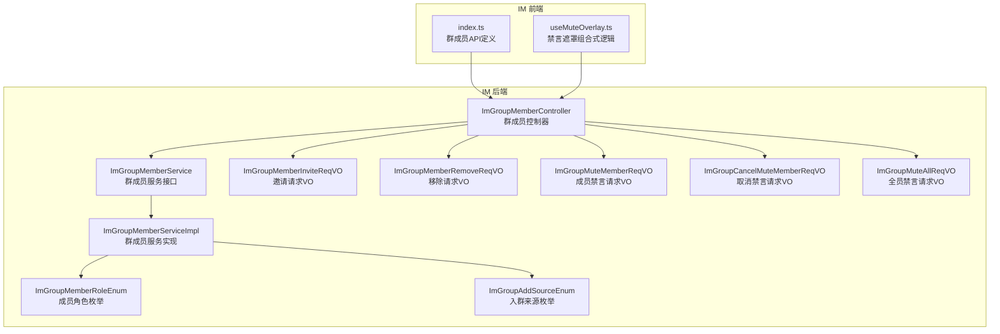
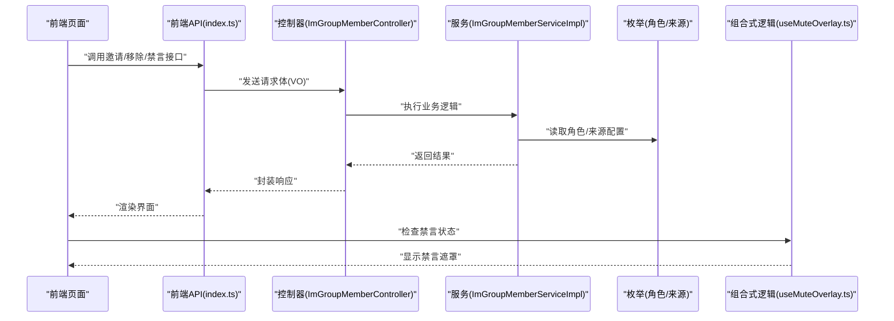
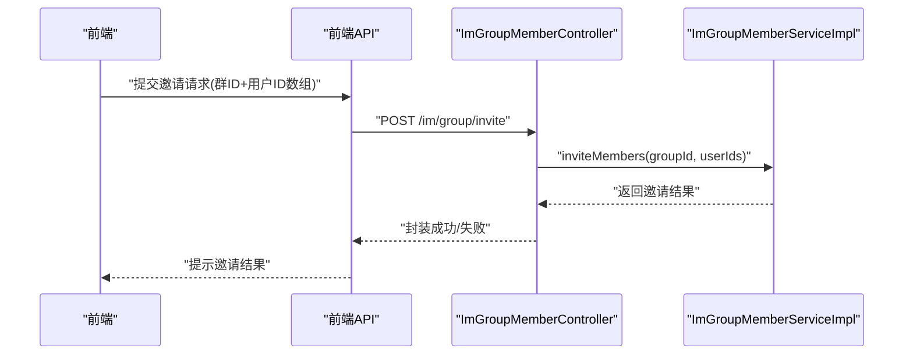
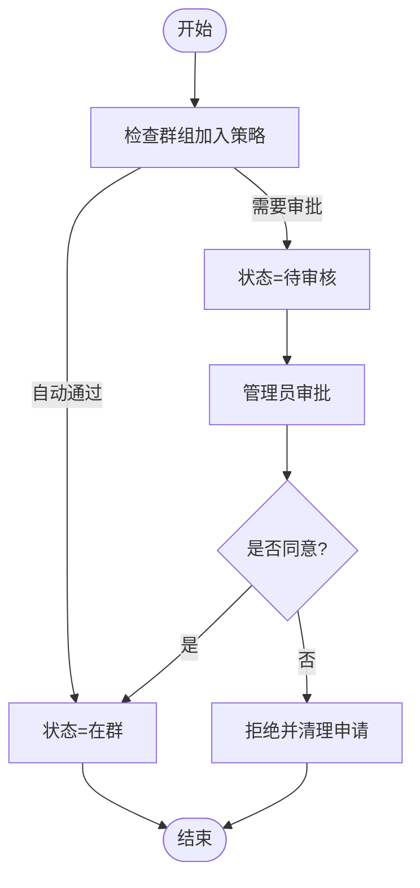
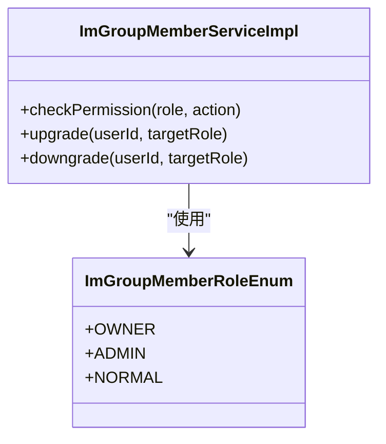
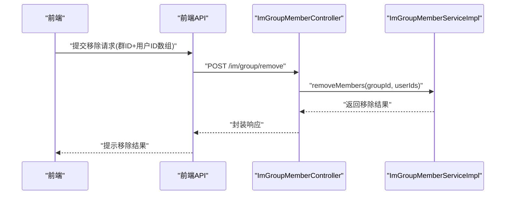
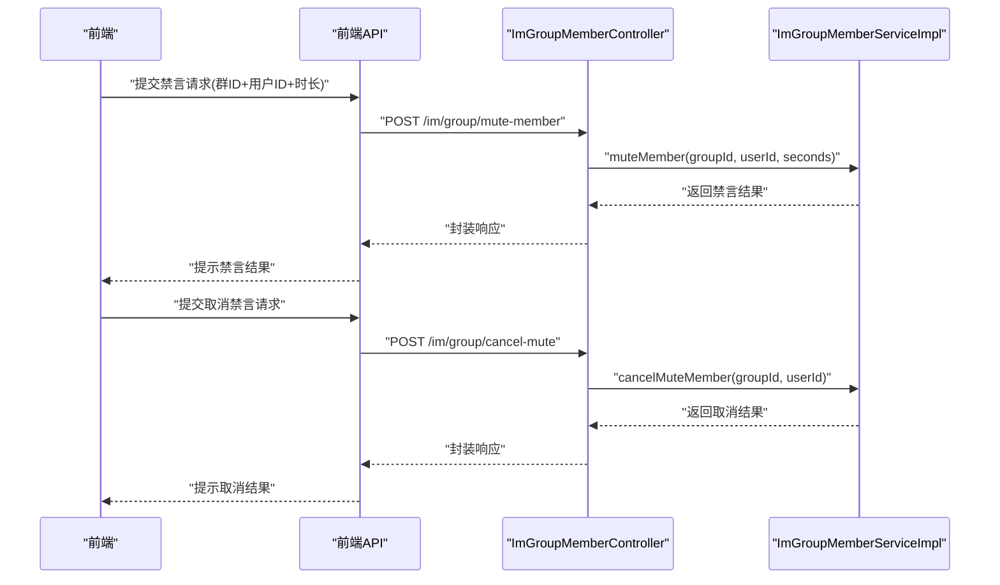
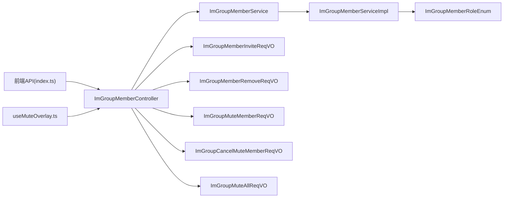

# 群组成员管理

<cite>
**本文引用的文件**
- [yudao-module-im/src/main/java/cn/iocoder/yudao/module/im/controller/admin/group/ImGroupMemberController.java](file://yudao-module-im/src/main/java/cn/iocoder/yudao/module/im/controller/admin/group/ImGroupMemberController.java)
- [yudao-module-im/src/main/java/cn/iocoder/yudao/module/im/service/group/ImGroupMemberService.java](file://yudao-module-im/src/main/java/cn/iocoder/yudao/module/im/service/group/ImGroupMemberService.java)
- [yudao-module-im/src/main/java/cn/iocoder/yudao/module/im/service/group/ImGroupMemberServiceImpl.java](file://yudao-module-im/src/main/java/cn/iocoder/yudao/module/im/service/group/ImGroupMemberServiceImpl.java)
- [yudao-module-im/src/main/java/cn/iocoder/yudao/module/im/enums/group/ImGroupMemberRoleEnum.java](file://yudao-module-im/src/main/java/cn/iocoder/yudao/module/im/enums/group/ImGroupMemberRoleEnum.java)
- [yudao-module-im/src/main/java/cn/iocoder/yudao/module/im/enums/group/ImGroupAddSourceEnum.java](file://yudao-module-im/src/main/java/cn/iocoder/yudao/module/im/enums/group/ImGroupAddSourceEnum.java)
- [yudao-module-im/src/main/java/cn/iocoder/yudao/module/im/controller/admin/group/vo/member/ImGroupMemberInviteReqVO.java](file://yudao-module-im/src/main/java/cn/iocoder/yudao/module/im/controller/admin/group/vo/member/ImGroupMemberInviteReqVO.java)
- [yudao-module-im/src/main/java/cn/iocoder/yudao/module/im/controller/admin/group/vo/member/ImGroupMemberRemoveReqVO.java](file://yudao-module-im/src/main/java/cn/iocoder/yudao/module/im/controller/admin/group/vo/member/ImGroupMemberRemoveReqVO.java)
- [yudao-module-im/src/main/java/cn/iocoder/yudao/module/im/controller/admin/group/vo/ImGroupMuteMemberReqVO.java](file://yudao-module-im/src/main/java/cn/iocoder/yudao/module/im/controller/admin/group/vo/ImGroupMuteMemberReqVO.java)
- [yudao-module-im/src/main/java/cn/iocoder/yudao/module/im/controller/admin/group/vo/ImGroupCancelMuteMemberReqVO.java](file://yudao-module-im/src/main/java/cn/iocoder/yudao/module/im/controller/admin/group/vo/ImGroupCancelMuteMemberReqVO.java)
- [yudao-module-im/src/main/java/cn/iocoder/yudao/module/im/controller/admin/group/vo/ImGroupMuteAllReqVO.java](file://yudao-module-im/src/main/java/cn/iocoder/yudao/module/im/controller/admin/group/vo/ImGroupMuteAllReqVO.java)
- [yudao-ui/yudao-ui-admin-vue3/src/api/im/group/member/index.ts](file://yudao-ui/yudao-ui-admin-vue3/src/api/im/group/member/index.ts)
- [yudao-ui/yudao-ui-admin-vue3/src/views/im/home/composables/useMuteOverlay.ts](file://yudao-ui/yudao-ui-admin-vue3/src/views/im/home/composables/useMuteOverlay.ts)
</cite>

## 目录
1. [引言](#引言)
2. [项目结构](#项目结构)
3. [核心组件](#核心组件)
4. [架构总览](#架构总览)
5. [详细组件分析](#详细组件分析)
6. [依赖关系分析](#依赖关系分析)
7. [性能考虑](#性能考虑)
8. [故障排查指南](#故障排查指南)
9. [结论](#结论)
10. [附录](#附录)

## 引言
本文件聚焦于“群组成员管理”能力的技术实现，覆盖成员邀请机制（好友邀请、批量邀请、邀请来源记录）、成员加入流程（主动加入、管理员审批、自动通过）、成员角色体系（群主、管理员、普通成员及权限与升降级）、成员权限管理（发言权限、管理权限、特殊权限）、成员移除机制（管理员踢人、成员主动退群、批量移除）、成员状态管理（在线状态、离线消息、活跃度统计）以及禁言功能（全局禁言、个别禁言、禁言时间管理）。本文以代码为依据，结合前后端交互与服务层实现，提供可操作、可落地的技术说明。

## 项目结构
IM模块提供群组成员管理的后端接口与服务实现，并通过前端API定义与视图组合式逻辑完成禁言UI提示等交互。

图表来源
- [yudao-module-im/src/main/java/cn/iocoder/yudao/module/im/controller/admin/group/ImGroupMemberController.java:1-200](file://yudao-module-im/src/main/java/cn/iocoder/yudao/module/im/controller/admin/group/ImGroupMemberController.java#L1-L200)
- [yudao-module-im/src/main/java/cn/iocoder/yudao/module/im/service/group/ImGroupMemberService.java:1-200](file://yudao-module-im/src/main/java/cn/iocoder/yudao/module/im/service/group/ImGroupMemberService.java#L1-L200)
- [yudao-module-im/src/main/java/cn/iocoder/yudao/module/im/service/group/ImGroupMemberServiceImpl.java:1-400](file://yudao-module-im/src/main/java/cn/iocoder/yudao/module/im/service/group/ImGroupMemberServiceImpl.java#L1-L400)
- [yudao-module-im/src/main/java/cn/iocoder/yudao/module/im/enums/group/ImGroupMemberRoleEnum.java:1-200](file://yudao-module-im/src/main/java/cn/iocoder/yudao/module/im/enums/group/ImGroupMemberRoleEnum.java#L1-L200)
- [yudao-module-im/src/main/java/cn/iocoder/yudao/module/im/enums/group/ImGroupAddSourceEnum.java:1-200](file://yudao-module-im/src/main/java/cn/iocoder/yudao/module/im/enums/group/ImGroupAddSourceEnum.java#L1-L200)
- [yudao-module-im/src/main/java/cn/iocoder/yudao/module/im/controller/admin/group/vo/member/ImGroupMemberInviteReqVO.java:1-45](file://yudao-module-im/src/main/java/cn/iocoder/yudao/module/im/controller/admin/group/vo/member/ImGroupMemberInviteReqVO.java#L1-L45)
- [yudao-module-im/src/main/java/cn/iocoder/yudao/module/im/controller/admin/group/vo/member/ImGroupMemberRemoveReqVO.java:1-45](file://yudao-module-im/src/main/java/cn/iocoder/yudao/module/im/controller/admin/group/vo/member/ImGroupMemberRemoveReqVO.java#L1-L45)
- [yudao-module-im/src/main/java/cn/iocoder/yudao/module/im/controller/admin/group/vo/ImGroupMuteMemberReqVO.java:1-25](file://yudao-module-im/src/main/java/cn/iocoder/yudao/module/im/controller/admin/group/vo/ImGroupMuteMemberReqVO.java#L1-L25)
- [yudao-module-im/src/main/java/cn/iocoder/yudao/module/im/controller/admin/group/vo/ImGroupCancelMuteMemberReqVO.java:1-19](file://yudao-module-im/src/main/java/cn/iocoder/yudao/module/im/controller/admin/group/vo/ImGroupCancelMuteMemberReqVO.java#L1-L19)
- [yudao-module-im/src/main/java/cn/iocoder/yudao/module/im/controller/admin/group/vo/ImGroupMuteAllReqVO.java:1-200](file://yudao-module-im/src/main/java/cn/iocoder/yudao/module/im/controller/admin/group/vo/ImGroupMuteAllReqVO.java#L1-L200)
- [yudao-ui/yudao-ui-admin-vue3/src/api/im/group/member/index.ts:1-45](file://yudao-ui/yudao-ui-admin-vue3/src/api/im/group/member/index.ts#L1-L45)
- [yudao-ui/yudao-ui-admin-vue3/src/views/im/home/composables/useMuteOverlay.ts:80-96](file://yudao-ui/yudao-ui-admin-vue3/src/views/im/home/composables/useMuteOverlay.ts#L80-L96)

章节来源
- [yudao-module-im/src/main/java/cn/iocoder/yudao/module/im/controller/admin/group/ImGroupMemberController.java:1-200](file://yudao-module-im/src/main/java/cn/iocoder/yudao/module/im/controller/admin/group/ImGroupMemberController.java#L1-L200)
- [yudao-module-im/src/main/java/cn/iocoder/yudao/module/im/service/group/ImGroupMemberService.java:1-200](file://yudao-module-im/src/main/java/cn/iocoder/yudao/module/im/service/group/ImGroupMemberService.java#L1-L200)
- [yudao-module-im/src/main/java/cn/iocoder/yudao/module/im/service/group/ImGroupMemberServiceImpl.java:1-400](file://yudao-module-im/src/main/java/cn/iocoder/yudao/module/im/service/group/ImGroupMemberServiceImpl.java#L1-L400)
- [yudao-module-im/src/main/java/cn/iocoder/yudao/module/im/enums/group/ImGroupMemberRoleEnum.java:1-200](file://yudao-module-im/src/main/java/cn/iocoder/yudao/module/im/enums/group/ImGroupMemberRoleEnum.java#L1-L200)
- [yudao-module-im/src/main/java/cn/iocoder/yudao/module/im/enums/group/ImGroupAddSourceEnum.java:1-200](file://yudao-module-im/src/main/java/cn/iocoder/yudao/module/im/enums/group/ImGroupAddSourceEnum.java#L1-L200)
- [yudao-ui/yudao-ui-admin-vue3/src/api/im/group/member/index.ts:1-45](file://yudao-ui/yudao-ui-admin-vue3/src/api/im/group/member/index.ts#L1-L45)
- [yudao-ui/yudao-ui-admin-vue3/src/views/im/home/composables/useMuteOverlay.ts:80-96](file://yudao-ui/yudao-ui-admin-vue3/src/views/im/home/composables/useMuteOverlay.ts#L80-L96)

## 核心组件
- 控制器层：ImGroupMemberController 提供群成员邀请、移除、禁言、取消禁言等接口入口，负责参数校验与返回封装。
- 服务层：ImGroupMemberService 定义成员管理能力契约；ImGroupMemberServiceImpl 实现具体业务逻辑，包括角色判定、来源记录、权限控制、状态变更等。
- 枚举层：ImGroupMemberRoleEnum 定义成员角色（群主、管理员、普通成员）及其权限边界；ImGroupAddSourceEnum 记录入群来源类型。
- VO层：ImGroupMemberInviteReqVO、ImGroupMemberRemoveReqVO、ImGroupMuteMemberReqVO、ImGroupCancelMuteMemberReqVO、ImGroupMuteAllReqVO 定义前后端交互的数据结构。
- 前端API与UI：index.ts 定义调用后端的API；useMuteOverlay.ts 提供禁言遮罩提示的组合式逻辑。

章节来源
- [yudao-module-im/src/main/java/cn/iocoder/yudao/module/im/controller/admin/group/ImGroupMemberController.java:1-200](file://yudao-module-im/src/main/java/cn/iocoder/yudao/module/im/controller/admin/group/ImGroupMemberController.java#L1-L200)
- [yudao-module-im/src/main/java/cn/iocoder/yudao/module/im/service/group/ImGroupMemberService.java:1-200](file://yudao-module-im/src/main/java/cn/iocoder/yudao/module/im/service/group/ImGroupMemberService.java#L1-L200)
- [yudao-module-im/src/main/java/cn/iocoder/yudao/module/im/service/group/ImGroupMemberServiceImpl.java:1-400](file://yudao-module-im/src/main/java/cn/iocoder/yudao/module/im/service/group/ImGroupMemberServiceImpl.java#L1-L400)
- [yudao-module-im/src/main/java/cn/iocoder/yudao/module/im/enums/group/ImGroupMemberRoleEnum.java:1-200](file://yudao-module-im/src/main/java/cn/iocoder/yudao/module/im/enums/group/ImGroupMemberRoleEnum.java#L1-L200)
- [yudao-module-im/src/main/java/cn/iocoder/yudao/module/im/enums/group/ImGroupAddSourceEnum.java:1-200](file://yudao-module-im/src/main/java/cn/iocoder/yudao/module/im/enums/group/ImGroupAddSourceEnum.java#L1-L200)
- [yudao-module-im/src/main/java/cn/iocoder/yudao/module/im/controller/admin/group/vo/member/ImGroupMemberInviteReqVO.java:1-45](file://yudao-module-im/src/main/java/cn/iocoder/yudao/module/im/controller/admin/group/vo/member/ImGroupMemberInviteReqVO.java#L1-L45)
- [yudao-module-im/src/main/java/cn/iocoder/yudao/module/im/controller/admin/group/vo/member/ImGroupMemberRemoveReqVO.java:1-45](file://yudao-module-im/src/main/java/cn/iocoder/yudao/module/im/controller/admin/group/vo/member/ImGroupMemberRemoveReqVO.java#L1-L45)
- [yudao-module-im/src/main/java/cn/iocoder/yudao/module/im/controller/admin/group/vo/ImGroupMuteMemberReqVO.java:1-25](file://yudao-module-im/src/main/java/cn/iocoder/yudao/module/im/controller/admin/group/vo/ImGroupMuteMemberReqVO.java#L1-L25)
- [yudao-module-im/src/main/java/cn/iocoder/yudao/module/im/controller/admin/group/vo/ImGroupCancelMuteMemberReqVO.java:1-19](file://yudao-module-im/src/main/java/cn/iocoder/yudao/module/im/controller/admin/group/vo/ImGroupCancelMuteMemberReqVO.java#L1-L19)
- [yudao-module-im/src/main/java/cn/iocoder/yudao/module/im/controller/admin/group/vo/ImGroupMuteAllReqVO.java:1-200](file://yudao-module-im/src/main/java/cn/iocoder/yudao/module/im/controller/admin/group/vo/ImGroupMuteAllReqVO.java#L1-L200)
- [yudao-ui/yudao-ui-admin-vue3/src/api/im/group/member/index.ts:1-45](file://yudao-ui/yudao-ui-admin-vue3/src/api/im/group/member/index.ts#L1-L45)
- [yudao-ui/yudao-ui-admin-vue3/src/views/im/home/composables/useMuteOverlay.ts:80-96](file://yudao-ui/yudao-ui-admin-vue3/src/views/im/home/composables/useMuteOverlay.ts#L80-L96)

## 架构总览
下图展示从前端到后端的服务调用链路，以及与枚举、VO、服务实现之间的关系。

图表来源
- [yudao-module-im/src/main/java/cn/iocoder/yudao/module/im/controller/admin/group/ImGroupMemberController.java:1-200](file://yudao-module-im/src/main/java/cn/iocoder/yudao/module/im/controller/admin/group/ImGroupMemberController.java#L1-L200)
- [yudao-module-im/src/main/java/cn/iocoder/yudao/module/im/service/group/ImGroupMemberServiceImpl.java:1-400](file://yudao-module-im/src/main/java/cn/iocoder/yudao/module/im/service/group/ImGroupMemberServiceImpl.java#L1-L400)
- [yudao-module-im/src/main/java/cn/iocoder/yudao/module/im/enums/group/ImGroupMemberRoleEnum.java:1-200](file://yudao-module-im/src/main/java/cn/iocoder/yudao/module/im/enums/group/ImGroupMemberRoleEnum.java#L1-L200)
- [yudao-ui/yudao-ui-admin-vue3/src/api/im/group/member/index.ts:1-45](file://yudao-ui/yudao-ui-admin-vue3/src/api/im/group/member/index.ts#L1-L45)
- [yudao-ui/yudao-ui-admin-vue3/src/views/im/home/composables/useMuteOverlay.ts:80-96](file://yudao-ui/yudao-ui-admin-vue3/src/views/im/home/composables/useMuteOverlay.ts#L80-L96)

## 详细组件分析

### 成员邀请机制
- 好友邀请：通过 ImGroupMemberInviteReqVO 定义邀请请求，包含群编号与被邀请用户ID列表，后端根据调用方身份与群规则进行处理。
- 批量邀请：请求体支持 memberUserIds 数组，后端逐个或批量落库并触发相应事件。
- 邀请来源记录：通过 ImGroupAddSourceEnum 记录邀请来源类型（例如“来自好友邀请”、“来自扫描二维码”等），便于审计与统计。

图表来源
- [yudao-module-im/src/main/java/cn/iocoder/yudao/module/im/controller/admin/group/ImGroupMemberController.java:1-200](file://yudao-module-im/src/main/java/cn/iocoder/yudao/module/im/controller/admin/group/ImGroupMemberController.java#L1-L200)
- [yudao-module-im/src/main/java/cn/iocoder/yudao/module/im/service/group/ImGroupMemberServiceImpl.java:1-400](file://yudao-module-im/src/main/java/cn/iocoder/yudao/module/im/service/group/ImGroupMemberServiceImpl.java#L1-L400)
- [yudao-module-im/src/main/java/cn/iocoder/yudao/module/im/controller/admin/group/vo/member/ImGroupMemberInviteReqVO.java:1-45](file://yudao-module-im/src/main/java/cn/iocoder/yudao/module/im/controller/admin/group/vo/member/ImGroupMemberInviteReqVO.java#L1-L45)
- [yudao-module-im/src/main/java/cn/iocoder/yudao/module/im/enums/group/ImGroupAddSourceEnum.java:1-200](file://yudao-module-im/src/main/java/cn/iocoder/yudao/module/im/enums/group/ImGroupAddSourceEnum.java#L1-L200)
- [yudao-ui/yudao-ui-admin-vue3/src/api/im/group/member/index.ts:1-45](file://yudao-ui/yudao-ui-admin-vue3/src/api/im/group/member/index.ts#L1-L45)

章节来源
- [yudao-module-im/src/main/java/cn/iocoder/yudao/module/im/controller/admin/group/vo/member/ImGroupMemberInviteReqVO.java:1-45](file://yudao-module-im/src/main/java/cn/iocoder/yudao/module/im/controller/admin/group/vo/member/ImGroupMemberInviteReqVO.java#L1-L45)
- [yudao-module-im/src/main/java/cn/iocoder/yudao/module/im/enums/group/ImGroupAddSourceEnum.java:1-200](file://yudao-module-im/src/main/java/cn/iocoder/yudao/module/im/enums/group/ImGroupAddSourceEnum.java#L1-L200)
- [yudao-ui/yudao-ui-admin-vue3/src/api/im/group/member/index.ts:1-45](file://yudao-ui/yudao-ui-admin-vue3/src/api/im/group/member/index.ts#L1-L45)

### 成员加入流程
- 主动加入：调用邀请接口后，成员状态由“待入群”转为“在群”，并记录入群时间。
- 管理员审批：当群组策略为需要审批时，成员状态初始为“待审核”，管理员同意后方可入群。
- 自动通过：群组策略允许自动通过时，邀请即刻生效，成员直接成为“在群”。

图表来源
- [yudao-module-im/src/main/java/cn/iocoder/yudao/module/im/enums/group/ImGroupAddSourceEnum.java:1-200](file://yudao-module-im/src/main/java/cn/iocoder/yudao/module/im/enums/group/ImGroupAddSourceEnum.java#L1-L200)
- [yudao-module-im/src/main/java/cn/iocoder/yudao/module/im/service/group/ImGroupMemberServiceImpl.java:1-400](file://yudao-module-im/src/main/java/cn/iocoder/yudao/module/im/service/group/ImGroupMemberServiceImpl.java#L1-L400)

章节来源
- [yudao-module-im/src/main/java/cn/iocoder/yudao/module/im/enums/group/ImGroupAddSourceEnum.java:1-200](file://yudao-module-im/src/main/java/cn/iocoder/yudao/module/im/enums/group/ImGroupAddSourceEnum.java#L1-L200)
- [yudao-module-im/src/main/java/cn/iocoder/yudao/module/im/service/group/ImGroupMemberServiceImpl.java:1-400](file://yudao-module-im/src/main/java/cn/iocoder/yudao/module/im/service/group/ImGroupMemberServiceImpl.java#L1-L400)

### 成员角色体系与权限
- 角色定义：ImGroupMemberRoleEnum 定义 OWNER（群主）、ADMIN（管理员）、NORMAL（普通成员）三类角色。
- 权限边界：不同角色拥有不同的管理权限（如邀请/移除成员、修改群资料、禁言等），服务层通过角色判定进行权限控制。
- 升降级机制：群主可将 NORMAL 提升为 ADMIN，或降级 ADMIN 为 NORMAL；仅 OWNER 可转移群主身份。

图表来源
- [yudao-module-im/src/main/java/cn/iocoder/yudao/module/im/enums/group/ImGroupMemberRoleEnum.java:1-200](file://yudao-module-im/src/main/java/cn/iocoder/yudao/module/im/enums/group/ImGroupMemberRoleEnum.java#L1-L200)
- [yudao-module-im/src/main/java/cn/iocoder/yudao/module/im/service/group/ImGroupMemberServiceImpl.java:1-400](file://yudao-module-im/src/main/java/cn/iocoder/yudao/module/im/service/group/ImGroupMemberServiceImpl.java#L1-L400)

章节来源
- [yudao-module-im/src/main/java/cn/iocoder/yudao/module/im/enums/group/ImGroupMemberRoleEnum.java:1-200](file://yudao-module-im/src/main/java/cn/iocoder/yudao/module/im/enums/group/ImGroupMemberRoleEnum.java#L1-L200)
- [yudao-module-im/src/main/java/cn/iocoder/yudao/module/im/service/group/ImGroupMemberServiceImpl.java:1-400](file://yudao-module-im/src/main/java/cn/iocoder/yudao/module/im/service/group/ImGroupMemberServiceImpl.java#L1-L400)

### 成员权限管理
- 发言权限：结合禁言状态与角色权限共同决定成员是否可以发送消息。
- 管理权限：ADMIN/OWNER 拥有对成员的操作权限（邀请、移除、禁言、设置角色等）。
- 特殊权限：如置顶消息、公告发布等，通常仅 OWNER 或具备特定授权的角色可执行。

章节来源
- [yudao-module-im/src/main/java/cn/iocoder/yudao/module/im/service/group/ImGroupMemberServiceImpl.java:1-400](file://yudao-module-im/src/main/java/cn/iocoder/yudao/module/im/service/group/ImGroupMemberServiceImpl.java#L1-L400)
- [yudao-module-im/src/main/java/cn/iocoder/yudao/module/im/enums/group/ImGroupMemberRoleEnum.java:1-200](file://yudao-module-im/src/main/java/cn/iocoder/yudao/module/im/enums/group/ImGroupMemberRoleEnum.java#L1-L200)

### 成员移除机制
- 管理员踢人：ADMIN/OWNER 可移除成员，调用 ImGroupMemberRemoveReqVO，支持单个或批量移除。
- 成员主动退群：成员可发起退群请求，服务层更新成员状态为“退群”，并记录退群时间。
- 批量移除：请求体支持 memberUserIds 数组，后端统一处理并广播通知。

图表来源
- [yudao-module-im/src/main/java/cn/iocoder/yudao/module/im/controller/admin/group/ImGroupMemberController.java:1-200](file://yudao-module-im/src/main/java/cn/iocoder/yudao/module/im/controller/admin/group/ImGroupMemberController.java#L1-L200)
- [yudao-module-im/src/main/java/cn/iocoder/yudao/module/im/service/group/ImGroupMemberServiceImpl.java:1-400](file://yudao-module-im/src/main/java/cn/iocoder/yudao/module/im/service/group/ImGroupMemberServiceImpl.java#L1-L400)
- [yudao-module-im/src/main/java/cn/iocoder/yudao/module/im/controller/admin/group/vo/member/ImGroupMemberRemoveReqVO.java:1-45](file://yudao-module-im/src/main/java/cn/iocoder/yudao/module/im/controller/admin/group/vo/member/ImGroupMemberRemoveReqVO.java#L1-L45)
- [yudao-ui/yudao-ui-admin-vue3/src/api/im/group/member/index.ts:1-45](file://yudao-ui/yudao-ui-admin-vue3/src/api/im/group/member/index.ts#L1-L45)

章节来源
- [yudao-module-im/src/main/java/cn/iocoder/yudao/module/im/controller/admin/group/vo/member/ImGroupMemberRemoveReqVO.java:1-45](file://yudao-module-im/src/main/java/cn/iocoder/yudao/module/im/controller/admin/group/vo/member/ImGroupMemberRemoveReqVO.java#L1-L45)
- [yudao-ui/yudao-ui-admin-vue3/src/api/im/group/member/index.ts:1-45](file://yudao-ui/yudao-ui-admin-vue3/src/api/im/group/member/index.ts#L1-L45)

### 成员状态管理
- 在线状态跟踪：通过 WebSocket 服务与会话状态联动，结合成员上下线事件维护在线列表。
- 离线消息处理：成员上线后拉取未读消息，或在离线期间通过消息队列推送提醒。
- 成员活跃度统计：基于成员最近活跃时间、消息发送次数等指标进行统计与排行。

章节来源
- [yudao-module-im/src/main/java/cn/iocoder/yudao/module/im/service/websocket/ImWebSocketService.java:1-200](file://yudao-module-im/src/main/java/cn/iocoder/yudao/module/im/service/websocket/ImWebSocketService.java#L1-L200)
- [yudao-module-im/src/main/java/cn/iocoder/yudao/module/im/service/websocket/ImWebSocketServiceImpl.java:1-200](file://yudao-module-im/src/main/java/cn/iocoder/yudao/module/im/service/websocket/ImWebSocketServiceImpl.java#L1-L200)

### 成员禁言功能
- 全员禁言：通过 ImGroupMuteAllReqVO 触发，服务层对所有 NORMAL 成员设置禁言到期时间。
- 个别禁言：通过 ImGroupMuteMemberReqVO 设置指定成员的禁言时长（秒，0 表示永久）。
- 取消禁言：通过 ImGroupCancelMuteMemberReqVO 清除成员禁言状态。
- 禁言时间管理：前端 useMuteOverlay.ts 基于 muteEndTime 字段计算剩余时间并提示用户。

图表来源
- [yudao-module-im/src/main/java/cn/iocoder/yudao/module/im/controller/admin/group/ImGroupMemberController.java:1-200](file://yudao-module-im/src/main/java/cn/iocoder/yudao/module/im/controller/admin/group/ImGroupMemberController.java#L1-L200)
- [yudao-module-im/src/main/java/cn/iocoder/yudao/module/im/service/group/ImGroupMemberServiceImpl.java:1-400](file://yudao-module-im/src/main/java/cn/iocoder/yudao/module/im/service/group/ImGroupMemberServiceImpl.java#L1-L400)
- [yudao-module-im/src/main/java/cn/iocoder/yudao/module/im/controller/admin/group/vo/ImGroupMuteMemberReqVO.java:1-25](file://yudao-module-im/src/main/java/cn/iocoder/yudao/module/im/controller/admin/group/vo/ImGroupMuteMemberReqVO.java#L1-L25)
- [yudao-module-im/src/main/java/cn/iocoder/yudao/module/im/controller/admin/group/vo/ImGroupCancelMuteMemberReqVO.java:1-19](file://yudao-module-im/src/main/java/cn/iocoder/yudao/module/im/controller/admin/group/vo/ImGroupCancelMuteMemberReqVO.java#L1-L19)
- [yudao-module-im/src/main/java/cn/iocoder/yudao/module/im/controller/admin/group/vo/ImGroupMuteAllReqVO.java:1-200](file://yudao-module-im/src/main/java/cn/iocoder/yudao/module/im/controller/admin/group/vo/ImGroupMuteAllReqVO.java#L1-L200)
- [yudao-ui/yudao-ui-admin-vue3/src/api/im/group/member/index.ts:1-45](file://yudao-ui/yudao-ui-admin-vue3/src/api/im/group/member/index.ts#L1-L45)
- [yudao-ui/yudao-ui-admin-vue3/src/views/im/home/composables/useMuteOverlay.ts:80-96](file://yudao-ui/yudao-ui-admin-vue3/src/views/im/home/composables/useMuteOverlay.ts#L80-L96)

章节来源
- [yudao-module-im/src/main/java/cn/iocoder/yudao/module/im/controller/admin/group/vo/ImGroupMuteMemberReqVO.java:1-25](file://yudao-module-im/src/main/java/cn/iocoder/yudao/module/im/controller/admin/group/vo/ImGroupMuteMemberReqVO.java#L1-L25)
- [yudao-module-im/src/main/java/cn/iocoder/yudao/module/im/controller/admin/group/vo/ImGroupCancelMuteMemberReqVO.java:1-19](file://yudao-module-im/src/main/java/cn/iocoder/yudao/module/im/controller/admin/group/vo/ImGroupCancelMuteMemberReqVO.java#L1-L19)
- [yudao-module-im/src/main/java/cn/iocoder/yudao/module/im/controller/admin/group/vo/ImGroupMuteAllReqVO.java:1-200](file://yudao-module-im/src/main/java/cn/iocoder/yudao/module/im/controller/admin/group/vo/ImGroupMuteAllReqVO.java#L1-L200)
- [yudao-ui/yudao-ui-admin-vue3/src/views/im/home/composables/useMuteOverlay.ts:80-96](file://yudao-ui/yudao-ui-admin-vue3/src/views/im/home/composables/useMuteOverlay.ts#L80-L96)

## 依赖关系分析
- 控制器依赖服务接口，服务实现依赖枚举与数据对象。
- 前端API与控制器对接，组合式逻辑依赖成员禁言状态字段。
- 禁言相关VO与服务实现形成闭环，确保禁言时长与到期时间的一致性。

图表来源
- [yudao-module-im/src/main/java/cn/iocoder/yudao/module/im/controller/admin/group/ImGroupMemberController.java:1-200](file://yudao-module-im/src/main/java/cn/iocoder/yudao/module/im/controller/admin/group/ImGroupMemberController.java#L1-L200)
- [yudao-module-im/src/main/java/cn/iocoder/yudao/module/im/service/group/ImGroupMemberService.java:1-200](file://yudao-module-im/src/main/java/cn/iocoder/yudao/module/im/service/group/ImGroupMemberService.java#L1-L200)
- [yudao-module-im/src/main/java/cn/iocoder/yudao/module/im/service/group/ImGroupMemberServiceImpl.java:1-400](file://yudao-module-im/src/main/java/cn/iocoder/yudao/module/im/service/group/ImGroupMemberServiceImpl.java#L1-L400)
- [yudao-module-im/src/main/java/cn/iocoder/yudao/module/im/enums/group/ImGroupMemberRoleEnum.java:1-200](file://yudao-module-im/src/main/java/cn/iocoder/yudao/module/im/enums/group/ImGroupMemberRoleEnum.java#L1-L200)
- [yudao-ui/yudao-ui-admin-vue3/src/api/im/group/member/index.ts:1-45](file://yudao-ui/yudao-ui-admin-vue3/src/api/im/group/member/index.ts#L1-L45)
- [yudao-ui/yudao-ui-admin-vue3/src/views/im/home/composables/useMuteOverlay.ts:80-96](file://yudao-ui/yudao-ui-admin-vue3/src/views/im/home/composables/useMuteOverlay.ts#L80-L96)

章节来源
- [yudao-module-im/src/main/java/cn/iocoder/yudao/module/im/controller/admin/group/ImGroupMemberController.java:1-200](file://yudao-module-im/src/main/java/cn/iocoder/yudao/module/im/controller/admin/group/ImGroupMemberController.java#L1-L200)
- [yudao-module-im/src/main/java/cn/iocoder/yudao/module/im/service/group/ImGroupMemberService.java:1-200](file://yudao-module-im/src/main/java/cn/iocoder/yudao/module/im/service/group/ImGroupMemberService.java#L1-L200)
- [yudao-module-im/src/main/java/cn/iocoder/yudao/module/im/service/group/ImGroupMemberServiceImpl.java:1-400](file://yudao-module-im/src/main/java/cn/iocoder/yudao/module/im/service/group/ImGroupMemberServiceImpl.java#L1-L400)
- [yudao-ui/yudao-ui-admin-vue3/src/api/im/group/member/index.ts:1-45](file://yudao-ui/yudao-ui-admin-vue3/src/api/im/group/member/index.ts#L1-L45)
- [yudao-ui/yudao-ui-admin-vue3/src/views/im/home/composables/useMuteOverlay.ts:80-96](file://yudao-ui/yudao-ui-admin-vue3/src/views/im/home/composables/useMuteOverlay.ts#L80-L96)

## 性能考虑
- 批量操作：邀请与移除支持批量处理，减少网络往返与数据库事务开销。
- 状态缓存：成员状态与禁言到期时间可在Redis中缓存，降低频繁查询成本。
- 广播优化：禁言/解禁等操作完成后，通过消息队列异步广播，避免阻塞主流程。
- 分页查询：成员列表分页加载，结合索引优化查询性能。

## 故障排查指南
- 邀请失败：检查请求体字段是否完整、用户是否存在、群组策略是否允许邀请。
- 移除失败：确认调用者角色是否具备移除权限，目标成员是否存在且处于在群状态。
- 禁言异常：核对禁言时长是否为非负数，0表示永久禁言；检查禁言到期时间是否正确更新。
- 禁言遮罩不显示：确认成员 muteEndTime 字段是否正确回传，前端时间解析逻辑是否正常。

章节来源
- [yudao-module-im/src/main/java/cn/iocoder/yudao/module/im/controller/admin/group/vo/ImGroupMuteMemberReqVO.java:1-25](file://yudao-module-im/src/main/java/cn/iocoder/yudao/module/im/controller/admin/group/vo/ImGroupMuteMemberReqVO.java#L1-L25)
- [yudao-ui/yudao-ui-admin-vue3/src/views/im/home/composables/useMuteOverlay.ts:80-96](file://yudao-ui/yudao-ui-admin-vue3/src/views/im/home/composables/useMuteOverlay.ts#L80-L96)

## 结论
本技术文档基于IM模块的控制器、服务与枚举实现，系统化梳理了群组成员管理的关键能力：邀请与加入、角色与权限、移除与状态、禁言与时间管理。通过前后端协作与服务层权限控制，确保功能安全、可扩展、易维护。建议在生产环境中配合缓存、消息队列与分页查询进一步提升性能与用户体验。

## 附录
- 关键VO与字段说明
  - 邀请请求：groupId、memberUserIds
  - 移除请求：groupId、memberUserIds
  - 成员禁言：id、userId、mutedSeconds
  - 取消禁言：id、userId
  - 全员禁言：群组相关字段（详见VO定义）

章节来源
- [yudao-module-im/src/main/java/cn/iocoder/yudao/module/im/controller/admin/group/vo/member/ImGroupMemberInviteReqVO.java:1-45](file://yudao-module-im/src/main/java/cn/iocoder/yudao/module/im/controller/admin/group/vo/member/ImGroupMemberInviteReqVO.java#L1-L45)
- [yudao-module-im/src/main/java/cn/iocoder/yudao/module/im/controller/admin/group/vo/member/ImGroupMemberRemoveReqVO.java:1-45](file://yudao-module-im/src/main/java/cn/iocoder/yudao/module/im/controller/admin/group/vo/member/ImGroupMemberRemoveReqVO.java#L1-L45)
- [yudao-module-im/src/main/java/cn/iocoder/yudao/module/im/controller/admin/group/vo/ImGroupMuteMemberReqVO.java:1-25](file://yudao-module-im/src/main/java/cn/iocoder/yudao/module/im/controller/admin/group/vo/ImGroupMuteMemberReqVO.java#L1-L25)
- [yudao-module-im/src/main/java/cn/iocoder/yudao/module/im/controller/admin/group/vo/ImGroupCancelMuteMemberReqVO.java:1-19](file://yudao-module-im/src/main/java/cn/iocoder/yudao/module/im/controller/admin/group/vo/ImGroupCancelMuteMemberReqVO.java#L1-L19)
- [yudao-module-im/src/main/java/cn/iocoder/yudao/module/im/controller/admin/group/vo/ImGroupMuteAllReqVO.java:1-200](file://yudao-module-im/src/main/java/cn/iocoder/yudao/module/im/controller/admin/group/vo/ImGroupMuteAllReqVO.java#L1-L200)
- [yudao-ui/yudao-ui-admin-vue3/src/api/im/group/member/index.ts:1-45](file://yudao-ui/yudao-ui-admin-vue3/src/api/im/group/member/index.ts#L1-L45)