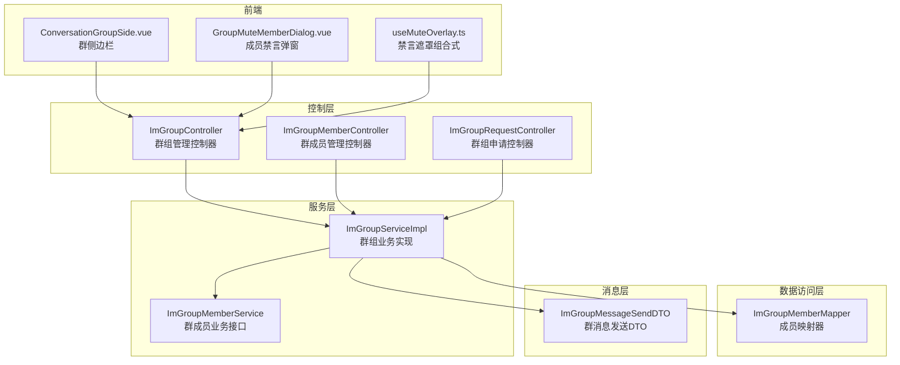
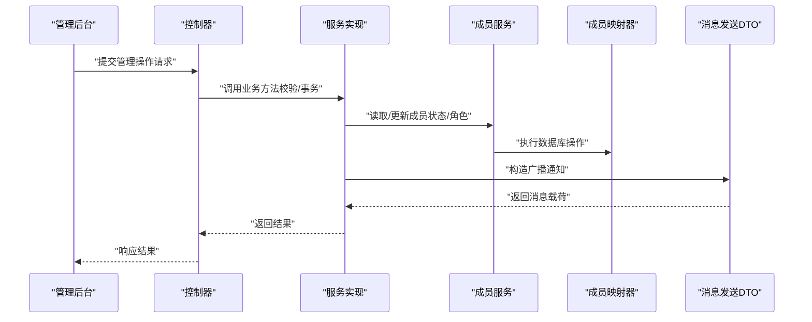
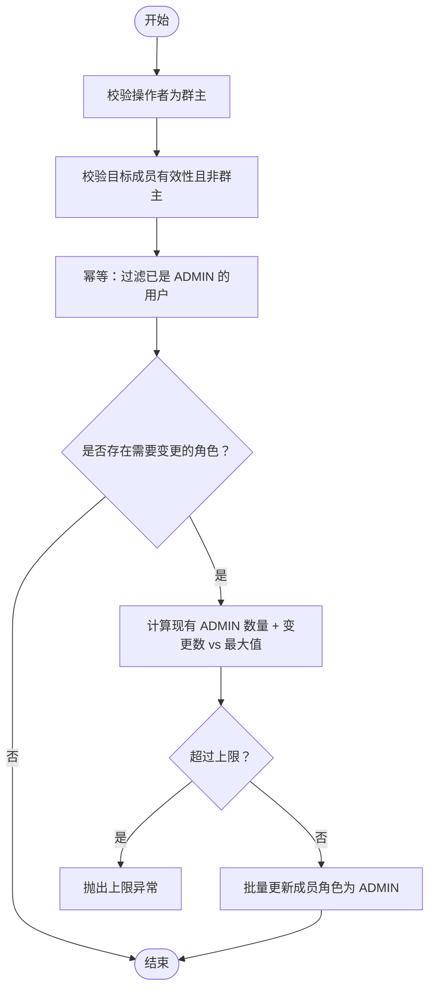
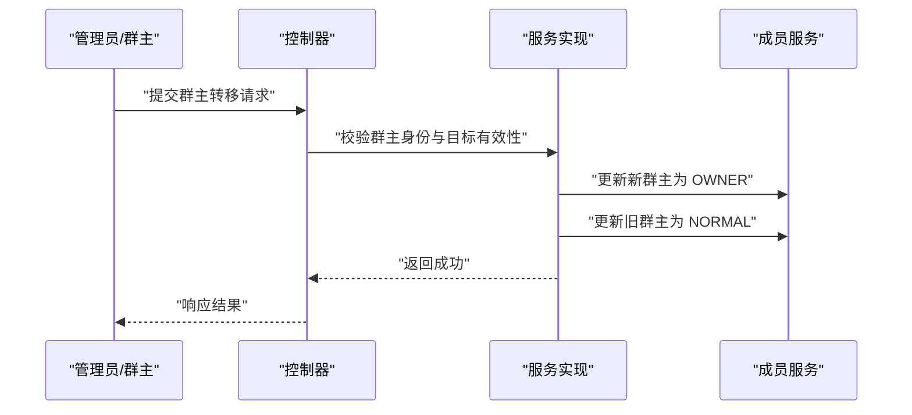
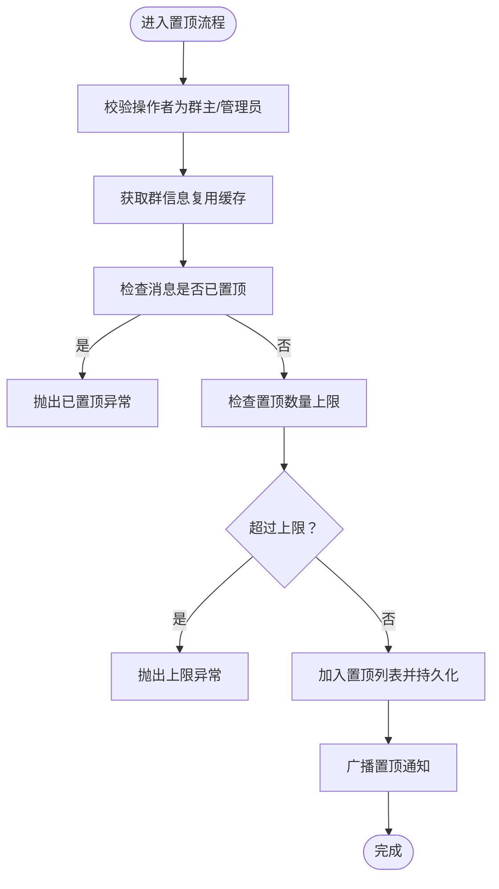
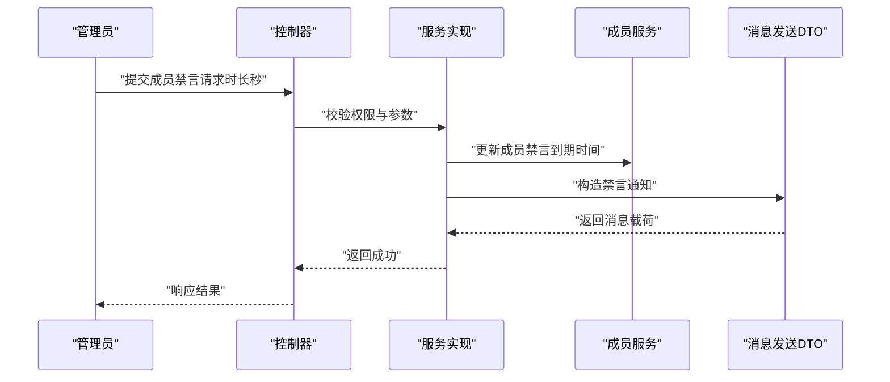
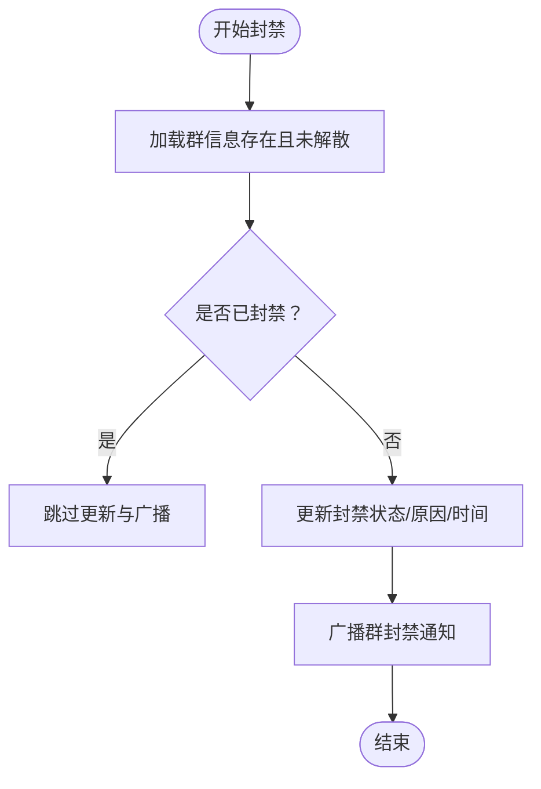
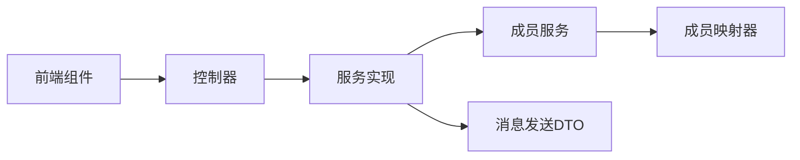

# 群组管理功能

<cite>
**本文引用的文件**
- [ImGroupServiceImpl.java](file://yudao-module-im/src/main/java/cn/iocoder/yudao/module/im/service/group/ImGroupServiceImpl.java)
- [ImGroupMemberService.java](file://yudao-module-im/src/main/java/cn/iocoder/yudao/module/im/service/group/ImGroupMemberService.java)
- [ImGroupMemberMapper.java](file://yudao-module-im/src/main/java/cn/iocoder/yudao/module/im/dal/mysql/group/ImGroupMemberMapper.java)
- [ImGroupController.java](file://yudao-module-im/src/main/java/cn/iocoder/yudao/module/im/controller/admin/group/ImGroupController.java)
- [ImGroupMemberController.java](file://yudao-module-im/src/main/java/cn/iocoder/yudao/module/im/controller/admin/group/ImGroupMemberController.java)
- [ImGroupAdminAddReqVO.java](file://yudao-module-im/src/main/java/cn/iocoder/yudao/module/im/controller/admin/group/vo/ImGroupAdminAddReqVO.java)
- [ImGroupAdminRemoveReqVO.java](file://yudao-module-im/src/main/java/cn/iocoder/yudao/module/im/controller/admin/group/vo/ImGroupAdminRemoveReqVO.java)
- [ImGroupMemberRemoveReqVO.java](file://yudao-module-im/src/main/java/cn/iocoder/yudao/module/im/controller/admin/group/vo/member/ImGroupMemberRemoveReqVO.java)
- [ImGroupMessagePinReqVO.java](file://yudao-module-im/src/main/java/cn/iocoder/yudao/module/im/controller/admin/group/vo/ImGroupMessagePinReqVO.java)
- [ImGroupMuteMemberReqVO.java](file://yudao-module-im/src/main/java/cn/iocoder/yudao/module/im/controller/admin/group/vo/ImGroupMuteMemberReqVO.java)
- [ImGroupMuteAllReqVO.java](file://yudao-module-im/src/main/java/cn/iocoder/yudao/module/im/controller/admin/group/vo/ImGroupMuteAllReqVO.java)
- [ImGroupRequestController.java](file://yudao-module-im/src/main/java/cn/iocoder/yudao/module/im/controller/admin/group/ImGroupRequestController.java)
- [ImGroupMessageSendDTO.java](file://yudao-module-im/src/main/java/cn/iocoder/yudao/module/im/service/message/dto/ImGroupMessageSendDTO.java)
- [ImStatisticsManagerService.java](file://yudao-module-im/src/main/java/cn/iocoder/yudao/module/im/service/statistics/ImStatisticsManagerService.java)
- [ImGroupServiceImplTest.java](file://yudao-module-im/src/test/java/cn/iocoder/yudao/module/im/service/group/ImGroupServiceImplTest.java)
- [ConversationGroupSide.vue](file://yudao-ui/yudao-ui-admin-vue3/src/views/im/home/pages/conversation/components/conversation/ConversationGroupSide.vue)
- [GroupMuteMemberDialog.vue](file://yudao-ui/yudao-ui-admin-vue3/src/views/im/home/components/group/GroupMuteMemberDialog.vue)
- [useMuteOverlay.ts](file://yudao-ui/yudao-ui-admin-vue3/src/views/im/home/composables/useMuteOverlay.ts)
</cite>

## 目录
1. [简介](#简介)
2. [项目结构](#项目结构)
3. [核心组件](#核心组件)
4. [架构总览](#架构总览)
5. [详细组件分析](#详细组件分析)
6. [依赖关系分析](#依赖关系分析)
7. [性能考量](#性能考量)
8. [故障排查指南](#故障排查指南)
9. [结论](#结论)
10. [附录](#附录)

## 简介
本技术文档围绕群组管理功能展开，系统性梳理管理员权限管理（任命、权限授予与撤销）、群主转移（主动与被动、权限继承规则）、群组消息管理（置顶/取消置顶、数量限制）、群组禁言管理（全局禁言、个别禁言、禁言时间设置）、群组封禁（管理员封禁、自动封禁、封禁解除）、批量操作（批量移除成员、批量禁言、批量权限调整）、统计分析（成员统计、活跃度分析、使用情况报告）以及管理后台能力（群组列表管理、违规处理、数据导出）。文档以代码为依据，结合前后端交互与测试用例，提供可执行、可验证的功能说明与最佳实践。

## 项目结构
IM 模块采用分层架构：控制层负责请求接入与参数校验，服务层承载业务逻辑与事务控制，数据访问层负责数据库操作，消息发送层负责广播通知，前端通过 Vue3 组件实现交互。

图示来源
- [ImGroupController.java:1-200](file://yudao-module-im/src/main/java/cn/iocoder/yudao/module/im/controller/admin/group/ImGroupController.java#L1-L200)
- [ImGroupMemberController.java:1-250](file://yudao-module-im/src/main/java/cn/iocoder/yudao/module/im/controller/admin/group/ImGroupMemberController.java#L1-L250)
- [ImGroupRequestController.java:90-120](file://yudao-module-im/src/main/java/cn/iocoder/yudao/module/im/controller/admin/group/ImGroupRequestController.java#L90-L120)
- [ImGroupServiceImpl.java:300-700](file://yudao-module-im/src/main/java/cn/iocoder/yudao/module/im/service/group/ImGroupServiceImpl.java#L300-L700)
- [ImGroupMemberService.java:190-250](file://yudao-module-im/src/main/java/cn/iocoder/yudao/module/im/service/group/ImGroupMemberService.java#L190-L250)
- [ImGroupMemberMapper.java:108-133](file://yudao-module-im/src/main/java/cn/iocoder/yudao/module/im/dal/mysql/group/ImGroupMemberMapper.java#L108-L133)
- [ImGroupMessageSendDTO.java:170-231](file://yudao-module-im/src/main/java/cn/iocoder/yudao/module/im/service/message/dto/ImGroupMessageSendDTO.java#L170-L231)
- [ConversationGroupSide.vue:725-758](file://yudao-ui/yudao-ui-admin-vue3/src/views/im/home/pages/conversation/components/conversation/ConversationGroupSide.vue#L725-L758)
- [GroupMuteMemberDialog.vue:40-97](file://yudao-ui/yudao-ui-admin-vue3/src/views/im/home/components/group/GroupMuteMemberDialog.vue#L40-L97)
- [useMuteOverlay.ts:80-96](file://yudao-ui/yudao-ui-admin-vue3/src/views/im/home/composables/useMuteOverlay.ts#L80-L96)

章节来源
- [ImGroupController.java:1-200](file://yudao-module-im/src/main/java/cn/iocoder/yudao/module/im/controller/admin/group/ImGroupController.java#L1-L200)
- [ImGroupMemberController.java:1-250](file://yudao-module-im/src/main/java/cn/iocoder/yudao/module/im/controller/admin/group/ImGroupMemberController.java#L1-L250)
- [ImGroupRequestController.java:90-120](file://yudao-module-im/src/main/java/cn/iocoder/yudao/module/im/controller/admin/group/ImGroupRequestController.java#L90-L120)

## 核心组件
- 群组业务实现：负责管理员任命/撤销、群主转移、消息置顶/取消置顶、全局/个别禁言、群组封禁、管理后台分页查询等。
- 群成员业务接口：提供批量移除成员、按群统计活跃成员、更新成员禁言到期时间等能力。
- 控制器层：对请求参数进行校验与鉴权，调用服务层完成具体操作。
- 前端组件：提供群主/管理员操作入口、禁言弹窗、禁言遮罩提示等交互体验。
- 消息发送 DTO：封装广播通知内容，确保客户端收到一致的消息类型与载荷。

章节来源
- [ImGroupServiceImpl.java:316-340](file://yudao-module-im/src/main/java/cn/iocoder/yudao/module/im/service/group/ImGroupServiceImpl.java#L316-L340)
- [ImGroupMemberService.java:199-245](file://yudao-module-im/src/main/java/cn/iocoder/yudao/module/im/service/group/ImGroupMemberService.java#L199-L245)
- [ImGroupMessageSendDTO.java:170-231](file://yudao-module-im/src/main/java/cn/iocoder/yudao/module/im/service/message/dto/ImGroupMessageSendDTO.java#L170-L231)

## 架构总览
下图展示从管理后台到服务层再到数据层与消息层的整体调用链，体现权限校验、幂等处理、事务控制与广播通知的关键节点。

图示来源
- [ImGroupController.java:179-199](file://yudao-module-im/src/main/java/cn/iocoder/yudao/module/im/controller/admin/group/ImGroupController.java#L179-L199)
- [ImGroupServiceImpl.java:316-340](file://yudao-module-im/src/main/java/cn/iocoder/yudao/module/im/service/group/ImGroupServiceImpl.java#L316-L340)
- [ImGroupMemberService.java:199-245](file://yudao-module-im/src/main/java/cn/iocoder/yudao/module/im/service/group/ImGroupMemberService.java#L199-L245)
- [ImGroupMemberMapper.java:108-133](file://yudao-module-im/src/main/java/cn/iocoder/yudao/module/im/dal/mysql/group/ImGroupMemberMapper.java#L108-L133)
- [ImGroupMessageSendDTO.java:170-231](file://yudao-module-im/src/main/java/cn/iocoder/yudao/module/im/service/message/dto/ImGroupMessageSendDTO.java#L170-L231)

## 详细组件分析

### 管理员权限管理
- 任命管理员
  - 仅群主可操作，目标必须为有效成员且非群主。
  - 幂等过滤：若目标已是管理员则跳过。
  - 上限校验：根据配置的最大管理员数量进行判断，超限抛出异常。
- 撤销管理员
  - 仅群主可操作，目标必须为管理员。
  - 幂等过滤：若目标已是普通成员则跳过。
  - 执行角色变更，保持事务一致性。

图示来源
- [ImGroupServiceImpl.java:316-340](file://yudao-module-im/src/main/java/cn/iocoder/yudao/module/im/service/group/ImGroupServiceImpl.java#L316-L340)
- [ImGroupAdminAddReqVO.java:1-22](file://yudao-module-im/src/main/java/cn/iocoder/yudao/module/im/controller/admin/group/vo/ImGroupAdminAddReqVO.java#L1-L22)
- [ImGroupAdminRemoveReqVO.java:1-22](file://yudao-module-im/src/main/java/cn/iocoder/yudao/module/im/controller/admin/group/vo/ImGroupAdminRemoveReqVO.java#L1-L22)

章节来源
- [ImGroupServiceImpl.java:316-340](file://yudao-module-im/src/main/java/cn/iocoder/yudao/module/im/service/group/ImGroupServiceImpl.java#L316-L340)
- [ImGroupServiceImplTest.java:786-859](file://yudao-module-im/src/test/java/cn/iocoder/yudao/module/im/service/group/ImGroupServiceImplTest.java#L786-L859)

### 群主转移
- 主动转移：仅群主可发起，目标必须为有效成员（非群主），执行双角色变更（新旧群主）。
- 权限继承规则：新群主获得原群主的全部权限，旧群主降级为普通成员。
- 被动转移：在特定场景（如群主离线/违规）触发的自动转移，需遵循业务策略与风控规则。

图示来源
- [ImGroupServiceImpl.java:914-935](file://yudao-module-im/src/main/java/cn/iocoder/yudao/module/im/service/group/ImGroupServiceImpl.java#L914-L935)
- [ImGroupServiceImplTest.java:914-935](file://yudao-module-im/src/test/java/cn/iocoder/yudao/module/im/service/group/ImGroupServiceImplTest.java#L914-L935)

章节来源
- [ImGroupServiceImpl.java:914-935](file://yudao-module-im/src/main/java/cn/iocoder/yudao/module/im/service/group/ImGroupServiceImpl.java#L914-L935)
- [ImGroupServiceImplTest.java:914-935](file://yudao-module-im/src/test/java/cn/iocoder/yudao/module/im/service/group/ImGroupServiceImplTest.java#L914-L935)

### 群组消息管理（置顶/取消置顶）
- 置顶
  - 仅群主或管理员可操作。
  - 幂等校验：若消息已置顶则拒绝重复置顶。
  - 数量限制：根据配置的最大置顶数量进行判断，超限抛出异常。
  - 广播通知：向全体成员推送“群消息置顶”通知。
- 取消置顶
  - 仅群主或管理员可操作。
  - 幂等校验：若消息未置顶则拒绝无效操作。
  - 广播通知：向全体成员推送“群消息取消置顶”通知。

图示来源
- [ImGroupServiceImpl.java:454-483](file://yudao-module-im/src/main/java/cn/iocoder/yudao/module/im/service/group/ImGroupServiceImpl.java#L454-L483)
- [ImGroupMessagePinReqVO.java:1-22](file://yudao-module-im/src/main/java/cn/iocoder/yudao/module/im/controller/admin/group/vo/ImGroupMessagePinReqVO.java#L1-L22)
- [ImGroupMessageSendDTO.java:170-188](file://yudao-module-im/src/main/java/cn/iocoder/yudao/module/im/service/message/dto/ImGroupMessageSendDTO.java#L170-L188)

章节来源
- [ImGroupServiceImpl.java:454-483](file://yudao-module-im/src/main/java/cn/iocoder/yudao/module/im/service/group/ImGroupServiceImpl.java#L454-L483)
- [ImGroupMessageSendDTO.java:170-188](file://yudao-module-im/src/main/java/cn/iocoder/yudao/module/im/service/message/dto/ImGroupMessageSendDTO.java#L170-L188)

### 群组禁言管理
- 个别禁言
  - 支持设置禁言时长（秒），0 表示永久禁言。
  - 前端提供预设时长与“永久”选项，调用后端接口。
  - 禁言到期时间存储于成员记录，前端组合式函数用于展示禁言遮罩与剩余时间。
- 全局禁言
  - 仅群主或管理员可操作，支持开启/关闭全群禁言。
  - 广播通知：向全体成员推送“全群禁言/取消禁言”通知。
- 禁言时间设置
  - 通过请求体中的时长字段控制，后端进行最小值校验与到期时间计算。

图示来源
- [ImGroupMuteMemberReqVO.java:1-25](file://yudao-module-im/src/main/java/cn/iocoder/yudao/module/im/controller/admin/group/vo/ImGroupMuteMemberReqVO.java#L1-L25)
- [ImGroupMuteAllReqVO.java:1-19](file://yudao-module-im/src/main/java/cn/iocoder/yudao/module/im/controller/admin/group/vo/ImGroupMuteAllReqVO.java#L1-L19)
- [ImGroupMessageSendDTO.java:190-221](file://yudao-module-im/src/main/java/cn/iocoder/yudao/module/im/service/message/dto/ImGroupMessageSendDTO.java#L190-L221)
- [GroupMuteMemberDialog.vue:40-97](file://yudao-ui/yudao-ui-admin-vue3/src/views/im/home/components/group/GroupMuteMemberDialog.vue#L40-L97)
- [useMuteOverlay.ts:80-96](file://yudao-ui/yudao-ui-admin-vue3/src/views/im/home/composables/useMuteOverlay.ts#L80-L96)

章节来源
- [ImGroupMuteMemberReqVO.java:1-25](file://yudao-module-im/src/main/java/cn/iocoder/yudao/module/im/controller/admin/group/vo/ImGroupMuteMemberReqVO.java#L1-L25)
- [ImGroupMuteAllReqVO.java:1-19](file://yudao-module-im/src/main/java/cn/iocoder/yudao/module/im/controller/admin/group/vo/ImGroupMuteAllReqVO.java#L1-L19)
- [ImGroupMessageSendDTO.java:190-221](file://yudao-module-im/src/main/java/cn/iocoder/yudao/module/im/service/message/dto/ImGroupMessageSendDTO.java#L190-L221)
- [GroupMuteMemberDialog.vue:40-97](file://yudao-ui/yudao-ui-admin-vue3/src/views/im/home/components/group/GroupMuteMemberDialog.vue#L40-L97)
- [useMuteOverlay.ts:80-96](file://yudao-ui/yudao-ui-admin-vue3/src/views/im/home/composables/useMuteOverlay.ts#L80-L96)

### 群组封禁功能
- 管理员封禁
  - 仅管理员可操作，目标群必须存在且未解散。
  - 幂等处理：若已封禁则不重复广播。
  - 更新封禁状态与原因、时间戳，并广播“群组封禁”通知。
- 自动封禁
  - 基于风控策略或违规检测触发，遵循相同流程与幂等规则。
- 封禁解除
  - 当前代码聚焦封禁与广播，解除逻辑需在后续扩展中补充（建议通过反向广播与状态字段更新实现）。

图示来源
- [ImGroupServiceImpl.java:626-648](file://yudao-module-im/src/main/java/cn/iocoder/yudao/module/im/service/group/ImGroupServiceImpl.java#L626-L648)
- [ImGroupMessageSendDTO.java:223-231](file://yudao-module-im/src/main/java/cn/iocoder/yudao/module/im/service/message/dto/ImGroupMessageSendDTO.java#L223-L231)
- [ImGroupServiceImplTest.java:992-1032](file://yudao-module-im/src/test/java/cn/iocoder/yudao/module/im/service/group/ImGroupServiceImplTest.java#L992-L1032)

章节来源
- [ImGroupServiceImpl.java:626-648](file://yudao-module-im/src/main/java/cn/iocoder/yudao/module/im/service/group/ImGroupServiceImpl.java#L626-L648)
- [ImGroupMessageSendDTO.java:223-231](file://yudao-module-im/src/main/java/cn/iocoder/yudao/module/im/service/message/dto/ImGroupMessageSendDTO.java#L223-L231)
- [ImGroupServiceImplTest.java:992-1032](file://yudao-module-im/src/test/java/cn/iocoder/yudao/module/im/service/group/ImGroupServiceImplTest.java#L992-L1032)

### 群组批量操作
- 批量移除成员
  - 支持批量踢出成员，设置成员状态为禁用，用于批量清理或违规处置。
- 批量禁言
  - 支持批量设置成员禁言到期时间，0 表示永久禁言。
- 批量权限调整
  - 支持批量提升/降级管理员角色，遵循管理员任命/撤销的权限与上限规则。

章节来源
- [ImGroupMemberService.java:207-217](file://yudao-module-im/src/main/java/cn/iocoder/yudao/module/im/service/group/ImGroupMemberService.java#L207-L217)
- [ImGroupMemberMapper.java:108-133](file://yudao-module-im/src/main/java/cn/iocoder/yudao/module/im/dal/mysql/group/ImGroupMemberMapper.java#L108-L133)

### 群组统计分析
- 成员统计
  - 提供按群统计活跃成员数的能力，便于管理后台查看群规模与活跃度。
- 活跃度分析
  - 结合用户维度的活跃统计，支持按日/周维度聚合。
- 使用情况报告
  - 提供群总数、新建群数等指标，支撑运营看板。

章节来源
- [ImGroupMemberService.java:228-234](file://yudao-module-im/src/main/java/cn/iocoder/yudao/module/im/service/group/ImGroupMemberService.java#L228-L234)
- [ImStatisticsManagerService.java:1-53](file://yudao-module-im/src/main/java/cn/iocoder/yudao/module/im/service/statistics/ImStatisticsManagerService.java#L1-L53)

### 管理后台功能
- 群组列表管理
  - 支持分页查询群组，构建响应 VO 时对置顶消息进行安全回填（仅对有效成员可见）。
- 违规处理
  - 提供群组封禁与成员禁言能力，配合广播通知实现即时生效。
- 数据导出
  - 统计服务提供聚合指标，可作为导出数据的基础来源。

章节来源
- [ImGroupController.java:179-199](file://yudao-module-im/src/main/java/cn/iocoder/yudao/module/im/controller/admin/group/ImGroupController.java#L179-L199)
- [ImGroupServiceImpl.java:626-648](file://yudao-module-im/src/main/java/cn/iocoder/yudao/module/im/service/group/ImGroupServiceImpl.java#L626-L648)

## 依赖关系分析
- 控制器依赖服务层，服务层依赖成员服务与数据访问层，最终通过消息发送 DTO 广播通知。
- 前端组件通过 API 与控制器交互，受权限与越权过滤约束。

图示来源
- [ImGroupController.java:1-200](file://yudao-module-im/src/main/java/cn/iocoder/yudao/module/im/controller/admin/group/ImGroupController.java#L1-L200)
- [ImGroupServiceImpl.java:300-700](file://yudao-module-im/src/main/java/cn/iocoder/yudao/module/im/service/group/ImGroupServiceImpl.java#L300-L700)
- [ImGroupMemberService.java:190-250](file://yudao-module-im/src/main/java/cn/iocoder/yudao/module/im/service/group/ImGroupMemberService.java#L190-L250)
- [ImGroupMemberMapper.java:108-133](file://yudao-module-im/src/main/java/cn/iocoder/yudao/module/im/dal/mysql/group/ImGroupMemberMapper.java#L108-L133)
- [ImGroupMessageSendDTO.java:170-231](file://yudao-module-im/src/main/java/cn/iocoder/yudao/module/im/service/message/dto/ImGroupMessageSendDTO.java#L170-L231)

## 性能考量
- 缓存与幂等
  - 置顶/取消置顶与封禁均采用幂等校验，避免重复广播与数据库写入。
  - 群组信息更新使用缓存键失效策略，减少重复查询。
- 事务边界
  - 管理员任命/撤销、群主转移、置顶/取消置顶、封禁等操作均在事务内执行，保证一致性。
- 批量操作
  - 批量移除成员与批量禁言通过成员映射器的批量统计与更新接口降低数据库往返次数。

章节来源
- [ImGroupServiceImpl.java:454-483](file://yudao-module-im/src/main/java/cn/iocoder/yudao/module/im/service/group/ImGroupServiceImpl.java#L454-L483)
- [ImGroupMemberMapper.java:108-133](file://yudao-module-im/src/main/java/cn/iocoder/yudao/module/im/dal/mysql/group/ImGroupMemberMapper.java#L108-L133)

## 故障排查指南
- 管理员任命失败
  - 检查操作者是否为群主、目标是否为有效成员且非群主。
  - 核对管理员数量是否已达上限。
- 群主转移失败
  - 确认目标成员为有效成员且非群主。
  - 查看是否存在并发冲突导致的锁竞争。
- 置顶/取消置顶异常
  - 置顶：确认消息未重复置顶且未超过最大数量。
  - 取消置顶：确认消息确已置顶。
- 禁言异常
  - 检查时长参数是否合法（>=0）。
  - 前端遮罩显示异常时，核对成员禁言到期时间字段与当前时间比较逻辑。
- 封禁异常
  - 确认群组状态未解散，且未重复封禁。

章节来源
- [ImGroupServiceImplTest.java:687-713](file://yudao-module-im/src/test/java/cn/iocoder/yudao/module/im/service/group/ImGroupServiceImplTest.java#L687-L713)
- [ImGroupServiceImplTest.java:786-859](file://yudao-module-im/src/test/java/cn/iocoder/yudao/module/im/service/group/ImGroupServiceImplTest.java#L786-L859)
- [ImGroupServiceImplTest.java:992-1032](file://yudao-module-im/src/test/java/cn/iocoder/yudao/module/im/service/group/ImGroupServiceImplTest.java#L992-L1032)
- [useMuteOverlay.ts:80-96](file://yudao-ui/yudao-ui-admin-vue3/src/views/im/home/composables/useMuteOverlay.ts#L80-L96)

## 结论
本群组管理功能以严格的权限校验、幂等处理与事务保障为核心，覆盖管理员任命/撤销、群主转移、消息置顶/取消置顶、全局/个别禁言、群组封禁、批量操作与统计分析等关键能力。前端通过直观的交互组件与实时通知增强用户体验，后端通过清晰的服务层与消息广播确保一致性与可观测性。建议在后续迭代中完善封禁解除与更多自动化风控策略，持续优化性能与可维护性。

## 附录
- 前端交互要点
  - 群主/管理员侧边栏提供移除成员、设置管理员、转让群主入口。
  - 成员禁言弹窗提供常用时长预设与“永久”选项。
  - 禁言遮罩组合式函数用于展示当前用户的禁言状态与到期时间。

章节来源
- [ConversationGroupSide.vue:725-758](file://yudao-ui/yudao-ui-admin-vue3/src/views/im/home/pages/conversation/components/conversation/ConversationGroupSide.vue#L725-L758)
- [GroupMuteMemberDialog.vue:40-97](file://yudao-ui/yudao-ui-admin-vue3/src/views/im/home/components/group/GroupMuteMemberDialog.vue#L40-L97)
- [useMuteOverlay.ts:80-96](file://yudao-ui/yudao-ui-admin-vue3/src/views/im/home/composables/useMuteOverlay.ts#L80-L96)