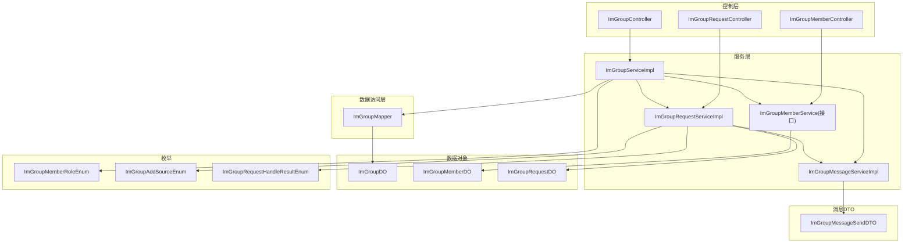
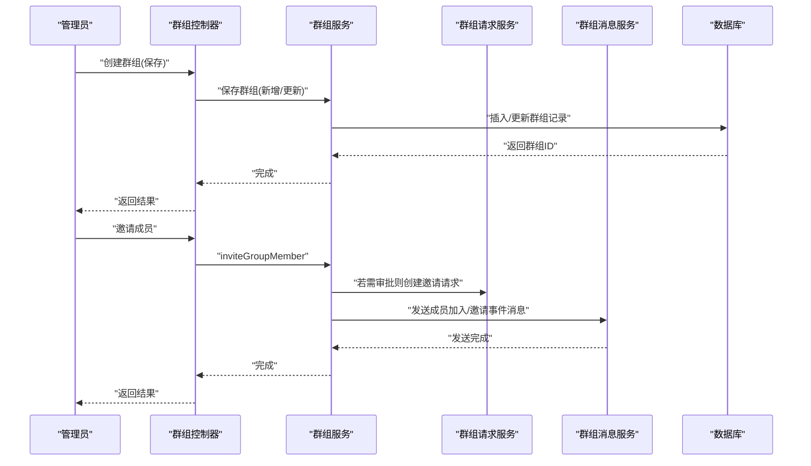
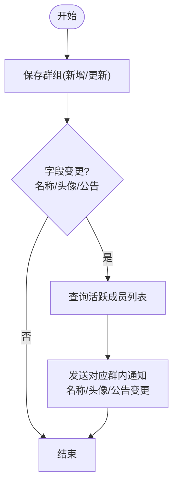
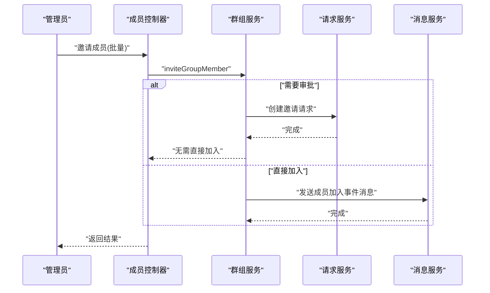
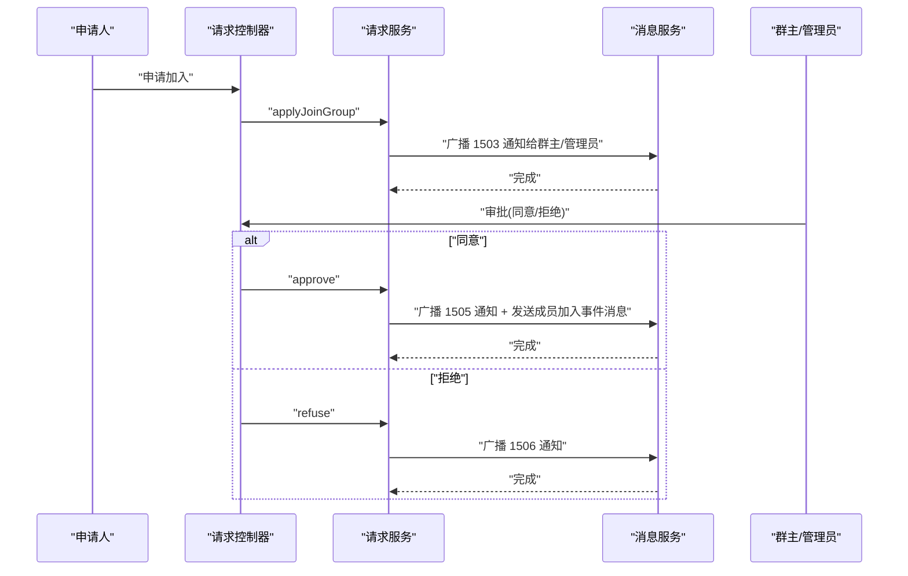
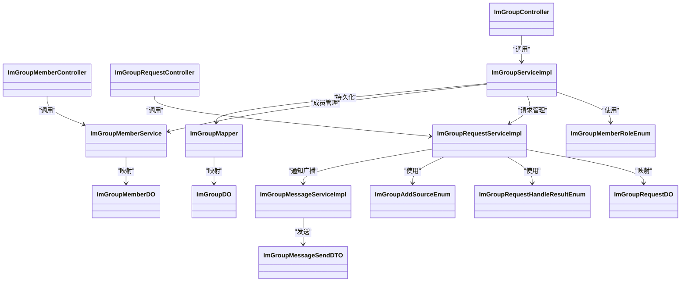
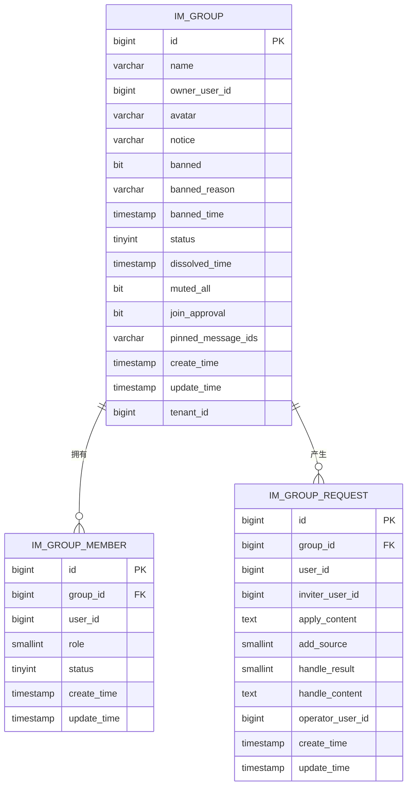

# 群组管理系统

<cite>
**本文引用的文件**
- [ImGroupController.java](file://yudao-module-im/src/main/java/cn/iocoder/yudao/module/im/controller/admin/group/ImGroupController.java)
- [ImGroupMemberController.java](file://yudao-module-im/src/main/java/cn/iocoder/yudao/module/im/controller/admin/group/ImGroupMemberController.java)
- [ImGroupRequestController.java](file://yudao-module-im/src/main/java/cn/iocoder/yudao/module/im/controller/admin/group/ImGroupRequestController.java)
- [ImGroupServiceImpl.java](file://yudao-module-im/src/main/java/cn/iocoder/yudao/module/im/service/group/ImGroupServiceImpl.java)
- [ImGroupRequestServiceImpl.java](file://yudao-module-im/src/main/java/cn/iocoder/yudao/module/im/service/group/ImGroupRequestServiceImpl.java)
- [ImGroupMemberService.java](file://yudao-module-im/src/main/java/cn/iocoder/yudao/module/im/service/group/ImGroupMemberService.java)
- [ImGroupMapper.java](file://yudao-module-im/src/main/java/cn/iocoder/yudao/module/im/dal/mysql/group/ImGroupMapper.java)
- [ImGroupDO.java](file://yudao-module-im/src/main/java/cn/iocoder/yudao/module/im/dal/dataobject/group/ImGroupDO.java)
- [ImGroupMemberDO.java](file://yudao-module-im/src/main/java/cn/iocoder/yudao/module/im/dal/dataobject/group/ImGroupMemberDO.java)
- [ImGroupRequestDO.java](file://yudao-module-im/src/main/java/cn/iocoder/yudao/module/im/dal/dataobject/group/ImGroupRequestDO.java)
- [ImGroupMemberRoleEnum.java](file://yudao-module-im/src/main/java/cn/iocoder/yudao/module/im/enums/group/ImGroupMemberRoleEnum.java)
- [ImGroupAddSourceEnum.java](file://yudao-module-im/src/main/java/cn/iocoder/yudao/module/im/enums/group/ImGroupAddSourceEnum.java)
- [ImGroupRequestHandleResultEnum.java](file://yudao-module-im/src/main/java/cn/iocoder/yudao/module/im/enums/group/ImGroupRequestHandleResultEnum.java)
- [ImGroupMessageSendDTO.java](file://yudao-module-im/src/main/java/cn/iocoder/yudao/module/im/service/message/dto/ImGroupMessageSendDTO.java)
- [ImGroupMessageServiceImpl.java](file://yudao-module-im/src/main/java/cn/iocoder/yudao/module/im/service/message/ImGroupMessageServiceImpl.java)
- [ImGroupSaveReqVO.java](file://yudao-module-im/src/main/java/cn/iocoder/yudao/module/im/controller/admin/group/vo/ImGroupSaveReqVO.java)
- [ImGroupUpdateReqVO.java](file://yudao-module-im/src/main/java/cn/iocoder/yudao/module/im/controller/admin/group/vo/ImGroupUpdateReqVO.java)
- [ImGroupMemberInviteReqVO.java](file://yudao-module-im/src/main/java/cn/iocoder/yudao/module/im/controller/admin/group/vo/member/ImGroupMemberInviteReqVO.java)
- [ImGroupMemberCreateReqVO.java](file://yudao-module-im/src/main/java/cn/iocoder/yudao/module/im/controller/admin/group/vo/member/ImGroupMemberCreateReqVO.java)
- [ImGroupRequestApplyReqVO.java](file://yudao-module-im/src/main/java/cn/iocoder/yudao/module/im/controller/admin/group/vo/request/ImGroupRequestApplyReqVO.java)
- [create_tables.sql](file://yudao-module-im/src/test/resources/sql/create_tables.sql)
</cite>

## 目录
1. [简介](#简介)
2. [项目结构](#项目结构)
3. [核心组件](#核心组件)
4. [架构总览](#架构总览)
5. [详细组件分析](#详细组件分析)
6. [依赖关系分析](#依赖关系分析)
7. [性能考量](#性能考量)
8. [故障排查指南](#故障排查指南)
9. [结论](#结论)
10. [附录](#附录)

## 简介
本文件为“群组管理系统”的技术文档，基于后端 IM 模块实现，覆盖群组创建、成员管理、请求处理、信息维护、权限体系、搜索与发现以及安全机制等完整能力。系统采用分层架构：控制层负责 API 入口与参数校验，服务层编排业务流程，数据访问层负责持久化，消息服务用于广播通知，WebSocket 用于实时推送。

## 项目结构
- 控制层：位于 admin/group 下，分别提供群组、成员、请求的控制器接口
- 服务层：group 包含群组、成员、请求三大服务；message 包含群组消息服务
- 数据访问层：dal/mysql/group 提供群组 Mapper
- 数据对象：dal/dataobject/group 定义群组、成员、请求实体
- 枚举：enums/group 定义成员角色、加群来源、请求处理结果等
- 请求 VO：controller/admin/group/vo 定义新增/更新/邀请/申请等输入模型

图表来源
- [ImGroupController.java:1-25](file://yudao-module-im/src/main/java/cn/iocoder/yudao/module/im/controller/admin/group/ImGroupController.java#L1-L25)
- [ImGroupMemberController.java:1-25](file://yudao-module-im/src/main/java/cn/iocoder/yudao/module/im/controller/admin/group/ImGroupMemberController.java#L1-L25)
- [ImGroupRequestController.java:1-28](file://yudao-module-im/src/main/java/cn/iocoder/yudao/module/im/controller/admin/group/ImGroupRequestController.java#L1-L28)
- [ImGroupServiceImpl.java:22-42](file://yudao-module-im/src/main/java/cn/iocoder/yudao/module/im/service/group/ImGroupServiceImpl.java#L22-L42)
- [ImGroupMapper.java:1-34](file://yudao-module-im/src/main/java/cn/iocoder/yudao/module/im/dal/mysql/group/ImGroupMapper.java#L1-L34)
- [ImGroupDO.java](file://yudao-module-im/src/main/java/cn/iocoder/yudao/module/im/dal/dataobject/group/ImGroupDO.java)
- [ImGroupMemberDO.java](file://yudao-module-im/src/main/java/cn/iocoder/yudao/module/im/dal/dataobject/group/ImGroupMemberDO.java)
- [ImGroupRequestDO.java](file://yudao-module-im/src/main/java/cn/iocoder/yudao/module/im/dal/dataobject/group/ImGroupRequestDO.java)
- [ImGroupMemberRoleEnum.java](file://yudao-module-im/src/main/java/cn/iocoder/yudao/module/im/enums/group/ImGroupMemberRoleEnum.java)
- [ImGroupAddSourceEnum.java](file://yudao-module-im/src/main/java/cn/iocoder/yudao/module/im/enums/group/ImGroupAddSourceEnum.java)
- [ImGroupRequestHandleResultEnum.java](file://yudao-module-im/src/main/java/cn/iocoder/yudao/module/im/enums/group/ImGroupRequestHandleResultEnum.java)
- [ImGroupMessageSendDTO.java](file://yudao-module-im/src/main/java/cn/iocoder/yudao/module/im/service/message/dto/ImGroupMessageSendDTO.java)
- [ImGroupMessageServiceImpl.java:1-24](file://yudao-module-im/src/main/java/cn/iocoder/yudao/module/im/service/message/ImGroupMessageServiceImpl.java#L1-L24)

章节来源
- [ImGroupController.java:1-25](file://yudao-module-im/src/main/java/cn/iocoder/yudao/module/im/controller/admin/group/ImGroupController.java#L1-L25)
- [ImGroupMemberController.java:1-25](file://yudao-module-im/src/main/java/cn/iocoder/yudao/module/im/controller/admin/group/ImGroupMemberController.java#L1-L25)
- [ImGroupRequestController.java:1-28](file://yudao-module-im/src/main/java/cn/iocoder/yudao/module/im/controller/admin/group/ImGroupRequestController.java#L1-L28)
- [ImGroupServiceImpl.java:22-42](file://yudao-module-im/src/main/java/cn/iocoder/yudao/module/im/service/group/ImGroupServiceImpl.java#L22-L42)
- [ImGroupMapper.java:1-34](file://yudao-module-im/src/main/java/cn/iocoder/yudao/module/im/dal/mysql/group/ImGroupMapper.java#L1-L34)

## 核心组件
- 群组控制器：提供群组创建、更新、删除、分页、封禁/解封、全群禁言等接口
- 群组成员控制器：提供成员邀请、移除、角色更新、列表查询等接口
- 群组请求控制器：提供入群申请、批量审批/拒绝、管理员待处理列表等接口
- 群组服务：封装群组生命周期、信息维护、成员批量邀请、权限变更等核心逻辑
- 群组请求服务：封装申请创建、审批/拒绝、通知广播、事件消息发送等流程
- 群组消息服务：封装群内广播通知、已读回执、消息类型定义等
- 数据访问：提供群组分页查询、行级锁查询等能力
- 枚举：成员角色、加群来源、请求处理结果等

章节来源
- [ImGroupController.java:1-25](file://yudao-module-im/src/main/java/cn/iocoder/yudao/module/im/controller/admin/group/ImGroupController.java#L1-L25)
- [ImGroupMemberController.java:1-25](file://yudao-module-im/src/main/java/cn/iocoder/yudao/module/im/controller/admin/group/ImGroupMemberController.java#L1-L25)
- [ImGroupRequestController.java:1-28](file://yudao-module-im/src/main/java/cn/iocoder/yudao/module/im/controller/admin/group/ImGroupRequestController.java#L1-L28)
- [ImGroupServiceImpl.java:22-42](file://yudao-module-im/src/main/java/cn/iocoder/yudao/module/im/service/group/ImGroupServiceImpl.java#L22-L42)
- [ImGroupRequestServiceImpl.java:142-383](file://yudao-module-im/src/main/java/cn/iocoder/yudao/module/im/service/group/ImGroupRequestServiceImpl.java#L142-L383)
- [ImGroupMessageServiceImpl.java:1-24](file://yudao-module-im/src/main/java/cn/iocoder/yudao/module/im/service/message/ImGroupMessageServiceImpl.java#L1-L24)
- [ImGroupMapper.java:1-34](file://yudao-module-im/src/main/java/cn/iocoder/yudao/module/im/dal/mysql/group/ImGroupMapper.java#L1-L34)

## 架构总览
系统采用典型的分层架构，控制层负责接收请求并进行参数校验，服务层编排业务流程（如邀请成员、创建请求、发送通知），数据访问层负责数据库交互，消息服务负责群内广播与通知推送。

图表来源
- [ImGroupController.java:1-25](file://yudao-module-im/src/main/java/cn/iocoder/yudao/module/im/controller/admin/group/ImGroupController.java#L1-L25)
- [ImGroupServiceImpl.java:22-42](file://yudao-module-im/src/main/java/cn/iocoder/yudao/module/im/service/group/ImGroupServiceImpl.java#L22-L42)
- [ImGroupRequestServiceImpl.java:142-383](file://yudao-module-im/src/main/java/cn/iocoder/yudao/module/im/service/group/ImGroupRequestServiceImpl.java#L142-L383)
- [ImGroupMessageServiceImpl.java:1-24](file://yudao-module-im/src/main/java/cn/iocoder/yudao/module/im/service/message/ImGroupMessageServiceImpl.java#L1-L24)

## 详细组件分析

### 群组创建与信息维护
- 创建流程：通过保存接口传入群名称、群主、头像、公告等，服务层持久化并返回
- 更新流程：支持名称、头像、公告、是否需要审批等字段更新；当字段发生变更时，向全体成员广播对应的通知消息
- 封禁/解封：通过状态字段控制群组封禁
- 全群禁言：通过 muted_all 字段控制是否对全体成员禁言

图表来源
- [ImGroupServiceImpl.java:146-166](file://yudao-module-im/src/main/java/cn/iocoder/yudao/module/im/service/group/ImGroupServiceImpl.java#L146-L166)
- [ImGroupMessageServiceImpl.java:1-24](file://yudao-module-im/src/main/java/cn/iocoder/yudao/module/im/service/message/ImGroupMessageServiceImpl.java#L1-L24)

章节来源
- [ImGroupSaveReqVO.java:1-27](file://yudao-module-im/src/main/java/cn/iocoder/yudao/module/im/controller/admin/group/vo/ImGroupSaveReqVO.java#L1-L27)
- [ImGroupUpdateReqVO.java:1-46](file://yudao-module-im/src/main/java/cn/iocoder/yudao/module/im/controller/admin/group/vo/ImGroupUpdateReqVO.java#L1-L46)
- [ImGroupServiceImpl.java:146-166](file://yudao-module-im/src/main/java/cn/iocoder/yudao/module/im/service/group/ImGroupServiceImpl.java#L146-L166)
- [create_tables.sql:42-63](file://yudao-module-im/src/test/resources/sql/create_tables.sql#L42-L63)

### 成员邀请与加入申请
- 成员邀请：支持批量邀请，若群组开启审批或邀请者非好友，则创建邀请请求；否则直接加入并广播成员加入事件
- 加入申请：当群组开启审批时，申请人提交申请，管理员收到 1503 通知并可审批
- 角色与权限：成员角色分为群主、管理员、普通成员，不同角色拥有不同的管理权限

图表来源
- [ImGroupMemberController.java:1-25](file://yudao-module-im/src/main/java/cn/iocoder/yudao/module/im/controller/admin/group/ImGroupMemberController.java#L1-L25)
- [ImGroupMemberInviteReqVO.java:1-22](file://yudao-module-im/src/main/java/cn/iocoder/yudao/module/im/controller/admin/group/vo/member/ImGroupMemberInviteReqVO.java#L1-L22)
- [ImGroupServiceImpl.java:22-42](file://yudao-module-im/src/main/java/cn/iocoder/yudao/module/im/service/group/ImGroupServiceImpl.java#L22-L42)
- [ImGroupRequestServiceImpl.java:142-383](file://yudao-module-im/src/main/java/cn/iocoder/yudao/module/im/service/group/ImGroupRequestServiceImpl.java#L142-L383)

章节来源
- [ImGroupMemberCreateReqVO.java:1-19](file://yudao-module-im/src/main/java/cn/iocoder/yudao/module/im/controller/admin/group/vo/member/ImGroupMemberCreateReqVO.java#L1-L19)
- [ImGroupMemberInviteReqVO.java:1-22](file://yudao-module-im/src/main/java/cn/iocoder/yudao/module/im/controller/admin/group/vo/member/ImGroupMemberInviteReqVO.java#L1-L22)
- [ImGroupServiceImpl.java:22-42](file://yudao-module-im/src/main/java/cn/iocoder/yudao/module/im/service/group/ImGroupServiceImpl.java#L22-L42)
- [ImGroupRequestServiceImpl.java:142-383](file://yudao-module-im/src/main/java/cn/iocoder/yudao/module/im/service/group/ImGroupRequestServiceImpl.java#L142-L383)

### 请求处理机制（入群申请审核）
- 申请创建：当群组开启审批时，申请人提交申请，系统创建请求并广播 1503 通知给群主与管理员
- 审批/拒绝：管理员可在后台查看待处理列表，执行同意或拒绝；同意时广播 1505 通知并发送成员加入/邀请事件消息；拒绝时广播 1506 通知
- 通知与消息：使用消息服务向相关人员推送私聊通知，并在群内发送相应事件消息

图表来源
- [ImGroupRequestController.java:1-28](file://yudao-module-im/src/main/java/cn/iocoder/yudao/module/im/controller/admin/group/ImGroupRequestController.java#L1-L28)
- [ImGroupRequestApplyReqVO.java](file://yudao-module-im/src/main/java/cn/iocoder/yudao/module/im/controller/admin/group/vo/request/ImGroupRequestApplyReqVO.java)
- [ImGroupRequestServiceImpl.java:142-383](file://yudao-module-im/src/main/java/cn/iocoder/yudao/module/im/service/group/ImGroupRequestServiceImpl.java#L142-L383)
- [ImGroupMessageServiceImpl.java:1-24](file://yudao-module-im/src/main/java/cn/iocoder/yudao/module/im/service/message/ImGroupMessageServiceImpl.java#L1-L24)

章节来源
- [ImGroupRequestController.java:1-28](file://yudao-module-im/src/main/java/cn/iocoder/yudao/module/im/controller/admin/group/ImGroupRequestController.java#L1-L28)
- [ImGroupRequestApplyReqVO.java](file://yudao-module-im/src/main/java/cn/iocoder/yudao/module/im/controller/admin/group/vo/request/ImGroupRequestApplyReqVO.java)
- [ImGroupRequestServiceImpl.java:142-383](file://yudao-module-im/src/main/java/cn/iocoder/yudao/module/im/service/group/ImGroupRequestServiceImpl.java#L142-L383)

### 权限体系与角色分配
- 角色定义：群主、管理员、普通成员
- 权限差异：群主拥有最高权限，可管理管理员与成员；管理员可进行部分管理操作；普通成员仅能参与聊天与接收通知
- 角色变更：通过成员控制器更新成员角色，配合消息服务广播角色变更通知

章节来源
- [ImGroupMemberRoleEnum.java](file://yudao-module-im/src/main/java/cn/iocoder/yudao/module/im/enums/group/ImGroupMemberRoleEnum.java)
- [ImGroupMemberController.java:1-25](file://yudao-module-im/src/main/java/cn/iocoder/yudao/module/im/controller/admin/group/ImGroupMemberController.java#L1-L25)

### 搜索与发现（公开群组）
- 群组分页查询：提供按名称、群主、状态、封禁状态、时间范围等条件的分页查询接口
- 公开群组：结合 joinApproval 字段可区分自由进群与需要审批的群组；前端可根据业务需求筛选展示

章节来源
- [ImGroupMapper.java:24-32](file://yudao-module-im/src/main/java/cn/iocoder/yudao/module/im/dal/mysql/group/ImGroupMapper.java#L24-L32)
- [ImGroupController.java:1-25](file://yudao-module-im/src/main/java/cn/iocoder/yudao/module/im/controller/admin/group/ImGroupController.java#L1-L25)

### 安全机制
- 全群禁言：通过 muted_all 字段控制是否对全体成员禁言
- 拉黑管理：通过封禁字段与封禁原因控制群组封禁状态
- 举报处理：当前仓库未提供专门的举报 DTO 或接口，建议在请求服务中扩展举报类型与处理流程

章节来源
- [create_tables.sql:42-63](file://yudao-module-im/src/test/resources/sql/create_tables.sql#L42-L63)
- [ImGroupServiceImpl.java:146-166](file://yudao-module-im/src/main/java/cn/iocoder/yudao/module/im/service/group/ImGroupServiceImpl.java#L146-L166)

## 依赖关系分析
- 控制器依赖服务接口，服务层依赖数据访问与消息服务
- 请求服务依赖消息服务以进行通知广播与事件消息发送
- 群组服务依赖成员服务与请求服务以完成邀请与审批流程
- 枚举贯穿于请求服务与消息服务，确保通知类型与处理结果一致

图表来源
- [ImGroupController.java:1-25](file://yudao-module-im/src/main/java/cn/iocoder/yudao/module/im/controller/admin/group/ImGroupController.java#L1-L25)
- [ImGroupMemberController.java:1-25](file://yudao-module-im/src/main/java/cn/iocoder/yudao/module/im/controller/admin/group/ImGroupMemberController.java#L1-L25)
- [ImGroupRequestController.java:1-28](file://yudao-module-im/src/main/java/cn/iocoder/yudao/module/im/controller/admin/group/ImGroupRequestController.java#L1-L28)
- [ImGroupServiceImpl.java:22-42](file://yudao-module-im/src/main/java/cn/iocoder/yudao/module/im/service/group/ImGroupServiceImpl.java#L22-L42)
- [ImGroupRequestServiceImpl.java:142-383](file://yudao-module-im/src/main/java/cn/iocoder/yudao/module/im/service/group/ImGroupRequestServiceImpl.java#L142-L383)
- [ImGroupMessageServiceImpl.java:1-24](file://yudao-module-im/src/main/java/cn/iocoder/yudao/module/im/service/message/ImGroupMessageServiceImpl.java#L1-L24)
- [ImGroupMapper.java:1-34](file://yudao-module-im/src/main/java/cn/iocoder/yudao/module/im/dal/mysql/group/ImGroupMapper.java#L1-L34)
- [ImGroupDO.java](file://yudao-module-im/src/main/java/cn/iocoder/yudao/module/im/dal/dataobject/group/ImGroupDO.java)
- [ImGroupMemberDO.java](file://yudao-module-im/src/main/java/cn/iocoder/yudao/module/im/dal/dataobject/group/ImGroupMemberDO.java)
- [ImGroupRequestDO.java](file://yudao-module-im/src/main/java/cn/iocoder/yudao/module/im/dal/dataobject/group/ImGroupRequestDO.java)
- [ImGroupMemberRoleEnum.java](file://yudao-module-im/src/main/java/cn/iocoder/yudao/module/im/enums/group/ImGroupMemberRoleEnum.java)
- [ImGroupAddSourceEnum.java](file://yudao-module-im/src/main/java/cn/iocoder/yudao/module/im/enums/group/ImGroupAddSourceEnum.java)
- [ImGroupRequestHandleResultEnum.java](file://yudao-module-im/src/main/java/cn/iocoder/yudao/module/im/enums/group/ImGroupRequestHandleResultEnum.java)
- [ImGroupMessageSendDTO.java](file://yudao-module-im/src/main/java/cn/iocoder/yudao/module/im/service/message/dto/ImGroupMessageSendDTO.java)

## 性能考量
- 批量邀请：优先使用批量接口减少多次往返
- 活跃成员查询复用：在信息维护时一次性查询活跃成员列表，避免重复查询
- 分页查询：使用分页接口并合理设置过滤条件，避免全表扫描
- 行级锁：查询群组详情时使用 FOR UPDATE，确保并发场景下的一致性

章节来源
- [ImGroupServiceImpl.java:146-166](file://yudao-module-im/src/main/java/cn/iocoder/yudao/module/im/service/group/ImGroupServiceImpl.java#L146-L166)
- [ImGroupMapper.java:18-22](file://yudao-module-im/src/main/java/cn/iocoder/yudao/module/im/dal/mysql/group/ImGroupMapper.java#L18-L22)

## 故障排查指南
- 审批模式下的邀请失败：检查群组 joinApproval 配置与邀请者与被邀请者的好友关系
- 通知未送达：确认消息服务是否正常运行，以及广播目标用户在线状态
- 并发问题：涉及群组信息更新与成员变更时，使用 FOR UPDATE 保证一致性
- 权限不足：确认调用者角色与操作范围，确保具备相应权限

章节来源
- [ImGroupRequestServiceImpl.java:142-383](file://yudao-module-im/src/main/java/cn/iocoder/yudao/module/im/service/group/ImGroupRequestServiceImpl.java#L142-L383)
- [ImGroupMapper.java:18-22](file://yudao-module-im/src/main/java/cn/iocoder/yudao/module/im/dal/mysql/group/ImGroupMapper.java#L18-L22)

## 结论
本群组管理系统围绕“群组 + 成员 + 请求 + 消息”四大核心模块构建，具备完善的创建、维护、邀请、审批与通知能力。通过清晰的分层设计与枚举约束，系统在可扩展性与一致性方面表现良好。建议后续增强举报处理与更细粒度的权限控制，以进一步完善安全与治理能力。

## 附录
- 数据模型概览（简化）

图表来源
- [create_tables.sql:42-63](file://yudao-module-im/src/test/resources/sql/create_tables.sql#L42-L63)
- [ImGroupDO.java](file://yudao-module-im/src/main/java/cn/iocoder/yudao/module/im/dal/dataobject/group/ImGroupDO.java)
- [ImGroupMemberDO.java](file://yudao-module-im/src/main/java/cn/iocoder/yudao/module/im/dal/dataobject/group/ImGroupMemberDO.java)
- [ImGroupRequestDO.java](file://yudao-module-im/src/main/java/cn/iocoder/yudao/module/im/dal/dataobject/group/ImGroupRequestDO.java)