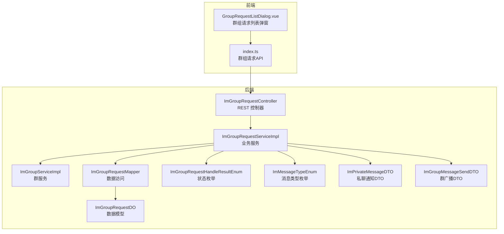
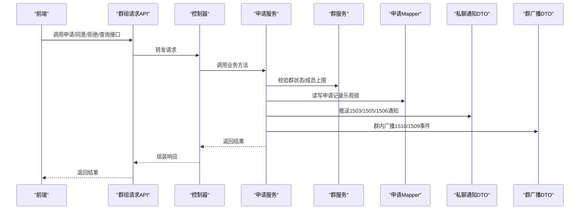
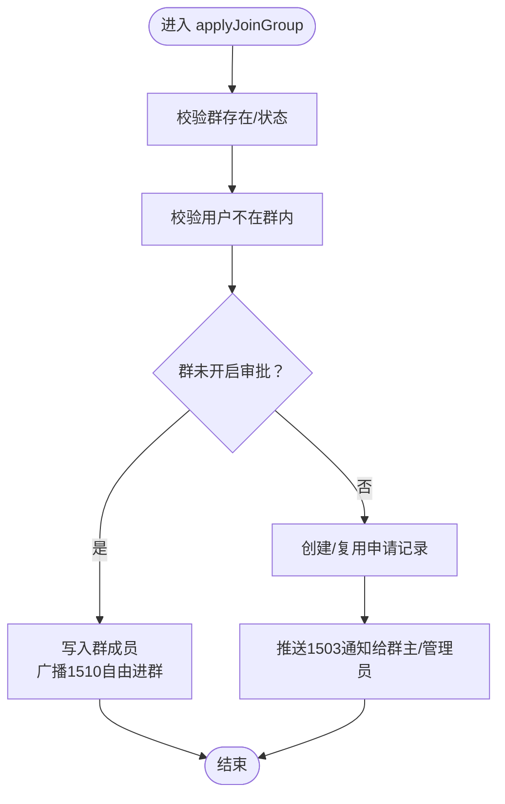
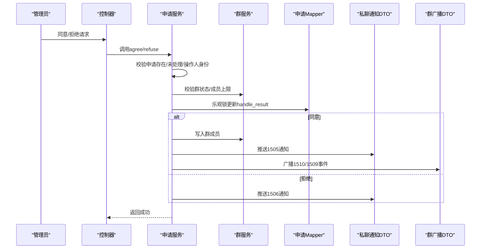
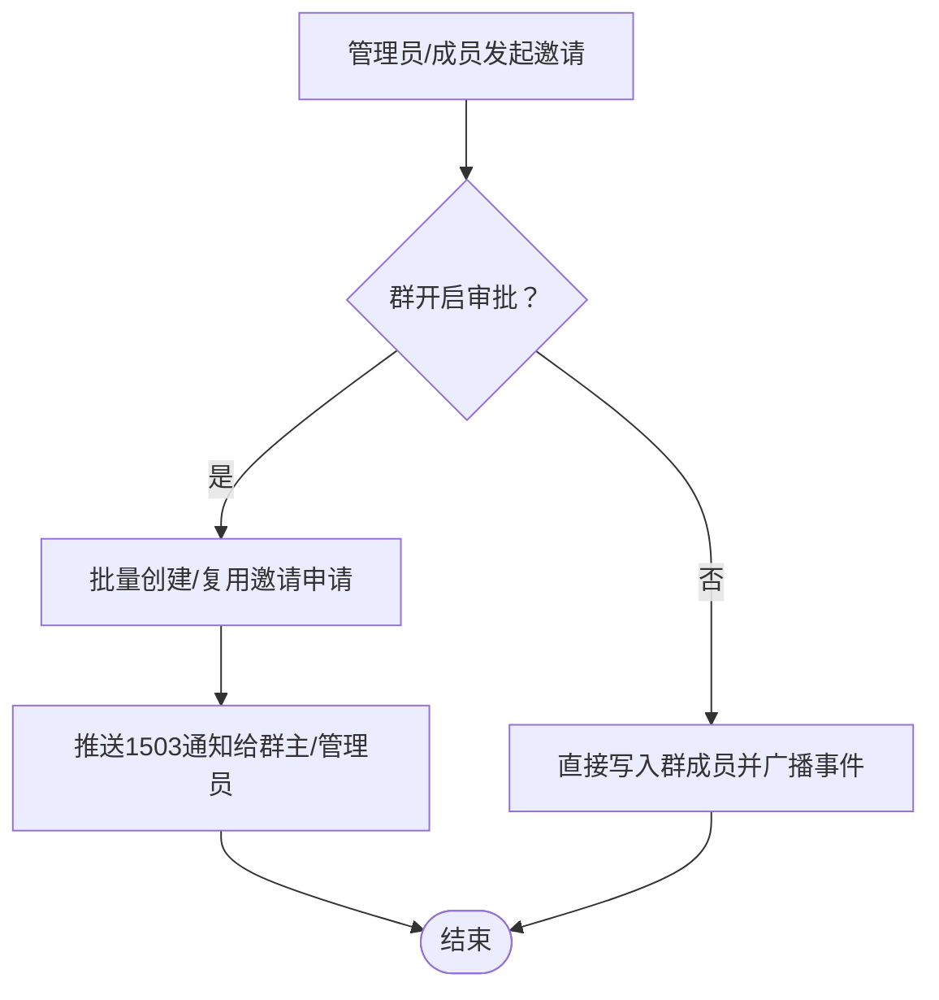
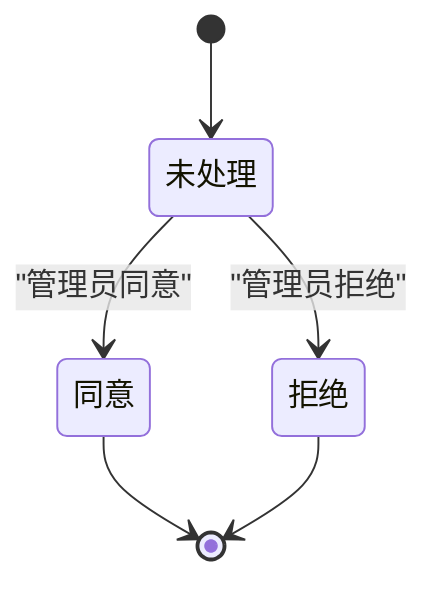
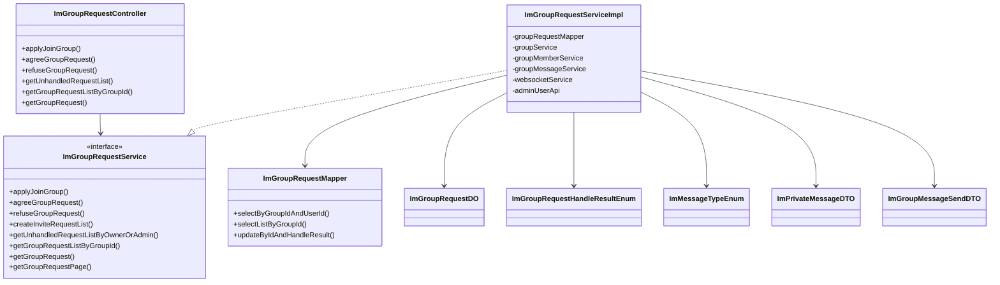

# 群组请求处理

<cite>
**本文档引用的文件**
- [ImGroupRequestServiceImpl.java](file://yudao-module-im/src/main/java/cn/iocoder/yudao/module/im/service/group/ImGroupRequestServiceImpl.java)
- [ImGroupRequestService.java](file://yudao-module-im/src/main/java/cn/iocoder/yudao/module/im/service/group/ImGroupRequestService.java)
- [ImGroupRequestController.java](file://yudao-module-im/src/main/java/cn/iocoder/yudao/module/im/controller/admin/group/ImGroupRequestController.java)
- [ImGroupRequestDO.java](file://yudao-module-im/src/main/java/cn/iocoder/yudao/module/im/dal/dataobject/group/ImGroupRequestDO.java)
- [ImGroupRequestMapper.java](file://yudao-module-im/src/main/java/cn/iocoder/yudao/module/im/dal/mysql/group/ImGroupRequestMapper.java)
- [ImGroupRequestHandleResultEnum.java](file://yudao-module-im/src/main/java/cn/iocoder/yudao/module/im/enums/group/ImGroupRequestHandleResultEnum.java)
- [ImMessageTypeEnum.java](file://yudao-module-im/src/main/java/cn/iocoder/yudao/module/im/enums/message/ImMessageTypeEnum.java)
- [ImGroupMessageSendDTO.java](file://yudao-module-im/src/main/java/cn/iocoder/yudao/module/im/service/message/dto/ImGroupMessageSendDTO.java)
- [ImPrivateMessageDTO.java](file://yudao-module-im/src/main/java/cn/iocoder/yudao/module/im/service/websocket/dto/ImPrivateMessageDTO.java)
- [ImGroupServiceImpl.java](file://yudao-module-im/src/main/java/cn/iocoder/yudao/module/im/service/group/ImGroupServiceImpl.java)
- [create_tables.sql](file://yudao-module-im/src/test/resources/sql/create_tables.sql)
- [GroupRequestListDialog.vue](file://yudao-ui/yudao-ui-admin-vue3/src/views/im/home/components/group/GroupRequestListDialog.vue)
- [index.ts（群组请求API）](file://yudao-ui/yudao-ui-admin-vue3/src/api/im/group/request/index.ts)
- [BaseDO.java](file://yudao-framework/yudao-spring-boot-starter-mybatis/src/main/java/cn/iocoder/yudao/framework/mybatis/core/dataobject/BaseDO.java)
</cite>

## 目录
1. [简介](#简介)
2. [项目结构](#项目结构)
3. [核心组件](#核心组件)
4. [架构总览](#架构总览)
5. [详细组件分析](#详细组件分析)
6. [依赖关系分析](#依赖关系分析)
7. [性能考虑](#性能考虑)
8. [故障排查指南](#故障排查指南)
9. [结论](#结论)
10. [附录](#附录)

## 简介
本文件面向“群组请求处理”功能，围绕入群申请流程、邀请处理机制、请求状态管理、通知机制、查询能力、请求限制与统计分析进行系统化技术说明。文档以代码为依据，结合前后端交互与数据库结构，帮助开发者快速理解并实现相关能力。

## 项目结构
群组请求处理功能主要分布在 IM 模块的服务层、控制层、数据访问层以及前端界面层，核心文件如下：
- 控制器层：负责对外暴露 REST 接口，如申请、同意、拒绝、查询等
- 服务层：实现业务逻辑，包括申请创建/复用、审批流程、通知推送、幂等处理等
- 数据访问层：提供 Mapper 接口，支撑申请记录的增删改查与乐观锁更新
- 数据模型：定义申请记录的数据结构及状态枚举
- 前端界面：提供“进群申请”列表弹窗、按钮交互与状态展示

图表来源
- [ImGroupRequestController.java:58-119](file://yudao-module-im/src/main/java/cn/iocoder/yudao/module/im/controller/admin/group/ImGroupRequestController.java#L58-L119)
- [ImGroupRequestServiceImpl.java:72-108](file://yudao-module-im/src/main/java/cn/iocoder/yudao/module/im/service/group/ImGroupRequestServiceImpl.java#L72-L108)
- [ImGroupRequestMapper.java:24-49](file://yudao-module-im/src/main/java/cn/iocoder/yudao/module/im/dal/mysql/group/ImGroupRequestMapper.java#L24-L49)
- [ImGroupRequestDO.java:25-91](file://yudao-module-im/src/main/java/cn/iocoder/yudao/module/im/dal/dataobject/group/ImGroupRequestDO.java#L25-L91)
- [ImGroupRequestHandleResultEnum.java:17-48](file://yudao-module-im/src/main/java/cn/iocoder/yudao/module/im/enums/group/ImGroupRequestHandleResultEnum.java#L17-L48)
- [ImMessageTypeEnum.java:193-363](file://yudao-module-im/src/main/java/cn/iocoder/yudao/module/im/enums/message/ImMessageTypeEnum.java#L193-L363)
- [ImPrivateMessageDTO.java:126-149](file://yudao-module-im/src/main/java/cn/iocoder/yudao/module/im/service/websocket/dto/ImPrivateMessageDTO.java#L126-L149)
- [ImGroupMessageSendDTO.java:56-73](file://yudao-module-im/src/main/java/cn/iocoder/yudao/module/im/service/message/dto/ImGroupMessageSendDTO.java#L56-L73)

章节来源
- [ImGroupRequestController.java:1-115](file://yudao-module-im/src/main/java/cn/iocoder/yudao/module/im/controller/admin/group/ImGroupRequestController.java#L1-L115)
- [ImGroupRequestServiceImpl.java:48-413](file://yudao-module-im/src/main/java/cn/iocoder/yudao/module/im/service/group/ImGroupRequestServiceImpl.java#L48-L413)
- [ImGroupRequestMapper.java:24-49](file://yudao-module-im/src/main/java/cn/iocoder/yudao/module/im/dal/mysql/group/ImGroupRequestMapper.java#L24-L49)
- [ImGroupRequestDO.java:25-91](file://yudao-module-im/src/main/java/cn/iocoder/yudao/module/im/dal/dataobject/group/ImGroupRequestDO.java#L25-L91)

## 核心组件
- 申请控制器：提供申请提交、同意/拒绝、未处理列表、按群查询、单条查询等接口
- 申请服务：实现申请创建/复用、审批处理、通知推送、幂等校验、乐观锁更新
- 数据模型：申请记录实体，包含群编号、申请人/被邀请人、邀请人、申请理由、加入来源、处理结果、处理人、处理时间等
- 状态枚举：未处理、同意、拒绝三种状态
- 消息类型枚举：1503（收到新申请）、1505（申请被同意）、1506（申请被拒绝）等
- 私聊通知 DTO：用于将群申请相关通知通过私聊通道推送给相关人员
- 群广播 DTO：用于在群内广播成员入群/邀请等事件

章节来源
- [ImGroupRequestController.java:58-119](file://yudao-module-im/src/main/java/cn/iocoder/yudao/module/im/controller/admin/group/ImGroupRequestController.java#L58-L119)
- [ImGroupRequestService.java:17-92](file://yudao-module-im/src/main/java/cn/iocoder/yudao/module/im/service/group/ImGroupRequestService.java#L17-L92)
- [ImGroupRequestServiceImpl.java:72-183](file://yudao-module-im/src/main/java/cn/iocoder/yudao/module/im/service/group/ImGroupRequestServiceImpl.java#L72-L183)
- [ImGroupRequestDO.java:25-91](file://yudao-module-im/src/main/java/cn/iocoder/yudao/module/im/dal/dataobject/group/ImGroupRequestDO.java#L25-L91)
- [ImGroupRequestHandleResultEnum.java:17-48](file://yudao-module-im/src/main/java/cn/iocoder/yudao/module/im/enums/group/ImGroupRequestHandleResultEnum.java#L17-L48)
- [ImMessageTypeEnum.java:193-363](file://yudao-module-im/src/main/java/cn/iocoder/yudao/module/im/enums/message/ImMessageTypeEnum.java#L193-L363)
- [ImPrivateMessageDTO.java:126-149](file://yudao-module-im/src/main/java/cn/iocoder/yudao/module/im/service/websocket/dto/ImPrivateMessageDTO.java#L126-L149)
- [ImGroupMessageSendDTO.java:56-73](file://yudao-module-im/src/main/java/cn/iocoder/yudao/module/im/service/message/dto/ImGroupMessageSendDTO.java#L56-L73)

## 架构总览
群组请求处理采用“控制器-服务-数据访问-消息”的分层架构。前端通过 API 调用控制器，控制器委托服务层执行业务逻辑；服务层通过数据访问层持久化数据，并通过消息通道向相关用户推送通知；群广播消息用于全员可见的入群/邀请事件。

图表来源
- [ImGroupRequestController.java:58-119](file://yudao-module-im/src/main/java/cn/iocoder/yudao/module/im/controller/admin/group/ImGroupRequestController.java#L58-L119)
- [ImGroupRequestServiceImpl.java:72-183](file://yudao-module-im/src/main/java/cn/iocoder/yudao/module/im/service/group/ImGroupRequestServiceImpl.java#L72-L183)
- [ImGroupRequestMapper.java:46-49](file://yudao-module-im/src/main/java/cn/iocoder/yudao/module/im/dal/mysql/group/ImGroupRequestMapper.java#L46-L49)
- [ImPrivateMessageDTO.java:126-149](file://yudao-module-im/src/main/java/cn/iocoder/yudao/module/im/service/websocket/dto/ImPrivateMessageDTO.java#L126-L149)
- [ImGroupMessageSendDTO.java:56-73](file://yudao-module-im/src/main/java/cn/iocoder/yudao/module/im/service/message/dto/ImGroupMessageSendDTO.java#L56-L73)

## 详细组件分析

### 申请提交流程（用户主动申请）
- 校验群存在且未封禁/未解散，校验用户不在群内
- 若群未开启审批：直接写入群成员并广播“自由进群”事件，不落申请记录
- 若群开启审批：创建或复用一条主动申请记录，携带申请理由与加入来源，推送1503通知给群主与全部管理员

图表来源
- [ImGroupRequestServiceImpl.java:72-108](file://yudao-module-im/src/main/java/cn/iocoder/yudao/module/im/service/group/ImGroupRequestServiceImpl.java#L72-L108)
- [ImGroupServiceImpl.java:514-541](file://yudao-module-im/src/main/java/cn/iocoder/yudao/module/im/service/group/ImGroupServiceImpl.java#L514-L541)
- [ImPrivateMessageDTO.java:126-149](file://yudao-module-im/src/main/java/cn/iocoder/yudao/module/im/service/websocket/dto/ImPrivateMessageDTO.java#L126-L149)

章节来源
- [ImGroupRequestServiceImpl.java:72-108](file://yudao-module-im/src/main/java/cn/iocoder/yudao/module/im/service/group/ImGroupRequestServiceImpl.java#L72-L108)
- [ImGroupServiceImpl.java:514-541](file://yudao-module-im/src/main/java/cn/iocoder/yudao/module/im/service/group/ImGroupServiceImpl.java#L514-L541)

### 审核处理流程（管理员同意/拒绝）
- 同意：校验申请存在且未处理，操作人必须为群主或管理员；再次校验群状态与成员上限；乐观锁更新状态为“同意”，写入群成员，推送1505通知给申请人与群主/管理员，并广播1510（主动申请）或1509（邀请入群）事件
- 拒绝：校验同上，乐观锁更新状态为“拒绝”，推送1506通知给申请人与群主/管理员

图表来源
- [ImGroupRequestController.java:65-82](file://yudao-module-im/src/main/java/cn/iocoder/yudao/module/im/controller/admin/group/ImGroupRequestController.java#L65-L82)
- [ImGroupRequestServiceImpl.java:110-183](file://yudao-module-im/src/main/java/cn/iocoder/yudao/module/im/service/group/ImGroupRequestServiceImpl.java#L110-L183)
- [ImGroupRequestMapper.java:46-49](file://yudao-module-im/src/main/java/cn/iocoder/yudao/module/im/dal/mysql/group/ImGroupRequestMapper.java#L46-L49)
- [ImPrivateMessageDTO.java:126-149](file://yudao-module-im/src/main/java/cn/iocoder/yudao/module/im/service/websocket/dto/ImPrivateMessageDTO.java#L126-L149)
- [ImGroupMessageSendDTO.java:56-73](file://yudao-module-im/src/main/java/cn/iocoder/yudao/module/im/service/message/dto/ImGroupMessageSendDTO.java#L56-L73)

章节来源
- [ImGroupRequestController.java:65-82](file://yudao-module-im/src/main/java/cn/iocoder/yudao/module/im/controller/admin/group/ImGroupRequestController.java#L65-L82)
- [ImGroupRequestServiceImpl.java:110-183](file://yudao-module-im/src/main/java/cn/iocoder/yudao/module/im/service/group/ImGroupRequestServiceImpl.java#L110-L183)

### 邀请处理机制
- 管理员邀请：邀请创建审批申请，逐条创建或复用邀请申请，推送1503通知给群主与全部管理员
- 成员邀请：当群开启审批时，成员邀请同样创建审批申请，后续审批通过后写入群成员并广播相应事件
- 系统邀请：通过服务层批量创建邀请申请，确保邀请来源与邀请人信息正确写入

图表来源
- [ImGroupRequestServiceImpl.java:185-208](file://yudao-module-im/src/main/java/cn/iocoder/yudao/module/im/service/group/ImGroupRequestServiceImpl.java#L185-L208)
- [ImPrivateMessageDTO.java:126-149](file://yudao-module-im/src/main/java/cn/iocoder/yudao/module/im/service/websocket/dto/ImPrivateMessageDTO.java#L126-L149)

章节来源
- [ImGroupRequestServiceImpl.java:185-208](file://yudao-module-im/src/main/java/cn/iocoder/yudao/module/im/service/group/ImGroupRequestServiceImpl.java#L185-L208)

### 请求状态管理
- 状态枚举：未处理（0）、同意（1）、拒绝（2）
- 幂等与乐观锁：同意/拒绝均使用“按期望状态更新”的乐观锁策略，避免并发导致的重复处理
- 幂等入群：若审批通过后用户已在群内，再次处理时直接抛错，避免重复广播

图表来源
- [ImGroupRequestHandleResultEnum.java:17-48](file://yudao-module-im/src/main/java/cn/iocoder/yudao/module/im/enums/group/ImGroupRequestHandleResultEnum.java#L17-L48)
- [ImGroupRequestServiceImpl.java:125-136](file://yudao-module-im/src/main/java/cn/iocoder/yudao/module/im/service/group/ImGroupRequestServiceImpl.java#L125-L136)

章节来源
- [ImGroupRequestHandleResultEnum.java:17-48](file://yudao-module-im/src/main/java/cn/iocoder/yudao/module/im/enums/group/ImGroupRequestHandleResultEnum.java#L17-L48)
- [ImGroupRequestServiceImpl.java:125-136](file://yudao-module-im/src/main/java/cn/iocoder/yudao/module/im/service/group/ImGroupRequestServiceImpl.java#L125-L136)

### 通知机制
- 1503：收到新的入群申请（定向私聊推送给群主与全部管理员）
- 1505：入群申请被同意（定向私聊推送给申请人、群主与全部管理员）
- 1506：入群申请被拒绝（定向私聊推送给申请人、群主与全部管理员）
- 1510：自由进群（全员广播）
- 1509：成员加入（全员广播）

章节来源
- [ImMessageTypeEnum.java:193-363](file://yudao-module-im/src/main/java/cn/iocoder/yudao/module/im/enums/message/ImMessageTypeEnum.java#L193-L363)
- [ImPrivateMessageDTO.java:126-149](file://yudao-module-im/src/main/java/cn/iocoder/yudao/module/im/service/websocket/dto/ImPrivateMessageDTO.java#L126-L149)
- [ImGroupMessageSendDTO.java:56-73](file://yudao-module-im/src/main/java/cn/iocoder/yudao/module/im/service/message/dto/ImGroupMessageSendDTO.java#L56-L73)

### 请求查询功能
- 未处理列表：按当前用户作为群主或管理员，一次性拉取其管理的所有群的未处理申请
- 指定群列表：仅群主或管理员可查询该群全部申请（含已处理），按 id 倒序展示
- 单条查询：按 id 查询申请记录，带越权过滤

章节来源
- [ImGroupRequestController.java:84-119](file://yudao-module-im/src/main/java/cn/iocoder/yudao/module/im/controller/admin/group/ImGroupRequestController.java#L84-L119)
- [ImGroupRequestServiceImpl.java:210-240](file://yudao-module-im/src/main/java/cn/iocoder/yudao/module/im/service/group/ImGroupRequestServiceImpl.java#L210-L240)

### 请求限制机制
- 申请频率限制：未在代码中发现显式的申请频率限制策略
- 重复申请处理：通过唯一约束（群+用户）与“创建/复用”逻辑，避免重复记录；并发插入冲突时回查并复用旧记录
- 超时自动处理：未在代码中发现针对“超时自动处理”的实现

章节来源
- [ImGroupRequestServiceImpl.java:255-278](file://yudao-module-im/src/main/java/cn/iocoder/yudao/module/im/service/group/ImGroupRequestServiceImpl.java#L255-L278)
- [create_tables.sql:131-150](file://yudao-module-im/src/test/resources/sql/create_tables.sql#L131-L150)

### 请求统计功能
- 申请总数统计：可通过分页查询申请记录并统计总量
- 通过率统计：可在管理后台按时间段统计“同意/拒绝”数量，计算通过率
- 热门群组分析：可统计各群申请数量，识别热门群组

章节来源
- [ImGroupRequestController.java:48-73](file://yudao-module-im/src/main/java/cn/iocoder/yudao/module/im/controller/admin/group/ImGroupRequestController.java#L48-L73)
- [ImGroupRequestServiceImpl.java:242-245](file://yudao-module-im/src/main/java/cn/iocoder/yudao/module/im/service/group/ImGroupRequestServiceImpl.java#L242-L245)

## 依赖关系分析
- 控制器依赖服务接口，服务实现依赖群服务、成员服务、消息服务与数据访问层
- 服务层通过枚举与消息类型常量保证通知与广播的一致性
- 数据模型与数据库表结构保持一致，包含唯一约束与状态字段

图表来源
- [ImGroupRequestController.java:1-115](file://yudao-module-im/src/main/java/cn/iocoder/yudao/module/im/controller/admin/group/ImGroupRequestController.java#L1-L115)
- [ImGroupRequestService.java:17-92](file://yudao-module-im/src/main/java/cn/iocoder/yudao/module/im/service/group/ImGroupRequestService.java#L17-L92)
- [ImGroupRequestServiceImpl.java:48-413](file://yudao-module-im/src/main/java/cn/iocoder/yudao/module/im/service/group/ImGroupRequestServiceImpl.java#L48-L413)
- [ImGroupRequestMapper.java:24-49](file://yudao-module-im/src/main/java/cn/iocoder/yudao/module/im/dal/mysql/group/ImGroupRequestMapper.java#L24-L49)
- [ImGroupRequestDO.java:25-91](file://yudao-module-im/src/main/java/cn/iocoder/yudao/module/im/dal/dataobject/group/ImGroupRequestDO.java#L25-L91)
- [ImGroupRequestHandleResultEnum.java:17-48](file://yudao-module-im/src/main/java/cn/iocoder/yudao/module/im/enums/group/ImGroupRequestHandleResultEnum.java#L17-L48)
- [ImMessageTypeEnum.java:193-363](file://yudao-module-im/src/main/java/cn/iocoder/yudao/module/im/enums/message/ImMessageTypeEnum.java#L193-L363)
- [ImPrivateMessageDTO.java:126-149](file://yudao-module-im/src/main/java/cn/iocoder/yudao/module/im/service/websocket/dto/ImPrivateMessageDTO.java#L126-L149)
- [ImGroupMessageSendDTO.java:56-73](file://yudao-module-im/src/main/java/cn/iocoder/yudao/module/im/service/message/dto/ImGroupMessageSendDTO.java#L56-L73)

章节来源
- [ImGroupRequestController.java:1-115](file://yudao-module-im/src/main/java/cn/iocoder/yudao/module/im/controller/admin/group/ImGroupRequestController.java#L1-L115)
- [ImGroupRequestService.java:17-92](file://yudao-module-im/src/main/java/cn/iocoder/yudao/module/im/service/group/ImGroupRequestService.java#L17-L92)
- [ImGroupRequestServiceImpl.java:48-413](file://yudao-module-im/src/main/java/cn/iocoder/yudao/module/im/service/group/ImGroupRequestServiceImpl.java#L48-L413)

## 性能考虑
- 乐观锁更新：同意/拒绝使用“期望状态+ID”更新，减少不必要的回滚与重试
- 批量邀请：批量创建/复用邀请申请，降低多次往返与重复写入
- 通知推送：定向私聊推送，避免广播风暴；群广播仅在必要时触发
- 查询优化：按群主/管理员角色聚合未处理列表，减少跨群扫描

## 故障排查指南
- 重复申请：若出现唯一键冲突，服务层会回查并复用旧记录；检查唯一约束与幂等逻辑
- 并发处理：若二次处理失败，通常因乐观锁更新返回 0；检查并发场景与重试策略
- 越权访问：单条查询接口对非申请人/邀请人/群主/管理员返回空；检查鉴权逻辑
- 成员上限：同意前会校验成员上限，超限时拒绝；检查群配置与成员数量

章节来源
- [ImGroupRequestServiceImpl.java:255-278](file://yudao-module-im/src/main/java/cn/iocoder/yudao/module/im/service/group/ImGroupRequestServiceImpl.java#L255-L278)
- [ImGroupRequestServiceImpl.java:215-235](file://yudao-module-im/src/main/java/cn/iocoder/yudao/module/im/service/group/ImGroupRequestServiceImpl.java#L215-L235)
- [ImGroupRequestController.java:100-119](file://yudao-module-im/src/main/java/cn/iocoder/yudao/module/im/controller/admin/group/ImGroupRequestController.java#L100-L119)
- [ImGroupServiceImpl.java:531-541](file://yudao-module-im/src/main/java/cn/iocoder/yudao/module/im/service/group/ImGroupServiceImpl.java#L531-L541)

## 结论
群组请求处理功能通过清晰的流程划分与严格的幂等/乐观锁策略，实现了从申请、审批到通知与广播的完整闭环。前端提供直观的弹窗与交互，后端通过服务层封装复杂业务逻辑，具备良好的扩展性与可维护性。建议在后续版本中补充申请频率限制与超时自动处理机制，进一步完善风控体系。

## 附录
- 前端交互要点：弹窗打开时根据是否传入群编号决定数据源（单群或全局未处理列表），处理完成后通过 store 与本地状态同步
- 数据库结构：申请表包含唯一约束（群+用户），状态字段支持未处理/同意/拒绝三态

章节来源
- [GroupRequestListDialog.vue:169-202](file://yudao-ui/yudao-ui-admin-vue3/src/views/im/home/components/group/GroupRequestListDialog.vue#L169-L202)
- [index.ts（群组请求API）:37-71](file://yudao-ui/yudao-ui-admin-vue3/src/api/im/group/request/index.ts#L37-L71)
- [create_tables.sql:131-150](file://yudao-module-im/src/test/resources/sql/create_tables.sql#L131-L150)
- [BaseDO.java:22-66](file://yudao-framework/yudao-spring-boot-starter-mybatis/src/main/java/cn/iocoder/yudao/framework/mybatis/core/dataobject/BaseDO.java#L22-L66)