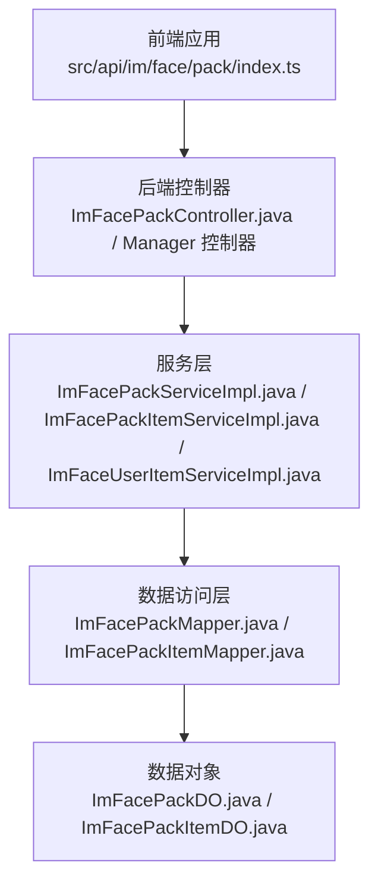
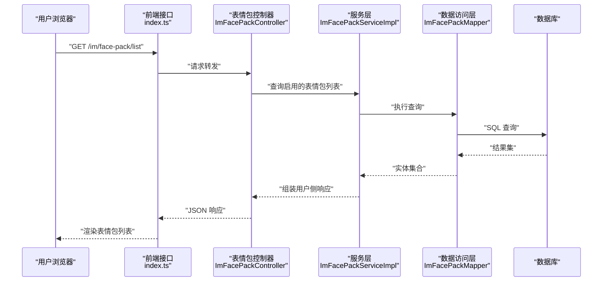
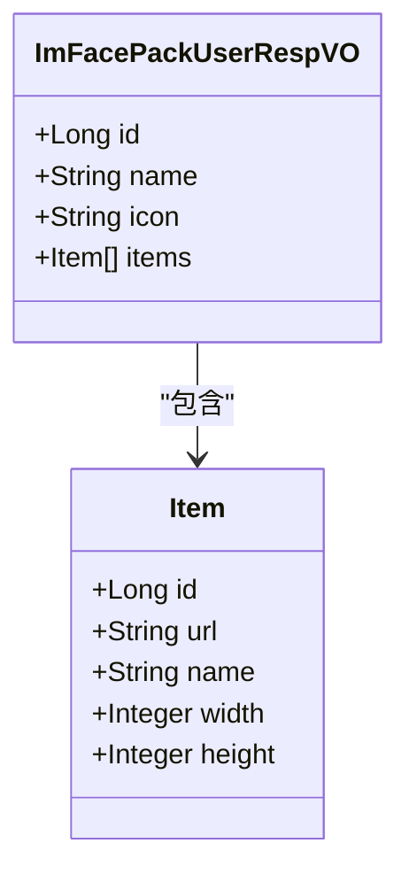
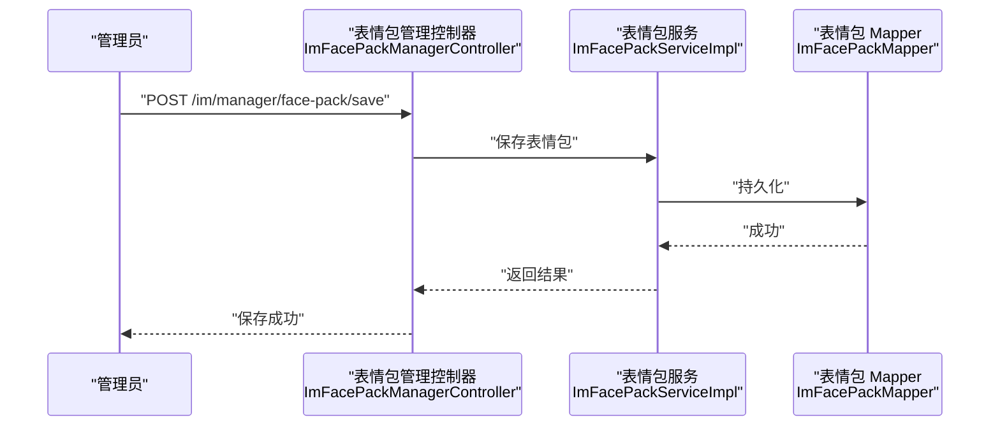
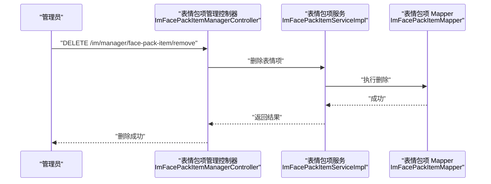
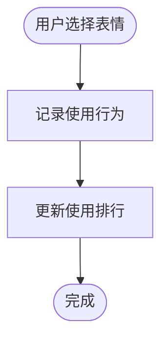
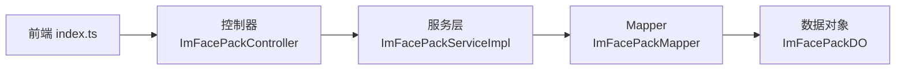
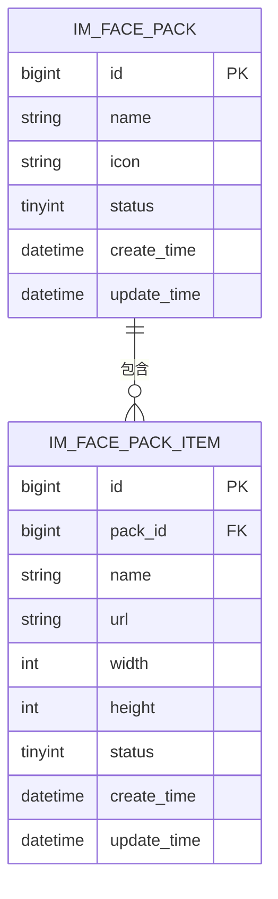

# 表情包系统

<cite>
**本文引用的文件**
- [ImFacePackController.java](file://yudao-module-im/src/main/java/cn/iocoder/yudao/module/im/controller/admin/face/ImFacePackController.java)
- [ImFacePackManagerController.java](file://yudao-module-im/src/main/java/cn/iocoder/yudao/module/im/controller/admin/manager/face/ImFacePackManagerController.java)
- [ImFacePackItemManagerController.java](file://yudao-module-im/src/main/java/cn/iocoder/yudao/module/im/controller/admin/manager/face/ImFacePackItemManagerController.java)
- [ImFacePackUserRespVO.java](file://yudao-module-im/src/main/java/cn/iocoder/yudao/module/im/controller/admin/face/vo/pack/ImFacePackUserRespVO.java)
- [index.ts](file://yudao-ui/yudao-ui-admin-vue3/src/api/im/face/pack/index.ts)
- [ImFacePackServiceImpl.java](file://yudao-module-im/src/main/java/cn/iocoder/yudao/module/im/service/face/ImFacePackServiceImpl.java)
- [ImFacePackItemServiceImpl.java](file://yudao-module-im/src/main/java/cn/iocoder/yudao/module/im/service/face/ImFacePackItemServiceImpl.java)
- [ImFacePackDO.java](file://yudao-module-im/src/main/java/cn/iocoder/yudao/module/im/dal/dataobject/face/ImFacePackDO.java)
- [ImFacePackItemDO.java](file://yudao-module-im/src/main/java/cn/iocoder/yudao/module/im/dal/dataobject/face/ImFacePackItemDO.java)
- [ImFacePackMapper.java](file://yudao-module-im/src/main/java/cn/iocoder/yudao/module/im/dal/mysql/face/ImFacePackMapper.java)
- [ImFacePackItemMapper.java](file://yudao-module-im/src/main/java/cn/iocoder/yudao/module/im/dal/mysql/face/ImFacePackItemMapper.java)
- [ImFaceUserItemServiceImpl.java](file://yudao-module-im/src/main/java/cn/iocoder/yudao/module/im/service/face/ImFaceUserItemServiceImpl.java)
- [ImFaceUserItemController.java](file://yudao-module-im/src/main/java/cn/iocoder/yudao/module/im/controller/admin/face/ImFaceUserItemController.java)
</cite>

## 目录
1. [简介](#简介)
2. [项目结构](#项目结构)
3. [核心组件](#核心组件)
4. [架构总览](#架构总览)
5. [详细组件分析](#详细组件分析)
6. [依赖关系分析](#依赖关系分析)
7. [性能考虑](#性能考虑)
8. [故障排查指南](#故障排查指南)
9. [结论](#结论)
10. [附录](#附录)

## 简介
本技术文档围绕即时通讯模块中的“表情包系统”展开，基于现有代码实现，系统性梳理表情包的管理、项目管理、用户侧能力、商店化能力、搜索与推荐、导入导出、审核与合规、以及缓存策略等主题。文档以“用户可见的表情包列表 + 后台管理的表情包与表情项维护”为核心线索，结合后端控制器、服务层、数据访问层与前端接口定义，形成从架构到实现的完整说明。

## 项目结构
表情包系统位于即时通讯模块中，采用典型的分层架构：前端通过 Axios 请求调用后端接口；后端控制器负责请求映射与参数封装；服务层负责业务逻辑编排；数据访问层负责持久化；数据对象承载数据库表结构。

图表来源
- [index.ts:1-23](file://yudao-ui/yudao-ui-admin-vue3/src/api/im/face/pack/index.ts#L1-L23)
- [ImFacePackController.java:1-30](file://yudao-module-im/src/main/java/cn/iocoder/yudao/module/im/controller/admin/face/ImFacePackController.java#L1-L30)
- [ImFacePackManagerController.java:1-32](file://yudao-module-im/src/main/java/cn/iocoder/yudao/module/im/controller/admin/manager/face/ImFacePackManagerController.java#L1-L32)
- [ImFacePackItemManagerController.java:1-32](file://yudao-module-im/src/main/java/cn/iocoder/yudao/module/im/controller/admin/manager/face/ImFacePackItemManagerController.java#L1-L32)
- [ImFacePackServiceImpl.java:1-32](file://yudao-module-im/src/main/java/cn/iocoder/yudao/module/im/service/face/ImFacePackServiceImpl.java#L1-L32)
- [ImFacePackItemServiceImpl.java:1-36](file://yudao-module-im/src/main/java/cn/iocoder/yudao/module/im/service/face/ImFacePackItemServiceImpl.java#L1-L36)
- [ImFacePackMapper.java](file://yudao-module-im/src/main/java/cn/iocoder/yudao/module/im/dal/mysql/face/ImFacePackMapper.java)
- [ImFacePackItemMapper.java](file://yudao-module-im/src/main/java/cn/iocoder/yudao/module/im/dal/mysql/face/ImFacePackItemMapper.java)
- [ImFacePackDO.java](file://yudao-module-im/src/main/java/cn/iocoder/yudao/module/im/dal/dataobject/face/ImFacePackDO.java)
- [ImFacePackItemDO.java](file://yudao-module-im/src/main/java/cn/iocoder/yudao/module/im/dal/dataobject/face/ImFacePackItemDO.java)

章节来源
- [ImFacePackController.java:1-30](file://yudao-module-im/src/main/java/cn/iocoder/yudao/module/im/controller/admin/face/ImFacePackController.java#L1-L30)
- [ImFacePackManagerController.java:1-32](file://yudao-module-im/src/main/java/cn/iocoder/yudao/module/im/controller/admin/manager/face/ImFacePackManagerController.java#L1-L32)
- [ImFacePackItemManagerController.java:1-32](file://yudao-module-im/src/main/java/cn/iocoder/yudao/module/im/controller/admin/manager/face/ImFacePackItemManagerController.java#L1-L32)
- [index.ts:1-23](file://yudao-ui/yudao-ui-admin-vue3/src/api/im/face/pack/index.ts#L1-L23)

## 核心组件
- 表情包控制器（用户侧）：提供拉取启用的表情包列表及嵌套表情项的能力，返回用户侧响应模型。
- 表情包管理控制器（后台）：提供表情包的分页查询、保存、删除等管理能力。
- 表情包项管理控制器（后台）：提供表情项的分页查询、保存、删除等管理能力。
- 服务层：实现业务逻辑，包括表情包与表情项的增删改查、状态控制、分页查询等。
- 数据访问层：基于 MyBatis 的 Mapper，提供对表情包与表情项的数据持久化操作。
- 数据对象：映射数据库表结构，承载字段与约束信息。
- 前端接口：定义用户侧表情包列表的请求与响应类型。

章节来源
- [ImFacePackController.java:1-30](file://yudao-module-im/src/main/java/cn/iocoder/yudao/module/im/controller/admin/face/ImFacePackController.java#L1-L30)
- [ImFacePackManagerController.java:1-32](file://yudao-module-im/src/main/java/cn/iocoder/yudao/module/im/controller/admin/manager/face/ImFacePackManagerController.java#L1-L32)
- [ImFacePackItemManagerController.java:1-32](file://yudao-module-im/src/main/java/cn/iocoder/yudao/module/im/controller/admin/manager/face/ImFacePackItemManagerController.java#L1-L32)
- [ImFacePackServiceImpl.java:1-32](file://yudao-module-im/src/main/java/cn/iocoder/yudao/module/im/service/face/ImFacePackServiceImpl.java#L1-L32)
- [ImFacePackItemServiceImpl.java:1-36](file://yudao-module-im/src/main/java/cn/iocoder/yudao/module/im/service/face/ImFacePackItemServiceImpl.java#L1-L36)
- [ImFacePackDO.java](file://yudao-module-im/src/main/java/cn/iocoder/yudao/module/im/dal/dataobject/face/ImFacePackDO.java)
- [ImFacePackItemDO.java](file://yudao-module-im/src/main/java/cn/iocoder/yudao/module/im/dal/dataobject/face/ImFacePackItemDO.java)
- [index.ts:1-23](file://yudao-ui/yudao-ui-admin-vue3/src/api/im/face/pack/index.ts#L1-L23)

## 架构总览
表情包系统遵循“前后端分离 + 分层架构”的设计思路：前端负责展示与交互，后端负责业务编排与数据持久化。用户侧通过统一的列表接口获取表情包及其表情项；后台通过管理接口进行表情包与表情项的维护。

图表来源
- [index.ts:20-23](file://yudao-ui/yudao-ui-admin-vue3/src/api/im/face/pack/index.ts#L20-L23)
- [ImFacePackController.java:26-30](file://yudao-module-im/src/main/java/cn/iocoder/yudao/module/im/controller/admin/face/ImFacePackController.java#L26-L30)
- [ImFacePackServiceImpl.java:1-32](file://yudao-module-im/src/main/java/cn/iocoder/yudao/module/im/service/face/ImFacePackServiceImpl.java#L1-L32)
- [ImFacePackMapper.java](file://yudao-module-im/src/main/java/cn/iocoder/yudao/module/im/dal/mysql/face/ImFacePackMapper.java)

## 详细组件分析

### 用户侧表情包列表（用户端）
- 功能概述：拉取所有启用的表情包，并返回每个表情包下的表情项列表，包含图片 URL、尺寸等信息。
- 关键接口：前端通过 GET /im/face-pack/list 获取列表。
- 返回模型：用户侧响应 VO 包含表情包 ID、名称、图标、表情项数组等字段。
- 业务要点：仅返回启用状态的表情包与表情项，避免无效资源下发。

图表来源
- [ImFacePackUserRespVO.java:10-46](file://yudao-module-im/src/main/java/cn/iocoder/yudao/module/im/controller/admin/face/vo/pack/ImFacePackUserRespVO.java#L10-L46)

章节来源
- [index.ts:20-23](file://yudao-ui/yudao-ui-admin-vue3/src/api/im/face/pack/index.ts#L20-L23)
- [ImFacePackUserRespVO.java:10-46](file://yudao-module-im/src/main/java/cn/iocoder/yudao/module/im/controller/admin/face/vo/pack/ImFacePackUserRespVO.java#L10-L46)

### 后台管理：表情包管理
- 功能概述：提供表情包的分页查询、新增/修改、删除等管理能力；支持按条件筛选与排序。
- 关键接口：后台管理控制器提供 RESTful 接口，对应表情包的 CRUD。
- 业务要点：删除前需确保表情包下无表情项，避免数据不一致；状态枚举用于启用/停用控制。

图表来源
- [ImFacePackManagerController.java:25-32](file://yudao-module-im/src/main/java/cn/iocoder/yudao/module/im/controller/admin/manager/face/ImFacePackManagerController.java#L25-L32)
- [ImFacePackServiceImpl.java:1-32](file://yudao-module-im/src/main/java/cn/iocoder/yudao/module/im/service/face/ImFacePackServiceImpl.java#L1-L32)
- [ImFacePackMapper.java](file://yudao-module-im/src/main/java/cn/iocoder/yudao/module/im/dal/mysql/face/ImFacePackMapper.java)

章节来源
- [ImFacePackManagerController.java:1-32](file://yudao-module-im/src/main/java/cn/iocoder/yudao/module/im/controller/admin/manager/face/ImFacePackManagerController.java#L1-L32)
- [ImFacePackServiceImpl.java:1-32](file://yudao-module-im/src/main/java/cn/iocoder/yudao/module/im/service/face/ImFacePackServiceImpl.java#L1-L32)

### 后台管理：表情包项管理
- 功能概述：提供表情项的分页查询、新增/修改、删除等管理能力；支持表情包与表情项的关联管理。
- 关键接口：后台管理控制器提供 RESTful 接口，对应表情项的 CRUD。
- 业务要点：表情项属于表情包，删除表情包前需先清理其下表情项；表情项包含图片 URL、尺寸等属性。

图表来源
- [ImFacePackItemManagerController.java:25-32](file://yudao-module-im/src/main/java/cn/iocoder/yudao/module/im/controller/admin/manager/face/ImFacePackItemManagerController.java#L25-L32)
- [ImFacePackItemServiceImpl.java:1-36](file://yudao-module-im/src/main/java/cn/iocoder/yudao/module/im/service/face/ImFacePackItemServiceImpl.java#L1-L36)
- [ImFacePackItemMapper.java](file://yudao-module-im/src/main/java/cn/iocoder/yudao/module/im/dal/mysql/face/ImFacePackItemMapper.java)

章节来源
- [ImFacePackItemManagerController.java:1-32](file://yudao-module-im/src/main/java/cn/iocoder/yudao/module/im/controller/admin/manager/face/ImFacePackItemManagerController.java#L1-L32)
- [ImFacePackItemServiceImpl.java:1-36](file://yudao-module-im/src/main/java/cn/iocoder/yudao/module/im/service/face/ImFacePackItemServiceImpl.java#L1-L36)

### 用户侧表情包使用记录（用户表情包管理）
- 功能概述：用户可使用表情包中的表情项，系统记录使用行为（如最近使用、收藏等），便于后续统计与推荐。
- 当前实现：后端未提供专门的“购买/收藏/使用记录”接口；用户侧控制器仅返回可用的表情包列表。
- 建议扩展：新增用户表情包使用记录服务与接口，支持收藏、最近使用、购买记录等。

图表来源
- [ImFacePackController.java:26-30](file://yudao-module-im/src/main/java/cn/iocoder/yudao/module/im/controller/admin/face/ImFacePackController.java#L26-L30)

章节来源
- [ImFacePackController.java:1-30](file://yudao-module-im/src/main/java/cn/iocoder/yudao/module/im/controller/admin/face/ImFacePackController.java#L1-L30)

### 表情包商店功能（概念性说明）
- 功能概述：当前仓库未提供表情包商店的独立模块或接口；表情包以“系统内置”形式提供给用户使用。
- 建议扩展：若需实现“商店化”，可在现有表情包基础上增加价格、销量、上架状态等字段，并提供购买流程与订单统计。

章节来源
- [ImFacePackDO.java](file://yudao-module-im/src/main/java/cn/iocoder/yudao/module/im/dal/dataobject/face/ImFacePackDO.java)
- [ImFacePackItemDO.java](file://yudao-module-im/src/main/java/cn/iocoder/yudao/module/im/dal/dataobject/face/ImFacePackItemDO.java)

### 表情包搜索与推荐机制（概念性说明）
- 功能概述：当前仓库未提供表情包搜索与推荐接口；用户侧仅能获取启用的表情包列表。
- 建议扩展：在服务层增加关键词匹配与热门排行逻辑，结合使用记录生成推荐列表。

章节来源
- [ImFacePackServiceImpl.java:1-32](file://yudao-module-im/src/main/java/cn/iocoder/yudao/module/im/service/face/ImFacePackServiceImpl.java#L1-L32)

### 表情包导入导出（概念性说明）
- 功能概述：当前仓库未提供表情包的导入导出接口。
- 建议扩展：提供批量导入（Excel/JSON）与导出（表情包清单、使用统计）能力，注意格式校验与幂等处理。

章节来源
- [ImFacePackManagerController.java:1-32](file://yudao-module-im/src/main/java/cn/iocoder/yudao/module/im/controller/admin/manager/face/ImFacePackManagerController.java#L1-L32)

### 表情包审核机制（概念性说明）
- 功能概述：当前仓库未提供表情包内容审核接口或流程。
- 建议扩展：在保存/更新表情包时增加合规校验（敏感词、违规内容检测），并提供审核状态与违规处理流程。

章节来源
- [ImFacePackServiceImpl.java:1-32](file://yudao-module-im/src/main/java/cn/iocoder/yudao/module/im/service/face/ImFacePackServiceImpl.java#L1-L32)

### 表情包缓存策略（概念性说明）
- 功能概述：当前仓库未提供表情包缓存相关配置或实现。
- 建议扩展：结合 CDN 与本地缓存（Redis）策略，热点表情包与表情包列表可进行缓存，降低数据库压力并提升加载速度。

章节来源
- [ImFacePackController.java:26-30](file://yudao-module-im/src/main/java/cn/iocoder/yudao/module/im/controller/admin/face/ImFacePackController.java#L26-L30)

## 依赖关系分析
- 控制器依赖服务层：控制器通过注解注入服务实例，编排业务逻辑。
- 服务层依赖数据访问层：服务层通过 Mapper 执行数据库操作。
- 数据访问层依赖数据对象：Mapper 操作 DO，映射数据库表结构。
- 前端依赖控制器：前端通过 Axios 请求后端接口，获取表情包列表。

图表来源
- [index.ts:20-23](file://yudao-ui/yudao-ui-admin-vue3/src/api/im/face/pack/index.ts#L20-L23)
- [ImFacePackController.java:26-30](file://yudao-module-im/src/main/java/cn/iocoder/yudao/module/im/controller/admin/face/ImFacePackController.java#L26-L30)
- [ImFacePackServiceImpl.java:1-32](file://yudao-module-im/src/main/java/cn/iocoder/yudao/module/im/service/face/ImFacePackServiceImpl.java#L1-L32)
- [ImFacePackMapper.java](file://yudao-module-im/src/main/java/cn/iocoder/yudao/module/im/dal/mysql/face/ImFacePackMapper.java)
- [ImFacePackDO.java](file://yudao-module-im/src/main/java/cn/iocoder/yudao/module/im/dal/dataobject/face/ImFacePackDO.java)

章节来源
- [ImFacePackController.java:1-30](file://yudao-module-im/src/main/java/cn/iocoder/yudao/module/im/controller/admin/face/ImFacePackController.java#L1-L30)
- [ImFacePackServiceImpl.java:1-32](file://yudao-module-im/src/main/java/cn/iocoder/yudao/module/im/service/face/ImFacePackServiceImpl.java#L1-L32)
- [ImFacePackMapper.java](file://yudao-module-im/src/main/java/cn/iocoder/yudao/module/im/dal/mysql/face/ImFacePackMapper.java)
- [ImFacePackDO.java](file://yudao-module-im/src/main/java/cn/iocoder/yudao/module/im/dal/dataobject/face/ImFacePackDO.java)

## 性能考虑
- 列表查询优化：对表情包与表情项的查询建议添加索引（如状态、创建时间），并限制单页数量，避免一次性返回过多数据。
- 缓存策略：热点表情包与表情包列表可引入本地缓存与 CDN 加速，减少数据库与网络开销。
- 图片尺寸：前端按需渲染，避免超大图片导致带宽浪费与页面卡顿。
- 并发控制：删除表情包前需加锁或事务，保证数据一致性。

## 故障排查指南
- 删除失败：当表情包仍有表情项时，服务层会抛出“存在子项”的异常，需先删除子项再删除父包。
- 记录不存在：当查询或删除的目标不存在时，服务层会抛出“不存在”的异常，需检查 ID 或数据状态。
- 前端请求失败：确认接口路径与参数是否正确，检查后端日志与网络连通性。

章节来源
- [ImFacePackServiceImpl.java:18-21](file://yudao-module-im/src/main/java/cn/iocoder/yudao/module/im/service/face/ImFacePackServiceImpl.java#L18-L21)
- [ImFacePackItemServiceImpl.java:19-21](file://yudao-module-im/src/main/java/cn/iocoder/yudao/module/im/service/face/ImFacePackItemServiceImpl.java#L19-L21)

## 结论
当前表情包系统已具备“用户侧表情包列表 + 后台表情包与表情项管理”的基础能力。为进一步完善系统，建议补充“商店化能力、购买/收藏/使用记录、搜索与推荐、导入导出、审核与合规、缓存策略”等模块，以满足更丰富的业务场景与用户体验需求。

## 附录
- 数据模型概览（基于现有 DO）

图表来源
- [ImFacePackDO.java](file://yudao-module-im/src/main/java/cn/iocoder/yudao/module/im/dal/dataobject/face/ImFacePackDO.java)
- [ImFacePackItemDO.java](file://yudao-module-im/src/main/java/cn/iocoder/yudao/module/im/dal/dataobject/face/ImFacePackItemDO.java)