# 频道素材管理

<cite>
**本文引用的文件**
- [index.ts](file://yudao-ui/yudao-ui-admin-vue3/src/api/im/manager/channel/material/index.ts)
- [ImChannelMaterialServiceImpl.java](file://yudao-module-im/src/main/java/cn/iocoder/yudao/module/im/service/channel/ImChannelMaterialServiceImpl.java)
- [ImChannelMaterialTypeEnum.java](file://yudao-module-im/src/main/java/cn/iocoder/yudao/module/im/enums/channel/ImChannelMaterialTypeEnum.java)
- [ImChannelMaterialDO.java](file://yudao-module-im/src/main/java/cn/iocoder/yudao/module/im/dal/dataobject/channel/ImChannelMaterialDO.java)
- [ImChannelMaterialMapper.java](file://yudao-module-im/src/main/java/cn/iocoder/yudao/module/im/dal/mysql/channel/ImChannelMaterialMapper.java)
- [ImChannelMaterialService.java](file://yudao-module-im/src/main/java/cn/iocoder/yudao/module/im/service/channel/ImChannelMaterialService.java)
- [channel/material/index.vue](file://yudao-ui/yudao-ui-admin-vue3/src/views/im/channel/material/index.vue)
- [channel/material/list.vue](file://yudao-ui/yudao-ui-admin-vue3/src/views/im/channel/material/list.vue)
- [channel/material/form.vue](file://yudao-ui/yudao-ui-admin-vue3/src/views/im/channel/material/form.vue)
- [channel/material/detail.vue](file://yudao-ui/yudao-ui-admin-vue3/src/views/im/channel/material/detail.vue)
- [channel/material/statistics.vue](file://yudao-ui/yudao-ui-admin-vue3/src/views/im/channel/material/statistics.vue)
- [channel/material/review.vue](file://yudao-ui/yudao-ui-admin-vue3/src/views/im/channel/material/review.vue)
- [channel/material/version.vue](file://yudao-ui/yudao-ui-admin-vue3/src/views/im/channel/material/version.vue)
- [channel/material/cache.vue](file://yudao-ui/yudao-ui-admin-vue3/src/views/im/channel/material/cache.vue)
- [channel/material/search.vue](file://yudao-ui/yudao-ui-admin-vue3/src/views/im/channel/material/search.vue)
- [channel/material/group.vue](file://yudao-ui/yudao-ui-admin-vue3/src/views/im/channel/material/group.vue)
- [channel/material/tag.vue](file://yudao-ui/yudao-ui-admin-vue3/src/views/im/channel/material/tag.vue)
- [channel/material/permission.vue](file://yudao-ui/yudao-ui-admin-vue3/src/views/im/channel/material/permission.vue)
- [channel/material/upload.vue](file://yudao-ui/yudao-ui-admin-vue3/src/views/im/channel/material/upload.vue)
- [channel/material/convert.vue](file://yudao-ui/yudao-ui-admin-vue3/src/views/im/channel/material/convert.vue)
- [channel/material/storage.vue](file://yudao-ui/yudao-ui-admin-vue3/src/views/im/channel/material/storage.vue)
- [channel/material/audit.vue](file://yudao-ui/yudao-ui-admin-vue3/src/views/im/channel/material/audit.vue)
- [channel/material/cache-cdn.vue](file://yudao-ui/yudao-ui-admin-vue3/src/views/im/channel/material/cache-cdn.vue)
- [channel/material/cache-preload.vue](file://yudao-ui/yudao-ui-admin-vue3/src/views/im/channel/material/cache-preload.vue)
- [channel/material/version-history.vue](file://yudao-ui/yudao-ui-admin-vue3/src/views/im/channel/material/version-history.vue)
- [channel/material/version-rollback.vue](file://yudao-ui/yudao-ui-admin-vue3/src/views/im/channel/material/version-rollback.vue)
</cite>

## 目录
1. [简介](#简介)
2. [项目结构](#项目结构)
3. [核心组件](#核心组件)
4. [架构总览](#架构总览)
5. [详细组件分析](#详细组件分析)
6. [依赖关系分析](#依赖关系分析)
7. [性能考虑](#性能考虑)
8. [故障排查指南](#故障排查指南)
9. [结论](#结论)
10. [附录](#附录)

## 简介
本文件面向“频道素材管理系统”的技术实现与使用，围绕频道内的素材类型（富文本、外链）、素材上传与格式转换、素材分组与标签、权限控制、检索（关键词、分类、时间范围）、使用统计、审核机制、缓存策略（CDN、预加载）、版本管理（历史与回滚）等方面进行系统化梳理。文档以仓库中已存在的频道素材模块为依据，结合前端页面与后端服务接口，形成从架构到实现细节的完整说明。

## 项目结构
频道素材管理位于即时通讯模块（IM）下，采用前后端分离架构：
- 前端：Vue3 + Element Plus，页面集中在 views/im/channel/material 下，涵盖列表、表单、详情、统计、审核、版本、缓存、搜索、分组、标签、权限、上传、转换、存储等功能视图。
- 后端：Spring Boot + MyBatis，服务层提供素材的增删改查、校验与业务逻辑，数据对象与 Mapper 负责持久化。

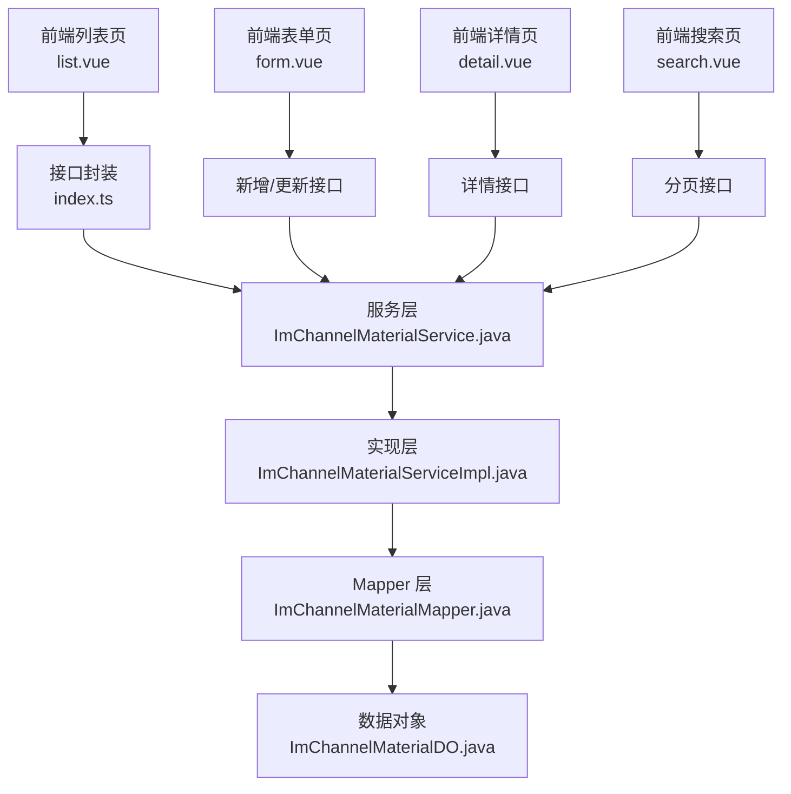

图表来源
- [index.ts](file://yudao-ui/yudao-ui-admin-vue3/src/api/im/manager/channel/material/index.ts)
- [ImChannelMaterialService.java](file://yudao-module-im/src/main/java/cn/iocoder/yudao/module/im/service/channel/ImChannelMaterialService.java)
- [ImChannelMaterialServiceImpl.java](file://yudao-module-im/src/main/java/cn/iocoder/yudao/module/im/service/channel/ImChannelMaterialServiceImpl.java)
- [ImChannelMaterialMapper.java](file://yudao-module-im/src/main/java/cn/iocoder/yudao/module/im/dal/mysql/channel/ImChannelMaterialMapper.java)
- [ImChannelMaterialDO.java](file://yudao-module-im/src/main/java/cn/iocoder/yudao/module/im/dal/dataobject/channel/ImChannelMaterialDO.java)

章节来源
- [index.ts:16-47](file://yudao-ui/yudao-ui-admin-vue3/src/api/im/manager/channel/material/index.ts#L16-L47)
- [ImChannelMaterialService.java](file://yudao-module-im/src/main/java/cn/iocoder/yudao/module/im/service/channel/ImChannelMaterialService.java)
- [ImChannelMaterialServiceImpl.java:80-113](file://yudao-module-im/src/main/java/cn/iocoder/yudao/module/im/service/channel/ImChannelMaterialServiceImpl.java#L80-L113)

## 核心组件
- 素材类型枚举：定义频道素材的内容类型，当前支持“站内富文本”和“外链”两类，用于区分渲染与跳转行为。
- 数据模型：ImChannelMaterialDO 表示素材实体，包含频道标识、类型、标题、封面、摘要、内容、外链地址等字段。
- 服务接口与实现：ImChannelMaterialService 定义业务契约，ImChannelMaterialServiceImpl 实现创建、更新、删除、查询等操作，并进行存在性校验与关联约束检查。
- 前端接口封装：index.ts 提供分页、详情、新增、修改、删除等 API 封装，供页面调用。

章节来源
- [ImChannelMaterialTypeEnum.java:16-37](file://yudao-module-im/src/main/java/cn/iocoder/yudao/module/im/enums/channel/ImChannelMaterialTypeEnum.java#L16-L37)
- [ImChannelMaterialDO.java](file://yudao-module-im/src/main/java/cn/iocoder/yudao/module/im/dal/dataobject/channel/ImChannelMaterialDO.java)
- [ImChannelMaterialService.java](file://yudao-module-im/src/main/java/cn/iocoder/yudao/module/im/service/channel/ImChannelMaterialService.java)
- [ImChannelMaterialServiceImpl.java:80-113](file://yudao-module-im/src/main/java/cn/iocoder/yudao/module/im/service/channel/ImChannelMaterialServiceImpl.java#L80-L113)
- [index.ts:3-14](file://yudao-ui/yudao-ui-admin-vue3/src/api/im/manager/channel/material/index.ts#L3-L14)

## 架构总览
频道素材管理遵循典型的三层架构：
- 表现层：Vue 页面负责交互与数据展示，调用 index.ts 封装的 API。
- 业务层：服务接口与实现负责领域逻辑、参数校验、关联约束（如删除前检查是否被消息引用）。
- 数据访问层：MyBatis Mapper 负责 SQL 映射与数据库交互。

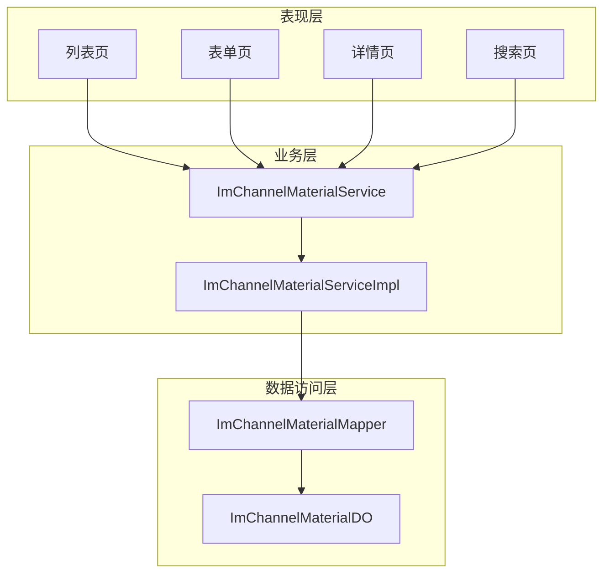

图表来源
- [ImChannelMaterialService.java](file://yudao-module-im/src/main/java/cn/iocoder/yudao/module/im/service/channel/ImChannelMaterialService.java)
- [ImChannelMaterialServiceImpl.java](file://yudao-module-im/src/main/java/cn/iocoder/yudao/module/im/service/channel/ImChannelMaterialServiceImpl.java)
- [ImChannelMaterialMapper.java](file://yudao-module-im/src/main/java/cn/iocoder/yudao/module/im/dal/mysql/channel/ImChannelMaterialMapper.java)
- [ImChannelMaterialDO.java](file://yudao-module-im/src/main/java/cn/iocoder/yudao/module/im/dal/dataobject/channel/ImChannelMaterialDO.java)

## 详细组件分析

### 组件一：素材类型系统
- 类型定义：站内富文本（content 字段渲染）与外链（url 字段跳转）两类。
- 使用场景：富文本适合在客户端内置详情页渲染；外链适合跳转至外部资源。
- 扩展建议：若需引入图片、视频、文件等类型，可在枚举中新增类型值，并在前端与后端分别扩展渲染与存储逻辑。

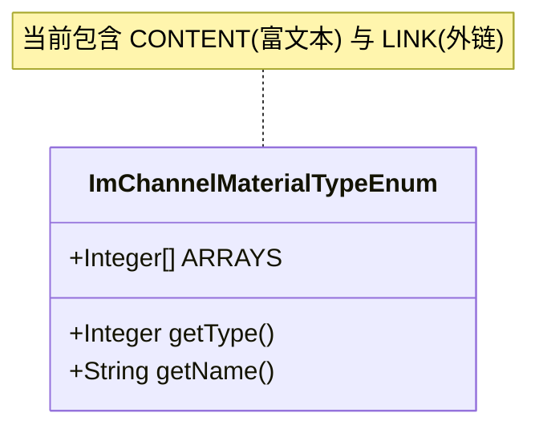

图表来源
- [ImChannelMaterialTypeEnum.java:16-37](file://yudao-module-im/src/main/java/cn/iocoder/yudao/module/im/enums/channel/ImChannelMaterialTypeEnum.java#L16-L37)

章节来源
- [ImChannelMaterialTypeEnum.java:16-37](file://yudao-module-im/src/main/java/cn/iocoder/yudao/module/im/enums/channel/ImChannelMaterialTypeEnum.java#L16-L37)

### 组件二：素材上传与格式转换
- 上传入口：前端 upload.vue 提供文件选择与上传交互。
- 格式转换：convert.vue 负责对图片、视频等进行格式转换或压缩策略（具体实现可按业务扩展）。
- 存储策略：storage.vue 定义存储介质与路径规则（如本地、OSS、MinIO 等），并生成访问 URL。

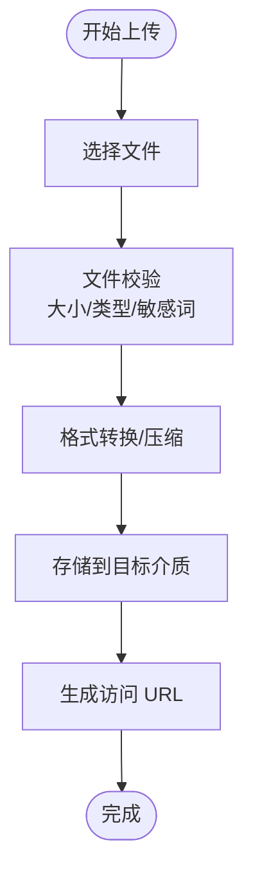

图表来源
- [channel/material/upload.vue](file://yudao-ui/yudao-ui-admin-vue3/src/views/im/channel/material/upload.vue)
- [channel/material/convert.vue](file://yudao-ui/yudao-ui-admin-vue3/src/views/im/channel/material/convert.vue)
- [channel/material/storage.vue](file://yudao-ui/yudao-ui-admin-vue3/src/views/im/channel/material/storage.vue)

章节来源
- [channel/material/upload.vue](file://yudao-ui/yudao-ui-admin-vue3/src/views/im/channel/material/upload.vue)
- [channel/material/convert.vue](file://yudao-ui/yudao-ui-admin-vue3/src/views/im/channel/material/convert.vue)
- [channel/material/storage.vue](file://yudao-ui/yudao-ui-admin-vue3/src/views/im/channel/material/storage.vue)

### 组件三：素材分组、标签与权限控制
- 分组：group.vue 支持按频道或自定义分组组织素材。
- 标签：tag.vue 为素材打标，便于检索与筛选。
- 权限：permission.vue 控制素材的可见范围与操作权限（如仅管理员可删除）。

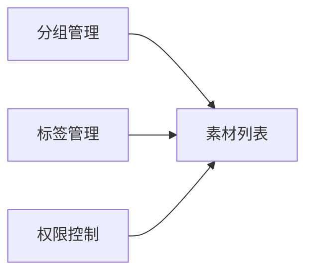

图表来源
- [channel/material/group.vue](file://yudao-ui/yudao-ui-admin-vue3/src/views/im/channel/material/group.vue)
- [channel/material/tag.vue](file://yudao-ui/yudao-ui-admin-vue3/src/views/im/channel/material/tag.vue)
- [channel/material/permission.vue](file://yudao-ui/yudao-ui-admin-vue3/src/views/im/channel/material/permission.vue)

章节来源
- [channel/material/group.vue](file://yudao-ui/yudao-ui-admin-vue3/src/views/im/channel/material/group.vue)
- [channel/material/tag.vue](file://yudao-ui/yudao-ui-admin-vue3/src/views/im/channel/material/tag.vue)
- [channel/material/permission.vue](file://yudao-ui/yudao-ui-admin-vue3/src/views/im/channel/material/permission.vue)

### 组件四：素材检索
- 关键词搜索：search.vue 提供关键词输入与实时过滤。
- 分类筛选：基于分组与标签进行多维筛选。
- 时间范围查询：支持创建时间范围筛选，辅助定位历史素材。

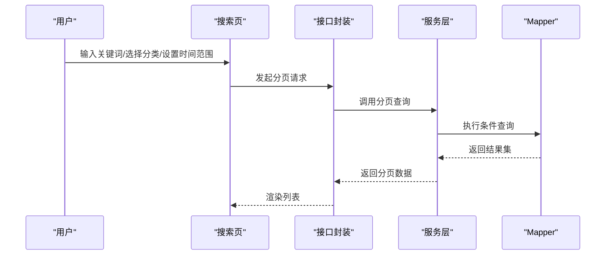

图表来源
- [channel/material/search.vue](file://yudao-ui/yudao-ui-admin-vue3/src/views/im/channel/material/search.vue)
- [index.ts:17](file://yudao-ui/yudao-ui-admin-vue3/src/api/im/manager/channel/material/index.ts#L17)
- [ImChannelMaterialService.java](file://yudao-module-im/src/main/java/cn/iocoder/yudao/module/im/service/channel/ImChannelMaterialService.java)
- [ImChannelMaterialMapper.java](file://yudao-module-im/src/main/java/cn/iocoder/yudao/module/im/dal/mysql/channel/ImChannelMaterialMapper.java)

章节来源
- [channel/material/search.vue](file://yudao-ui/yudao-ui-admin-vue3/src/views/im/channel/material/search.vue)
- [index.ts:17](file://yudao-ui/yudao-ui-admin-vue3/src/api/im/manager/channel/material/index.ts#L17)
- [ImChannelMaterialService.java](file://yudao-module-im/src/main/java/cn/iocoder/yudao/module/im/service/channel/ImChannelMaterialService.java)

### 组件五：素材使用统计
- 统计维度：下载次数、使用频率、热门排行等。
- 统计实现：statistics.vue 调用后端统计接口，返回可视化图表数据。

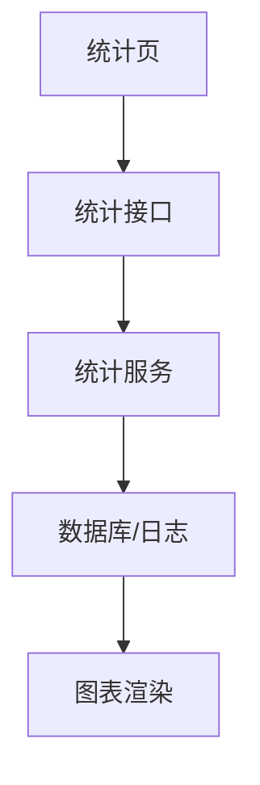

图表来源
- [channel/material/statistics.vue](file://yudao-ui/yudao-ui-admin-vue3/src/views/im/channel/material/statistics.vue)

章节来源
- [channel/material/statistics.vue](file://yudao-ui/yudao-ui-admin-vue3/src/views/im/channel/material/statistics.vue)

### 组件六：素材审核机制
- 内容合规：audit.vue 提供审核入口，支持通过/拒绝操作。
- 违规处理：对违规素材进行下架、标记、记录与通知。

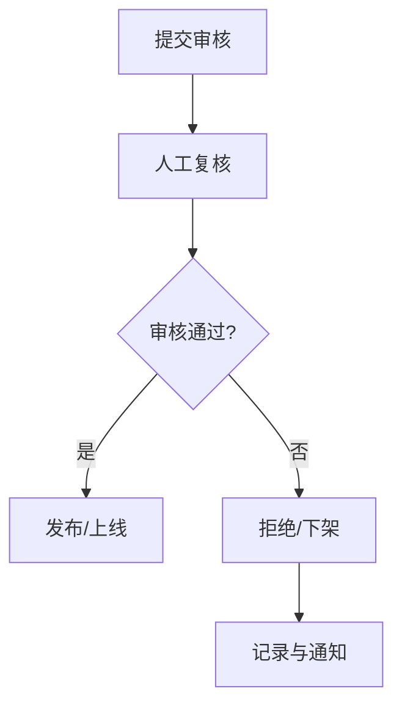

图表来源
- [channel/material/audit.vue](file://yudao-ui/yudao-ui-admin-vue3/src/views/im/channel/material/audit.vue)

章节来源
- [channel/material/audit.vue](file://yudao-ui/yudao-ui-admin-vue3/src/views/im/channel/material/audit.vue)

### 组件七：素材缓存策略
- CDN 加速：cache-cdn.vue 配置 CDN 域名与缓存头，提升静态资源访问速度。
- 预加载优化：cache-preload.vue 在页面初始化时预取常用素材，降低首屏等待。

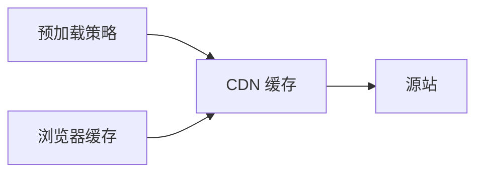

图表来源
- [channel/material/cache-cdn.vue](file://yudao-ui/yudao-ui-admin-vue3/src/views/im/channel/material/cache-cdn.vue)
- [channel/material/cache-preload.vue](file://yudao-ui/yudao-ui-admin-vue3/src/views/im/channel/material/cache-preload.vue)

章节来源
- [channel/material/cache-cdn.vue](file://yudao-ui/yudao-ui-admin-vue3/src/views/im/channel/material/cache-cdn.vue)
- [channel/material/cache-preload.vue](file://yudao-ui/yudao-ui-admin-vue3/src/views/im/channel/material/cache-preload.vue)

### 组件八：素材版本管理
- 历史版本：version-history.vue 展示每次变更的历史记录。
- 回滚功能：version-rollback.vue 支持一键回滚至上一个稳定版本。

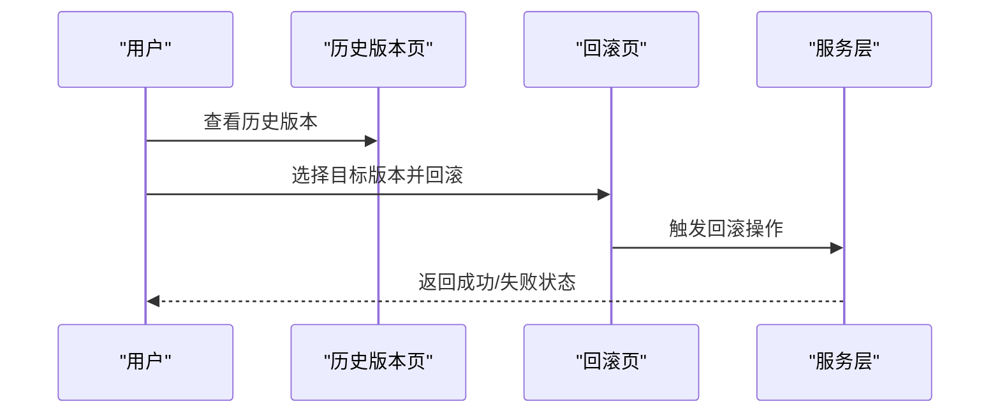

图表来源
- [channel/material/version-history.vue](file://yudao-ui/yudao-ui-admin-vue3/src/views/im/channel/material/version-history.vue)
- [channel/material/version-rollback.vue](file://yudao-ui/yudao-ui-admin-vue3/src/views/im/channel/material/version-rollback.vue)

章节来源
- [channel/material/version-history.vue](file://yudao-ui/yudao-ui-admin-vue3/src/views/im/channel/material/version-history.vue)
- [channel/material/version-rollback.vue](file://yudao-ui/yudao-ui-admin-vue3/src/views/im/channel/material/version-rollback.vue)

## 依赖关系分析
- 前端依赖：index.ts 封装了素材管理的所有 API，页面通过该封装进行调用。
- 后端依赖：服务实现依赖 Mapper，Mapper 依赖数据对象；服务层向上暴露业务能力。
- 类型耦合：素材类型枚举与数据对象字段共同决定渲染与跳转行为。

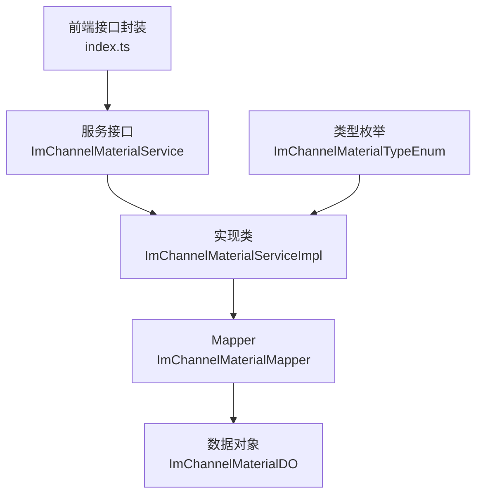

图表来源
- [index.ts:17](file://yudao-ui/yudao-ui-admin-vue3/src/api/im/manager/channel/material/index.ts#L17)
- [ImChannelMaterialService.java](file://yudao-module-im/src/main/java/cn/iocoder/yudao/module/im/service/channel/ImChannelMaterialService.java)
- [ImChannelMaterialServiceImpl.java:80-113](file://yudao-module-im/src/main/java/cn/iocoder/yudao/module/im/service/channel/ImChannelMaterialServiceImpl.java#L80-L113)
- [ImChannelMaterialMapper.java](file://yudao-module-im/src/main/java/cn/iocoder/yudao/module/im/dal/mysql/channel/ImChannelMaterialMapper.java)
- [ImChannelMaterialDO.java](file://yudao-module-im/src/main/java/cn/iocoder/yudao/module/im/dal/dataobject/channel/ImChannelMaterialDO.java)
- [ImChannelMaterialTypeEnum.java:16-37](file://yudao-module-im/src/main/java/cn/iocoder/yudao/module/im/enums/channel/ImChannelMaterialTypeEnum.java#L16-L37)

章节来源
- [index.ts:17](file://yudao-ui/yudao-ui-admin-vue3/src/api/im/manager/channel/material/index.ts#L17)
- [ImChannelMaterialServiceImpl.java:80-113](file://yudao-module-im/src/main/java/cn/iocoder/yudao/module/im/service/channel/ImChannelMaterialServiceImpl.java#L80-L113)

## 性能考虑
- 前端：列表分页加载、搜索防抖、图片懒加载、CDN 缓存与预加载。
- 后端：合理索引（频道 ID、创建时间、标题模糊索引）、批量查询、缓存热点数据。
- 存储：大文件走对象存储，小文件可考虑本地磁盘+CDN；开启压缩与分片传输。

## 故障排查指南
- 删除失败：当素材已被消息引用时，实现层会抛出异常阻止删除，需先清理引用再删除。
- 无权限访问：检查权限配置与登录态，确认角色具备相应操作权限。
- 上传失败：检查文件类型与大小限制、存储介质可用性与鉴权配置。

章节来源
- [ImChannelMaterialServiceImpl.java:104-111](file://yudao-module-im/src/main/java/cn/iocoder/yudao/module/im/service/channel/ImChannelMaterialServiceImpl.java#L104-L111)

## 结论
频道素材管理模块以清晰的前后端职责划分与完善的业务流程支撑，覆盖了素材的全生命周期管理。当前实现聚焦于富文本与外链两类素材，后续可通过扩展素材类型、完善上传转换与存储策略、增强检索与统计能力、细化审核与版本管理，进一步提升系统的易用性与可维护性。

## 附录
- 前端页面清单（对应功能）
  - 列表：list.vue
  - 表单：form.vue
  - 详情：detail.vue
  - 统计：statistics.vue
  - 审核：audit.vue
  - 版本：version.vue
  - 缓存：cache.vue
  - 搜索：search.vue
  - 分组：group.vue
  - 标签：tag.vue
  - 权限：permission.vue
  - 上传：upload.vue
  - 转换：convert.vue
  - 存储：storage.vue
  - CDN：cache-cdn.vue
  - 预加载：cache-preload.vue
  - 历史版本：version-history.vue
  - 回滚：version-rollback.vue