# 售后模块PRD

<cite>
**本文档引用的文件**
- [feature_step5-售后模块_ddl.sql](file://db/branches/feature_step5-售后模块/feature_step5-售后模块_ddl.sql)
- [PRD-Step5-售后模块.md](file://docs/PRD-Step5-售后模块.md)
</cite>

## 目录
1. [项目概述](#项目概述)
2. [项目结构](#项目结构)
3. [核心组件](#核心组件)
4. [架构概览](#架构概览)
5. [详细组件分析](#详细组件分析)
6. [依赖分析](#依赖分析)
7. [性能考虑](#性能考虑)
8. [故障排除指南](#故障排除指南)
9. [结论](#结论)
10. [附录](#附录)

## 项目概述

售后模块是基于RuoYi-Vue-Pro企业级中台管理系统的一个重要功能模块，专注于售后服务的全流程管理。该模块实现了退货、退换货、退货退款三种处理方式与投诉、召回、破损三种售后原因的九种售后类型组合，提供了完整的售后服务生命周期管理。

### 模块目标

售后模块旨在构建一个完整的售后服务管理体系，包括：

- **全流程管理**：覆盖从售后申请到完成的完整业务流程
- **多维度统计**：提供5大核心统计指标，支持业务决策分析
- **灵活筛选**：支持9种售后类型、4种进度状态、多维度条件筛选
- **数据权限**：基于经销商和产品线的精细化数据权限控制
- **进度追踪**：可视化展示售后进度，支持实时状态更新

## 项目结构

售后模块采用分层架构设计，遵循企业级应用的最佳实践：

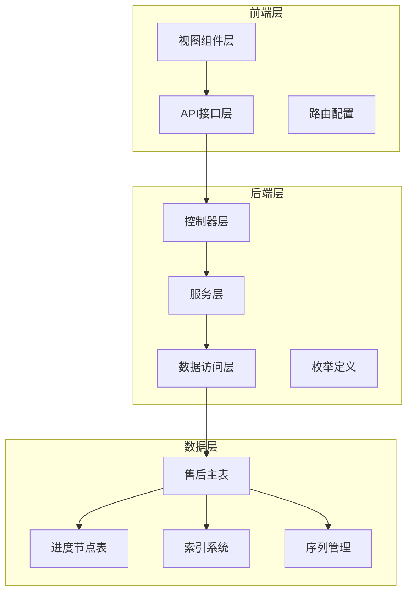

**图表来源**
- [PRD-Step5-售后模块.md:227-254](file://docs/PRD-Step5-售后模块.md#L227-L254)

### 数据模型设计

售后模块采用双表设计模式，确保数据结构的清晰性和查询效率：

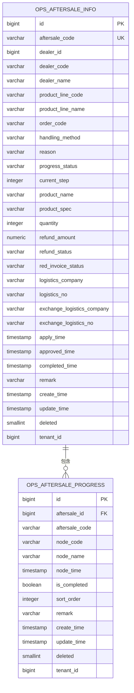

**图表来源**
- [feature_step5-售后模块_ddl.sql:10-44](file://db/branches/feature_step5-售后模块/feature_step5-售后模块_ddl.sql#L10-L44)
- [feature_step5-售后模块_ddl.sql:87-104](file://db/branches/feature_step5-售后模块/feature_step5-售后模块_ddl.sql#L87-L104)

**章节来源**
- [feature_step5-售后模块_ddl.sql:1-121](file://db/branches/feature_step5-售后模块/feature_step5-售后模块_ddl.sql#L1-L121)
- [PRD-Step5-售后模块.md:31-100](file://docs/PRD-Step5-售后模块.md#L31-L100)

## 核心组件

### 1. 售后主表 (ops_aftersale_info)

售后主表是售后模块的核心数据载体，承载了所有售后业务的关键信息：

| 字段属性 | 描述 | 类型 | 约束 |
|---------|------|------|------|
| **标识字段** | 主键ID | bigint | PK, NOT NULL |
| **业务标识** | 售后单号 | varchar(30) | UNIQUE, NOT NULL |
| **关联信息** | 经销商ID/编码/名称 | bigint/varchar | NOT NULL |
| **产品信息** | 产品线编码/名称 | varchar | NOT NULL |
| **订单关联** | 关联订单号 | varchar(30) | NOT NULL |
| **处理配置** | 处理方式/原因 | varchar(20) | NOT NULL |
| **进度状态** | 当前进度/步骤 | varchar/int | NOT NULL |
| **产品详情** | 名称/规格/数量 | varchar/int | NOT NULL |
| **财务信息** | 退款金额/状态 | numeric/varchar | 可选 |
| **物流信息** | 退回/换货物流 | varchar | 可选 |

### 2. 进度节点表 (ops_aftersale_progress)

进度节点表采用独立存储的设计，支持灵活的进度管理和状态追踪：

| 字段属性 | 描述 | 类型 | 约束 |
|---------|------|------|------|
| **节点标识** | 主键ID | bigint | PK, NOT NULL |
| **关联标识** | 售后单ID/编号 | bigint/varchar | NOT NULL |
| **节点配置** | 节点编码/名称 | varchar | NOT NULL |
| **执行状态** | 完成时间/状态 | timestamp/boolean | 可选 |
| **排序信息** | 节点序号 | integer | NOT NULL |
| **备注信息** | 节点说明 | varchar | 可选 |

**章节来源**
- [feature_step5-售后模块_ddl.sql:37-83](file://db/branches/feature_step5-售后模块/feature_step5-售后模块_ddl.sql#L37-L83)
- [feature_step5-售后模块_ddl.sql:81-92](file://db/branches/feature_step5-售后模块/feature_step5-售后模块_ddl.sql#L81-L92)

### 3. 枚举体系

售后模块建立了完整的枚举定义体系，确保业务语义的统一性和可维护性：

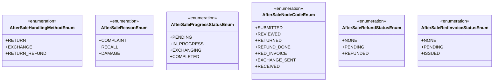

**图表来源**
- [PRD-Step5-售后模块.md:174-211](file://docs/PRD-Step5-售后模块.md#L174-L211)

**章节来源**
- [PRD-Step5-售后模块.md:174-224](file://docs/PRD-Step5-售后模块.md#L174-L224)

## 架构概览

售后模块采用现代化的企业级架构设计，实现了前后端分离、数据权限控制、以及完善的业务流程管理。

### 系统架构图

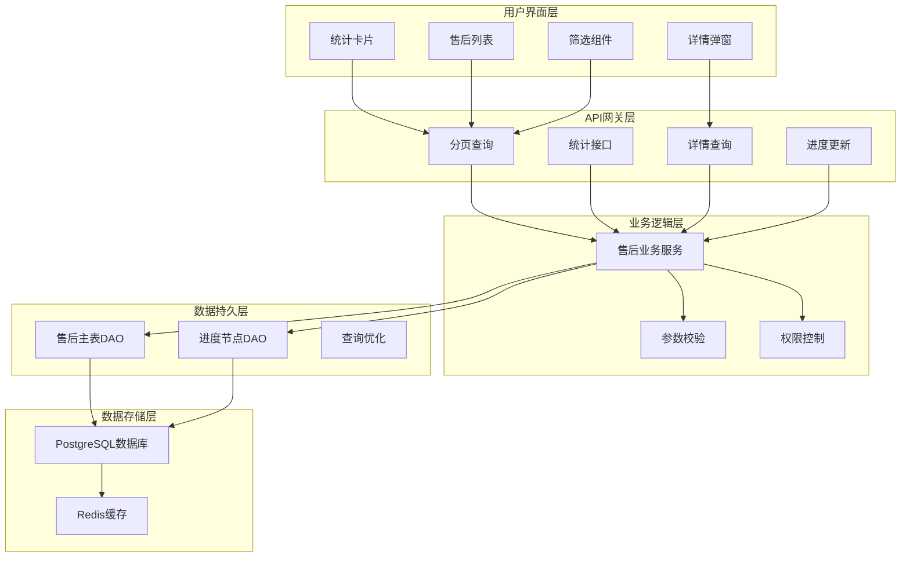

**图表来源**
- [PRD-Step5-售后模块.md:227-287](file://docs/PRD-Step5-售后模块.md#L227-L287)

### 数据权限架构

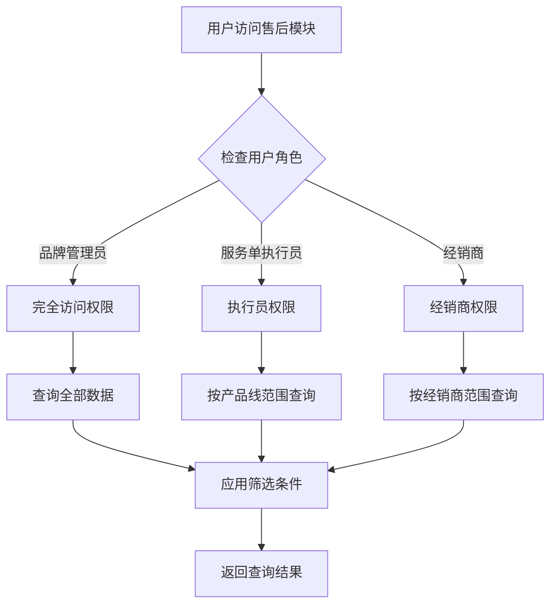

**图表来源**
- [PRD-Step5-售后模块.md:289-297](file://docs/PRD-Step5-售后模块.md#L289-L297)

**章节来源**
- [PRD-Step5-售后模块.md:227-297](file://docs/PRD-Step5-售后模块.md#L227-L297)

## 详细组件分析

### 1. 售后类型与进度模板

售后模块支持9种售后类型组合，每种类型都有对应的标准化进度模板：

#### 退货流程 (Return)
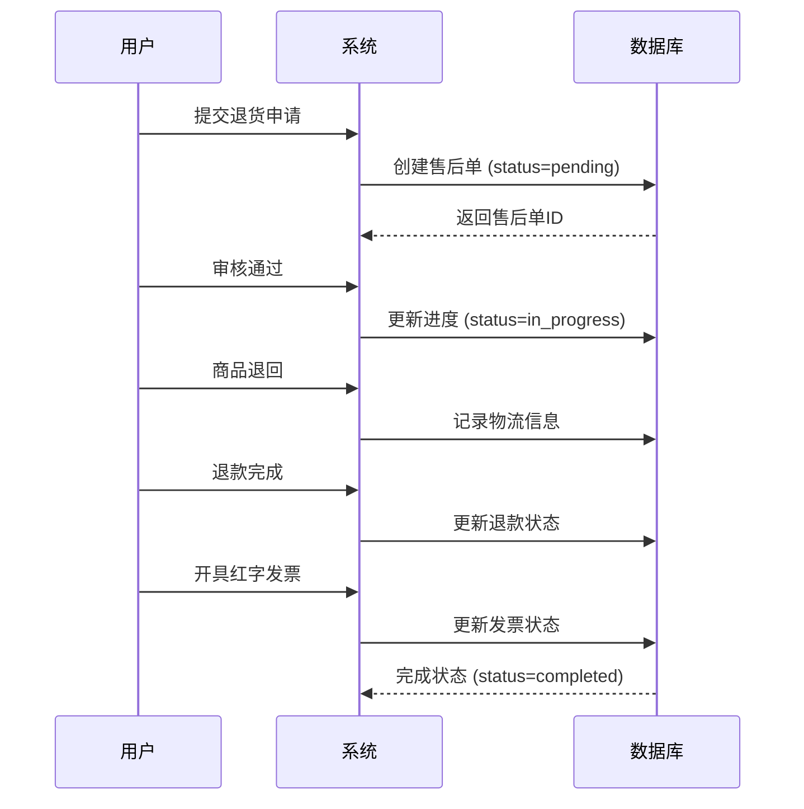

**图表来源**
- [PRD-Step5-售后模块.md:104-112](file://docs/PRD-Step5-售后模块.md#L104-L112)

#### 退换货流程 (Exchange)
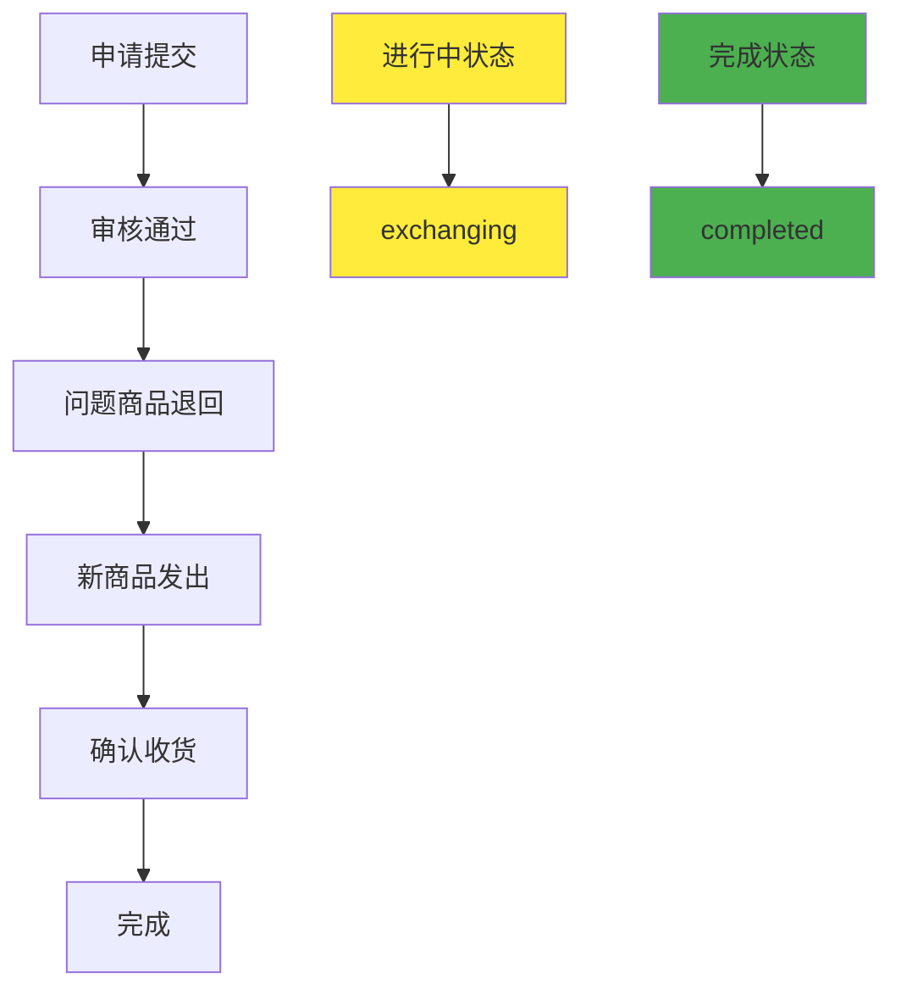

**图表来源**
- [PRD-Step5-售后模块.md:114-122](file://docs/PRD-Step5-售后模块.md#L114-L122)

#### 退货退款流程 (Return Refund)
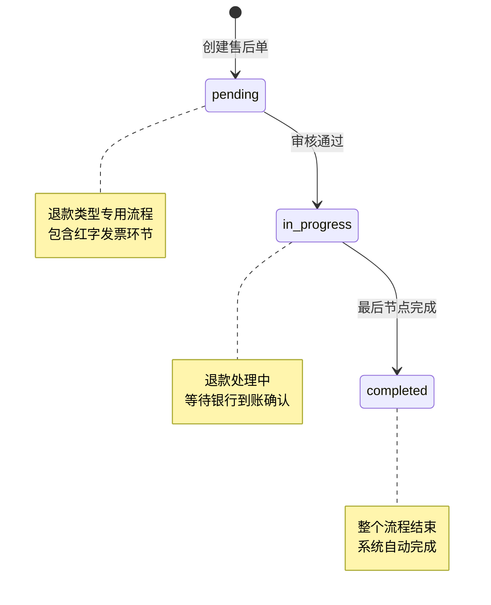

**图表来源**
- [PRD-Step5-售后模块.md:124-132](file://docs/PRD-Step5-售后模块.md#L124-L132)

**章节来源**
- [PRD-Step5-售后模块.md:100-173](file://docs/PRD-Step5-售后模块.md#L100-L173)

### 2. 统计分析组件

售后模块提供5大核心统计指标，支持多维度的业务分析：

#### 统计卡片设计
| 统计指标 | 计算逻辑 | 用途 | 权限要求 |
|---------|---------|------|---------|
| **售后订单总数** | COUNT(*) | 总体业务规模 | 所有角色 |
| **退款** | WHERE handling_method='return_refund' | 退款业务分析 | 所有角色 |
| **退货** | WHERE handling_method IN ('return','exchange','return_refund') | 退货业务分析 | 所有角色 |
| **已完成** | WHERE progress_status='completed' | 进度完成率 | 所有角色 |
| **未完成** | WHERE progress_status IN ('pending','in_progress','exchanging') | 在途业务监控 | 所有角色 |

#### 统计交叉计数规则
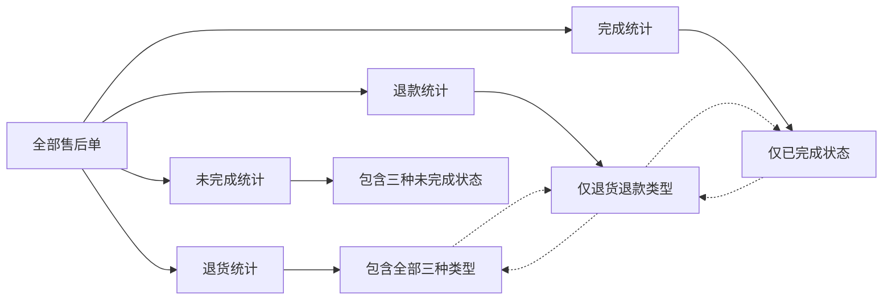

**图表来源**
- [PRD-Step5-售后模块.md:162-172](file://docs/PRD-Step5-售后模块.md#L162-L172)

**章节来源**
- [PRD-Step5-售后模块.md:162-173](file://docs/PRD-Step5-售后模块.md#L162-L173)

### 3. 前端交互组件

#### 主页面布局
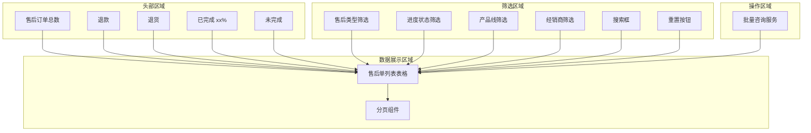

**图表来源**
- [PRD-Step5-售后模块.md:420-435](file://docs/PRD-Step5-售后模块.md#L420-L435)

#### 权限控制矩阵
| 功能模块 | 品牌管理员 | 品牌销售员 | 服务单执行员 | 经销商 |
|---------|-----------|-----------|-------------|-------|
| **查询权限** | ✅ 完全访问 | ✅ 基础查询 | ✅ 基础查询 | ✅ 基础查询 |
| **进度更新** | ✅ 管理员 | ❌ 禁用 | ✅ 执行员 | ❌ 禁用 |
| **客服咨询** | ✅ 管理员 | ❌ 禁用 | ✅ 执行员 | ✅ 经销商 |
| **经销商筛选** | ✅ 可见 | ✅ 可见 | ❌ 隐藏 | ❌ 隐藏 |
| **操作按钮** | ✅ 更新进度+客服 | ❌ 仅客服 | ✅ 更新进度+客服 | ✅ 仅客服 |

**章节来源**
- [PRD-Step5-售后模块.md:437-458](file://docs/PRD-Step5-售后模块.md#L437-L458)
- [PRD-Step5-售后模块.md:518-539](file://docs/PRD-Step5-售后模块.md#L518-L539)

## 依赖分析

### 1. 外部依赖关系

售后模块与现有系统的集成关系：

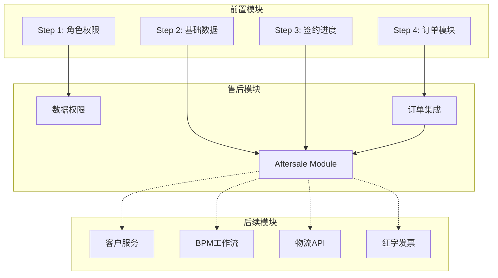

**图表来源**
- [PRD-Step5-售后模块.md:574-583](file://docs/PRD-Step5-售后模块.md#L574-L583)

### 2. 数据权限依赖

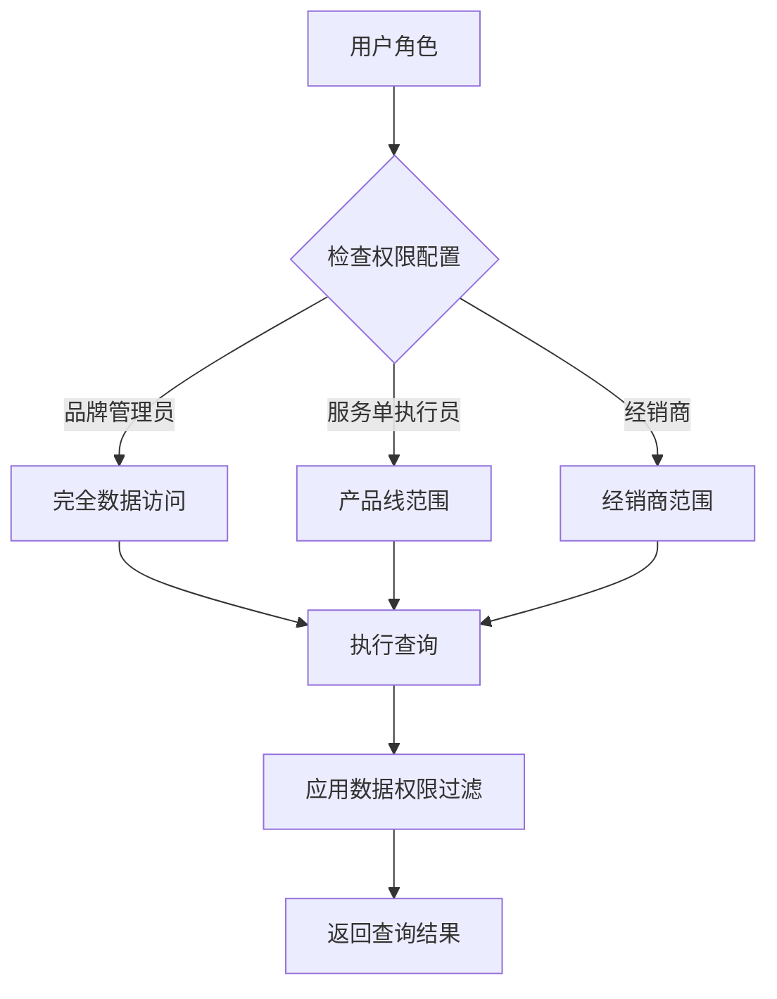

**图表来源**
- [PRD-Step5-售后模块.md:289-297](file://docs/PRD-Step5-售后模块.md#L289-L297)

**章节来源**
- [PRD-Step5-售后模块.md:574-583](file://docs/PRD-Step5-售后模块.md#L574-L583)

## 性能考虑

### 1. 数据库性能优化

售后模块在数据库层面采用了多项优化策略：

#### 索引设计
| 索引类型 | 字段组合 | 查询场景 | 性能收益 |
|---------|---------|---------|---------|
| 唯一索引 | aftersale_code | 售后单号查询 | O(log n) 查询时间 |
| 普通索引 | dealer_code | 经销商筛选 | 精确匹配加速 |
| 普通索引 | product_line_code | 产品线筛选 | 范围查询优化 |
| 普通索引 | order_code | 订单关联查询 | 关联查询加速 |
| 普通索引 | progress_status | 进度状态筛选 | 条件查询优化 |
| 普通索引 | handling_method | 处理方式筛选 | 分类统计加速 |
| 普通索引 | apply_time | 时间范围查询 | 时序分析优化 |

#### 序列管理
- **ops_aftersale_info_seq**: 主表自增序列，支持高并发插入
- **ops_aftersale_progress_seq**: 进度节点序列，保证节点编号唯一性

### 2. 查询性能优化

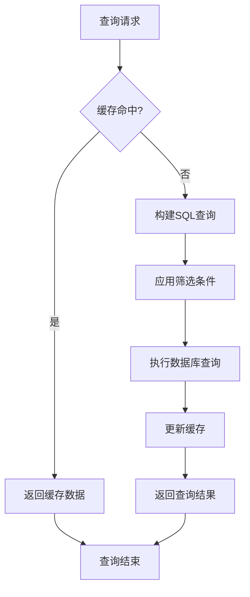

### 3. 缓存策略

- **统计结果缓存**: 5大统计卡片结果缓存30分钟
- **字典数据缓存**: 枚举值缓存1小时
- **权限数据缓存**: 用户权限缓存10分钟

## 故障排除指南

### 1. 常见问题诊断

#### 售后单查询异常
**症状**: 售后单列表显示为空或数据不完整
**排查步骤**:
1. 检查用户数据权限配置
2. 验证筛选条件是否过于严格
3. 确认数据库连接状态
4. 查看系统日志中的SQL执行情况

#### 进度更新失败
**症状**: 推进进度节点时报错
**排查步骤**:
1. 验证售后单状态是否已完成
2. 检查节点顺序是否正确
3. 确认用户权限是否足够
4. 查看业务逻辑校验规则

#### 统计数据异常
**症状**: 统计卡片数据与实际不符
**排查步骤**:
1. 验证统计计算逻辑
2. 检查数据交叉计数规则
3. 确认数据权限过滤
4. 查看缓存数据一致性

### 2. 性能问题定位

#### 查询超时
**可能原因**:
- 缺少必要的索引
- 查询条件过于复杂
- 数据量过大导致全表扫描

**解决方案**:
- 添加缺失的索引
- 优化查询条件
- 实施分页查询
- 使用缓存机制

#### 内存溢出
**可能原因**:
- 大数据量一次性加载
- 缓存数据过多
- 长时间会话占用

**解决方案**:
- 实施分页和懒加载
- 优化缓存策略
- 设置合理的会话超时
- 监控内存使用情况

**章节来源**
- [PRD-Step5-售后模块.md:587-607](file://docs/PRD-Step5-售后模块.md#L587-L607)

## 结论

售后模块作为RuoYi-Vue-Pro系统的重要组成部分，成功实现了售后服务的全流程数字化管理。通过精心设计的数据模型、完善的权限控制、以及友好的用户界面，该模块为企业提供了强大的售后服务支撑能力。

### 核心优势

1. **完整的业务覆盖**: 支持9种售后类型和5节点进度模板
2. **灵活的权限控制**: 基于角色的精细化数据权限管理
3. **强大的统计分析**: 5大核心指标支持业务决策
4. **优秀的用户体验**: 直观的界面设计和流畅的操作体验
5. **良好的扩展性**: 模块化设计便于后续功能扩展

### 技术亮点

- **双表设计**: 主表+子表的架构确保了数据结构的清晰性
- **枚举体系**: 完整的枚举定义保证了业务语义的统一性
- **索引优化**: 针对查询场景的索引设计提升了系统性能
- **缓存策略**: 合理的缓存机制改善了用户体验

### 发展前景

售后模块为后续的功能扩展奠定了坚实的基础，包括：
- 售后单创建和管理功能
- 客户服务AI集成
- 操作请求工作流
- 物流API对接
- 红字发票电子化
- 更丰富的统计分析

## 附录

### 1. API接口规范

| 接口名称 | 请求方法 | 路径 | 权限要求 | 功能描述 |
|---------|---------|------|---------|---------|
| 分页查询 | GET | `/opshub/aftersale/page` | `dealer:aftersale:query` | 售后单列表分页查询 |
| 获取详情 | GET | `/opshub/aftersale/get` | `dealer:aftersale:query` | 售后单详情查询 |
| 统计数据 | GET | `/opshub/aftersale/statistics` | `dealer:aftersale:query` | 5大统计卡片数据 |
| 更新进度 | PUT | `/opshub/aftersale/update-progress` | `dealer:aftersale:update-progress` | 进度节点推进 |
| 批量咨询 | POST | `/opshub/aftersale/batch-consult` | `dealer:aftersale:consult` | 批量咨询服务 |

### 2. 数据字典

#### 售后类型字典
| 处理方式 | 售后原因 | 类型描述 | 适用节点 |
|---------|---------|---------|---------|
| return | complaint/recall/damage | 退货-投诉/召回/破损 | 退货流程 |
| exchange | complaint/recall/damage | 退换货-投诉/召回/破损 | 退换货流程 |
| return_refund | complaint/recall/damage | 退货退款-投诉/召回/破损 | 退货退款流程 |

#### 状态字典
| 状态代码 | 状态名称 | 业务含义 | 触发条件 |
|---------|---------|---------|---------|
| pending | 待处理 | 售后单刚创建 | 创建售后单 |
| in_progress | 进行中 | 退货/退款进行中 | 审核通过 |
| exchanging | 换货中 | 退换货换货中 | 审核通过 |
| completed | 已完成 | 售后流程结束 | 最后节点完成 |

### 3. 验证清单

#### 功能验证
- [ ] 表结构创建成功
- [ ] 菜单权限配置正确
- [ ] 数据权限过滤生效
- [ ] 分页查询功能正常
- [ ] 统计卡片数据准确
- [ ] 进度更新流程顺畅

#### 性能验证
- [ ] 查询响应时间达标
- [ ] 并发处理能力满足需求
- [ ] 缓存机制正常运行
- [ ] 内存使用合理

#### 兼容性验证
- [ ] 多浏览器兼容性
- [ ] 移动端适配
- [ ] 权限控制有效
- [ ] 日志记录完整