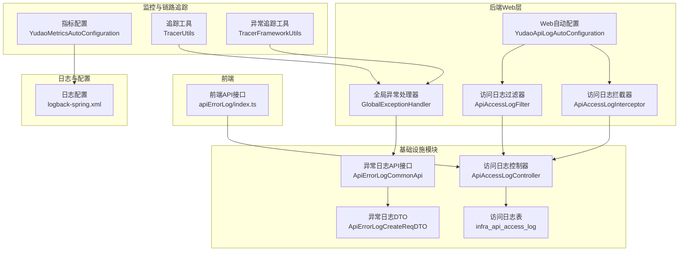
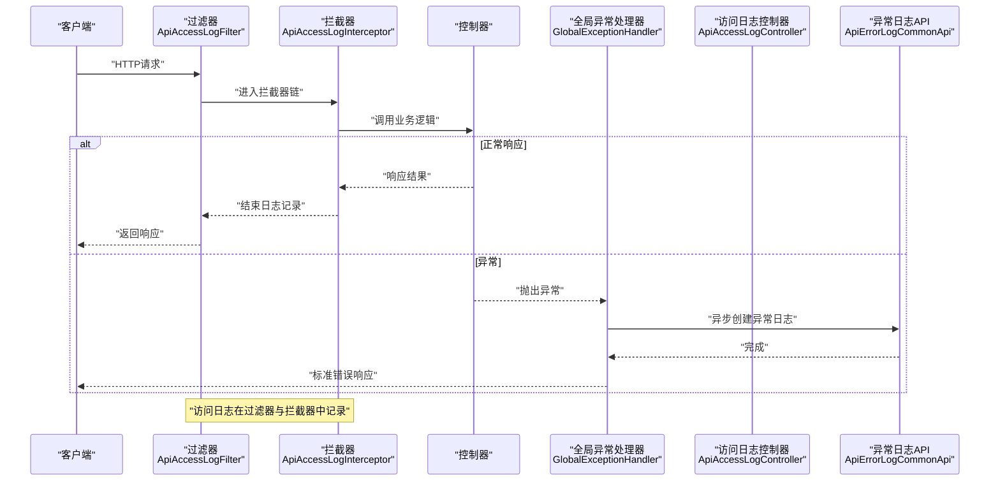
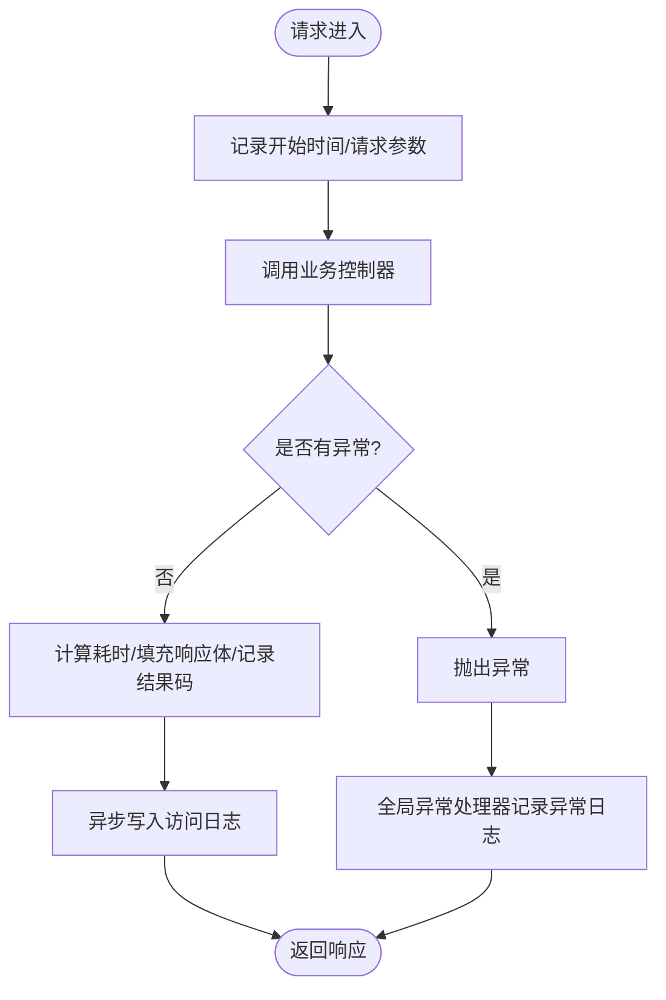
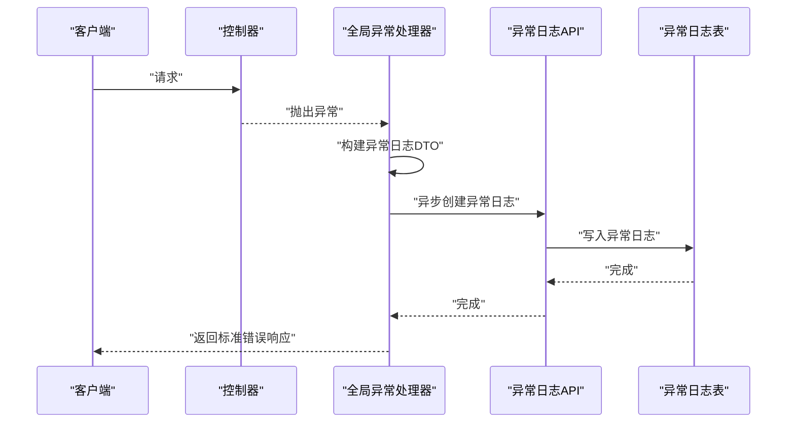
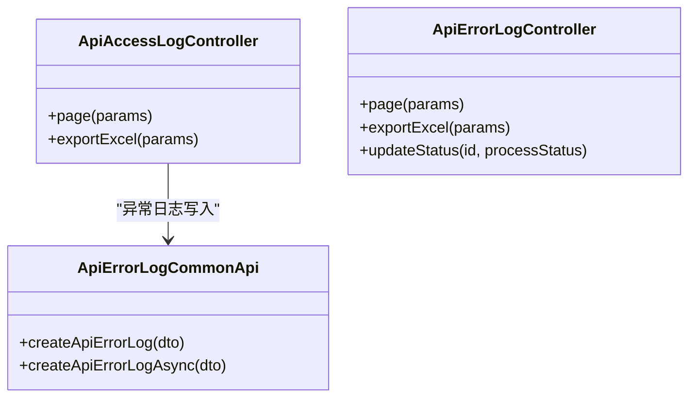
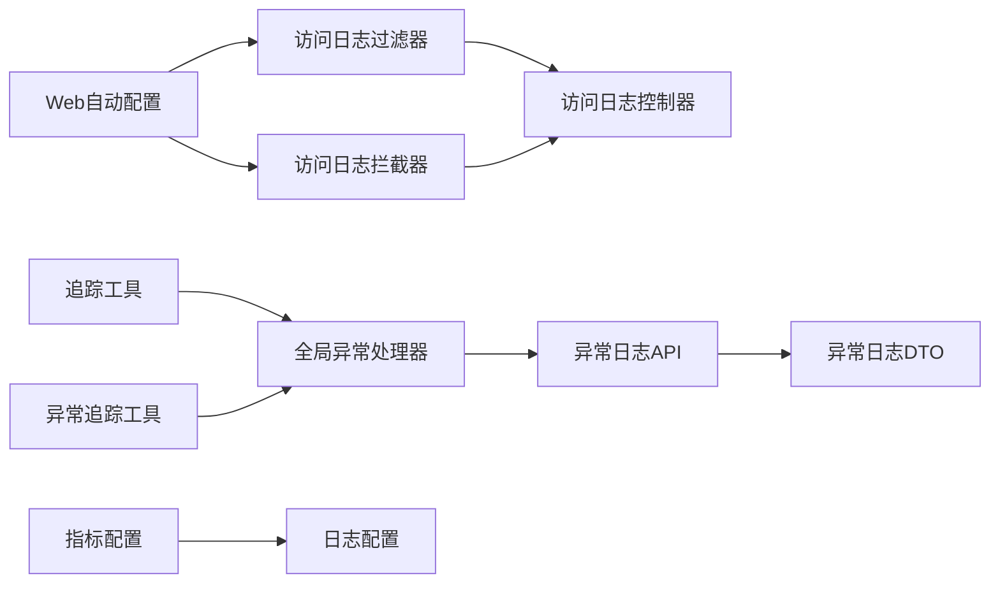

# API监控管理系统

<cite>
**本文档引用的文件**
- [YudaoApiLogAutoConfiguration.java](file://yudao-framework/yudao-spring-boot-starter-web/src/main/java/cn/iocoder/yudao/framework/apilog/config/YudaoApiLogAutoConfiguration.java)
- [ApiAccessLogFilter.java](file://yudao-framework/yudao-spring-boot-starter-web/src/main/java/cn/iocoder/yudao/framework/apilog/core/filter/ApiAccessLogFilter.java)
- [ApiAccessLogInterceptor.java](file://yudao-framework/yudao-spring-boot-starter-web/src/main/java/cn/iocoder/yudao/framework/apilog/core/interceptor/ApiAccessLogInterceptor.java)
- [GlobalExceptionHandler.java](file://yudao-framework/yudao-spring-boot-starter-web/src/main/java/cn/iocoder/yudao/framework/web/core/handler/GlobalExceptionHandler.java)
- [ApiErrorLogCommonApi.java](file://yudao-framework/yudao-common/src/main/java/cn/iocoder/yudao/framework/common/biz/infra/logger/ApiErrorLogCommonApi.java)
- [ApiErrorLogCreateReqDTO.java](file://yudao-framework/yudao-common/src/main/java/cn/iocoder/yudao/framework/common/biz/infra/logger/dto/ApiErrorLogCreateReqDTO.java)
- [ApiAccessLogController.java](file://yudao-module-infra/src/main/java/cn/iocoder/yudao/module/infra/controller/admin/logger/ApiAccessLogController.java)
- [logback-spring.xml](file://yudao-server/src/main/resources/logback-spring.xml)
- [YudaoMetricsAutoConfiguration.java](file://yudao-framework/yudao-spring-boot-starter-monitor/src/main/java/cn/iocoder/yudao/framework/tracer/config/YudaoMetricsAutoConfiguration.java)
- [TracerFrameworkUtils.java](file://yudao-framework/yudao-spring-boot-starter-monitor/src/main/java/cn/iocoder/yudao/framework/tracer/core/util/TracerFrameworkUtils.java)
- [TracerUtils.java](file://yudao-framework/yudao-common/src/main/java/cn/iocoder/yudao/framework/common/util/monitor/TracerUtils.java)
- [create_tables.sql](file://yudao-module-infra/src/test/resources/sql/create_tables.sql)
- [index.ts](file://yudao-ui/yudao-ui-admin-vue3/src/api/infra/apiErrorLog/index.ts)
</cite>

## 目录
1. [简介](#简介)
2. [项目结构](#项目结构)
3. [核心组件](#核心组件)
4. [架构总览](#架构总览)
5. [详细组件分析](#详细组件分析)
6. [依赖关系分析](#依赖关系分析)
7. [性能考虑](#性能考虑)
8. [故障排查指南](#故障排查指南)
9. [结论](#结论)
10. [附录](#附录)

## 简介
本文件面向API监控管理系统，系统通过多维度采集与处理API访问日志与异常日志，提供请求响应数据捕获、性能指标统计、异常信息记录、日志查询分析、清理与归档策略、可视化展示与告警配置等能力。系统采用Spring Web拦截链路、全局异常处理器、链路追踪与日志采集相结合的方式，形成完整的API监控闭环。

## 项目结构
系统围绕Web层、监控层、基础设施模块与前端UI展开，关键路径如下：
- Web层：自动装配API访问日志过滤器与拦截器，统一处理访问日志
- 监控层：集成Micrometer指标、SkyWalking链路追踪与日志采集
- 基础设施模块：提供API访问日志与异常日志的数据模型与控制器接口
- 前端UI：提供日志分页查询、导出与处理状态更新能力

**图表来源**
- [YudaoApiLogAutoConfiguration.java:18-44](file://yudao-framework/yudao-spring-boot-starter-web/src/main/java/cn/iocoder/yudao/framework/apilog/config/YudaoApiLogAutoConfiguration.java#L18-L44)
- [ApiAccessLogFilter.java](file://yudao-framework/yudao-spring-boot-starter-web/src/main/java/cn/iocoder/yudao/framework/apilog/core/filter/ApiAccessLogFilter.java)
- [ApiAccessLogInterceptor.java](file://yudao-framework/yudao-spring-boot-starter-web/src/main/java/cn/iocoder/yudao/framework/apilog/core/interceptor/ApiAccessLogInterceptor.java)
- [GlobalExceptionHandler.java:1-375](file://yudao-framework/yudao-spring-boot-starter-web/src/main/java/cn/iocoder/yudao/framework/web/core/handler/GlobalExceptionHandler.java#L1-L375)
- [ApiErrorLogCommonApi.java:1-32](file://yudao-framework/yudao-common/src/main/java/cn/iocoder/yudao/framework/common/biz/infra/logger/ApiErrorLogCommonApi.java#L1-L32)
- [ApiErrorLogCreateReqDTO.java](file://yudao-framework/yudao-common/src/main/java/cn/iocoder/yudao/framework/common/biz/infra/logger/dto/ApiErrorLogCreateReqDTO.java)
- [ApiAccessLogController.java](file://yudao-module-infra/src/main/java/cn/iocoder/yudao/module/infra/controller/admin/logger/ApiAccessLogController.java)
- [YudaoMetricsAutoConfiguration.java:1-27](file://yudao-framework/yudao-spring-boot-starter-monitor/src/main/java/cn/iocoder/yudao/framework/tracer/config/YudaoMetricsAutoConfiguration.java#L1-L27)
- [TracerUtils.java:1-30](file://yudao-framework/yudao-common/src/main/java/cn/iocoder/yudao/framework/common/util/monitor/TracerUtils.java#L1-L30)
- [TracerFrameworkUtils.java:1-46](file://yudao-framework/yudao-spring-boot-starter-monitor/src/main/java/cn/iocoder/yudao/framework/tracer/core/util/TracerFrameworkUtils.java#L1-L46)
- [logback-spring.xml:1-56](file://yudao-server/src/main/resources/logback-spring.xml#L1-L56)

**章节来源**
- [YudaoApiLogAutoConfiguration.java:18-44](file://yudao-framework/yudao-spring-boot-starter-web/src/main/java/cn/iocoder/yudao/framework/apilog/config/YudaoApiLogAutoConfiguration.java#L18-L44)
- [logback-spring.xml:1-56](file://yudao-server/src/main/resources/logback-spring.xml#L1-L56)

## 核心组件
- API访问日志过滤器与拦截器：在请求进入与退出阶段捕获请求参数、响应结果、耗时与结果码，统一写入访问日志
- 全局异常处理器：捕获未处理异常，提取异常堆栈与根因，异步落库并返回标准错误响应
- 异常日志API与DTO：定义异常日志的创建接口与数据载体，支持异步写入
- 访问日志控制器：提供访问日志的分页查询、导出与处理状态更新
- 指标与链路追踪：通过Micrometer注入通用标签，通过Tracer工具获取TraceId，便于关联日志与链路
- 日志配置：基于Logback的滚动策略与异步写入，保障性能与持久化

**章节来源**
- [ApiAccessLogFilter.java](file://yudao-framework/yudao-spring-boot-starter-web/src/main/java/cn/iocoder/yudao/framework/apilog/core/filter/ApiAccessLogFilter.java)
- [ApiAccessLogInterceptor.java](file://yudao-framework/yudao-spring-boot-starter-web/src/main/java/cn/iocoder/yudao/framework/apilog/core/interceptor/ApiAccessLogInterceptor.java)
- [GlobalExceptionHandler.java:342-375](file://yudao-framework/yudao-spring-boot-starter-web/src/main/java/cn/iocoder/yudao/framework/web/core/handler/GlobalExceptionHandler.java#L342-L375)
- [ApiErrorLogCommonApi.java:1-32](file://yudao-framework/yudao-common/src/main/java/cn/iocoder/yudao/framework/common/biz/infra/logger/ApiErrorLogCommonApi.java#L1-L32)
- [ApiErrorLogCreateReqDTO.java](file://yudao-framework/yudao-common/src/main/java/cn/iocoder/yudao/framework/common/biz/infra/logger/dto/ApiErrorLogCreateReqDTO.java)
- [ApiAccessLogController.java](file://yudao-module-infra/src/main/java/cn/iocoder/yudao/module/infra/controller/admin/logger/ApiAccessLogController.java)
- [YudaoMetricsAutoConfiguration.java:1-27](file://yudao-framework/yudao-spring-boot-starter-monitor/src/main/java/cn/iocoder/yudao/framework/tracer/config/YudaoMetricsAutoConfiguration.java#L1-L27)
- [TracerUtils.java:1-30](file://yudao-framework/yudao-common/src/main/java/cn/iocoder/yudao/framework/common/util/monitor/TracerUtils.java#L1-L30)
- [logback-spring.xml:1-56](file://yudao-server/src/main/resources/logback-spring.xml#L1-L56)

## 架构总览
系统通过Web层的过滤器与拦截器捕获API访问数据，结合全局异常处理器记录异常信息，利用链路追踪与指标体系实现可观测性，最终将日志持久化至数据库并通过前端进行查询与分析。

**图表来源**
- [ApiAccessLogFilter.java](file://yudao-framework/yudao-spring-boot-starter-web/src/main/java/cn/iocoder/yudao/framework/apilog/core/filter/ApiAccessLogFilter.java)
- [ApiAccessLogInterceptor.java](file://yudao-framework/yudao-spring-boot-starter-web/src/main/java/cn/iocoder/yudao/framework/apilog/core/interceptor/ApiAccessLogInterceptor.java)
- [GlobalExceptionHandler.java:320-340](file://yudao-framework/yudao-spring-boot-starter-web/src/main/java/cn/iocoder/yudao/framework/web/core/handler/GlobalExceptionHandler.java#L320-L340)
- [ApiAccessLogController.java](file://yudao-module-infra/src/main/java/cn/iocoder/yudao/module/infra/controller/admin/logger/ApiAccessLogController.java)

## 详细组件分析

### API访问日志采集
- 过滤器与拦截器：在请求进入与退出时分别记录开始时间、请求参数、用户信息、应用名、URL、方法、耗时与结果码等
- 写入策略：通过访问日志控制器统一接收并持久化，支持分页查询与导出
- 性能特性：异步写入避免阻塞主线程，提高吞吐量

**图表来源**
- [ApiAccessLogFilter.java](file://yudao-framework/yudao-spring-boot-starter-web/src/main/java/cn/iocoder/yudao/framework/apilog/core/filter/ApiAccessLogFilter.java)
- [ApiAccessLogInterceptor.java](file://yudao-framework/yudao-spring-boot-starter-web/src/main/java/cn/iocoder/yudao/framework/apilog/core/interceptor/ApiAccessLogInterceptor.java)
- [GlobalExceptionHandler.java:342-375](file://yudao-framework/yudao-spring-boot-starter-web/src/main/java/cn/iocoder/yudao/framework/web/core/handler/GlobalExceptionHandler.java#L342-L375)

**章节来源**
- [YudaoApiLogAutoConfiguration.java:18-44](file://yudao-framework/yudao-spring-boot-starter-web/src/main/java/cn/iocoder/yudao/framework/apilog/config/YudaoApiLogAutoConfiguration.java#L18-L44)
- [ApiAccessLogFilter.java](file://yudao-framework/yudao-spring-boot-starter-web/src/main/java/cn/iocoder/yudao/framework/apilog/core/filter/ApiAccessLogFilter.java)
- [ApiAccessLogInterceptor.java](file://yudao-framework/yudao-spring-boot-starter-web/src/main/java/cn/iocoder/yudao/framework/apilog/core/interceptor/ApiAccessLogInterceptor.java)
- [ApiAccessLogController.java](file://yudao-module-infra/src/main/java/cn/iocoder/yudao/module/infra/controller/admin/logger/ApiAccessLogController.java)

### API异常日志处理
- 异常捕获：全局异常处理器统一捕获未处理异常，提取异常名称、消息、根因、堆栈等关键信息
- 异步落库：通过异常日志API异步写入，避免影响主流程响应时间
- 处理状态：支持更新异常日志的处理状态，便于后续跟踪与闭环

**图表来源**
- [GlobalExceptionHandler.java:342-375](file://yudao-framework/yudao-spring-boot-starter-web/src/main/java/cn/iocoder/yudao/framework/web/core/handler/GlobalExceptionHandler.java#L342-L375)
- [ApiErrorLogCommonApi.java:1-32](file://yudao-framework/yudao-common/src/main/java/cn/iocoder/yudao/framework/common/biz/infra/logger/ApiErrorLogCommonApi.java#L1-L32)
- [ApiErrorLogCreateReqDTO.java](file://yudao-framework/yudao-common/src/main/java/cn/iocoder/yudao/framework/common/biz/infra/logger/dto/ApiErrorLogCreateReqDTO.java)

**章节来源**
- [GlobalExceptionHandler.java:320-340](file://yudao-framework/yudao-spring-boot-starter-web/src/main/java/cn/iocoder/yudao/framework/web/core/handler/GlobalExceptionHandler.java#L320-L340)
- [ApiErrorLogCommonApi.java:1-32](file://yudao-framework/yudao-common/src/main/java/cn/iocoder/yudao/framework/common/biz/infra/logger/ApiErrorLogCommonApi.java#L1-L32)
- [ApiErrorLogCreateReqDTO.java](file://yudao-framework/yudao-common/src/main/java/cn/iocoder/yudao/framework/common/biz/infra/logger/dto/ApiErrorLogCreateReqDTO.java)

### 日志查询与分析
- 访问日志：提供分页查询、导出Excel等功能，支持按时间范围、关键字等条件筛选
- 异常日志：提供分页查询、导出Excel、更新处理状态等功能，便于问题定位与闭环管理
- 前端接口：通过Axios封装的API接口与后端交互，返回标准化的数据结构

**图表来源**
- [ApiAccessLogController.java](file://yudao-module-infra/src/main/java/cn/iocoder/yudao/module/infra/controller/admin/logger/ApiAccessLogController.java)
- [ApiErrorLogCommonApi.java:1-32](file://yudao-framework/yudao-common/src/main/java/cn/iocoder/yudao/framework/common/biz/infra/logger/ApiErrorLogCommonApi.java#L1-L32)

**章节来源**
- [ApiAccessLogController.java](file://yudao-module-infra/src/main/java/cn/iocoder/yudao/module/infra/controller/admin/logger/ApiAccessLogController.java)
- [index.ts:1-48](file://yudao-ui/yudao-ui-admin-vue3/src/api/infra/apiErrorLog/index.ts#L1-L48)

### 日志清理策略
- 保留周期：通过日志配置中的滚动策略设置保留天数，控制磁盘占用
- 存储优化：采用异步写入与按大小+时间的滚动策略，平衡IO与存储成本
- 归档管理：建议结合外部日志平台或数据库归档策略，对历史日志进行离线归档

**章节来源**
- [logback-spring.xml:17-29](file://yudao-server/src/main/resources/logback-spring.xml#L17-L29)

### 可视化展示、告警配置与性能监控仪表板
- 指标采集：通过Micrometer注册通用标签，便于在Prometheus/Grafana中构建仪表板
- 链路追踪：通过Tracer工具获取TraceId，结合日志与链路进行关联分析
- 可视化：前端可基于分页查询结果构建趋势图与统计面板，配合后端指标实现监控仪表板

**章节来源**
- [YudaoMetricsAutoConfiguration.java:1-27](file://yudao-framework/yudao-spring-boot-starter-monitor/src/main/java/cn/iocoder/yudao/framework/tracer/config/YudaoMetricsAutoConfiguration.java#L1-L27)
- [TracerUtils.java:1-30](file://yudao-framework/yudao-common/src/main/java/cn/iocoder/yudao/framework/common/util/monitor/TracerUtils.java#L1-L30)

## 依赖关系分析
系统各组件之间的依赖关系如下：

**图表来源**
- [YudaoApiLogAutoConfiguration.java:18-44](file://yudao-framework/yudao-spring-boot-starter-web/src/main/java/cn/iocoder/yudao/framework/apilog/config/YudaoApiLogAutoConfiguration.java#L18-L44)
- [ApiAccessLogFilter.java](file://yudao-framework/yudao-spring-boot-starter-web/src/main/java/cn/iocoder/yudao/framework/apilog/core/filter/ApiAccessLogFilter.java)
- [ApiAccessLogInterceptor.java](file://yudao-framework/yudao-spring-boot-starter-web/src/main/java/cn/iocoder/yudao/framework/apilog/core/interceptor/ApiAccessLogInterceptor.java)
- [ApiAccessLogController.java](file://yudao-module-infra/src/main/java/cn/iocoder/yudao/module/infra/controller/admin/logger/ApiAccessLogController.java)
- [GlobalExceptionHandler.java:342-375](file://yudao-framework/yudao-spring-boot-starter-web/src/main/java/cn/iocoder/yudao/framework/web/core/handler/GlobalExceptionHandler.java#L342-L375)
- [ApiErrorLogCommonApi.java:1-32](file://yudao-framework/yudao-common/src/main/java/cn/iocoder/yudao/framework/common/biz/infra/logger/ApiErrorLogCommonApi.java#L1-L32)
- [ApiErrorLogCreateReqDTO.java](file://yudao-framework/yudao-common/src/main/java/cn/iocoder/yudao/framework/common/biz/infra/logger/dto/ApiErrorLogCreateReqDTO.java)
- [YudaoMetricsAutoConfiguration.java:1-27](file://yudao-framework/yudao-spring-boot-starter-monitor/src/main/java/cn/iocoder/yudao/framework/tracer/config/YudaoMetricsAutoConfiguration.java#L1-L27)
- [logback-spring.xml:1-56](file://yudao-server/src/main/resources/logback-spring.xml#L1-L56)
- [TracerUtils.java:1-30](file://yudao-framework/yudao-common/src/main/java/cn/iocoder/yudao/framework/common/util/monitor/TracerUtils.java#L1-L30)
- [TracerFrameworkUtils.java:1-46](file://yudao-framework/yudao-spring-boot-starter-monitor/src/main/java/cn/iocoder/yudao/framework/tracer/core/util/TracerFrameworkUtils.java#L1-L46)

**章节来源**
- [YudaoApiLogAutoConfiguration.java:18-44](file://yudao-framework/yudao-spring-boot-starter-web/src/main/java/cn/iocoder/yudao/framework/apilog/config/YudaoApiLogAutoConfiguration.java#L18-L44)
- [GlobalExceptionHandler.java:320-340](file://yudao-framework/yudao-spring-boot-starter-web/src/main/java/cn/iocoder/yudao/framework/web/core/handler/GlobalExceptionHandler.java#L320-L340)

## 性能考虑
- 异步写入：异常日志与访问日志均采用异步方式写入，降低对请求响应的影响
- 日志滚动：基于时间和大小的滚动策略，避免单文件过大导致IO瓶颈
- 指标注入：通过通用标签统一指标维度，便于在监控系统中聚合与告警
- 过滤器与拦截器顺序：合理设置过滤器与拦截器的执行顺序，确保日志记录的完整性与准确性

[本节为通用指导，无需列出具体文件来源]

## 故障排查指南
- 异常日志缺失：检查全局异常处理器是否正确触发，确认异常日志API的异步写入是否成功
- 访问日志不完整：检查过滤器与拦截器是否正确注册，确认控制器是否正常接收日志
- 链路追踪异常：验证Tracer工具是否能获取到TraceId，检查日志配置中是否启用SkyWalking日志采集
- 日志清理问题：核对日志配置中的保留天数与滚动策略，确认磁盘空间与IO压力

**章节来源**
- [GlobalExceptionHandler.java:342-375](file://yudao-framework/yudao-spring-boot-starter-web/src/main/java/cn/iocoder/yudao/framework/web/core/handler/GlobalExceptionHandler.java#L342-L375)
- [logback-spring.xml:17-29](file://yudao-server/src/main/resources/logback-spring.xml#L17-L29)
- [TracerUtils.java:1-30](file://yudao-framework/yudao-common/src/main/java/cn/iocoder/yudao/framework/common/util/monitor/TracerUtils.java#L1-L30)

## 结论
本系统通过Web层拦截链路、全局异常处理、链路追踪与日志配置的协同，实现了对API访问与异常的全生命周期监控。结合前端查询与导出能力，能够满足日常运维与问题排查的需求。建议在生产环境中进一步完善日志归档、指标仪表板与告警策略，以提升整体可观测性与稳定性。

[本节为总结性内容，无需列出具体文件来源]

## 附录

### 日志格式规范
- 访问日志字段：请求方法、URL、请求参数、响应体、用户IP、用户代理、操作模块、操作名称、操作类型、开始/结束时间、耗时、结果码、结果消息、租户ID等
- 异常日志字段：异常名称、异常消息、根因消息、堆栈信息、类名、文件名、方法名、行号、TraceId、应用名、请求URL、处理状态等

**章节来源**
- [create_tables.sql:88-115](file://yudao-module-infra/src/test/resources/sql/create_tables.sql#L88-L115)
- [ApiErrorLogCreateReqDTO.java](file://yudao-framework/yudao-common/src/main/java/cn/iocoder/yudao/framework/common/biz/infra/logger/dto/ApiErrorLogCreateReqDTO.java)

### 查询示例
- 访问日志分页查询：通过访问日志控制器提供的分页接口，传入时间范围与关键字参数
- 异常日志分页查询：通过异常日志控制器提供的分页接口，传入异常名称、TraceId等参数
- 导出Excel：通过对应的导出接口下载日志报表

**章节来源**
- [ApiAccessLogController.java](file://yudao-module-infra/src/main/java/cn/iocoder/yudao/module/infra/controller/admin/logger/ApiAccessLogController.java)
- [index.ts:1-48](file://yudao-ui/yudao-ui-admin-vue3/src/api/infra/apiErrorLog/index.ts#L1-L48)

### 故障诊断方法
- 关联链路：通过异常日志中的TraceId与访问日志中的TraceId进行关联，定位问题发生的具体环节
- 堆栈分析：结合异常日志中的堆栈信息与根因消息，快速定位问题代码位置
- 指标监控：结合Micrometer指标与Grafana仪表板，观察请求量、错误率与延迟趋势

**章节来源**
- [TracerUtils.java:1-30](file://yudao-framework/yudao-common/src/main/java/cn/iocoder/yudao/framework/common/util/monitor/TracerUtils.java#L1-L30)
- [YudaoMetricsAutoConfiguration.java:1-27](file://yudao-framework/yudao-spring-boot-starter-monitor/src/main/java/cn/iocoder/yudao/framework/tracer/config/YudaoMetricsAutoConfiguration.java#L1-L27)