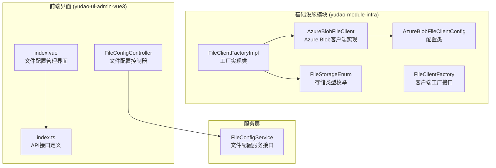
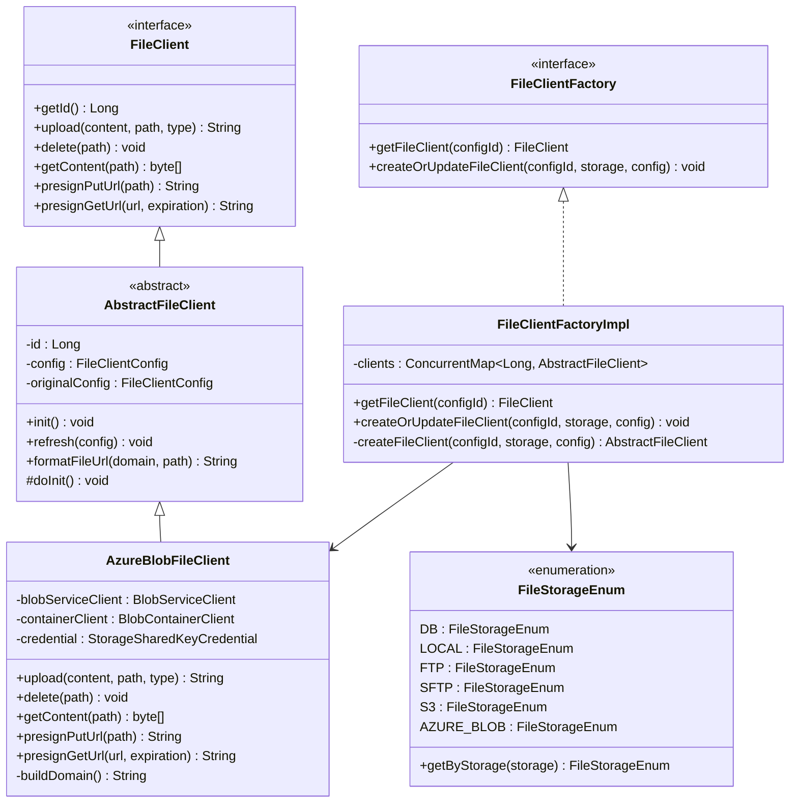
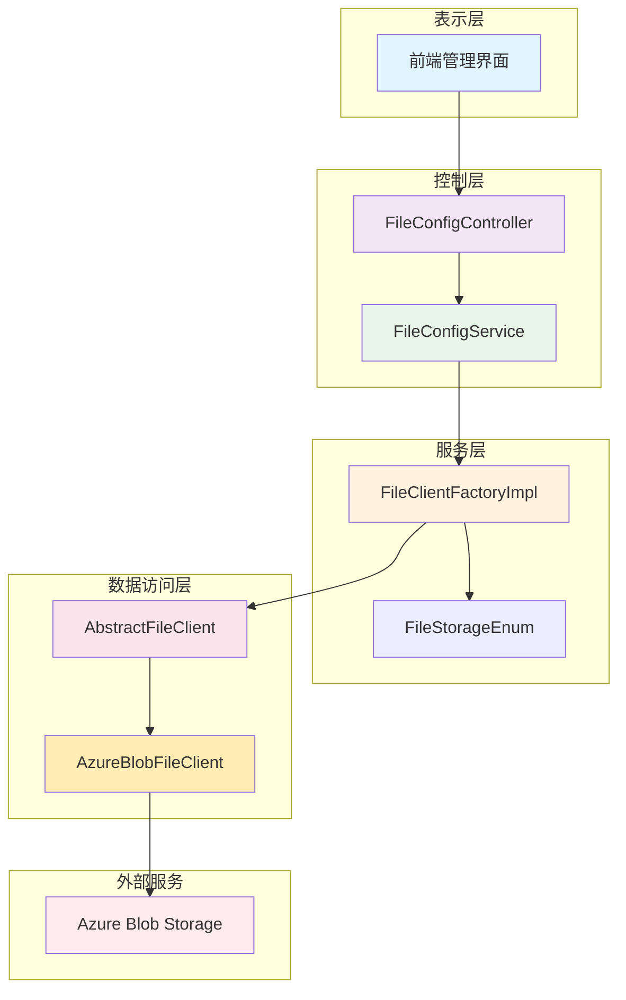
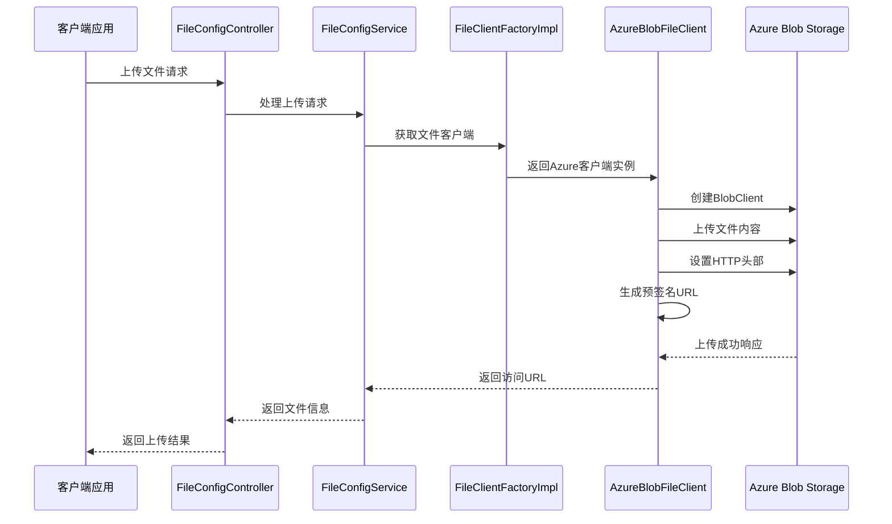
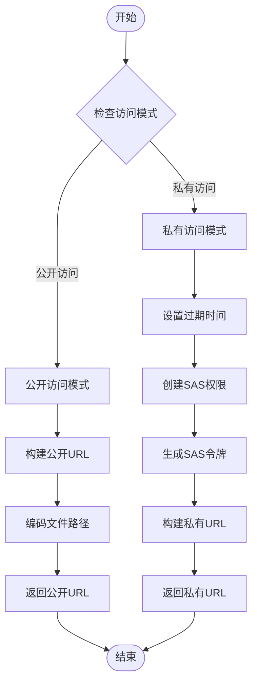
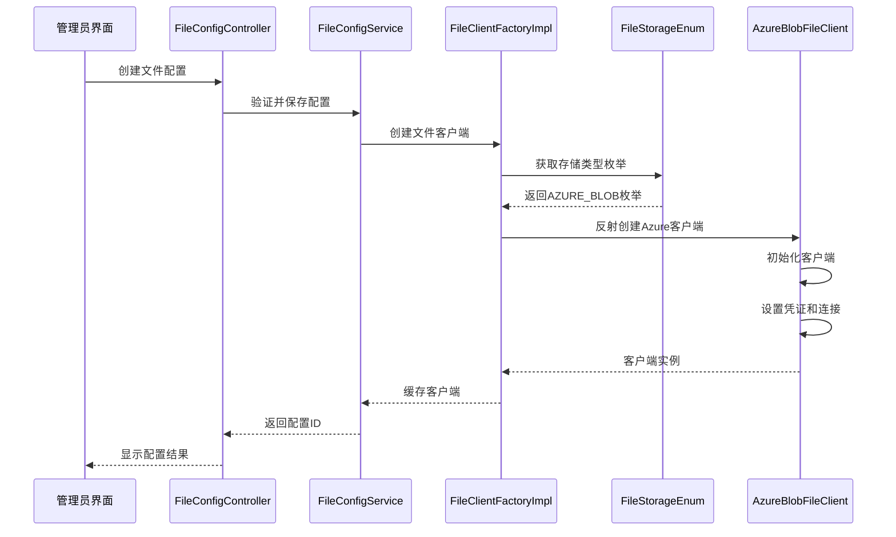
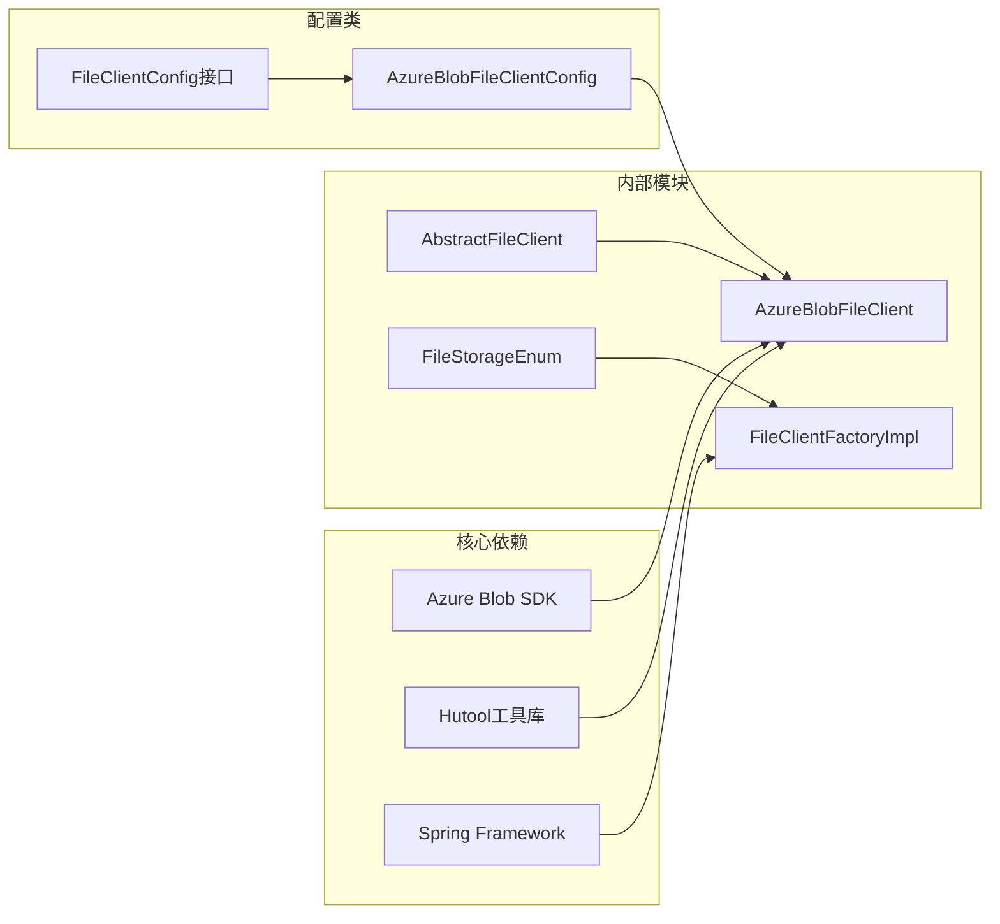

# Azure Blob存储集成

<cite>
**本文档引用的文件**
- [AzureBlobFileClient.java](file://yudao-module-infra/src/main/java/cn/iocoder/yudao/module/infra/framework/file/core/client/azure/AzureBlobFileClient.java)
- [AzureBlobFileClientConfig.java](file://yudao-module-infra/src/main/java/cn/iocoder/yudao/module/infra/framework/file/core/client/azure/AzureBlobFileClientConfig.java)
- [FileClientFactory.java](file://yudao-module-infra/src/main/java/cn/iocoder/yudao/module/infra/framework/file/core/client/FileClientFactory.java)
- [FileClientFactoryImpl.java](file://yudao-module-infra/src/main/java/cn/iocoder/yudao/module/infra/framework/file/core/client/FileClientFactoryImpl.java)
- [FileStorageEnum.java](file://yudao-module-infra/src/main/java/cn/iocoder/yudao/module/infra/framework/file/core/enums/FileStorageEnum.java)
- [FileClient.java](file://yudao-module-infra/src/main/java/cn/iocoder/yudao/module/infra/framework/file/core/client/FileClient.java)
- [AbstractFileClient.java](file://yudao-module-infra/src/main/java/cn/iocoder/yudao/module/infra/framework/file/core/client/AbstractFileClient.java)
- [FileConfigController.java](file://yudao-module-infra/src/main/java/cn/iocoder/yudao/module/infra/controller/admin/file/FileConfigController.java)
- [FileConfigService.java](file://yudao-module-infra/src/main/java/cn/iocoder/yudao/module/infra/service/file/FileConfigService.java)
- [index.ts](file://yudao-ui/yudao-ui-admin-vue3/src/api/infra/fileConfig/index.ts)
- [index.vue](file://yudao-ui/yudao-ui-admin-vue3/src/views/infra/fileConfig/index.vue)
</cite>

## 目录
1. [简介](#简介)
2. [项目结构](#项目结构)
3. [核心组件](#核心组件)
4. [架构概览](#架构概览)
5. [详细组件分析](#详细组件分析)
6. [依赖关系分析](#依赖关系分析)
7. [性能考虑](#性能考虑)
8. [故障排除指南](#故障排除指南)
9. [结论](#结论)

## 简介

本项目实现了基于Azure Blob Storage的文件存储集成，提供了完整的文件上传、下载、删除和签名访问功能。该集成采用统一的文件客户端接口设计，支持多种存储后端，并通过工厂模式实现动态配置管理。

Azure Blob存储集成为系统提供了高可用、高扩展性的云存储解决方案，支持公开访问和私有访问两种模式，以及基于SAS（Shared Access Signature）的安全访问控制。

## 项目结构

Azure Blob存储集成主要分布在以下模块中：

**图表来源**
- [AzureBlobFileClient.java:1-132](file://yudao-module-infra/src/main/java/cn/iocoder/yudao/module/infra/framework/file/core/client/azure/AzureBlobFileClient.java#L1-L132)
- [FileClientFactoryImpl.java:1-57](file://yudao-module-infra/src/main/java/cn/iocoder/yudao/module/infra/framework/file/core/client/FileClientFactoryImpl.java#L1-L57)

**章节来源**
- [AzureBlobFileClient.java:1-132](file://yudao-module-infra/src/main/java/cn/iocoder/yudao/module/infra/framework/file/core/client/azure/AzureBlobFileClient.java#L1-L132)
- [FileClientFactoryImpl.java:1-57](file://yudao-module-infra/src/main/java/cn/iocoder/yudao/module/infra/framework/file/core/client/FileClientFactoryImpl.java#L1-L57)

## 核心组件

### AzureBlobFileClient - 主要实现类

AzureBlobFileClient是Azure Blob Storage的核心实现类，继承自AbstractFileClient抽象基类，提供了完整的文件存储功能：

**核心功能特性：**
- 文件上传（支持覆盖模式）
- 文件删除
- 文件内容获取
- 预签名URL生成（PUT和GET）
- 公开/私有访问模式支持

**关键配置参数：**
- endpoint: Azure Blob服务端点
- accountName: 存储账户名
- accountKey: 存储账户密钥
- container: Blob容器名称
- domain: 自定义域名（可选）
- enablePublicAccess: 是否启用公开访问

**章节来源**
- [AzureBlobFileClient.java:22-132](file://yudao-module-infra/src/main/java/cn/iocoder/yudao/module/infra/framework/file/core/client/azure/AzureBlobFileClient.java#L22-L132)
- [AzureBlobFileClientConfig.java:9-66](file://yudao-module-infra/src/main/java/cn/iocoder/yudao/module/infra/framework/file/core/client/azure/AzureBlobFileClientConfig.java#L9-L66)

### 工厂模式设计

系统采用工厂模式管理不同类型的文件客户端：

**图表来源**
- [FileClient.java:1-66](file://yudao-module-infra/src/main/java/cn/iocoder/yudao/module/infra/framework/file/core/client/FileClient.java#L1-L66)
- [AbstractFileClient.java:1-80](file://yudao-module-infra/src/main/java/cn/iocoder/yudao/module/infra/framework/file/core/client/AbstractFileClient.java#L1-L80)
- [AzureBlobFileClient.java:29-132](file://yudao-module-infra/src/main/java/cn/iocoder/yudao/module/infra/framework/file/core/client/azure/AzureBlobFileClient.java#L29-L132)
- [FileClientFactory.java:1-25](file://yudao-module-infra/src/main/java/cn/iocoder/yudao/module/infra/framework/file/core/client/FileClientFactory.java#L1-L25)
- [FileClientFactoryImpl.java:1-57](file://yudao-module-infra/src/main/java/cn/iocoder/yudao/module/infra/framework/file/core/client/FileClientFactoryImpl.java#L1-L57)
- [FileStorageEnum.java:1-60](file://yudao-module-infra/src/main/java/cn/iocoder/yudao/module/infra/framework/file/core/enums/FileStorageEnum.java#L1-L60)

**章节来源**
- [FileClientFactory.java:1-25](file://yudao-module-infra/src/main/java/cn/iocoder/yudao/module/infra/framework/file/core/client/FileClientFactory.java#L1-L25)
- [FileClientFactoryImpl.java:1-57](file://yudao-module-infra/src/main/java/cn/iocoder/yudao/module/infra/framework/file/core/client/FileClientFactoryImpl.java#L1-L57)
- [FileStorageEnum.java:1-60](file://yudao-module-infra/src/main/java/cn/iocoder/yudao/module/infra/framework/file/core/enums/FileStorageEnum.java#L1-L60)

## 架构概览

Azure Blob存储集成采用分层架构设计，确保了系统的可扩展性和可维护性：

**图表来源**
- [FileConfigController.java:1-99](file://yudao-module-infra/src/main/java/cn/iocoder/yudao/module/infra/controller/admin/file/FileConfigController.java#L1-L99)
- [FileConfigService.java:1-95](file://yudao-module-infra/src/main/java/cn/iocoder/yudao/module/infra/service/file/FileConfigService.java#L1-L95)
- [FileClientFactoryImpl.java:1-57](file://yudao-module-infra/src/main/java/cn/iocoder/yudao/module/infra/framework/file/core/client/FileClientFactoryImpl.java#L1-L57)
- [AbstractFileClient.java:1-80](file://yudao-module-infra/src/main/java/cn/iocoder/yudao/module/infra/framework/file/core/client/AbstractFileClient.java#L1-L80)
- [AzureBlobFileClient.java:1-132](file://yudao-module-infra/src/main/java/cn/iocoder/yudao/module/infra/framework/file/core/client/azure/AzureBlobFileClient.java#L1-L132)

## 详细组件分析

### 文件上传流程

Azure Blob存储的文件上传流程如下：

**图表来源**
- [AzureBlobFileClient.java:60-68](file://yudao-module-infra/src/main/java/cn/iocoder/yudao/module/infra/framework/file/core/client/azure/AzureBlobFileClient.java#L60-L68)
- [FileConfigController.java:33-38](file://yudao-module-infra/src/main/java/cn/iocoder/yudao/module/infra/controller/admin/file/FileConfigController.java#L33-L38)

### 预签名URL生成算法

系统支持两种访问模式的URL生成：

**图表来源**
- [AzureBlobFileClient.java:92-117](file://yudao-module-infra/src/main/java/cn/iocoder/yudao/module/infra/framework/file/core/client/azure/AzureBlobFileClient.java#L92-L117)

**章节来源**
- [AzureBlobFileClient.java:60-117](file://yudao-module-infra/src/main/java/cn/iocoder/yudao/module/infra/framework/file/core/client/azure/AzureBlobFileClient.java#L60-L117)

### 配置管理流程

文件配置的管理采用统一的工厂模式：

**图表来源**
- [FileClientFactoryImpl.java:35-54](file://yudao-module-infra/src/main/java/cn/iocoder/yudao/module/infra/framework/file/core/client/FileClientFactoryImpl.java#L35-L54)
- [FileStorageEnum.java:38](file://yudao-module-infra/src/main/java/cn/iocoder/yudao/module/infra/framework/file/core/enums/FileStorageEnum.java#L38)

**章节来源**
- [FileClientFactoryImpl.java:1-57](file://yudao-module-infra/src/main/java/cn/iocoder/yudao/module/infra/framework/file/core/client/FileClientFactoryImpl.java#L1-L57)
- [FileStorageEnum.java:1-60](file://yudao-module-infra/src/main/java/cn/iocoder/yudao/module/infra/framework/file/core/enums/FileStorageEnum.java#L1-L60)

## 依赖关系分析

系统中的关键依赖关系如下：

**图表来源**
- [AzureBlobFileClient.java:7-17](file://yudao-module-infra/src/main/java/cn/iocoder/yudao/module/infra/framework/file/core/client/azure/AzureBlobFileClient.java#L7-L17)
- [AbstractFileClient.java:13](file://yudao-module-infra/src/main/java/cn/iocoder/yudao/module/infra/framework/file/core/client/AbstractFileClient.java#L13)
- [AzureBlobFileClientConfig.java:3](file://yudao-module-infra/src/main/java/cn/iocoder/yudao/module/infra/framework/file/core/client/azure/AzureBlobFileClientConfig.java#L3)

**章节来源**
- [AzureBlobFileClient.java:1-132](file://yudao-module-infra/src/main/java/cn/iocoder/yudao/module/infra/framework/file/core/client/azure/AzureBlobFileClient.java#L1-L132)
- [AbstractFileClient.java:1-80](file://yudao-module-infra/src/main/java/cn/iocoder/yudao/module/infra/framework/file/core/client/AbstractFileClient.java#L1-L80)

## 性能考虑

### 连接池管理
- 使用并发安全的客户端缓存机制
- 支持客户端配置热更新
- 避免重复创建昂贵的SDK客户端实例

### 内存优化
- 文件内容通过流式传输，避免大文件内存占用
- 采用Hutool的IO工具进行高效的数据处理
- 合理的缓冲区大小配置

### 缓存策略
- 客户端实例缓存，减少反射创建开销
- 配置变更检测，按需重新初始化
- 支持多租户隔离的客户端管理

## 故障排除指南

### 常见问题及解决方案

**1. 认证失败**
- 检查存储账户名和密钥配置
- 验证端点URL格式正确性
- 确认网络连接正常

**2. 权限不足**
- 检查容器级别的访问权限设置
- 验证SAS令牌的权限范围
- 确认自定义域名配置正确

**3. 文件上传失败**
- 检查文件大小限制
- 验证目标路径的有效性
- 确认容器存在且可写

**章节来源**
- [AzureBlobFileClient.java:42-57](file://yudao-module-infra/src/main/java/cn/iocoder/yudao/module/infra/framework/file/core/client/azure/AzureBlobFileClient.java#L42-L57)
- [AzureBlobFileClientConfig.java:24-63](file://yudao-module-infra/src/main/java/cn/iocoder/yudao/module/infra/framework/file/core/client/azure/AzureBlobFileClientConfig.java#L24-L63)

## 结论

Azure Blob存储集成提供了完整、可靠的云存储解决方案。通过统一的接口设计和工厂模式，系统实现了高度的可扩展性和可维护性。该集成支持多种访问模式，具备良好的安全性控制和性能表现，能够满足企业级应用的文件存储需求。

主要优势包括：
- 完整的文件生命周期管理
- 灵活的访问控制策略
- 高效的客户端管理机制
- 丰富的错误处理和监控能力
- 用户友好的配置管理界面

该实现为后续的功能扩展和性能优化奠定了坚实的基础。