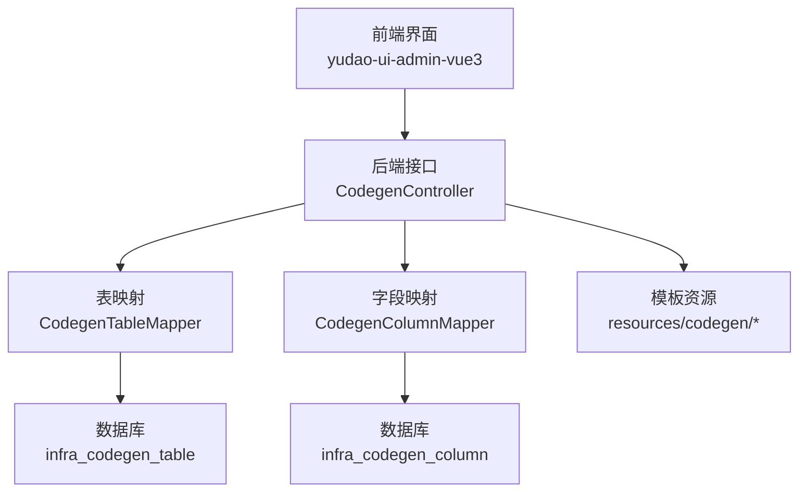
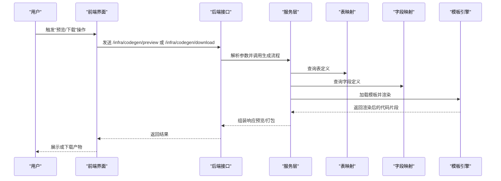
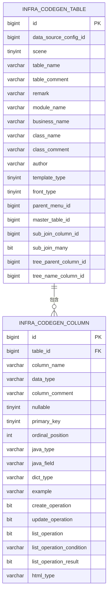
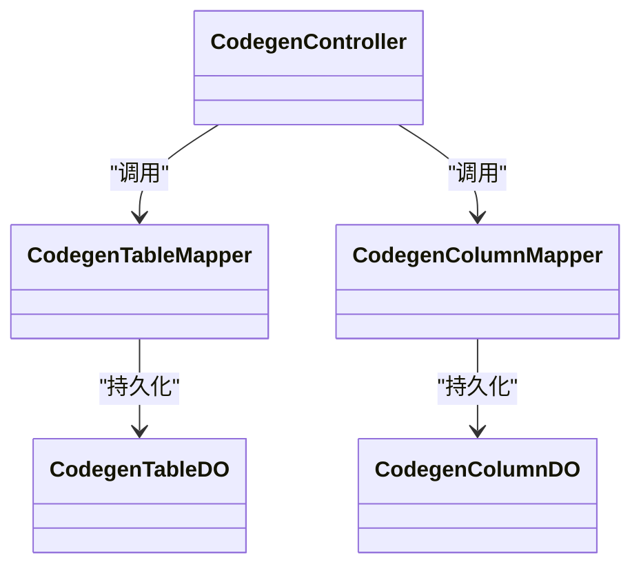

# 代码生成器

<cite>
**本文引用的文件**
- [yudao-module-infra/src/main/java/cn/iocoder/yudao/module/infra/controller/admin/codegen/CodegenController.java](file://yudao-module-infra/src/main/java/cn/iocoder/yudao/module/infra/controller/admin/codegen/CodegenController.java)
- [yudao-module-infra/src/main/java/cn/iocoder/yudao/module/infra/controller/admin/codegen/vo/CodegenCreateListReqVO.java](file://yudao-module-infra/src/main/java/cn/iocoder/yudao/module/infra/controller/admin/codegen/vo/CodegenCreateListReqVO.java)
- [yudao-module-infra/src/main/java/cn/iocoder/yudao/module/infra/controller/admin/codegen/vo/CodegenDetailRespVO.java](file://yudao-module-infra/src/main/java/cn/iocoder/yudao/module/infra/controller/admin/codegen/vo/CodegenDetailRespVO.java)
- [yudao-module-infra/src/main/java/cn/iocoder/yudao/module/infra/controller/admin/codegen/vo/CodegenPreviewRespVO.java](file://yudao-module-infra/src/main/java/cn/iocoder/yudao/module/infra/controller/admin/codegen/vo/CodegenPreviewRespVO.java)
- [yudao-module-infra/src/main/java/cn/iocoder/yudao/module/infra/controller/admin/codegen/vo/CodegenUpdateReqVO.java](file://yudao-module-infra/src/main/java/cn/iocoder/yudao/module/infra/controller/admin/codegen/vo/CodegenUpdateReqVO.java)
- [yudao-module-infra/src/main/java/cn/iocoder/yudao/module/infra/controller/admin/codegen/vo/column/CodegenColumnRespVO.java](file://yudao-module-infra/src/main/java/cn/iocoder/yudao/module/infra/controller/admin/codegen/vo/column/CodegenColumnRespVO.java)
- [yudao-module-infra/src/main/java/cn/iocoder/yudao/module/infra/controller/admin/codegen/vo/column/CodegenColumnSaveReqVO.java](file://yudao-module-infra/src/main/java/cn/iocoder/yudao/module/infra/controller/admin/codegen/vo/column/CodegenColumnSaveReqVO.java)
- [yudao-module-infra/src/main/java/cn/iocoder/yudao/module/infra/controller/admin/codegen/vo/table/CodegenTablePageReqVO.java](file://yudao-module-infra/src/main/java/cn/iocoder/yudao/module/infra/controller/admin/codegen/vo/table/CodegenTablePageReqVO.java)
- [yudao-module-infra/src/main/java/cn/iocoder/yudao/module/infra/controller/admin/codegen/vo/table/CodegenTableRespVO.java](file://yudao-module-infra/src/main/java/cn/iocoder/yudao/module/infra/controller/admin/codegen/vo/table/CodegenTableRespVO.java)
- [yudao-module-infra/src/main/java/cn/iocoder/yudao/module/infra/controller/admin/codegen/vo/table/CodegenTableSaveReqVO.java](file://yudao-module-infra/src/main/java/cn/iocoder/yudao/module/infra/controller/admin/codegen/vo/table/CodegenTableSaveReqVO.java)
- [yudao-module-infra/src/main/java/cn/iocoder/yudao/module/infra/convert/codegen/CodegenConvert.java](file://yudao-module-infra/src/main/java/cn/iocoder/yudao/module/infra/convert/codegen/CodegenConvert.java)
- [yudao-module-infra/src/main/java/cn/iocoder/yudao/module/infra/dal/dataobject/codegen/CodegenTableDO.java](file://yudao-module-infra/src/main/java/cn/iocoder/yudao/module/infra/dal/dataobject/codegen/CodegenTableDO.java)
- [yudao-module-infra/src/main/java/cn/iocoder/yudao/module/infra/dal/dataobject/codegen/CodegenColumnDO.java](file://yudao-module-infra/src/main/java/cn/iocoder/yudao/module/infra/dal/dataobject/codegen/CodegenColumnDO.java)
- [yudao-module-infra/src/main/java/cn/iocoder/yudao/module/infra/dal/mysql/codegen/CodegenTableMapper.java](file://yudao-module-infra/src/main/java/cn/iocoder/yudao/module/infra/dal/mysql/codegen/CodegenTableMapper.java)
- [yudao-module-infra/src/main/java/cn/iocoder/yudao/module/infra/dal/mysql/codegen/CodegenColumnMapper.java](file://yudao-module-infra/src/main/java/cn/iocoder/yudao/module/infra/dal/mysql/codegen/CodegenColumnMapper.java)
- [yudao-module-infra/src/main/java/cn/iocoder/yudao/module/infra/enums/codegen/CodegenColumnHtmlTypeEnum.java](file://yudao-module-infra/src/main/java/cn/iocoder/yudao/module/infra/enums/codegen/CodegenColumnHtmlTypeEnum.java)
- [yudao-module-infra/src/main/java/cn/iocoder/yudao/module/infra/enums/codegen/CodegenColumnListConditionEnum.java](file://yudao-module-infra/src/main/java/cn/iocoder/yudao/module/infra/enums/codegen/CodegenColumnListConditionEnum.java)
- [yudao-module-infra/src/main/java/cn/iocoder/yudao/module/infra/enums/codegen/CodegenFrontTypeEnum.java](file://yudao-module-infra/src/main/java/cn/iocoder/yudao/module/infra/enums/codegen/CodegenFrontTypeEnum.java)
- [yudao-module-infra/src/main/java/cn/iocoder/yudao/module/infra/enums/codegen/CodegenSceneEnum.java](file://yudao-module-infra/src/main/java/cn/iocoder/yudao/module/infra/enums/codegen/CodegenSceneEnum.java)
- [yudao-module-infra/src/main/java/cn/iocoder/yudao/module/infra/enums/codegen/CodegenTemplateTypeEnum.java](file://yudao-module-infra/src/main/java/cn/iocoder/yudao/module/infra/enums/codegen/CodegenTemplateTypeEnum.java)
- [yudao-module-infra/src/main/resources/codegen/java/controller/controller.vm](file://yudao-module-infra/src/main/resources/codegen/java/controller/controller.vm)
- [yudao-module-infra/src/main/resources/codegen/java/dal/do.vm](file://yudao-module-infra/src/main/resources/codegen/java/dal/do.vm)
- [yudao-module-infra/src/main/resources/codegen/java/dal/mapper.vm](file://yudao-module-infra/src/main/resources/codegen/java/dal/mapper.vm)
- [yudao-module-infra/src/main/resources/codegen/java/dal/mapper.xml.vm](file://yudao-module-infra/src/main/resources/codegen/java/dal/mapper.xml.vm)
- [yudao-module-infra/src/main/resources/codegen/java/service/service.vm](file://yudao-module-infra/src/main/resources/codegen/java/service/service.vm)
- [yudao-module-infra/src/main/resources/codegen/java/service/serviceImpl.vm](file://yudao-module-infra/src/main/resources/codegen/java/service/serviceImpl.vm)
- [yudao-module-infra/src/main/resources/codegen/vue3/views/form.vue.vm](file://yudao-module-infra/src/main/resources/codegen/vue3/views/form.vue.vm)
- [yudao-module-infra/src/main/resources/codegen/vue3/views/index.vue.vm](file://yudao-module-infra/src/main/resources/codegen/vue3/views/index.vue.vm)
- [yudao-module-infra/src/main/resources/codegen/vue3/api/api.ts.vm](file://yudao-module-infra/src/main/resources/codegen/vue3/api/api.ts.vm)
- [yudao-module-infra/src/main/resources/codegen/vue3_admin_uniapp/views/form/index.vue.vm](file://yudao-module-infra/src/main/resources/codegen/vue3_admin_uniapp/views/form/index.vue.vm)
- [yudao-module-infra/src/main/resources/codegen/vue3_vben5_antd/views/modules/form.vue.vm](file://yudao-module-infra/src/main/resources/codegen/vue3_vben5_antd/views/modules/form.vue.vm)
- [yudao-module-infra/src/test/resources/sql/create_tables.sql](file://yudao-module-infra/src/test/resources/sql/create_tables.sql)
- [yudao-ui/yudao-ui-admin-vue3/src/api/infra/codegen/index.ts](file://yudao-ui/yudao-ui-admin-vue3/src/api/infra/codegen/index.ts)
- [yudao-ui/yudao-ui-admin-vue3/src/utils/constants.ts](file://yudao-ui/yudao-ui-admin-vue3/src/utils/constants.ts)
</cite>

## 目录
1. [引言](#引言)
2. [项目结构](#项目结构)
3. [核心组件](#核心组件)
4. [架构总览](#架构总览)
5. [详细组件分析](#详细组件分析)
6. [依赖关系分析](#依赖关系分析)
7. [性能考虑](#性能考虑)
8. [故障排查指南](#故障排查指南)
9. [结论](#结论)
10. [附录](#附录)

## 引言
本文件系统化梳理该代码生成器的技术架构与实现细节，覆盖模板引擎集成、代码渲染机制、文件输出策略；详述支持的模板类型（Java 实体类、Mapper 接口、Service 实现、Controller 控制器、前端页面代码）；说明代码生成配置项（表结构映射、字段类型转换、注解生成、命名规则）；介绍批量生成功能、增量更新机制与版本兼容性处理；提供自定义模板开发指南、配置示例与最佳实践，并给出实际使用案例与常见问题解决方案。

## 项目结构
代码生成器由“前端界面 + 后端接口 + 模板资源 + 数据模型”四部分组成：
- 前端：通过 API 调用后端，提供表定义与字段定义的增删改查、预览与下载等操作。
- 后端：提供代码生成相关接口、数据对象与持久层、枚举与 VO/DTO 映射。
- 模板资源：位于资源目录下的多套模板，覆盖 Java 层与多种前端框架（Vue3、Admin UniApp、Vben Antd 等）。
- 数据模型：数据库表 infra_codegen_table 与 infra_codegen_column 存储表与字段的生成配置。

图表来源
- [yudao-ui/yudao-ui-admin-vue3/src/api/infra/codegen/index.ts](file://yudao-ui/yudao-ui-admin-vue3/src/api/infra/codegen/index.ts)
- [yudao-module-infra/src/main/java/cn/iocoder/yudao/module/infra/controller/admin/codegen/CodegenController.java](file://yudao-module-infra/src/main/java/cn/iocoder/yudao/module/infra/controller/admin/codegen/CodegenController.java)
- [yudao-module-infra/src/main/java/cn/iocoder/yudao/module/infra/dal/mysql/codegen/CodegenTableMapper.java](file://yudao-module-infra/src/main/java/cn/iocoder/yudao/module/infra/dal/mysql/codegen/CodegenTableMapper.java)
- [yudao-module-infra/src/main/java/cn/iocoder/yudao/module/infra/dal/mysql/codegen/CodegenColumnMapper.java](file://yudao-module-infra/src/main/java/cn/iocoder/yudao/module/infra/dal/mysql/codegen/CodegenColumnMapper.java)
- [yudao-module-infra/src/main/resources/codegen/java/controller/controller.vm](file://yudao-module-infra/src/main/resources/codegen/java/controller/controller.vm)

章节来源
- [yudao-module-infra/src/main/java/cn/iocoder/yudao/module/infra/controller/admin/codegen/CodegenController.java](file://yudao-module-infra/src/main/java/cn/iocoder/yudao/module/infra/controller/admin/codegen/CodegenController.java)
- [yudao-ui/yudao-ui-admin-vue3/src/api/infra/codegen/index.ts](file://yudao-ui/yudao-ui-admin-vue3/src/api/infra/codegen/index.ts)

## 核心组件
- 前端 API 封装：提供获取表列表、分页查询、详情、修改、从数据库同步、预览、下载、批量创建、删除等方法。
- 后端控制器：暴露 /infra/codegen 下的 REST 接口，负责接收请求、调用服务层、返回响应。
- 数据访问层：分别对表与字段进行持久化，支持分页、保存、删除、同步等。
- 枚举与 VO：定义模板类型、前端类型、场景、HTML 类型、列表条件等，以及传输对象。
- 模板资源：多语言模板，覆盖 Java 后端与多种前端框架。

章节来源
- [yudao-ui/yudao-ui-admin-vue3/src/api/infra/codegen/index.ts](file://yudao-ui/yudao-ui-admin-vue3/src/api/infra/codegen/index.ts)
- [yudao-module-infra/src/main/java/cn/iocoder/yudao/module/infra/controller/admin/codegen/CodegenController.java](file://yudao-module-infra/src/main/java/cn/iocoder/yudao/module/infra/controller/admin/codegen/CodegenController.java)
- [yudao-module-infra/src/main/java/cn/iocoder/yudao/module/infra/dal/mysql/codegen/CodegenTableMapper.java](file://yudao-module-infra/src/main/java/cn/iocoder/yudao/module/infra/dal/mysql/codegen/CodegenTableMapper.java)
- [yudao-module-infra/src/main/java/cn/iocoder/yudao/module/infra/dal/mysql/codegen/CodegenColumnMapper.java](file://yudao-module-infra/src/main/java/cn/iocoder/yudao/module/infra/dal/mysql/codegen/CodegenColumnMapper.java)
- [yudao-module-infra/src/main/java/cn/iocoder/yudao/module/infra/enums/codegen/CodegenTemplateTypeEnum.java](file://yudao-module-infra/src/main/java/cn/iocoder/yudao/module/infra/enums/codegen/CodegenTemplateTypeEnum.java)
- [yudao-module-infra/src/main/java/cn/iocoder/yudao/module/infra/enums/codegen/CodegenFrontTypeEnum.java](file://yudao-module-infra/src/main/java/cn/iocoder/yudao/module/infra/enums/codegen/CodegenFrontTypeEnum.java)
- [yudao-module-infra/src/main/java/cn/iocoder/yudao/module/infra/enums/codegen/CodegenSceneEnum.java](file://yudao-module-infra/src/main/java/cn/iocoder/yudao/module/infra/enums/codegen/CodegenSceneEnum.java)
- [yudao-module-infra/src/main/java/cn/iocoder/yudao/module/infra/enums/codegen/CodegenColumnHtmlTypeEnum.java](file://yudao-module-infra/src/main/java/cn/iocoder/yudao/module/infra/enums/codegen/CodegenColumnHtmlTypeEnum.java)
- [yudao-module-infra/src/main/java/cn/iocoder/yudao/module/infra/enums/codegen/CodegenColumnListConditionEnum.java](file://yudao-module-infra/src/main/java/cn/iocoder/yudao/module/infra/enums/codegen/CodegenColumnListConditionEnum.java)

## 架构总览
整体采用前后端分离架构：前端通过 axios 请求后端接口；后端控制器接收请求参数，调用服务层完成业务逻辑（如从数据库读取表/字段信息、根据模板渲染代码），并将结果以预览或下载形式返回给前端。

图表来源
- [yudao-ui/yudao-ui-admin-vue3/src/api/infra/codegen/index.ts](file://yudao-ui/yudao-ui-admin-vue3/src/api/infra/codegen/index.ts)
- [yudao-module-infra/src/main/java/cn/iocoder/yudao/module/infra/controller/admin/codegen/CodegenController.java](file://yudao-module-infra/src/main/java/cn/iocoder/yudao/module/infra/controller/admin/codegen/CodegenController.java)

## 详细组件分析

### 前端 API 与交互
- 提供获取表列表、分页查询、详情、修改、从数据库同步、预览、下载、批量创建、删除等方法。
- 支持基于数据库的表结构创建代码生成器的表定义，并支持批量删除。

章节来源
- [yudao-ui/yudao-ui-admin-vue3/src/api/infra/codegen/index.ts](file://yudao-ui/yudao-ui-admin-vue3/src/api/infra/codegen/index.ts)

### 后端控制器与路由
- 控制器暴露 /infra/codegen 下的 REST 接口，包括：
  - 获取表列表与分页
  - 获取详情
  - 更新表定义
  - 从数据库同步表与字段
  - 预览生成代码
  - 下载生成代码
  - 基于数据库表批量创建代码生成定义
  - 删除单个或批量删除

章节来源
- [yudao-module-infra/src/main/java/cn/iocoder/yudao/module/infra/controller/admin/codegen/CodegenController.java](file://yudao-module-infra/src/main/java/cn/iocoder/yudao/module/infra/controller/admin/codegen/CodegenController.java)

### 数据模型与持久层
- 表定义：infra_codegen_table，存储模块名、业务名、类名、作者、模板类型、前端类型、父菜单等。
- 字段定义：infra_codegen_column，存储列名、数据类型、Java 类型、Java 字段、字典类型、示例、HTML 类型、列表条件等。
- 持久层：提供表与字段的 Mapper 接口，支持分页、保存、删除、同步等。

图表来源
- [yudao-module-infra/src/test/resources/sql/create_tables.sql](file://yudao-module-infra/src/test/resources/sql/create_tables.sql)

章节来源
- [yudao-module-infra/src/test/resources/sql/create_tables.sql](file://yudao-module-infra/src/test/resources/sql/create_tables.sql)
- [yudao-module-infra/src/main/java/cn/iocoder/yudao/module/infra/dal/mysql/codegen/CodegenTableMapper.java](file://yudao-module-infra/src/main/java/cn/iocoder/yudao/module/infra/dal/mysql/codegen/CodegenTableMapper.java)
- [yudao-module-infra/src/main/java/cn/iocoder/yudao/module/infra/dal/mysql/codegen/CodegenColumnMapper.java](file://yudao-module-infra/src/main/java/cn/iocoder/yudao/module/infra/dal/mysql/codegen/CodegenColumnMapper.java)

### 模板类型与渲染机制
- Java 后端模板族：
  - 实体类：do.vm、do_sub.vm
  - Mapper 接口与 XML：mapper.vm、mapper.xml.vm
  - Service 接口与实现：service.vm、serviceImpl.vm
  - Controller 控制器：controller.vm
  - 测试：serviceTest.vm
- 前端模板族：
  - Vue3：views/form.vue.vm、views/index.vue.vm、api/api.ts.vm
  - Admin UniApp：views/form/index.vue.vm 等
  - Vben Antd 系列：general/views/modules/form.vue.vm 等
- 渲染机制：后端根据表与字段配置加载对应模板，填充变量（如类名、字段、注解、导入包等），最终输出代码字符串用于预览或打包下载。

章节来源
- [yudao-module-infra/src/main/resources/codegen/java/dal/do.vm](file://yudao-module-infra/src/main/resources/codegen/java/dal/do.vm)
- [yudao-module-infra/src/main/resources/codegen/java/dal/mapper.vm](file://yudao-module-infra/src/main/resources/codegen/java/dal/mapper.vm)
- [yudao-module-infra/src/main/resources/codegen/java/dal/mapper.xml.vm](file://yudao-module-infra/src/main/resources/codegen/java/dal/mapper.xml.vm)
- [yudao-module-infra/src/main/resources/codegen/java/service/service.vm](file://yudao-module-infra/src/main/resources/codegen/java/service/service.vm)
- [yudao-module-infra/src/main/resources/codegen/java/service/serviceImpl.vm](file://yudao-module-infra/src/main/resources/codegen/java/service/serviceImpl.vm)
- [yudao-module-infra/src/main/resources/codegen/java/controller/controller.vm](file://yudao-module-infra/src/main/resources/codegen/java/controller/controller.vm)
- [yudao-module-infra/src/main/resources/codegen/vue3/views/form.vue.vm](file://yudao-module-infra/src/main/resources/codegen/vue3/views/form.vue.vm)
- [yudao-module-infra/src/main/resources/codegen/vue3/views/index.vue.vm](file://yudao-module-infra/src/main/resources/codegen/vue3/views/index.vue.vm)
- [yudao-module-infra/src/main/resources/codegen/vue3/api/api.ts.vm](file://yudao-module-infra/src/main/resources/codegen/vue3/api/api.ts.vm)
- [yudao-module-infra/src/main/resources/codegen/vue3_admin_uniapp/views/form/index.vue.vm](file://yudao-module-infra/src/main/resources/codegen/vue3_admin_uniapp/views/form/index.vue.vm)
- [yudao-module-infra/src/main/resources/codegen/vue3_vben5_antd/views/modules/form.vue.vm](file://yudao-module-infra/src/main/resources/codegen/vue3_vben5_antd/views/modules/form.vue.vm)

### 配置项与命名规则
- 模板类型：CRUD、树形、主子表等，由枚举定义并存储于表定义中。
- 场景：如基础 CRUD、树形结构、主子表等场景控制生成内容差异。
- 前端类型：前端框架类型（如 Vue3、Admin UniApp、Vben Antd 等）。
- 字段类型转换：字段定义中包含 Java 类型与 HTML 类型，用于模板渲染。
- 注解与字典：字段可配置字典类型、示例值、列表条件等，模板中按需输出注解与校验。
- 命名规则：模块名、业务名、类名、类注释、作者等统一在表定义中配置。

章节来源
- [yudao-module-infra/src/main/java/cn/iocoder/yudao/module/infra/enums/codegen/CodegenTemplateTypeEnum.java](file://yudao-module-infra/src/main/java/cn/iocoder/yudao/module/infra/enums/codegen/CodegenTemplateTypeEnum.java)
- [yudao-module-infra/src/main/java/cn/iocoder/yudao/module/infra/enums/codegen/CodegenSceneEnum.java](file://yudao-module-infra/src/main/java/cn/iocoder/yudao/module/infra/enums/codegen/CodegenSceneEnum.java)
- [yudao-module-infra/src/main/java/cn/iocoder/yudao/module/infra/enums/codegen/CodegenFrontTypeEnum.java](file://yudao-module-infra/src/main/java/cn/iocoder/yudao/module/infra/enums/codegen/CodegenFrontTypeEnum.java)
- [yudao-module-infra/src/main/java/cn/iocoder/yudao/module/infra/enums/codegen/CodegenColumnHtmlTypeEnum.java](file://yudao-module-infra/src/main/java/cn/iocoder/yudao/module/infra/enums/codegen/CodegenColumnHtmlTypeEnum.java)
- [yudao-module-infra/src/main/java/cn/iocoder/yudao/module/infra/enums/codegen/CodegenColumnListConditionEnum.java](file://yudao-module-infra/src/main/java/cn/iocoder/yudao/module/infra/enums/codegen/CodegenColumnListConditionEnum.java)
- [yudao-ui/yudao-ui-admin-vue3/src/utils/constants.ts](file://yudao-ui/yudao-ui-admin-vue3/src/utils/constants.ts)

### 批量生成功能与增量更新
- 批量创建：基于数据库表结构批量创建代码生成器的表定义。
- 增量更新：支持从数据库同步表与字段定义，自动更新字段类型、是否为空、主键、排序、Java 类型、HTML 类型等。
- 删除：支持单个与批量删除表定义。

章节来源
- [yudao-ui/yudao-ui-admin-vue3/src/api/infra/codegen/index.ts](file://yudao-ui/yudao-ui-admin-vue3/src/api/infra/codegen/index.ts)
- [yudao-module-infra/src/main/java/cn/iocoder/yudao/module/infra/controller/admin/codegen/CodegenController.java](file://yudao-module-infra/src/main/java/cn/iocoder/yudao/module/infra/controller/admin/codegen/CodegenController.java)

### 文件输出策略
- 预览：后端将渲染后的代码以列表形式返回，前端展示。
- 下载：后端将多个文件打包为压缩包返回，前端触发浏览器下载。

章节来源
- [yudao-module-infra/src/main/java/cn/iocoder/yudao/module/infra/controller/admin/codegen/CodegenController.java](file://yudao-module-infra/src/main/java/cn/iocoder/yudao/module/infra/controller/admin/codegen/CodegenController.java)
- [yudao-ui/yudao-ui-admin-vue3/src/api/infra/codegen/index.ts](file://yudao-ui/yudao-ui-admin-vue3/src/api/infra/codegen/index.ts)

### 自定义模板开发指南
- 模板位置：resources/codegen/{language}/{layer}/
- 开发步骤：
  1) 在对应目录下新增 .vm 模板文件；
  2) 在模板中使用变量占位符（如类名、字段集合、注解等）；
  3) 在后端根据表/字段配置加载模板并渲染；
  4) 将渲染结果作为预览或打包下载。
- 最佳实践：
  - 保持变量命名一致，便于前后端协作；
  - 模板内按需输出注解与导入包；
  - 针对不同前端框架提供独立模板族，避免交叉污染。

章节来源
- [yudao-module-infra/src/main/resources/codegen/java/controller/controller.vm](file://yudao-module-infra/src/main/resources/codegen/java/controller/controller.vm)
- [yudao-module-infra/src/main/resources/codegen/java/dal/do.vm](file://yudao-module-infra/src/main/resources/codegen/java/dal/do.vm)
- [yudao-module-infra/src/main/resources/codegen/java/dal/mapper.vm](file://yudao-module-infra/src/main/resources/codegen/java/dal/mapper.vm)
- [yudao-module-infra/src/main/resources/codegen/java/dal/mapper.xml.vm](file://yudao-module-infra/src/main/resources/codegen/java/dal/mapper.xml.vm)
- [yudao-module-infra/src/main/resources/codegen/java/service/service.vm](file://yudao-module-infra/src/main/resources/codegen/java/service/service.vm)
- [yudao-module-infra/src/main/resources/codegen/java/service/serviceImpl.vm](file://yudao-module-infra/src/main/resources/codegen/java/service/serviceImpl.vm)
- [yudao-module-infra/src/main/resources/codegen/vue3/views/form.vue.vm](file://yudao-module-infra/src/main/resources/codegen/vue3/views/form.vue.vm)
- [yudao-module-infra/src/main/resources/codegen/vue3/views/index.vue.vm](file://yudao-module-infra/src/main/resources/codegen/vue3/views/index.vue.vm)
- [yudao-module-infra/src/main/resources/codegen/vue3/api/api.ts.vm](file://yudao-module-infra/src/main/resources/codegen/vue3/api/api.ts.vm)
- [yudao-module-infra/src/main/resources/codegen/vue3_admin_uniapp/views/form/index.vue.vm](file://yudao-module-infra/src/main/resources/codegen/vue3_admin_uniapp/views/form/index.vue.vm)
- [yudao-module-infra/src/main/resources/codegen/vue3_vben5_antd/views/modules/form.vue.vm](file://yudao-module-infra/src/main/resources/codegen/vue3_vben5_antd/views/modules/form.vue.vm)

### 版本兼容性处理
- 模板版本：通过模板文件名与目录结构区分不同版本或框架风格。
- 字段兼容：字段定义中包含 HTML 类型、列表条件等，便于在不同前端版本中适配。
- 建议：在升级前端框架时，保留旧模板并新增新模板，逐步迁移。

章节来源
- [yudao-module-infra/src/main/java/cn/iocoder/yudao/module/infra/enums/codegen/CodegenFrontTypeEnum.java](file://yudao-module-infra/src/main/java/cn/iocoder/yudao/module/infra/enums/codegen/CodegenFrontTypeEnum.java)
- [yudao-module-infra/src/main/java/cn/iocoder/yudao/module/infra/enums/codegen/CodegenColumnHtmlTypeEnum.java](file://yudao-module-infra/src/main/java/cn/iocoder/yudao/module/infra/enums/codegen/CodegenColumnHtmlTypeEnum.java)

## 依赖关系分析
- 控制器依赖服务层（未在本仓库直接展示，但通过接口契约可知）。
- 服务层依赖 Mapper（表与字段）。
- Mapper 依赖数据库表 infra_codegen_table 与 infra_codegen_column。
- 前端依赖后端接口，接口返回预览或下载结果。

图表来源
- [yudao-module-infra/src/main/java/cn/iocoder/yudao/module/infra/controller/admin/codegen/CodegenController.java](file://yudao-module-infra/src/main/java/cn/iocoder/yudao/module/infra/controller/admin/codegen/CodegenController.java)
- [yudao-module-infra/src/main/java/cn/iocoder/yudao/module/infra/dal/mysql/codegen/CodegenTableMapper.java](file://yudao-module-infra/src/main/java/cn/iocoder/yudao/module/infra/dal/mysql/codegen/CodegenTableMapper.java)
- [yudao-module-infra/src/main/java/cn/iocoder/yudao/module/infra/dal/mysql/codegen/CodegenColumnMapper.java](file://yudao-module-infra/src/main/java/cn/iocoder/yudao/module/infra/dal/mysql/codegen/CodegenColumnMapper.java)
- [yudao-module-infra/src/main/java/cn/iocoder/yudao/module/infra/dal/dataobject/codegen/CodegenTableDO.java](file://yudao-module-infra/src/main/java/cn/iocoder/yudao/module/infra/dal/dataobject/codegen/CodegenTableDO.java)
- [yudao-module-infra/src/main/java/cn/iocoder/yudao/module/infra/dal/dataobject/codegen/CodegenColumnDO.java](file://yudao-module-infra/src/main/java/cn/iocoder/yudao/module/infra/dal/dataobject/codegen/CodegenColumnDO.java)

## 性能考虑
- 模板渲染：建议在服务层对模板进行缓存与复用，减少重复解析开销。
- 数据查询：分页查询与条件过滤，避免一次性加载大量字段。
- 下载打包：对大体量文件建议流式输出，降低内存占用。
- 并发控制：批量生成时注意数据库锁与事务边界，避免长时间阻塞。

## 故障排查指南
- 预览为空：检查表与字段是否已正确保存，确认模板变量是否完整。
- 下载失败：确认后端已正确组装文件并返回压缩包，前端下载接口是否正常。
- 同步异常：检查数据源配置是否正确，数据库连接是否可用。
- 前端报错：核对枚举值与模板类型是否匹配，确保前端常量与后端一致。

章节来源
- [yudao-ui/yudao-ui-admin-vue3/src/utils/constants.ts](file://yudao-ui/yudao-ui-admin-vue3/src/utils/constants.ts)
- [yudao-module-infra/src/main/java/cn/iocoder/yudao/module/infra/enums/codegen/CodegenTemplateTypeEnum.java](file://yudao-module-infra/src/main/java/cn/iocoder/yudao/module/infra/enums/codegen/CodegenTemplateTypeEnum.java)

## 结论
该代码生成器通过清晰的前后端分工、完善的模板体系与灵活的配置项，实现了 Java 后端与多前端框架的快速代码生成。其支持批量生成、增量更新与版本兼容，具备良好的扩展性与可维护性。建议在团队内规范模板命名与变量约定，配合 CI/CD 实现自动化生成与校验。

## 附录
- 使用案例（示意）：
  - 新建表：在数据库中创建目标表，使用“基于数据库的表结构创建代码生成器的表定义”，选择模板类型与前端类型，填写模块名、业务名、类名等。
  - 预览与调整：点击“预览生成代码”，根据需要调整字段属性（如 Java 类型、HTML 类型、是否参与列表等），再次预览确认。
  - 下载与集成：确认无误后“下载生成代码”，将产物集成到对应模块中。
- 常见问题：
  - 字段类型不匹配：在字段定义中修正 Java 类型与 HTML 类型。
  - 前端框架不兼容：切换前端类型或复制对应模板族至新目录并按需修改。
  - 同步失败：检查数据源配置与数据库连通性。