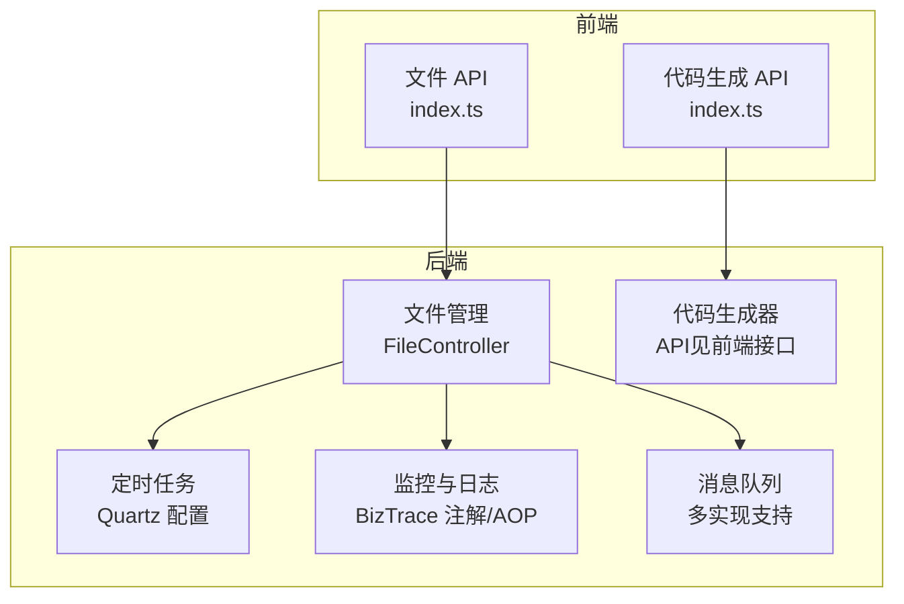
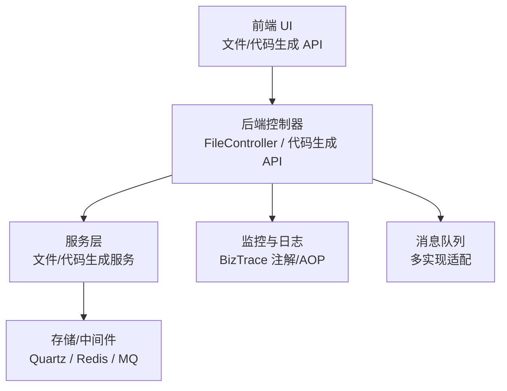
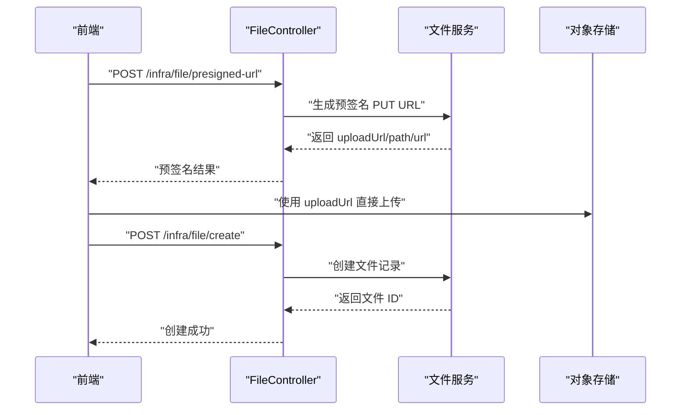
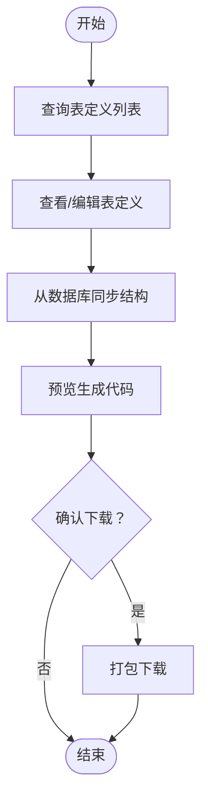
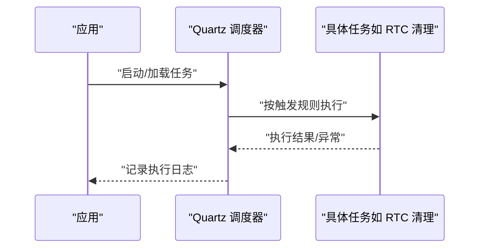
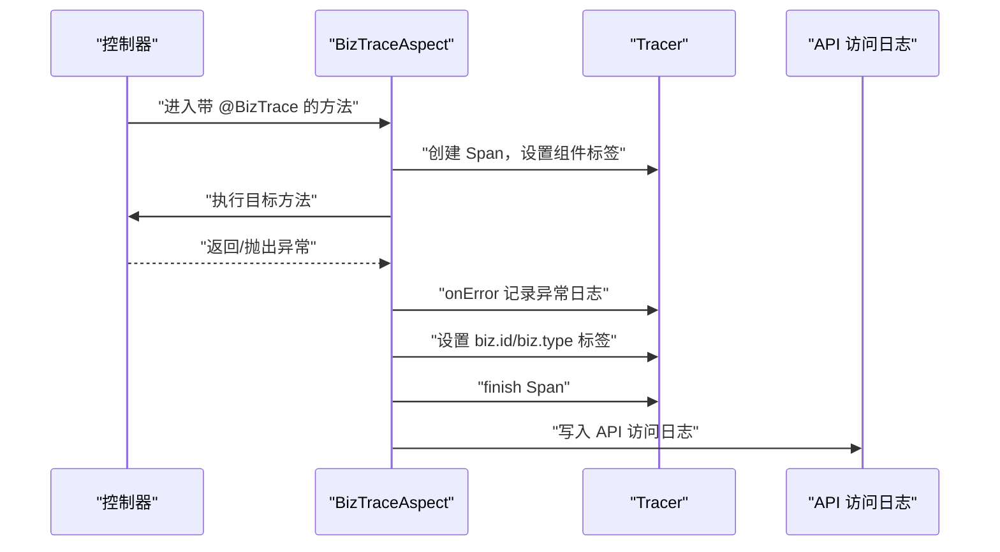
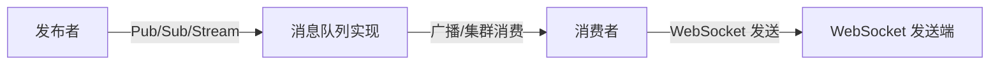
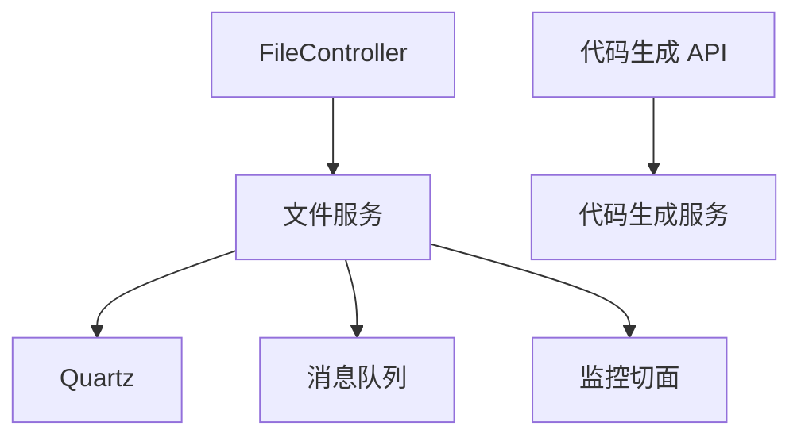

# 基础设施模块

<cite>
**本文引用的文件**
- [FileController.java](file://yudao-module-infra/src/main/java/cn/iocoder/yudao/module/infra/controller/admin/file/FileController.java)
- [FileCreateReqVO.java](file://yudao-module-infra/src/main/java/cn/iocoder/yudao/module/infra/controller/admin/file/vo/file/FileCreateReqVO.java)
- [index.ts（文件 API）](file://yudao-ui/yudao-ui-admin-vue3/src/api/infra/file/index.ts)
- [index.ts（代码生成 API）](file://yudao-ui/yudao-ui-admin-vue3/src/api/infra/codegen/index.ts)
- [create_tables.sql（代码生成表）](file://yudao-module-infra/src/test/resources/sql/create_tables.sql)
- [application-local.yaml](file://yudao-server/src/main/resources/application-local.yaml)
- [application-dev.yaml](file://yudao-server/src/main/resources/application-dev.yaml)
- [ImRtcCallCleanupJob.java](file://yudao-module-im/src/main/java/cn/iocoder/yudao/module/im/job/rtc/ImRtcCallCleanupJob.java)
- [BizTrace.java](file://yudao-framework/yudao-spring-boot-starter-monitor/src/main/java/cn/iocoder/yudao/framework/tracer/core/annotation/BizTrace.java)
- [BizTraceAspect.java](file://yudao-framework/yudao-spring-boot-starter-monitor/src/main/java/cn/iocoder/yudao/framework/tracer/core/aop/BizTraceAspect.java)
- [TracerFrameworkUtils.java](file://yudao-framework/yudao-spring-boot-starter-monitor/src/main/java/cn/iocoder/yudao/framework/tracer/core/util/TracerFrameworkUtils.java)
- [create_tables.sql（API 访问日志）](file://yudao-module-infra/src/test/resources/sql/create_tables.sql)
- [package-info.java（消息队列总包）](file://yudao-framework/yudao-spring-boot-starter-mq/src/main/java/cn/iocoder/yudao/framework/mq/package-info.java)
- [package-info.java（Redis MQ 包）](file://yudao-framework/yudao-spring-boot-starter-mq/src/main/java/cn/iocoder/yudao/framework/mq/redis/package-info.java)
- [RabbitMQWebSocketMessageConsumer.java](file://yudao-framework/yudao-spring-boot-starter-websocket/src/main/java/cn/iocoder/yudao/framework/websocket/core/sender/rabbitmq/RabbitMQWebSocketMessageConsumer.java)
</cite>

## 目录
1. [简介](#简介)
2. [项目结构](#项目结构)
3. [核心组件](#核心组件)
4. [架构总览](#架构总览)
5. [详细组件分析](#详细组件分析)
6. [依赖关系分析](#依赖关系分析)
7. [性能考量](#性能考量)
8. [故障排查指南](#故障排查指南)
9. [结论](#结论)
10. [附录](#附录)

## 简介
本文件面向基础设施模块，系统化梳理以下能力：
- 文件管理：上传、存储策略、分类与生命周期控制
- 代码生成器：模板引擎与生成流程
- 定时任务调度：Quartz 集成、任务配置与执行监控
- API 监控与操作日志：请求追踪、性能监控与异常捕获
- 消息队列：事件驱动与异步处理
- 配置示例、扩展指南与性能优化建议

## 项目结构
基础设施模块位于 yudao-module-infra，包含文件管理、代码生成、定时任务、监控与日志、消息队列等子域。前端通过 yudao-ui-admin-vue3 的 API 模块对接后端。

图表来源
- [FileController.java:1-120](file://yudao-module-infra/src/main/java/cn/iocoder/yudao/module/infra/controller/admin/file/FileController.java#L1-L120)
- [index.ts（文件 API）:1-46](file://yudao-ui/yudao-ui-admin-vue3/src/api/infra/file/index.ts#L1-L46)
- [index.ts（代码生成 API）:1-112](file://yudao-ui/yudao-ui-admin-vue3/src/api/infra/codegen/index.ts#L1-L112)
- [application-local.yaml:92-115](file://yudao-server/src/main/resources/application-local.yaml#L92-L115)
- [BizTrace.java:1-42](file://yudao-framework/yudao-spring-boot-starter-monitor/src/main/java/cn/iocoder/yudao/framework/tracer/core/annotation/BizTrace.java#L1-L42)
- [package-info.java（消息队列总包）:1-4](file://yudao-framework/yudao-spring-boot-starter-mq/src/main/java/cn/iocoder/yudao/framework/mq/package-info.java#L1-L4)

章节来源
- [FileController.java:1-120](file://yudao-module-infra/src/main/java/cn/iocoder/yudao/module/infra/controller/admin/file/FileController.java#L1-L120)
- [index.ts（文件 API）:1-46](file://yudao-ui/yudao-ui-admin-vue3/src/api/infra/file/index.ts#L1-L46)
- [index.ts（代码生成 API）:1-112](file://yudao-ui/yudao-ui-admin-vue3/src/api/infra/codegen/index.ts#L1-L112)
- [application-local.yaml:92-115](file://yudao-server/src/main/resources/application-local.yaml#L92-L115)
- [BizTrace.java:1-42](file://yudao-framework/yudao-spring-boot-starter-monitor/src/main/java/cn/iocoder/yudao/framework/tracer/core/annotation/BizTrace.java#L1-L42)
- [package-info.java（消息队列总包）:1-4](file://yudao-framework/yudao-spring-boot-starter-mq/src/main/java/cn/iocoder/yudao/framework/mq/package-info.java#L1-L4)

## 核心组件
- 文件管理：提供后端直传与前端直连 OSS 的两种上传模式，支持预签名 URL、文件创建与查询。
- 代码生成器：提供表定义、字段定义、预览与下载的完整流程，支持多模板类型。
- 定时任务：基于 Quartz 的 JDBC 存储与集群配置，支持线程池与关闭等待策略。
- 监控与日志：BizTrace 注解与 AOP 切面，结合链路追踪记录业务标签与异常。
- 消息队列：统一抽象支持 Redis、RocketMQ、RabbitMQ、Kafka，WebSocket 发送端适配多种 MQ。

章节来源
- [FileController.java:46-81](file://yudao-module-infra/src/main/java/cn/iocoder/yudao/module/infra/controller/admin/file/FileController.java#L46-L81)
- [FileCreateReqVO.java:1-33](file://yudao-module-infra/src/main/java/cn/iocoder/yudao/module/infra/controller/admin/file/vo/file/FileCreateReqVO.java#L1-L33)
- [index.ts（文件 API）:30-46](file://yudao-ui/yudao-ui-admin-vue3/src/api/infra/file/index.ts#L30-L46)
- [index.ts（代码生成 API）:59-92](file://yudao-ui/yudao-ui-admin-vue3/src/api/infra/codegen/index.ts#L59-L92)
- [application-dev.yaml:69-92](file://yudao-server/src/main/resources/application-dev.yaml#L69-L92)
- [BizTraceAspect.java:31-65](file://yudao-framework/yudao-spring-boot-starter-monitor/src/main/java/cn/iocoder/yudao/framework/tracer/core/aop/BizTraceAspect.java#L31-L65)
- [package-info.java（消息队列总包）:1-4](file://yudao-framework/yudao-spring-boot-starter-mq/src/main/java/cn/iocoder/yudao/framework/mq/package-info.java#L1-L4)

## 架构总览
基础设施模块围绕“控制器—服务—存储/中间件”分层，前端通过 HTTP API 与后端交互；监控与消息队列作为横切能力贯穿各模块。

图表来源
- [FileController.java:46-81](file://yudao-module-infra/src/main/java/cn/iocoder/yudao/module/infra/controller/admin/file/FileController.java#L46-L81)
- [BizTraceAspect.java:31-65](file://yudao-framework/yudao-spring-boot-starter-monitor/src/main/java/cn/iocoder/yudao/framework/tracer/core/aop/BizTraceAspect.java#L31-L65)
- [package-info.java（消息队列总包）:1-4](file://yudao-framework/yudao-spring-boot-starter-mq/src/main/java/cn/iocoder/yudao/framework/mq/package-info.java#L1-L4)

## 详细组件分析

### 文件管理系统
- 设计要点
  - 后端直传：接收二进制流，调用服务层持久化并返回访问路径。
  - 前端直连：生成预签名 URL，前端直连对象存储，完成后回调后端记录文件元数据。
  - 文件元数据：包含配置编号、路径、原始名称、URL、MIME 类型与大小。
- 控制器与前端交互
  - 上传接口：POST /infra/file/upload
  - 预签名 URL：GET /infra/file/presigned-url
  - 创建文件：POST /infra/file/create
  - 查询文件：GET /infra/file/get
- 生命周期
  - 创建：记录元数据
  - 访问：通过 URL 或后端代理
  - 删除：提供删除接口（前端/后端）
- 存储策略
  - 支持对象存储（如 OSS），通过预签名 URL 实现高并发直传
  - 也可采用服务端落盘或云存储 SDK 方式（由服务层实现）

图表来源
- [FileController.java:57-73](file://yudao-module-infra/src/main/java/cn/iocoder/yudao/module/infra/controller/admin/file/FileController.java#L57-L73)
- [index.ts（文件 API）:30-41](file://yudao-ui/yudao-ui-admin-vue3/src/api/infra/file/index.ts#L30-L41)

章节来源
- [FileController.java:46-81](file://yudao-module-infra/src/main/java/cn/iocoder/yudao/module/infra/controller/admin/file/FileController.java#L46-L81)
- [FileCreateReqVO.java:1-33](file://yudao-module-infra/src/main/java/cn/iocoder/yudao/module/infra/controller/admin/file/vo/file/FileCreateReqVO.java#L1-L33)
- [index.ts（文件 API）:30-46](file://yudao-ui/yudao-ui-admin-vue3/src/api/infra/file/index.ts#L30-L46)

### 代码生成器
- 功能范围
  - 表定义 CRUD：查询、分页、详情、更新、同步、创建、删除
  - 字段定义管理：按表维护字段属性与展示行为
  - 预览与下载：根据模板生成代码并打包下载
- 前端接口
  - 表定义：列表、分页、详情、更新、同步、创建、删除、批量删除
  - 预览与下载：预览生成代码、下载压缩包
- 数据模型
  - 代码生成表定义表（infra_codegen_table）包含模板类型、父子菜单、树形字段等配置
- 模板引擎
  - 通过模板类型区分不同生成策略（如后端模板、前端模板等）

图表来源
- [index.ts（代码生成 API）:59-92](file://yudao-ui/yudao-ui-admin-vue3/src/api/infra/codegen/index.ts#L59-L92)
- [create_tables.sql（代码生成表）:163-189](file://yudao-module-infra/src/test/resources/sql/create_tables.sql#L163-L189)

章节来源
- [index.ts（代码生成 API）:59-92](file://yudao-ui/yudao-ui-admin-vue3/src/api/infra/codegen/index.ts#L59-L92)
- [create_tables.sql（代码生成表）:163-189](file://yudao-module-infra/src/test/resources/sql/create_tables.sql#L163-L189)

### 定时任务调度系统（Quartz）
- 集成与配置
  - 使用 JDBC JobStore，支持集群模式与线程池大小
  - 关闭时等待作业完成，避免任务丢失
- 运行示例
  - 本地与测试环境分别提供不同的 auto-startup 与线程池配置
- 任务示例
  - IM RTC 清理任务：支持从调度参数解析清理阈值，否则使用默认配置

图表来源
- [application-local.yaml:92-115](file://yudao-server/src/main/resources/application-local.yaml#L92-L115)
- [application-dev.yaml:69-92](file://yudao-server/src/main/resources/application-dev.yaml#L69-L92)
- [ImRtcCallCleanupJob.java:43-58](file://yudao-module-im/src/main/java/cn/iocoder/yudao/module/im/job/rtc/ImRtcCallCleanupJob.java#L43-L58)

章节来源
- [application-local.yaml:92-115](file://yudao-server/src/main/resources/application-local.yaml#L92-L115)
- [application-dev.yaml:69-92](file://yudao-server/src/main/resources/application-dev.yaml#L69-L92)
- [ImRtcCallCleanupJob.java:43-58](file://yudao-module-im/src/main/java/cn/iocoder/yudao/module/im/job/rtc/ImRtcCallCleanupJob.java#L43-L58)

### API 监控与操作日志
- 业务追踪注解
  - BizTrace：在方法上标注业务类型与业务编号，自动注入链路标签
- AOP 切面
  - BizTraceAspect：环绕增强，记录错误日志、设置业务标签、完成 Span
- 异常捕获
  - TracerFrameworkUtils：将异常转为 Span 日志，包含堆栈与错误信息
- 日志表
  - infra_api_access_log：记录请求方法、URL、参数、响应体、耗时、结果码等

图表来源
- [BizTrace.java:1-42](file://yudao-framework/yudao-spring-boot-starter-monitor/src/main/java/cn/iocoder/yudao/framework/tracer/core/annotation/BizTrace.java#L1-L42)
- [BizTraceAspect.java:31-65](file://yudao-framework/yudao-spring-boot-starter-monitor/src/main/java/cn/iocoder/yudao/framework/tracer/core/aop/BizTraceAspect.java#L31-L65)
- [TracerFrameworkUtils.java:1-46](file://yudao-framework/yudao-spring-boot-starter-monitor/src/main/java/cn/iocoder/yudao/framework/tracer/core/util/TracerFrameworkUtils.java#L1-L46)
- [create_tables.sql（API 访问日志）:88-115](file://yudao-module-infra/src/test/resources/sql/create_tables.sql#L88-L115)

章节来源
- [BizTrace.java:1-42](file://yudao-framework/yudao-spring-boot-starter-monitor/src/main/java/cn/iocoder/yudao/framework/tracer/core/annotation/BizTrace.java#L1-L42)
- [BizTraceAspect.java:31-65](file://yudao-framework/yudao-spring-boot-starter-monitor/src/main/java/cn/iocoder/yudao/framework/tracer/core/aop/BizTraceAspect.java#L31-L65)
- [TracerFrameworkUtils.java:1-46](file://yudao-framework/yudao-spring-boot-starter-monitor/src/main/java/cn/iocoder/yudao/framework/tracer/core/util/TracerFrameworkUtils.java#L1-L46)
- [create_tables.sql（API 访问日志）:88-115](file://yudao-module-infra/src/test/resources/sql/create_tables.sql#L88-L115)

### 消息队列与事件驱动
- 统一抽象
  - 支持 Redis、RocketMQ、RabbitMQ、Kafka 四种实现
- Redis MQ 特性
  - 基于 Pub/Sub 实现广播消费
  - 基于 Stream 实现集群消费
- WebSocket 与 MQ
  - RabbitMQ 广播消费：消费者绑定动态队列，接收消息并转发给指定会话

图表来源
- [package-info.java（消息队列总包）:1-4](file://yudao-framework/yudao-spring-boot-starter-mq/src/main/java/cn/iocoder/yudao/framework/mq/package-info.java#L1-L4)
- [package-info.java（Redis MQ 包）:1-6](file://yudao-framework/yudao-spring-boot-starter-mq/src/main/java/cn/iocoder/yudao/framework/mq/redis/package-info.java#L1-L6)
- [RabbitMQWebSocketMessageConsumer.java:12-39](file://yudao-framework/yudao-spring-boot-starter-websocket/src/main/java/cn/iocoder/yudao/framework/websocket/core/sender/rabbitmq/RabbitMQWebSocketMessageConsumer.java#L12-L39)

章节来源
- [package-info.java（消息队列总包）:1-4](file://yudao-framework/yudao-spring-boot-starter-mq/src/main/java/cn/iocoder/yudao/framework/mq/package-info.java#L1-L4)
- [package-info.java（Redis MQ 包）:1-6](file://yudao-framework/yudao-spring-boot-starter-mq/src/main/java/cn/iocoder/yudao/framework/mq/redis/package-info.java#L1-L6)
- [RabbitMQWebSocketMessageConsumer.java:12-39](file://yudao-framework/yudao-spring-boot-starter-websocket/src/main/java/cn/iocoder/yudao/framework/websocket/core/sender/rabbitmq/RabbitMQWebSocketMessageConsumer.java#L12-L39)

## 依赖关系分析
- 控制器依赖服务层，服务层依赖存储/中间件
- 监控注解与 AOP 切面无侵入地织入业务方法
- 消息队列实现解耦，便于替换与扩展

图表来源
- [FileController.java:46-81](file://yudao-module-infra/src/main/java/cn/iocoder/yudao/module/infra/controller/admin/file/FileController.java#L46-L81)
- [BizTraceAspect.java:31-65](file://yudao-framework/yudao-spring-boot-starter-monitor/src/main/java/cn/iocoder/yudao/framework/tracer/core/aop/BizTraceAspect.java#L31-L65)
- [package-info.java（消息队列总包）:1-4](file://yudao-framework/yudao-spring-boot-starter-mq/src/main/java/cn/iocoder/yudao/framework/mq/package-info.java#L1-L4)

章节来源
- [FileController.java:46-81](file://yudao-module-infra/src/main/java/cn/iocoder/yudao/module/infra/controller/admin/file/FileController.java#L46-L81)
- [BizTraceAspect.java:31-65](file://yudao-framework/yudao-spring-boot-starter-monitor/src/main/java/cn/iocoder/yudao/framework/tracer/core/aop/BizTraceAspect.java#L31-L65)
- [package-info.java（消息队列总包）:1-4](file://yudao-framework/yudao-spring-boot-starter-mq/src/main/java/cn/iocoder/yudao/framework/mq/package-info.java#L1-L4)

## 性能考量
- 文件上传
  - 前端直连对象存储可显著降低服务端压力，建议优先使用预签名 URL
  - 控制文件大小与并发，避免内存溢出
- 定时任务
  - 合理设置线程池大小与集群检查间隔，避免抖动
  - 任务粒度拆分，避免长耗时任务阻塞
- 监控与日志
  - 异步记录 API 访问日志，减少对主流程影响
  - 仅在必要时记录大对象（如响应体），避免日志膨胀
- 消息队列
  - 选择合适的消息模型（广播/集群），避免重复消费
  - 配置合理的重试与死信策略

## 故障排查指南
- 文件上传失败
  - 检查预签名 URL 是否过期、目录权限与对象存储配置
  - 核对文件元数据（路径、名称、类型、大小）是否正确
- 代码生成异常
  - 确认表定义与字段定义完整，模板类型匹配
  - 查看预览与下载接口返回的错误信息
- 定时任务未执行
  - 检查 Quartz 配置（auto-startup、job-store-type、isClustered）
  - 查看任务参数与触发规则
- 监控与日志缺失
  - 确认 BizTrace 注解使用正确，AOP 切面生效
  - 检查链路追踪组件与日志表结构
- 消息队列不达
  - 校验 MQ 连接配置与交换机/队列绑定
  - 观察广播/集群消费是否正常

章节来源
- [FileController.java:46-81](file://yudao-module-infra/src/main/java/cn/iocoder/yudao/module/infra/controller/admin/file/FileController.java#L46-L81)
- [index.ts（代码生成 API）:59-92](file://yudao-ui/yudao-ui-admin-vue3/src/api/infra/codegen/index.ts#L59-L92)
- [application-dev.yaml:69-92](file://yudao-server/src/main/resources/application-dev.yaml#L69-L92)
- [BizTraceAspect.java:31-65](file://yudao-framework/yudao-spring-boot-starter-monitor/src/main/java/cn/iocoder/yudao/framework/tracer/core/aop/BizTraceAspect.java#L31-L65)
- [create_tables.sql（API 访问日志）:88-115](file://yudao-module-infra/src/test/resources/sql/create_tables.sql#L88-L115)
- [RabbitMQWebSocketMessageConsumer.java:12-39](file://yudao-framework/yudao-spring-boot-starter-websocket/src/main/java/cn/iocoder/yudao/framework/websocket/core/sender/rabbitmq/RabbitMQWebSocketMessageConsumer.java#L12-L39)

## 结论
基础设施模块提供了完善的文件管理、代码生成、定时任务、监控日志与消息队列能力。通过预签名 URL、Quartz 集群与多 MQ 实现，系统具备良好的扩展性与稳定性。建议在生产环境中合理配置任务与日志策略，并持续优化上传与消息处理的吞吐与可靠性。

## 附录
- 配置示例
  - Quartz（本地/测试）：参考 application-local.yaml 与 application-dev.yaml 中的 spring.quartz 配置节
  - 消息队列：参考 yudao-framework/yudao-spring-boot-starter-mq 的实现包说明
- 扩展指南
  - 文件存储：新增对象存储接入时，重点完善预签名 URL 生成与文件元数据持久化
  - 代码生成：新增模板类型时，完善前端预览与下载逻辑
  - 定时任务：新增任务时，明确触发规则与参数解析策略
  - 监控：为关键业务方法添加 BizTrace 注解，确保标签与异常日志完整
  - MQ：根据场景选择广播或集群消费，完善重试与死信处理
- 性能优化建议
  - 文件：启用直传、限流与断点续传
  - 任务：拆分长任务、合理设置线程池与集群检查间隔
  - 日志：异步写入、按需记录、定期归档
  - MQ：优化队列与交换机命名、合理设置重试与死信