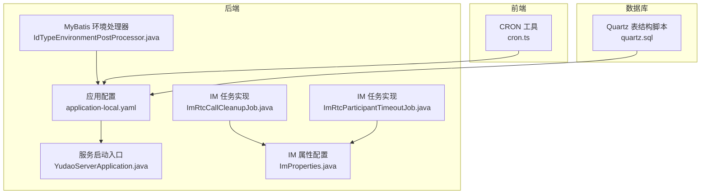
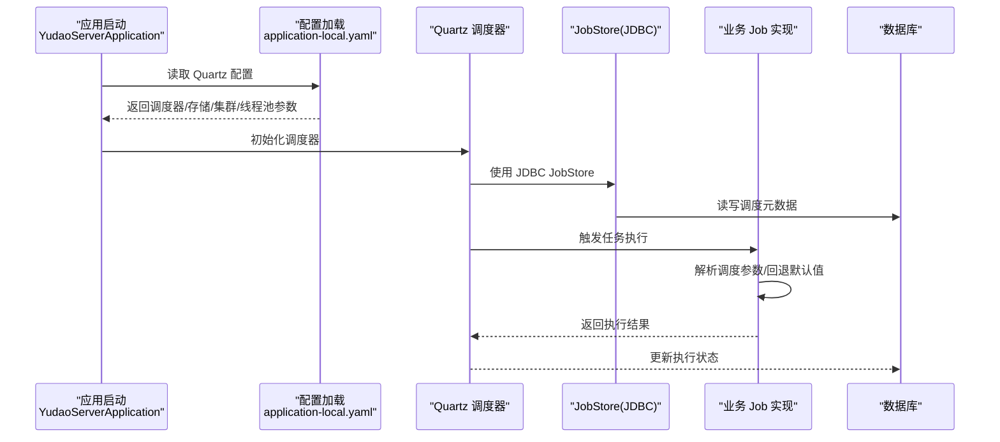
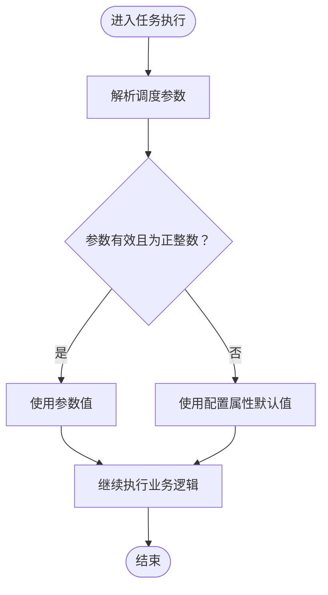
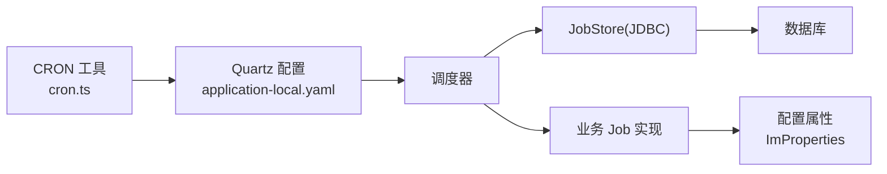

# 定时任务调度

<cite>
**本文引用的文件**   
- [application-local.yaml](file://yudao-server/src/main/resources/application-local.yaml)
- [IdTypeEnvironmentPostProcessor.java](file://yudao-framework/yudao-spring-boot-starter-mybatis/src/main/java/cn/iocoder/yudao/framework/mybatis/config/IdTypeEnvironmentPostProcessor.java)
- [ImRtcCallCleanupJob.java](file://yudao-module-im/src/main/java/cn/iocoder/yudao/module/im/job/rtc/ImRtcCallCleanupJob.java)
- [cron.ts](file://yudao-ui/yudao-ui-admin-vue3/src/utils/cron.ts)
- [ImRtcParticipantTimeoutJob.java](file://yudao-module-im/src/main/java/cn/iocoder/yudao/module/im/job/rtc/ImRtcParticipantTimeoutJob.java)
- [ImProperties.java](file://yudao-module-im/src/main/java/cn/iocoder/yudao/module/im/framework/ImProperties.java)
- [YudaoServerApplication.java](file://yudao-server/src/main/java/cn/iocoder/yudao/server/YudaoServerApplication.java)
- [quartz.sql](file://sql/mysql/quartz.sql)
</cite>

## 目录
1. [引言](#引言)
2. [项目结构](#项目结构)
3. [核心组件](#核心组件)
4. [架构总览](#架构总览)
5. [详细组件分析](#详细组件分析)
6. [依赖关系分析](#依赖关系分析)
7. [性能考虑](#性能考虑)
8. [故障排查指南](#故障排查指南)
9. [结论](#结论)
10. [附录](#附录)

## 引言
本文件面向“定时任务调度系统”的技术文档，聚焦于基于 Quartz 的集成与落地实践。内容涵盖调度器配置、作业工厂与集群部署、任务定义与配置（含 Cron 表达式、参数传递、并发控制）、执行监控（日志、重试、超时）、清理策略（历史归档、统计与回收），以及任务编排、动态注册与运行时调整等主题。文档同时提供可视化图示与实操建议，帮助读者快速理解并安全地在生产环境中使用。

## 项目结构
围绕定时任务的核心代码分布在以下模块与资源中：
- 后端配置与启动：应用配置文件中包含 Quartz 的关键参数；服务启动入口负责加载自动配置。
- 框架层：MyBatis 环境处理器根据数据库类型自动推断 Quartz JDBC 作业存储驱动。
- 业务模块：IM 模块内提供 RTC 通话清理与参与者超时的任务实现，展示参数解析与阈值控制。
- 前端工具：CRON 表达式解析与格式化工具，辅助任务配置与可视化。
- 数据库脚本：Quartz 的标准数据库表结构脚本，支撑 JDBC JobStore。

图表来源
- [application-local.yaml:92-115](file://yudao-server/src/main/resources/application-local.yaml#L92-L115)
- [YudaoServerApplication.java:1-50](file://yudao-server/src/main/java/cn/iocoder/yudao/server/YudaoServerApplication.java#L1-L50)
- [IdTypeEnvironmentPostProcessor.java:78-119](file://yudao-framework/yudao-spring-boot-starter-mybatis/src/main/java/cn/iocoder/yudao/framework/mybatis/config/IdTypeEnvironmentPostProcessor.java#L78-L119)
- [ImRtcCallCleanupJob.java:43-58](file://yudao-module-im/src/main/java/cn/iocoder/yudao/module/im/job/rtc/ImRtcCallCleanupJob.java#L43-L58)
- [ImRtcParticipantTimeoutJob.java:1-50](file://yudao-module-im/src/main/java/cn/iocoder/yudao/module/im/job/rtc/ImRtcParticipantTimeoutJob.java#L1-L50)
- [ImProperties.java:1-100](file://yudao-module-im/src/main/java/cn/iocoder/yudao/module/im/framework/ImProperties.java#L1-L100)
- [cron.ts:1-455](file://yudao-ui/yudao-ui-admin-vue3/src/utils/cron.ts#L1-L455)
- [quartz.sql](file://sql/mysql/quartz.sql)

章节来源
- [application-local.yaml:92-115](file://yudao-server/src/main/resources/application-local.yaml#L92-L115)
- [YudaoServerApplication.java:1-50](file://yudao-server/src/main/java/cn/iocoder/yudao/server/YudaoServerApplication.java#L1-L50)

## 核心组件
- 调度器与存储
  - 自动启动、调度器名称、存储类型（内存或 JDBC）、关闭等待策略、集群开关、线程池大小等关键参数均在应用配置中集中管理。
  - JDBC JobStore 通过本地数据源实现持久化，支持集群模式与检查间隔、错失触发阈值等高级特性。
- 作业工厂与自动装配
  - 采用 Spring Boot 自动配置加载 Quartz 相关 Bean，结合业务模块中的 Job 实现进行注册与调度。
- 任务实现与参数传递
  - IM 模块的 RTC 清理与超时任务展示了如何从调度参数中解析阈值，并回退到配置属性，体现参数传递与容错策略。
- 前端 CRON 工具
  - 提供 CRON 表达式校验、解析、格式化、频率描述与下一次执行时间估算，辅助任务配置与可视化。

章节来源
- [application-local.yaml:92-115](file://yudao-server/src/main/resources/application-local.yaml#L92-L115)
- [ImRtcCallCleanupJob.java:43-58](file://yudao-module-im/src/main/java/cn/iocoder/yudao/module/im/job/rtc/ImRtcCallCleanupJob.java#L43-L58)
- [ImRtcParticipantTimeoutJob.java:1-50](file://yudao-module-im/src/main/java/cn/iocoder/yudao/module/im/job/rtc/ImRtcParticipantTimeoutJob.java#L1-L50)
- [cron.ts:107-420](file://yudao-ui/yudao-ui-admin-vue3/src/utils/cron.ts#L107-L420)

## 架构总览
下图展示从应用启动到任务执行的关键交互路径，包括配置加载、集群与存储、任务执行与参数解析。

图表来源
- [application-local.yaml:92-115](file://yudao-server/src/main/resources/application-local.yaml#L92-L115)
- [YudaoServerApplication.java:1-50](file://yudao-server/src/main/java/cn/iocoder/yudao/server/YudaoServerApplication.java#L1-L50)
- [ImRtcCallCleanupJob.java:43-58](file://yudao-module-im/src/main/java/cn/iocoder/yudao/module/im/job/rtc/ImRtcCallCleanupJob.java#L43-L58)

## 详细组件分析

### 组件一：Quartz 集成与配置
- 关键配置项
  - auto-startup：是否自动启动调度器（开发环境建议谨慎开启）
  - scheduler-name：调度器实例名
  - job-store-type：memory 或 jdbc
  - wait-for-jobs-to-complete-on-shutdown：优雅停机等待
  - org.quartz.scheduler.*：实例名、实例 ID 自动生成
  - org.quartz.jobStore.*：LocalDataSourceJobStore、isClustered、clusterCheckinInterval、misfireThreshold
  - org.quartz.threadPool.threadCount：线程池大小
- 集群部署要点
  - 开启 isClustered 并合理设置 clusterCheckinInterval
  - misfireThreshold 控制错失触发的容忍度
  - 使用 JDBC JobStore 保证多节点共享状态

章节来源
- [application-local.yaml:92-115](file://yudao-server/src/main/resources/application-local.yaml#L92-L115)

### 组件二：数据库驱动与 JobStore 委托
- 环境处理器根据数据源 URL 推断数据库类型，并设置 Quartz JobStore 对应的委托类（如 PostgreSQL、Oracle、SQL Server、DM 等），确保 JDBC JobStore 正确初始化。
- 这种机制避免了手动维护驱动类，提升跨数据库适配能力。

章节来源
- [IdTypeEnvironmentPostProcessor.java:78-119](file://yudao-framework/yudao-spring-boot-starter-mybatis/src/main/java/cn/iocoder/yudao/framework/mybatis/config/IdTypeEnvironmentPostProcessor.java#L78-L119)

### 组件三：任务定义与参数传递（以 IM RTC 为例）
- 任务实现
  - 通话清理任务：从调度参数解析“分钟阈值”，若非法或非正数则回退到配置属性的默认值。
  - 参会者超时任务：作为另一个业务场景的定时任务实现，体现参数化与可配置性。
- 参数传递策略
  - 优先使用调度传参，其次使用配置属性，最后使用硬编码默认值，形成“强约束 + 宽松回退”的参数体系。

图表来源
- [ImRtcCallCleanupJob.java:43-58](file://yudao-module-im/src/main/java/cn/iocoder/yudao/module/im/job/rtc/ImRtcCallCleanupJob.java#L43-L58)

章节来源
- [ImRtcCallCleanupJob.java:43-58](file://yudao-module-im/src/main/java/cn/iocoder/yudao/module/im/job/rtc/ImRtcCallCleanupJob.java#L43-L58)
- [ImRtcParticipantTimeoutJob.java:1-50](file://yudao-module-im/src/main/java/cn/iocoder/yudao/module/im/job/rtc/ImRtcParticipantTimeoutJob.java#L1-L50)
- [ImProperties.java:1-100](file://yudao-module-im/src/main/java/cn/iocoder/yudao/module/im/framework/ImProperties.java#L1-L100)

### 组件四：CRON 表达式工具与可视化
- 功能范围
  - 校验表达式格式、解析字段、生成可读描述、计算下一次执行时间、频率描述、判断某时刻是否命中。
- 前端集成价值
  - 在任务配置界面中提供即时反馈与可视化提示，降低配置错误率。

章节来源
- [cron.ts:107-420](file://yudao-ui/yudao-ui-admin-vue3/src/utils/cron.ts#L107-L420)

### 组件五：执行监控与可观测性
- 日志记录
  - 建议在 Job 实现中统一记录任务开始、结束、异常与耗时，便于问题定位。
- 失败重试与超时
  - 可通过 Quartz 的 Misfire 策略与线程池大小配合实现基本的失败重试；对长任务建议引入超时控制与外部告警。
- 性能统计
  - 结合数据库表记录任务执行次数、平均耗时、失败率等指标，定期生成报表。

（本节为通用指导，不直接分析具体文件）

### 组件六：任务清理策略
- 历史日志归档
  - 将过期的调度日志迁移至归档表或对象存储，控制主表规模。
- 性能统计
  - 按天/周聚合统计任务成功率、延迟、抖动等指标。
- 资源回收
  - 清理僵尸任务、释放未完成的锁与临时资源，避免资源泄漏。

（本节为通用指导，不直接分析具体文件）

### 组件七：任务编排与动态调整
- 编排模式
  - 串行链式：前一任务成功后再触发下一任务
  - 并行分支：同一时刻触发多个子任务
  - 条件分支：依据上一任务输出选择后续路径
- 动态注册与运行时调整
  - 通过管理接口动态增删改任务，或在配置中心下发变更，再由调度器刷新。

（本节为通用指导，不直接分析具体文件）

## 依赖关系分析
- 配置依赖
  - 应用配置决定调度器行为（启动、存储、集群、线程池）。
- 数据库依赖
  - Quartz 表结构脚本提供持久化基础；环境处理器根据数据库类型选择合适的委托类。
- 业务依赖
  - 业务 Job 依赖配置属性与外部服务，参数解析体现“调度参数 > 配置属性 > 默认值”的优先级。

图表来源
- [application-local.yaml:92-115](file://yudao-server/src/main/resources/application-local.yaml#L92-L115)
- [quartz.sql](file://sql/mysql/quartz.sql)
- [cron.ts:107-420](file://yudao-ui/yudao-ui-admin-vue3/src/utils/cron.ts#L107-L420)

章节来源
- [application-local.yaml:92-115](file://yudao-server/src/main/resources/application-local.yaml#L92-L115)
- [quartz.sql](file://sql/mysql/quartz.sql)
- [cron.ts:107-420](file://yudao-ui/yudao-ui-admin-vue3/src/utils/cron.ts#L107-L420)

## 性能考虑
- 线程池大小
  - 根据 CPU 核数与任务 IO 特性设定，避免过多上下文切换或阻塞导致积压。
- 集群检查间隔
  - 合理设置集群检查频率，平衡心跳开销与故障感知速度。
- 错失触发阈值
  - 避免过于敏感导致频繁重试，也需防止忽略真实延迟。
- 任务粒度
  - 将大任务拆分为小任务，减少单次执行时间，提升吞吐与可用性。
- 数据库压力
  - 使用 JDBC JobStore 时，关注调度表的索引与分区策略，避免热点写入。

（本节为通用指导，不直接分析具体文件）

## 故障排查指南
- 无法启动调度器
  - 检查配置项是否正确（auto-startup、job-store-type、scheduler-name）。
- 集群节点冲突
  - 确认 instanceId 自动生成策略生效，避免重复实例名。
- 任务未执行或执行异常
  - 查看任务日志与数据库表状态，确认参数解析与默认值回退逻辑。
- CRON 表达式无效
  - 使用前端工具进行格式校验与描述生成，确认字段范围与步长设置。

章节来源
- [application-local.yaml:92-115](file://yudao-server/src/main/resources/application-local.yaml#L92-L115)
- [cron.ts:107-420](file://yudao-ui/yudao-ui-admin-vue3/src/utils/cron.ts#L107-L420)

## 结论
本项目通过清晰的配置、自动化的数据库驱动适配与完善的业务任务实现，构建了稳定可靠的定时任务调度体系。结合前端 CRON 工具与可扩展的参数传递策略，能够满足多样化业务场景的需求。建议在生产环境中重点关注集群一致性、线程池与数据库性能、任务监控与清理策略，以获得更高的稳定性与可维护性。

## 附录
- 任务模板示例（步骤说明）
  - 定义 Job 类，实现执行逻辑与参数解析
  - 在配置中编写 CRON 表达式与调度参数
  - 通过管理接口注册/修改任务
  - 监控执行日志与性能指标，必要时启用重试与告警
- 配置参数速查
  - auto-startup、scheduler-name、job-store-type、wait-for-jobs-to-complete-on-shutdown、org.quartz.jobStore.isClustered、org.quartz.jobStore.clusterCheckinInterval、org.quartz.jobStore.misfireThreshold、org.quartz.threadPool.threadCount
- 性能调优建议
  - 合理设置线程池大小与集群检查间隔
  - 将长任务拆分，优化数据库索引与分区
  - 建立历史日志归档与统计报表机制

（本节为通用指导，不直接分析具体文件）