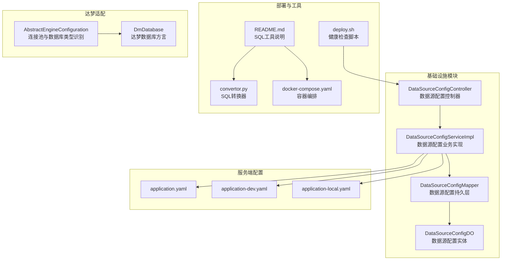
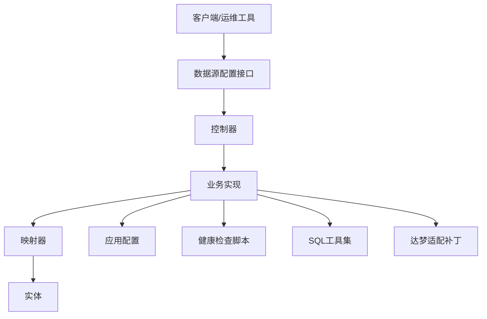
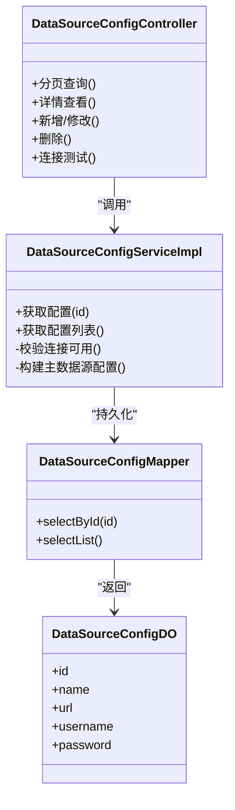
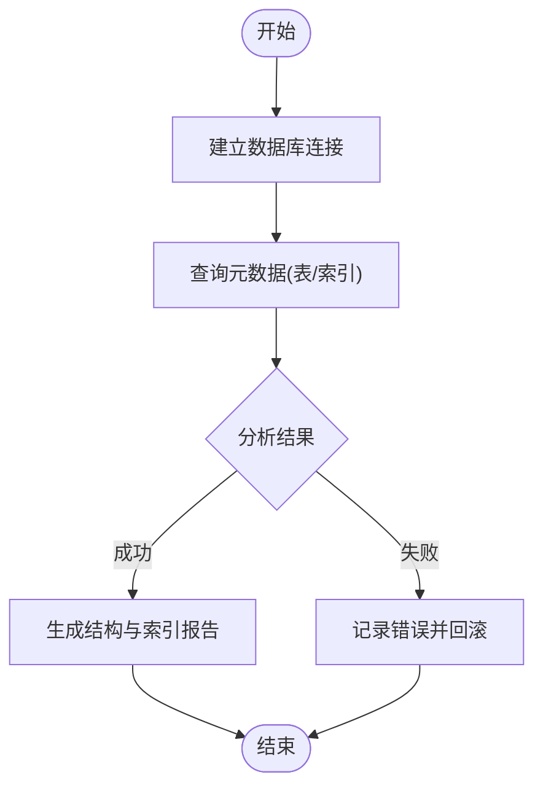
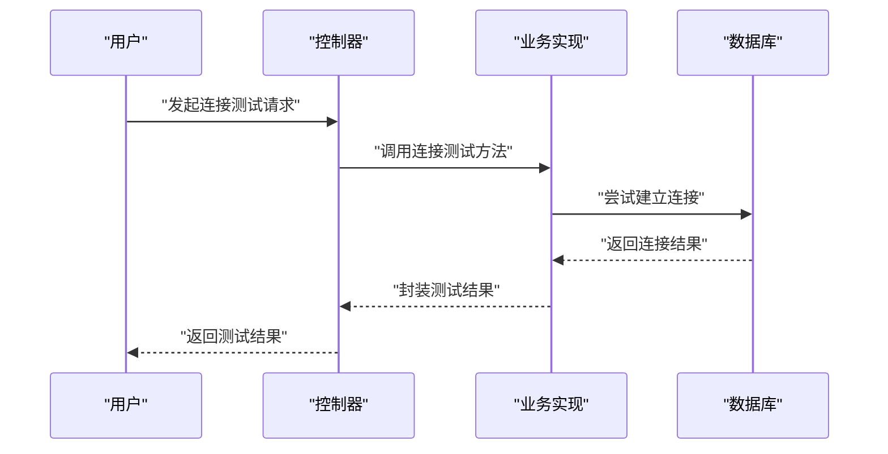
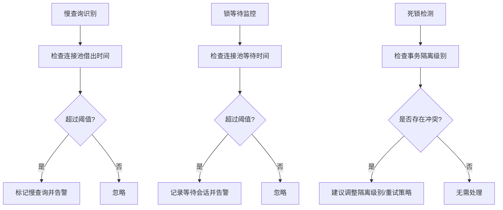
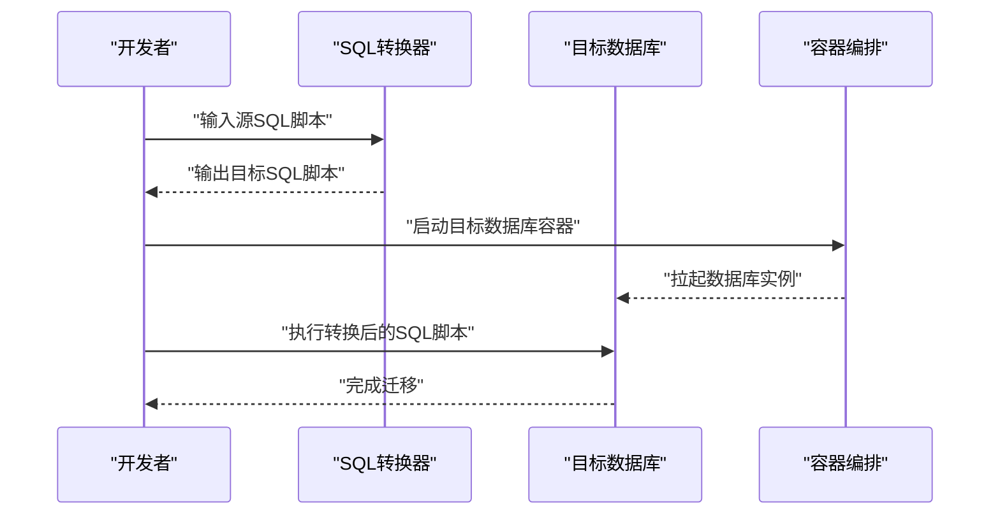
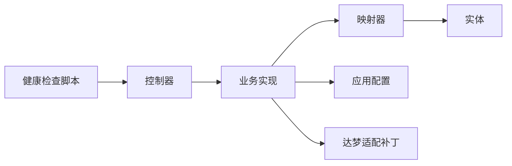

# 数据库工具集

<cite>
**本文引用的文件**
- [DataSourceConfigController.java](file://yudao-module-infra/src/main/java/cn/iocoder/yudao/module/infra/controller/admin/db/DataSourceConfigController.java)
- [DataSourceConfigServiceImpl.java](file://yudao-module-infra/src/main/java/cn/iocoder/yudao/module/infra/service/db/DataSourceConfigServiceImpl.java)
- [DataSourceConfigDO.java](file://yudao-module-infra/src/main/java/cn/iocoder/yudao/module/infra/dal/dataobject/db/DataSourceConfigDO.java)
- [DataSourceConfigMapper.java](file://yudao-module-infra/src/main/java/cn/iocoder/yudao/module/infra/dal/mysql/db/DataSourceConfigMapper.java)
- [application.yaml](file://yudao-server/src/main/resources/application.yaml)
- [application-dev.yaml](file://yudao-server/src/main/resources/application-dev.yaml)
- [application-local.yaml](file://yudao-server/src/main/resources/application-local.yaml)
- [deploy.sh](file://script/shell/deploy.sh)
- [README.md](file://sql/tools/README.md)
- [AbstractEngineConfiguration.java](file://sql/dm/flowable-patch/src/main/java/org/flowable/common/engine/impl/AbstractEngineConfiguration.java)
- [DmDatabase.java](file://sql/dm/flowable-patch/src/main/java/liquibase/database/core/DmDatabase.java)
- [convertor.py](file://sql/tools/convertor.py)
- [docker-compose.yaml](file://sql/tools/docker-compose.yaml)
</cite>

## 目录
1. [简介](#简介)
2. [项目结构](#项目结构)
3. [核心组件](#核心组件)
4. [架构总览](#架构总览)
5. [详细组件分析](#详细组件分析)
6. [依赖关系分析](#依赖关系分析)
7. [性能考虑](#性能考虑)
8. [故障排查指南](#故障排查指南)
9. [结论](#结论)
10. [附录](#附录)

## 简介
本文件面向数据库工具集的技术文档，围绕以下目标展开：数据源配置管理（含多数据源切换、连接池配置与健康检查）、数据库表管理（结构查询、索引分析与性能监控）、数据库连接测试（连通性验证、延迟测量与故障诊断）、数据库维护工具（慢查询分析、锁等待监控与死锁检测）、数据库迁移辅助（结构对比与数据同步）、以及数据库配置模板、连接参数说明与性能优化建议。文档以仓库现有实现为基础，结合可扩展性建议，帮助读者系统掌握该工具集的设计与使用。

## 项目结构
数据库工具集主要分布在以下模块与资源中：
- 基础设施模块（infra）提供数据源配置的增删改查、连接测试与列表展示能力
- 服务端配置文件（application*.yaml）定义默认数据源与动态数据源属性
- 部署脚本（deploy.sh）提供健康检查流程
- SQL 工具（sql/tools）提供多数据库快速启动、转换器与编排文件
- 达梦适配补丁（sql/dm/flowable-patch）提供数据库类型识别、连接池参数与方言适配

**图表来源**
- [DataSourceConfigController.java](file://yudao-module-infra/src/main/java/cn/iocoder/yudao/module/infra/controller/admin/db/DataSourceConfigController.java)
- [DataSourceConfigServiceImpl.java](file://yudao-module-infra/src/main/java/cn/iocoder/yudao/module/infra/service/db/DataSourceConfigServiceImpl.java)
- [DataSourceConfigMapper.java](file://yudao-module-infra/src/main/java/cn/iocoder/yudao/module/infra/dal/mysql/db/DataSourceConfigMapper.java)
- [DataSourceConfigDO.java](file://yudao-module-infra/src/main/java/cn/iocoder/yudao/module/infra/dal/dataobject/db/DataSourceConfigDO.java)
- [application.yaml](file://yudao-server/src/main/resources/application.yaml)
- [application-dev.yaml](file://yudao-server/src/main/resources/application-dev.yaml)
- [application-local.yaml](file://yudao-server/src/main/resources/application-local.yaml)
- [deploy.sh](file://script/shell/deploy.sh)
- [README.md](file://sql/tools/README.md)
- [convertor.py](file://sql/tools/convertor.py)
- [docker-compose.yaml](file://sql/tools/docker-compose.yaml)
- [AbstractEngineConfiguration.java](file://sql/dm/flowable-patch/src/main/java/org/flowable/common/engine/impl/AbstractEngineConfiguration.java)
- [DmDatabase.java](file://sql/dm/flowable-patch/src/main/java/liquibase/database/core/DmDatabase.java)

**章节来源**
- [DataSourceConfigController.java](file://yudao-module-infra/src/main/java/cn/iocoder/yudao/module/infra/controller/admin/db/DataSourceConfigController.java)
- [DataSourceConfigServiceImpl.java](file://yudao-module-infra/src/main/java/cn/iocoder/yudao/module/infra/service/db/DataSourceConfigServiceImpl.java)
- [application.yaml](file://yudao-server/src/main/resources/application.yaml)
- [deploy.sh](file://script/shell/deploy.sh)
- [README.md](file://sql/tools/README.md)

## 核心组件
- 数据源配置控制器：提供数据源配置的分页查询、详情查看、新增/修改、删除与连接测试等接口
- 数据源配置业务实现：负责构建主数据源配置、校验连接可用性、补充主数据源到列表
- 数据源配置映射器与实体：持久化数据源配置信息，支持按 ID 查询与列表查询
- 服务端配置：定义默认数据源与动态数据源属性，用于多数据源切换与连接池参数
- 健康检查脚本：在部署阶段对后端服务进行健康检查，确保数据库连通性
- SQL 工具：提供多数据库快速启动、SQL 脚本转换与容器编排
- 达梦适配：提供数据库类型识别、连接池参数配置与方言适配

**章节来源**
- [DataSourceConfigController.java](file://yudao-module-infra/src/main/java/cn/iocoder/yudao/module/infra/controller/admin/db/DataSourceConfigController.java)
- [DataSourceConfigServiceImpl.java](file://yudao-module-infra/src/main/java/cn/iocoder/yudao/module/infra/service/db/DataSourceConfigServiceImpl.java)
- [DataSourceConfigDO.java](file://yudao-module-infra/src/main/java/cn/iocoder/yudao/module/infra/dal/dataobject/db/DataSourceConfigDO.java)
- [DataSourceConfigMapper.java](file://yudao-module-infra/src/main/java/cn/iocoder/yudao/module/infra/dal/mysql/db/DataSourceConfigMapper.java)
- [application.yaml](file://yudao-server/src/main/resources/application.yaml)
- [deploy.sh](file://script/shell/deploy.sh)
- [README.md](file://sql/tools/README.md)

## 架构总览
数据库工具集采用“控制层-业务层-持久层-配置层”的分层架构，并通过容器编排与脚本实现快速环境搭建与健康检查。达梦适配补丁增强了对特定数据库的兼容性与连接池配置能力。

**图表来源**
- [DataSourceConfigController.java](file://yudao-module-infra/src/main/java/cn/iocoder/yudao/module/infra/controller/admin/db/DataSourceConfigController.java)
- [DataSourceConfigServiceImpl.java](file://yudao-module-infra/src/main/java/cn/iocoder/yudao/module/infra/service/db/DataSourceConfigServiceImpl.java)
- [application.yaml](file://yudao-server/src/main/resources/application.yaml)
- [deploy.sh](file://script/shell/deploy.sh)
- [README.md](file://sql/tools/README.md)
- [AbstractEngineConfiguration.java](file://sql/dm/flowable-patch/src/main/java/org/flowable/common/engine/impl/AbstractEngineConfiguration.java)
- [DmDatabase.java](file://sql/dm/flowable-patch/src/main/java/liquibase/database/core/DmDatabase.java)

## 详细组件分析

### 数据源配置管理
- 多数据源切换：通过配置文件中的动态数据源属性与业务实现中的主数据源构建逻辑，实现默认主数据源与自定义数据源的切换
- 连接池配置：达梦适配补丁中提供了连接池参数的设置入口，包括最大活跃连接数、最大空闲连接数、最大借出时间、等待时间、心跳检测与事务隔离级别等
- 健康检查机制：业务实现中提供连接可用性校验；部署脚本提供后端服务健康检查流程

**图表来源**
- [DataSourceConfigController.java](file://yudao-module-infra/src/main/java/cn/iocoder/yudao/module/infra/controller/admin/db/DataSourceConfigController.java)
- [DataSourceConfigServiceImpl.java](file://yudao-module-infra/src/main/java/cn/iocoder/yudao/module/infra/service/db/DataSourceConfigServiceImpl.java)
- [DataSourceConfigMapper.java](file://yudao-module-infra/src/main/java/cn/iocoder/yudao/module/infra/dal/mysql/db/DataSourceConfigMapper.java)
- [DataSourceConfigDO.java](file://yudao-module-infra/src/main/java/cn/iocoder/yudao/module/infra/dal/dataobject/db/DataSourceConfigDO.java)

**章节来源**
- [DataSourceConfigController.java](file://yudao-module-infra/src/main/java/cn/iocoder/yudao/module/infra/controller/admin/db/DataSourceConfigController.java)
- [DataSourceConfigServiceImpl.java](file://yudao-module-infra/src/main/java/cn/iocoder/yudao/module/infra/service/db/DataSourceConfigServiceImpl.java)
- [DataSourceConfigMapper.java](file://yudao-module-infra/src/main/java/cn/iocoder/yudao/module/infra/dal/mysql/db/DataSourceConfigMapper.java)
- [DataSourceConfigDO.java](file://yudao-module-infra/src/main/java/cn/iocoder/yudao/module/infra/dal/dataobject/db/DataSourceConfigDO.java)

### 数据库表管理
- 表结构查询：通过数据源配置连接目标数据库，执行元数据查询以获取表结构信息
- 索引分析：基于元数据查询结果，分析索引名称、类型、列名与唯一性等
- 性能监控：结合连接池参数与数据库类型识别，评估连接开销与事务隔离策略对性能的影响

**图表来源**
- [AbstractEngineConfiguration.java](file://sql/dm/flowable-patch/src/main/java/org/flowable/common/engine/impl/AbstractEngineConfiguration.java)
- [DmDatabase.java](file://sql/dm/flowable-patch/src/main/java/liquibase/database/core/DmDatabase.java)

**章节来源**
- [AbstractEngineConfiguration.java](file://sql/dm/flowable-patch/src/main/java/org/flowable/common/engine/impl/AbstractEngineConfiguration.java)
- [DmDatabase.java](file://sql/dm/flowable-patch/src/main/java/liquibase/database/core/DmDatabase.java)

### 数据库连接测试
- 连通性验证：业务实现中提供连接可用性校验方法，确保配置的数据源可正常访问
- 延迟测量：可通过外部工具或在业务层增加计时逻辑实现
- 故障诊断：结合健康检查脚本与日志输出，定位网络、认证与数据库实例问题

**图表来源**
- [DataSourceConfigServiceImpl.java](file://yudao-module-infra/src/main/java/cn/iocoder/yudao/module/infra/service/db/DataSourceConfigServiceImpl.java)

**章节来源**
- [DataSourceConfigServiceImpl.java](file://yudao-module-infra/src/main/java/cn/iocoder/yudao/module/infra/service/db/DataSourceConfigServiceImpl.java)

### 数据库维护工具
- 慢查询分析：结合数据库慢查询日志与连接池参数，定位长时间占用连接的任务
- 锁等待监控：通过数据库元数据与连接池心跳检测，识别长时间占用连接的会话
- 死锁检测：利用数据库提供的锁信息与事务隔离级别配置，辅助定位死锁原因

**图表来源**
- [AbstractEngineConfiguration.java](file://sql/dm/flowable-patch/src/main/java/org/flowable/common/engine/impl/AbstractEngineConfiguration.java)

**章节来源**
- [AbstractEngineConfiguration.java](file://sql/dm/flowable-patch/src/main/java/org/flowable/common/engine/impl/AbstractEngineConfiguration.java)

### 数据库迁移辅助工具
- 结构对比：通过元数据查询与方言适配，比较不同数据库的表结构差异
- 数据同步：结合转换器与容器编排，实现跨数据库的脚本转换与批量导入

**图表来源**
- [convertor.py](file://sql/tools/convertor.py)
- [docker-compose.yaml](file://sql/tools/docker-compose.yaml)
- [README.md](file://sql/tools/README.md)

**章节来源**
- [convertor.py](file://sql/tools/convertor.py)
- [docker-compose.yaml](file://sql/tools/docker-compose.yaml)
- [README.md](file://sql/tools/README.md)

## 依赖关系分析
- 控制层依赖业务层；业务层依赖持久层与配置文件；持久层依赖实体类
- 达梦适配补丁与数据库类型识别紧密耦合，影响连接池参数与方言生成
- 健康检查脚本与部署流程共同保障上线质量

**图表来源**
- [DataSourceConfigController.java](file://yudao-module-infra/src/main/java/cn/iocoder/yudao/module/infra/controller/admin/db/DataSourceConfigController.java)
- [DataSourceConfigServiceImpl.java](file://yudao-module-infra/src/main/java/cn/iocoder/yudao/module/infra/service/db/DataSourceConfigServiceImpl.java)
- [DataSourceConfigMapper.java](file://yudao-module-infra/src/main/java/cn/iocoder/yudao/module/infra/dal/mysql/db/DataSourceConfigMapper.java)
- [DataSourceConfigDO.java](file://yudao-module-infra/src/main/java/cn/iocoder/yudao/module/infra/dal/dataobject/db/DataSourceConfigDO.java)
- [application.yaml](file://yudao-server/src/main/resources/application.yaml)
- [deploy.sh](file://script/shell/deploy.sh)
- [AbstractEngineConfiguration.java](file://sql/dm/flowable-patch/src/main/java/org/flowable/common/engine/impl/AbstractEngineConfiguration.java)
- [DmDatabase.java](file://sql/dm/flowable-patch/src/main/java/liquibase/database/core/DmDatabase.java)

**章节来源**
- [DataSourceConfigController.java](file://yudao-module-infra/src/main/java/cn/iocoder/yudao/module/infra/controller/admin/db/DataSourceConfigController.java)
- [DataSourceConfigServiceImpl.java](file://yudao-module-infra/src/main/java/cn/iocoder/yudao/module/infra/service/db/DataSourceConfigServiceImpl.java)
- [application.yaml](file://yudao-server/src/main/resources/application.yaml)
- [deploy.sh](file://script/shell/deploy.sh)
- [AbstractEngineConfiguration.java](file://sql/dm/flowable-patch/src/main/java/org/flowable/common/engine/impl/AbstractEngineConfiguration.java)
- [DmDatabase.java](file://sql/dm/flowable-patch/src/main/java/liquibase/database/core/DmDatabase.java)

## 性能考虑
- 连接池参数调优：根据业务并发与数据库承载能力，合理设置最大活跃连接数、最大空闲连接数、最大借出时间与等待时间
- 心跳检测：启用连接池心跳检测并设置合理的不使用时长阈值，避免使用已失效连接
- 事务隔离级别：根据一致性与性能需求选择合适的隔离级别，避免过高的隔离级别导致锁竞争
- 数据库类型识别：针对不同数据库（如达梦）启用相应的方言与参数，提升兼容性与性能

[本节为通用指导，无需列出具体文件来源]

## 故障排查指南
- 连接测试失败：检查数据源 URL、用户名与密码；确认网络可达与防火墙放行
- 连接池耗尽：检查最大活跃连接数与最大借出时间；观察是否存在长时间占用连接的任务
- 健康检查失败：查看部署脚本输出的日志与状态码，确认后端服务与数据库实例均正常
- 达梦适配异常：核对数据库类型识别与驱动配置，确保方言生成正确

**章节来源**
- [DataSourceConfigServiceImpl.java](file://yudao-module-infra/src/main/java/cn/iocoder/yudao/module/infra/service/db/DataSourceConfigServiceImpl.java)
- [deploy.sh](file://script/shell/deploy.sh)
- [AbstractEngineConfiguration.java](file://sql/dm/flowable-patch/src/main/java/org/flowable/common/engine/impl/AbstractEngineConfiguration.java)
- [DmDatabase.java](file://sql/dm/flowable-patch/src/main/java/liquibase/database/core/DmDatabase.java)

## 结论
数据库工具集通过清晰的分层架构与完善的配置体系，实现了多数据源管理、连接池配置与健康检查、表结构与索引分析、连接测试与迁移辅助等功能。结合达梦适配补丁与容器编排工具，能够满足多数据库场景下的开发与运维需求。建议在生产环境中持续优化连接池参数与事务隔离策略，并配合健康检查与慢查询监控，保障系统的稳定性与性能。

[本节为总结性内容，无需列出具体文件来源]

## 附录

### 数据库配置模板与连接参数说明
- 默认数据源与动态数据源属性：参考应用配置文件中的数据源定义
- 连接池参数（示例字段）：最大活跃连接数、最大空闲连接数、最大借出时间、等待时间、心跳检测开关与查询语句、事务隔离级别等
- 达梦数据库参数：驱动类名、默认端口、方言特性与系统表过滤规则

**章节来源**
- [application.yaml](file://yudao-server/src/main/resources/application.yaml)
- [AbstractEngineConfiguration.java](file://sql/dm/flowable-patch/src/main/java/org/flowable/common/engine/impl/AbstractEngineConfiguration.java)
- [DmDatabase.java](file://sql/dm/flowable-patch/src/main/java/liquibase/database/core/DmDatabase.java)

### 数据库迁移与环境搭建
- 快速启动多数据库：基于容器编排一键启动 MySQL、Oracle、PostgreSQL、SQL Server 与达梦数据库
- SQL 脚本转换：使用转换器将脚本转换为目标数据库格式
- 部署与健康检查：通过部署脚本对后端服务进行健康检查

**章节来源**
- [README.md](file://sql/tools/README.md)
- [convertor.py](file://sql/tools/convertor.py)
- [docker-compose.yaml](file://sql/tools/docker-compose.yaml)
- [deploy.sh](file://script/shell/deploy.sh)