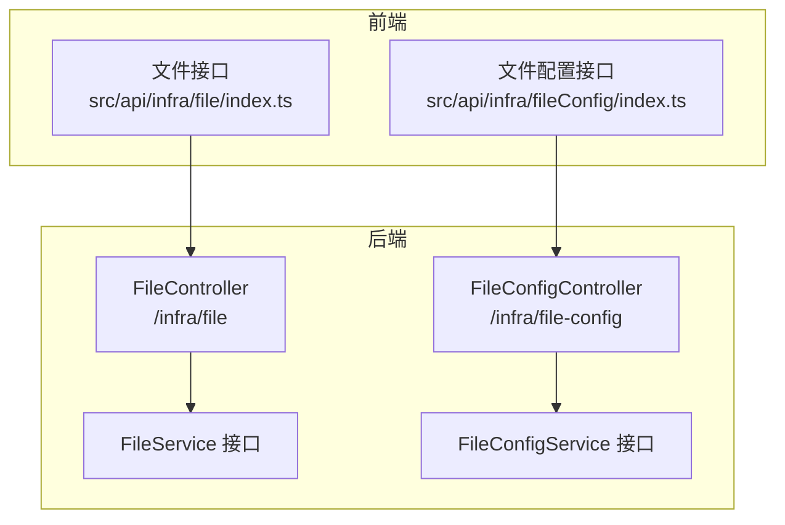
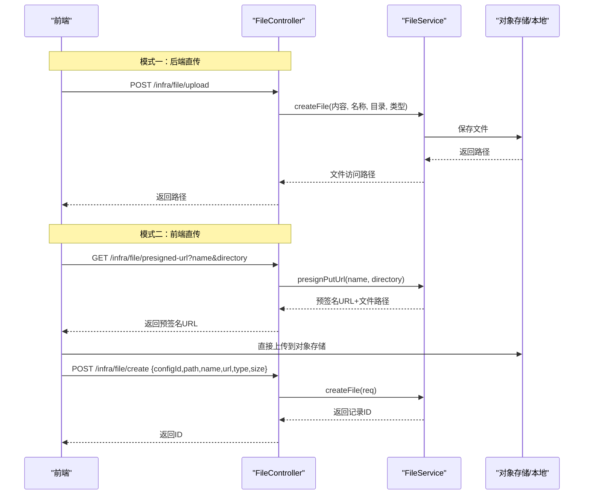
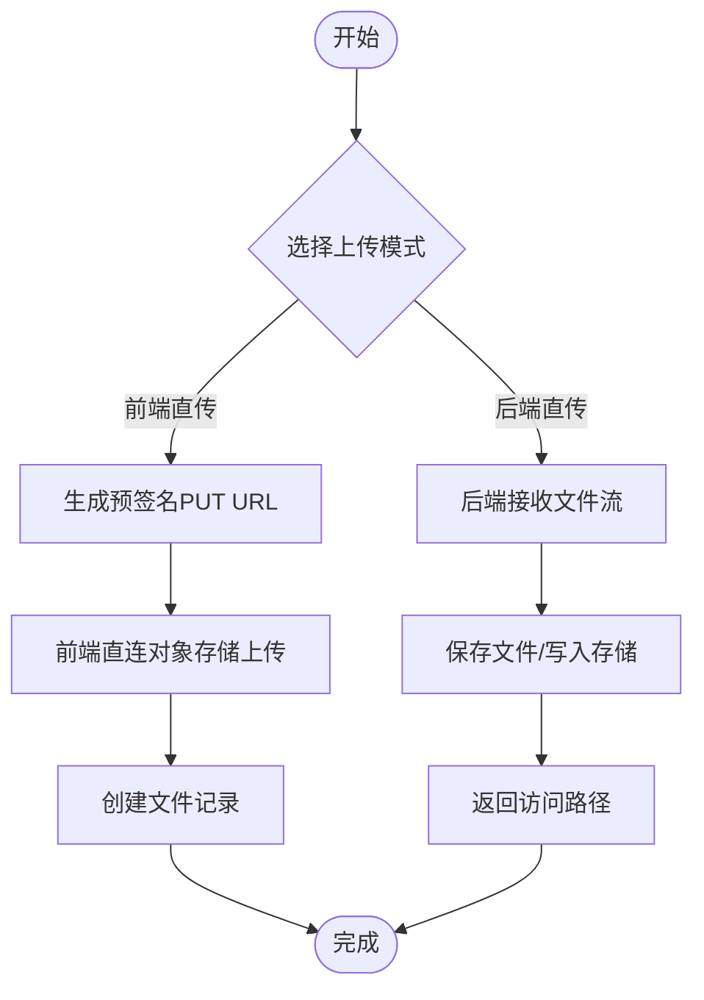
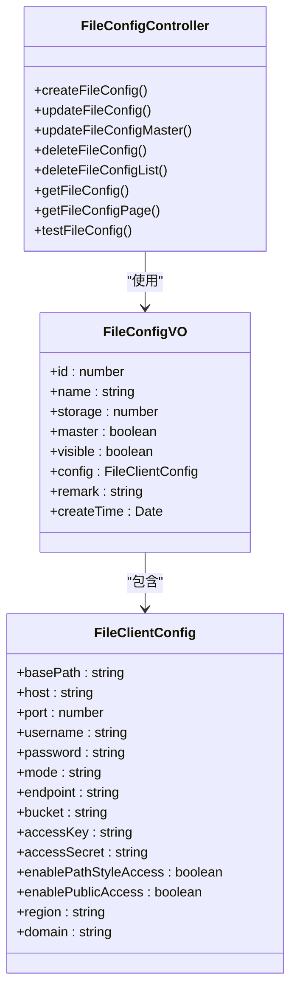
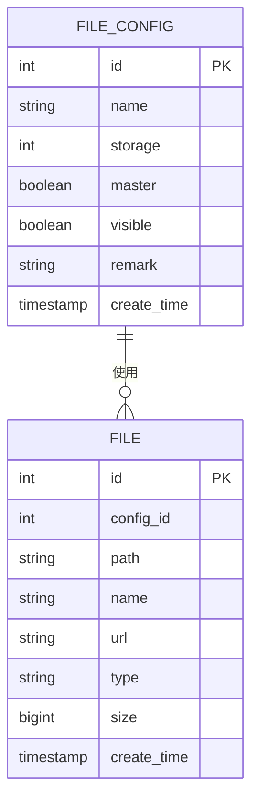
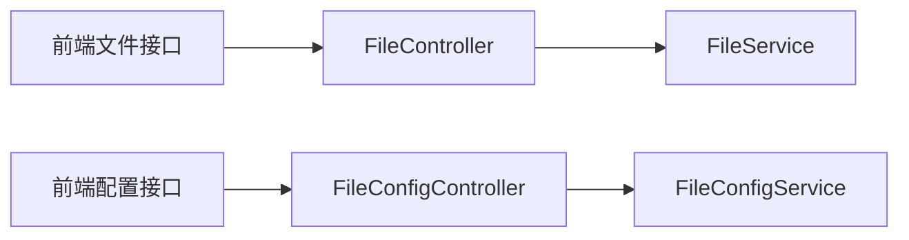

# 文件管理系统

<cite>
**本文引用的文件**
- [FileController.java](file://yudao-module-infra/src/main/java/cn/iocoder/yudao/module/infra/controller/admin/file/FileController.java)
- [FileConfigController.java](file://yudao-module-infra/src/main/java/cn/iocoder/yudao/module/infra/controller/admin/file/FileConfigController.java)
- [index.ts（前端文件接口）](file://yudao-ui/yudao-ui-admin-vue3/src/api/infra/file/index.ts)
- [index.ts（前端文件配置接口）](file://yudao-ui/yudao-ui-admin-vue3/src/api/infra/fileConfig/index.ts)
- [FileService.java](file://yudao-module-infra/src/main/java/cn/iocoder/yudao/module/infra/service/file/FileService.java)
- [FileConfigService.java](file://yudao-module-infra/src/main/java/cn/iocoder/yudao/module/infra/service/file/FileConfigService.java)
- [FileCreateReqVO.java](file://yudao-module-infra/src/main/java/cn/iocoder/yudao/module/infra/controller/admin/file/vo/file/FileCreateReqVO.java)
- [FilePageReqVO.java](file://yudao-module-infra/src/main/java/cn/iocoder/yudao/module/infra/controller/admin/file/vo/file/FilePageReqVO.java)
- [FileRespVO.java](file://yudao-module-infra/src/main/java/cn/iocoder/yudao/module/infra/controller/admin/file/vo/file/FileRespVO.java)
- [FileConfigController.http](file://yudao-module-infra/src/main/java/cn/iocoder/yudao/module/infra/controller/admin/file/FileConfigController.http)
- [PRD-Step2-基础数据模块.md](file://docs/PRD-Step2-基础数据模块.md)
</cite>

## 目录
1. [简介](#简介)
2. [项目结构](#项目结构)
3. [核心组件](#核心组件)
4. [架构总览](#架构总览)
5. [详细组件分析](#详细组件分析)
6. [依赖关系分析](#依赖关系分析)
7. [性能考量](#性能考量)
8. [故障排除指南](#故障排除指南)
9. [结论](#结论)
10. [附录](#附录)

## 简介
本文件管理系统围绕“文件上传、配置管理、访问与安全、分类与元数据、生命周期与备份”展开，覆盖后端控制器、服务层、前端接口与配置模板。系统支持两种上传模式：后端直传与前端直连对象存储（预签名直传）。文件配置支持多存储后端（本地、FTP、SFTP、S3兼容等），并通过“主配置”统一对外提供默认存储能力。前端提供文件与配置的分页、创建、删除、测试等功能。

## 项目结构
- 后端模块
  - 控制器：文件与文件配置的 REST 接口
  - 服务接口：文件与文件配置的服务契约
- 前端模块
  - 文件接口：上传、预签名直传、创建记录、分页、删除
  - 文件配置接口：创建、更新、设为主配置、分页、测试

图表来源
- [FileController.java:36-81](file://yudao-module-infra/src/main/java/cn/iocoder/yudao/module/infra/controller/admin/file/FileController.java#L36-L81)
- [FileConfigController.java:24-98](file://yudao-module-infra/src/main/java/cn/iocoder/yudao/module/infra/controller/admin/file/FileConfigController.java#L24-L98)
- [index.ts（前端文件接口）:1-46](file://yudao-ui/yudao-ui-admin-vue3/src/api/infra/file/index.ts#L1-L46)
- [index.ts（前端文件配置接口）:1-69](file://yudao-ui/yudao-ui-admin-vue3/src/api/infra/fileConfig/index.ts#L1-L69)

章节来源
- [FileController.java:36-81](file://yudao-module-infra/src/main/java/cn/iocoder/yudao/module/infra/controller/admin/file/FileController.java#L36-L81)
- [FileConfigController.java:24-98](file://yudao-module-infra/src/main/java/cn/iocoder/yudao/module/infra/controller/admin/file/FileConfigController.java#L24-L98)
- [index.ts（前端文件接口）:1-46](file://yudao-ui/yudao-ui-admin-vue3/src/api/infra/file/index.ts#L1-L46)
- [index.ts（前端文件配置接口）:1-69](file://yudao-ui/yudao-ui-admin-vue3/src/api/infra/fileConfig/index.ts#L1-L69)

## 核心组件
- 文件控制器（后端）
  - 提供上传、预签名直传、创建记录、分页、删除等接口
- 文件配置控制器（后端）
  - 提供创建、更新、设为主配置、分页、删除、批量删除、测试等接口
- 文件服务接口（后端）
  - 定义文件创建、预签名、内容读取、删除、分页等契约
- 文件配置服务接口（后端）
  - 定义配置创建、更新、设为主配置、测试、客户端获取等契约
- 前端接口
  - 文件与配置的 CRUD、分页、测试、直传预签名等

章节来源
- [FileController.java:36-81](file://yudao-module-infra/src/main/java/cn/iocoder/yudao/module/infra/controller/admin/file/FileController.java#L36-L81)
- [FileConfigController.java:24-98](file://yudao-module-infra/src/main/java/cn/iocoder/yudao/module/infra/controller/admin/file/FileConfigController.java#L24-L98)
- [FileService.java:17-98](file://yudao-module-infra/src/main/java/cn/iocoder/yudao/module/infra/service/file/FileService.java#L17-L98)
- [FileConfigService.java:17-94](file://yudao-module-infra/src/main/java/cn/iocoder/yudao/module/infra/service/file/FileConfigService.java#L17-L94)
- [index.ts（前端文件接口）:1-46](file://yudao-ui/yudao-ui-admin-vue3/src/api/infra/file/index.ts#L1-L46)
- [index.ts（前端文件配置接口）:1-69](file://yudao-ui/yudao-ui-admin-vue3/src/api/infra/fileConfig/index.ts#L1-L69)

## 架构总览
系统采用前后端分离，文件上传支持两类模式：
- 后端直传：前端上传给后端，后端落盘或写入对象存储
- 前端直传：后端返回预签名 URL，前端直连对象存储上传，再创建文件记录

图表来源
- [FileController.java:46-73](file://yudao-module-infra/src/main/java/cn/iocoder/yudao/module/infra/controller/admin/file/FileController.java#L46-L73)
- [FileService.java:36-63](file://yudao-module-infra/src/main/java/cn/iocoder/yudao/module/infra/service/file/FileService.java#L36-L63)

章节来源
- [FileController.java:46-73](file://yudao-module-infra/src/main/java/cn/iocoder/yudao/module/infra/controller/admin/file/FileController.java#L46-L73)
- [FileService.java:36-63](file://yudao-module-infra/src/main/java/cn/iocoder/yudao/module/infra/service/file/FileService.java#L36-L63)

## 详细组件分析

### 文件上传与直传流程
- 后端直传
  - 前端上传文件到后端，后端调用服务层保存文件并返回访问路径
- 前端直传
  - 后端生成预签名 PUT URL，前端直连对象存储上传，随后创建文件记录

图表来源
- [FileController.java:46-73](file://yudao-module-infra/src/main/java/cn/iocoder/yudao/module/infra/controller/admin/file/FileController.java#L46-L73)
- [FileService.java:36-63](file://yudao-module-infra/src/main/java/cn/iocoder/yudao/module/infra/service/file/FileService.java#L36-L63)

章节来源
- [FileController.java:46-73](file://yudao-module-infra/src/main/java/cn/iocoder/yudao/module/infra/controller/admin/file/FileController.java#L46-L73)
- [FileService.java:36-63](file://yudao-module-infra/src/main/java/cn/iocoder/yudao/module/infra/service/file/FileService.java#L36-L63)

### 文件配置管理
- 支持的存储策略
  - 本地存储：通过基础路径与域名组合访问
  - FTP/SFTP：通过主机、端口、用户名、密码等配置
  - S3 兼容：通过 endpoint、bucket、region、AK/SK 等配置
  - 可扩展：新增存储类型只需在服务层扩展对应客户端
- 配置项要点
  - 主配置：用于默认存储与对外访问域名
  - 可见性：控制是否对外展示
  - 域名：用于拼接最终访问 URL
- 测试配置：通过上传测试文件验证配置可用性

图表来源
- [index.ts（前端文件配置接口）:3-29](file://yudao-ui/yudao-ui-admin-vue3/src/api/infra/fileConfig/index.ts#L3-L29)
- [FileConfigController.java:24-98](file://yudao-module-infra/src/main/java/cn/iocoder/yudao/module/infra/controller/admin/file/FileConfigController.java#L24-L98)

章节来源
- [index.ts（前端文件配置接口）:3-29](file://yudao-ui/yudao-ui-admin-vue3/src/api/infra/fileConfig/index.ts#L3-L29)
- [FileConfigController.java:24-98](file://yudao-module-infra/src/main/java/cn/iocoder/yudao/module/infra/controller/admin/file/FileConfigController.java#L24-L98)
- [FileConfigController.http:1-45](file://yudao-module-infra/src/main/java/cn/iocoder/yudao/module/infra/controller/admin/file/FileConfigController.http#L1-L45)

### 文件分类体系与元数据
- 分类维度
  - 基础数据模块定义了文件分类与子类型的编码规范，便于统一治理与检索
- 元数据
  - 文件名称、类型、大小、创建时间等作为标准元数据
  - 前端分页查询支持按路径与类型模糊匹配

图表来源
- [FileRespVO.java:10-36](file://yudao-module-infra/src/main/java/cn/iocoder/yudao/module/infra/controller/admin/file/vo/file/FileRespVO.java#L10-L36)
- [FilePageReqVO.java:14-26](file://yudao-module-infra/src/main/java/cn/iocoder/yudao/module/infra/controller/admin/file/vo/file/FilePageReqVO.java#L14-L26)
- [PRD-Step2-基础数据模块.md:26-93](file://docs/PRD-Step2-基础数据模块.md#L26-L93)

章节来源
- [FileRespVO.java:10-36](file://yudao-module-infra/src/main/java/cn/iocoder/yudao/module/infra/controller/admin/file/vo/file/FileRespVO.java#L10-L36)
- [FilePageReqVO.java:14-26](file://yudao-module-infra/src/main/java/cn/iocoder/yudao/module/infra/controller/admin/file/vo/file/FilePageReqVO.java#L14-L26)
- [PRD-Step2-基础数据模块.md:26-93](file://docs/PRD-Step2-基础数据模块.md#L26-L93)

### 生命周期管理与版本控制
- 自动清理
  - 可结合定时任务清理无效或过期文件（建议在业务侧扩展）
- 版本控制
  - 当前接口未内置版本字段；可通过命名策略或元数据扩展
- 备份策略
  - 建议在对象存储侧启用版本化与跨区域复制（需对象存储支持）

章节来源
- [FileService.java:63-98](file://yudao-module-infra/src/main/java/cn/iocoder/yudao/module/infra/service/file/FileService.java#L63-L98)

### 访问权限控制与安全策略
- 权限控制
  - 控制器方法使用注解进行权限校验（如创建、更新、删除、查询）
- 安全策略
  - 预签名 URL 仅授予有限时访问权限
  - 建议对敏感文件增加鉴权与访问日志

章节来源
- [FileConfigController.java:34-54](file://yudao-module-infra/src/main/java/cn/iocoder/yudao/module/infra/controller/admin/file/FileConfigController.java#L34-L54)
- [FileController.java:46-73](file://yudao-module-infra/src/main/java/cn/iocoder/yudao/module/infra/controller/admin/file/FileController.java#L46-L73)

### CDN 集成与性能优化
- CDN 集成
  - 通过配置域名与对象存储 endpoint，结合对象存储的 CDN 加速
- 性能优化
  - 使用预签名直传减少后端带宽压力
  - 对大文件分片上传（前端实现，后端提供分片接口可扩展）

章节来源
- [index.ts（前端文件接口）:30-36](file://yudao-ui/yudao-ui-admin-vue3/src/api/infra/file/index.ts#L30-L36)
- [FileService.java:46-55](file://yudao-module-infra/src/main/java/cn/iocoder/yudao/module/infra/service/file/FileService.java#L46-L55)

## 依赖关系分析
- 控制器依赖服务接口
- 前端接口依赖后端 REST 接口
- 文件配置决定文件访问与存储策略

图表来源
- [FileController.java:36-81](file://yudao-module-infra/src/main/java/cn/iocoder/yudao/module/infra/controller/admin/file/FileController.java#L36-L81)
- [FileConfigController.java:24-98](file://yudao-module-infra/src/main/java/cn/iocoder/yudao/module/infra/controller/admin/file/FileConfigController.java#L24-L98)
- [index.ts（前端文件接口）:1-46](file://yudao-ui/yudao-ui-admin-vue3/src/api/infra/file/index.ts#L1-L46)
- [index.ts（前端文件配置接口）:1-69](file://yudao-ui/yudao-ui-admin-vue3/src/api/infra/fileConfig/index.ts#L1-L69)

章节来源
- [FileController.java:36-81](file://yudao-module-infra/src/main/java/cn/iocoder/yudao/module/infra/controller/admin/file/FileController.java#L36-L81)
- [FileConfigController.java:24-98](file://yudao-module-infra/src/main/java/cn/iocoder/yudao/module/infra/controller/admin/file/FileConfigController.java#L24-L98)
- [index.ts（前端文件接口）:1-46](file://yudao-ui/yudao-ui-admin-vue3/src/api/infra/file/index.ts#L1-L46)
- [index.ts（前端文件配置接口）:1-69](file://yudao-ui/yudao-ui-admin-vue3/src/api/infra/fileConfig/index.ts#L1-L69)

## 性能考量
- 传输模式
  - 直传模式显著降低后端带宽与 CPU 开销
- 并发与分片
  - 大文件建议分片上传与断点续传（前端实现）
- 缓存与压缩
  - 对静态资源启用 Gzip/Br 压缩与浏览器缓存头

## 故障排除指南
- 上传失败
  - 检查对象存储凭据与域名配置
  - 使用“测试配置”接口验证连通性
- 预签名 URL 失效
  - 确认有效期参数与服务器时间同步
- 权限不足
  - 确认控制器权限注解与用户角色授权

章节来源
- [FileConfigController.java:91-97](file://yudao-module-infra/src/main/java/cn/iocoder/yudao/module/infra/controller/admin/file/FileConfigController.java#L91-L97)
- [FileController.java:57-67](file://yudao-module-infra/src/main/java/cn/iocoder/yudao/module/infra/controller/admin/file/FileController.java#L57-L67)

## 结论
该文件管理系统提供了灵活的上传模式、可扩展的存储配置与完善的前端接口。通过主配置与域名策略统一对外访问，结合预签名直传提升性能与安全性。建议在生产环境完善版本控制、备份与监控策略，并根据业务扩展文件分类与元数据。

## 附录

### API 定义与示例

- 文件接口
  - 上传文件（后端直传）
    - 方法：POST
    - 路径：/infra/file/upload
    - 参数：multipart file
  - 获取预签名上传 URL（前端直传）
    - 方法：GET
    - 路径：/infra/file/presigned-url
    - 参数：name, directory
  - 创建文件记录（前端直传后）
    - 方法：POST
    - 路径：/infra/file/create
    - 参数：configId, path, name, url, type, size

- 文件配置接口
  - 创建配置
    - 方法：POST
    - 路径：/infra/file-config/create
  - 更新配置
    - 方法：PUT
    - 路径：/infra/file-config/update
  - 设为主配置
    - 方法：PUT
    - 路径：/infra/file-config/update-master
  - 删除配置
    - 方法：DELETE
    - 路径：/infra/file-config/delete
  - 批量删除
    - 方法：DELETE
    - 路径：/infra/file-config/delete-list
  - 获取配置
    - 方法：GET
    - 路径：/infra/file-config/get
  - 配置分页
    - 方法：GET
    - 路径：/infra/file-config/page
  - 测试配置
    - 方法：GET
    - 路径：/infra/file-config/test

章节来源
- [FileController.java:46-81](file://yudao-module-infra/src/main/java/cn/iocoder/yudao/module/infra/controller/admin/file/FileController.java#L46-L81)
- [FileConfigController.java:33-98](file://yudao-module-infra/src/main/java/cn/iocoder/yudao/module/infra/controller/admin/file/FileConfigController.java#L33-L98)
- [FileCreateReqVO.java:9-33](file://yudao-module-infra/src/main/java/cn/iocoder/yudao/module/infra/controller/admin/file/vo/file/FileCreateReqVO.java#L9-L33)
- [FileConfigController.http:1-45](file://yudao-module-infra/src/main/java/cn/iocoder/yudao/module/infra/controller/admin/file/FileConfigController.http#L1-L45)