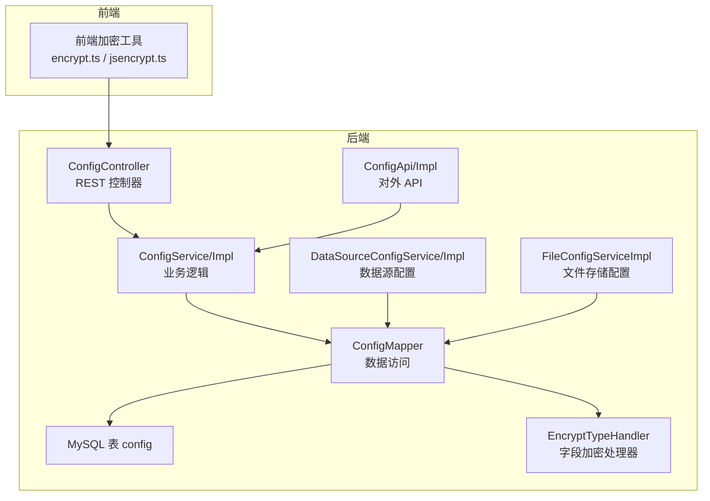
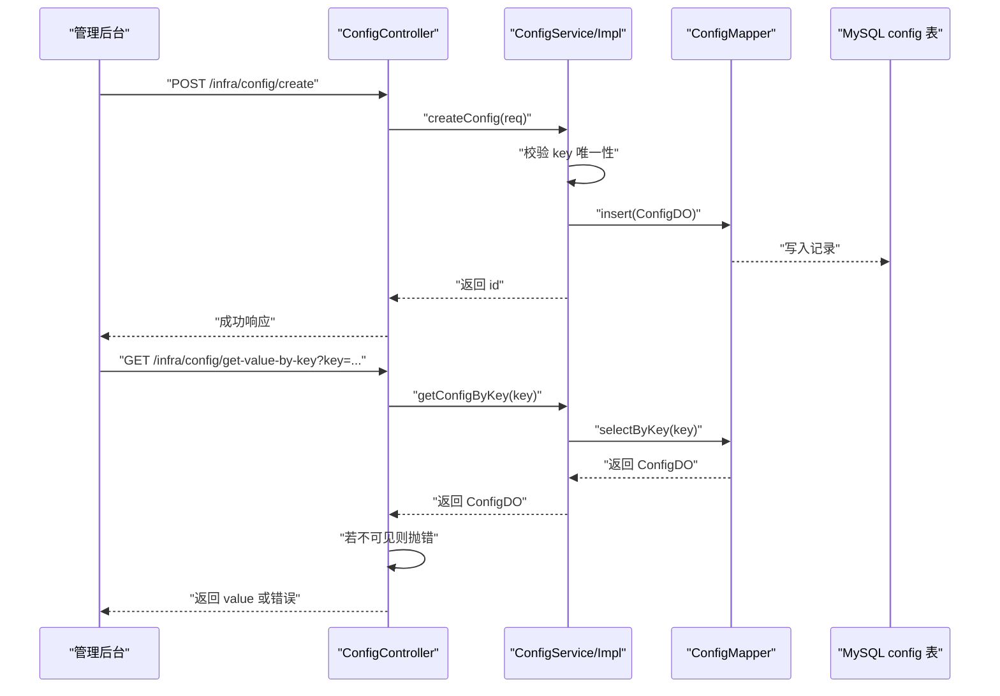
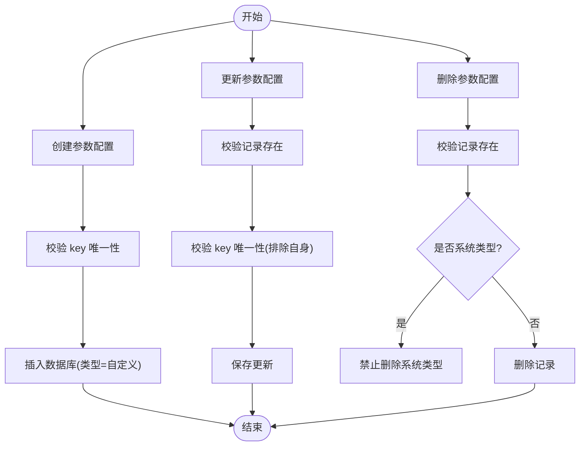
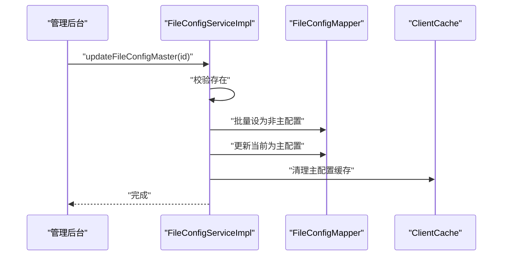
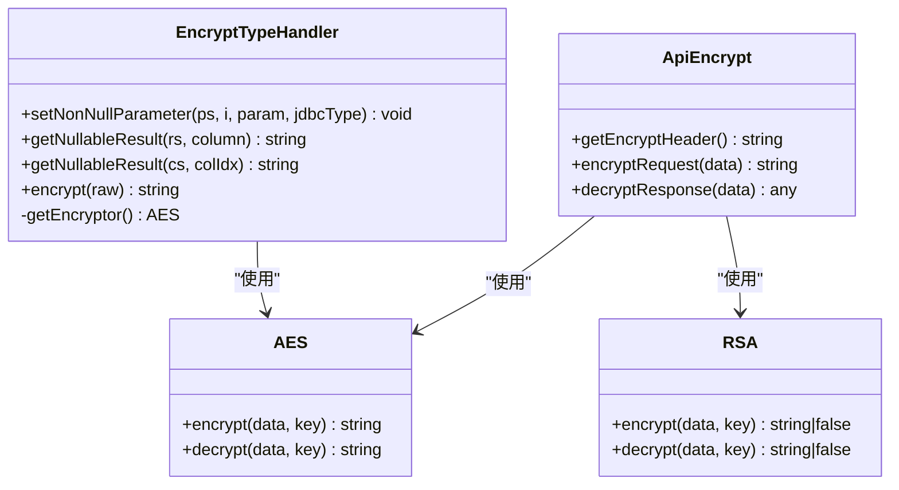
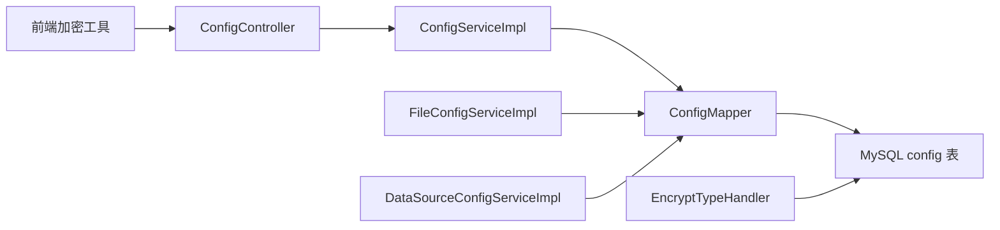

# 配置管理中心

<cite>
**本文引用的文件**
- [ConfigController.java](file://yudao-module-infra/src/main/java/cn/iocoder/yudao/module/infra/controller/admin/config/ConfigController.java)
- [ConfigService.java](file://yudao-module-infra/src/main/java/cn/iocoder/yudao/module/infra/service/config/ConfigService.java)
- [ConfigServiceImpl.java](file://yudao-module-infra/src/main/java/cn/iocoder/yudao/module/infra/service/config/ConfigServiceImpl.java)
- [ConfigApi.java](file://yudao-module-infra/src/main/java/cn/iocoder/yudao/module/infra/api/config/ConfigApi.java)
- [ConfigApiImpl.java](file://yudao-module-infra/src/main/java/cn/iocoder/yudao/module/infra/api/config/ConfigApiImpl.java)
- [application.yaml](file://yudao-server/src/main/resources/application.yaml)
- [encrypt.ts](file://yudao-ui/yudao-ui-admin-vue3/src/utils/encrypt.ts)
- [jsencrypt.ts](file://yudao-ui/yudao-ui-admin-vue3/src/utils/jsencrypt.ts)
- [EncryptTypeHandler.java](file://yudao-framework/yudao-spring-boot-starter-mybatis/src/main/java/cn/iocoder/yudao/framework/mybatis/core/type/EncryptTypeHandler.java)
- [FileConfigServiceImpl.java](file://yudao-module-infra/src/main/java/cn/iocoder/yudao/module/infra/service/file/FileConfigServiceImpl.java)
- [FileConfigServiceImplTest.java](file://yudao-module-infra/src/test/java/cn/iocoder/yudao/module/infra/service/file/FileConfigServiceImplTest.java)
- [DataSourceConfigService.java](file://yudao-module-infra/src/main/java/cn/iocoder/yudao/module/infra/service/db/DataSourceConfigService.java)
- [DataSourceConfigServiceImpl.java](file://yudao-module-infra/src/main/java/cn/iocoder/yudao/module/infra/service/db/DataSourceConfigServiceImpl.java)
- [DatabaseTableServiceImpl.java](file://yudao-module-infra/src/main/java/cn/iocoder/yudao/module/infra/service/db/DatabaseTableServiceImpl.java)
</cite>

## 目录
1. [简介](#简介)
2. [项目结构](#项目结构)
3. [核心组件](#核心组件)
4. [架构总览](#架构总览)
5. [组件详解](#组件详解)
6. [依赖关系分析](#依赖关系分析)
7. [性能考量](#性能考量)
8. [故障排查指南](#故障排查指南)
9. [结论](#结论)
10. [附录](#附录)

## 简介
本文件面向“配置管理中心”的技术文档，聚焦于动态配置管理机制、配置分类体系、加密存储方案、版本与回滚、导入导出与批量操作、配置模板管理以及设计规范与最佳实践。通过对后端控制器、服务层、API 层、前端加密工具与数据库字段加密处理器的综合分析，帮助读者快速理解并安全高效地使用配置中心能力。

## 项目结构
配置中心由“管理后台接口 + 服务层 + 数据访问层 + 前端加密工具 + 数据库字段加密处理器”构成，覆盖参数配置、文件存储配置、数据源配置等多类配置场景，并提供导出、可见性控制与批量操作能力。

图表来源
- [ConfigController.java:36-117](file://yudao-module-infra/src/main/java/cn/iocoder/yudao/module/infra/controller/admin/config/ConfigController.java#L36-L117)
- [ConfigServiceImpl.java:27-124](file://yudao-module-infra/src/main/java/cn/iocoder/yudao/module/infra/service/config/ConfigServiceImpl.java#L27-L124)
- [ConfigApiImpl.java:14-27](file://yudao-module-infra/src/main/java/cn/iocoder/yudao/module/infra/api/config/ConfigApiImpl.java#L14-L27)
- [EncryptTypeHandler.java:21-75](file://yudao-framework/yudao-spring-boot-starter-mybatis/src/main/java/cn/iocoder/yudao/framework/mybatis/core/type/EncryptTypeHandler.java#L21-L75)

章节来源
- [ConfigController.java:36-117](file://yudao-module-infra/src/main/java/cn/iocoder/yudao/module/infra/controller/admin/config/ConfigController.java#L36-L117)
- [ConfigService.java:16-71](file://yudao-module-infra/src/main/java/cn/iocoder/yudao/module/infra/service/config/ConfigService.java#L16-L71)
- [ConfigServiceImpl.java:27-124](file://yudao-module-infra/src/main/java/cn/iocoder/yudao/module/infra/service/config/ConfigServiceImpl.java#L27-L124)
- [ConfigApi.java:8-19](file://yudao-module-infra/src/main/java/cn/iocoder/yudao/module/infra/api/config/ConfigApi.java#L8-L19)
- [ConfigApiImpl.java:14-27](file://yudao-module-infra/src/main/java/cn/iocoder/yudao/module/infra/api/config/ConfigApiImpl.java#L14-L27)
- [EncryptTypeHandler.java:21-75](file://yudao-framework/yudao-spring-boot-starter-mybatis/src/main/java/cn/iocoder/yudao/framework/mybatis/core/type/EncryptTypeHandler.java#L21-L75)

## 核心组件
- 参数配置管理
  - 控制器提供创建、更新、删除、分页查询、导出 Excel、按 key 获取值等能力；并对不可见配置进行访问控制。
  - 服务层负责参数键唯一性校验、类型区分（系统/自定义）、删除限制（禁止删除系统类型）。
  - API 层提供按 key 查询值的能力，便于内部模块安全调用。
- 文件存储配置
  - 支持更新文件客户端配置、切换主配置、批量删除、删除校验（禁止删除主配置）及缓存清理。
- 数据源配置
  - 提供数据源配置的创建、更新、删除、批量删除、查询与列表能力；结合动态数据源属性进行运行时生效。
- 前端加密与后端字段加密
  - 前端支持 AES/RSA 加密工具，后端通过 MyBatis TypeHandler 实现字段级 AES 加密存储。
- 配置加密与密钥管理
  - 后端配置文件启用 API 加密开关与算法选择；字段加密依赖 jasypt.encryptor.password 属性。

章节来源
- [ConfigController.java:41-115](file://yudao-module-infra/src/main/java/cn/iocoder/yudao/module/infra/controller/admin/config/ConfigController.java#L41-L115)
- [ConfigServiceImpl.java:33-95](file://yudao-module-infra/src/main/java/cn/iocoder/yudao/module/infra/service/config/ConfigServiceImpl.java#L33-L95)
- [ConfigApiImpl.java:21-25](file://yudao-module-infra/src/main/java/cn/iocoder/yudao/module/infra/api/config/ConfigApiImpl.java#L21-L25)
- [FileConfigServiceImpl.java:87-169](file://yudao-module-infra/src/main/java/cn/iocoder/yudao/module/infra/service/file/FileConfigServiceImpl.java#L87-L169)
- [DataSourceConfigService.java:14-60](file://yudao-module-infra/src/main/java/cn/iocoder/yudao/module/infra/service/db/DataSourceConfigService.java#L14-L60)
- [DataSourceConfigServiceImpl.java:26-34](file://yudao-module-infra/src/main/java/cn/iocoder/yudao/module/infra/service/db/DataSourceConfigServiceImpl.java#L26-L34)
- [application.yaml:275-281](file://yudao-server/src/main/resources/application.yaml#L275-L281)
- [encrypt.ts:143-231](file://yudao-ui/yudao-ui-admin-vue3/src/utils/encrypt.ts#L143-L231)
- [EncryptTypeHandler.java:21-75](file://yudao-framework/yudao-spring-boot-starter-mybatis/src/main/java/cn/iocoder/yudao/framework/mybatis/core/type/EncryptTypeHandler.java#L21-L75)

## 架构总览
配置中心采用“控制器-服务-数据访问-持久化”的分层架构，配合前端加密与后端字段加密，形成“传输加密 + 存储加密”的双重保障。同时，通过可见性控制与类型区分，确保系统配置的安全与稳定。

图表来源
- [ConfigController.java:41-94](file://yudao-module-infra/src/main/java/cn/iocoder/yudao/module/infra/controller/admin/config/ConfigController.java#L41-L94)
- [ConfigServiceImpl.java:33-90](file://yudao-module-infra/src/main/java/cn/iocoder/yudao/module/infra/service/config/ConfigServiceImpl.java#L33-L90)

## 组件详解

### 参数配置管理
- 功能要点
  - 创建/更新/删除/批量删除：支持对自定义配置进行全生命周期管理；系统类型配置禁止删除。
  - 分页查询与导出：支持分页与 Excel 导出，便于运维审计与迁移。
  - 可见性控制：不可见配置禁止直接返回值，防止敏感信息泄露。
- 关键流程
  - 创建：校验 key 唯一性，设置类型为自定义，写入数据库。
  - 更新：校验存在与 key 唯一性，执行更新。
  - 删除：校验存在与类型，系统类型禁止删除；批量删除同理。
  - 查询：按 id 获取完整配置；按 key 获取值时进行可见性检查。

图表来源
- [ConfigServiceImpl.java:33-80](file://yudao-module-infra/src/main/java/cn/iocoder/yudao/module/infra/service/config/ConfigServiceImpl.java#L33-L80)

章节来源
- [ConfigController.java:41-115](file://yudao-module-infra/src/main/java/cn/iocoder/yudao/module/infra/controller/admin/config/ConfigController.java#L41-L115)
- [ConfigService.java:16-71](file://yudao-module-infra/src/main/java/cn/iocoder/yudao/module/infra/service/config/ConfigService.java#L16-L71)
- [ConfigServiceImpl.java:33-95](file://yudao-module-infra/src/main/java/cn/iocoder/yudao/module/infra/service/config/ConfigServiceImpl.java#L33-L95)

### 文件存储配置
- 功能要点
  - 更新文件配置：解析客户端配置对象，参数校验后更新；更新后清理缓存。
  - 切换主配置：批量取消其他主配置，仅保留当前主配置；更新后清理缓存。
  - 删除与批量删除：禁止删除主配置；删除后清理缓存。
- 关键流程
  - 解析客户端配置：根据存储类型选择对应配置类，进行 JSON 反序列化与参数校验。
  - 缓存清理：按 id 或主配置标识清理本地缓存，保证读取一致性。

图表来源
- [FileConfigServiceImpl.java:101-112](file://yudao-module-infra/src/main/java/cn/iocoder/yudao/module/infra/service/file/FileConfigServiceImpl.java#L101-L112)

章节来源
- [FileConfigServiceImpl.java:87-169](file://yudao-module-infra/src/main/java/cn/iocoder/yudao/module/infra/service/file/FileConfigServiceImpl.java#L87-L169)
- [FileConfigServiceImplTest.java:110-140](file://yudao-module-infra/src/test/java/cn/iocoder/yudao/module/infra/service/file/FileConfigServiceImplTest.java#L110-L140)

### 数据源配置
- 功能要点
  - 提供数据源配置的创建、更新、删除、批量删除、查询与列表能力。
  - 结合动态数据源属性，实现运行时生效与切换。
- 关键流程
  - 通过服务接口与映射器交互，完成数据源配置的持久化与查询。

章节来源
- [DataSourceConfigService.java:14-60](file://yudao-module-infra/src/main/java/cn/iocoder/yudao/module/infra/service/db/DataSourceConfigService.java#L14-L60)
- [DataSourceConfigServiceImpl.java:26-34](file://yudao-module-infra/src/main/java/cn/iocoder/yudao/module/infra/service/db/DataSourceConfigServiceImpl.java#L26-L34)
- [DatabaseTableServiceImpl.java:27-31](file://yudao-module-infra/src/main/java/cn/iocoder/yudao/module/infra/service/db/DatabaseTableServiceImpl.java#L27-L31)

### 前端加密与后端字段加密
- 前端加密
  - 支持 AES 与 RSA 两种算法，通过环境变量控制开关、算法与密钥。
  - 提供请求加密与响应解密工具，便于 API 传输安全。
- 后端字段加密
  - 基于 MyBatis TypeHandler，在 JDBC 层面对字段进行 AES 加密存储。
  - 依赖 jasypt.encryptor.password 属性作为密钥来源。

图表来源
- [encrypt.ts:143-231](file://yudao-ui/yudao-ui-admin-vue3/src/utils/encrypt.ts#L143-L231)
- [EncryptTypeHandler.java:21-75](file://yudao-framework/yudao-spring-boot-starter-mybatis/src/main/java/cn/iocoder/yudao/framework/mybatis/core/type/EncryptTypeHandler.java#L21-L75)

章节来源
- [encrypt.ts:1-231](file://yudao-ui/yudao-ui-admin-vue3/src/utils/encrypt.ts#L1-L231)
- [jsencrypt.ts:1-31](file://yudao-ui/yudao-ui-admin-vue3/src/utils/jsencrypt.ts#L1-L31)
- [application.yaml:275-281](file://yudao-server/src/main/resources/application.yaml#L275-L281)
- [EncryptTypeHandler.java:21-75](file://yudao-framework/yudao-spring-boot-starter-mybatis/src/main/java/cn/iocoder/yudao/framework/mybatis/core/type/EncryptTypeHandler.java#L21-L75)

### 配置分类体系
- 自定义配置
  - 由管理员创建与维护，可自由编辑与删除。
- 系统配置
  - 由系统内置，禁止删除；用于系统运行的关键参数。
- 文件存储配置
  - 管理文件客户端（如 OSS、本地等）的配置，支持主配置切换与缓存清理。
- 数据源配置
  - 管理多数据源连接参数，支持动态切换与运行时生效。

章节来源
- [ConfigServiceImpl.java:39-63](file://yudao-module-infra/src/main/java/cn/iocoder/yudao/module/infra/service/config/ConfigServiceImpl.java#L39-L63)
- [FileConfigServiceImpl.java:101-112](file://yudao-module-infra/src/main/java/cn/iocoder/yudao/module/infra/service/file/FileConfigServiceImpl.java#L101-L112)
- [DataSourceConfigService.java:14-60](file://yudao-module-infra/src/main/java/cn/iocoder/yudao/module/infra/service/db/DataSourceConfigService.java#L14-L60)

### 配置版本管理与回滚
- 当前实现
  - 参数配置与文件存储配置均未提供显式的版本号字段与变更历史记录。
  - 回滚需依赖数据库备份或外部版本控制系统。
- 建议
  - 引入配置版本表与变更审计日志，记录每次变更的 key、旧值、新值、操作人与时间戳。
  - 提供“按版本号回滚”接口，确保原子性与幂等性。

章节来源
- [ConfigServiceImpl.java:33-95](file://yudao-module-infra/src/main/java/cn/iocoder/yudao/module/infra/service/config/ConfigServiceImpl.java#L33-L95)
- [FileConfigServiceImpl.java:87-169](file://yudao-module-infra/src/main/java/cn/iocoder/yudao/module/infra/service/file/FileConfigServiceImpl.java#L87-L169)

### 导入导出与批量操作
- 导出
  - 支持将参数配置导出为 Excel 文件，便于归档与迁移。
- 批量操作
  - 支持批量删除参数配置与批量删除文件配置；删除前进行主配置校验。
- 配置模板管理
  - 当前未发现专用“模板”实体或接口；可通过导出/导入实现模板化复用。

章节来源
- [ConfigController.java:104-115](file://yudao-module-infra/src/main/java/cn/iocoder/yudao/module/infra/controller/admin/config/ConfigController.java#L104-L115)
- [FileConfigServiceImpl.java:140-154](file://yudao-module-infra/src/main/java/cn/iocoder/yudao/module/infra/service/file/FileConfigServiceImpl.java#L140-L154)

### 配置项设计规范与使用示例
- 设计规范
  - key 唯一性：同一业务域内 key 必须全局唯一，避免冲突。
  - 类型区分：系统关键参数使用系统类型，普通参数使用自定义类型。
  - 可见性：涉及敏感信息的配置应标记为不可见，避免直接暴露。
  - 加密策略：敏感字段建议使用后端字段加密；传输层可选 AES/RSA 前端加密。
- 使用示例
  - 前端加密：通过 ApiEncrypt.encryptRequest 对请求体进行加密，设置加密头后发送。
  - 后端字段加密：在实体字段上注册 EncryptTypeHandler，自动完成加密/解密。
  - 可见性控制：调用按 key 获取值接口时，若配置不可见则抛出错误。

章节来源
- [ConfigController.java:82-94](file://yudao-module-infra/src/main/java/cn/iocoder/yudao/module/infra/controller/admin/config/ConfigController.java#L82-L94)
- [ConfigApiImpl.java:21-25](file://yudao-module-infra/src/main/java/cn/iocoder/yudao/module/infra/api/config/ConfigApiImpl.java#L21-L25)
- [encrypt.ts:143-185](file://yudao-ui/yudao-ui-admin-vue3/src/utils/encrypt.ts#L143-L185)
- [EncryptTypeHandler.java:21-75](file://yudao-framework/yudao-spring-boot-starter-mybatis/src/main/java/cn/iocoder/yudao/framework/mybatis/core/type/EncryptTypeHandler.java#L21-L75)

## 依赖关系分析
- 控制器依赖服务层；服务层依赖映射器与枚举；映射器访问数据库。
- 前端加密工具与后端字段加密处理器分别在传输层与存储层提供安全保障。
- 文件存储配置与数据源配置独立于参数配置，但共享相同的分层结构与缓存清理策略。

图表来源
- [ConfigController.java:36-117](file://yudao-module-infra/src/main/java/cn/iocoder/yudao/module/infra/controller/admin/config/ConfigController.java#L36-L117)
- [ConfigServiceImpl.java:27-124](file://yudao-module-infra/src/main/java/cn/iocoder/yudao/module/infra/service/config/ConfigServiceImpl.java#L27-L124)
- [FileConfigServiceImpl.java:87-169](file://yudao-module-infra/src/main/java/cn/iocoder/yudao/module/infra/service/file/FileConfigServiceImpl.java#L87-L169)
- [DataSourceConfigServiceImpl.java:26-34](file://yudao-module-infra/src/main/java/cn/iocoder/yudao/module/infra/service/db/DataSourceConfigServiceImpl.java#L26-L34)
- [EncryptTypeHandler.java:21-75](file://yudao-framework/yudao-spring-boot-starter-mybatis/src/main/java/cn/iocoder/yudao/framework/mybatis/core/type/EncryptTypeHandler.java#L21-L75)

章节来源
- [ConfigController.java:36-117](file://yudao-module-infra/src/main/java/cn/iocoder/yudao/module/infra/controller/admin/config/ConfigController.java#L36-L117)
- [ConfigServiceImpl.java:27-124](file://yudao-module-infra/src/main/java/cn/iocoder/yudao/module/infra/service/config/ConfigServiceImpl.java#L27-L124)
- [FileConfigServiceImpl.java:87-169](file://yudao-module-infra/src/main/java/cn/iocoder/yudao/module/infra/service/file/FileConfigServiceImpl.java#L87-L169)
- [DataSourceConfigServiceImpl.java:26-34](file://yudao-module-infra/src/main/java/cn/iocoder/yudao/module/infra/service/db/DataSourceConfigServiceImpl.java#L26-L34)
- [EncryptTypeHandler.java:21-75](file://yudao-framework/yudao-spring-boot-starter-mybatis/src/main/java/cn/iocoder/yudao/framework/mybatis/core/type/EncryptTypeHandler.java#L21-L75)

## 性能考量
- 缓存清理
  - 文件存储配置在更新/删除/切换主配置后主动清理缓存，避免脏读。
- 分页导出
  - 导出接口使用无分页大小限制的分页查询，注意大批量导出的内存占用与耗时。
- 字段加密
  - JDBC 层加密/解密带来一定 CPU 开销，建议在高并发场景评估性能影响并优化密钥加载策略。

章节来源
- [FileConfigServiceImpl.java:162-169](file://yudao-module-infra/src/main/java/cn/iocoder/yudao/module/infra/service/file/FileConfigServiceImpl.java#L162-L169)
- [ConfigController.java:104-115](file://yudao-module-infra/src/main/java/cn/iocoder/yudao/module/infra/controller/admin/config/ConfigController.java#L104-L115)
- [EncryptTypeHandler.java:21-75](file://yudao-framework/yudao-spring-boot-starter-mybatis/src/main/java/cn/iocoder/yudao/framework/mybatis/core/type/EncryptTypeHandler.java#L21-L75)

## 故障排查指南
- 访问不可见配置
  - 现象：按 key 获取值时报错。
  - 原因：配置标记为不可见。
  - 处理：调整配置可见性或改用内部 API。
- 删除系统类型配置
  - 现象：删除报错。
  - 原因：系统类型禁止删除。
  - 处理：仅允许删除自定义类型配置。
- 删除主配置文件存储
  - 现象：删除报错。
  - 原因：主配置禁止删除。
  - 处理：先切换主配置再删除。
- 前端加密失败
  - 现象：请求加密/响应解密异常。
  - 原因：算法或密钥配置错误。
  - 处理：核对环境变量与密钥长度，确认算法匹配。

章节来源
- [ConfigController.java:82-94](file://yudao-module-infra/src/main/java/cn/iocoder/yudao/module/infra/controller/admin/config/ConfigController.java#L82-L94)
- [ConfigServiceImpl.java:60-63](file://yudao-module-infra/src/main/java/cn/iocoder/yudao/module/infra/service/config/ConfigServiceImpl.java#L60-L63)
- [FileConfigServiceImplTest.java:137-140](file://yudao-module-infra/src/test/java/cn/iocoder/yudao/module/infra/service/file/FileConfigServiceImplTest.java#L137-L140)
- [encrypt.ts:156-185](file://yudao-ui/yudao-ui-admin-vue3/src/utils/encrypt.ts#L156-L185)

## 结论
配置管理中心以清晰的分层架构与严格的可见性控制为基础，结合前端与后端双层加密，提供了安全可靠的动态配置能力。建议后续引入版本与审计、模板与批量导入导出能力，进一步完善配置治理闭环。

## 附录
- 配置项设计建议
  - key 命名：业务域.子模块.参数名，避免重复与歧义。
  - 类型划分：系统关键参数使用系统类型，普通参数使用自定义类型。
  - 可见性：敏感参数默认不可见，必要时通过内部 API 返回。
  - 加密：敏感字段优先使用后端字段加密；对外接口可选前端加密。
- 最佳实践
  - 所有变更均通过管理后台操作并保留审计痕迹。
  - 批量操作前先做主配置校验与风险评估。
  - 定期备份配置数据，确保可回滚与可恢复。