# 客户服务模块

<cite>
**本文档引用的文件**
- [CsTaskController.java](file://yudao-module-opshub/src/main/java/cn/iocoder/yudao/module/opshub/controller/admin/cs/CsTaskController.java)
- [CsTaskService.java](file://yudao-module-opshub/src/main/java/cn/iocoder/yudao/module/opshub/service/cs/CsTaskService.java)
- [CsTaskServiceImpl.java](file://yudao-module-opshub/src/main/java/cn/iocoder/yudao/module/opshub/service/cs/impl/CsTaskServiceImpl.java)
- [CsTaskDO.java](file://yudao-module-opshub/src/main/java/cn/iocoder/yudao/module/opshub/dal/dataobject/cs/CsTaskDO.java)
- [CsTaskPageReqVO.java](file://yudao-module-opshub/src/main/java/cn/iocoder/yudao/module/opshub/controller/admin/cs/vo/CsTaskPageReqVO.java)
- [feature_step6-客服模块_ddl.sql](file://docs/sql/branches/feature_step6-客服模块/feature_step6-客服模块_ddl.sql)
- [index.vue](file://yudao-ui/yudao-ui-admin-vue3/src/views/opshub/customerservice/index.vue)
- [TaskTab.vue](file://yudao-ui/yudao-ui-admin-vue3/src/views/opshub/customerservice/components/TaskTab.vue)
- [OpReqTab.vue](file://yudao-ui/yudao-ui-admin-vue3/src/views/opshub/customerservice/components/OpReqTab.vue)
- [feature_step7-电商客服系统_ddl.sql](file://db/branches/feature_step7-电商客服系统/feature_step7-电商客服系统_ddl.sql)
- [CsSessionServiceImpl.java](file://yudao-module-opshub/src/main/java/cn/iocoder/yudao/module/opshub/service/cs/impl/CsSessionServiceImpl.java)
- [CsMessageServiceImpl.java](file://yudao-module-opshub/src/main/java/cn/iocoder/yudao/module/opshub/service/cs/impl/CsMessageServiceImpl.java)
- [CsSessionDO.java](file://yudao-module-opshub/src/main/java/cn/iocoder/yudao/module/opshub/dal/dataobject/cs/CsSessionDO.java)
- [CsMessageDO.java](file://yudao-module-opshub/src/main/java/cn/iocoder/yudao/module/opshub/dal/dataobject/cs/CsMessageDO.java)
- [CsWebSocketService.java](file://yudao-module-opshub/src/main/java/cn/iocoder/yudao/module/opshub/service/cs/websocket/CsWebSocketService.java)
- [CsChatMessage.java](file://yudao-module-opshub/src/main/java/cn/iocoder/yudao/module/opshub/service/cs/websocket/dto/CsChatMessage.java)
- [ChatWindow.vue](file://yudao-ui/yudao-ui-admin-vue3/src/components/CsChatWindow/ChatWindow.vue)
- [useCsWebSocket.ts](file://yudao-ui/yudao-ui-admin-vue3/src/hooks/useCsWebSocket.ts)
</cite>

## 更新摘要
**所做更改**
- 新增电商客服系统完整实现说明
- 新增数据库架构（ops_cs_session、ops_cs_message表）分析
- 新增后端服务（CsSessionServiceImpl、CsMessageServiceImpl）详细实现
- 新增前端组件（ChatWindow、ChatMessageList等）分析
- 新增WebSocket实时通信集成说明
- 更新架构图为电商客服系统集成

## 目录
1. [简介](#简介)
2. [项目结构](#项目结构)
3. [核心组件](#核心组件)
4. [架构概览](#架构概览)
5. [详细组件分析](#详细组件分析)
6. [电商客服系统实现](#电商客服系统实现)
7. [数据库架构设计](#数据库架构设计)
8. [实时通信集成](#实时通信集成)
9. [模块化标签页系统](#模块化标签页系统)
10. [API模块支持](#api模块支持)
11. [依赖关系分析](#依赖关系分析)
12. [性能考虑](#性能考虑)
13. [故障排除指南](#故障排除指南)
14. [结论](#结论)

## 简介

客户服务模块是基于企业运营平台（OpsHub）开发的一套完整的客户服务管理系统。该模块现已实现电商客服系统的完整功能，包括在线咨询服务、会话管理、消息传递和实时通信等核心功能。

**更新** 模块已从传统的工单管理扩展为包含电商客服系统的完整服务体系，支持多种咨询类型、实时聊天和会话状态管理。

本模块采用前后端分离架构，前端使用Vue.js 3.0 + Element Plus构建用户界面，后端基于Spring Boot + MyBatis Plus实现业务逻辑，集成了BPM工作流引擎、WebSocket实时通信技术和通知系统。

## 项目结构

客户服务模块在整体项目中的组织结构如下：

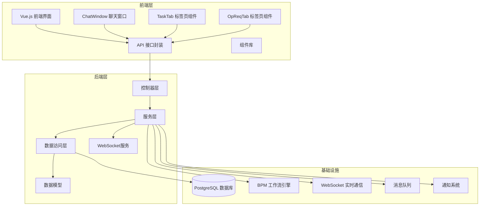

**图表来源**
- [index.vue:1-20](file://yudao-ui/yudao-ui-admin-vue3/src/views/opshub/customerservice/index.vue#L1-L20)
- [ChatWindow.vue:1-209](file://yudao-ui/yudao-ui-admin-vue3/src/components/CsChatWindow/ChatWindow.vue#L1-L209)
- [TaskTab.vue:1-50](file://yudao-ui/yudao-ui-admin-vue3/src/views/opshub/customerservice/components/TaskTab.vue#L1-L50)
- [OpReqTab.vue:1-50](file://yudao-ui/yudao-ui-admin-vue3/src/views/opshub/customerservice/components/OpReqTab.vue#L1-L50)

**章节来源**
- [index.vue:1-20](file://yudao-ui/yudao-ui-admin-vue3/src/views/opshub/customerservice/index.vue#L1-L20)
- [ChatWindow.vue:1-209](file://yudao-ui/yudao-ui-admin-vue3/src/components/CsChatWindow/ChatWindow.vue#L1-L209)
- [TaskTab.vue:1-50](file://yudao-ui/yudao-ui-admin-vue3/src/views/opshub/customerservice/components/TaskTab.vue#L1-L50)
- [OpReqTab.vue:1-50](file://yudao-ui/yudao-ui-admin-vue3/src/views/opshub/customerservice/components/OpReqTab.vue#L1-L50)

## 核心组件

客户服务模块的核心组件包括：

### 1. 工单状态管理
- **待接单 (0)**: 新创建的工单状态
- **处理中 (1)**: 已被执行员接单的状态
- **已交付 (2)**: 执行员已完成处理的状态
- **已关闭 (3)**: 经销商验收通过的状态
- **已退回 (4)**: 经销商退回需要重新处理的状态

### 2. 会话状态管理（电商客服）
- **待处理 (0)**: 新创建的咨询会话状态
- **处理中 (1)**: 已被执行员接单的状态
- **已完成 (2)**: 处理员已完成处理的状态
- **已关闭 (3)**: 经销商关闭对话的状态

### 3. 咨询类型分类
- **签约**: 合同签署相关问题
- **政策**: 政策解读和咨询
- **售后**: 售后服务和维护
- **订单**: 订单处理和变更
- **基础数据**: 基础数据管理和查询
- **其他**: 未归类的其他事务

### 4. 工单紧急程度
- **紧急 (0)**: 需要立即处理
- **高 (1)**: 重要且紧急
- **中 (2)**: 正常处理优先级
- **低 (3)**: 一般性事务

### 5. 工单分类体系
- **签约**: 合同签署相关问题
- **政策**: 政策解读和咨询
- **售后**: 售后服务和维护
- **订单**: 订单处理和变更
- **数据**: 数据管理和查询
- **其他**: 未归类的其他事务

**章节来源**
- [feature_step6-客服模块_ddl.sql:44-48](file://docs/sql/branches/feature_step6-客服模块/feature_step6-客服模块_ddl.sql#L44-L48)
- [feature_step7-电商客服系统_ddl.sql:60-61](file://db/branches/feature_step7-电商客服系统/feature_step7-电商客服系统_ddl.sql#L60-L61)
- [index.vue:214-235](file://yudao-ui/yudao-ui-admin-vue3/src/views/opshub/customerservice/index.vue#L214-L235)

## 架构概览

客户服务模块采用分层架构设计，现已升级为电商客服系统集成架构，确保了系统的可维护性和扩展性：

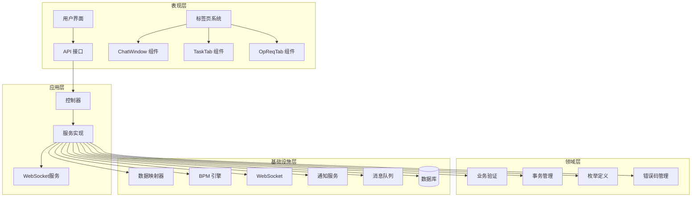

**图表来源**
- [index.vue:1-20](file://yudao-ui/yudao-ui-admin-vue3/src/views/opshub/customerservice/index.vue#L1-L20)
- [ChatWindow.vue:1-209](file://yudao-ui/yudao-ui-admin-vue3/src/components/CsChatWindow/ChatWindow.vue#L1-L209)
- [TaskTab.vue:1-50](file://yudao-ui/yudao-ui-admin-vue3/src/views/opshub/customerservice/components/TaskTab.vue#L1-L50)
- [OpReqTab.vue:1-50](file://yudao-ui/yudao-ui-admin-vue3/src/views/opshub/customerservice/components/OpReqTab.vue#L1-L50)

## 详细组件分析

### 控制器层分析

控制器层负责处理HTTP请求和响应，提供RESTful API接口：

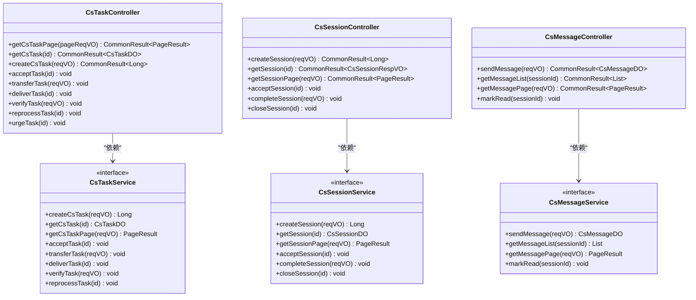

**图表来源**
- [CsTaskController.java:24-104](file://yudao-module-opshub/src/main/java/cn/iocoder/yudao/module/opshub/controller/admin/cs/CsTaskController.java#L24-L104)
- [CsSessionController.java:24-34](file://yudao-module-opshub/src/main/java/cn/iocoder/yudao/module/opshub/controller/admin/cs/CsSessionController.java#L24-L34)
- [CsTaskService.java:10-60](file://yudao-module-opshub/src/main/java/cn/iocoder/yudao/module/opshub/service/cs/CsTaskService.java#L10-L60)

**章节来源**
- [CsTaskController.java:24-104](file://yudao-module-opshub/src/main/java/cn/iocoder/yudao/module/opshub/controller/admin/cs/CsTaskController.java#L24-L104)
- [CsSessionController.java:24-34](file://yudao-module-opshub/src/main/java/cn/iocoder/yudao/module/opshub/controller/admin/cs/CsSessionController.java#L24-L34)
- [CsTaskService.java:10-60](file://yudao-module-opshub/src/main/java/cn/iocoder/yudao/module/opshub/service/cs/CsTaskService.java#L10-L60)

### 服务层业务逻辑

服务层实现了核心的业务逻辑和状态流转控制：

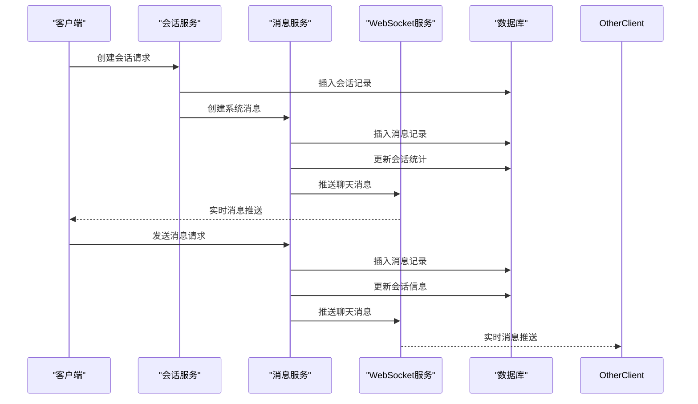

**图表来源**
- [CsSessionServiceImpl.java:66-105](file://yudao-module-opshub/src/main/java/cn/iocoder/yudao/module/opshub/service/cs/impl/CsSessionServiceImpl.java#L66-L105)
- [CsMessageServiceImpl.java:48-115](file://yudao-module-opshub/src/main/java/cn/iocoder/yudao/module/opshub/service/cs/impl/CsMessageServiceImpl.java#L48-L115)

**章节来源**
- [CsSessionServiceImpl.java:66-105](file://yudao-module-opshub/src/main/java/cn/iocoder/yudao/module/opshub/service/cs/impl/CsSessionServiceImpl.java#L66-L105)
- [CsMessageServiceImpl.java:48-115](file://yudao-module-opshub/src/main/java/cn/iocoder/yudao/module/opshub/service/cs/impl/CsMessageServiceImpl.java#L48-L115)

### 数据模型设计

工单和会话数据模型采用了标准的实体关系设计：

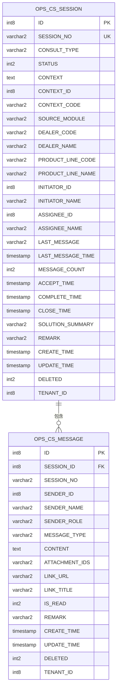

**图表来源**
- [CsSessionDO.java:19-124](file://yudao-module-opshub/src/main/java/cn/iocoder/yudao/module/opshub/dal/dataobject/cs/CsSessionDO.java#L19-L124)
- [CsMessageDO.java:17-78](file://yudao-module-opshub/src/main/java/cn/iocoder/yudao/module/opshub/dal/dataobject/cs/CsMessageDO.java#L17-L78)
- [feature_step7-电商客服系统_ddl.sql:12-130](file://db/branches/feature_step7-电商客服系统/feature_step7-电商客服系统_ddl.sql#L12-L130)

**章节来源**
- [CsSessionDO.java:19-124](file://yudao-module-opshub/src/main/java/cn/iocoder/yudao/module/opshub/dal/dataobject/cs/CsSessionDO.java#L19-L124)
- [CsMessageDO.java:17-78](file://yudao-module-opshub/src/main/java/cn/iocoder/yudao/module/opshub/dal/dataobject/cs/CsMessageDO.java#L17-L78)
- [feature_step7-电商客服系统_ddl.sql:12-130](file://db/branches/feature_step7-电商客服系统/feature_step7-电商客服系统_ddl.sql#L12-L130)

## 电商客服系统实现

**新增** 电商客服系统实现了完整的在线咨询服务功能，包括会话管理、消息传递和实时通信。

### 会话管理服务

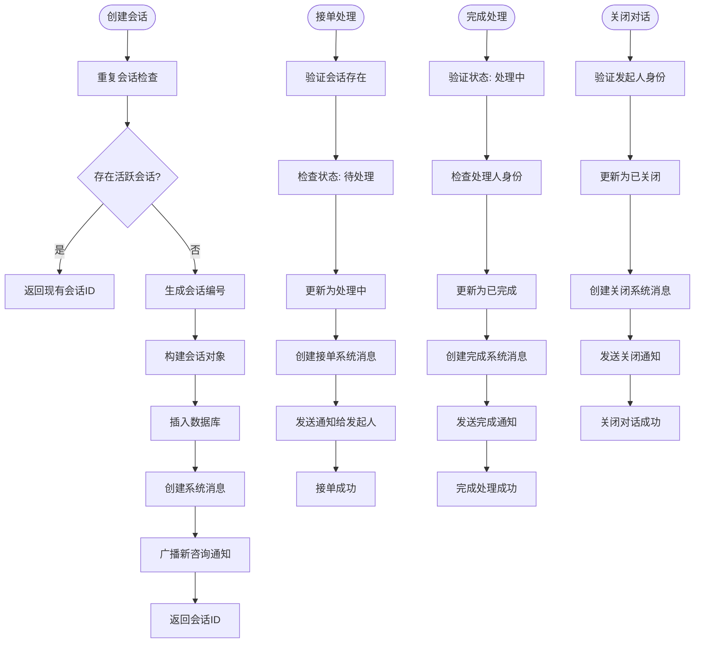

**图表来源**
- [CsSessionServiceImpl.java:66-105](file://yudao-module-opshub/src/main/java/cn/iocoder/yudao/module/opshub/service/cs/impl/CsSessionServiceImpl.java#L66-L105)
- [CsSessionServiceImpl.java:125-154](file://yudao-module-opshub/src/main/java/cn/iocoder/yudao/module/opshub/service/cs/impl/CsSessionServiceImpl.java#L125-L154)
- [CsSessionServiceImpl.java:156-187](file://yudao-module-opshub/src/main/java/cn/iocoder/yudao/module/opshub/service/cs/impl/CsSessionServiceImpl.java#L156-L187)
- [CsSessionServiceImpl.java:189-219](file://yudao-module-opshub/src/main/java/cn/iocoder/yudao/module/opshub/service/cs/impl/CsSessionServiceImpl.java#L189-L219)

### 消息管理服务

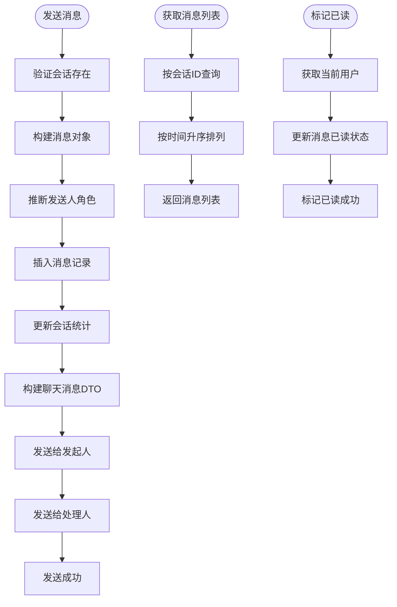

**图表来源**
- [CsMessageServiceImpl.java:48-115](file://yudao-module-opshub/src/main/java/cn/iocoder/yudao/module/opshub/service/cs/impl/CsMessageServiceImpl.java#L48-L115)
- [CsMessageServiceImpl.java:117-132](file://yudao-module-opshub/src/main/java/cn/iocoder/yudao/module/opshub/service/cs/impl/CsMessageServiceImpl.java#L117-L132)

**章节来源**
- [CsSessionServiceImpl.java:66-105](file://yudao-module-opshub/src/main/java/cn/iocoder/yudao/module/opshub/service/cs/impl/CsSessionServiceImpl.java#L66-L105)
- [CsMessageServiceImpl.java:48-115](file://yudao-module-opshub/src/main/java/cn/iocoder/yudao/module/opshub/service/cs/impl/CsMessageServiceImpl.java#L48-L115)

## 数据库架构设计

**新增** 电商客服系统引入了完整的数据库架构，包括会话表和消息表的设计。

### 数据库表结构

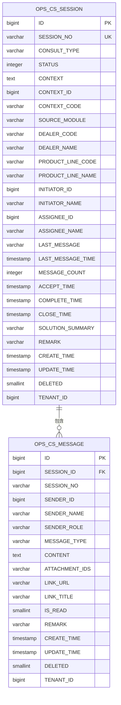

**图表来源**
- [feature_step7-电商客服系统_ddl.sql:12-130](file://db/branches/feature_step7-电商客服系统/feature_step7-电商客服系统_ddl.sql#L12-L130)

### 索引设计策略

| 索引类型 | 字段组合 | 用途 | 性能影响 |
|---------|---------|------|---------|
| 主键索引 | id | 唯一标识符 | O(log n) |
| 唯一索引 | session_no | 会话编号查询 | O(log n) |
| 普通索引 | consult_type | 咨询类型过滤 | O(log n) |
| 普通索引 | status | 状态查询 | O(log n) |
| 普通索引 | dealer_code | 经销商权限控制 | O(log n) |
| 普通索引 | initiator_id | 发起人查询 | O(log n) |
| 普通索引 | assignee_id | 处理人查询 | O(log n) |
| 普通索引 | context_code | 上下文关联查询 | O(log n) |
| 普通索引 | last_message_time | 最新消息排序 | O(log n) |
| 普通索引 | session_id | 消息会话关联 | O(log n) |
| 普通索引 | create_time | 消息时间排序 | O(log n) |

### 序列化设计

- **ops_cs_session_seq**: 会话主键序列，支持自动生成唯一ID
- **ops_cs_message_seq**: 消息主键序列，支持自动生成唯一ID

**章节来源**
- [feature_step7-电商客服系统_ddl.sql:12-130](file://db/branches/feature_step7-电商客服系统/feature_step7-电商客服系统_ddl.sql#L12-L130)

## 实时通信集成

**新增** 电商客服系统集成了WebSocket实时通信功能，支持消息推送和会话事件通知。

### WebSocket服务架构

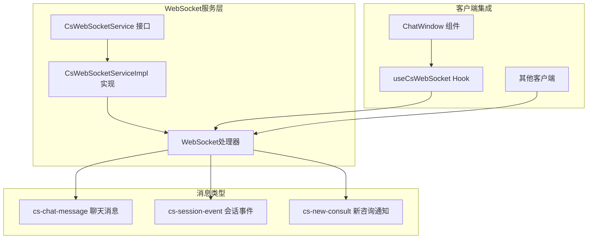

**图表来源**
- [CsWebSocketService.java:11-41](file://yudao-module-opshub/src/main/java/cn/iocoder/yudao/module/opshub/service/cs/websocket/CsWebSocketService.java#L11-L41)
- [CsChatMessage.java:13-90](file://yudao-module-opshub/src/main/java/cn/iocoder/yudao/module/opshub/service/cs/websocket/dto/CsChatMessage.java#L13-L90)
- [useCsWebSocket.ts:26-96](file://yudao-ui/yudao-ui-admin-vue3/src/hooks/useCsWebSocket.ts#L26-L96)

### 消息推送流程

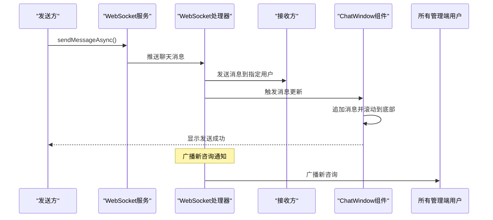

**图表来源**
- [CsMessageServiceImpl.java:89-112](file://yudao-module-opshub/src/main/java/cn/iocoder/yudao/module/opshub/service/cs/impl/CsMessageServiceImpl.java#L89-L112)
- [CsSessionServiceImpl.java:100-103](file://yudao-module-opshub/src/main/java/cn/iocoder/yudao/module/opshub/service/cs/impl/CsSessionServiceImpl.java#L100-L103)

### 前端WebSocket集成

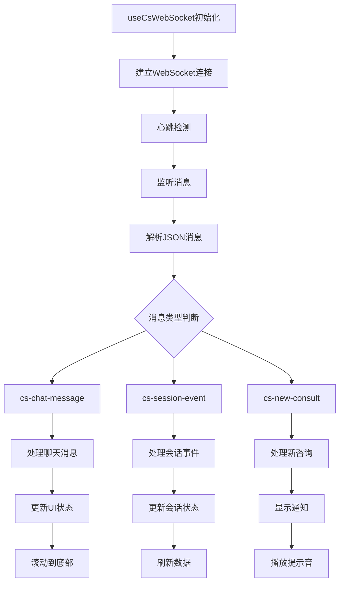

**图表来源**
- [useCsWebSocket.ts:44-82](file://yudao-ui/yudao-ui-admin-vue3/src/hooks/useCsWebSocket.ts#L44-L82)
- [ChatWindow.vue:195-205](file://yudao-ui/yudao-ui-admin-vue3/src/components/CsChatWindow/ChatWindow.vue#L195-L205)

**章节来源**
- [CsWebSocketService.java:11-41](file://yudao-module-opshub/src/main/java/cn/iocoder/yudao/module/opshub/service/cs/websocket/CsWebSocketService.java#L11-L41)
- [CsChatMessage.java:13-90](file://yudao-module-opshub/src/main/java/cn/iocoder/yudao/module/opshub/service/cs/websocket/dto/CsChatMessage.java#L13-L90)
- [useCsWebSocket.ts:26-96](file://yudao-ui/yudao-ui-admin-vue3/src/hooks/useCsWebSocket.ts#L26-L96)
- [ChatWindow.vue:195-205](file://yudao-ui/yudao-ui-admin-vue3/src/components/CsChatWindow/ChatWindow.vue#L195-L205)

## 模块化标签页系统

**更新** 客户服务模块已重构为模块化标签页界面系统，采用TaskTab、OpReqTab和ChatWindow三个核心组件实现功能分离和界面优化。

### 标签页系统架构

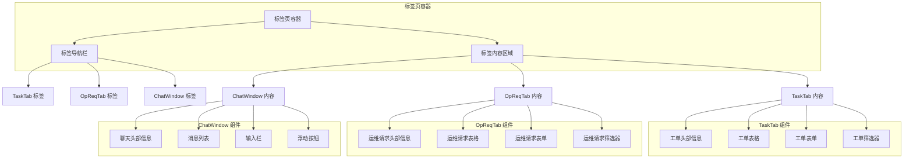

**图表来源**
- [index.vue:1-20](file://yudao-ui/yudao-ui-admin-vue3/src/views/opshub/customerservice/index.vue#L1-L20)
- [TaskTab.vue:1-50](file://yudao-ui/yudao-ui-admin-vue3/src/views/opshub/customerservice/components/TaskTab.vue#L1-L50)
- [OpReqTab.vue:1-50](file://yudao-ui/yudao-ui-admin-vue3/src/views/opshub/customerservice/components/OpReqTab.vue#L1-L50)
- [ChatWindow.vue:1-209](file://yudao-ui/yudao-ui-admin-vue3/src/components/CsChatWindow/ChatWindow.vue#L1-L209)

### ChatWindow 组件分析

ChatWindow组件是电商客服系统的核心界面组件：

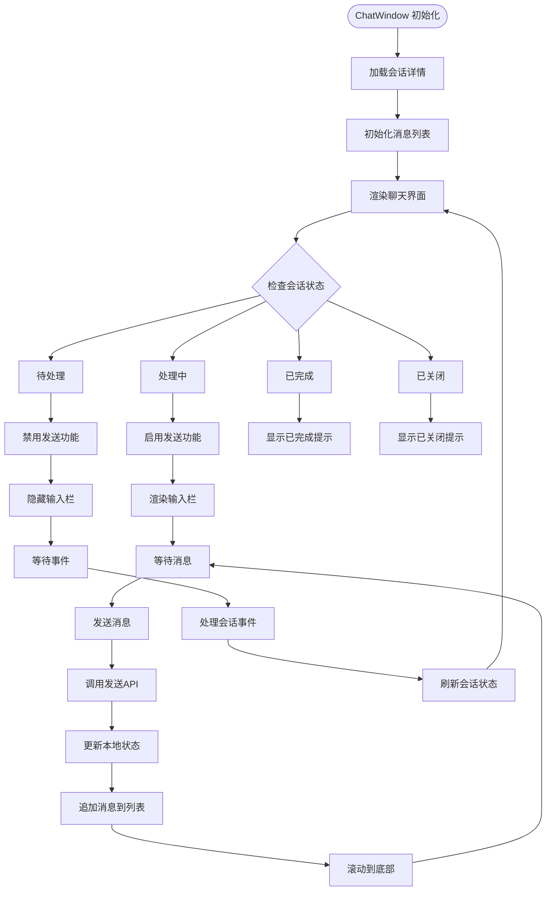

**图表来源**
- [ChatWindow.vue:94-113](file://yudao-ui/yudao-ui-admin-vue3/src/components/CsChatWindow/ChatWindow.vue#L94-L113)
- [ChatWindow.vue:171-193](file://yudao-ui/yudao-ui-admin-vue3/src/components/CsChatWindow/ChatWindow.vue#L171-L193)

**章节来源**
- [index.vue:1-20](file://yudao-ui/yudao-ui-admin-vue3/src/views/opshub/customerservice/index.vue#L1-L20)
- [TaskTab.vue:1-50](file://yudao-ui/yudao-ui-admin-vue3/src/views/opshub/customerservice/components/TaskTab.vue#L1-L50)
- [OpReqTab.vue:1-50](file://yudao-ui/yudao-ui-admin-vue3/src/views/opshub/customerservice/components/OpReqTab.vue#L1-L50)
- [ChatWindow.vue:1-209](file://yudao-ui/yudao-ui-admin-vue3/src/components/CsChatWindow/ChatWindow.vue#L1-L209)

## API模块支持

**更新** 模块现已支持独立的API模块，为TaskTab、OpReqTab和ChatWindow组件提供专门的接口支持。

### API模块架构

```mermaid
graph TB
subgraph "API模块"
TASK_API[TaskTab API模块]
OPREQ_API[OpReqTab API模块]
CHAT_API[ChatWindow API模块]
COMMON_API[通用API模块]
end
subgraph "TaskTab API"
TASK_CREATE_API[工单创建API]
TASK_QUERY_API[工单查询API]
TASK_UPDATE_API[工单更新API]
TASK_DELETE_API[工单删除API]
end
subgraph "OpReqTab API"
OPREQ_CREATE_API[运维请求创建API]
OPREQ_QUERY_API[运维请求查询API]
OPREQ_UPDATE_API[运维请求更新API]
OPREQ_DELETE_API[运维请求删除API]
end
subgraph "ChatWindow API"
CHAT_CREATE_API[会话创建API]
CHAT_QUERY_API[会话查询API]
CHAT_MESSAGE_API[消息管理API]
CHAT_WS_API[WebSocket连接API]
end
subgraph "通用API"
AUTH_API[认证API]
LOG_API[日志API]
CACHE_API[缓存API]
NOTIFY_API[通知API]
end
TASK_API --> TASK_CREATE_API
TASK_API --> TASK_QUERY_API
TASK_API --> TASK_UPDATE_API
TASK_API --> TASK_DELETE_API
OPREQ_API --> OPREQ_CREATE_API
OPREQ_API --> OPREQ_QUERY_API
OPREQ_API --> OPREQ_UPDATE_API
OPREQ_API --> OPREQ_DELETE_API
CHAT_API --> CHAT_CREATE_API
CHAT_API --> CHAT_QUERY_API
CHAT_API --> CHAT_MESSAGE_API
CHAT_API --> CHAT_WS_API
COMMON_API --> AUTH_API
COMMON_API --> LOG_API
COMMON_API --> CACHE_API
COMMON_API --> NOTIFY_API
```

**图表来源**
- [TaskTab.vue:1-50](file://yudao-ui/yudao-ui-admin-vue3/src/views/opshub/customerservice/components/TaskTab.vue#L1-L50)
- [OpReqTab.vue:1-50](file://yudao-ui/yudao-ui-admin-vue3/src/views/opshub/customerservice/components/OpReqTab.vue#L1-L50)
- [ChatWindow.vue:57-67](file://yudao-ui/yudao-ui-admin-vue3/src/components/CsChatWindow/ChatWindow.vue#L57-L67)

### API调用流程

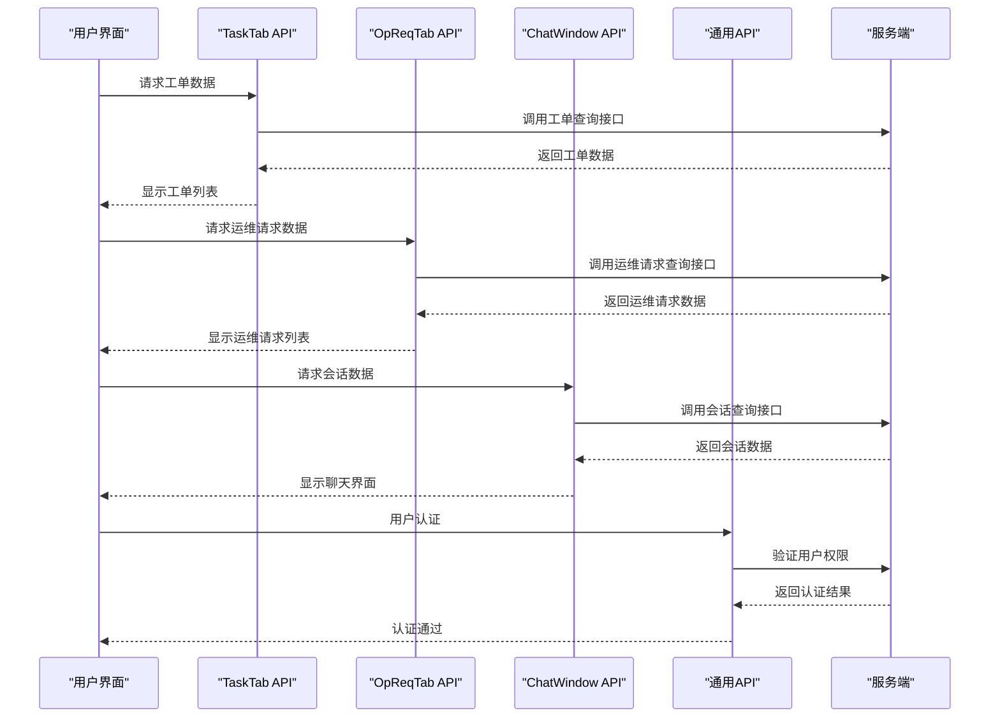

**图表来源**
- [TaskTab.vue:1-50](file://yudao-ui/yudao-ui-admin-vue3/src/views/opshub/customerservice/components/TaskTab.vue#L1-L50)
- [OpReqTab.vue:1-50](file://yudao-ui/yudao-ui-admin-vue3/src/views/opshub/customerservice/components/OpReqTab.vue#L1-L50)
- [ChatWindow.vue:57-67](file://yudao-ui/yudao-ui-admin-vue3/src/components/CsChatWindow/ChatWindow.vue#L57-L67)

**章节来源**
- [TaskTab.vue:1-50](file://yudao-ui/yudao-ui-admin-vue3/src/views/opshub/customerservice/components/TaskTab.vue#L1-L50)
- [OpReqTab.vue:1-50](file://yudao-ui/yudao-ui-admin-vue3/src/views/opshub/customerservice/components/OpReqTab.vue#L1-L50)
- [ChatWindow.vue:57-67](file://yudao-ui/yudao-ui-admin-vue3/src/components/CsChatWindow/ChatWindow.vue#L57-L67)

## 依赖关系分析

客户服务模块的依赖关系体现了清晰的分层架构和模块化设计：

```mermaid
graph LR
subgraph "外部依赖"
SPRING[Spring Boot]
MYBATIS[MyBatis Plus]
BPM[BPM 引擎]
WEBSOCKET[WebSocket]
SYSTEM[System 模块]
ELEMENTPLUS[Element Plus]
VUE3[Vue.js 3.0]
END
subgraph "内部模块"
OPShub[Opshub 模块]
Framework[框架层]
end
subgraph "客户服务模块"
TAB_CONTAINER[标签页容器]
TASK_TAB[TaskTab 组件]
OPREQ_TAB[OpReqTab 组件]
CHAT_WINDOW[ChatWindow 组件]
TASK_API[TaskTab API模块]
OPREQ_API[OpReqTab API模块]
CHAT_API[ChatWindow API模块]
COMMON_API[通用API模块]
WS_SERVICE[WebSocket服务]
END
SPRING --> TAB_CONTAINER
MYBATIS --> TASK_API
MYBATIS --> CHAT_API
BPM --> OPREQ_API
WEBSOCKET --> WS_SERVICE
SYSTEM --> COMMON_API
ELEMENTPLUS --> TAB_CONTAINER
VUE3 --> TASK_TAB
VUE3 --> OPREQ_TAB
VUE3 --> CHAT_WINDOW
TAB_CONTAINER --> TASK_TAB
TAB_CONTAINER --> OPREQ_TAB
TAB_CONTAINER --> CHAT_WINDOW
TASK_TAB --> TASK_API
OPREQ_TAB --> OPREQ_API
CHAT_WINDOW --> CHAT_API
TASK_API --> COMMON_API
OPREQ_API --> COMMON_API
CHAT_API --> WS_SERVICE
CHAT_API --> COMMON_API
WS_SERVICE --> OPShub
Framework --> TAB_CONTAINER
Framework --> TASK_TAB
Framework --> OPREQ_TAB
Framework --> CHAT_WINDOW
```

**图表来源**
- [index.vue:1-20](file://yudao-ui/yudao-ui-admin-vue3/src/views/opshub/customerservice/index.vue#L1-L20)
- [TaskTab.vue:1-50](file://yudao-ui/yudao-ui-admin-vue3/src/views/opshub/customerservice/components/TaskTab.vue#L1-L50)
- [OpReqTab.vue:1-50](file://yudao-ui/yudao-ui-admin-vue3/src/views/opshub/customerservice/components/OpReqTab.vue#L1-L50)
- [ChatWindow.vue:1-209](file://yudao-ui/yudao-ui-admin-vue3/src/components/CsChatWindow/ChatWindow.vue#L1-L209)

**章节来源**
- [index.vue:1-20](file://yudao-ui/yudao-ui-admin-vue3/src/views/opshub/customerservice/index.vue#L1-L20)
- [TaskTab.vue:1-50](file://yudao-ui/yudao-ui-admin-vue3/src/views/opshub/customerservice/components/TaskTab.vue#L1-L50)
- [OpReqTab.vue:1-50](file://yudao-ui/yudao-ui-admin-vue3/src/views/opshub/customerservice/components/OpReqTab.vue#L1-L50)
- [ChatWindow.vue:1-209](file://yudao-ui/yudao-ui-admin-vue3/src/components/CsChatWindow/ChatWindow.vue#L1-L209)

## 性能考虑

客户服务模块在设计时充分考虑了性能优化，电商客服系统进一步提升了用户体验：

### 数据库优化
- **索引策略**: 为常用查询字段建立复合索引，包括状态、处理人、创建人、经销商编码等
- **序列化**: 使用数据库序列生成唯一ID，避免并发冲突
- **分区设计**: 支持按时间分区存储历史数据
- **连接池**: 优化数据库连接池配置，支持高并发访问

### 缓存策略
- **会话缓存**: 使用Redis缓存用户会话信息
- **配置缓存**: 缓存系统配置和枚举值
- **查询缓存**: 缓存热点查询结果
- **组件缓存**: 标签页组件状态缓存
- **消息缓存**: 最新消息缓存，减少数据库查询

### 异步处理
- **消息队列**: 使用消息队列异步处理耗时操作
- **批量处理**: 支持批量数据导入导出
- **定时任务**: 异步清理过期数据
- **懒加载**: 标签页内容按需加载
- **WebSocket异步**: 实时消息推送采用异步处理

### 前端性能优化
- **组件拆分**: TaskTab、OpReqTab、ChatWindow组件独立加载
- **虚拟滚动**: 大数据量表格使用虚拟滚动
- **防抖节流**: 输入框和搜索功能使用防抖节流
- **图片懒加载**: 图片资源按需加载
- **WebSocket连接复用**: 多个组件共享WebSocket连接

### 实时通信优化
- **心跳机制**: WebSocket自动心跳检测，保证连接稳定
- **消息去重**: 防止重复消息推送
- **离线消息**: 断线重连后同步历史消息
- **消息分页**: 大量历史消息分页加载
- **内存管理**: 及时清理不再使用的消息数据

## 故障排除指南

### 常见问题及解决方案

| 问题类型 | 症状描述 | 可能原因 | 解决方案 |
|---------|---------|---------|---------|
| 标签页加载失败 | 切换标签页时页面空白 | 组件加载异常或API调用失败 | 检查组件依赖和网络连接 |
| 工单创建失败 | 提交后无响应或报错 | 权限不足或数据验证失败 | 检查用户权限和必填字段 |
| 会话创建失败 | 创建会话时报重复会话错误 | 存在活跃的相同上下文会话 | 检查会话去重逻辑和上下文参数 |
| 消息发送失败 | 发送消息后无响应 | WebSocket连接异常或权限验证失败 | 检查WebSocket连接状态和用户角色 |
| 实时消息不显示 | 新消息无法实时显示 | WebSocket消息解析异常 | 检查消息格式和类型判断逻辑 |
| 会话状态异常 | 状态无法正常流转 | 会话状态验证失败或权限不足 | 检查状态机逻辑和用户权限 |
| 通知推送失败 | 处理人未收到通知 | WebSocket连接异常或用户离线 | 检查网络连接和服务器状态 |
| 查询性能慢 | 页面加载缓慢 | 缺少必要索引或查询条件不当 | 添加索引和优化SQL查询 |
| 标签页切换卡顿 | 切换时页面响应慢 | 组件渲染复杂或数据量过大 | 优化组件结构和数据处理 |

### 调试工具和方法

1. **日志分析**: 查看服务端日志了解错误堆栈
2. **数据库监控**: 监控SQL执行时间和慢查询
3. **网络诊断**: 检查WebSocket连接状态
4. **权限验证**: 确认用户角色和权限配置
5. **组件调试**: 使用Vue DevTools检查组件状态
6. **API测试**: 使用Postman测试API接口
7. **WebSocket调试**: 使用浏览器开发者工具查看WebSocket消息
8. **性能分析**: 使用性能分析工具识别性能瓶颈

**章节来源**
- [CsSessionServiceImpl.java:240-260](file://yudao-module-opshub/src/main/java/cn/iocoder/yudao/module/opshub/service/cs/impl/CsSessionServiceImpl.java#L240-L260)
- [CsMessageServiceImpl.java:136-150](file://yudao-module-opshub/src/main/java/cn/iocoder/yudao/module/opshub/service/cs/impl/CsMessageServiceImpl.java#L136-L150)

## 结论

客户服务模块经过重构和电商客服系统集成后，已成为一个功能完整、架构清晰、界面友好的企业级客户服务管理系统。通过采用现代化的模块化标签页设计、电商客服系统实现和实时通信集成，该模块实现了以下关键特性：

### 技术优势
- **模块化设计**: 清晰的分层架构便于维护和扩展
- **标签页系统**: TaskTab、OpReqTab、ChatWindow组件实现功能分离
- **API模块化**: 独立的API模块支持提高代码复用性
- **状态机管理**: 完整的工单和会话状态流转控制
- **实时通信**: 基于WebSocket的通知机制和消息推送
- **工作流集成**: 与BPM引擎深度集成
- **数据库优化**: 完整的电商客服数据库架构设计

### 业务价值
- **提升效率**: 自动化的工单分配和跟踪
- **增强协作**: 多角色协同处理机制
- **改善体验**: 直观的用户界面和操作流程
- **保障质量**: SLA管理和质量控制机制
- **降低维护成本**: 模块化设计便于功能扩展
- **实时沟通**: 在线客服提供即时响应能力

### 用户体验改进
- **界面优化**: 模块化标签页提供更好的导航体验
- **性能提升**: 组件独立加载减少页面负担
- **响应速度**: API模块化提高接口调用效率
- **功能分离**: TaskTab、OpReqTab、ChatWindow各司其职，界面更清晰
- **实时交互**: WebSocket实现实时消息推送和状态更新

该模块为企业提供了强大的客户服务支撑能力，能够有效提升客户满意度和服务质量，同时为未来的功能扩展奠定了坚实的基础。电商客服系统的加入使得客户服务模块不仅能够处理传统工单，还能提供实时在线咨询服务，满足现代企业的多元化客户服务需求。