# 客户服务模块

<cite>
**本文档引用的文件**
- [CsTaskController.java](file://yudao-module-opshub/src/main/java/cn/iocoder/yudao/module/opshub/controller/admin/cs/CsTaskController.java)
- [CsTaskService.java](file://yudao-module-opshub/src/main/java/cn/iocoder/yudao/module/opshub/service/cs/CsTaskService.java)
- [CsTaskServiceImpl.java](file://yudao-module-opshub/src/main/java/cn/iocoder/yudao/module/opshub/service/cs/impl/CsTaskServiceImpl.java)
- [CsTaskDO.java](file://yudao-module-opshub/src/main/java/cn/iocoder/yudao/module/opshub/dal/dataobject/cs/CsTaskDO.java)
- [CsTaskPageReqVO.java](file://yudao-module-opshub/src/main/java/cn/iocoder/yudao/module/opshub/controller/admin/cs/vo/CsTaskPageReqVO.java)
- [feature_step6-客服模块_ddl.sql](file://docs/sql/branches/feature_step6-客服模块/feature_step6-客服模块_ddl.sql)
- [index.vue](file://yudao-ui/yudao-ui-admin-vue3/src/views/opshub/customerservice/index.vue)
- [TaskTab.vue](file://yudao-ui/yudao-ui-admin-vue3/src/views/opshub/customerservice/components/TaskTab.vue)
- [OpReqTab.vue](file://yudao-ui/yudao-ui-admin-vue3/src/views/opshub/customerservice/components/OpReqTab.vue)
- [ConsultTab.vue](file://yudao-ui/yudao-ui-admin-vue3/src/views/opshub/customerservice/components/ConsultTab.vue)
- [feature_step7-电商客服系统_ddl.sql](file://db/branches/feature_step7-电商客服系统/feature_step7-电商客服系统_ddl.sql)
- [CsSessionServiceImpl.java](file://yudao-module-opshub/src/main/java/cn/iocoder/yudao/module/opshub/service/cs/impl/CsSessionServiceImpl.java)
- [CsMessageServiceImpl.java](file://yudao-module-opshub/src/main/java/cn/iocoder/yudao/module/opshub/service/cs/impl/CsMessageServiceImpl.java)
- [CsSessionDO.java](file://yudao-module-opshub/src/main/java/cn/iocoder/yudao/module/opshub/dal/dataobject/cs/CsSessionDO.java)
- [CsMessageDO.java](file://yudao-module-opshub/src/main/java/cn/iocoder/yudao/module/opshub/dal/dataobject/cs/CsMessageDO.java)
- [CsWebSocketService.java](file://yudao-module-opshub/src/main/java/cn/iocoder/yudao/module/opshub/service/cs/websocket/CsWebSocketService.java)
- [CsWebSocketServiceImpl.java](file://yudao-module-opshub/src/main/java/cn/iocoder/yudao/module/opshub/service/cs/websocket/impl/CsWebSocketServiceImpl.java)
- [CsChatMessage.java](file://yudao-module-opshub/src/main/java/cn/iocoder/yudao/module/opshub/service/cs/websocket/dto/CsChatMessage.java)
- [ChatWindow.vue](file://yudao-ui/yudao-ui-admin-vue3/src/components/CsChatWindow/ChatWindow.vue)
- [useCsWebSocket.ts](file://yudao-ui/yudao-ui-admin-vue3/src/hooks/useCsWebSocket.ts)
- [useCsConsult.ts](file://yudao-ui/yudao-ui-admin-vue3/src/hooks/useCsConsult.ts)
- [ChatFloatingButton.vue](file://yudao-ui/yudao-ui-admin-vue3/src/components/CsChatWindow/ChatFloatingButton.vue)
- [ChatHeader.vue](file://yudao-ui/yudao-ui-admin-vue3/src/components/CsChatWindow/ChatHeader.vue)
- [ChatMessageList.vue](file://yudao-ui/yudao-ui-admin-vue3/src/components/CsChatWindow/ChatMessageList.vue)
- [ChatInputBar.vue](file://yudao-ui/yudao-ui-admin-vue3/src/components/CsChatWindow/ChatInputBar.vue)
- [Layout.vue](file://yudao-ui/yudao-ui-admin-vue3/src/layout/Layout.vue)
- [CsSessionController.java](file://yudao-module-opshub/src/main/java/cn/iocoder/yudao/module/opshub/controller/admin/cs/CsSessionController.java)
- [CsSessionCreateReqVO.java](file://yudao-module-opshub/src/main/java/cn/iocoder/yudao/module/opshub/controller/admin/cs/vo/CsSessionCreateReqVO.java)
- [CsSessionMapper.java](file://yudao-module-opshub/src/main/java/cn/iocoder/yudao/module/opshub/dal/mysql/cs/CsSessionMapper.java)
- [csSession/index.ts](file://yudao-ui/yudao-ui-admin-vue3/src/api/opshub/csSession/index.ts)
- [PRD-Step7-电商客服系统.md](file://docs/PRD-Step7-电商客服系统.md)
- [index.vue](file://yudao-ui/yudao-ui-admin-vue3/src/views/opshub/csWorkbench/index.vue)
- [ConsultSessionList.vue](file://yudao-ui/yudao-ui-admin-vue3/src/views/opshub/csWorkbench/components/ConsultSessionList.vue)
- [ConsultChatPanel.vue](file://yudao-ui/yudao-ui-admin-vue3/src/views/opshub/csWorkbench/components/ConsultChatPanel.vue)
- [CsExecutorNotifier.vue](file://yudao-ui/yudao-ui-admin-vue3/src/components/CsChatWindow/CsExecutorNotifier.vue)
- [ExecutorProductLineScopeService.java](file://yudao-module-opshub/src/main/java/cn/iocoder/yudao/module/opshub/service/dealer/ExecutorProductLineScopeService.java)
- [ExecutorProductLineScopeServiceImpl.java](file://yudao-module-opshub/src/main/java/cn/iocoder/yudao/module/opshub/service/dealer/impl/ExecutorProductLineScopeServiceImpl.java)
- [ExecutorProductLineScopeMapper.java](file://yudao-module-opshub/src/main/java/cn/iocoder/yudao/module/opshub/dal/mysql/dealer/ExecutorProductLineScopeMapper.java)
- [ExecutorProductLineScopeDO.java](file://yudao-module-opshub/src/main/java/cn/iocoder/yudao/module/opshub/dal/dataobject/dealer/ExecutorProductLineScopeDO.java)
- [DealerProductLineScopeController.java](file://yudao-module-opshub/src/main/java/cn/iocoder/yudao/module/opshub/controller/admin/dealer/DealerProductLineScopeController.java)
- [opshub-step1.sql](file://sql/postgresql/opshub-step1.sql)
</cite>

## 更新摘要
**所做更改**
- 新增客户服务工作台功能，包括咨询会话列表和聊天面板组件
- 新增执行员产品线授权管理功能，支持角色×产品线的精准通知
- 新增CsExecutorNotifier全局通知组件，提供新咨询提醒功能
- 重构WebSocket通知系统，从广播机制改为精确匹配执行器的通知系统
- 新增咨询工作台路由和页面集成
- 更新实时通信集成说明，包含新的通知类型和授权机制

## 目录
1. [简介](#简介)
2. [项目结构](#项目结构)
3. [核心组件](#核心组件)
4. [架构概览](#架构概览)
5. [详细组件分析](#详细组件分析)
6. [电商客服系统实现](#电商客服系统实现)
7. [客户服务工作台](#客户服务工作台)
8. [执行员产品线授权管理](#执行员产品线授权管理)
9. [全局通知组件](#全局通知组件)
10. [WebSocket通知系统重构](#websocket通知系统重构)
11. [实时通信集成](#实时通信集成)
12. [模块化标签页系统](#模块化标签页系统)
13. [API模块支持](#api模块支持)
14. [数据库架构设计](#数据库架构设计)
15. [依赖关系分析](#依赖关系分析)
16. [性能考虑](#性能考虑)
17. [故障排除指南](#故障排除指南)
18. [结论](#结论)

## 简介

客户服务模块是基于企业运营平台（OpsHub）开发的一套完整的客户服务管理系统。该模块现已实现电商客服系统的完整功能，包括在线咨询服务、会话管理、消息传递和实时通信等核心功能。

**更新** 模块已从传统的工单管理扩展为包含电商客服系统和客户服务工作台的完整服务体系，支持多种咨询类型、实时聊天、会话状态管理以及执行员产品线授权的精准通知系统。新增的客户服务工作台提供了一体化的咨询处理界面，执行员产品线授权管理确保了通知的精确匹配，全局通知组件提供了便捷的新咨询提醒功能。

本模块采用前后端分离架构，前端使用Vue.js 3.0 + Element Plus构建用户界面，后端基于Spring Boot + MyBatis Plus实现业务逻辑，集成了BPM工作流引擎、WebSocket实时通信技术和通知系统。

## 项目结构

客户服务模块在整体项目中的组织结构如下：

```mermaid
graph TB
subgraph "前端层"
FE_UI[Vue.js 前端界面]
FE_API[API 接口封装]
FE_COMPONENTS[组件库]
FE_CHATWINDOW[ChatWindow 聊天窗口]
FE_FLOATINGBUTTON[ChatFloatingButton 浮动按钮]
FE_TASKTAB[TaskTab 标签页组件]
FE_OPREQTAB[OpReqTab 标签页组件]
FE_CONSULTTAB[ConsultTab 咨询标签页]
FE_USECSCONSULT[useCsConsult 组合式函数]
FE_USECSWEBSOCKET[useCsWebSocket WebSocket Hook]
FE_WORKBENCH[客户服务工作台]
FE_SESSIONLIST[ConsultSessionList 会话列表]
FE_CHATPANEL[ConsultChatPanel 聊天面板]
FE_EXECUTORNOTIFIER[CsExecutorNotifier 全局通知]
end
subgraph "后端层"
BE_CONTROLLER[控制器层]
BE_SERVICE[服务层]
BE_DAL[数据访问层]
BE_MODEL[数据模型]
BE_WEBSOCKET[WebSocket服务]
BE_DEALER[执行员产品线授权]
end
subgraph "基础设施"
DB[(PostgreSQL 数据库)]
BPM[BPM 工作流引擎]
WS[WebSocket 实时通信]
MQ[消息队列]
NOTIFY[通知系统]
PLSCOPE[产品线授权表]
END
FE_UI --> FE_API
FE_API --> BE_CONTROLLER
FE_CHATWINDOW --> FE_API
FE_FLOATINGBUTTON --> FE_USECSCONSULT
FE_TASKTAB --> FE_API
FE_OPREQTAB --> FE_API
FE_CONSULTTAB --> FE_API
FE_WORKBENCH --> FE_SESSIONLIST
FE_WORKBENCH --> FE_CHATPANEL
FE_EXECUTORNOTIFIER --> FE_USECSWEBSOCKET
BE_CONTROLLER --> BE_SERVICE
BE_SERVICE --> BE_DAL
BE_SERVICE --> BE_WEBSOCKET
BE_SERVICE --> BE_DEALER
BE_DAL --> BE_MODEL
BE_DAL --> DB
BE_DAL --> PLSCOPE
BE_SERVICE --> BPM
BE_SERVICE --> WS
BE_SERVICE --> MQ
BE_SERVICE --> NOTIFY
```

**图表来源**
- [index.vue:1-47](file://yudao-ui/yudao-ui-admin-vue3/src/views/opshub/customerservice/index.vue#L1-L47)
- [index.vue:1-196](file://yudao-ui/yudao-ui-admin-vue3/src/views/opshub/csWorkbench/index.vue#L1-L196)
- [ConsultSessionList.vue:1-82](file://yudao-ui/yudao-ui-admin-vue3/src/views/opshub/csWorkbench/components/ConsultSessionList.vue#L1-L82)
- [ConsultChatPanel.vue:1-43](file://yudao-ui/yudao-ui-admin-vue3/src/views/opshub/csWorkbench/components/ConsultChatPanel.vue#L1-L43)
- [CsExecutorNotifier.vue:1-42](file://yudao-ui/yudao-ui-admin-vue3/src/components/CsChatWindow/CsExecutorNotifier.vue#L1-L42)

**章节来源**
- [index.vue:1-47](file://yudao-ui/yudao-ui-admin-vue3/src/views/opshub/customerservice/index.vue#L1-L47)
- [index.vue:1-196](file://yudao-ui/yudao-ui-admin-vue3/src/views/opshub/csWorkbench/index.vue#L1-L196)
- [ConsultSessionList.vue:1-82](file://yudao-ui/yudao-ui-admin-vue3/src/views/opshub/csWorkbench/components/ConsultSessionList.vue#L1-L82)
- [ConsultChatPanel.vue:1-43](file://yudao-ui/yudao-ui-admin-vue3/src/views/opshub/csWorkbench/components/ConsultChatPanel.vue#L1-L43)
- [CsExecutorNotifier.vue:1-42](file://yudao-ui/yudao-ui-admin-vue3/src/components/CsChatWindow/CsExecutorNotifier.vue#L1-L42)

## 核心组件

客户服务模块的核心组件包括：

### 1. 工单状态管理
- **待接单 (0)**: 新创建的工单状态
- **处理中 (1)**: 已被执行员接单的状态
- **已交付 (2)**: 执行员已完成处理的状态
- **已关闭 (3)**: 经销商验收通过的状态
- **已退回 (4)**: 经销商退回需要重新处理的状态

### 2. 会话状态管理（电商客服）
- **待处理 (0)**: 新创建的咨询会话状态
- **处理中 (1)**: 已被执行员接单的状态
- **已完成 (2)**: 处理员已完成处理的状态
- **已关闭 (3)**: 经销商关闭对话的状态

### 3. 咨询类型分类
- **签约**: 合同签署相关问题
- **政策**: 政策解读和咨询
- **售后**: 售后服务和维护
- **订单**: 订单处理和变更
- **基础数据**: 基础数据管理和查询
- **其他**: 未归类的其他事务

### 4. 工单紧急程度
- **紧急 (0)**: 需要立即处理
- **高 (1)**: 重要且紧急
- **中 (2)**: 正常处理优先级
- **低 (3)**: 一般性事务

### 5. 工单分类体系
- **签约**: 合同签署相关问题
- **政策**: 政策解读和咨询
- **售后**: 售后服务和维护
- **订单**: 订单处理和变更
- **数据**: 数据管理和查询
- **其他**: 未归类的其他事务

### 6. WebSocket消息类型
- **cs-chat-message**: 聊天消息推送
- **cs-session-event**: 会话事件通知
- **cs-new-consult**: 新咨询通知

### 7. 执行员产品线授权
- **执行员角色**: SERVICE_EXECUTOR
- **产品线授权**: 用户×产品线的授权关系
- **精准通知**: 基于角色×产品线交集的通知机制

**章节来源**
- [feature_step6-客服模块_ddl.sql:44-48](file://docs/sql/branches/feature_step6-客服模块/feature_step6-客服模块_ddl.sql#L44-L48)
- [feature_step7-电商客服系统_ddl.sql:60-61](file://db/branches/feature_step7-电商客服系统/feature_step7-电商客服系统_ddl.sql#L60-L61)
- [index.vue:214-235](file://yudao-ui/yudao-ui-admin-vue3/src/views/opshub/customerservice/index.vue#L214-L235)
- [useCsWebSocket.ts:68-78](file://yudao-ui/yudao-ui-admin-vue3/src/hooks/useCsWebSocket.ts#L68-L78)
- [CsWebSocketServiceImpl.java:108-144](file://yudao-module-opshub/src/main/java/cn/iocoder/yudao/module/opshub/service/cs/websocket/impl/CsWebSocketServiceImpl.java#L108-L144)

## 架构概览

客户服务模块采用分层架构设计，现已升级为电商客服系统集成架构，确保了系统的可维护性和扩展性：

```mermaid
graph TD
subgraph "表现层"
UI[用户界面]
API[API 接口]
TAB_SYSTEM[标签页系统]
CHAT_WINDOW[ChatWindow 组件]
FLOATING_BUTTON[ChatFloatingButton 组件]
TASK_TAB[TaskTab 组件]
OPREQ_TAB[OpReqTab 组件]
CONSULT_TAB[ConsultTab 组件]
USE_CS_CONSULT[useCsConsult 组合式函数]
USE_CS_WEBSOCKET[useCsWebSocket Hook]
WORKBENCH[客户服务工作台]
SESSION_LIST[ConsultSessionList 组件]
CHAT_PANEL[ConsultChatPanel 组件]
EXECUTOR_NOTIFIER[CsExecutorNotifier 组件]
end
subgraph "应用层"
CTRL[控制器]
SVC[服务实现]
WS_SERVICE[WebSocket服务]
DEALER_SERVICE[执行员产品线授权服务]
END
subgraph "领域层"
VALID[业务验证]
TRANS[事务管理]
ENUM[枚举定义]
ERROR[错误码管理]
END
subgraph "基础设施层"
MAPPER[数据映射器]
BPM[BPM 引擎]
WS[WebSocket]
NOTIFY[通知服务]
MQ[消息队列]
DB[(数据库)]
PLSCOPE[产品线授权表]
END
UI --> API
TAB_SYSTEM --> CHAT_WINDOW
TAB_SYSTEM --> FLOATING_BUTTON
TAB_SYSTEM --> TASK_TAB
TAB_SYSTEM --> OPREQ_TAB
TAB_SYSTEM --> CONSULT_TAB
CHAT_WINDOW --> USE_CS_CONSULT
CHAT_WINDOW --> USE_CS_WEBSOCKET
WORKBENCH --> SESSION_LIST
WORKBENCH --> CHAT_PANEL
EXECUTOR_NOTIFIER --> USE_CS_WEBSOCKET
API --> CTRL
CTRL --> SVC
SVC --> VALID
SVC --> TRANS
SVC --> ENUM
SVC --> ERROR
SVC --> MAPPER
SVC --> WS_SERVICE
SVC --> DEALER_SERVICE
SVC --> BPM
SVC --> WS
SVC --> NOTIFY
SVC --> MQ
SVC --> DB
SVC --> PLSCOPE
```

**图表来源**
- [index.vue:1-47](file://yudao-ui/yudao-ui-admin-vue3/src/views/opshub/customerservice/index.vue#L1-L47)
- [index.vue:1-196](file://yudao-ui/yudao-ui-admin-vue3/src/views/opshub/csWorkbench/index.vue#L1-L196)
- [ConsultSessionList.vue:1-82](file://yudao-ui/yudao-ui-admin-vue3/src/views/opshub/csWorkbench/components/ConsultSessionList.vue#L1-L82)
- [ConsultChatPanel.vue:1-43](file://yudao-ui/yudao-ui-admin-vue3/src/views/opshub/csWorkbench/components/ConsultChatPanel.vue#L1-L43)
- [CsExecutorNotifier.vue:1-42](file://yudao-ui/yudao-ui-admin-vue3/src/components/CsChatWindow/CsExecutorNotifier.vue#L1-L42)

## 详细组件分析

### 控制器层分析

控制器层负责处理HTTP请求和响应，提供RESTful API接口：

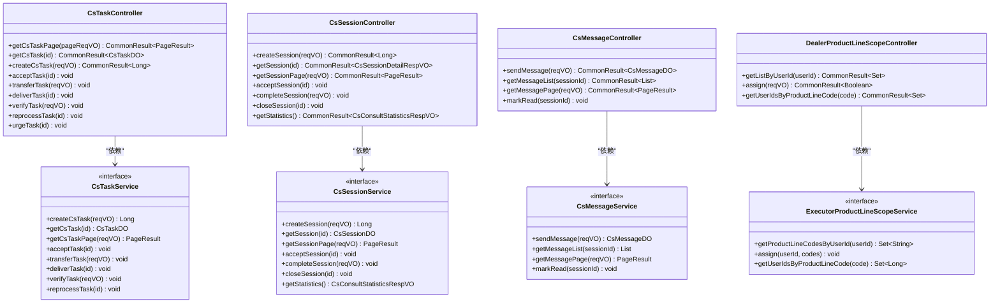

**图表来源**
- [CsTaskController.java:24-104](file://yudao-module-opshub/src/main/java/cn/iocoder/yudao/module/opshub/controller/admin/cs/CsTaskController.java#L24-L104)
- [CsSessionController.java:24-98](file://yudao-module-opshub/src/main/java/cn/iocoder/yudao/module/opshub/controller/admin/cs/CsSessionController.java#L24-L98)
- [DealerProductLineScopeController.java:32-66](file://yudao-module-opshub/src/main/java/cn/iocoder/yudao/module/opshub/controller/admin/dealer/DealerProductLineScopeController.java#L32-L66)
- [CsTaskService.java:10-60](file://yudao-module-opshub/src/main/java/cn/iocoder/yudao/module/opshub/service/cs/CsTaskService.java#L10-L60)

**章节来源**
- [CsTaskController.java:24-104](file://yudao-module-opshub/src/main/java/cn/iocoder/yudao/module/opshub/controller/admin/cs/CsTaskController.java#L24-L104)
- [CsSessionController.java:24-98](file://yudao-module-opshub/src/main/java/cn/iocoder/yudao/module/opshub/controller/admin/cs/CsSessionController.java#L24-L98)
- [DealerProductLineScopeController.java:32-66](file://yudao-module-opshub/src/main/java/cn/iocoder/yudao/module/opshub/controller/admin/dealer/DealerProductLineScopeController.java#L32-L66)
- [CsTaskService.java:10-60](file://yudao-module-opshub/src/main/java/cn/iocoder/yudao/module/opshub/service/cs/CsTaskService.java#L10-L60)

### 服务层业务逻辑

服务层实现了核心的业务逻辑和状态流转控制：

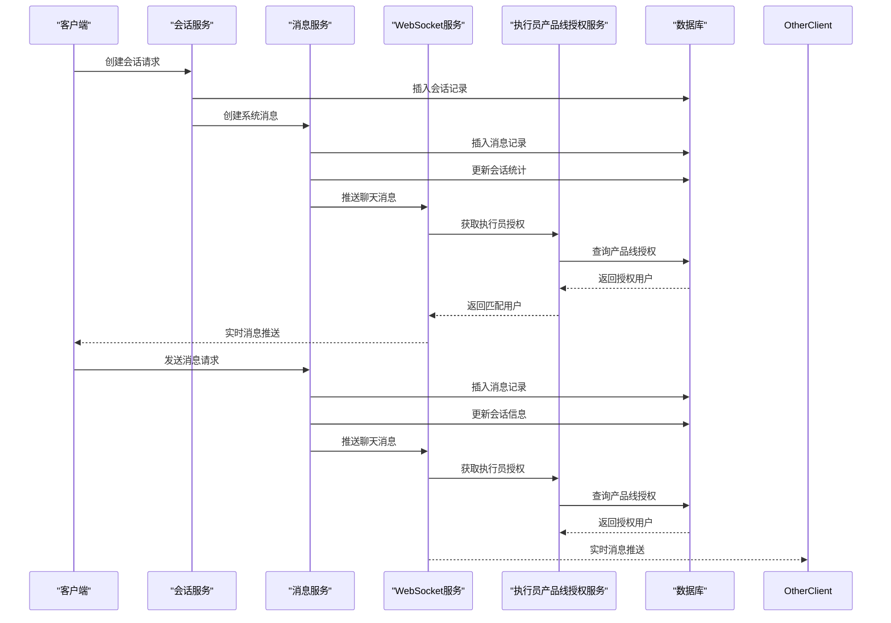

**图表来源**
- [CsSessionServiceImpl.java:66-105](file://yudao-module-opshub/src/main/java/cn/iocoder/yudao/module/opshub/service/cs/impl/CsSessionServiceImpl.java#L66-L105)
- [CsMessageServiceImpl.java:48-115](file://yudao-module-opshub/src/main/java/cn/iocoder/yudao/module/opshub/service/cs/impl/CsMessageServiceImpl.java#L48-L115)
- [CsWebSocketServiceImpl.java:108-144](file://yudao-module-opshub/src/main/java/cn/iocoder/yudao/module/opshub/service/cs/websocket/impl/CsWebSocketServiceImpl.java#L108-L144)

**章节来源**
- [CsSessionServiceImpl.java:66-105](file://yudao-module-opshub/src/main/java/cn/iocoder/yudao/module/opshub/service/cs/impl/CsSessionServiceImpl.java#L66-L105)
- [CsMessageServiceImpl.java:48-115](file://yudao-module-opshub/src/main/java/cn/iocoder/yudao/module/opshub/service/cs/impl/CsMessageServiceImpl.java#L48-L115)
- [CsWebSocketServiceImpl.java:108-144](file://yudao-module-opshub/src/main/java/cn/iocoder/yudao/module/opshub/service/cs/websocket/impl/CsWebSocketServiceImpl.java#L108-L144)

### 数据模型设计

工单和会话数据模型采用了标准的实体关系设计：

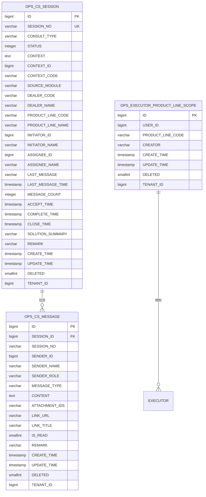

**图表来源**
- [CsSessionDO.java:19-124](file://yudao-module-opshub/src/main/java/cn/iocoder/yudao/module/opshub/dal/dataobject/cs/CsSessionDO.java#L19-L124)
- [CsMessageDO.java:17-78](file://yudao-module-opshub/src/main/java/cn/iocoder/yudao/module/opshub/dal/dataobject/cs/CsMessageDO.java#L17-L78)
- [ExecutorProductLineScopeDO.java:17-33](file://yudao-module-opshub/src/main/java/cn/iocoder/yudao/module/opshub/dal/dataobject/dealer/ExecutorProductLineScopeDO.java#L17-L33)
- [feature_step7-电商客服系统_ddl.sql:12-130](file://db/branches/feature_step7-电商客服系统/feature_step7-电商客服系统_ddl.sql#L12-L130)

**章节来源**
- [CsSessionDO.java:19-124](file://yudao-module-opshub/src/main/java/cn/iocoder/yudao/module/opshub/dal/dataobject/cs/CsSessionDO.java#L19-L124)
- [CsMessageDO.java:17-78](file://yudao-module-opshub/src/main/java/cn/iocoder/yudao/module/opshub/dal/dataobject/cs/CsMessageDO.java#L17-L78)
- [ExecutorProductLineScopeDO.java:17-33](file://yudao-module-opshub/src/main/java/cn/iocoder/yudao/module/opshub/dal/dataobject/dealer/ExecutorProductLineScopeDO.java#L17-L33)
- [feature_step7-电商客服系统_ddl.sql:12-130](file://db/branches/feature_step7-电商客服系统/feature_step7-电商客服系统_ddl.sql#L12-L130)

## 电商客服系统实现

**新增** 电商客服系统实现了完整的在线咨询服务功能，包括会话管理、消息传递和实时通信。

### 会话管理服务

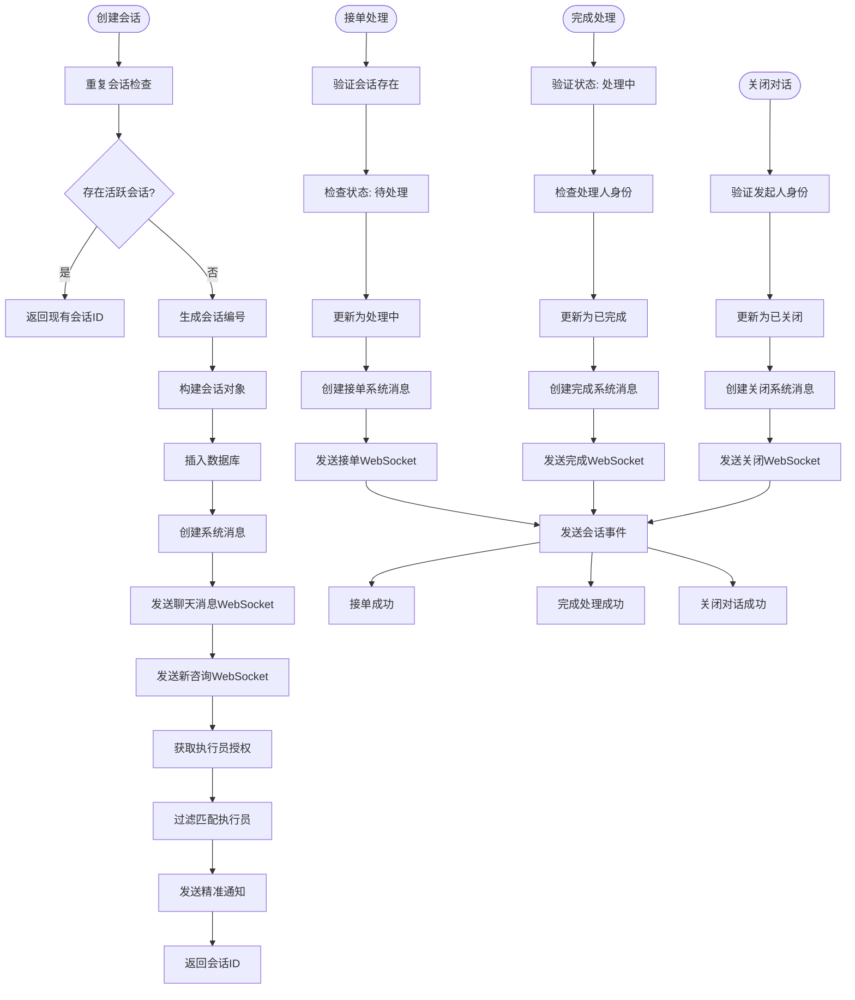

**图表来源**
- [CsSessionServiceImpl.java:66-105](file://yudao-module-opshub/src/main/java/cn/iocoder/yudao/module/opshub/service/cs/impl/CsSessionServiceImpl.java#L66-L105)
- [CsSessionServiceImpl.java:125-154](file://yudao-module-opshub/src/main/java/cn/iocoder/yudao/module/opshub/service/cs/impl/CsSessionServiceImpl.java#L125-L154)
- [CsSessionServiceImpl.java:156-187](file://yudao-module-opshub/src/main/java/cn/iocoder/yudao/module/opshub/service/cs/impl/CsSessionServiceImpl.java#L156-L187)
- [CsSessionServiceImpl.java:189-219](file://yudao-module-opshub/src/main/java/cn/iocoder/yudao/module/opshub/service/cs/impl/CsSessionServiceImpl.java#L189-L219)

### 消息管理服务

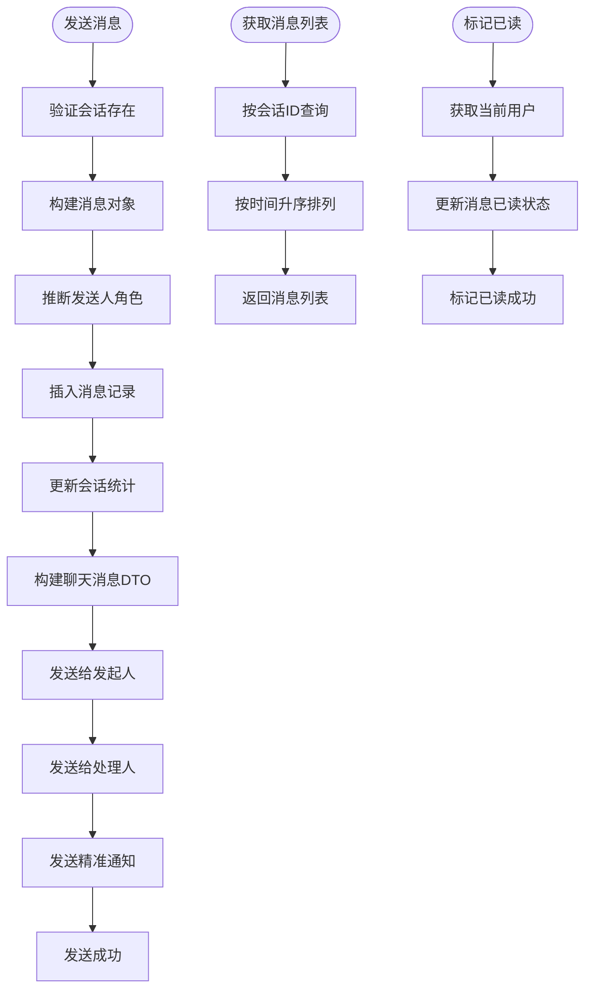

**图表来源**
- [CsMessageServiceImpl.java:48-115](file://yudao-module-opshub/src/main/java/cn/iocoder/yudao/module/opshub/service/cs/impl/CsMessageServiceImpl.java#L48-L115)
- [CsMessageServiceImpl.java:117-132](file://yudao-module-opshub/src/main/java/cn/iocoder/yudao/module/opshub/service/cs/impl/CsMessageServiceImpl.java#L117-L132)

**章节来源**
- [CsSessionServiceImpl.java:66-105](file://yudao-module-opshub/src/main/java/cn/iocoder/yudao/module/opshub/service/cs/impl/CsSessionServiceImpl.java#L66-L105)
- [CsMessageServiceImpl.java:48-115](file://yudao-module-opshub/src/main/java/cn/iocoder/yudao/module/opshub/service/cs/impl/CsMessageServiceImpl.java#L48-L115)

## 客户服务工作台

**新增** 客户服务工作台是一个全新的综合咨询处理界面，提供了比传统标签页系统更高效的会话管理和处理体验。

### 工作台架构设计

```mermaid
graph TB
CS_WORKBENCH[客户服务工作台]
STAT_BAR[统计条]
MAIN_CONTENT[主内容区]
LEFT_PANEL[左侧会话列表]
RIGHT_PANEL[右侧聊天面板]
SESSION_LIST[ConsultSessionList]
CHAT_PANEL[ConsultChatPanel]
WS_LISTENER[WebSocket 实时监听]
STAT_ITEMS[统计项]
STAT_FILTER[统计筛选]
NEW_SESSION_HIGHLIGHT[新会话高亮]
end
CS_WORKBENCH --> STAT_BAR
CS_WORKBENCH --> MAIN_CONTENT
STAT_BAR --> STAT_ITEMS
STAT_BAR --> STAT_FILTER
MAIN_CONTENT --> LEFT_PANEL
MAIN_CONTENT --> RIGHT_PANEL
LEFT_PANEL --> SESSION_LIST
RIGHT_PANEL --> CHAT_PANEL
CS_WORKBENCH --> WS_LISTENER
WS_LISTENER --> NEW_SESSION_HIGHLIGHT
```

**图表来源**
- [index.vue:1-196](file://yudao-ui/yudao-ui-admin-vue3/src/views/opshub/csWorkbench/index.vue#L1-L196)
- [ConsultSessionList.vue:1-82](file://yudao-ui/yudao-ui-admin-vue3/src/views/opshub/csWorkbench/components/ConsultSessionList.vue#L1-L82)
- [ConsultChatPanel.vue:1-43](file://yudao-ui/yudao-ui-admin-vue3/src/views/opshub/csWorkbench/components/ConsultChatPanel.vue#L1-L43)

### 会话列表组件

ConsultSessionList组件提供了完整的会话浏览和筛选功能：

```mermaid
flowchart TD
SESSION_LIST[会话列表组件]
SEARCH_BOX[搜索框]
STATUS_FILTER[状态筛选]
TYPE_FILTER[类型筛选]
SESSION_ITEM[会话项]
AVATAR[头像]
INFO_SECTION[信息区域]
TAG_SECTION[标签区域]
STATUS_DOT[状态点]
EMPTY_STATE[空状态]
end
SESSION_LIST --> SEARCH_BOX
SESSION_LIST --> STATUS_FILTER
SESSION_LIST --> TYPE_FILTER
SESSION_LIST --> SESSION_ITEM
SESSION_ITEM --> AVATAR
SESSION_ITEM --> INFO_SECTION
SESSION_ITEM --> TAG_SECTION
SESSION_ITEM --> STATUS_DOT
SESSION_LIST --> EMPTY_STATE
```

**图表来源**
- [ConsultSessionList.vue:1-82](file://yudao-ui/yudao-ui-admin-vue3/src/views/opshub/csWorkbench/components/ConsultSessionList.vue#L1-L82)

### 聊天面板组件

ConsultChatPanel组件提供了专业的会话处理界面：

```mermaid
flowchart TD
CHAT_PANEL[聊天面板组件]
CHAT_HEADER[ChatHeader 头部]
CHAT_MESSAGE_LIST[ChatMessageList 消息列表]
CHAT_INPUT_BAR[ChatInputBar 输入栏]
COMPLETE_DIALOG[完成处理对话框]
ACCEPT_ACTION[接单操作]
COMPLETE_ACTION[完成操作]
SEND_MESSAGE[发送消息]
end
CHAT_PANEL --> CHAT_HEADER
CHAT_PANEL --> CHAT_MESSAGE_LIST
CHAT_PANEL --> CHAT_INPUT_BAR
CHAT_PANEL --> COMPLETE_DIALOG
CHAT_HEADER --> ACCEPT_ACTION
CHAT_HEADER --> COMPLETE_ACTION
CHAT_INPUT_BAR --> SEND_MESSAGE
```

**图表来源**
- [ConsultChatPanel.vue:1-161](file://yudao-ui/yudao-ui-admin-vue3/src/views/opshub/csWorkbench/components/ConsultChatPanel.vue#L1-L161)

**章节来源**
- [index.vue:1-196](file://yudao-ui/yudao-ui-admin-vue3/src/views/opshub/csWorkbench/index.vue#L1-L196)
- [ConsultSessionList.vue:1-208](file://yudao-ui/yudao-ui-admin-vue3/src/views/opshub/csWorkbench/components/ConsultSessionList.vue#L1-L208)
- [ConsultChatPanel.vue:1-161](file://yudao-ui/yudao-ui-admin-vue3/src/views/opshub/csWorkbench/components/ConsultChatPanel.vue#L1-L161)

## 执行员产品线授权管理

**新增** 执行员产品线授权管理功能实现了基于角色和产品线的精准通知系统，确保执行员只接收与其职责相关的咨询通知。

### 授权管理架构

```mermaid
graph TB
DEALER_SCOPE[执行员产品线授权]
USER_SCOPE[用户授权查询]
PRODUCT_LINE_SCOPE[产品线授权查询]
AUTH_ASSIGN[授权分配]
USER_ROLE[用户角色检查]
PRODUCT_LINE_FILTER[产品线过滤]
MATCHING_EXECUTORS[匹配执行员]
end
DEALER_SCOPE --> USER_SCOPE
DEALER_SCOPE --> PRODUCT_LINE_SCOPE
AUTH_ASSIGN --> USER_ROLE
AUTH_ASSIGN --> PRODUCT_LINE_FILTER
USER_ROLE --> MATCHING_EXECUTORS
PRODUCT_LINE_FILTER --> MATCHING_EXECUTORS
```

**图表来源**
- [ExecutorProductLineScopeService.java:1-33](file://yudao-module-opshub/src/main/java/cn/iocoder/yudao/module/opshub/service/dealer/ExecutorProductLineScopeService.java#L1-L33)
- [ExecutorProductLineScopeServiceImpl.java:1-28](file://yudao-module-opshub/src/main/java/cn/iocoder/yudao/module/opshub/service/dealer/impl/ExecutorProductLineScopeServiceImpl.java#L1-L28)
- [ExecutorProductLineScopeMapper.java:1-35](file://yudao-module-opshub/src/main/java/cn/iocoder/yudao/module/opshub/dal/mysql/dealer/ExecutorProductLineScopeMapper.java#L1-L35)

### 授权数据模型

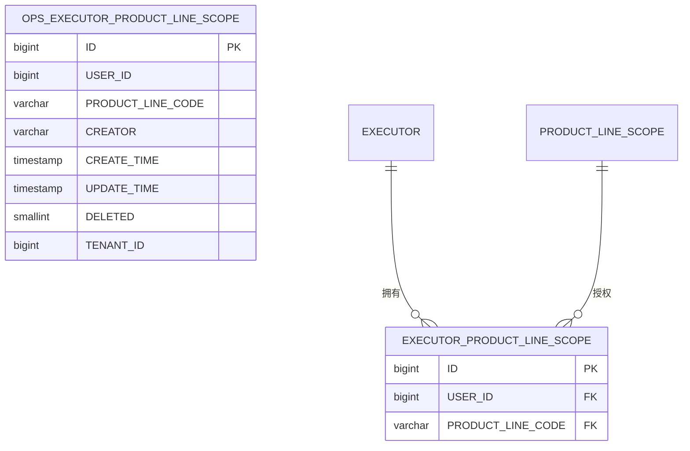

**图表来源**
- [ExecutorProductLineScopeDO.java:17-33](file://yudao-module-opshub/src/main/java/cn/iocoder/yudao/module/opshub/dal/dataobject/dealer/ExecutorProductLineScopeDO.java#L17-L33)
- [opshub-step1.sql:133-154](file://sql/postgresql/opshub-step1.sql#L133-L154)

### 授权查询逻辑

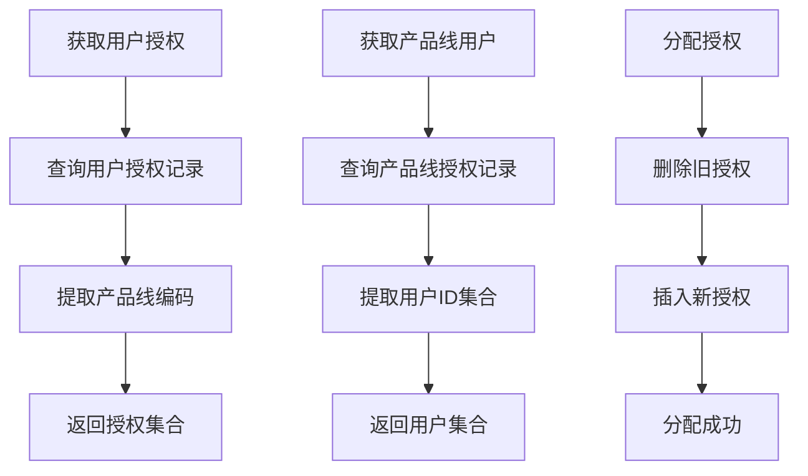

**图表来源**
- [ExecutorProductLineScopeServiceImpl.java:25-28](file://yudao-module-opshub/src/main/java/cn/iocoder/yudao/module/opshub/service/dealer/impl/ExecutorProductLineScopeServiceImpl.java#L25-L28)
- [ExecutorProductLineScopeMapper.java:21-33](file://yudao-module-opshub/src/main/java/cn/iocoder/yudao/module/opshub/dal/mysql/dealer/ExecutorProductLineScopeMapper.java#L21-L33)

**章节来源**
- [ExecutorProductLineScopeService.java:1-33](file://yudao-module-opshub/src/main/java/cn/iocoder/yudao/module/opshub/service/dealer/ExecutorProductLineScopeService.java#L1-L33)
- [ExecutorProductLineScopeServiceImpl.java:1-28](file://yudao-module-opshub/src/main/java/cn/iocoder/yudao/module/opshub/service/dealer/impl/ExecutorProductLineScopeServiceImpl.java#L1-L28)
- [ExecutorProductLineScopeMapper.java:1-35](file://yudao-module-opshub/src/main/java/cn/iocoder/yudao/module/opshub/dal/mysql/dealer/ExecutorProductLineScopeMapper.java#L1-L35)
- [ExecutorProductLineScopeDO.java:17-33](file://yudao-module-opshub/src/main/java/cn/iocoder/yudao/module/opshub/dal/dataobject/dealer/ExecutorProductLineScopeDO.java#L17-L33)
- [DealerProductLineScopeController.java:32-66](file://yudao-module-opshub/src/main/java/cn/iocoder/yudao/module/opshub/controller/admin/dealer/DealerProductLineScopeController.java#L32-L66)
- [opshub-step1.sql:133-154](file://sql/postgresql/opshub-step1.sql#L133-L154)

## 全局通知组件

**新增** CsExecutorNotifier组件是一个全局通知组件，专门用于处理新咨询的实时通知，无需渲染任何UI元素。

### 通知组件架构

```mermaid
graph TB
CS_EXECUTOR_NOTIFIER[CsExecutorNotifier 全局通知组件]
WEBSOCKET_HOOK[useCsWebSocket Hook]
EL_NOTIFICATION[Element Plus Notification]
ROUTER[Vue Router]
CONSULT_TYPE_MAP[咨询类型映射]
NOTIFICATION_CONFIG[通知配置]
CLICK_HANDLER[点击处理器]
end
CS_EXECUTOR_NOTIFIER --> WEBSOCKET_HOOK
WEBSOCKET_HOOK --> EL_NOTIFICATION
WEBSOCKET_HOOK --> ROUTER
CS_EXECUTOR_NOTIFIER --> CONSULT_TYPE_MAP
CS_EXECUTOR_NOTIFIER --> NOTIFICATION_CONFIG
NOTIFICATION_CONFIG --> CLICK_HANDLER
CLICK_HANDLER --> ROUTER
```

**图表来源**
- [CsExecutorNotifier.vue:1-42](file://yudao-ui/yudao-ui-admin-vue3/src/components/CsChatWindow/CsExecutorNotifier.vue#L1-L42)

### 通知触发流程

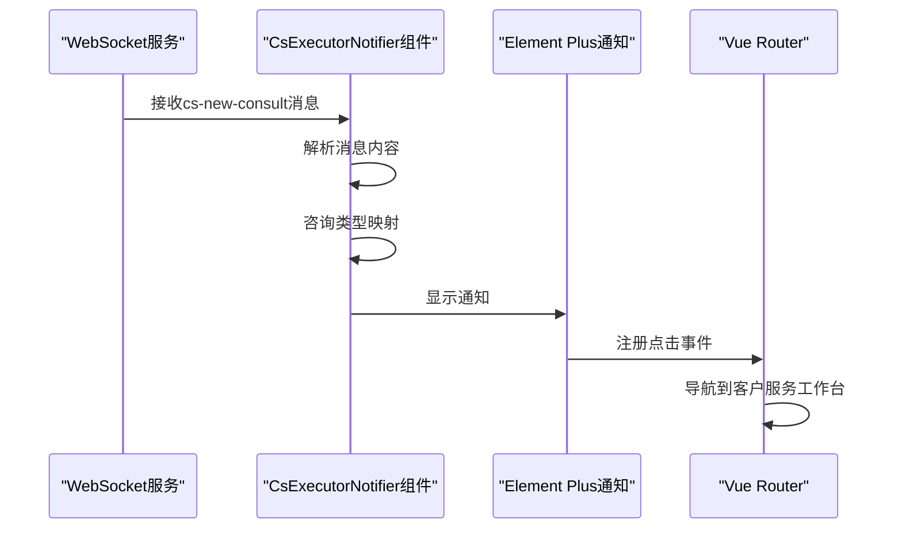

**图表来源**
- [CsExecutorNotifier.vue:19-40](file://yudao-ui/yudao-ui-admin-vue3/src/components/CsChatWindow/CsExecutorNotifier.vue#L19-L40)

### 通知配置参数

| 参数 | 类型 | 默认值 | 说明 |
|------|------|--------|------|
| title | string | "新咨询：在线咨询" | 通知标题 |
| message | string | "" | 通知内容 |
| type | string | "info" | 通知类型 |
| duration | number | 8000 | 显示持续时间（毫秒） |
| position | string | "bottom-right" | 显示位置 |
| onClick | function | 跳转到工作台 | 点击回调函数 |

**章节来源**
- [CsExecutorNotifier.vue:1-42](file://yudao-ui/yudao-ui-admin-vue3/src/components/CsChatWindow/CsExecutorNotifier.vue#L1-L42)

## WebSocket通知系统重构

**更新** WebSocket通知系统已从传统的广播机制重构为基于执行员产品线授权的精准匹配通知系统，显著提升了通知的相关性和效率。

### 精准通知架构

```mermaid
graph TB
WEBSOCKET_SERVICE[WebSocket服务]
ROLE_API[角色API]
PERMISSION_API[权限API]
EXECUTOR_SCOPE_MAPPER[执行员授权映射器]
PRODUCT_LINE_CODE[产品线编码]
EXECUTOR_USERS[执行员用户集合]
FILTERED_USERS[过滤后的用户集合]
PRECISE_NOTIFICATION[精准通知]
BROADCAST_NOTIFICATION[广播通知]
TRANSACTION_SYNC[事务同步]
ASYNC_EXECUTION[异步执行]
end
WEBSOCKET_SERVICE --> ROLE_API
WEBSOCKET_SERVICE --> PERMISSION_API
WEBSOCKET_SERVICE --> EXECUTOR_SCOPE_MAPPER
WEBSOCKET_SERVICE --> TRANSACTION_SYNC
WEBSOCKET_SERVICE --> ASYNC_EXECUTION
ROLE_API --> EXECUTOR_USERS
PERMISSION_API --> EXECUTOR_USERS
EXECUTOR_SCOPE_MAPPER --> FILTERED_USERS
PRODUCT_LINE_CODE --> FILTERED_USERS
FILTERED_USERS --> PRECISE_NOTIFICATION
BROADCAST_NOTIFICATION --> PRECISE_NOTIFICATION
```

**图表来源**
- [CsWebSocketServiceImpl.java:76-144](file://yudao-module-opshub/src/main/java/cn/iocoder/yudao/module/opshub/service/cs/websocket/impl/CsWebSocketServiceImpl.java#L76-L144)

### 通知类型对比

| 通知类型 | 传统机制 | 重构后机制 | 优点 | 性能影响 |
|----------|----------|------------|------|----------|
| cs-chat-message | 广播给所有管理端用户 | 精准匹配执行员 | 减少无关通知 | 显著提升 |
| cs-session-event | 广播给所有管理端用户 | 精准匹配执行员 | 减少无关通知 | 显著提升 |
| cs-new-consult | 广播给所有管理端用户 | 精准匹配执行员 | 减少无关通知 | 显著提升 |
| 精准匹配 | 不支持 | 支持 | 提升相关性 | 中等 |
| 产品线过滤 | 不支持 | 支持 | 提升相关性 | 中等 |
| 事务安全 | 不支持 | 支持 | 数据一致性 | 无影响 |

### 精准匹配算法

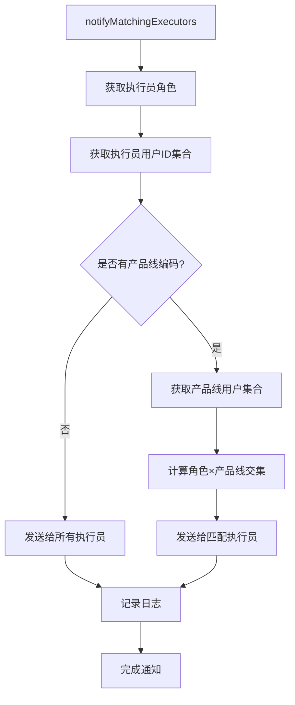

**图表来源**
- [CsWebSocketServiceImpl.java:108-144](file://yudao-module-opshub/src/main/java/cn/iocoder/yudao/module/opshub/service/cs/websocket/impl/CsWebSocketServiceImpl.java#L108-L144)

### 事务安全机制

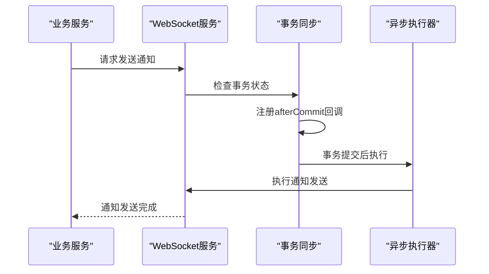

**图表来源**
- [CsWebSocketServiceImpl.java:172-190](file://yudao-module-opshub/src/main/java/cn/iocoder/yudao/module/opshub/service/cs/websocket/impl/CsWebSocketServiceImpl.java#L172-L190)

**章节来源**
- [CsWebSocketService.java:1-48](file://yudao-module-opshub/src/main/java/cn/iocoder/yudao/module/opshub/service/cs/websocket/CsWebSocketService.java#L1-L48)
- [CsWebSocketServiceImpl.java:76-144](file://yudao-module-opshub/src/main/java/cn/iocoder/yudao/module/opshub/service/cs/websocket/impl/CsWebSocketServiceImpl.java#L76-L144)
- [CsWebSocketServiceImpl.java:172-190](file://yudao-module-opshub/src/main/java/cn/iocoder/yudao/module/opshub/service/cs/websocket/impl/CsWebSocketServiceImpl.java#L172-L190)

## 实时通信集成

**更新** 电商客服系统集成了WebSocket实时通信功能，支持消息推送和会话事件通知。新增了三种消息类型的处理机制，并重构了通知系统以支持精准匹配执行器。

### WebSocket服务架构

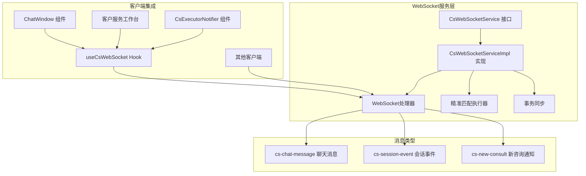

**图表来源**
- [CsWebSocketService.java:1-48](file://yudao-module-opshub/src/main/java/cn/iocoder/yudao/module/opshub/service/cs/websocket/CsWebSocketService.java#L1-L48)
- [CsWebSocketServiceImpl.java:1-200](file://yudao-module-opshub/src/main/java/cn/iocoder/yudao/module/opshub/service/cs/websocket/impl/CsWebSocketServiceImpl.java#L1-L200)
- [CsChatMessage.java:13-90](file://yudao-module-opshub/src/main/java/cn/iocoder/yudao/module/opshub/service/cs/websocket/dto/CsChatMessage.java#L13-L90)
- [useCsWebSocket.ts:26-96](file://yudao-ui/yudao-ui-admin-vue3/src/hooks/useCsWebSocket.ts#L26-L96)

### 消息推送流程

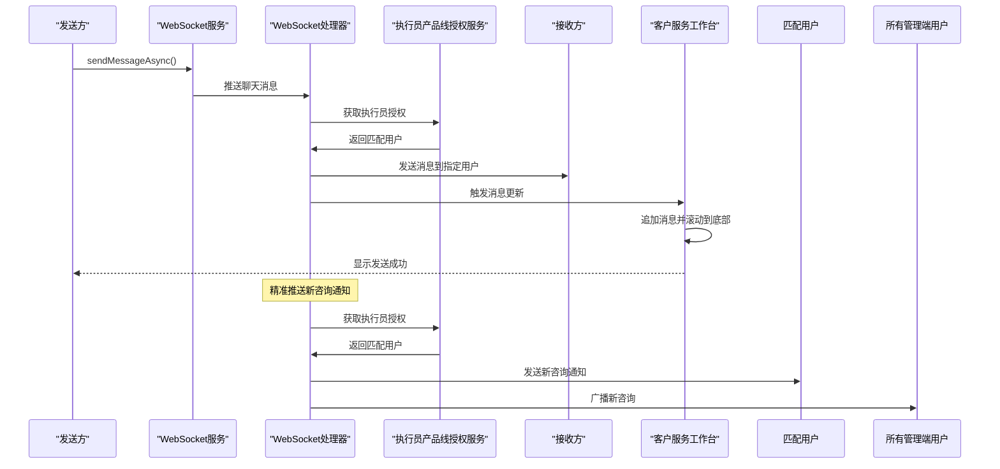

**图表来源**
- [CsMessageServiceImpl.java:89-112](file://yudao-module-opshub/src/main/java/cn/iocoder/yudao/module/opshub/service/cs/impl/CsMessageServiceImpl.java#L89-L112)
- [CsSessionServiceImpl.java:100-103](file://yudao-module-opshub/src/main/java/cn/iocoder/yudao/module/opshub/service/cs/impl/CsSessionServiceImpl.java#L100-L103)
- [CsWebSocketServiceImpl.java:108-144](file://yudao-module-opshub/src/main/java/cn/iocoder/yudao/module/opshub/service/cs/websocket/impl/CsWebSocketServiceImpl.java#L108-L144)

### 前端WebSocket集成

```mermaid
flowchart TD
HOOK_INIT[useCsWebSocket初始化] --> CONNECT[建立WebSocket连接]
CONNECT --> HEARTBEAT[心跳检测]
HEARTBEAT --> LISTEN[监听消息]
LISTEN --> PARSE_JSON[解析JSON消息]
PARSE_JSON --> SWITCH_TYPE{消息类型判断}
SWITCH_TYPE --> CASE_CHAT[cs-chat-message]
SWITCH_TYPE --> CASE_EVENT[cs-session-event]
SWITCH_TYPE --> CASE_NEW[cs-new-consult]
CASE_CHAT --> HANDLE_CHAT[处理聊天消息]
CASE_EVENT --> HANDLE_EVENT[处理会话事件]
CASE_NEW --> HANDLE_NEW[处理新咨询]
HANDLE_CHAT --> UPDATE_UI[更新UI状态]
HANDLE_EVENT --> UPDATE_SESSION[更新会话状态]
HANDLE_NEW --> SHOW_NOTIFICATION[显示通知]
UPDATE_UI --> SCROLL_BOTTOM[滚动到底部]
UPDATE_SESSION --> REFRESH_DATA[刷新数据]
SHOW_NOTIFICATION --> PLAY_SOUND[播放提示音]
```

**图表来源**
- [useCsWebSocket.ts:44-82](file://yudao-ui/yudao-ui-admin-vue3/src/hooks/useCsWebSocket.ts#L44-L82)
- [ChatWindow.vue:195-205](file://yudao-ui/yudao-ui-admin-vue3/src/components/CsChatWindow/ChatWindow.vue#L195-L205)

**章节来源**
- [CsWebSocketService.java:1-48](file://yudao-module-opshub/src/main/java/cn/iocoder/yudao/module/opshub/service/cs/websocket/CsWebSocketService.java#L1-L48)
- [CsWebSocketServiceImpl.java:1-200](file://yudao-module-opshub/src/main/java/cn/iocoder/yudao/module/opshub/service/cs/websocket/impl/CsWebSocketServiceImpl.java#L1-L200)
- [CsChatMessage.java:13-90](file://yudao-module-opshub/src/main/java/cn/iocoder/yudao/module/opshub/service/cs/websocket/dto/CsChatMessage.java#L13-L90)
- [useCsWebSocket.ts:26-96](file://yudao-ui/yudao-ui-admin-vue3/src/hooks/useCsWebSocket.ts#L26-L96)
- [ChatWindow.vue:195-205](file://yudao-ui/yudao-ui-admin-vue3/src/components/CsChatWindow/ChatWindow.vue#L195-L205)

## 模块化标签页系统

**更新** 客户服务模块已重构为模块化标签页界面系统，采用TaskTab、OpReqTab、ConsultTab和ChatWindow四个核心组件实现功能分离和界面优化。

### 标签页系统架构

```mermaid
graph TB
subgraph "标签页容器"
TAB_CONTAINER[标签页容器]
TAB_NAV[标签导航栏]
TAB_CONTENT[标签内容区域]
end
subgraph "TaskTab 组件"
TASK_HEADER[工单头部信息]
TASK_TABLE[工单表格]
TASK_FORM[工单表单]
TASK_FILTER[工单筛选器]
end
subgraph "OpReqTab 组件"
OPREQ_HEADER[运维请求头部信息]
OPREQ_TABLE[运维请求表格]
OPREQ_FORM[运维请求表单]
OPREQ_FILTER[运维请求筛选器]
end
subgraph "ConsultTab 组件"
CONSULT_STATS[咨询统计卡片]
CONSULT_FILTER[咨询筛选栏]
CONSULT_TABLE[咨询表格]
CONSULT_ARCHIVE[归档弹窗]
end
subgraph "ChatWindow 组件"
CHAT_HEADER[聊天头部信息]
CHAT_MESSAGE_LIST[消息列表]
CHAT_INPUT_BAR[输入栏]
CHAT_FLOATING_BUTTON[浮动按钮]
end
TAB_CONTAINER --> TAB_NAV
TAB_CONTAINER --> TAB_CONTENT
TAB_NAV --> TASK_TAB[TaskTab 标签]
TAB_NAV --> OPREQ_TAB[OpReqTab 标签]
TAB_NAV --> CONSULT_TAB[ConsultTab 标签]
TAB_CONTENT --> TASK_CONTENT[TaskTab 内容]
TAB_CONTENT --> OPREQ_CONTENT[OpReqTab 内容]
TAB_CONTENT --> CONSULT_CONTENT[ConsultTab 内容]
TAB_CONTENT --> CHAT_CONTENT[ChatWindow 内容]
TASK_CONTENT --> TASK_HEADER
TASK_CONTENT --> TASK_TABLE
TASK_CONTENT --> TASK_FORM
TASK_CONTENT --> TASK_FILTER
OPREQ_CONTENT --> OPREQ_HEADER
OPREQ_CONTENT --> OPREQ_TABLE
OPREQ_CONTENT --> OPREQ_FORM
OPREQ_CONTENT --> OPREQ_FILTER
CONSULT_CONTENT --> CONSULT_STATS
CONSULT_CONTENT --> CONSULT_FILTER
CONSULT_CONTENT --> CONSULT_TABLE
CONSULT_CONTENT --> CONSULT_ARCHIVE
CHAT_CONTENT --> CHAT_HEADER
CHAT_CONTENT --> CHAT_MESSAGE_LIST
CHAT_CONTENT --> CHAT_INPUT_BAR
CHAT_CONTENT --> CHAT_FLOATING_BUTTON
```

**图表来源**
- [index.vue:1-30](file://yudao-ui/yudao-ui-admin-vue3/src/views/opshub/customerservice/index.vue#L1-L30)
- [TaskTab.vue:1-50](file://yudao-ui/yudao-ui-admin-vue3/src/views/opshub/customerservice/components/TaskTab.vue#L1-L50)
- [OpReqTab.vue:1-50](file://yudao-ui/yudao-ui-admin-vue3/src/views/opshub/customerservice/components/OpReqTab.vue#L1-L50)
- [ConsultTab.vue:1-191](file://yudao-ui/yudao-ui-admin-vue3/src/views/opshub/customerservice/components/ConsultTab.vue#L1-L191)
- [ChatWindow.vue:1-286](file://yudao-ui/yudao-ui-admin-vue3/src/components/CsChatWindow/ChatWindow.vue#L1-L286)

### ChatWindow 组件分析

ChatWindow组件是电商客服系统的核心界面组件：

```mermaid
flowchart TD
CHAT_START([ChatWindow 初始化]) --> LOAD_SESSION[加载会话详情]
LOAD_SESSION --> INIT_MESSAGES[初始化消息列表]
INIT_MESSAGES --> RENDER_CHAT[渲染聊天界面]
RENDER_CHAT --> CHECK_STATUS{检查会话状态}
CHECK_STATUS --> STATUS_PENDING[待处理]
CHECK_STATUS --> STATUS_PROCESSING[处理中]
CHECK_STATUS --> STATUS_COMPLETED[已完成]
CHECK_STATUS --> STATUS_CLOSED[已关闭]
STATUS_PENDING --> DISABLE_SEND[禁用发送功能]
STATUS_PROCESSING --> ENABLE_SEND[启用发送功能]
STATUS_COMPLETED --> SHOW_COMPLETED[显示已完成提示]
STATUS_CLOSED --> SHOW_CLOSED[显示已关闭提示]
ENABLE_SEND --> RENDER_INPUT[渲染输入栏]
DISABLE_SEND --> HIDE_INPUT[隐藏输入栏]
RENDER_INPUT --> WAIT_MESSAGE[等待消息]
HIDE_INPUT --> WAIT_EVENT[等待事件]
WAIT_MESSAGE --> SEND_MESSAGE[发送消息]
WAIT_EVENT --> HANDLE_EVENT[处理会话事件]
SEND_MESSAGE --> CALL_API[调用发送API]
CALL_API --> UPDATE_LOCAL[更新本地状态]
UPDATE_LOCAL --> APPEND_MESSAGE[追加消息到列表]
APPEND_MESSAGE --> SCROLL_BOTTOM[滚动到底部]
SCROLL_BOTTOM --> WAIT_MESSAGE
HANDLE_EVENT --> REFRESH_SESSION[刷新会话状态]
REFRESH_SESSION --> RENDER_CHAT
```

**图表来源**
- [ChatWindow.vue:94-113](file://yudao-ui/yudao-ui-admin-vue3/src/components/CsChatWindow/ChatWindow.vue#L94-L113)
- [ChatWindow.vue:171-193](file://yudao-ui/yudao-ui-admin-vue3/src/components/CsChatWindow/ChatWindow.vue#L171-L193)

**章节来源**
- [index.vue:1-30](file://yudao-ui/yudao-ui-admin-vue3/src/views/opshub/customerservice/index.vue#L1-L30)
- [TaskTab.vue:1-50](file://yudao-ui/yudao-ui-admin-vue3/src/views/opshub/customerservice/components/TaskTab.vue#L1-L50)
- [OpReqTab.vue:1-50](file://yudao-ui/yudao-ui-admin-vue3/src/views/opshub/customerservice/components/OpReqTab.vue#L1-L50)
- [ConsultTab.vue:1-191](file://yudao-ui/yudao-ui-admin-vue3/src/views/opshub/customerservice/components/ConsultTab.vue#L1-L191)
- [ChatWindow.vue:1-286](file://yudao-ui/yudao-ui-admin-vue3/src/components/CsChatWindow/ChatWindow.vue#L1-L286)

## API模块支持

**更新** 模块现已支持独立的API模块，为TaskTab、OpReqTab、ConsultTab、ChatWindow和客户服务工作台组件提供专门的接口支持。

### API模块架构

```mermaid
graph TB
subgraph "API模块"
TASK_API[TaskTab API模块]
OPREQ_API[OpReqTab API模块]
CONSULT_API[ConsultTab API模块]
CHAT_API[ChatWindow API模块]
WORKBENCH_API[客户服务工作台API模块]
COMMON_API[通用API模块]
end
subgraph "TaskTab API"
TASK_CREATE_API[工单创建API]
TASK_QUERY_API[工单查询API]
TASK_UPDATE_API[工单更新API]
TASK_DELETE_API[工单删除API]
end
subgraph "OpReqTab API"
OPREQ_CREATE_API[运维请求创建API]
OPREQ_QUERY_API[运维请求查询API]
OPREQ_UPDATE_API[运维请求更新API]
OPREQ_DELETE_API[运维请求删除API]
end
subgraph "ConsultTab API"
CONSULT_CREATE_API[会话创建API]
CONSULT_QUERY_API[会话查询API]
CONSULT_STATISTICS_API[咨询统计API]
CONSULT_FILTER_API[咨询筛选API]
end
subgraph "ChatWindow API"
CHAT_CREATE_API[会话创建API]
CHAT_QUERY_API[会话查询API]
CHAT_MESSAGE_API[消息管理API]
CHAT_WS_API[WebSocket连接API]
end
subgraph "客户服务工作台API"
WORKBENCH_SESSION_LIST[会话列表API]
WORKBENCH_STATISTICS[统计API]
WORKBENCH_WS_LISTENER[WebSocket监听API]
end
subgraph "通用API"
AUTH_API[认证API]
LOG_API[日志API]
CACHE_API[缓存API]
NOTIFY_API[通知API]
end
TASK_API --> TASK_CREATE_API
TASK_API --> TASK_QUERY_API
TASK_API --> TASK_UPDATE_API
TASK_API --> TASK_DELETE_API
OPREQ_API --> OPREQ_CREATE_API
OPREQ_API --> OPREQ_QUERY_API
OPREQ_API --> OPREQ_UPDATE_API
OPREQ_API --> OPREQ_DELETE_API
CONSULT_API --> CONSULT_CREATE_API
CONSULT_API --> CONSULT_QUERY_API
CONSULT_API --> CONSULT_STATISTICS_API
CONSULT_API --> CONSULT_FILTER_API
CHAT_API --> CHAT_CREATE_API
CHAT_API --> CHAT_QUERY_API
CHAT_API --> CHAT_MESSAGE_API
CHAT_API --> CHAT_WS_API
WORKBENCH_API --> WORKBENCH_SESSION_LIST
WORKBENCH_API --> WORKBENCH_STATISTICS
WORKBENCH_API --> WORKBENCH_WS_LISTENER
COMMON_API --> AUTH_API
COMMON_API --> LOG_API
COMMON_API --> CACHE_API
COMMON_API --> NOTIFY_API
```

**图表来源**
- [TaskTab.vue:1-50](file://yudao-ui/yudao-ui-admin-vue3/src/views/opshub/customerservice/components/TaskTab.vue#L1-L50)
- [OpReqTab.vue:1-50](file://yudao-ui/yudao-ui-admin-vue3/src/views/opshub/customerservice/components/OpReqTab.vue#L1-L50)
- [ConsultTab.vue:1-191](file://yudao-ui/yudao-ui-admin-vue3/src/views/opshub/customerservice/components/ConsultTab.vue#L1-L191)
- [ChatWindow.vue:57-67](file://yudao-ui/yudao-ui-admin-vue3/src/components/CsChatWindow/ChatWindow.vue#L57-L67)
- [index.vue:52-58](file://yudao-ui/yudao-ui-admin-vue3/src/views/opshub/csWorkbench/index.vue#L52-L58)
- [csSession/index.ts:1-106](file://yudao-ui/yudao-ui-admin-vue3/src/api/opshub/csSession/index.ts#L1-L106)

### API调用流程

```mermaid
sequenceDiagram
participant UI as "用户界面"
participant TASK_API as "TaskTab API"
participant OPREQ_API as "OpReqTab API"
participant CONSULT_API as "ConsultTab API"
participant CHAT_API as "ChatWindow API"
participant WORKBENCH_API as "客户服务工作台API"
participant COMMON_API as "通用API"
participant SERVER as "服务端"
UI->>TASK_API : 请求工单数据
TASK_API->>SERVER : 调用工单查询接口
SERVER-->>TASK_API : 返回工单数据
TASK_API-->>UI : 显示工单列表
UI->>OPREQ_API : 请求运维请求数据
OPREQ_API->>SERVER : 调用运维请求查询接口
SERVER-->>OPREQ_API : 返回运维请求数据
OPREQ_API-->>UI : 显示运维请求列表
UI->>CONSULT_API : 请求咨询数据
CONSULT_API->>SERVER : 调用咨询查询接口
SERVER-->>CONSULT_API : 返回咨询数据
CONSULT_API-->>UI : 显示咨询列表
UI->>CHAT_API : 请求会话数据
CHAT_API->>SERVER : 调用会话查询接口
SERVER-->>CHAT_API : 返回会话数据
CHAT_API-->>UI : 显示聊天界面
UI->>WORKBENCH_API : 请求工作台数据
WORKBENCH_API->>SERVER : 调用会话列表接口
SERVER-->>WORKBENCH_API : 返回会话列表
WORKBENCH_API-->>UI : 显示工作台界面
UI->>COMMON_API : 用户认证
COMMON_API->>SERVER : 验证用户权限
SERVER-->>COMMON_API : 返回认证结果
COMMON_API-->>UI : 认证通过
```

**图表来源**
- [TaskTab.vue:1-50](file://yudao-ui/yudao-ui-admin-vue3/src/views/opshub/customerservice/components/TaskTab.vue#L1-L50)
- [OpReqTab.vue:1-50](file://yudao-ui/yudao-ui-admin-vue3/src/views/opshub/customerservice/components/OpReqTab.vue#L1-L50)
- [ConsultTab.vue:1-191](file://yudao-ui/yudao-ui-admin-vue3/src/views/opshub/customerservice/components/ConsultTab.vue#L1-L191)
- [ChatWindow.vue:57-67](file://yudao-ui/yudao-ui-admin-vue3/src/components/CsChatWindow/ChatWindow.vue#L57-L67)
- [index.vue:52-58](file://yudao-ui/yudao-ui-admin-vue3/src/views/opshub/csWorkbench/index.vue#L52-L58)
- [csSession/index.ts:57-106](file://yudao-ui/yudao-ui-admin-vue3/src/api/opshub/csSession/index.ts#L57-L106)

### 会话管理API

**新增** 会话管理API提供了完整的会话生命周期管理：

| 方法 | 路径 | 权限 | 说明 |
|------|------|------|------|
| POST | `/opshub/cs-session/create` | `dealer:cs-consult:query` | 创建/获取咨询会话（去重） |
| GET | `/opshub/cs-session/page` | `dealer:cs-consult:query` | 分页查询咨询列表 |
| GET | `/opshub/cs-session/get?id=` | `dealer:cs-consult:query` | 获取会话详情 |
| GET | `/opshub/cs-session/statistics` | `dealer:cs-consult:query` | 咨询统计数据（各状态数量） |
| POST | `/opshub/cs-session/accept` | `dealer:cs-consult:complete` | 接单处理（执行员） |
| POST | `/opshub/cs-session/complete` | `dealer:cs-consult:complete` | 完成处理（执行员） |
| POST | `/opshub/cs-session/close` | `dealer:cs-consult:close` | 关闭对话（经销商） |
| POST | `/opshub/cs-message/send` | `dealer:cs-consult:query` | 发送消息 |
| GET | `/opshub/cs-message/page` | `dealer:cs-consult:query` | 分页查询消息 |
| POST | `/opshub/cs-message/mark-read` | `dealer:cs-consult:query` | 标记消息已读 |

**新增** 客户服务工作台API：

| 方法 | 路径 | 权限 | 说明 |
|------|------|------|------|
| GET | `/opshub/cs-workbench/session-page` | `dealer:cs-consult:query` | 工作台会话列表 |
| GET | `/opshub/cs-workbench/statistics` | `dealer:cs-consult:query` | 工作台统计信息 |
| GET | `/opshub/cs-workbench/session/:id/messages` | `dealer:cs-consult:query` | 会话消息列表 |
| POST | `/opshub/cs-workbench/session/:id/accept` | `dealer:cs-consult:complete` | 接单处理 |
| POST | `/opshub/cs-workbench/session/:id/complete` | `dealer:cs-consult:complete` | 完成处理 |
| POST | `/opshub/cs-workbench/session/:id/send-message` | `dealer:cs-consult:query` | 发送消息 |

**章节来源**
- [TaskTab.vue:1-50](file://yudao-ui/yudao-ui-admin-vue3/src/views/opshub/customerservice/components/TaskTab.vue#L1-L50)
- [OpReqTab.vue:1-50](file://yudao-ui/yudao-ui-admin-vue3/src/views/opshub/customerservice/components/OpReqTab.vue#L1-L50)
- [ConsultTab.vue:1-191](file://yudao-ui/yudao-ui-admin-vue3/src/views/opshub/customerservice/components/ConsultTab.vue#L1-L191)
- [ChatWindow.vue:57-67](file://yudao-ui/yudao-ui-admin-vue3/src/components/CsChatWindow/ChatWindow.vue#L57-L67)
- [index.vue:52-58](file://yudao-ui/yudao-ui-admin-vue3/src/views/opshub/csWorkbench/index.vue#L52-L58)
- [csSession/index.ts:57-106](file://yudao-ui/yudao-ui-admin-vue3/src/api/opshub/csSession/index.ts#L57-L106)
- [CsSessionController.java:36-95](file://yudao-module-opshub/src/main/java/cn/iocoder/yudao/module/opshub/controller/admin/cs/CsSessionController.java#L36-L95)

## 数据库架构设计

**新增** 电商客服系统引入了完整的数据库架构，包括会话表、消息表和执行员产品线授权表的设计。

### 数据库表结构

```mermaid
erDiagram
OPS_CS_SESSION {
bigint ID PK
varchar SESSION_NO UK
varchar CONSULT_TYPE
integer STATUS
text CONTEXT
bigint CONTEXT_ID
varchar CONTEXT_CODE
varchar SOURCE_MODULE
varchar DEALER_CODE
varchar DEALER_NAME
varchar PRODUCT_LINE_CODE
varchar PRODUCT_LINE_NAME
bigint INITIATOR_ID
varchar INITIATOR_NAME
bigint ASSIGNEE_ID
varchar ASSIGNEE_NAME
varchar LAST_MESSAGE
timestamp LAST_MESSAGE_TIME
integer MESSAGE_COUNT
timestamp ACCEPT_TIME
timestamp COMPLETE_TIME
timestamp CLOSE_TIME
varchar SOLUTION_SUMMARY
varchar REMARK
timestamp CREATE_TIME
timestamp UPDATE_TIME
smallint DELETED
bigint TENANT_ID
}
OPS_CS_MESSAGE {
bigint ID PK
bigint SESSION_ID FK
varchar SESSION_NO
bigint SENDER_ID
varchar SENDER_NAME
varchar SENDER_ROLE
varchar MESSAGE_TYPE
text CONTENT
varchar ATTACHMENT_IDS
varchar LINK_URL
varchar LINK_TITLE
smallint IS_READ
varchar REMARK
timestamp CREATE_TIME
timestamp UPDATE_TIME
smallint DELETED
bigint TENANT_ID
}
OPS_EXECUTOR_PRODUCT_LINE_SCOPE {
bigint ID PK
bigint USER_ID
varchar PRODUCT_LINE_CODE
varchar CREATOR
timestamp CREATE_TIME
timestamp UPDATE_TIME
smallint DELETED
bigint TENANT_ID
}
OPS_CS_SESSION ||--o{ OPS_CS_MESSAGE : "包含"
OPS_EXECUTOR_PRODUCT_LINE_SCOPE ||--o{ EXECUTOR : "授权"
```

**图表来源**
- [feature_step7-电商客服系统_ddl.sql:12-130](file://db/branches/feature_step7-电商客服系统/feature_step7-电商客服系统_ddl.sql#L12-L130)
- [opshub-step1.sql:133-154](file://sql/postgresql/opshub-step1.sql#L133-L154)

### 索引设计策略

| 索引类型 | 字段组合 | 用途 | 性能影响 |
|---------|---------|------|---------|
| 主键索引 | id | 唯一标识符 | O(log n) |
| 唯一索引 | session_no | 会话编号查询 | O(log n) |
| 普通索引 | consult_type | 咨询类型过滤 | O(log n) |
| 普通索引 | status | 状态查询 | O(log n) |
| 普通索引 | dealer_code | 经销商权限控制 | O(log n) |
| 普通索引 | initiator_id | 发起人查询 | O(log n) |
| 普通索引 | assignee_id | 处理人查询 | O(log n) |
| 普通索引 | context_code | 上下文关联查询 | O(log n) |
| 普通索引 | last_message_time | 最新消息排序 | O(log n) |
| 普通索引 | session_id | 消息会话关联 | O(log n) |
| 普通索引 | create_time | 消息时间排序 | O(log n) |
| 普通索引 | user_id | 执行员授权查询 | O(log n) |
| 普通索引 | product_line_code | 产品线授权查询 | O(log n) |
| 唯一索引 | (user_id, product_line_code) | 授权关系唯一性 | O(log n) |

### 序列化设计

- **ops_cs_session_seq**: 会话主键序列，支持自动生成唯一ID
- **ops_cs_message_seq**: 消息主键序列，支持自动生成唯一ID
- **ops_executor_product_line_scope_seq**: 授权记录主键序列，支持自动生成唯一ID

**章节来源**
- [feature_step7-电商客服系统_ddl.sql:12-130](file://db/branches/feature_step7-电商客服系统/feature_step7-电商客服系统_ddl.sql#L12-L130)
- [opshub-step1.sql:133-154](file://sql/postgresql/opshub-step1.sql#L133-L154)

## 依赖关系分析

客户服务模块的依赖关系体现了清晰的分层架构和模块化设计：

```mermaid
graph LR
subgraph "外部依赖"
SPRING[Spring Boot]
MYBATIS[MyBatis Plus]
BPM[BPM 引擎]
WEBSOCKET[WebSocket]
SYSTEM[System 模块]
ELEMENTPLUS[Element Plus]
VUE3[Vue.js 3.0]
END
subgraph "内部模块"
OPShub[Opshub 模块]
Framework[框架层]
end
subgraph "客户服务模块"
TAB_CONTAINER[标签页容器]
TASK_TAB[TaskTab 组件]
OPREQ_TAB[OpReqTab 组件]
CONSULT_TAB[ConsultTab 组件]
CHAT_WINDOW[ChatWindow 组件]
FLOATING_BUTTON[ChatFloatingButton 组件]
USE_CS_CONSULT[useCsConsult 组合式函数]
USE_CS_WEBSOCKET[useCsWebSocket Hook]
WORKBENCH[客户服务工作台]
SESSION_LIST[ConsultSessionList 组件]
CHAT_PANEL[ConsultChatPanel 组件]
EXECUTOR_NOTIFIER[CsExecutorNotifier 组件]
DEALER_SCOPE[执行员产品线授权]
END
SPRING --> TAB_CONTAINER
MYBATIS --> TASK_API
MYBATIS --> CHAT_API
MYBATIS --> DEALER_SCOPE
BPM --> OPREQ_API
WEBSOCKET --> WS_SERVICE
SYSTEM --> COMMON_API
ELEMENTPLUS --> TAB_CONTAINER
VUE3 --> TASK_TAB
VUE3 --> OPREQ_TAB
VUE3 --> CONSULT_TAB
VUE3 --> CHAT_WINDOW
TAB_CONTAINER --> TASK_TAB
TAB_CONTAINER --> OPREQ_TAB
TAB_CONTAINER --> CONSULT_TAB
CHAT_WINDOW --> FLOATING_BUTTON
CHAT_WINDOW --> USE_CS_CONSULT
CHAT_WINDOW --> USE_CS_WEBSOCKET
WORKBENCH --> SESSION_LIST
WORKBENCH --> CHAT_PANEL
WORKBENCH --> USE_CS_WEBSOCKET
EXECUTOR_NOTIFIER --> USE_CS_WEBSOCKET
TASK_TAB --> TASK_API
OPREQ_TAB --> OPREQ_API
CONSULT_TAB --> CONSULT_API
CHAT_WINDOW --> CHAT_API
WORKBENCH --> WORKBENCH_API
TASK_API --> COMMON_API
OPREQ_API --> COMMON_API
CONSULT_API --> WS_SERVICE
CHAT_API --> WS_SERVICE
CHAT_API --> COMMON_API
WORKBENCH_API --> WS_SERVICE
WS_SERVICE --> OPShub
DEALER_SCOPE --> OPShub
Framework --> TAB_CONTAINER
Framework --> TASK_TAB
Framework --> OPREQ_TAB
Framework --> CONSULT_TAB
Framework --> CHAT_WINDOW
Framework --> WORKBENCH
```

**图表来源**
- [index.vue:1-47](file://yudao-ui/yudao-ui-admin-vue3/src/views/opshub/customerservice/index.vue#L1-L47)
- [index.vue:1-196](file://yudao-ui/yudao-ui-admin-vue3/src/views/opshub/csWorkbench/index.vue#L1-L196)
- [TaskTab.vue:1-50](file://yudao-ui/yudao-ui-admin-vue3/src/views/opshub/customerservice/components/TaskTab.vue#L1-L50)
- [OpReqTab.vue:1-50](file://yudao-ui/yudao-ui-admin-vue3/src/views/opshub/customerservice/components/OpReqTab.vue#L1-L50)
- [ConsultTab.vue:1-191](file://yudao-ui/yudao-ui-admin-vue3/src/views/opshub/customerservice/components/ConsultTab.vue#L1-L191)
- [ChatWindow.vue:1-286](file://yudao-ui/yudao-ui-admin-vue3/src/components/CsChatWindow/ChatWindow.vue#L1-L286)
- [ChatFloatingButton.vue:1-26](file://yudao-ui/yudao-ui-admin-vue3/src/components/CsChatWindow/ChatFloatingButton.vue#L1-L26)
- [useCsConsult.ts:1-104](file://yudao-ui/yudao-ui-admin-vue3/src/hooks/useCsConsult.ts#L1-L104)
- [useCsWebSocket.ts:1-96](file://yudao-ui/yudao-ui-admin-vue3/src/hooks/useCsWebSocket.ts#L1-L96)

**章节来源**
- [index.vue:1-47](file://yudao-ui/yudao-ui-admin-vue3/src/views/opshub/customerservice/index.vue#L1-L47)
- [index.vue:1-196](file://yudao-ui/yudao-ui-admin-vue3/src/views/opshub/csWorkbench/index.vue#L1-L196)
- [TaskTab.vue:1-50](file://yudao-ui/yudao-ui-admin-vue3/src/views/opshub/customerservice/components/TaskTab.vue#L1-L50)
- [OpReqTab.vue:1-50](file://yudao-ui/yudao-ui-admin-vue3/src/views/opshub/customerservice/components/OpReqTab.vue#L1-L50)
- [ConsultTab.vue:1-191](file://yudao-ui/yudao-ui-admin-vue3/src/views/opshub/customerservice/components/ConsultTab.vue#L1-L191)
- [ChatWindow.vue:1-286](file://yudao-ui/yudao-ui-admin-vue3/src/components/CsChatWindow/ChatWindow.vue#L1-L286)
- [ChatFloatingButton.vue:1-26](file://yudao-ui/yudao-ui-admin-vue3/src/components/CsChatWindow/ChatFloatingButton.vue#L1-L26)
- [useCsConsult.ts:1-104](file://yudao-ui/yudao-ui-admin-vue3/src/hooks/useCsConsult.ts#L1-L104)
- [useCsWebSocket.ts:1-96](file://yudao-ui/yudao-ui-admin-vue3/src/hooks/useCsWebSocket.ts#L1-L96)

## 性能考虑

客户服务模块在设计时充分考虑了性能优化，电商客服系统进一步提升了用户体验：

### 数据库优化
- **索引策略**: 为常用查询字段建立复合索引，包括状态、处理人、创建人、经销商编码、产品线编码等
- **序列化**: 使用数据库序列生成唯一ID，避免并发冲突
- **分区设计**: 支持按时间分区存储历史数据
- **连接池**: 优化数据库连接池配置，支持高并发访问
- **授权查询优化**: 为执行员产品线授权表建立唯一索引，提升授权查询性能

### 缓存策略
- **会话缓存**: 使用Redis缓存用户会话信息
- **配置缓存**: 缓存系统配置和枚举值
- **查询缓存**: 缓存热点查询结果
- **组件缓存**: 标签页组件状态缓存
- **消息缓存**: 最新消息缓存，减少数据库查询
- **授权缓存**: 执行员产品线授权缓存，提升通知匹配效率

### 异步处理
- **消息队列**: 使用消息队列异步处理耗时操作
- **批量处理**: 支持批量数据导入导出
- **定时任务**: 异步清理过期数据
- **懒加载**: 标签页内容按需加载
- **WebSocket异步**: 实时消息推送采用异步处理
- **精准通知异步**: 执行员授权查询采用异步处理

### 前端性能优化
- **组件拆分**: TaskTab、OpReqTab、ConsultTab、ChatWindow、客户服务工作台组件独立加载
- **虚拟滚动**: 大数据量表格使用虚拟滚动
- **防抖节流**: 输入框和搜索功能使用防抖节流
- **图片懒加载**: 图片资源按需加载
- **WebSocket连接复用**: 多个组件共享WebSocket连接
- **模态窗口优化**: Teleport传送门减少DOM操作
- **组件状态缓存**: ChatWindow和客户服务工作台组件状态持久化
- **会话列表优化**: 咨询会话列表使用高性能渲染

### 实时通信优化
- **心跳机制**: WebSocket自动心跳检测，保证连接稳定
- **消息去重**: 防止重复消息推送
- **离线消息**: 断线重连后同步历史消息
- **消息分页**: 大量历史消息分页加载
- **内存管理**: 及时清理不再使用的消息数据
- **批量操作限制**: 防止大量并发操作影响性能
- **精准匹配优化**: 执行员授权查询使用缓存和索引
- **事务安全**: 通知发送与数据库事务同步，确保数据一致性

## 故障排除指南

### 常见问题及解决方案

| 问题类型 | 症状描述 | 可能原因 | 解决方案 |
|---------|---------|---------|---------|
| 标签页加载失败 | 切换标签页时页面空白 | 组件加载异常或API调用失败 | 检查组件依赖和网络连接 |
| 工单创建失败 | 提交后无响应或报错 | 权限不足或数据验证失败 | 检查用户权限和必填字段 |
| 会话创建失败 | 创建会话时报重复会话错误 | 存在活跃的相同上下文会话 | 检查会话去重逻辑和上下文参数 |
| 消息发送失败 | 发送消息后无响应 | WebSocket连接异常或权限验证失败 | 检查WebSocket连接状态和用户角色 |
| 实时消息不显示 | 新消息无法实时显示 | WebSocket消息解析异常 | 检查消息格式和类型判断逻辑 |
| 会话状态异常 | 状态无法正常流转 | 会话状态验证失败或权限不足 | 检查状态机逻辑和用户权限 |
| 通知推送失败 | 处理人未收到通知 | WebSocket连接异常或用户离线 | 检查网络连接和服务器状态 |
| 查询性能慢 | 页面加载缓慢 | 缺少必要索引或查询条件不当 | 添加索引和优化SQL查询 |
| 标签页切换卡顿 | 切换时页面响应慢 | 组件渲染复杂或数据量过大 | 优化组件结构和数据处理 |
| 浮动按钮不显示 | 经销商看不到浮动按钮 | 角色权限检查失败 | 检查用户角色配置 |
| 模态窗口无法打开 | 点击浮动按钮无反应 | 组件状态管理异常 | 检查 chatVisible 状态 |
| 批量咨询限制 | 超过20条记录被截取 | 批量操作上限设置 | 提示用户分批操作 |
| 咨询统计不准确 | 统计数字与实际不符 | 缓存数据不同步 | 清除统计缓存并重新计算 |
| 消息列表显示异常 | 历史消息不完整 | 分页加载逻辑错误 | 检查分页参数和加载逻辑 |
| 工作台显示异常 | 会话列表不显示或显示错误 | WebSocket连接问题 | 检查WebSocket连接状态 |
| 通知不精准 | 执行员收到无关通知 | 授权配置错误 | 检查执行员产品线授权 |
| 通知延迟 | 新咨询通知延迟到达 | 事务同步问题 | 检查事务配置和异步执行 |

### 调试工具和方法

1. **日志分析**: 查看服务端日志了解错误堆栈
2. **数据库监控**: 监控SQL执行时间和慢查询
3. **网络诊断**: 检查WebSocket连接状态
4. **权限验证**: 确认用户角色和权限配置
5. **组件调试**: 使用Vue DevTools检查组件状态
6. **API测试**: 使用Postman测试API接口
7. **WebSocket调试**: 使用浏览器开发者工具查看WebSocket消息
8. **性能分析**: 使用性能分析工具识别性能瓶颈
9. **授权验证**: 检查执行员产品线授权配置
10. **事务检查**: 验证通知发送的事务安全性

**章节来源**
- [CsSessionServiceImpl.java:240-260](file://yudao-module-opshub/src/main/java/cn/iocoder/yudao/module/opshub/service/cs/impl/CsSessionServiceImpl.java#L240-L260)
- [CsMessageServiceImpl.java:136-150](file://yudao-module-opshub/src/main/java/cn/iocoder/yudao/module/opshub/service/cs/impl/CsMessageServiceImpl.java#L136-L150)
- [CsWebSocketServiceImpl.java:108-144](file://yudao-module-opshub/src/main/java/cn/iocoder/yudao/module/opshub/service/cs/websocket/impl/CsWebSocketServiceImpl.java#L108-L144)

## 结论

客户服务模块经过重构和电商客服系统集成后，已成为一个功能完整、架构清晰、界面友好的企业级客户服务管理系统。通过采用现代化的模块化标签页设计、电商客服系统实现、实时通信集成、客户服务工作台、执行员产品线授权管理和全局通知组件，该模块实现了以下关键特性：

### 技术优势
- **模块化设计**: 清晰的分层架构便于维护和扩展
- **标签页系统**: TaskTab、OpReqTab、ConsultTab、ChatWindow组件实现功能分离
- **API模块化**: 独立的API模块支持提高代码复用性
- **状态机管理**: 完整的工单和会话状态流转控制
- **实时通信**: 基于WebSocket的通知机制和消息推送
- **工作流集成**: 与BPM引擎深度集成
- **数据库优化**: 完整的电商客服数据库架构设计
- **用户交互优化**: 全局浮动按钮提供便捷的咨询入口
- **模态窗口设计**: 提供沉浸式的聊天体验
- **组合式函数**: useCsConsult统一管理咨询流程
- **WebSocket Hook**: useCsWebSocket提供实时通信能力
- **客户服务工作台**: 提供一体化的会话管理界面
- **执行员产品线授权**: 实现精准的通知匹配机制
- **全局通知组件**: 提供便捷的新咨询提醒功能
- **WebSocket通知重构**: 从广播机制改为精准匹配执行器的通知系统

### 业务价值
- **提升效率**: 自动化的工单分配和跟踪
- **增强协作**: 多角色协同处理机制
- **改善体验**: 直观的用户界面和操作流程
- **保障质量**: SLA管理和质量控制机制
- **降低维护成本**: 模块化设计便于功能扩展
- **实时沟通**: 在线客服提供即时响应能力
- **用户粘性**: 浮动按钮设计提升用户参与度
- **多维度统计**: 咨询队列提供全面的业务洞察
- **精准通知**: 执行员只接收与其职责相关的咨询
- **工作台效率**: 一体化界面提升会话处理效率
- **授权管理**: 系统化的执行员产品线授权管理

### 用户体验改进
- **界面优化**: 模块化标签页提供更好的导航体验
- **性能提升**: 组件独立加载减少页面负担
- **响应速度**: API模块化提高接口调用效率
- **功能分离**: TaskTab、OpReqTab、ConsultTab、ChatWindow各司其职，界面更清晰
- **实时交互**: WebSocket实现实时消息推送和状态更新
- **便捷入口**: 全局浮动按钮提供24小时在线咨询服务
- **沉浸式体验**: 模态窗口设计提供专注的聊天环境
- **智能统计**: 咨询队列提供直观的业务统计面板
- **工作台优势**: 客户服务工作台提供更高效的会话管理
- **精准通知**: 执行员获得相关性更高的通知
- **授权透明**: 执行员清楚自己的产品线职责范围
- **通知及时**: 全局通知组件提供即时的新咨询提醒

该模块为企业提供了强大的客户服务支撑能力，能够有效提升客户满意度和服务质量，同时为未来的功能扩展奠定了坚实的基础。客户服务工作台的加入、执行员产品线授权管理的实现以及WebSocket通知系统的重构，使得客户服务模块不仅能够处理传统工单，还能提供实时在线咨询服务，满足现代企业的多元化客户服务需求。

通过useCsConsult组合式函数的统一管理，系统实现了咨询流程的标准化和自动化，大大降低了用户的操作复杂度。而ChatFloatingButton浮动按钮的设计则确保了用户能够在任何页面随时发起咨询，显著提升了服务的可达性和便利性。

实时通信集成的完善和WebSocket消息类型的丰富，为系统提供了强大的消息推送能力，包括聊天消息、会话事件和新咨询通知等多种场景，确保了信息传递的及时性和准确性。这些技术特性的结合，使得客户服务模块成为了一个真正意义上的现代化客户服务解决方案。

模块化标签页系统的设计进一步提升了用户体验，用户可以根据不同的业务场景选择相应的功能模块，既保证了功能的完整性，又避免了界面的冗余和混乱。客户服务工作台的引入为客服执行员提供了统一的工作台，能够高效地处理各种类型的咨询请求，大大提升了客服工作的效率和质量。

执行员产品线授权管理功能的实现确保了通知的精准性和相关性，避免了无关通知对执行员的干扰，提升了工作效率。全局通知组件的加入为系统提供了更加友好的用户体验，新咨询提醒功能让用户能够及时注意到重要的业务信息。

通过CsWebSocketServiceImpl的重构，系统实现了从广播机制到精准匹配执行器的通知系统，这不仅提升了通知的相关性，还显著减少了不必要的网络传输和客户端处理开销，为系统的整体性能提升做出了重要贡献。这些技术改进共同构成了一个功能完善、性能优异、用户体验良好的客户服务生态系统。