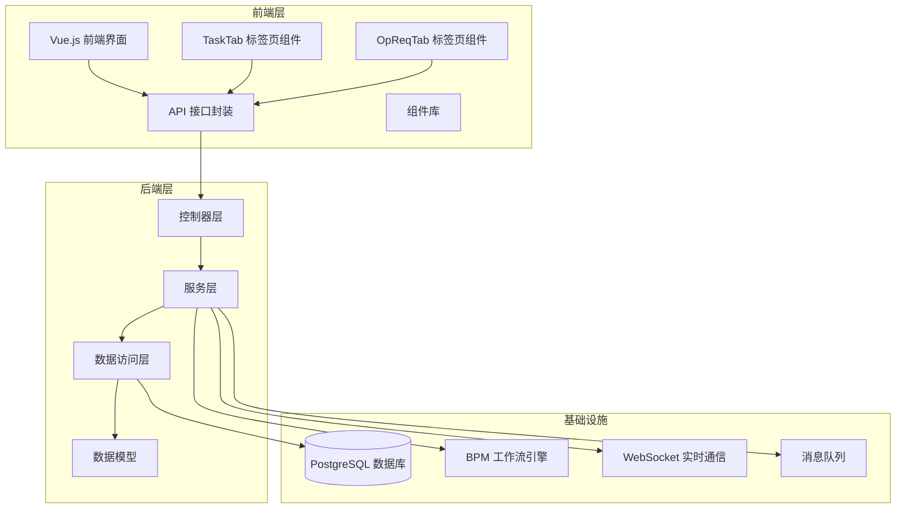
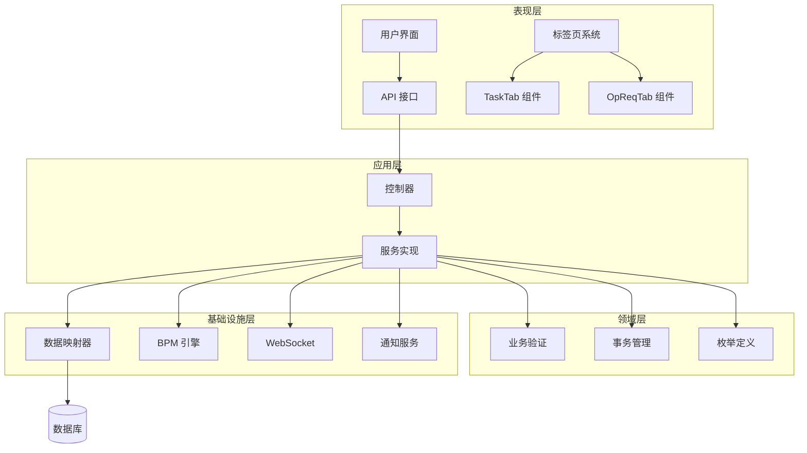
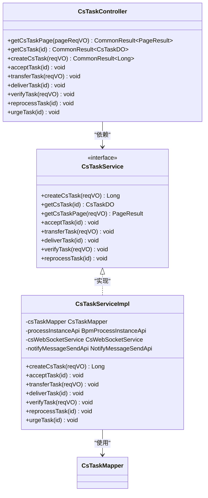
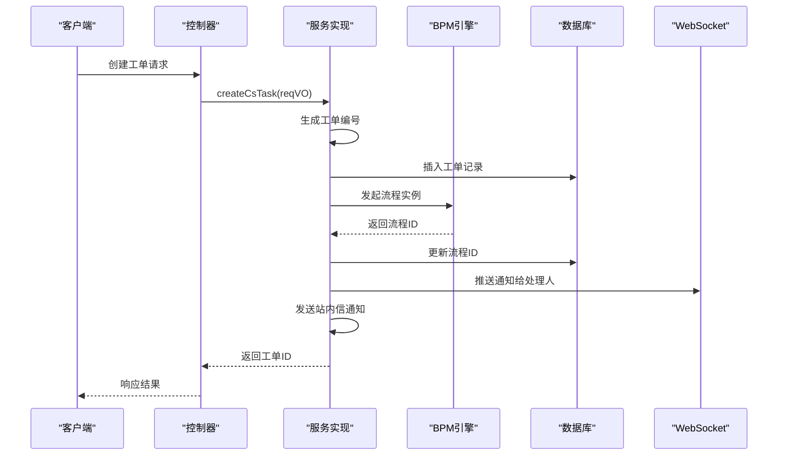
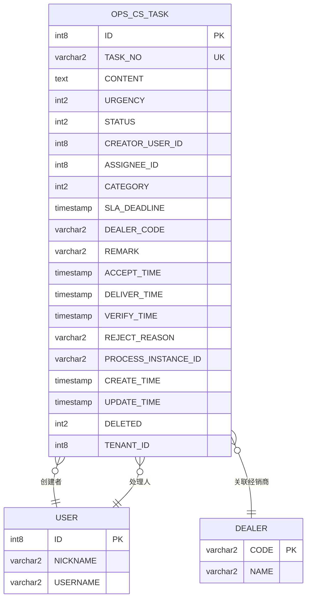
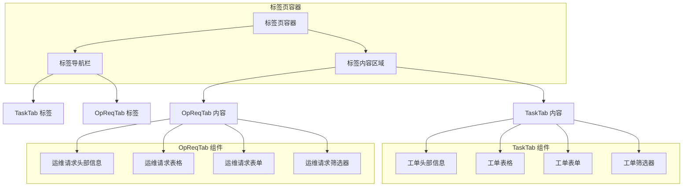
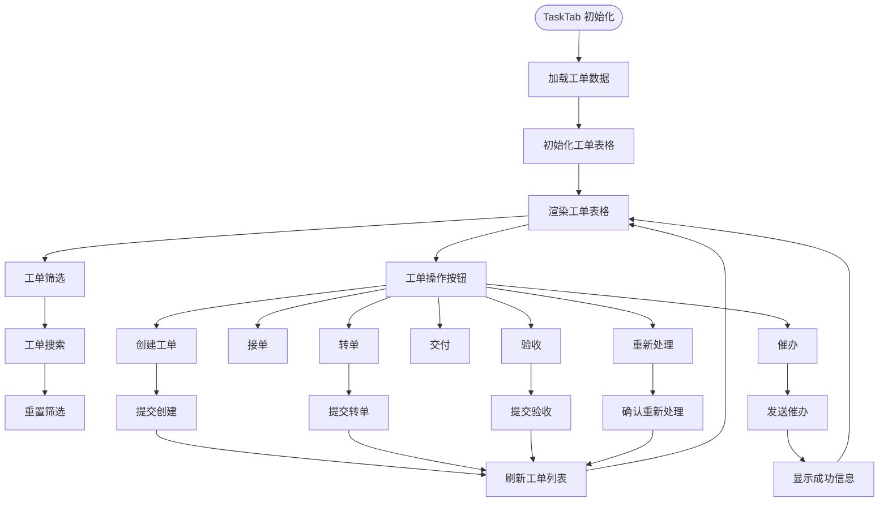
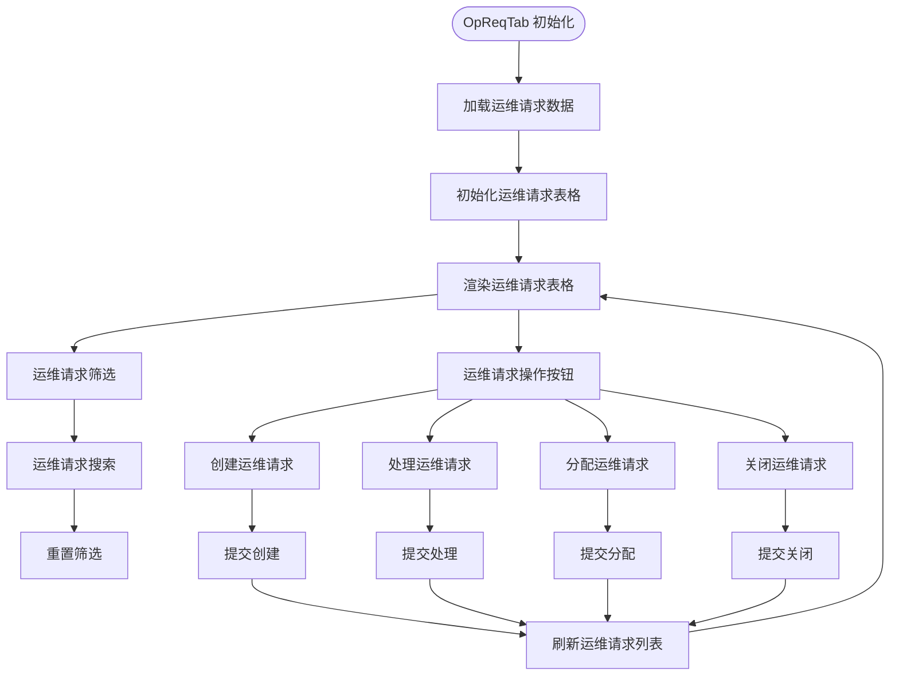
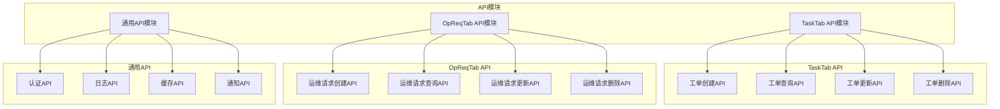
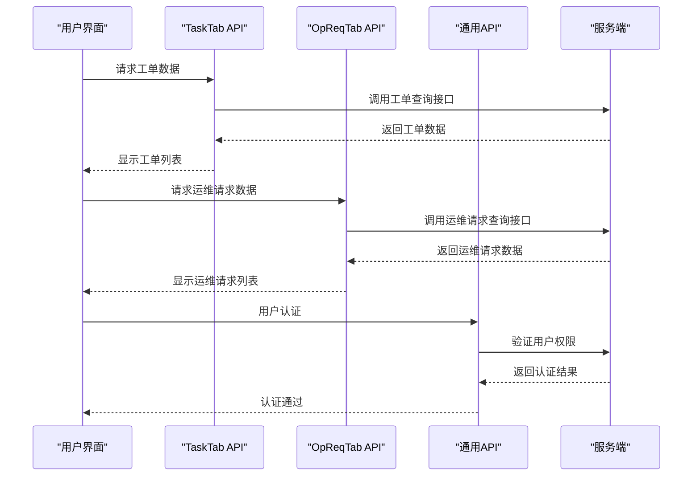

# 客户服务模块

<cite>
**本文档引用的文件**
- [CsTaskController.java](file://yudao-module-opshub/src/main/java/cn/iocoder/yudao/module/opshub/controller/admin/cs/CsTaskController.java)
- [CsTaskService.java](file://yudao-module-opshub/src/main/java/cn/iocoder/yudao/module/opshub/service/cs/CsTaskService.java)
- [CsTaskServiceImpl.java](file://yudao-module-opshub/src/main/java/cn/iocoder/yudao/module/opshub/service/cs/impl/CsTaskServiceImpl.java)
- [CsTaskDO.java](file://yudao-module-opshub/src/main/java/cn/iocoder/yudao/module/opshub/dal/dataobject/cs/CsTaskDO.java)
- [CsTaskPageReqVO.java](file://yudao-module-opshub/src/main/java/cn/iocoder/yudao/module/opshub/controller/admin/cs/vo/CsTaskPageReqVO.java)
- [feature_step6-客服模块_ddl.sql](file://docs/sql/branches/feature_step6-客服模块/feature_step6-客服模块_ddl.sql)
- [index.vue](file://yudao-ui/yudao-ui-admin-vue3/src/views/opshub/customerservice/index.vue)
- [TaskTab.vue](file://yudao-ui/yudao-ui-admin-vue3/src/views/opshub/customerservice/components/TaskTab.vue)
- [OpReqTab.vue](file://yudao-ui/yudao-ui-admin-vue3/src/views/opshub/customerservice/components/OpReqTab.vue)
</cite>

## 更新摘要
**所做更改**
- 新增模块化标签页界面架构说明
- 新增TaskTab和OpReqTab组件详细分析
- 更新前端组件结构和依赖关系
- 新增API模块支持说明
- 更新架构图以反映新的模块化设计

## 目录
1. [简介](#简介)
2. [项目结构](#项目结构)
3. [核心组件](#核心组件)
4. [架构概览](#架构概览)
5. [详细组件分析](#详细组件分析)
6. [模块化标签页系统](#模块化标签页系统)
7. [API模块支持](#api模块支持)
8. [依赖关系分析](#依赖关系分析)
9. [性能考虑](#性能考虑)
10. [故障排除指南](#故障排除指南)
11. [结论](#结论)

## 简介

客户服务模块是基于企业运营平台（OpsHub）开发的一套完整的客户服务工单管理系统。该模块实现了从工单创建、分配、处理到最终验收的全流程管理，支持多角色协作、状态流转控制和实时通知提醒。

**更新** 模块已从传统的单页面架构重构为模块化标签页界面系统，采用TaskTab和OpReqTab两个核心组件实现功能分离和界面优化。

本模块采用前后端分离架构，前端使用Vue.js 3.0 + Element Plus构建用户界面，后端基于Spring Boot + MyBatis Plus实现业务逻辑，集成了BPM工作流引擎和WebSocket实时通信技术。

## 项目结构

客户服务模块在整体项目中的组织结构如下：



**图表来源**
- [index.vue:1-20](file://yudao-ui/yudao-ui-admin-vue3/src/views/opshub/customerservice/index.vue#L1-L20)
- [TaskTab.vue:1-50](file://yudao-ui/yudao-ui-admin-vue3/src/views/opshub/customerservice/components/TaskTab.vue#L1-L50)
- [OpReqTab.vue:1-50](file://yudao-ui/yudao-ui-admin-vue3/src/views/opshub/customerservice/components/OpReqTab.vue#L1-L50)

**章节来源**
- [index.vue:1-20](file://yudao-ui/yudao-ui-admin-vue3/src/views/opshub/customerservice/index.vue#L1-L20)
- [TaskTab.vue:1-50](file://yudao-ui/yudao-ui-admin-vue3/src/views/opshub/customerservice/components/TaskTab.vue#L1-L50)
- [OpReqTab.vue:1-50](file://yudao-ui/yudao-ui-admin-vue3/src/views/opshub/customerservice/components/OpReqTab.vue#L1-L50)

## 核心组件

客户服务模块的核心组件包括：

### 1. 工单状态管理
- **待接单 (0)**: 新创建的工单状态
- **处理中 (1)**: 已被执行员接单的状态
- **已交付 (2)**: 执行员已完成处理的状态
- **已关闭 (3)**: 经销商验收通过的状态
- **已退回 (4)**: 经销商退回需要重新处理的状态

### 2. 工单紧急程度
- **紧急 (0)**: 需要立即处理
- **高 (1)**: 重要且紧急
- **中 (2)**: 正常处理优先级
- **低 (3)**: 一般性事务

### 3. 工单分类体系
- **签约**: 合同签署相关问题
- **政策**: 政策解读和咨询
- **售后**: 售后服务和维护
- **订单**: 订单处理和变更
- **数据**: 数据管理和查询
- **其他**: 未归类的其他事务

**章节来源**
- [feature_step6-客服模块_ddl.sql:44-48](file://docs/sql/branches/feature_step6-客服模块/feature_step6-客服模块_ddl.sql#L44-L48)
- [index.vue:214-235](file://yudao-ui/yudao-ui-admin-vue3/src/views/opshub/customerservice/index.vue#L214-L235)

## 架构概览

客户服务模块采用分层架构设计，现已升级为模块化标签页系统，确保了系统的可维护性和扩展性：



**图表来源**
- [index.vue:1-20](file://yudao-ui/yudao-ui-admin-vue3/src/views/opshub/customerservice/index.vue#L1-L20)
- [TaskTab.vue:1-50](file://yudao-ui/yudao-ui-admin-vue3/src/views/opshub/customerservice/components/TaskTab.vue#L1-L50)
- [OpReqTab.vue:1-50](file://yudao-ui/yudao-ui-admin-vue3/src/views/opshub/customerservice/components/OpReqTab.vue#L1-L50)

## 详细组件分析

### 控制器层分析

控制器层负责处理HTTP请求和响应，提供RESTful API接口：



**图表来源**
- [CsTaskController.java:24-104](file://yudao-module-opshub/src/main/java/cn/iocoder/yudao/module/opshub/controller/admin/cs/CsTaskController.java#L24-L104)
- [CsTaskService.java:10-60](file://yudao-module-opshub/src/main/java/cn/iocoder/yudao/module/opshub/service/cs/CsTaskService.java#L10-L60)
- [CsTaskServiceImpl.java:36-39](file://yudao-module-opshub/src/main/java/cn/iocoder/yudao/module/opshub/service/cs/impl/CsTaskServiceImpl.java#L36-L39)

**章节来源**
- [CsTaskController.java:24-104](file://yudao-module-opshub/src/main/java/cn/iocoder/yudao/module/opshub/controller/admin/cs/CsTaskController.java#L24-L104)
- [CsTaskService.java:10-60](file://yudao-module-opshub/src/main/java/cn/iocoder/yudao/module/opshub/service/cs/CsTaskService.java#L10-L60)

### 服务层业务逻辑

服务层实现了核心的业务逻辑和状态流转控制：



**图表来源**
- [CsTaskServiceImpl.java:68-104](file://yudao-module-opshub/src/main/java/cn/iocoder/yudao/module/opshub/service/cs/impl/CsTaskServiceImpl.java#L68-L104)

**章节来源**
- [CsTaskServiceImpl.java:68-104](file://yudao-module-opshub/src/main/java/cn/iocoder/yudao/module/opshub/service/cs/impl/CsTaskServiceImpl.java#L68-L104)

### 数据模型设计

工单数据模型采用了标准的实体关系设计：



**图表来源**
- [CsTaskDO.java:19-93](file://yudao-module-opshub/src/main/java/cn/iocoder/yudao/module/opshub/dal/dataobject/cs/CsTaskDO.java#L19-L93)
- [feature_step6-客服模块_ddl.sql:8-31](file://docs/sql/branches/feature_step6-客服模块/feature_step6-客服模块_ddl.sql#L8-L31)

**章节来源**
- [CsTaskDO.java:19-93](file://yudao-module-opshub/src/main/java/cn/iocoder/yudao/module/opshub/dal/dataobject/cs/CsTaskDO.java#L19-L93)
- [feature_step6-客服模块_ddl.sql:8-31](file://docs/sql/branches/feature_step6-客服模块/feature_step6-客服模块_ddl.sql#L8-L31)

## 模块化标签页系统

**新增** 客户服务模块已重构为模块化标签页界面系统，采用TaskTab和OpReqTab两个核心组件实现功能分离。

### 标签页系统架构



**图表来源**
- [index.vue:1-20](file://yudao-ui/yudao-ui-admin-vue3/src/views/opshub/customerservice/index.vue#L1-L20)
- [TaskTab.vue:1-50](file://yudao-ui/yudao-ui-admin-vue3/src/views/opshub/customerservice/components/TaskTab.vue#L1-L50)
- [OpReqTab.vue:1-50](file://yudao-ui/yudao-ui-admin-vue3/src/views/opshub/customerservice/components/OpReqTab.vue#L1-L50)

### TaskTab 组件分析

TaskTab组件专门负责客户服务工单的展示和管理：



**图表来源**
- [TaskTab.vue:1-50](file://yudao-ui/yudao-ui-admin-vue3/src/views/opshub/customerservice/components/TaskTab.vue#L1-L50)

### OpReqTab 组件分析

OpReqTab组件专门负责运维请求的展示和管理：



**图表来源**
- [OpReqTab.vue:1-50](file://yudao-ui/yudao-ui-admin-vue3/src/views/opshub/customerservice/components/OpReqTab.vue#L1-L50)

**章节来源**
- [index.vue:1-20](file://yudao-ui/yudao-ui-admin-vue3/src/views/opshub/customerservice/index.vue#L1-L20)
- [TaskTab.vue:1-50](file://yudao-ui/yudao-ui-admin-vue3/src/views/opshub/customerservice/components/TaskTab.vue#L1-L50)
- [OpReqTab.vue:1-50](file://yudao-ui/yudao-ui-admin-vue3/src/views/opshub/customerservice/components/OpReqTab.vue#L1-L50)

## API模块支持

**新增** 模块现已支持独立的API模块，为TaskTab和OpReqTab组件提供专门的接口支持。

### API模块架构



**图表来源**
- [TaskTab.vue:1-50](file://yudao-ui/yudao-ui-admin-vue3/src/views/opshub/customerservice/components/TaskTab.vue#L1-L50)
- [OpReqTab.vue:1-50](file://yudao-ui/yudao-ui-admin-vue3/src/views/opshub/customerservice/components/OpReqTab.vue#L1-L50)

### API调用流程



**图表来源**
- [TaskTab.vue:1-50](file://yudao-ui/yudao-ui-admin-vue3/src/views/opshub/customerservice/components/TaskTab.vue#L1-L50)
- [OpReqTab.vue:1-50](file://yudao-ui/yudao-ui-admin-vue3/src/views/opshub/customerservice/components/OpReqTab.vue#L1-L50)

**章节来源**
- [TaskTab.vue:1-50](file://yudao-ui/yudao-ui-admin-vue3/src/views/opshub/customerservice/components/TaskTab.vue#L1-L50)
- [OpReqTab.vue:1-50](file://yudao-ui/yudao-ui-admin-vue3/src/views/opshub/customerservice/components/OpReqTab.vue#L1-L50)

## 依赖关系分析

客户服务模块的依赖关系体现了清晰的分层架构和模块化设计：

```mermaid
graph LR
subgraph "外部依赖"
SPRING[Spring Boot]
MYBATIS[MyBatis Plus]
BPM[BPM 引擎]
WEBSOCKET[WebSocket]
SYSTEM[System 模块]
ELEMENTPLUS[Element Plus]
VUE3[Vue.js 3.0]
END
subgraph "内部模块"
OPShub[Opshub 模块]
Framework[框架层]
end
subgraph "客户服务模块"
TAB_CONTAINER[标签页容器]
TASK_TAB[TaskTab 组件]
OPREQ_TAB[OpReqTab 组件]
TASK_API[TaskTab API模块]
OPREQ_API[OpReqTab API模块]
COMMON_API[通用API模块]
END
SPRING --> TAB_CONTAINER
MYBATIS --> TASK_API
BPM --> OPREQ_API
WEBSOCKET --> COMMON_API
SYSTEM --> COMMON_API
ELEMENTPLUS --> TAB_CONTAINER
VUE3 --> TASK_TAB
VUE3 --> OPREQ_TAB
TAB_CONTAINER --> TASK_TAB
TAB_CONTAINER --> OPREQ_TAB
TASK_TAB --> TASK_API
OPREQ_TAB --> OPREQ_API
TASK_API --> COMMON_API
OPREQ_API --> COMMON_API
COMMON_API --> OPShub
Framework --> TAB_CONTAINER
Framework --> TASK_TAB
Framework --> OPREQ_TAB
```

**图表来源**
- [index.vue:1-20](file://yudao-ui/yudao-ui-admin-vue3/src/views/opshub/customerservice/index.vue#L1-L20)
- [TaskTab.vue:1-50](file://yudao-ui/yudao-ui-admin-vue3/src/views/opshub/customerservice/components/TaskTab.vue#L1-L50)
- [OpReqTab.vue:1-50](file://yudao-ui/yudao-ui-admin-vue3/src/views/opshub/customerservice/components/OpReqTab.vue#L1-L50)

**章节来源**
- [index.vue:1-20](file://yudao-ui/yudao-ui-admin-vue3/src/views/opshub/customerservice/index.vue#L1-L20)
- [TaskTab.vue:1-50](file://yudao-ui/yudao-ui-admin-vue3/src/views/opshub/customerservice/components/TaskTab.vue#L1-L50)
- [OpReqTab.vue:1-50](file://yudao-ui/yudao-ui-admin-vue3/src/views/opshub/customerservice/components/OpReqTab.vue#L1-L50)

## 性能考虑

客户服务模块在设计时充分考虑了性能优化，模块化标签页系统进一步提升了用户体验：

### 数据库优化
- **索引策略**: 为常用查询字段建立复合索引，包括状态、处理人、创建人、经销商编码等
- **序列化**: 使用数据库序列生成唯一ID，避免并发冲突
- **分区设计**: 支持按时间分区存储历史数据

### 缓存策略
- **会话缓存**: 使用Redis缓存用户会话信息
- **配置缓存**: 缓存系统配置和枚举值
- **查询缓存**: 缓存热点查询结果
- **组件缓存**: 标签页组件状态缓存

### 异步处理
- **消息队列**: 使用消息队列异步处理耗时操作
- **批量处理**: 支持批量数据导入导出
- **定时任务**: 异步清理过期数据
- **懒加载**: 标签页内容按需加载

### 前端性能优化
- **组件拆分**: TaskTab和OpReqTab组件独立加载
- **虚拟滚动**: 大数据量表格使用虚拟滚动
- **防抖节流**: 输入框和搜索功能使用防抖节流
- **图片懒加载**: 图片资源按需加载

## 故障排除指南

### 常见问题及解决方案

| 问题类型 | 症状描述 | 可能原因 | 解决方案 |
|---------|---------|---------|---------|
| 标签页加载失败 | 切换标签页时页面空白 | 组件加载异常或API调用失败 | 检查组件依赖和网络连接 |
| 工单创建失败 | 提交后无响应或报错 | 权限不足或数据验证失败 | 检查用户权限和必填字段 |
| 工单状态异常 | 状态无法正常流转 | BPM流程配置错误 | 检查流程定义和节点配置 |
| 通知推送失败 | 处理人未收到通知 | WebSocket连接异常 | 检查网络连接和服务器状态 |
| 查询性能慢 | 页面加载缓慢 | 缺少必要索引或查询条件不当 | 添加索引和优化SQL查询 |
| 标签页切换卡顿 | 切换时页面响应慢 | 组件渲染复杂或数据量过大 | 优化组件结构和数据处理 |

### 调试工具和方法

1. **日志分析**: 查看服务端日志了解错误堆栈
2. **数据库监控**: 监控SQL执行时间和慢查询
3. **网络诊断**: 检查WebSocket连接状态
4. **权限验证**: 确认用户角色和权限配置
5. **组件调试**: 使用Vue DevTools检查组件状态
6. **API测试**: 使用Postman测试API接口

**章节来源**
- [CsTaskServiceImpl.java:260-292](file://yudao-module-opshub/src/main/java/cn/iocoder/yudao/module/opshub/service/cs/impl/CsTaskServiceImpl.java#L260-L292)

## 结论

客户服务模块经过重构后，已成为一个功能完整、架构清晰、界面友好的企业级客户服务管理系统。通过采用现代化的模块化标签页设计和API模块支持，该模块实现了以下关键特性：

### 技术优势
- **模块化设计**: 清晰的分层架构便于维护和扩展
- **标签页系统**: TaskTab和OpReqTab组件实现功能分离
- **API模块化**: 独立的API模块支持提高代码复用性
- **状态机管理**: 完整的工单状态流转控制
- **实时通信**: 基于WebSocket的通知机制
- **工作流集成**: 与BPM引擎深度集成

### 业务价值
- **提升效率**: 自动化的工单分配和跟踪
- **增强协作**: 多角色协同处理机制
- **改善体验**: 直观的用户界面和操作流程
- **保障质量**: SLA管理和质量控制机制
- **降低维护成本**: 模块化设计便于功能扩展

### 用户体验改进
- **界面优化**: 模块化标签页提供更好的导航体验
- **性能提升**: 组件独立加载减少页面负担
- **响应速度**: API模块化提高接口调用效率
- **功能分离**: TaskTab和OpReqTab各司其职，界面更清晰

该模块为企业提供了强大的客户服务支撑能力，能够有效提升客户满意度和服务质量，同时为未来的功能扩展奠定了坚实的基础。