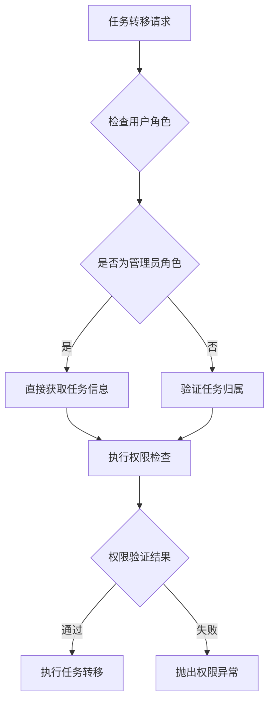
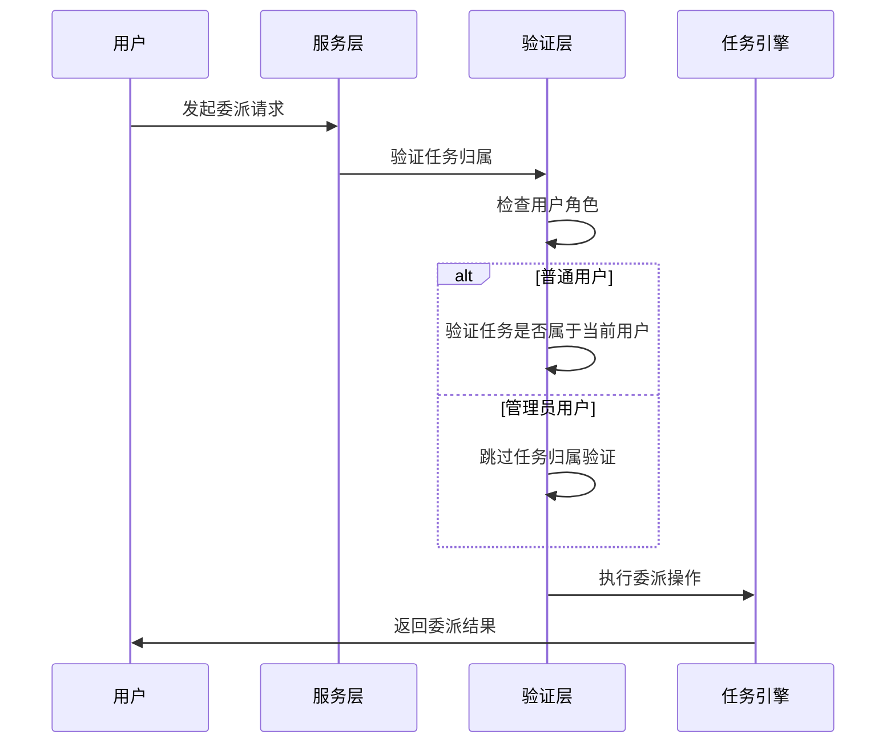
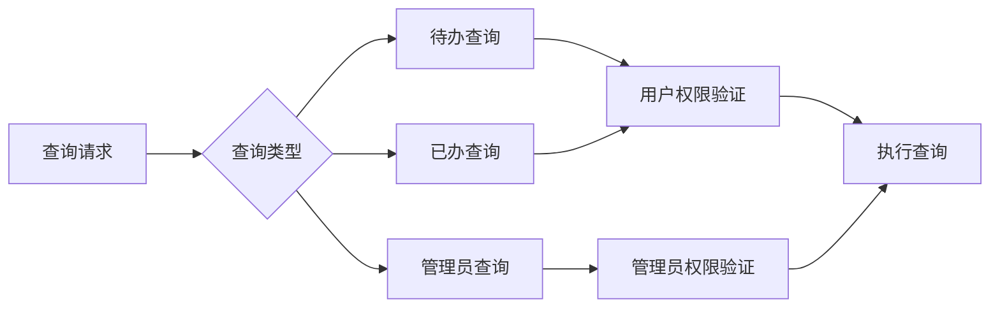
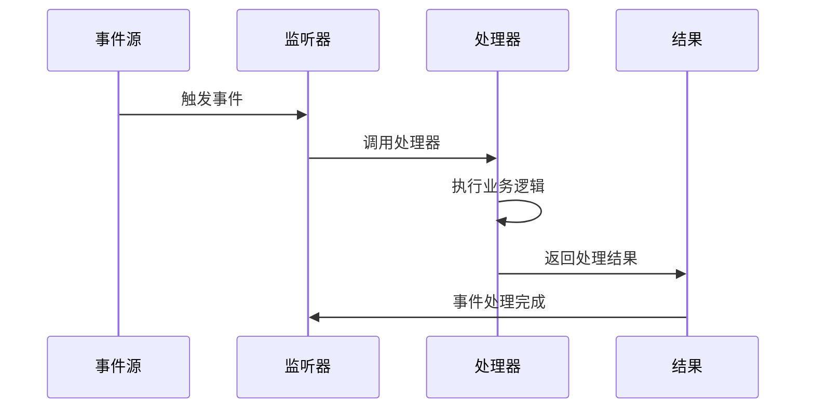
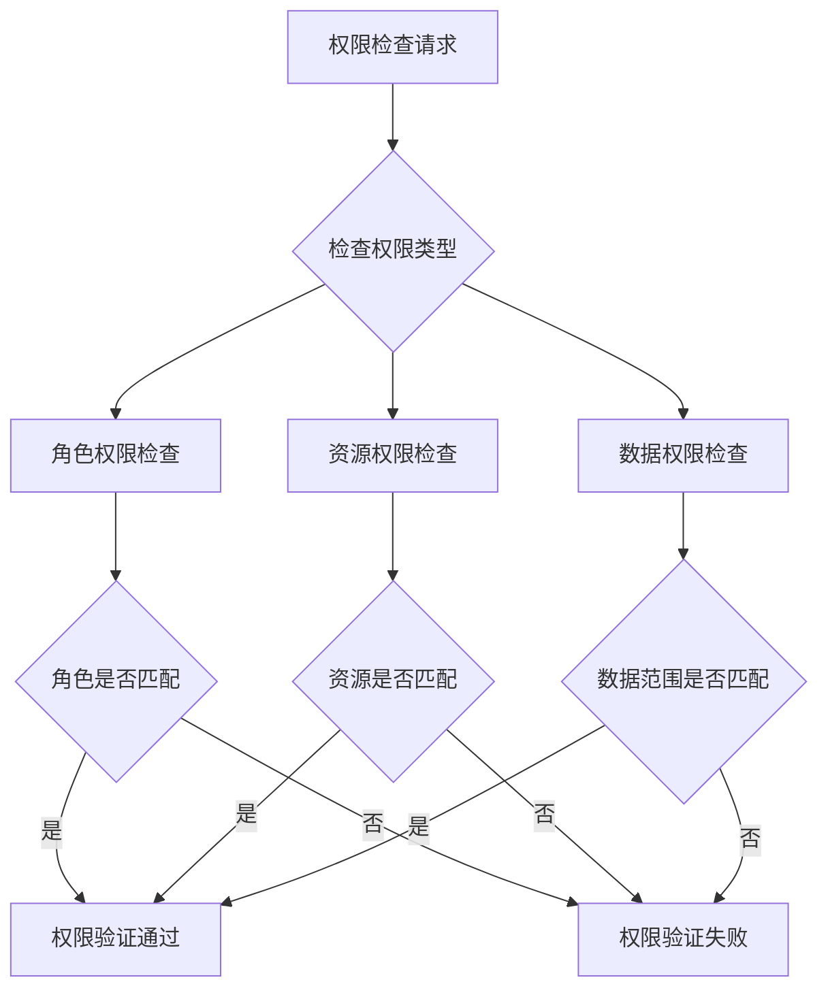

# 任务管理

<cite>
**本文引用的文件**
- [BpmTaskService.java](file://yudao-module-bpm/src/main/java/cn/iocoder/yudao/module/bpm/service/task/BpmTaskService.java)
- [BpmTaskServiceImpl.java](file://yudao-module-bpm/src/main/java/cn/iocoder/yudao/module/bpm/service/task/BpmTaskServiceImpl.java)
- [BpmTaskController.java](file://yudao-module-bpm/src/main/java/cn/iocoder/yudao/module/bpm/controller/admin/task/BpmTaskController.java)
- [BpmTaskTransferReqVO.java](file://yudao-module-bpm/src/main/java/cn/iocoder/yudao/module/bpm/controller/admin/task/vo/task/BpmTaskTransferReqVO.java)
- [PermissionApiImpl.java](file://yudao-module-system/src/main/java/cn/iocoder/yudao/module/system/api/permission/PermissionApiImpl.java)
- [PermissionServiceImpl.java](file://yudao-module-system/src/main/java/cn/iocoder/yudao/module/system/service/permission/PermissionServiceImpl.java)
- [feature-process-admin_dml.sql](file://db/branches/feature-process-admin/feature-process-admin_dml.sql)
- [ErrorCodeConstants.java](file://yudao-module-bpm/src/main/java/cn/iocoder/yudao/module/bpm/enums/ErrorCodeConstants.java)
</cite>

## 更新摘要
**所做更改**
- 新增流程管理员角色支持章节，详细介绍 PROCESS_ADMIN 角色的功能和权限
- 更新任务转移功能章节，增加管理员级转派权限说明
- 新增角色权限验证机制章节，解释权限检查流程
- 更新任务转移 API 接口章节，包含新的权限控制逻辑
- 新增数据库角色定义章节，展示角色配置信息

## 目录
- [概述](#概述)
- [角色权限体系](#角色权限体系)
- [任务转移功能](#任务转移功能)
- [任务委派功能](#任务委派功能)
- [任务查询与管理](#任务查询与管理)
- [任务监听器与执行器](#任务监听器与执行器)
- [任务历史与审计](#任务历史与审计)
- [权限验证机制](#权限验证机制)
- [数据库角色定义](#数据库角色定义)
- [最佳实践与注意事项](#最佳实践与注意事项)

## 概述
任务管理是业务流程管理系统的核心组件，负责处理用户任务、系统任务和委托任务的完整生命周期管理。本文档详细介绍任务管理系统的架构设计、功能特性和实现细节。

任务管理系统基于 Flowable 流程引擎构建，支持完整的 BPMN 2.0 标准，提供从任务创建、分配、拾取到完成的全流程管理能力。系统采用分层架构设计，包括表现层、业务逻辑层、数据访问层和流程引擎层，确保系统的可扩展性和可维护性。

## 角色权限体系
任务管理系统采用基于角色的权限控制模型，支持多种角色类型的灵活配置和权限分配。

### 角色类型与权限范围
系统支持以下角色类型：

- **普通用户角色**：仅能操作自己名下的任务
- **管理员角色**：支持 PROCESS_ADMIN 和 SUPER_ADMIN 两种高级权限角色
- **系统角色**：预定义的系统级角色，具有特殊权限

### 角色权限矩阵
| 角色类型 | 任务操作权限 | 管理员级权限 | 系统级权限 |
|---------|-------------|-------------|-----------|
| 普通用户 | 仅能操作自己的任务 | ❌ | ❌ |
| PROCESS_ADMIN | ✅ | ✅ | ❌ |
| SUPER_ADMIN | ✅ | ✅ | ✅ |

**更新** 新增 PROCESS_ADMIN 角色，提供管理员级转派权限

**章节来源**
- [PermissionApiImpl.java:32-35](file://yudao-module-system/src/main/java/cn/iocoder/yudao/module/system/api/permission/PermissionApiImpl.java#L32-L35)
- [PermissionServiceImpl.java:113-129](file://yudao-module-system/src/main/java/cn/iocoder/yudao/module/system/service/permission/PermissionServiceImpl.java#L113-L129)

## 任务转移功能
任务转移功能允许用户将当前正在处理的任务转交给其他用户处理，支持管理员级的全量任务转派能力。

### 转移权限控制
任务转移操作根据用户角色实施不同的权限控制策略：

**图表来源**
- [BpmTaskServiceImpl.java:1082-1117](file://yudao-module-bpm/src/main/java/cn/iocoder/yudao/module/bpm/service/task/BpmTaskServiceImpl.java#L1082-L1117)

### 转移流程实现
任务转移的完整执行流程包括以下步骤：

1. **权限验证**：检查用户是否具备 PROCESS_ADMIN 或 SUPER_ADMIN 角色
2. **任务验证**：验证目标任务的存在性和有效性
3. **用户验证**：确认转交用户的有效性
4. **状态更新**：更新任务的所有权和处理人信息
5. **历史记录**：添加转移操作的历史记录

### 转移操作类型
系统支持两种主要的转移操作类型：

- **普通转移**：用户只能转移自己名下的任务
- **管理员转移**：管理员可转移任何任务，无需任务归属验证

**更新** 新增管理员级转移权限，支持 PROCESS_ADMIN 角色的全量任务转派

**章节来源**
- [BpmTaskServiceImpl.java:1082-1117](file://yudao-module-bpm/src/main/java/cn/iocoder/yudao/module/bpm/service/task/BpmTaskServiceImpl.java#L1082-L1117)
- [BpmTaskController.java:190-196](file://yudao-module-bpm/src/main/java/cn/iocoder/yudao/module/bpm/controller/admin/task/BpmTaskController.java#L190-L196)

## 任务委派功能
任务委派功能允许用户将当前任务临时委派给其他用户处理，委派期间的处理结果会反馈给原审批人。

### 委派权限控制
委派操作实施严格的权限控制机制：

**图表来源**
- [BpmTaskServiceImpl.java:1051-1077](file://yudao-module-bpm/src/main/java/cn/iocoder/yudao/module/bpm/service/task/BpmTaskServiceImpl.java#L1051-L1077)

### 委派操作流程
委派操作的执行流程包括：

1. **任务验证**：确认任务的有效性和归属关系
2. **用户验证**：验证被委派用户的有效性
3. **权限检查**：根据用户角色执行相应的权限验证
4. **所有权设置**：设置任务的所有者为原审批人
5. **委派执行**：执行委派操作，更新任务处理人

### 委派与转移的区别
| 特性 | 委派 | 转移 |
|------|------|------|
| 任务所有权 | 保持不变 | 转移给新处理人 |
| 处理权限 | 临时转移 | 永久转移 |
| 历史记录 | 委派记录 | 转移记录 |
| 权限要求 | 仅需任务归属 | 管理员或任务归属 |

**章节来源**
- [BpmTaskServiceImpl.java:1051-1077](file://yudao-module-bpm/src/main/java/cn/iocoder/yudao/module/bpm/service/task/BpmTaskServiceImpl.java#L1051-L1077)

## 任务查询与管理
系统提供完善的任务查询和管理功能，支持多种查询条件和筛选选项。

### 查询接口设计
系统提供以下主要查询接口：

- **待办任务查询**：获取当前用户的待办任务列表
- **已办任务查询**：获取用户处理过的任务历史
- **管理员查询**：管理员视角的任务全量查询
- **流程实例查询**：按流程实例维度的任务查询

### 查询权限控制
不同查询接口实施不同的权限控制策略：

**图表来源**
- [BpmTaskController.java:63-122](file://yudao-module-bpm/src/main/java/cn/iocoder/yudao/module/bpm/controller/admin/task/BpmTaskController.java#L63-L122)

### 查询结果处理
查询结果经过统一的数据拼接和格式化处理：

1. **流程实例映射**：获取流程实例相关信息
2. **用户信息映射**：获取任务相关用户信息
3. **部门信息映射**：获取用户所属部门信息
4. **表单信息映射**：获取任务关联的表单信息

**章节来源**
- [BpmTaskController.java:63-122](file://yudao-module-bpm/src/main/java/cn/iocoder/yudao/module/bpm/controller/admin/task/BpmTaskController.java#L63-L122)

## 任务监听器与执行器
系统提供完善的任务监听器和执行器机制，支持任务生命周期的自动化处理。

### 监听器类型
系统支持以下类型的监听器：

- **任务创建监听器**：处理任务创建事件
- **任务分配监听器**：处理任务分配事件  
- **任务完成监听器**：处理任务完成事件
- **任务取消监听器**：处理任务取消事件
- **任务超时监听器**：处理任务超时事件

### 执行器配置
任务执行器支持多种执行模式：

- **自动执行**：根据配置自动执行任务
- **手动执行**：需要人工干预的任务
- **条件执行**：满足特定条件时执行
- **定时执行**：按照预定时间执行

### 事件处理流程

**图表来源**
- [BpmTaskService.java:278-342](file://yudao-module-bpm/src/main/java/cn/iocoder/yudao/module/bpm/service/task/BpmTaskService.java#L278-L342)

**章节来源**
- [BpmTaskService.java:278-342](file://yudao-module-bpm/src/main/java/cn/iocoder/yudao/module/bpm/service/task/BpmTaskService.java#L278-L342)

## 任务历史与审计
系统提供完整的历史记录和审计功能，确保所有任务操作都有据可查。

### 历史记录类型
系统记录以下类型的历史信息：

- **操作日志**：记录用户的所有操作行为
- **状态变更**：记录任务状态的变更历史
- **权限变更**：记录权限相关的变更信息
- **系统事件**：记录系统级别的事件信息

### 审计功能
审计功能提供以下能力：

- **操作追踪**：追踪每个操作的执行过程
- **责任认定**：明确各项操作的责任人
- **合规检查**：支持合规性检查和审计需求
- **统计分析**：提供任务处理的统计分析功能

### 历史数据管理
历史数据采用分层存储策略：

1. **短期存储**：近期的历史数据存储在热数据区
2. **中期存储**：中期历史数据存储在温数据区
3. **长期存储**：长期历史数据存储在冷数据区

## 权限验证机制
系统采用多层次的权限验证机制，确保任务操作的安全性和准确性。

### 权限检查流程
权限验证采用以下检查流程：

**图表来源**
- [PermissionServiceImpl.java:113-129](file://yudao-module-system/src/main/java/cn/iocoder/yudao/module/system/service/permission/PermissionServiceImpl.java#L113-L129)

### 权限缓存机制
系统采用多级缓存机制提高权限检查性能：

- **本地缓存**：缓存用户的角色信息
- **分布式缓存**：缓存权限相关的配置信息
- **数据库缓存**：缓存权限检查的结果

### 权限异常处理
权限验证失败时的处理机制：

1. **异常捕获**：捕获权限相关的异常
2. **日志记录**：记录权限检查的详细信息
3. **错误响应**：返回标准化的错误信息
4. **安全审计**：记录安全相关的事件

**章节来源**
- [PermissionServiceImpl.java:113-129](file://yudao-module-system/src/main/java/cn/iocoder/yudao/module/system/service/permission/PermissionServiceImpl.java#L113-L129)

## 数据库角色定义
系统通过数据库角色定义实现权限控制，PROCESS_ADMIN 角色作为新增的管理员级角色。

### 角色表结构
角色信息存储在 system_role 表中，包含以下关键字段：

| 字段名 | 类型 | 描述 | 示例值 |
|--------|------|------|--------|
| id | BIGINT | 角色标识符 | 161 |
| name | VARCHAR | 角色名称 | 流程管理员 |
| code | VARCHAR | 角色编码 | process_admin |
| sort | INTEGER | 排序权重 | 50 |
| status | SMALLINT | 角色状态 | 0（启用） |
| type | SMALLINT | 角色类型 | 1（业务角色） |
| remark | TEXT | 角色描述 | 业务角色-流程转派 |

### 菜单授权配置
PROCESS_ADMIN 角色拥有以下菜单权限：

#### OpsHub 模块权限
- **聚院通** (menu_id: 6000) - 一级目录
- **客户服务** (menu_id: 6008) - 菜单入口  
- **查看工单** (menu_id: 6080) - service:task:query
- **转单** (menu_id: 6097) - dealer:cs-task:transfer
- **工单详情** (menu_id: 6219) - 隐藏路由

#### BPM 模块权限
- **工作流程** (menu_id: 1185) - 一级目录
- **审批中心** (menu_id: 1200) - 菜单
- **流程任务** (menu_id: 2724) - 管理员视图
- **管理员查询权限** (menu_id: 2725) - bpm:task:manager-query
- **任务操作按钮** (menu_id: 1222) - 含转派功能

### 角色序列管理
系统使用序列机制管理角色和菜单的主键自增：

- **system_role_seq**：角色表序列
- **system_menu_seq**：菜单表序列  
- **system_role_menu_seq**：角色菜单关联表序列

**章节来源**
- [feature-process-admin_dml.sql:14-65](file://db/branches/feature-process-admin/feature-process-admin_dml.sql#L14-L65)

## 最佳实践与注意事项
任务管理系统在实际使用中需要注意以下最佳实践：

### 权限管理最佳实践
- **最小权限原则**：为用户分配必要的最小权限
- **定期审查**：定期审查和清理不必要的权限
- **职责分离**：确保关键权限的职责分离
- **权限继承**：合理利用角色的权限继承机制

### 任务转移最佳实践
- **转移原因记录**：详细记录任务转移的原因和背景
- **及时跟进**：转移后及时跟进任务的处理进度
- **责任明确**：明确转移过程中的责任划分
- **风险控制**：评估转移可能带来的风险

### 性能优化建议
- **索引优化**：为常用查询字段建立合适的索引
- **缓存策略**：合理使用缓存机制提高查询性能
- **批量操作**：对于大量数据操作使用批量处理
- **异步处理**：耗时的操作采用异步处理方式

### 安全注意事项
- **输入验证**：对所有用户输入进行严格验证
- **SQL 注入防护**：使用参数化查询防止 SQL 注入
- **XSS 防护**：对用户输出内容进行 XSS 过滤
- **敏感信息保护**：妥善处理和存储敏感信息

### 监控与维护
- **日志监控**：建立完善的日志监控体系
- **性能监控**：持续监控系统的性能指标
- **故障预警**：建立故障预警和应急响应机制
- **定期备份**：制定完善的数据备份和恢复策略

通过以上最佳实践和注意事项，可以确保任务管理系统的稳定运行和高效管理。