# 工作流模块

<cite>
**本文引用的文件**
- [BpmFlowableConfiguration.java](file://yudao-module-bpm/src/main/java/cn/iocoder/yudao/module/bpm/framework/flowable/config/BpmFlowableConfiguration.java)
- [BpmActivityBehaviorFactory.java](file://yudao-module-bpm/src/main/java/cn/iocoder/yudao/module/bpm/framework/flowable/core/behavior/BpmActivityBehaviorFactory.java)
- [BpmUserTaskActivityBehavior.java](file://yudao-module-bpm/src/main/java/cn/iocoder/yudao/module/bpm/framework/flowable/core/behavior/BpmUserTaskActivityBehavior.java)
- [BpmParallelMultiInstanceBehavior.java](file://yudao-module-bpm/src/main/java/cn/iocoder/yudao/module/bpm/framework/flowable/core/behavior/BpmParallelMultiInstanceBehavior.java)
- [BpmSequentialMultiInstanceBehavior.java](file://yudao-module-bpm/src/main/java/cn/iocoder/yudao/module/bpm/framework/flowable/core/behavior/BpmSequentialMultiInstanceBehavior.java)
- [BpmTaskCandidateInvoker.java](file://yudao-module-bpm/src/main/java/cn/iocoder/yudao/module/bpm/framework/flowable/core/candidate/BpmTaskCandidateInvoker.java)
- [BpmTaskCandidateStrategy.java](file://yudao-module-bpm/src/main/java/cn/iocoder/yudao/module/bpm/framework/flowable/core/candidate/BpmTaskCandidateStrategy.java)
- [BpmTaskCandidateStrategyEnum.java](file://yudao-module-bpm/src/main/java/cn/iocoder/yudao/module/bpm/framework/flowable/core/enums/BpmTaskCandidateStrategyEnum.java)
- [BpmnModelConstants.java](file://yudao-module-bpm/src/main/java/cn/iocoder/yudao/module/bpm/framework/flowable/core/enums/BpmnModelConstants.java)
- [BpmnVariableConstants.java](file://yudao-module-bpm/src/main/java/cn/iocoder/yudao/module/bpm/framework/flowable/core/enums/BpmnVariableConstants.java)
- [BpmProcessInstanceEventPublisher.java](file://yudao-module-bpm/src/main/java/cn/iocoder/yudao/module/bpm/framework/flowable/core/event/BpmProcessInstanceEventPublisher.java)
- [BpmProcessInstanceEventListener.java](file://yudao-module-bpm/src/main/java/cn/iocoder/yudao/module/bpm/framework/flowable/core/listener/BpmProcessInstanceEventListener.java)
- [BpmTaskEventListener.java](file://yudao-module-bpm/src/main/java/cn/iocoder/yudao/module/bpm/framework/flowable/core/listener/BpmTaskEventListener.java)
- [BpmTriggerTaskDelegate.java](file://yudao-module-bpm/src/main/java/cn/iocoder/yudao/module/bpm/framework/flowable/core/listener/BpmTriggerTaskDelegate.java)
- [BpmHttpRequestUtils.java](file://yudao-module-bpm/src/main/java/cn/iocoder/yudao/module/bpm/framework/flowable/core/util/BpmHttpRequestUtils.java)
- [BpmnModelUtils.java](file://yudao-module-bpm/src/main/java/cn/iocoder/yudao/module/bpm/framework/flowable/core/util/BpmnModelUtils.java)
- [FlowableUtils.java](file://yudao-module-bpm/src/main/java/cn/iocoder/yudao/module/bpm/framework/flowable/core/util/FlowableUtils.java)
- [SimpleModelUtils.java](file://yudao-module-bpm/src/main/java/cn/iocoder/yudao/module/bpm/framework/flowable/core/util/SimpleModelUtils.java)
- [BpmProcessDefinitionService.java](file://yudao-module-bpm/src/main/java/cn/iocoder/yudao/module/bpm/service/definition/BpmProcessDefinitionService.java)
- [BpmProcessDefinitionServiceImpl.java](file://yudao-module-bpm/src/main/java/cn/iocoder/yudao/module/bpm/service/definition/BpmProcessDefinitionServiceImpl.java)
- [BpmModelService.java](file://yudao-module-bpm/src/main/java/cn/iocoder/yudao/module/bpm/service/definition/BpmModelService.java)
- [BpmModelServiceImpl.java](file://yudao-module-bpm/src/main/java/cn/iocoder/yudao/module/bpm/service/definition/BpmModelServiceImpl.java)
- [BpmCategoryService.java](file://yudao-module-bpm/src/main/java/cn/iocoder/yudao/module/bpm/service/definition/BpmCategoryService.java)
- [BpmCategoryServiceImpl.java](file://yudao-module-bpm/src/main/java/cn/iocoder/yudao/module/bpm/service/definition/BpmCategoryServiceImpl.java)
- [BpmFormService.java](file://yudao-module-bpm/src/main/java/cn/iocoder/yudao/module/bpm/service/definition/BpmFormService.java)
- [BpmFormServiceImpl.java](file://yudao-module-bpm/src/main/java/cn/iocoder/yudao/module/bpm/service/definition/BpmFormServiceImpl.java)
- [BpmProcessExpressionService.java](file://yudao-module-bpm/src/main/java/cn/iocoder/yudao/module/bpm/service/definition/BpmProcessExpressionService.java)
- [BpmProcessExpressionServiceImpl.java](file://yudao-module-bpm/src/main/java/cn/iocoder/yudao/module/bpm/service/definition/BpmProcessExpressionServiceImpl.java)
- [BpmProcessListenerService.java](file://yudao-module-bpm/src/main/java/cn/iocoder/yudao/module/bpm/service/definition/BpmProcessListenerService.java)
- [BpmProcessListenerServiceImpl.java](file://yudao-module-bpm/src/main/java/cn/iocoder/yudao/module/bpm/service/definition/BpmProcessListenerServiceImpl.java)
- [BpmUserGroupService.java](file://yudao-module-bpm/src/main/java/cn/iocoder/yudao/module/bpm/service/definition/BpmUserGroupService.java)
- [BpmUserGroupServiceImpl.java](file://yudao-module-bpm/src/main/java/cn/iocoder/yudao/module/bpm/service/definition/BpmUserGroupServiceImpl.java)
- [BpmProcessInstanceService.java](file://yudao-module-bpm/src/main/java/cn/iocoder/yudao/module/bpm/service/task/BpmProcessInstanceService.java)
- [BpmProcessInstanceServiceImpl.java](file://yudao-module-bpm/src/main/java/cn/iocoder/yudao/module/bpm/service/task/BpmProcessInstanceServiceImpl.java)
- [BpmProcessInstanceCopyService.java](file://yudao-module-bpm/src/main/java/cn/iocoder/yudao/module/bpm/service/task/BpmProcessInstanceCopyService.java)
- [BpmProcessInstanceCopyServiceImpl.java](file://yudao-module-bpm/src/main/java/cn/iocoder/yudao/module/bpm/service/task/BpmProcessInstanceCopyServiceImpl.java)
- [BpmTaskService.java](file://yudao-module-bpm/src/main/java/cn/iocoder/yudao/module/bpm/service/task/BpmTaskService.java)
- [BpmTaskServiceImpl.java](file://yudao-module-bpm/src/main/java/cn/iocoder/yudao/module/bpm/service/task/BpmTaskServiceImpl.java)
- [BpmOALeaveService.java](file://yudao-module-bpm/src/main/java/cn/iocoder/yudao/module/bpm/service/oa/BpmOALeaveService.java)
- [BpmOALeaveServiceImpl.java](file://yudao-module-bpm/src/main/java/cn/iocoder/yudao/module/bpm/service/oa/BpmOALeaveServiceImpl.java)
- [BpmMessageService.java](file://yudao-module-bpm/src/main/java/cn/iocoder/yudao/module/bpm/service/message/BpmMessageService.java)
- [BpmMessageServiceImpl.java](file://yudao-module-bpm/src/main/java/cn/iocoder/yudao/module/bpm/service/message/BpmMessageServiceImpl.java)
- [SimpleProcessDesigner.vue](file://yudao-ui/yudao-ui-admin-vue3/src/components/SimpleProcessDesignerV2/src/SimpleProcessDesigner.vue)
- [bpmnProcessDesigner](file://yudao-ui/yudao-ui-admin-vue3/src/components/bpmnProcessDesigner/)
- [bpm.sql](file://sql/mysql/bpm.sql)
- [quartz.sql](file://sql/mysql/quartz.sql)
- [AbstractEngineConfiguration.java](file://sql/dm/flowable-patch/src/main/java/org/flowable/common/engine/impl/AbstractEngineConfiguration.java)
- [ExecutorProductLineScopeService.java](file://yudao-module-opshub/src/main/java/cn/iocoder/yudao/module/opshub/service/dealer/ExecutorProductLineScopeService.java)
- [ExecutorProductLineScopeServiceImpl.java](file://yudao-module-opshub/src/main/java/cn/iocoder/yudao/module/opshub/service/dealer/impl/ExecutorProductLineScopeServiceImpl.java)
- [ExecutorProductLineScopeMapper.java](file://yudao-module-opshub/src/main/java/cn/iocoder/yudao/module/opshub/dal/mysql/dealer/ExecutorProductLineScopeMapper.java)
- [ExecutorProductLineScopeDO.java](file://yudao-module-opshub/src/main/java/cn/iocoder/yudao/module/opshub/dal/dataobject/dealer/ExecutorProductLineScopeDO.java)
- [DealerProductLineScopeController.java](file://yudao-module-opshub/src/main/java/cn/iocoder/yudao/module/opshub/controller/admin/dealer/DealerProductLineScopeController.java)
- [ExecutorProductLineScopeAssignReqVO.java](file://yudao-module-opshub/src/main/java/cn/iocoder/yudao/module/opshub/controller/admin/dealer/vo/ExecutorProductLineScopeAssignReqVO.java)
- [opshub-step1.sql](file://sql/postgresql/opshub-step1.sql)
</cite>

## 更新摘要
**所做更改**
- 新增产品线执行员分配策略章节，介绍 PRODUCT_LINE_EXECUTOR 策略的实现与应用
- 更新任务管理章节，增加产品线维度的执行员分配机制
- 新增产品线授权管理章节，详细说明执行员-产品线授权的数据库设计与业务逻辑
- 更新架构图，体现产品线执行员分配策略在工作流中的作用

## 目录
1. [引言](#引言)
2. [项目结构](#项目结构)
3. [核心组件](#核心组件)
4. [架构总览](#架构总览)
5. [详细组件分析](#详细组件分析)
6. [产品线执行员分配策略](#产品线执行员分配策略)
7. [产品线授权管理](#产品线授权管理)
8. [依赖分析](#依赖分析)
9. [性能考虑](#性能考虑)
10. [故障排除指南](#故障排除指南)
11. [结论](#结论)
12. [附录](#附录)

## 引言
本技术文档围绕基于 Flowable 引擎的工作流模块展开，系统性阐述流程定义与部署、版本控制策略、流程设计器架构与节点类型、任务管理（分配、委托、转办、撤销）、流程实例生命周期（启动、执行、暂停、终止）、流程监控与统计分析、建模最佳实践、集成示例以及故障排除与性能优化建议。文档以 yudao-module-bpm 模块为核心，结合前端流程设计器组件与数据库脚本，给出从后端服务到前端交互的完整实现视图。

**更新** 本次更新新增了产品线执行员分配策略的支持，通过 PRODUCT_LINE_EXECUTOR 策略实现按产品线自动分配工单执行员的功能，增强了工作流系统的业务适配能力。

## 项目结构
工作流模块位于 yudao-module-bpm，采用分层与按功能域划分的组织方式：
- framework/flowable：Flowable 引擎适配与扩展，包含配置、行为工厂、候选人策略、监听器、工具类等
- service：业务服务层，覆盖流程定义、模型、分类、表单、表达式、监听器、任务、流程实例、OA 请假、消息通知等
- api：对外暴露的 API 实现，用于事件与任务接口
- dal：数据访问层（MySQL 与 Redis），包含数据对象与 DAO
- enums：枚举常量与错误码
- controller：控制器层（Admin 与 App）

前端工作流相关组件集中在 yudao-ui/yudao-ui-admin-vue3/src/components 下，包含简易流程设计器与 BPMN 流程设计器包。

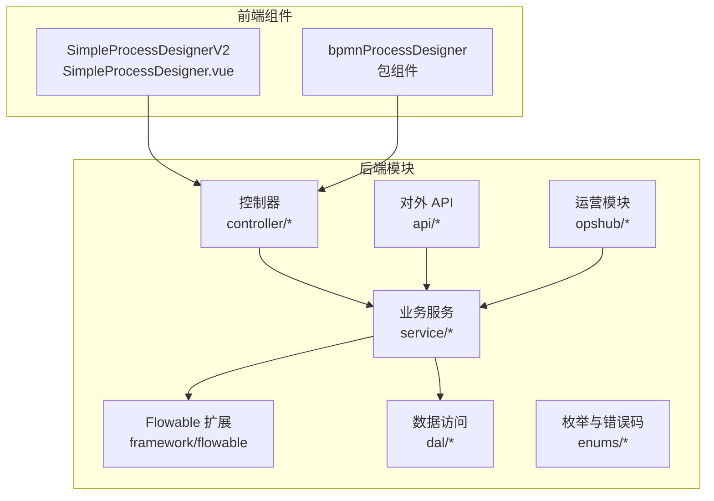

**图表来源**
- [BpmFlowableConfiguration.java](file://yudao-module-bpm/src/main/java/cn/iocoder/yudao/module/bpm/framework/flowable/config/BpmFlowableConfiguration.java)
- [BpmProcessDefinitionServiceImpl.java](file://yudao-module-bpm/src/main/java/cn/iocoder/yudao/module/bpm/service/definition/BpmProcessDefinitionServiceImpl.java)
- [SimpleProcessDesigner.vue](file://yudao-ui/yudao-ui-admin-vue3/src/components/SimpleProcessDesignerV2/src/SimpleProcessDesigner.vue)
- [ExecutorProductLineScopeService.java](file://yudao-module-opshub/src/main/java/cn/iocoder/yudao/module/opshub/service/dealer/ExecutorProductLineScopeService.java)

**章节来源**
- [BpmFlowableConfiguration.java](file://yudao-module-bpm/src/main/java/cn/iocoder/yudao/module/bpm/framework/flowable/config/BpmFlowableConfiguration.java)
- [BpmProcessDefinitionServiceImpl.java](file://yudao-module-bpm/src/main/java/cn/iocoder/yudao/module/bpm/service/definition/BpmProcessDefinitionServiceImpl.java)
- [SimpleProcessDesigner.vue](file://yudao-ui/yudao-ui-admin-vue3/src/components/SimpleProcessDesignerV2/src/SimpleProcessDesigner.vue)
- [ExecutorProductLineScopeService.java](file://yudao-module-opshub/src/main/java/cn/iocoder/yudao/module/opshub/service/dealer/ExecutorProductLineScopeService.java)

## 核心组件
- Flowable 引擎配置与扩展：通过自定义 ActivityBehaviorFactory 与行为类，扩展用户任务、并行/串行多实例、候选人策略与监听器等能力
- 流程定义与模型：提供模型创建、部署、版本控制、监听器与表达式管理
- 任务管理：任务分配、委托、转办、复制、监听与触发器
- 流程实例：启动、暂停/恢复、终止、复制与状态事件发布
- 前端设计器：支持节点拖拽、连线、属性编辑与流程图渲染
- 数据与监控：数据库脚本与 Quartz 调度集成，支撑定时与作业
- **产品线执行员分配**：新增按产品线自动分配工单执行员的能力

**章节来源**
- [BpmActivityBehaviorFactory.java](file://yudao-module-bpm/src/main/java/cn/iocoder/yudao/module/bpm/framework/flowable/core/behavior/BpmActivityBehaviorFactory.java)
- [BpmUserTaskActivityBehavior.java](file://yudao-module-bpm/src/main/java/cn/iocoder/yudao/module/bpm/framework/flowable/core/behavior/BpmUserTaskActivityBehavior.java)
- [BpmParallelMultiInstanceBehavior.java](file://yudao-module-bpm/src/main/java/cn/iocoder/yudao/module/bpm/framework/flowable/core/behavior/BpmParallelMultiInstanceBehavior.java)
- [BpmSequentialMultiInstanceBehavior.java](file://yudao-module-bpm/src/main/java/cn/iocoder/yudao/module/bpm/framework/flowable/core/behavior/BpmSequentialMultiInstanceBehavior.java)
- [BpmTaskCandidateInvoker.java](file://yudao-module-bpm/src/main/java/cn/iocoder/yudao/module/bpm/framework/flowable/core/candidate/BpmTaskCandidateInvoker.java)
- [BpmProcessInstanceEventPublisher.java](file://yudao-module-bpm/src/main/java/cn/iocoder/yudao/module/bpm/framework/flowable/core/event/BpmProcessInstanceEventPublisher.java)

## 架构总览
后端通过 Flowable 配置类加载扩展行为与监听器；业务服务封装流程定义、模型、任务与实例操作；前端通过设计器组件提交流程图，后端解析并部署至 Flowable；运行期事件由事件发布器与监听器处理，配合 Quartz 进行定时调度。

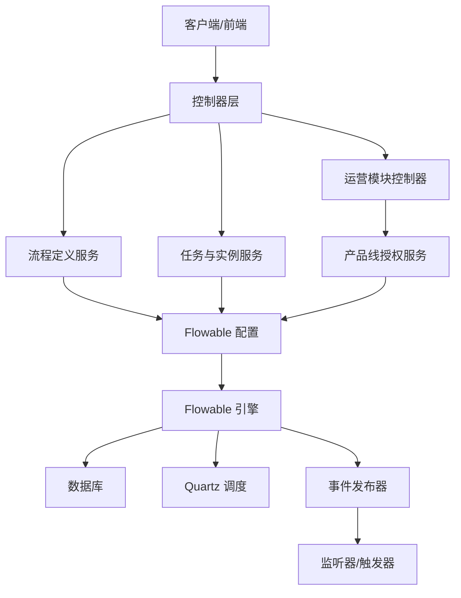

**图表来源**
- [BpmFlowableConfiguration.java](file://yudao-module-bpm/src/main/java/cn/iocoder/yudao/module/bpm/framework/flowable/config/BpmFlowableConfiguration.java)
- [BpmProcessInstanceEventPublisher.java](file://yudao-module-bpm/src/main/java/cn/iocoder/yudao/module/bpm/framework/flowable/core/event/BpmProcessInstanceEventPublisher.java)
- [quartz.sql](file://sql/mysql/quartz.sql)
- [DealerProductLineScopeController.java](file://yudao-module-opshub/src/main/java/cn/iocoder/yudao/module/opshub/controller/admin/dealer/DealerProductLineScopeController.java)

## 详细组件分析

### 流程定义与部署管理
- 模型管理：提供模型创建、更新、删除与导出，支持简单模型与复杂模型
- 流程定义：封装部署、查询、挂起/激活、版本控制与监听器配置
- 表单与表达式：集成动态表单与表达式计算，支持流程变量注入
- 用户组与分类：对流程进行分类与用户组隔离

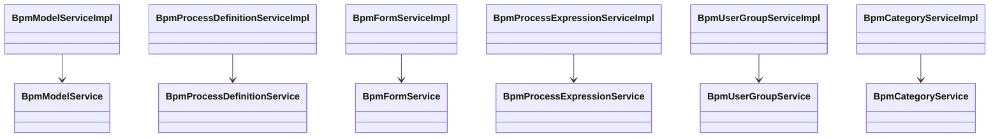

**图表来源**
- [BpmModelServiceImpl.java](file://yudao-module-bpm/src/main/java/cn/iocoder/yudao/module/bpm/service/definition/BpmModelServiceImpl.java)
- [BpmProcessDefinitionServiceImpl.java](file://yudao-module-bpm/src/main/java/cn/iocoder/yudao/module/bpm/service/definition/BpmProcessDefinitionServiceImpl.java)
- [BpmFormServiceImpl.java](file://yudao-module-bpm/src/main/java/cn/iocoder/yudao/module/bpm/service/definition/BpmFormServiceImpl.java)
- [BpmProcessExpressionServiceImpl.java](file://yudao-module-bpm/src/main/java/cn/iocoder/yudao/module/bpm/service/definition/BpmProcessExpressionServiceImpl.java)
- [BpmUserGroupServiceImpl.java](file://yudao-module-bpm/src/main/java/cn/iocoder/yudao/module/bpm/service/definition/BpmUserGroupServiceImpl.java)
- [BpmCategoryServiceImpl.java](file://yudao-module-bpm/src/main/java/cn/iocoder/yudao/module/bpm/service/definition/BpmCategoryServiceImpl.java)

**章节来源**
- [BpmModelServiceImpl.java](file://yudao-module-bpm/src/main/java/cn/iocoder/yudao/module/bpm/service/definition/BpmModelServiceImpl.java)
- [BpmProcessDefinitionServiceImpl.java](file://yudao-module-bpm/src/main/java/cn/iocoder/yudao/module/bpm/service/definition/BpmProcessDefinitionServiceImpl.java)
- [BpmFormServiceImpl.java](file://yudao-module-bpm/src/main/java/cn/iocoder/yudao/module/bpm/service/definition/BpmFormServiceImpl.java)
- [BpmProcessExpressionServiceImpl.java](file://yudao-module-bpm/src/main/java/cn/iocoder/yudao/module/bpm/service/definition/BpmProcessExpressionServiceImpl.java)
- [BpmUserGroupServiceImpl.java](file://yudao-module-bpm/src/main/java/cn/iocoder/yudao/module/bpm/service/definition/BpmUserGroupServiceImpl.java)
- [BpmCategoryServiceImpl.java](file://yudao-module-bpm/src/main/java/cn/iocoder/yudao/module/bpm/service/definition/BpmCategoryServiceImpl.java)

### 版本控制与监听器
- 版本控制：通过流程定义的版本号与部署时间实现版本管理，支持按版本查询与回滚策略
- 监听器：支持执行监听器与任务监听器，扩展流程节点事件处理逻辑
- 表达式：支持流程变量与表达式计算，驱动分支与条件判断

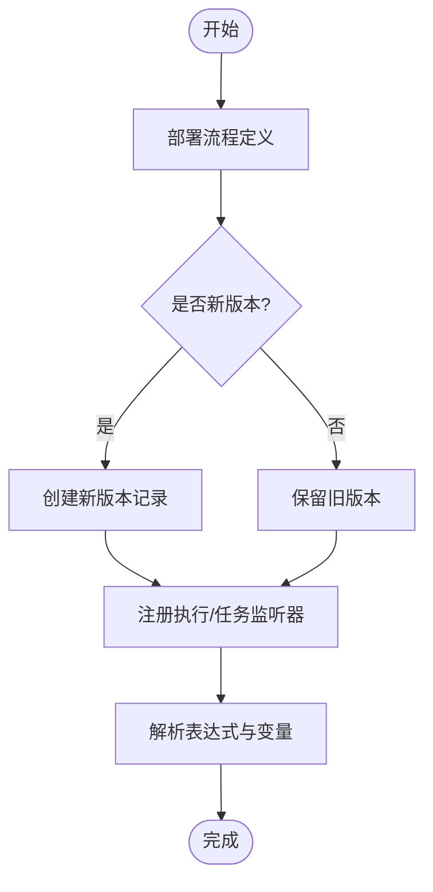

**图表来源**
- [BpmProcessDefinitionServiceImpl.java](file://yudao-module-bpm/src/main/java/cn/iocoder/yudao/module/bpm/service/definition/BpmProcessDefinitionServiceImpl.java)
- [BpmProcessListenerServiceImpl.java](file://yudao-module-bpm/src/main/java/cn/iocoder/yudao/module/bpm/service/definition/BpmProcessListenerServiceImpl.java)
- [BpmProcessExpressionServiceImpl.java](file://yudao-module-bpm/src/main/java/cn/iocoder/yudao/module/bpm/service/definition/BpmProcessExpressionServiceImpl.java)

**章节来源**
- [BpmProcessDefinitionServiceImpl.java](file://yudao-module-bpm/src/main/java/cn/iocoder/yudao/module/bpm/service/definition/BpmProcessDefinitionServiceImpl.java)
- [BpmProcessListenerServiceImpl.java](file://yudao-module-bpm/src/main/java/cn/iocoder/yudao/module/bpm/service/definition/BpmProcessListenerServiceImpl.java)
- [BpmProcessExpressionServiceImpl.java](file://yudao-module-bpm/src/main/java/cn/iocoder/yudao/module/bpm/service/definition/BpmProcessExpressionServiceImpl.java)

### 流程设计器技术架构
- 简易流程设计器：提供节点拖拽、连线、属性面板与流程图渲染
- BPMN 流程设计器：提供更完整的 BPMN 编辑能力与节点类型支持
- 设计器与后端交互：设计器生成 BPMN XML 或模型 JSON，后端解析并部署

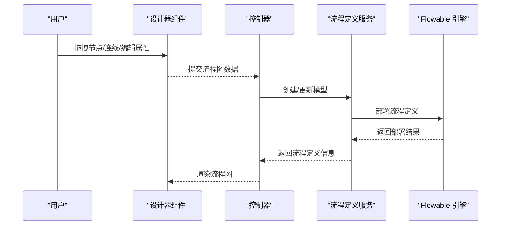

**图表来源**
- [SimpleProcessDesigner.vue](file://yudao-ui/yudao-ui-admin-vue3/src/components/SimpleProcessDesignerV2/src/SimpleProcessDesigner.vue)
- [bpmnProcessDesigner](file://yudao-ui/yudao-ui-admin-vue3/src/components/bpmnProcessDesigner/)
- [BpmModelServiceImpl.java](file://yudao-module-bpm/src/main/java/cn/iocoder/yudao/module/bpm/service/definition/BpmModelServiceImpl.java)
- [BpmProcessDefinitionServiceImpl.java](file://yudao-module-bpm/src/main/java/cn/iocoder/yudao/module/bpm/service/definition/BpmProcessDefinitionServiceImpl.java)

**章节来源**
- [SimpleProcessDesigner.vue](file://yudao-ui/yudao-ui-admin-vue3/src/components/SimpleProcessDesignerV2/src/SimpleProcessDesigner.vue)
- [bpmnProcessDesigner](file://yudao-ui/yudao-ui-admin-vue3/src/components/bpmnProcessDesigner/)

### 任务管理：分配、委托、转办与撤销
- 候选人策略：支持部门领导、发起人、岗位、角色、用户、表达式等多种策略
- **产品线执行员分配**：新增 PRODUCT_LINE_EXECUTOR 策略，支持按产品线自动分配工单执行员
- 任务监听与触发：在任务创建、删除、超时等事件触发回调或异步请求
- 任务复制与委托：支持任务复制与委托给他人处理
- 任务监听器：统一的任务事件监听与处理

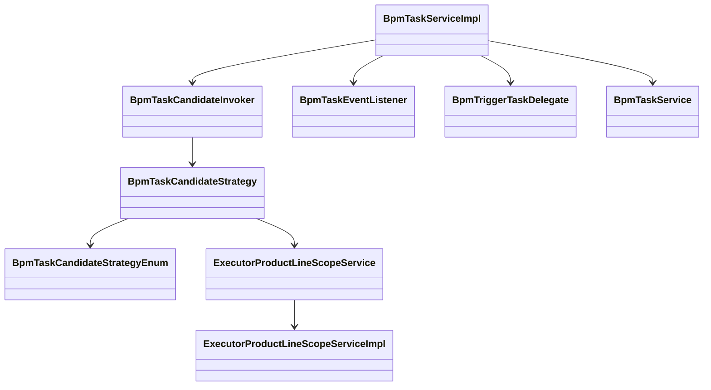

**图表来源**
- [BpmTaskCandidateInvoker.java](file://yudao-module-bpm/src/main/java/cn/iocoder/yudao/module/bpm/framework/flowable/core/candidate/BpmTaskCandidateInvoker.java)
- [BpmTaskCandidateStrategy.java](file://yudao-module-bpm/src/main/java/cn/iocoder/yudao/module/bpm/framework/flowable/core/candidate/BpmTaskCandidateStrategy.java)
- [BpmTaskCandidateStrategyEnum.java](file://yudao-module-bpm/src/main/java/cn/iocoder/yudao/module/bpm/framework/flowable/core/enums/BpmTaskCandidateStrategyEnum.java)
- [BpmTaskEventListener.java](file://yudao-module-bpm/src/main/java/cn/iocoder/yudao/module/bpm/framework/flowable/core/listener/BpmTaskEventListener.java)
- [BpmTriggerTaskDelegate.java](file://yudao-module-bpm/src/main/java/cn/iocoder/yudao/module/bpm/framework/flowable/core/listener/BpmTriggerTaskDelegate.java)
- [BpmTaskServiceImpl.java](file://yudao-module-bpm/src/main/java/cn/iocoder/yudao/module/bpm/service/task/BpmTaskServiceImpl.java)
- [ExecutorProductLineScopeService.java](file://yudao-module-opshub/src/main/java/cn/iocoder/yudao/module/opshub/service/dealer/ExecutorProductLineScopeService.java)
- [ExecutorProductLineScopeServiceImpl.java](file://yudao-module-opshub/src/main/java/cn/iocoder/yudao/module/opshub/service/dealer/impl/ExecutorProductLineScopeServiceImpl.java)

**章节来源**
- [BpmTaskCandidateInvoker.java](file://yudao-module-bpm/src/main/java/cn/iocoder/yudao/module/bpm/framework/flowable/core/candidate/BpmTaskCandidateInvoker.java)
- [BpmTaskEventListener.java](file://yudao-module-bpm/src/main/java/cn/iocoder/yudao/module/bpm/framework/flowable/core/listener/BpmTaskEventListener.java)
- [BpmTriggerTaskDelegate.java](file://yudao-module-bpm/src/main/java/cn/iocoder/yudao/module/bpm/framework/flowable/core/listener/BpmTriggerTaskDelegate.java)
- [BpmTaskServiceImpl.java](file://yudao-module-bpm/src/main/java/cn/iocoder/yudao/module/bpm/service/task/BpmTaskServiceImpl.java)
- [ExecutorProductLineScopeService.java](file://yudao-module-opshub/src/main/java/cn/iocoder/yudao/module/opshub/service/dealer/ExecutorProductLineScopeService.java)
- [ExecutorProductLineScopeServiceImpl.java](file://yudao-module-opshub/src/main/java/cn/iocoder/yudao/module/opshub/service/dealer/impl/ExecutorProductLineScopeServiceImpl.java)

### 流程实例生命周期管理
- 启动：根据流程定义与表单参数启动流程实例
- 执行：跟踪当前活动节点与历史节点
- 暂停/恢复：支持流程实例的暂停与恢复
- 终止：支持强制终止流程实例
- 复制：支持流程实例复制与重试

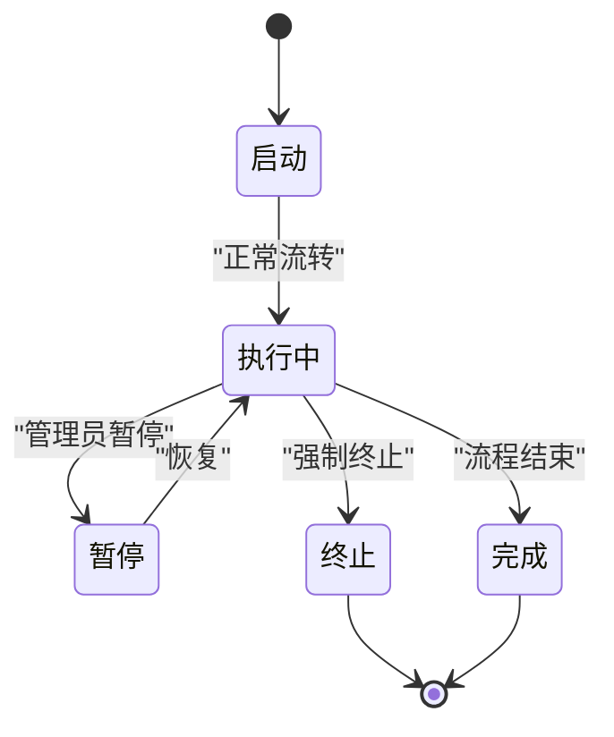

**图表来源**
- [BpmProcessInstanceServiceImpl.java](file://yudao-module-bpm/src/main/java/cn/iocoder/yudao/module/bpm/service/task/BpmProcessInstanceServiceImpl.java)
- [BpmProcessInstanceCopyServiceImpl.java](file://yudao-module-bpm/src/main/java/cn/iocoder/yudao/module/bpm/service/task/BpmProcessInstanceCopyServiceImpl.java)

**章节来源**
- [BpmProcessInstanceServiceImpl.java](file://yudao-module-bpm/src/main/java/cn/iocoder/yudao/module/bpm/service/task/BpmProcessInstanceServiceImpl.java)
- [BpmProcessInstanceCopyServiceImpl.java](file://yudao-module-bpm/src/main/java/cn/iocoder/yudao/module/bpm/service/task/BpmProcessInstanceCopyServiceImpl.java)

### 流程监控与统计分析
- 事件发布与监听：通过事件发布器与监听器捕获流程状态变化
- 任务与实例统计：基于数据库与 Quartz 统计任务完成率、平均时长等指标
- 性能指标：结合链路追踪与监控组件采集执行耗时与异常

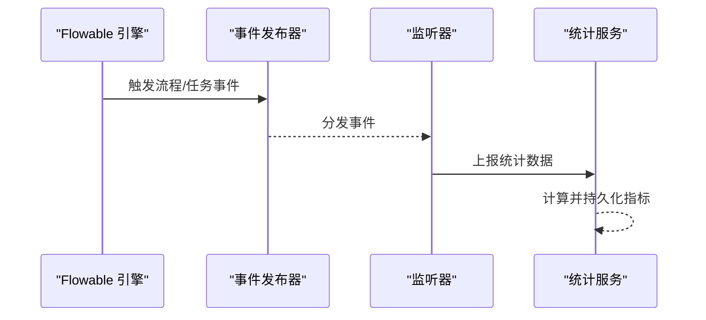

**图表来源**
- [BpmProcessInstanceEventPublisher.java](file://yudao-module-bpm/src/main/java/cn/iocoder/yudao/module/bpm/framework/flowable/core/event/BpmProcessInstanceEventPublisher.java)
- [BpmProcessInstanceEventListener.java](file://yudao-module-bpm/src/main/java/cn/iocoder/yudao/module/bpm/framework/flowable/core/listener/BpmProcessInstanceEventListener.java)

**章节来源**
- [BpmProcessInstanceEventPublisher.java](file://yudao-module-bpm/src/main/java/cn/iocoder/yudao/module/bpm/framework/flowable/core/event/BpmProcessInstanceEventPublisher.java)
- [BpmProcessInstanceEventListener.java](file://yudao-module-bpm/src/main/java/cn/iocoder/yudao/module/bpm/framework/flowable/core/listener/BpmProcessInstanceEventListener.java)

### 流程引擎配置与扩展
- 自定义行为工厂：扩展用户任务、多实例等行为
- 监听器与触发器：统一的任务与流程事件处理
- 工具类：BPMN 模型解析、HTTP 请求工具、通用工具方法

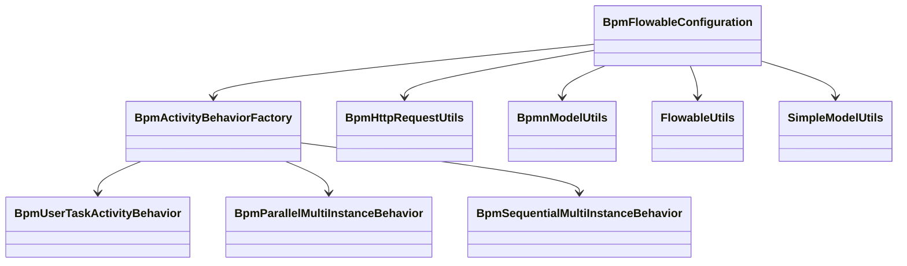

**图表来源**
- [BpmFlowableConfiguration.java](file://yudao-module-bpm/src/main/java/cn/iocoder/yudao/module/bpm/framework/flowable/config/BpmFlowableConfiguration.java)
- [BpmActivityBehaviorFactory.java](file://yudao-module-bpm/src/main/java/cn/iocoder/yudao/module/bpm/framework/flowable/core/behavior/BpmActivityBehaviorFactory.java)
- [BpmUserTaskActivityBehavior.java](file://yudao-module-bpm/src/main/java/cn/iocoder/yudao/module/bpm/framework/flowable/core/behavior/BpmUserTaskActivityBehavior.java)
- [BpmParallelMultiInstanceBehavior.java](file://yudao-module-bpm/src/main/java/cn/iocoder/yudao/module/bpm/framework/flowable/core/behavior/BpmParallelMultiInstanceBehavior.java)
- [BpmSequentialMultiInstanceBehavior.java](file://yudao-module-bpm/src/main/java/cn/iocoder/yudao/module/bpm/framework/flowable/core/behavior/BpmSequentialMultiInstanceBehavior.java)
- [BpmHttpRequestUtils.java](file://yudao-module-bpm/src/main/java/cn/iocoder/yudao/module/bpm/framework/flowable/core/util/BpmHttpRequestUtils.java)
- [BpmnModelUtils.java](file://yudao-module-bpm/src/main/java/cn/iocoder/yudao/module/bpm/framework/flowable/core/util/BpmnModelUtils.java)
- [FlowableUtils.java](file://yudao-module-bpm/src/main/java/cn/iocoder/yudao/module/bpm/framework/flowable/core/util/FlowableUtils.java)
- [SimpleModelUtils.java](file://yudao-module-bpm/src/main/java/cn/iocoder/yudao/module/bpm/framework/flowable/core/util/SimpleModelUtils.java)

**章节来源**
- [BpmFlowableConfiguration.java](file://yudao-module-bpm/src/main/java/cn/iocoder/yudao/module/bpm/framework/flowable/config/BpmFlowableConfiguration.java)
- [BpmActivityBehaviorFactory.java](file://yudao-module-bpm/src/main/java/cn/iocoder/yudao/module/bpm/framework/flowable/core/behavior/BpmActivityBehaviorFactory.java)
- [BpmHttpRequestUtils.java](file://yudao-module-bpm/src/main/java/cn/iocoder/yudao/module/bpm/framework/flowable/core/util/BpmHttpRequestUtils.java)
- [BpmnModelUtils.java](file://yudao-module-bpm/src/main/java/cn/iocoder/yudao/module/bpm/framework/flowable/core/util/BpmnModelUtils.java)
- [FlowableUtils.java](file://yudao-module-bpm/src/main/java/cn/iocoder/yudao/module/bpm/framework/flowable/core/util/FlowableUtils.java)
- [SimpleModelUtils.java](file://yudao-module-bpm/src/main/java/cn/iocoder/yudao/module/bpm/framework/flowable/core/util/SimpleModelUtils.java)

### OA 请假流程与消息通知
- OA 请假监听：监听流程状态变化，同步 OA 请假状态
- 消息通知：在流程审批通过/拒绝/任务创建/超时时发送消息

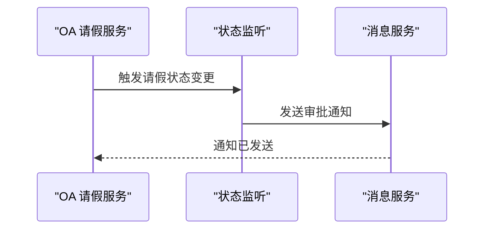

**图表来源**
- [BpmOALeaveServiceImpl.java](file://yudao-module-bpm/src/main/java/cn/iocoder/yudao/module/bpm/service/oa/BpmOALeaveServiceImpl.java)
- [BpmMessageServiceImpl.java](file://yudao-module-bpm/src/main/java/cn/iocoder/yudao/module/bpm/service/message/BpmMessageServiceImpl.java)

**章节来源**
- [BpmOALeaveServiceImpl.java](file://yudao-module-bpm/src/main/java/cn/iocoder/yudao/module/bpm/service/oa/BpmOALeaveServiceImpl.java)
- [BpmMessageServiceImpl.java](file://yudao-module-bpm/src/main/java/cn/iocoder/yudao/module/bpm/service/message/BpmMessageServiceImpl.java)

## 产品线执行员分配策略

### 策略概述
新增的 PRODUCT_LINE_EXECUTOR 策略允许根据产品线维度自动分配工单执行员，通过查询执行员-产品线授权表获取具有相应产品线权限的用户列表作为任务候选人。

### 核心实现
- **策略接口扩展**：在 BpmTaskCandidateStrategy 接口中添加产品线执行员分配逻辑
- **授权查询**：通过 ExecutorProductLineScopeService 查询用户的产品线授权范围
- **候选人计算**：基于产品线编码获取授权用户的用户ID集合

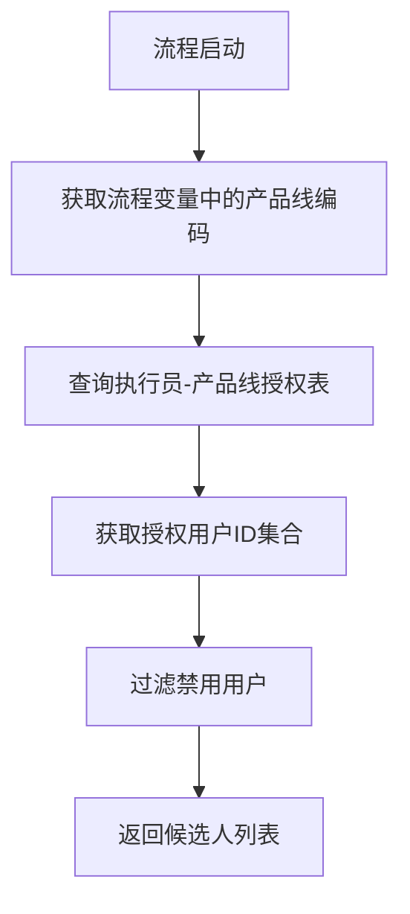

**图表来源**
- [ExecutorProductLineScopeService.java](file://yudao-module-opshub/src/main/java/cn/iocoder/yudao/module/opshub/service/dealer/ExecutorProductLineScopeService.java)
- [ExecutorProductLineScopeMapper.java](file://yudao-module-opshub/src/main/java/cn/iocoder/yudao/module/opshub/dal/mysql/dealer/ExecutorProductLineScopeMapper.java)
- [ExecutorProductLineScopeDO.java](file://yudao-module-opshub/src/main/java/cn/iocoder/yudao/module/opshub/dal/dataobject/dealer/ExecutorProductLineScopeDO.java)

### 数据模型设计
执行员-产品线授权表包含以下关键字段：
- 主键：自增ID
- 用户ID：执行员的用户标识
- 产品线编码：授权的产品线标识符
- 租户ID：多租户隔离支持
- 创建/更新时间戳：审计日志

**章节来源**
- [ExecutorProductLineScopeService.java](file://yudao-module-opshub/src/main/java/cn/iocoder/yudao/module/opshub/service/dealer/ExecutorProductLineScopeService.java)
- [ExecutorProductLineScopeServiceImpl.java](file://yudao-module-opshub/src/main/java/cn/iocoder/yudao/module/opshub/service/dealer/impl/ExecutorProductLineScopeServiceImpl.java)
- [ExecutorProductLineScopeMapper.java](file://yudao-module-opshub/src/main/java/cn/iocoder/yudao/module/opshub/dal/mysql/dealer/ExecutorProductLineScopeMapper.java)
- [ExecutorProductLineScopeDO.java](file://yudao-module-opshub/src/main/java/cn/iocoder/yudao/module/opshub/dal/dataobject/dealer/ExecutorProductLineScopeDO.java)

## 产品线授权管理

### 授权分配机制
系统提供完整的执行员-产品线授权管理功能：

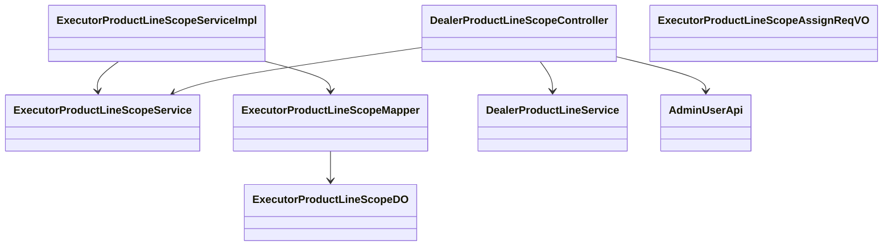

**图表来源**
- [ExecutorProductLineScopeService.java](file://yudao-module-opshub/src/main/java/cn/iocoder/yudao/module/opshub/service/dealer/ExecutorProductLineScopeService.java)
- [ExecutorProductLineScopeServiceImpl.java](file://yudao-module-opshub/src/main/java/cn/iocoder/yudao/module/opshub/service/dealer/impl/ExecutorProductLineScopeServiceImpl.java)
- [ExecutorProductLineScopeMapper.java](file://yudao-module-opshub/src/main/java/cn/iocoder/yudao/module/opshub/dal/mysql/dealer/ExecutorProductLineScopeMapper.java)
- [ExecutorProductLineScopeDO.java](file://yudao-module-opshub/src/main/java/cn/iocoder/yudao/module/opshub/dal/dataobject/dealer/ExecutorProductLineScopeDO.java)
- [DealerProductLineScopeController.java](file://yudao-module-opshub/src/main/java/cn/iocoder/yudao/module/opshub/controller/admin/dealer/DealerProductLineScopeController.java)
- [ExecutorProductLineScopeAssignReqVO.java](file://yudao-module-opshub/src/main/java/cn/iocoder/yudao/module/opshub/controller/admin/dealer/vo/ExecutorProductLineScopeAssignReqVO.java)

### 授权查询接口
- **按用户查询**：获取用户授权的所有产品线编码
- **按产品线查询**：获取产品线授权的所有执行员用户ID
- **全量查询**：获取所有有产品线授权的用户及其授权范围

### 控制器功能
管理后台提供产品线授权的完整 CRUD 操作：
- 查看用户授权的产品线列表
- 分配用户产品线授权（全量替换）
- 授权范围验证与冲突检测

**章节来源**
- [DealerProductLineScopeController.java](file://yudao-module-opshub/src/main/java/cn/iocoder/yudao/module/opshub/controller/admin/dealer/DealerProductLineScopeController.java)
- [ExecutorProductLineScopeAssignReqVO.java](file://yudao-module-opshub/src/main/java/cn/iocoder/yudao/module/opshub/controller/admin/dealer/vo/ExecutorProductLineScopeAssignReqVO.java)

## 依赖分析
- 后端依赖 Flowable 引擎与 Quartz；前端依赖设计器组件与 Vue 生态
- 数据库脚本包含 bpm 与 quartz 表结构，支撑流程与定时任务
- **新增依赖**：opshub 模块提供产品线授权数据模型与业务逻辑

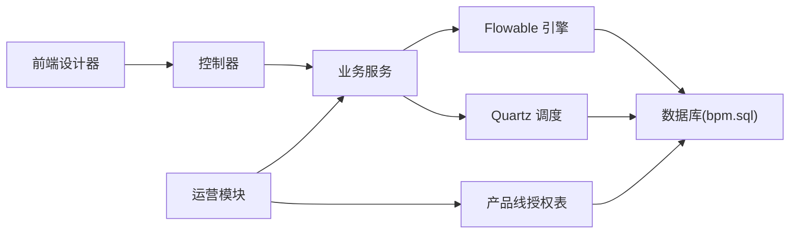

**图表来源**
- [bpm.sql](file://sql/mysql/bpm.sql)
- [quartz.sql](file://sql/mysql/quartz.sql)
- [opshub-step1.sql](file://sql/postgresql/opshub-step1.sql)

**章节来源**
- [bpm.sql](file://sql/mysql/bpm.sql)
- [quartz.sql](file://sql/mysql/quartz.sql)
- [opshub-step1.sql](file://sql/postgresql/opshub-step1.sql)

## 性能考虑
- 任务候选策略缓存：对常用策略结果进行缓存，减少重复计算
- 监听器异步化：将耗时监听器异步化，避免阻塞流程执行
- 数据库索引：为流程实例、任务与变量建立合适索引，提升查询性能
- **产品线授权缓存**：对执行员-产品线授权关系进行缓存，减少数据库查询
- 定时任务批处理：对批量任务与统计任务采用批处理策略
- 引擎配置优化：合理设置线程池大小、事务隔离级别与命令执行器

## 故障排除指南
- 流程无法启动：检查流程定义是否部署成功、监听器是否抛出异常、表单参数是否正确
- 任务无人认领：确认候选人策略配置、用户/角色/部门信息是否正确
- **产品线执行员分配失败**：检查产品线编码是否正确、执行员是否具有相应授权、授权是否启用
- 任务监听未触发：检查监听器注册与事件类型是否匹配
- 定时任务不执行：核对 Quartz 配置与数据库表结构一致性
- 设计器渲染异常：检查 BPMN 节点类型与属性配置是否符合规范

## 结论
该工作流模块以 Flowable 为核心，结合自定义行为工厂、候选人策略与监听器，构建了可扩展的流程引擎体系；前后端协同的设计器与服务层，提供了从建模到运行的完整闭环。通过合理的版本控制、任务管理与监控统计，能够满足企业级流程自动化需求。

**更新** 新增的产品线执行员分配策略进一步增强了工作流系统的业务适配能力，通过执行员-产品线授权机制实现了精细化的工单分配管理，为企业多产品线运营提供了强有力的技术支撑。

## 附录
- 数据库脚本位置参考：[bpm.sql](file://sql/mysql/bpm.sql)、[quartz.sql](file://sql/mysql/quartz.sql)、[opshub-step1.sql](file://sql/postgresql/opshub-step1.sql)
- DM 数据库 Flowable 补丁：[AbstractEngineConfiguration.java](file://sql/dm/flowable-patch/src/main/java/org/flowable/common/engine/impl/AbstractEngineConfiguration.java)
- 产品线授权数据模型：ExecutorProductLineScopeDO、ExecutorProductLineScopeMapper
- 授权管理接口：ExecutorProductLineScopeService、DealerProductLineScopeController