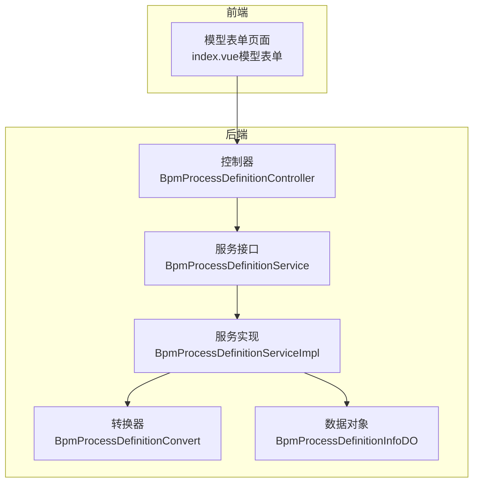
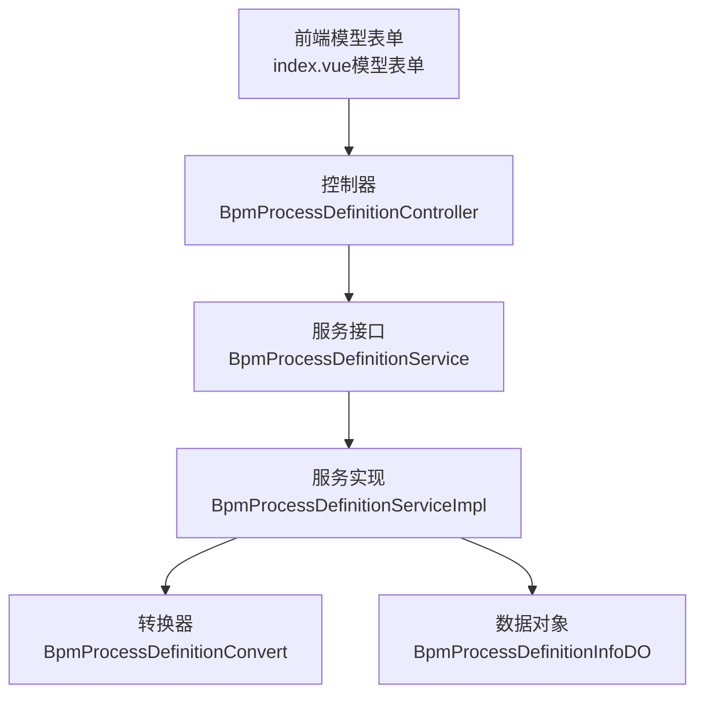
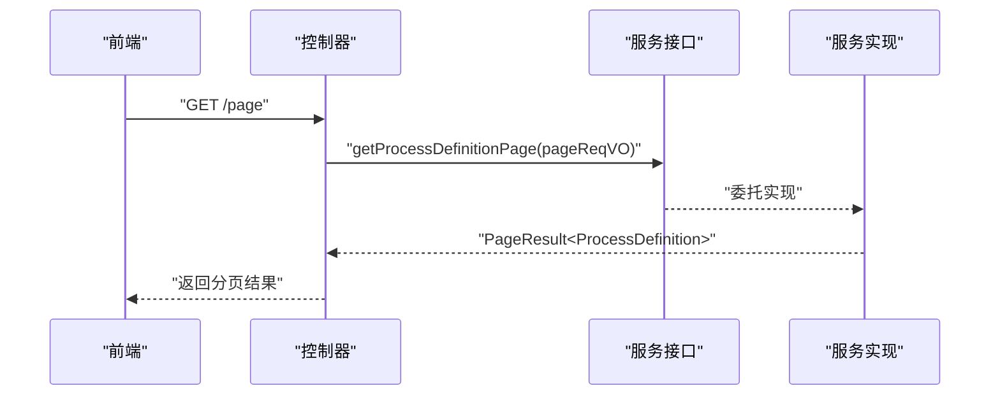
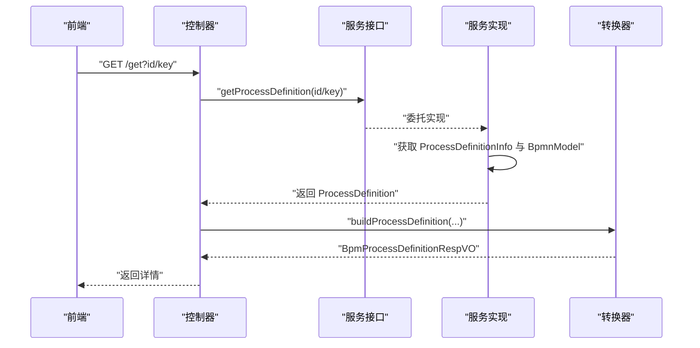
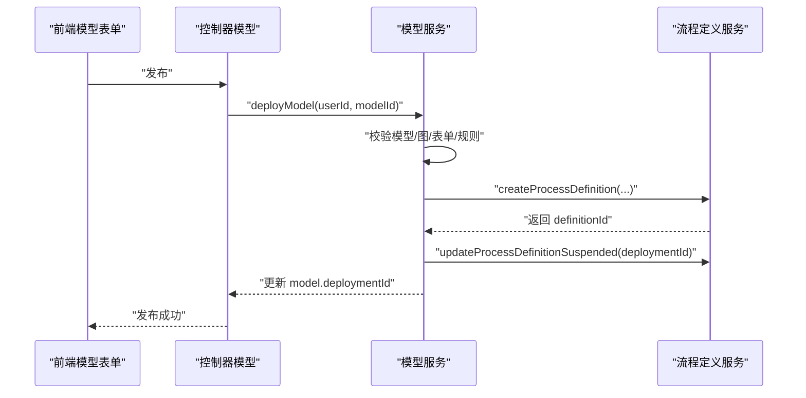
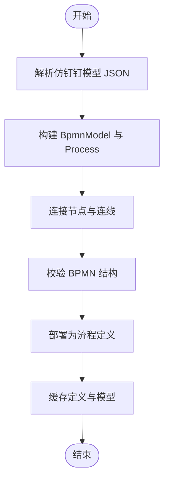
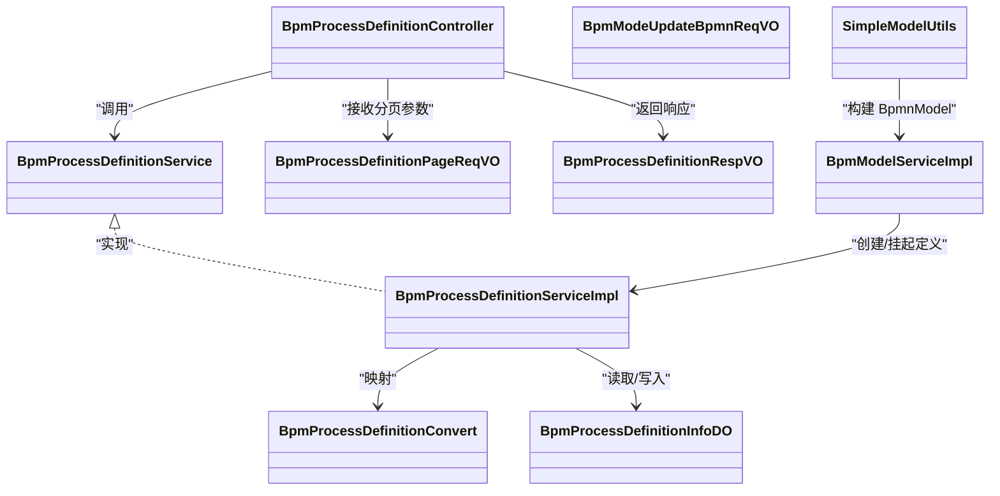

# 流程定义管理

<cite>
**本文引用的文件**
- [BpmProcessDefinitionController.java](file://yudao-module-bpm/src/main/java/cn/iocoder/yudao/module/bpm/controller/admin/definition/BpmProcessDefinitionController.java)
- [BpmProcessDefinitionService.java](file://yudao-module-bpm/src/main/java/cn/iocoder/yudao/module/bpm/service/definition/BpmProcessDefinitionService.java)
- [BpmProcessDefinitionServiceImpl.java](file://yudao-module-bpm/src/main/java/cn/iocoder/yudao/module/bpm/service/definition/BpmProcessDefinitionServiceImpl.java)
- [BpmProcessDefinitionConvert.java](file://yudao-module-bpm/src/main/java/cn/iocoder/yudao/module/bpm/convert/definition/BpmProcessDefinitionConvert.java)
- [BpmProcessDefinitionPageReqVO.java](file://yudao-module-bpm/src/main/java/cn/iocoder/yudao/module/bpm/controller/admin/definition/vo/process/BpmProcessDefinitionPageReqVO.java)
- [BpmProcessDefinitionRespVO.java](file://yudao-module-bpm/src/main/java/cn/iocoder/yudao/module/bpm/controller/admin/definition/vo/process/BpmProcessDefinitionRespVO.java)
- [BpmModeUpdateBpmnReqVO.java](file://yudao-module-bpm/src/main/java/cn/iocoder/yudao/module/bpm/controller/admin/definition/vo/model/BpmModeUpdateBpmnReqVO.java)
- [BpmModelServiceImpl.java](file://yudao-module-bpm/src/main/java/cn/iocoder/yudao/module/bpm/service/definition/BpmModelServiceImpl.java)
- [SimpleModelUtils.java](file://yudao-module-bpm/src/main/java/cn/iocoder/yudao/module/bpm/framework/flowable/core/util/SimpleModelUtils.java)
- [BpmProcessDefinitionInfoDO.java](file://yudao-module-bpm/src/main/java/cn/iocoder/yudao/module/bpm/dal/dataobject/definition/BpmProcessDefinitionInfoDO.java)
- [index.vue（模型表单）](file://yudao-ui/yudao-ui-admin-vue3/src/views/bpm/model/form/index.vue)
</cite>

## 目录
1. [引言](#引言)
2. [项目结构](#项目结构)
3. [核心组件](#核心组件)
4. [架构总览](#架构总览)
5. [详细组件分析](#详细组件分析)
6. [依赖关系分析](#依赖关系分析)
7. [性能考虑](#性能考虑)
8. [故障排查指南](#故障排查指南)
9. [结论](#结论)
10. [附录](#附录)

## 引言
本技术文档围绕“流程定义管理”主题，系统梳理了流程定义的创建、编辑、部署与版本控制机制；阐明流程定义的数据结构、BPMN 模型转换与缓存策略；解释查询、分页与搜索能力；说明流程定义与流程模型的关系及激活/挂起状态管理；给出导入导出的技术实现思路与兼容性处理建议；并覆盖权限控制、审计日志与性能优化策略。文档面向开发与运维人员，兼顾可读性与工程落地。

## 项目结构
后端采用模块化组织，流程定义相关能力集中在 bpm 模块中，前端在 yudao-ui 中提供模型与流程定义的可视化界面。关键目录与文件如下：
- 控制层：BpmProcessDefinitionController 提供流程定义的查询、详情等接口
- 服务层：BpmProcessDefinitionService 及其实现负责业务编排与调用 Flowable
- 转换层：BpmProcessDefinitionConvert 负责将 Flowable 对象映射为 VO
- 数据对象：BpmProcessDefinitionInfoDO 描述流程定义扩展信息
- 前端：模型表单页面支持流程模型的保存、发布与部署

图表来源
- [BpmProcessDefinitionController.java:1-133](file://yudao-module-bpm/src/main/java/cn/iocoder/yudao/module/bpm/controller/admin/definition/BpmProcessDefinitionController.java#L1-L133)
- [BpmProcessDefinitionService.java:1-181](file://yudao-module-bpm/src/main/java/cn/iocoder/yudao/module/bpm/service/definition/BpmProcessDefinitionService.java#L1-L181)
- [BpmProcessDefinitionServiceImpl.java](file://yudao-module-bpm/src/main/java/cn/iocoder/yudao/module/bpm/service/definition/BpmProcessDefinitionServiceImpl.java)
- [BpmProcessDefinitionConvert.java:1-34](file://yudao-module-bpm/src/main/java/cn/iocoder/yudao/module/bpm/convert/definition/BpmProcessDefinitionConvert.java#L1-L34)
- [BpmProcessDefinitionInfoDO.java](file://yudao-module-bpm/src/main/java/cn/iocoder/yudao/module/bpm/dal/dataobject/definition/BpmProcessDefinitionInfoDO.java)
- [index.vue（模型表单）:1-400](file://yudao-ui/yudao-ui-admin-vue3/src/views/bpm/model/form/index.vue#L1-L400)

章节来源
- [BpmProcessDefinitionController.java:1-133](file://yudao-module-bpm/src/main/java/cn/iocoder/yudao/module/bpm/controller/admin/definition/BpmProcessDefinitionController.java#L1-L133)
- [BpmProcessDefinitionService.java:1-181](file://yudao-module-bpm/src/main/java/cn/iocoder/yudao/module/bpm/service/definition/BpmProcessDefinitionService.java#L1-L181)
- [BpmProcessDefinitionServiceImpl.java](file://yudao-module-bpm/src/main/java/cn/iocoder/yudao/module/bpm/service/definition/BpmProcessDefinitionServiceImpl.java)
- [BpmProcessDefinitionConvert.java:1-34](file://yudao-module-bpm/src/main/java/cn/iocoder/yudao/module/bpm/convert/definition/BpmProcessDefinitionConvert.java#L1-L34)
- [BpmProcessDefinitionInfoDO.java](file://yudao-module-bpm/src/main/java/cn/iocoder/yudao/module/bpm/dal/dataobject/definition/BpmProcessDefinitionInfoDO.java)
- [index.vue（模型表单）:1-400](file://yudao-ui/yudao-ui-admin-vue3/src/views/bpm/model/form/index.vue#L1-L400)

## 核心组件
- 控制器：提供流程定义分页、详情查询等接口，封装返回值与参数校验
- 服务接口与实现：抽象流程定义分页、查询、部署、挂起/激活等能力，并与 Flowable 引擎交互
- 转换器：将 Flowable 的 ProcessDefinition、Deployment、BpmnModel 等对象映射为响应 VO
- 数据对象：承载流程定义扩展信息（如分类、表单、版本等）
- 前端模型表单：支持流程模型的保存、校验与发布，触发后端部署流程

章节来源
- [BpmProcessDefinitionController.java:1-133](file://yudao-module-bpm/src/main/java/cn/iocoder/yudao/module/bpm/controller/admin/definition/BpmProcessDefinitionController.java#L1-L133)
- [BpmProcessDefinitionService.java:1-181](file://yudao-module-bpm/src/main/java/cn/iocoder/yudao/module/bpm/service/definition/BpmProcessDefinitionService.java#L1-L181)
- [BpmProcessDefinitionServiceImpl.java](file://yudao-module-bpm/src/main/java/cn/iocoder/yudao/module/bpm/service/definition/BpmProcessDefinitionServiceImpl.java)
- [BpmProcessDefinitionConvert.java:1-34](file://yudao-module-bpm/src/main/java/cn/iocoder/yudao/module/bpm/convert/definition/BpmProcessDefinitionConvert.java#L1-L34)
- [BpmProcessDefinitionInfoDO.java](file://yudao-module-bpm/src/main/java/cn/iocoder/yudao/module/bpm/dal/dataobject/definition/BpmProcessDefinitionInfoDO.java)
- [index.vue（模型表单）:1-400](file://yudao-ui/yudao-ui-admin-vue3/src/views/bpm/model/form/index.vue#L1-L400)

## 架构总览
后端以“控制器-服务-转换-持久化/引擎”的层次化架构组织，前端通过模型表单页面驱动流程模型的保存与发布，最终由服务层完成流程定义的创建与部署。

图表来源
- [BpmProcessDefinitionController.java:1-133](file://yudao-module-bpm/src/main/java/cn/iocoder/yudao/module/bpm/controller/admin/definition/BpmProcessDefinitionController.java#L1-L133)
- [BpmProcessDefinitionService.java:1-181](file://yudao-module-bpm/src/main/java/cn/iocoder/yudao/module/bpm/service/definition/BpmProcessDefinitionService.java#L1-L181)
- [BpmProcessDefinitionServiceImpl.java](file://yudao-module-bpm/src/main/java/cn/iocoder/yudao/module/bpm/service/definition/BpmProcessDefinitionServiceImpl.java)
- [BpmProcessDefinitionConvert.java:1-34](file://yudao-module-bpm/src/main/java/cn/iocoder/yudao/module/bpm/convert/definition/BpmProcessDefinitionConvert.java#L1-L34)
- [BpmProcessDefinitionInfoDO.java](file://yudao-module-bpm/src/main/java/cn/iocoder/yudao/module/bpm/dal/dataobject/definition/BpmProcessDefinitionInfoDO.java)
- [index.vue（模型表单）:1-400](file://yudao-ui/yudao-ui-admin-vue3/src/views/bpm/model/form/index.vue#L1-L400)

## 详细组件分析

### 组件一：流程定义查询与分页
- 分页请求对象：包含分页参数与标识字段，用于精准匹配 key
- 控制器方法：提供分页查询与详情查询，支持按 id 或 key 查询
- 服务层：提供分页与列表查询能力，支持按挂起状态过滤

图表来源
- [BpmProcessDefinitionController.java:1-133](file://yudao-module-bpm/src/main/java/cn/iocoder/yudao/module/bpm/controller/admin/definition/BpmProcessDefinitionController.java#L1-L133)
- [BpmProcessDefinitionService.java:1-181](file://yudao-module-bpm/src/main/java/cn/iocoder/yudao/module/bpm/service/definition/BpmProcessDefinitionService.java#L1-L181)

章节来源
- [BpmProcessDefinitionPageReqVO.java:1-16](file://yudao-module-bpm/src/main/java/cn/iocoder/yudao/module/bpm/controller/admin/definition/vo/process/BpmProcessDefinitionPageReqVO.java#L1-L16)
- [BpmProcessDefinitionController.java:1-133](file://yudao-module-bpm/src/main/java/cn/iocoder/yudao/module/bpm/controller/admin/definition/BpmProcessDefinitionController.java#L1-L133)
- [BpmProcessDefinitionService.java:1-181](file://yudao-module-bpm/src/main/java/cn/iocoder/yudao/module/bpm/service/definition/BpmProcessDefinitionService.java#L1-L181)

### 组件二：流程定义详情与模型映射
- 控制器详情接口：支持按 id 或 key 获取流程定义，并加载其 BPMN 模型与扩展信息
- 转换器：将 Flowable 对象与扩展信息映射为统一的响应 VO，便于前端展示

图表来源
- [BpmProcessDefinitionController.java:115-131](file://yudao-module-bpm/src/main/java/cn/iocoder/yudao/module/bpm/controller/admin/definition/BpmProcessDefinitionController.java#L115-L131)
- [BpmProcessDefinitionConvert.java:1-34](file://yudao-module-bpm/src/main/java/cn/iocoder/yudao/module/bpm/convert/definition/BpmProcessDefinitionConvert.java#L1-L34)

章节来源
- [BpmProcessDefinitionController.java:115-131](file://yudao-module-bpm/src/main/java/cn/iocoder/yudao/module/bpm/controller/admin/definition/BpmProcessDefinitionController.java#L115-L131)
- [BpmProcessDefinitionConvert.java:1-34](file://yudao-module-bpm/src/main/java/cn/iocoder/yudao/module/bpm/convert/definition/BpmProcessDefinitionConvert.java#L1-L34)

### 组件三：流程定义创建与部署（模型到定义）
- 前端模型表单：支持保存模型、校验并发布
- 服务层部署流程：校验模型、BPMN XML、表单配置与任务分配规则，创建流程定义，挂起旧版本，更新模型关联的部署 ID

图表来源
- [index.vue（模型表单）:352-384](file://yudao-ui/yudao-ui-admin-vue3/src/views/bpm/model/form/index.vue#L352-L384)
- [BpmModelServiceImpl.java:213-240](file://yudao-module-bpm/src/main/java/cn/iocoder/yudao/module/bpm/service/definition/BpmModelServiceImpl.java#L213-L240)

章节来源
- [index.vue（模型表单）:352-384](file://yudao-ui/yudao-ui-admin-vue3/src/views/bpm/model/form/index.vue#L352-L384)
- [BpmModelServiceImpl.java:213-240](file://yudao-module-bpm/src/main/java/cn/iocoder/yudao/module/bpm/service/definition/BpmModelServiceImpl.java#L213-L240)

### 组件四：BPMN 模型转换与缓存策略
- BPMN 模型转换：从仿钉钉流程设计模型 JSON 构建 BpmnModel，生成流程定义
- 缓存策略：结合 Flowable 引擎的缓存与本地缓存（如按部署 ID、定义 ID 缓存），减少重复解析与查询开销

图表来源
- [SimpleModelUtils.java:52-74](file://yudao-module-bpm/src/main/java/cn/iocoder/yudao/module/bpm/framework/flowable/core/util/SimpleModelUtils.java#L52-L74)

章节来源
- [SimpleModelUtils.java:52-74](file://yudao-module-bpm/src/main/java/cn/iocoder/yudao/module/bpm/framework/flowable/core/util/SimpleModelUtils.java#L52-L74)

### 组件五：流程定义与流程模型的关系
- 关系说明：流程模型是流程定义的“设计态”，流程定义是“运行态”。模型发布后生成流程定义，同一模型可多次发布形成版本演进
- 版本控制：新版本部署时挂起旧版本，确保仅最新版本可发起流程

章节来源
- [BpmModelServiceImpl.java:213-240](file://yudao-module-bpm/src/main/java/cn/iocoder/yudao/module/bpm/service/definition/BpmModelServiceImpl.java#L213-L240)

### 组件六：激活/挂起状态管理
- 通过服务层对指定部署 ID 的流程定义执行挂起/激活操作，保证运行期只允许最新版本发起流程
- 控制器层可基于状态进行筛选或批量操作（视具体实现）

章节来源
- [BpmModelServiceImpl.java:233-234](file://yudao-module-bpm/src/main/java/cn/iocoder/yudao/module/bpm/service/definition/BpmModelServiceImpl.java#L233-L234)

### 组件七：导入导出与格式兼容
- 导入：支持 BPMN XML 导入，前端通过更新 BPMN 请求 VO 提交 XML 内容，后端解析并校验
- 导出：可将流程定义导出为 BPMN XML，便于跨系统迁移与备份
- 兼容性：在解析与转换过程中进行结构校验与命名空间设置，避免解析异常

章节来源
- [BpmModeUpdateBpmnReqVO.java:1-19](file://yudao-module-bpm/src/main/java/cn/iocoder/yudao/module/bpm/controller/admin/definition/vo/model/BpmModeUpdateBpmnReqVO.java#L1-L19)
- [SimpleModelUtils.java:65-74](file://yudao-module-bpm/src/main/java/cn/iocoder/yudao/module/bpm/framework/flowable/core/util/SimpleModelUtils.java#L65-L74)

## 依赖关系分析
- 控制器依赖服务接口；服务实现依赖 Flowable 引擎与转换器；转换器依赖 VO 与工具类；数据对象承载扩展信息
- 前端模型表单依赖控制器接口，驱动保存与发布动作

图表来源
- [BpmProcessDefinitionController.java:1-133](file://yudao-module-bpm/src/main/java/cn/iocoder/yudao/module/bpm/controller/admin/definition/BpmProcessDefinitionController.java#L1-L133)
- [BpmProcessDefinitionService.java:1-181](file://yudao-module-bpm/src/main/java/cn/iocoder/yudao/module/bpm/service/definition/BpmProcessDefinitionService.java#L1-L181)
- [BpmProcessDefinitionServiceImpl.java](file://yudao-module-bpm/src/main/java/cn/iocoder/yudao/module/bpm/service/definition/BpmProcessDefinitionServiceImpl.java)
- [BpmProcessDefinitionConvert.java:1-34](file://yudao-module-bpm/src/main/java/cn/iocoder/yudao/module/bpm/convert/definition/BpmProcessDefinitionConvert.java#L1-L34)
- [BpmProcessDefinitionInfoDO.java](file://yudao-module-bpm/src/main/java/cn/iocoder/yudao/module/bpm/dal/dataobject/definition/BpmProcessDefinitionInfoDO.java)
- [BpmProcessDefinitionPageReqVO.java:1-16](file://yudao-module-bpm/src/main/java/cn/iocoder/yudao/module/bpm/controller/admin/definition/vo/process/BpmProcessDefinitionPageReqVO.java#L1-L16)
- [BpmProcessDefinitionRespVO.java:1-35](file://yudao-module-bpm/src/main/java/cn/iocoder/yudao/module/bpm/controller/admin/definition/vo/process/BpmProcessDefinitionRespVO.java#L1-L35)
- [BpmModeUpdateBpmnReqVO.java:1-19](file://yudao-module-bpm/src/main/java/cn/iocoder/yudao/module/bpm/controller/admin/definition/vo/model/BpmModeUpdateBpmnReqVO.java#L1-L19)
- [BpmModelServiceImpl.java:213-240](file://yudao-module-bpm/src/main/java/cn/iocoder/yudao/module/bpm/service/definition/BpmModelServiceImpl.java#L213-L240)
- [SimpleModelUtils.java:52-74](file://yudao-module-bpm/src/main/java/cn/iocoder/yudao/module/bpm/framework/flowable/core/util/SimpleModelUtils.java#L52-L74)

章节来源
- [BpmProcessDefinitionController.java:1-133](file://yudao-module-bpm/src/main/java/cn/iocoder/yudao/module/bpm/controller/admin/definition/BpmProcessDefinitionController.java#L1-L133)
- [BpmProcessDefinitionService.java:1-181](file://yudao-module-bpm/src/main/java/cn/iocoder/yudao/module/bpm/service/definition/BpmProcessDefinitionService.java#L1-L181)
- [BpmProcessDefinitionServiceImpl.java](file://yudao-module-bpm/src/main/java/cn/iocoder/yudao/module/bpm/service/definition/BpmProcessDefinitionServiceImpl.java)
- [BpmProcessDefinitionConvert.java:1-34](file://yudao-module-bpm/src/main/java/cn/iocoder/yudao/module/bpm/convert/definition/BpmProcessDefinitionConvert.java#L1-L34)
- [BpmProcessDefinitionInfoDO.java](file://yudao-module-bpm/src/main/java/cn/iocoder/yudao/module/bpm/dal/dataobject/definition/BpmProcessDefinitionInfoDO.java)
- [BpmProcessDefinitionPageReqVO.java:1-16](file://yudao-module-bpm/src/main/java/cn/iocoder/yudao/module/bpm/controller/admin/definition/vo/process/BpmProcessDefinitionPageReqVO.java#L1-L16)
- [BpmProcessDefinitionRespVO.java:1-35](file://yudao-module-bpm/src/main/java/cn/iocoder/yudao/module/bpm/controller/admin/definition/vo/process/BpmProcessDefinitionRespVO.java#L1-L35)
- [BpmModeUpdateBpmnReqVO.java:1-19](file://yudao-module-bpm/src/main/java/cn/iocoder/yudao/module/bpm/controller/admin/definition/vo/model/BpmModeUpdateBpmnReqVO.java#L1-L19)
- [BpmModelServiceImpl.java:213-240](file://yudao-module-bpm/src/main/java/cn/iocoder/yudao/module/bpm/service/definition/BpmModelServiceImpl.java#L213-L240)
- [SimpleModelUtils.java:52-74](file://yudao-module-bpm/src/main/java/cn/iocoder/yudao/module/bpm/framework/flowable/core/util/SimpleModelUtils.java#L52-L74)

## 性能考虑
- 批量查询与分页：服务层提供分页与列表查询，前端按需加载，避免一次性拉取过多数据
- 缓存策略：对常用流程定义与模型进行缓存，降低重复解析与查询成本
- 并发控制：部署流程时使用事务，确保模型与定义的一致性
- IO 优化：BPMN 解析与校验尽量在内存中完成，减少磁盘 IO

## 故障排查指南
- 发布失败：检查模型校验、BPMN XML 合法性、表单配置与任务分配规则
- 查询无结果：确认 key 是否正确、是否存在激活的流程定义
- 挂起状态异常：确认部署 ID 与挂起/激活操作是否正确执行

章节来源
- [BpmModelServiceImpl.java:213-240](file://yudao-module-bpm/src/main/java/cn/iocoder/yudao/module/bpm/service/definition/BpmModelServiceImpl.java#L213-L240)
- [BpmProcessDefinitionController.java:115-131](file://yudao-module-bpm/src/main/java/cn/iocoder/yudao/module/bpm/controller/admin/definition/BpmProcessDefinitionController.java#L115-L131)

## 结论
流程定义管理在本项目中通过清晰的分层架构与前后端协同，实现了从模型设计到定义部署、版本控制与状态管理的完整闭环。通过合理的数据结构、BPMN 模型转换与缓存策略，以及完善的查询与权限控制，系统具备良好的可维护性与扩展性。后续可在审计日志与更细粒度的权限控制方面进一步完善。

## 附录
- 数据模型概览（简化）
  - 流程定义扩展信息：包含分类、表单、版本等字段
  - 流程定义响应 VO：统一输出流程定义的基础信息与模型元数据

章节来源
- [BpmProcessDefinitionInfoDO.java](file://yudao-module-bpm/src/main/java/cn/iocoder/yudao/module/bpm/dal/dataobject/definition/BpmProcessDefinitionInfoDO.java)
- [BpmProcessDefinitionRespVO.java:1-35](file://yudao-module-bpm/src/main/java/cn/iocoder/yudao/module/bpm/controller/admin/definition/vo/process/BpmProcessDefinitionRespVO.java#L1-L35)