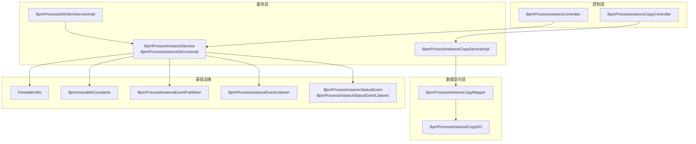
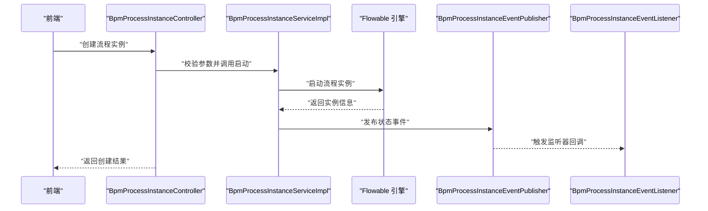
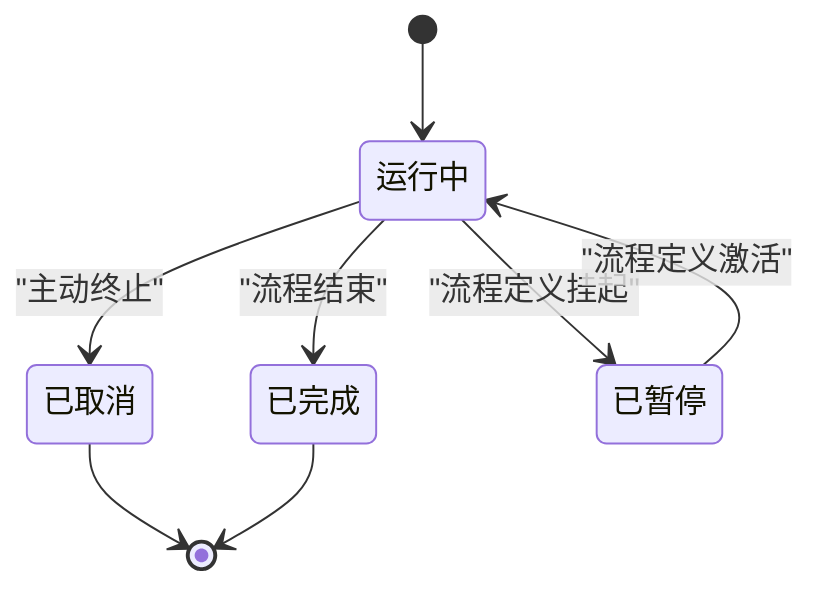
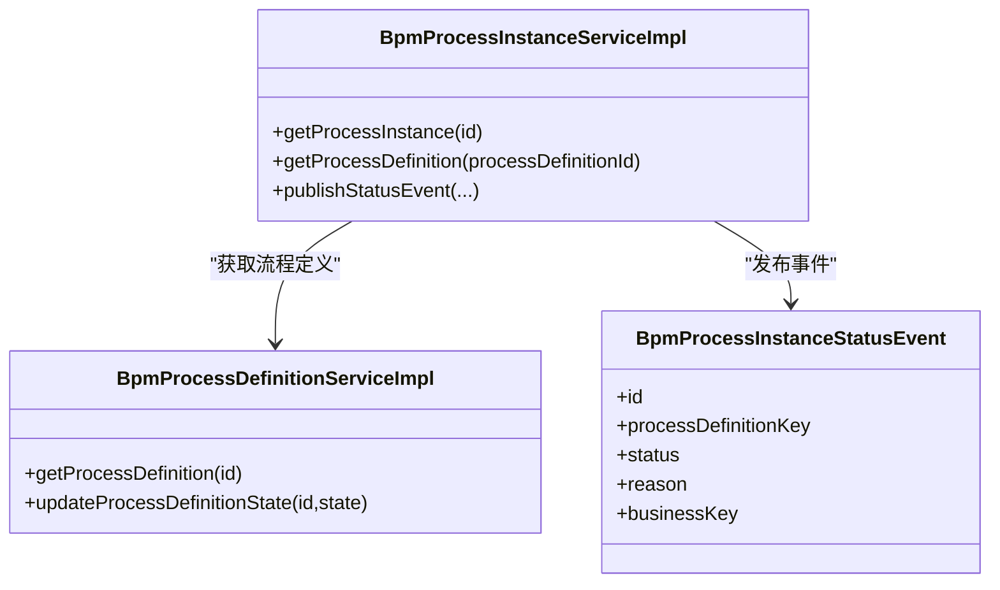
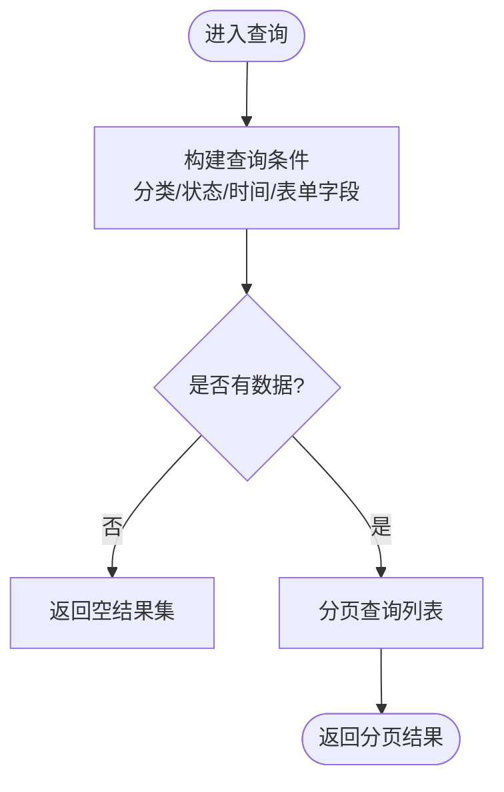
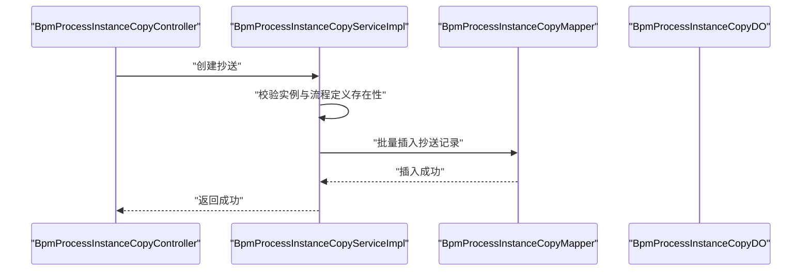
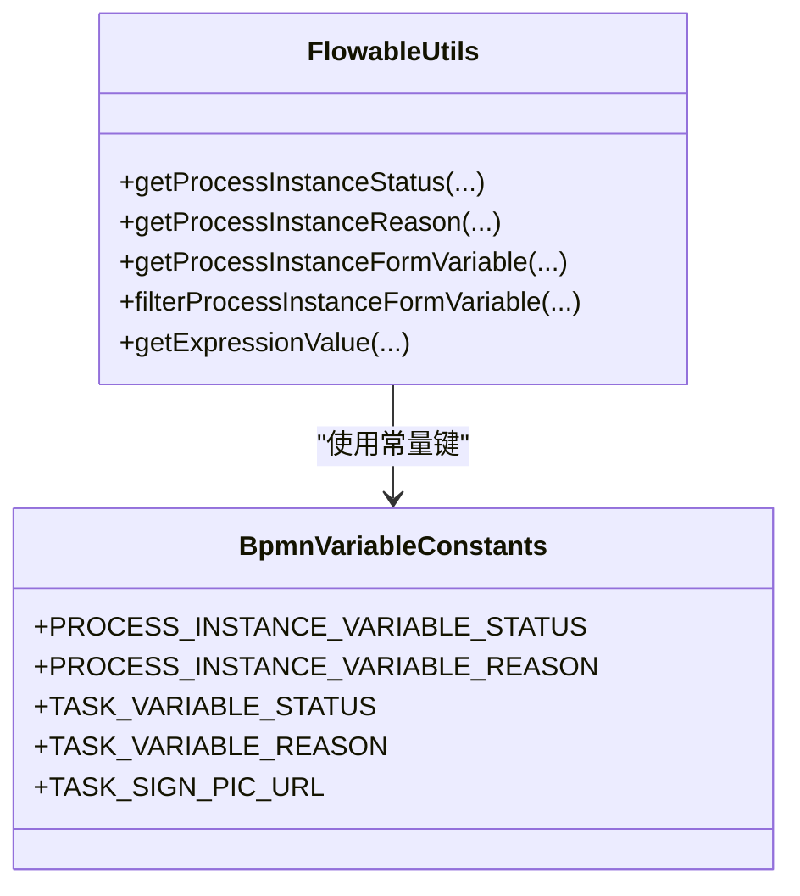
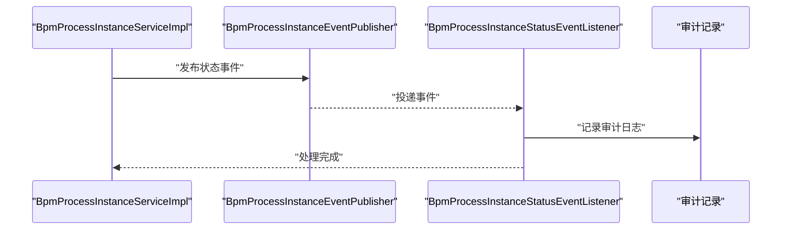
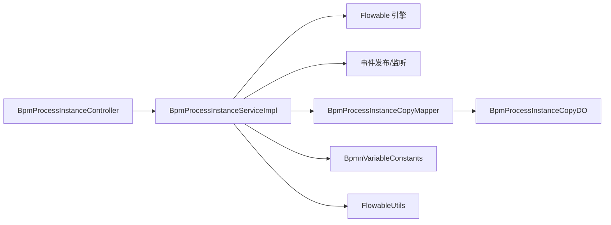

# 流程实例管理

<cite>
**本文引用的文件**
- [BpmProcessInstanceServiceImpl.java](file://yudao-module-bpm/src/main/java/cn/iocoder/yudao/module/bpm/service/task/BpmProcessInstanceServiceImpl.java)
- [BpmProcessInstanceService.java](file://yudao-module-bpm/src/main/java/cn/iocoder/yudao/module/bpm/service/task/BpmProcessInstanceService.java)
- [BpmProcessInstanceController.java](file://yudao-module-bpm/src/main/java/cn/iocoder/yudao/module/bpm/controller/admin/task/BpmProcessInstanceController.java)
- [BpmProcessInstanceApiImpl.java](file://yudao-module-bpm/src/main/java/cn/iocoder/yudao/module/bpm/api/task/BpmProcessInstanceApiImpl.java)
- [BpmProcessInstanceApi.java](file://yudao-module-bpm/src/main/java/cn/iocoder/yudao/module/bpm/api/task/BpmProcessInstanceApi.java)
- [BpmProcessInstanceStatusEvent.java](file://yudao-module-bpm/src/main/java/cn/iocoder/yudao/module/bpm/api/event/BpmProcessInstanceStatusEvent.java)
- [BpmProcessInstanceStatusEventListener.java](file://yudao-module-bpm/src/main/java/cn/iocoder/yudao/module/bpm/api/event/BpmProcessInstanceStatusEventListener.java)
- [BpmProcessInstanceEventPublisher.java](file://yudao-module-bpm/src/main/java/cn/iocoder/yudao/module/bpm/framework/flowable/core/event/BpmProcessInstanceEventPublisher.java)
- [BpmProcessInstanceEventListener.java](file://yudao-module-bpm/src/main/java/cn/iocoder/yudao/module/bpm/framework/flowable/core/listener/BpmProcessInstanceEventListener.java)
- [FlowableUtils.java](file://yudao-module-bpm/src/main/java/cn/iocoder/yudao/module/bpm/framework/flowable/core/util/FlowableUtils.java)
- [BpmnVariableConstants.java](file://yudao-module-bpm/src/main/java/cn/iocoder/yudao/module/bpm/framework/flowable/core/enums/BpmnVariableConstants.java)
- [BpmProcessInstanceCopyServiceImpl.java](file://yudao-module-bpm/src/main/java/cn/iocoder/yudao/module/bpm/service/task/BpmProcessInstanceCopyServiceImpl.java)
- [BpmProcessInstanceCopyMapper.java](file://yudao-module-bpm/src/main/java/cn/iocoder/yudao/module/bpm/dal/mysql/task/BpmProcessInstanceCopyMapper.java)
- [BpmProcessInstanceCopyDO.java](file://yudao-module-bpm/src/main/java/cn/iocoder/yudao/module/bpm/dal/dataobject/task/BpmProcessInstanceCopyDO.java)
- [BpmProcessInstanceCopyController.java](file://yudao-module-bpm/src/main/java/cn/iocoder/yudao/module/bpm/controller/admin/task/BpmProcessInstanceCopyController.java)
- [BpmProcessInstanceCopyPageReqVO.java](file://yudao-module-bpm/src/main/java/cn/iocoder/yudao/module/bpm/controller/admin/task/vo/instance/BpmProcessInstanceCopyPageReqVO.java)
- [BpmProcessInstancePageReqVO.java](file://yudao-module-bpm/src/main/java/cn/iocoder/yudao/module/bpm/controller/admin/task/vo/instance/BpmProcessInstancePageReqVO.java)
- [BpmProcessInstanceCreateReqVO.java](file://yudao-module-bpm/src/main/java/cn/iocoder/yudao/module/bpm/controller/admin/task/vo/instance/BpmProcessInstanceCreateReqVO.java)
- [BpmProcessInstanceCancelReqVO.java](file://yudao-module-bpm/src/main/java/cn/iocoder/yudao/module/bpm/controller/admin/task/vo/instance/BpmProcessInstanceCancelReqVO.java)
- [BpmProcessInstanceRespVO.java](file://yudao-module-bpm/src/main/java/cn/iocoder/yudao/module/bpm/controller/admin/task/vo/instance/BpmProcessInstanceRespVO.java)
- [BpmProcessInstanceBpmnModelViewRespVO.java](file://yudao-module-bpm/src/main/java/cn/iocoder/yudao/module/bpm/controller/admin/task/vo/instance/BpmProcessInstanceBpmnModelViewRespVO.java)
- [BpmProcessInstanceStatusEnum.java](file://yudao-module-bpm/src/main/java/cn/iocoder/yudao/module/bpm/enums/task/BpmProcessInstanceStatusEnum.java)
- [BpmProcessDefinitionServiceImpl.java](file://yudao-module-bpm/src/main/java/cn/iocoder/yudao/module/bpm/service/definition/BpmProcessDefinitionServiceImpl.java)
- [create_tables.sql](file://yudao-module-bpm/src/test/resources/sql/create_tables.sql)
- [bpm.sql](file://sql/postgresql/bpm.sql)
</cite>

## 目录
1. [引言](#引言)
2. [项目结构](#项目结构)
3. [核心组件](#核心组件)
4. [架构总览](#架构总览)
5. [详细组件分析](#详细组件分析)
6. [依赖分析](#依赖分析)
7. [性能考虑](#性能考虑)
8. [故障排查指南](#故障排查指南)
9. [结论](#结论)
10. [附录](#附录)

## 引言
本文件聚焦“流程实例管理”的技术文档，围绕流程实例的生命周期（启动、执行、暂停、恢复、终止）、与流程定义的关联关系、状态流转规则、查询统计与监控、复制与迁移（版本升级与实例继承）、变量与上下文传递、审计追踪以及性能优化策略展开。文档以实际代码为依据，结合可视化图示帮助读者快速理解与落地。

## 项目结构
后端采用模块化分层设计，流程实例相关能力主要集中在 BPM 模块中，涵盖控制层、服务层、数据访问层、枚举与常量、Flowable 工具与事件发布/监听器等。前端在 UI 工程中提供流程实例相关的 API 调用与视图组件。

图表来源
- [BpmProcessInstanceController.java](file://yudao-module-bpm/src/main/java/cn/iocoder/yudao/module/bpm/controller/admin/task/BpmProcessInstanceController.java)
- [BpmProcessInstanceServiceImpl.java](file://yudao-module-bpm/src/main/java/cn/iocoder/yudao/module/bpm/service/task/BpmProcessInstanceServiceImpl.java)
- [BpmProcessInstanceCopyServiceImpl.java](file://yudao-module-bpm/src/main/java/cn/iocoder/yudao/module/bpm/service/task/BpmProcessInstanceCopyServiceImpl.java)
- [BpmProcessInstanceCopyMapper.java](file://yudao-module-bpm/src/main/java/cn/iocoder/yudao/module/bpm/dal/mysql/task/BpmProcessInstanceCopyMapper.java)
- [BpmProcessInstanceCopyDO.java](file://yudao-module-bpm/src/main/java/cn/iocoder/yudao/module/bpm/dal/dataobject/task/BpmProcessInstanceCopyDO.java)
- [FlowableUtils.java](file://yudao-module-bpm/src/main/java/cn/iocoder/yudao/module/bpm/framework/flowable/core/util/FlowableUtils.java)
- [BpmnVariableConstants.java](file://yudao-module-bpm/src/main/java/cn/iocoder/yudao/module/bpm/framework/flowable/core/enums/BpmnVariableConstants.java)
- [BpmProcessInstanceEventPublisher.java](file://yudao-module-bpm/src/main/java/cn/iocoder/yudao/module/bpm/framework/flowable/core/event/BpmProcessInstanceEventPublisher.java)
- [BpmProcessInstanceEventListener.java](file://yudao-module-bpm/src/main/java/cn/iocoder/yudao/module/bpm/framework/flowable/core/listener/BpmProcessInstanceEventListener.java)
- [BpmProcessInstanceStatusEvent.java](file://yudao-module-bpm/src/main/java/cn/iocoder/yudao/module/bpm/api/event/BpmProcessInstanceStatusEvent.java)
- [BpmProcessDefinitionServiceImpl.java](file://yudao-module-bpm/src/main/java/cn/iocoder/yudao/module/bpm/service/definition/BpmProcessDefinitionServiceImpl.java)

章节来源
- [BpmProcessInstanceController.java](file://yudao-module-bpm/src/main/java/cn/iocoder/yudao/module/bpm/controller/admin/task/BpmProcessInstanceController.java)
- [BpmProcessInstanceServiceImpl.java](file://yudao-module-bpm/src/main/java/cn/iocoder/yudao/module/bpm/service/task/BpmProcessInstanceServiceImpl.java)
- [BpmProcessInstanceCopyServiceImpl.java](file://yudao-module-bpm/src/main/java/cn/iocoder/yudao/module/bpm/service/task/BpmProcessInstanceCopyServiceImpl.java)
- [FlowableUtils.java](file://yudao-module-bpm/src/main/java/cn/iocoder/yudao/module/bpm/framework/flowable/core/util/FlowableUtils.java)
- [BpmnVariableConstants.java](file://yudao-module-bpm/src/main/java/cn/iocoder/yudao/module/bpm/framework/flowable/core/enums/BpmnVariableConstants.java)

## 核心组件
- 控制层：负责接收前端请求，封装参数，调用服务层，并返回响应对象。
- 服务层：实现流程实例的启动、查询、状态变更、事件处理、变量解析、复制与迁移等核心逻辑。
- 数据访问层：提供流程实例抄送记录的持久化能力。
- 基础设施：封装 Flowable 工具方法（变量、表达式、状态提取）、事件发布/监听器、常量定义等。

章节来源
- [BpmProcessInstanceService.java](file://yudao-module-bpm/src/main/java/cn/iocoder/yudao/module/bpm/service/task/BpmProcessInstanceService.java)
- [BpmProcessInstanceServiceImpl.java](file://yudao-module-bpm/src/main/java/cn/iocoder/yudao/module/bpm/service/task/BpmProcessInstanceServiceImpl.java)
- [BpmProcessInstanceCopyMapper.java](file://yudao-module-bpm/src/main/java/cn/iocoder/yudao/module/bpm/dal/mysql/task/BpmProcessInstanceCopyMapper.java)
- [BpmProcessInstanceCopyDO.java](file://yudao-module-bpm/src/main/java/cn/iocoder/yudao/module/bpm/dal/dataobject/task/BpmProcessInstanceCopyDO.java)
- [FlowableUtils.java](file://yudao-module-bpm/src/main/java/cn/iocoder/yudao/module/bpm/framework/flowable/core/util/FlowableUtils.java)
- [BpmnVariableConstants.java](file://yudao-module-bpm/src/main/java/cn/iocoder/yudao/module/bpm/framework/flowable/core/enums/BpmnVariableConstants.java)

## 架构总览
流程实例管理围绕“控制层-服务层-数据访问层-基础设施”分层协作，配合 Flowable 引擎与事件机制，实现从启动到结束的全生命周期管理。

图表来源
- [BpmProcessInstanceController.java](file://yudao-module-bpm/src/main/java/cn/iocoder/yudao/module/bpm/controller/admin/task/BpmProcessInstanceController.java)
- [BpmProcessInstanceServiceImpl.java](file://yudao-module-bpm/src/main/java/cn/iocoder/yudao/module/bpm/service/task/BpmProcessInstanceServiceImpl.java)
- [BpmProcessInstanceEventPublisher.java](file://yudao-module-bpm/src/main/java/cn/iocoder/yudao/module/bpm/framework/flowable/core/event/BpmProcessInstanceEventPublisher.java)
- [BpmProcessInstanceEventListener.java](file://yudao-module-bpm/src/main/java/cn/iocoder/yudao/module/bpm/framework/flowable/core/listener/BpmProcessInstanceEventListener.java)

## 详细组件分析

### 生命周期管理：启动、执行、暂停、恢复、终止
- 启动：控制层接收创建请求，服务层调用 Flowable 引擎启动流程实例；同时发布状态事件，供监听器处理后续动作。
- 执行：运行时通过 Flowable 引擎推进流程，服务层提供状态查询与变量解析工具。
- 暂停/恢复：通过流程定义状态控制（激活/挂起），影响新流程的发起；对历史流程不影响执行。
- 终止：支持取消运行中的流程实例，或在流程完成后归档统计。

图表来源
- [BpmProcessInstanceServiceImpl.java](file://yudao-module-bpm/src/main/java/cn/iocoder/yudao/module/bpm/service/task/BpmProcessInstanceServiceImpl.java)
- [BpmProcessDefinitionServiceImpl.java](file://yudao-module-bpm/src/main/java/cn/iocoder/yudao/module/bpm/service/definition/BpmProcessDefinitionServiceImpl.java)
- [BpmProcessInstanceStatusEnum.java](file://yudao-module-bpm/src/main/java/cn/iocoder/yudao/module/bpm/enums/task/BpmProcessInstanceStatusEnum.java)

章节来源
- [BpmProcessInstanceController.java](file://yudao-module-bpm/src/main/java/cn/iocoder/yudao/module/bpm/controller/admin/task/BpmProcessInstanceController.java)
- [BpmProcessInstanceServiceImpl.java](file://yudao-module-bpm/src/main/java/cn/iocoder/yudao/module/bpm/service/task/BpmProcessInstanceServiceImpl.java)
- [BpmProcessDefinitionServiceImpl.java](file://yudao-module-bpm/src/main/java/cn/iocoder/yudao/module/bpm/service/definition/BpmProcessDefinitionServiceImpl.java)
- [BpmProcessInstanceStatusEnum.java](file://yudao-module-bpm/src/main/java/cn/iocoder/yudao/module/bpm/enums/task/BpmProcessInstanceStatusEnum.java)

### 与流程定义的关联关系与状态流转
- 关联关系：流程实例与流程定义通过 processDefinitionId 关联；服务层提供根据实例获取流程定义的能力。
- 状态流转：通过统一的状态枚举与事件机制驱动，状态变化伴随事件发布，便于外部订阅与联动。

图表来源
- [BpmProcessInstanceServiceImpl.java](file://yudao-module-bpm/src/main/java/cn/iocoder/yudao/module/bpm/service/task/BpmProcessInstanceServiceImpl.java)
- [BpmProcessDefinitionServiceImpl.java](file://yudao-module-bpm/src/main/java/cn/iocoder/yudao/module/bpm/service/definition/BpmProcessDefinitionServiceImpl.java)
- [BpmProcessInstanceStatusEvent.java](file://yudao-module-bpm/src/main/java/cn/iocoder/yudao/module/bpm/api/event/BpmProcessInstanceStatusEvent.java)

章节来源
- [BpmProcessInstanceServiceImpl.java](file://yudao-module-bpm/src/main/java/cn/iocoder/yudao/module/bpm/service/task/BpmProcessInstanceServiceImpl.java)
- [BpmProcessDefinitionServiceImpl.java](file://yudao-module-bpm/src/main/java/cn/iocoder/yudao/module/bpm/service/definition/BpmProcessDefinitionServiceImpl.java)
- [BpmProcessInstanceStatusEvent.java](file://yudao-module-bpm/src/main/java/cn/iocoder/yudao/module/bpm/api/event/BpmProcessInstanceStatusEvent.java)

### 查询、统计与监控
- 分页查询：支持按分类、状态、起止时间、表单字段等条件组合查询。
- 统计与监控：通过状态字段与时间维度进行聚合分析，辅助完成率、执行时长等指标计算。

图表来源
- [BpmProcessInstanceServiceImpl.java](file://yudao-module-bpm/src/main/java/cn/iocoder/yudao/module/bpm/service/task/BpmProcessInstanceServiceImpl.java)
- [BpmProcessInstancePageReqVO.java](file://yudao-module-bpm/src/main/java/cn/iocoder/yudao/module/bpm/controller/admin/task/vo/instance/BpmProcessInstancePageReqVO.java)

章节来源
- [BpmProcessInstanceServiceImpl.java](file://yudao-module-bpm/src/main/java/cn/iocoder/yudao/module/bpm/service/task/BpmProcessInstanceServiceImpl.java)
- [BpmProcessInstancePageReqVO.java](file://yudao-module-bpm/src/main/java/cn/iocoder/yudao/module/bpm/controller/admin/task/vo/instance/BpmProcessInstancePageReqVO.java)

### 复制与迁移（版本升级与实例继承）
- 抄送复制：支持将运行中的流程实例“抄送”给指定用户，保留活动节点、任务与流程信息，便于协同审阅。
- 迁移与继承：通过流程定义版本升级，新版本流程可基于旧版实例进行继承或迁移策略（具体策略需结合业务与流程设计）。

图表来源
- [BpmProcessInstanceCopyController.java](file://yudao-module-bpm/src/main/java/cn/iocoder/yudao/module/bpm/controller/admin/task/BpmProcessInstanceCopyController.java)
- [BpmProcessInstanceCopyServiceImpl.java](file://yudao-module-bpm/src/main/java/cn/iocoder/yudao/module/bpm/service/task/BpmProcessInstanceCopyServiceImpl.java)
- [BpmProcessInstanceCopyMapper.java](file://yudao-module-bpm/src/main/java/cn/iocoder/yudao/module/bpm/dal/mysql/task/BpmProcessInstanceCopyMapper.java)
- [BpmProcessInstanceCopyDO.java](file://yudao-module-bpm/src/main/java/cn/iocoder/yudao/module/bpm/dal/dataobject/task/BpmProcessInstanceCopyDO.java)

章节来源
- [BpmProcessInstanceCopyServiceImpl.java](file://yudao-module-bpm/src/main/java/cn/iocoder/yudao/module/bpm/service/task/BpmProcessInstanceCopyServiceImpl.java)
- [BpmProcessInstanceCopyMapper.java](file://yudao-module-bpm/src/main/java/cn/iocoder/yudao/module/bpm/dal/mysql/task/BpmProcessInstanceCopyMapper.java)
- [BpmProcessInstanceCopyDO.java](file://yudao-module-bpm/src/main/java/cn/iocoder/yudao/module/bpm/dal/dataobject/task/BpmProcessInstanceCopyDO.java)
- [create_tables.sql](file://yudao-module-bpm/src/test/resources/sql/create_tables.sql)

### 变量管理与上下文传递（全局与局部）
- 全局变量：通过流程实例变量承载，如状态、原因、开始时间、定义名称等；工具类提供变量提取与过滤。
- 局部变量：任务本地变量用于任务级上下文，如任务状态、理由、签名图片 URL 等。
- 上下文传递：通过 Flowable 表达式与变量容器解析表达式值，实现动态计算与传递。

图表来源
- [FlowableUtils.java](file://yudao-module-bpm/src/main/java/cn/iocoder/yudao/module/bpm/framework/flowable/core/util/FlowableUtils.java)
- [BpmnVariableConstants.java](file://yudao-module-bpm/src/main/java/cn/iocoder/yudao/module/bpm/framework/flowable/core/enums/BpmnVariableConstants.java)

章节来源
- [FlowableUtils.java](file://yudao-module-bpm/src/main/java/cn/iocoder/yudao/module/bpm/framework/flowable/core/util/FlowableUtils.java)
- [BpmnVariableConstants.java](file://yudao-module-bpm/src/main/java/cn/iocoder/yudao/module/bpm/framework/flowable/core/enums/BpmnVariableConstants.java)

### 审计追踪（关键操作与状态变更）
- 事件模型：通过状态事件与监听器实现审计追踪，事件包含实例 ID、流程定义 Key、状态、原因、业务键等。
- 事件发布：服务层在关键节点发布事件，监听器消费并落库或推送消息，形成审计轨迹。

图表来源
- [BpmProcessInstanceServiceImpl.java](file://yudao-module-bpm/src/main/java/cn/iocoder/yudao/module/bpm/service/task/BpmProcessInstanceServiceImpl.java)
- [BpmProcessInstanceEventPublisher.java](file://yudao-module-bpm/src/main/java/cn/iocoder/yudao/module/bpm/framework/flowable/core/event/BpmProcessInstanceEventPublisher.java)
- [BpmProcessInstanceStatusEventListener.java](file://yudao-module-bpm/src/main/java/cn/iocoder/yudao/module/bpm/api/event/BpmProcessInstanceStatusEventListener.java)
- [BpmProcessInstanceStatusEvent.java](file://yudao-module-bpm/src/main/java/cn/iocoder/yudao/module/bpm/api/event/BpmProcessInstanceStatusEvent.java)

章节来源
- [BpmProcessInstanceStatusEvent.java](file://yudao-module-bpm/src/main/java/cn/iocoder/yudao/module/bpm/api/event/BpmProcessInstanceStatusEvent.java)
- [BpmProcessInstanceStatusEventListener.java](file://yudao-module-bpm/src/main/java/cn/iocoder/yudao/module/bpm/api/event/BpmProcessInstanceStatusEventListener.java)
- [BpmProcessInstanceEventPublisher.java](file://yudao-module-bpm/src/main/java/cn/iocoder/yudao/module/bpm/framework/flowable/core/event/BpmProcessInstanceEventPublisher.java)

### API 与控制器
- 控制层提供创建、查询、取消等接口，参数对象与响应对象清晰分离职责。
- API 层封装对外暴露的接口实现，便于扩展与隔离。

章节来源
- [BpmProcessInstanceController.java](file://yudao-module-bpm/src/main/java/cn/iocoder/yudao/module/bpm/controller/admin/task/BpmProcessInstanceController.java)
- [BpmProcessInstanceApiImpl.java](file://yudao-module-bpm/src/main/java/cn/iocoder/yudao/module/bpm/api/task/BpmProcessInstanceApiImpl.java)
- [BpmProcessInstanceApi.java](file://yudao-module-bpm/src/main/java/cn/iocoder/yudao/module/bpm/api/task/BpmProcessInstanceApi.java)
- [BpmProcessInstanceCreateReqVO.java](file://yudao-module-bpm/src/main/java/cn/iocoder/yudao/module/bpm/controller/admin/task/vo/instance/BpmProcessInstanceCreateReqVO.java)
- [BpmProcessInstanceCancelReqVO.java](file://yudao-module-bpm/src/main/java/cn/iocoder/yudao/module/bpm/controller/admin/task/vo/instance/BpmProcessInstanceCancelReqVO.java)
- [BpmProcessInstanceRespVO.java](file://yudao-module-bpm/src/main/java/cn/iocoder/yudao/module/bpm/controller/admin/task/vo/instance/BpmProcessInstanceRespVO.java)
- [BpmProcessInstanceBpmnModelViewRespVO.java](file://yudao-module-bpm/src/main/java/cn/iocoder/yudao/module/bpm/controller/admin/task/vo/instance/BpmProcessInstanceBpmnModelViewRespVO.java)

## 依赖分析
- 低耦合高内聚：控制层仅编排，服务层承担业务逻辑，数据访问层专注持久化。
- 外部依赖：Flowable 引擎提供流程引擎能力；Spring 上下文用于事件发布与 Bean 注入。
- 循环依赖风险：通过事件解耦避免直接循环调用。

图表来源
- [BpmProcessInstanceController.java](file://yudao-module-bpm/src/main/java/cn/iocoder/yudao/module/bpm/controller/admin/task/BpmProcessInstanceController.java)
- [BpmProcessInstanceServiceImpl.java](file://yudao-module-bpm/src/main/java/cn/iocoder/yudao/module/bpm/service/task/BpmProcessInstanceServiceImpl.java)
- [BpmProcessInstanceCopyMapper.java](file://yudao-module-bpm/src/main/java/cn/iocoder/yudao/module/bpm/dal/mysql/task/BpmProcessInstanceCopyMapper.java)
- [BpmProcessInstanceCopyDO.java](file://yudao-module-bpm/src/main/java/cn/iocoder/yudao/module/bpm/dal/dataobject/task/BpmProcessInstanceCopyDO.java)
- [BpmnVariableConstants.java](file://yudao-module-bpm/src/main/java/cn/iocoder/yudao/module/bpm/framework/flowable/core/enums/BpmnVariableConstants.java)
- [FlowableUtils.java](file://yudao-module-bpm/src/main/java/cn/iocoder/yudao/module/bpm/framework/flowable/core/util/FlowableUtils.java)

章节来源
- [BpmProcessInstanceServiceImpl.java](file://yudao-module-bpm/src/main/java/cn/iocoder/yudao/module/bpm/service/task/BpmProcessInstanceServiceImpl.java)
- [BpmProcessInstanceCopyMapper.java](file://yudao-module-bpm/src/main/java/cn/iocoder/yudao/module/bpm/dal/mysql/task/BpmProcessInstanceCopyMapper.java)
- [BpmProcessInstanceCopyDO.java](file://yudao-module-bpm/src/main/java/cn/iocoder/yudao/module/bpm/dal/dataobject/task/BpmProcessInstanceCopyDO.java)
- [BpmnVariableConstants.java](file://yudao-module-bpm/src/main/java/cn/iocoder/yudao/module/bpm/framework/flowable/core/enums/BpmnVariableConstants.java)
- [FlowableUtils.java](file://yudao-module-bpm/src/main/java/cn/iocoder/yudao/module/bpm/framework/flowable/core/util/FlowableUtils.java)

## 性能考虑
- 查询优化：分页查询与条件过滤，避免一次性加载全量历史实例；对常用查询建立索引（如分类、状态、起止时间）。
- 变量过滤：仅保留必要变量，减少序列化与传输开销；对表单变量进行过滤后再展示。
- 事件解耦：通过事件异步处理审计与通知，降低同步路径延迟。
- 批量操作：抄送等批量写入使用批量插入，减少往返次数。
- 大数据量策略：对历史实例进行归档与冷热分离，限制查询窗口；对统计分析采用离线计算或物化视图。

## 故障排查指南
- 实例不存在：创建/查询时若实例或流程定义不存在，抛出相应异常，需检查传入 ID 与流程定义是否匹配。
- 状态异常：若状态未知或非法，日志会记录错误，需核对状态枚举与业务规则。
- 变量缺失：若变量键未正确设置，可能导致状态或原因无法读取，需检查变量常量与设置流程。
- 事件未触发：确认事件发布器与监听器配置正确，确保事件能够被消费。

章节来源
- [BpmProcessInstanceServiceImpl.java](file://yudao-module-bpm/src/main/java/cn/iocoder/yudao/module/bpm/service/task/BpmProcessInstanceServiceImpl.java)
- [BpmProcessInstanceCopyServiceImpl.java](file://yudao-module-bpm/src/main/java/cn/iocoder/yudao/module/bpm/service/task/BpmProcessInstanceCopyServiceImpl.java)
- [FlowableUtils.java](file://yudao-module-bpm/src/main/java/cn/iocoder/yudao/module/bpm/framework/flowable/core/util/FlowableUtils.java)

## 结论
该流程实例管理体系以 Flowable 为核心，结合事件驱动与分层架构，实现了从启动到结束的全生命周期管理，并提供了查询统计、复制迁移、变量上下文、审计追踪与性能优化策略。通过清晰的职责划分与事件解耦，系统具备良好的扩展性与可维护性。

## 附录
- 版本升级与实例继承：建议在流程定义版本升级时，评估实例兼容性与迁移策略，必要时提供映射规则与回滚方案。
- 数据模型参考：流程定义扩展信息与流程实例抄送表结构可作为设计参考。

章节来源
- [bpm.sql](file://sql/postgresql/bpm.sql)
- [create_tables.sql](file://yudao-module-bpm/src/test/resources/sql/create_tables.sql)