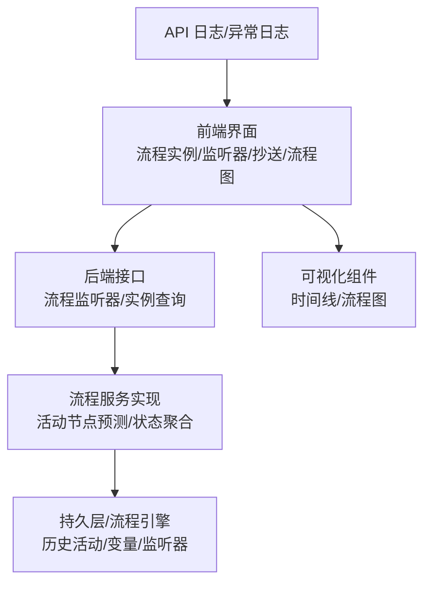
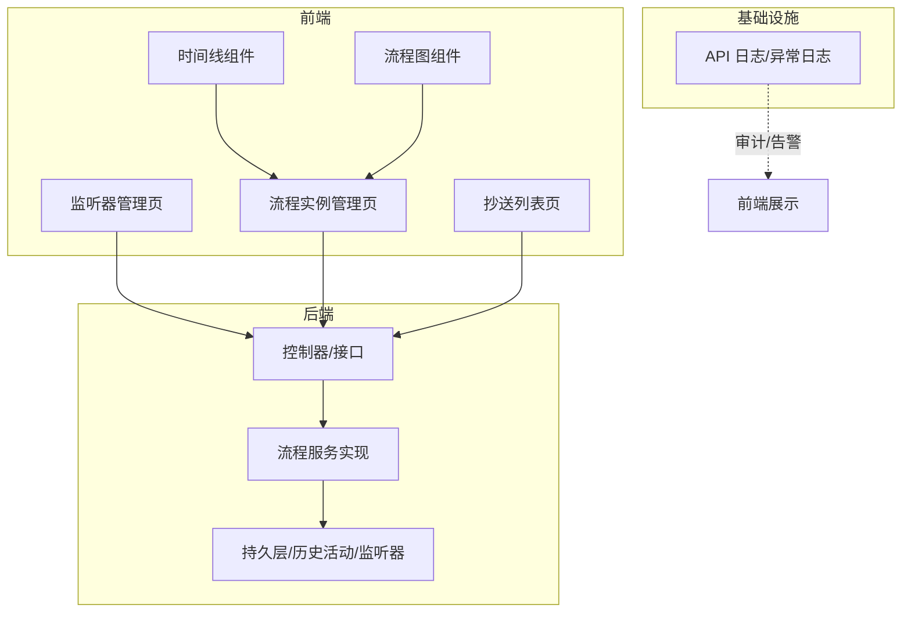
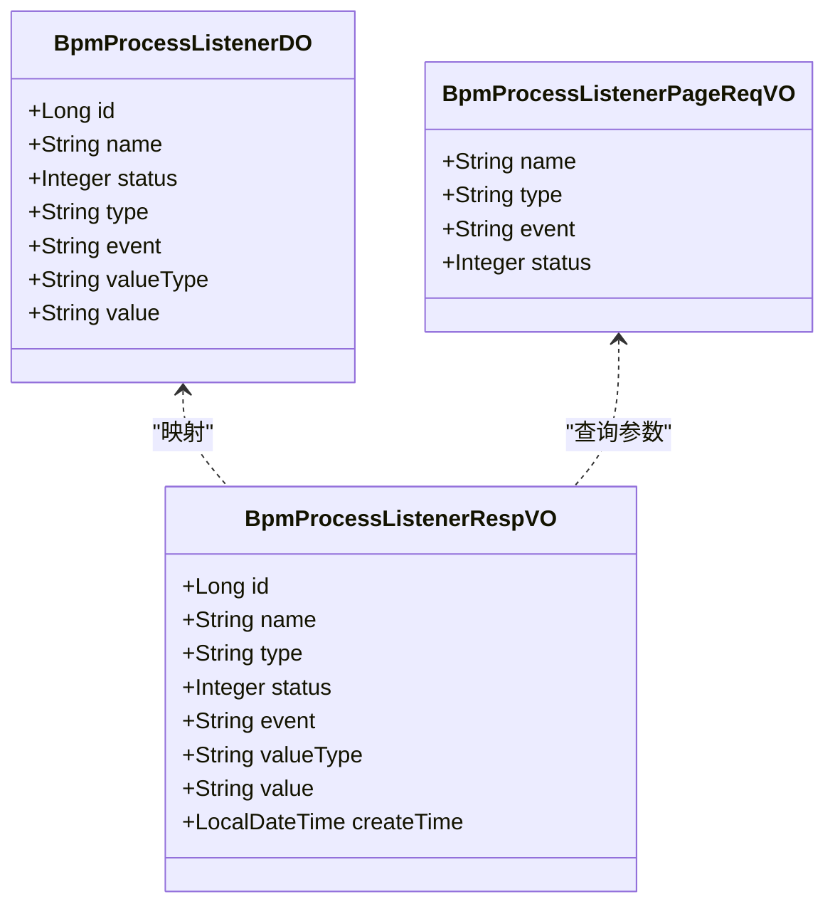
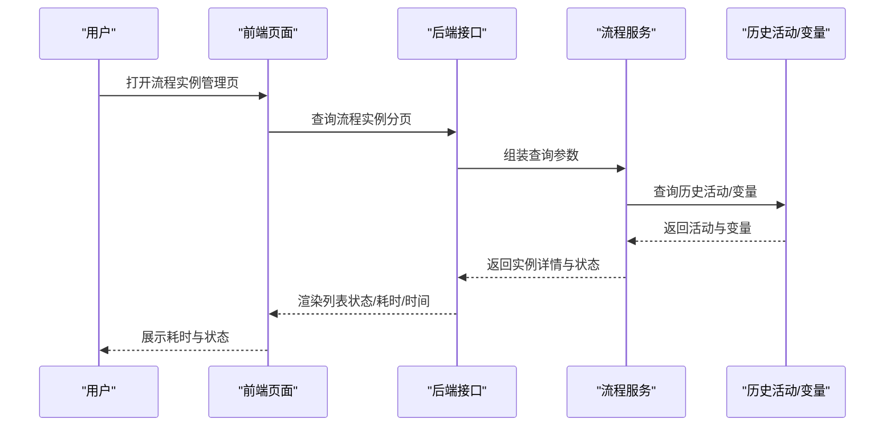
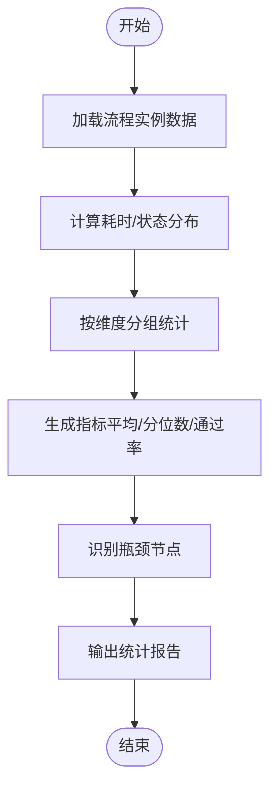
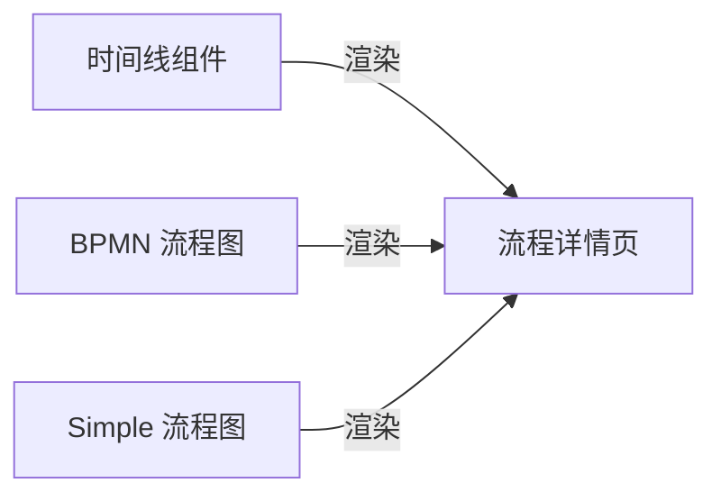
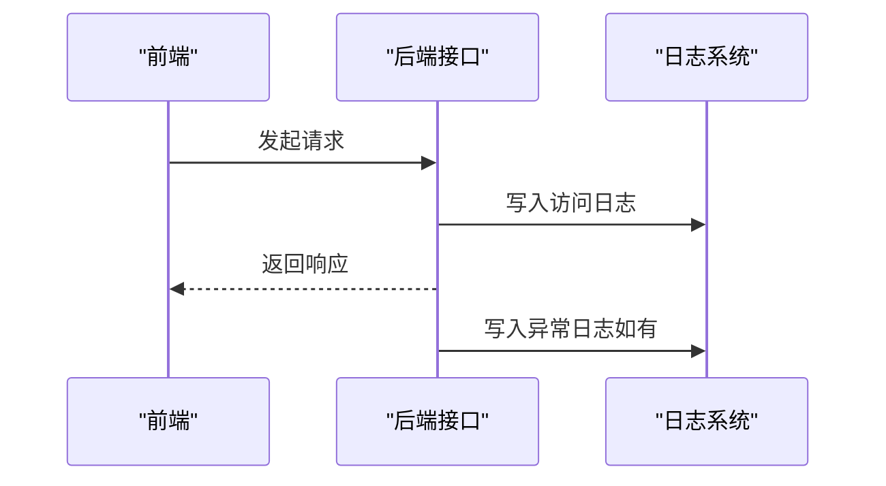
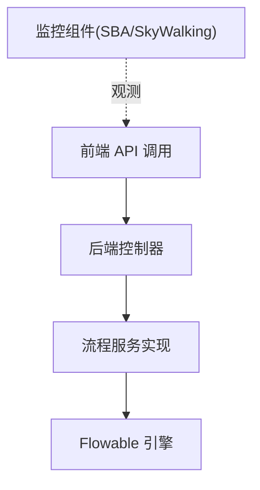

# 流程监控与统计

<cite>
**本文引用的文件**   
- [ProcessInstanceTimeline.vue](file://yudao-ui/yudao-ui-admin-vue3/src/views/bpm/processInstance/detail/ProcessInstanceTimeline.vue)
- [ProcessDefinitionDetail.vue](file://yudao-ui/yudao-ui-admin-vue3/src/views/bpm/processInstance/create/ProcessDefinitionDetail.vue)
- [index.vue（流程实例管理）](file://yudao-ui/yudao-ui-admin-vue3/src/views/bpm/processInstance/manager/index.vue)
- [index.vue（抄送列表）](file://yudao-ui/yudao-ui-admin-vue3/src/views/bpm/task/copy/index.vue)
- [index.vue（流程监听器）](file://yudao-ui/yudao-ui-admin-vue3/src/views/bpm/processListener/index.vue)
- [index.ts（流程监听器 API）](file://yudao-ui/yudao-ui-admin-vue3/src/api/bpm/processListener/index.ts)
- [BpmProcessListenerDO.java](file://yudao-module-bpm/src/main/java/cn/iocoder/yudao/module/bpm/dal/dataobject/definition/BpmProcessListenerDO.java)
- [BpmProcessListenerPageReqVO.java](file://yudao-module-bpm/src/main/java/cn/iocoder/yudao/module/bpm/controller/admin/definition/vo/listener/BpmProcessListenerPageReqVO.java)
- [BpmProcessListenerRespVO.java](file://yudao-module-bpm/src/main/java/cn/iocoder/yudao/module/bpm/controller/admin/definition/vo/listener/BpmProcessListenerRespVO.java)
- [BpmProcessInstanceServiceImpl.java](file://yudao-module-bpm/src/main/java/cn/iocoder/yudao/module/bpm/service/task/BpmProcessInstanceServiceImpl.java)
- [package-info.java（API 日志包）](file://yudao-framework/yudao-spring-boot-starter-web/src/main/java/cn/iocoder/yudao/framework/apilog/package-info.java)
- [ApiErrorLogCreateReqDTO.java](file://yudao-framework/yudao-common/src/main/java/cn/iocoder/yudao/framework/common/biz/infra/logger/dto/ApiErrorLogCreateReqDTO.java)
- [README.md（前端 README）](file://yudao-ui/yudao-ui-admin-vue3/README.md)
- [README.md（项目 README）](file://README.md)
</cite>

## 目录
1. [简介](#简介)
2. [项目结构](#项目结构)
3. [核心组件](#核心组件)
4. [架构总览](#架构总览)
5. [详细组件分析](#详细组件分析)
6. [依赖分析](#依赖分析)
7. [性能考虑](#性能考虑)
8. [故障排查指南](#故障排查指南)
9. [结论](#结论)
10. [附录](#附录)

## 简介
本文件围绕流程监控与统计主题，系统梳理项目中流程执行监控、性能指标采集、异常告警、流程监听器设计、统计分析、图表可视化、审计日志与合规报告、以及监控扩展与自定义指标的实现与实践路径。文档以 BPM 模块为核心，结合前端可视化组件与后端流程服务实现，形成从“可观测性—可分析—可优化”的闭环。

## 项目结构
- 前端（Vue3 + Element Plus）
  - 流程实例管理、流程详情、流程监听器管理、抄送列表等页面组件
  - 流程图可视化组件（BPMN/Simple）
  - 时间线组件用于展示审批流转
- 后端（Spring Boot + Flowable）
  - 流程监听器实体与 VO
  - 流程实例服务实现，负责活动节点预测、状态聚合与统计
  - API 日志与异常日志能力，支撑审计与告警

**章节来源**
- [ProcessInstanceTimeline.vue:1-31](file://yudao-ui/yudao-ui-admin-vue3/src/views/bpm/processInstance/detail/ProcessInstanceTimeline.vue#L1-L31)
- [ProcessDefinitionDetail.vue:25-54](file://yudao-ui/yudao-ui-admin-vue3/src/views/bpm/processInstance/create/ProcessDefinitionDetail.vue#L25-L54)
- [index.vue（流程监听器）:109-160](file://yudao-ui/yudao-ui-admin-vue3/src/views/bpm/processListener/index.vue#L109-L160)
- [BpmProcessListenerDO.java:28-73](file://yudao-module-bpm/src/main/java/cn/iocoder/yudao/module/bpm/dal/dataobject/definition/BpmProcessListenerDO.java#L28-L73)
- [BpmProcessInstanceServiceImpl.java:203-222](file://yudao-module-bpm/src/main/java/cn/iocoder/yudao/module/bpm/service/task/BpmProcessInstanceServiceImpl.java#L203-L222)

## 核心组件
- 流程监听器
  - 支持 ExecutionListener 与 TaskListener，事件类型覆盖 start/end、create/assignment/complete/delete/update/timeout 等
  - 值类型支持 class/delegateExpression/expression，便于扩展与复用
- 流程实例统计
  - 实例状态、开始/结束时间、耗时（毫秒）等字段，支持前端格式化显示
- 可视化展示
  - 时间线组件展示审批节点状态与图标
  - 流程图组件支持 BPMN 与 SIMPLE 两种模型
- 审计与异常
  - API 访问日志与异常日志，异常 DTO 包含堆栈与根因信息
- 抄送记录
  - 展示抄送节点、抄送人、抄送意见与时间，便于审计与合规追溯

**章节来源**
- [BpmProcessListenerDO.java:44-71](file://yudao-module-bpm/src/main/java/cn/iocoder/yudao/module/bpm/dal/dataobject/definition/BpmProcessListenerDO.java#L44-L71)
- [index.vue（流程实例管理）:89-125](file://yudao-ui/yudao-ui-admin-vue3/src/views/bpm/processInstance/manager/index.vue#L89-L125)
- [ProcessInstanceTimeline.vue:1-31](file://yudao-ui/yudao-ui-admin-vue3/src/views/bpm/processInstance/detail/ProcessInstanceTimeline.vue#L1-L31)
- [ProcessDefinitionDetail.vue:38-54](file://yudao-ui/yudao-ui-admin-vue3/src/views/bpm/processInstance/create/ProcessDefinitionDetail.vue#L38-L54)
- [package-info.java（API 日志包）:1-8](file://yudao-framework/yudao-spring-boot-starter-web/src/main/java/cn/iocoder/yudao/framework/apilog/package-info.java#L1-L8)
- [ApiErrorLogCreateReqDTO.java:60-107](file://yudao-framework/yudao-common/src/main/java/cn/iocoder/yudao/framework/common/biz/infra/logger/dto/ApiErrorLogCreateReqDTO.java#L60-L107)
- [index.vue（抄送列表）:44-100](file://yudao-ui/yudao-ui-admin-vue3/src/views/bpm/task/copy/index.vue#L44-L100)

## 架构总览
整体采用前后端分离架构，前端通过 API 获取流程监听器与流程实例数据，后端基于 Flowable 引擎提供流程执行与历史数据，结合可视化组件呈现流程状态与流转记录；审计与异常日志为监控与合规提供数据基础。

**图表来源**
- [index.vue（流程监听器）:109-160](file://yudao-ui/yudao-ui-admin-vue3/src/views/bpm/processListener/index.vue#L109-L160)
- [index.vue（流程实例管理）:89-125](file://yudao-ui/yudao-ui-admin-vue3/src/views/bpm/processInstance/manager/index.vue#L89-L125)
- [index.vue（抄送列表）:44-100](file://yudao-ui/yudao-ui-admin-vue3/src/views/bpm/task/copy/index.vue#L44-L100)
- [ProcessInstanceTimeline.vue:1-31](file://yudao-ui/yudao-ui-admin-vue3/src/views/bpm/processInstance/detail/ProcessInstanceTimeline.vue#L1-L31)
- [ProcessDefinitionDetail.vue:38-54](file://yudao-ui/yudao-ui-admin-vue3/src/views/bpm/processInstance/create/ProcessDefinitionDetail.vue#L38-L54)
- [package-info.java（API 日志包）:1-8](file://yudao-framework/yudao-spring-boot-starter-web/src/main/java/cn/iocoder/yudao/framework/apilog/package-info.java#L1-L8)

## 详细组件分析

### 流程监听器设计与事件处理
- 监听器类型与事件
  - 类型：execution（ExecutionListener）、task（TaskListener）
  - 事件：execution=start/end；task=create/assignment/complete/delete/update/timeout
- 值类型与扩展
  - class、delegateExpression、expression，便于与 Spring 容器集成与复用
- 前后端协作
  - 前端提供分页查询、新增/修改/删除接口；后端提供 DO/VO 映射与状态枚举

**图表来源**
- [BpmProcessListenerDO.java:28-73](file://yudao-module-bpm/src/main/java/cn/iocoder/yudao/module/bpm/dal/dataobject/definition/BpmProcessListenerDO.java#L28-L73)
- [BpmProcessListenerPageReqVO.java:1-30](file://yudao-module-bpm/src/main/java/cn/iocoder/yudao/module/bpm/controller/admin/definition/vo/listener/BpmProcessListenerPageReqVO.java#L1-L30)
- [BpmProcessListenerRespVO.java:1-36](file://yudao-module-bpm/src/main/java/cn/iocoder/yudao/module/bpm/controller/admin/definition/vo/listener/BpmProcessListenerRespVO.java#L1-L36)

**章节来源**
- [BpmProcessListenerDO.java:44-71](file://yudao-module-bpm/src/main/java/cn/iocoder/yudao/module/bpm/dal/dataobject/definition/BpmProcessListenerDO.java#L44-L71)
- [index.vue（流程监听器）:109-160](file://yudao-ui/yudao-ui-admin-vue3/src/views/bpm/processListener/index.vue#L109-L160)
- [index.ts（流程监听器 API）:15-40](file://yudao-ui/yudao-ui-admin-vue3/src/api/bpm/processListener/index.ts#L15-L40)

### 流程执行监控与统计
- 实时状态跟踪
  - 流程实例列表展示状态、开始/结束时间、耗时（毫秒），前端格式化显示
- 性能指标采集
  - 耗时字段可用于计算平均时长、P95/P99 等指标
- 异常告警机制
  - API 访问日志与异常日志为异常发现与定位提供依据

**图表来源**
- [index.vue（流程实例管理）:89-125](file://yudao-ui/yudao-ui-admin-vue3/src/views/bpm/processInstance/manager/index.vue#L89-L125)
- [BpmProcessInstanceServiceImpl.java:203-222](file://yudao-module-bpm/src/main/java/cn/iocoder/yudao/module/bpm/service/task/BpmProcessInstanceServiceImpl.java#L203-L222)

**章节来源**
- [index.vue（流程实例管理）:89-125](file://yudao-ui/yudao-ui-admin-vue3/src/views/bpm/processInstance/manager/index.vue#L89-L125)
- [BpmProcessInstanceServiceImpl.java:203-222](file://yudao-module-bpm/src/main/java/cn/iocoder/yudao/module/bpm/service/task/BpmProcessInstanceServiceImpl.java#L203-L222)
- [package-info.java（API 日志包）:1-8](file://yudao-framework/yudao-spring-boot-starter-web/src/main/java/cn/iocoder/yudao/framework/apilog/package-info.java#L1-L8)

### 流程统计分析
- 执行时长分析
  - 使用 durationInMillis 字段进行统计，支持按流程、发起人、分类等维度聚合
- 通过率统计
  - 结合流程实例状态（如结束状态）进行通过率计算
- 瓶颈识别
  - 通过历史活动与任务列表，定位耗时较长的节点或环节

**图表来源**
- [index.vue（流程实例管理）:89-125](file://yudao-ui/yudao-ui-admin-vue3/src/views/bpm/processInstance/manager/index.vue#L89-L125)
- [BpmProcessInstanceServiceImpl.java:203-222](file://yudao-module-bpm/src/main/java/cn/iocoder/yudao/module/bpm/service/task/BpmProcessInstanceServiceImpl.java#L203-L222)

**章节来源**
- [index.vue（流程实例管理）:89-125](file://yudao-ui/yudao-ui-admin-vue3/src/views/bpm/processInstance/manager/index.vue#L89-L125)
- [BpmProcessInstanceServiceImpl.java:203-222](file://yudao-module-bpm/src/main/java/cn/iocoder/yudao/module/bpm/service/task/BpmProcessInstanceServiceImpl.java#L203-L222)

### 流程图表可视化
- 时间线组件
  - 展示审批节点状态、图标与时间，支持状态徽标显示
- 流程图组件
  - 支持 BPMN 与 SIMPLE 两种模型的预览与交互

**图表来源**
- [ProcessInstanceTimeline.vue:1-31](file://yudao-ui/yudao-ui-admin-vue3/src/views/bpm/processInstance/detail/ProcessInstanceTimeline.vue#L1-L31)
- [ProcessDefinitionDetail.vue:38-54](file://yudao-ui/yudao-ui-admin-vue3/src/views/bpm/processInstance/create/ProcessDefinitionDetail.vue#L38-L54)

**章节来源**
- [ProcessInstanceTimeline.vue:1-31](file://yudao-ui/yudao-ui-admin-vue3/src/views/bpm/processInstance/detail/ProcessInstanceTimeline.vue#L1-L31)
- [ProcessDefinitionDetail.vue:25-54](file://yudao-ui/yudao-ui-admin-vue3/src/views/bpm/processInstance/create/ProcessDefinitionDetail.vue#L25-L54)

### 流程审计日志与合规报告
- 审计日志
  - API 访问日志与异常日志，异常 DTO 包含异常类名、方法、行号、栈轨迹与根因
- 合规报告
  - 抄送列表展示抄送节点、抄送人、抄送意见与时间，便于合规审计

**图表来源**
- [package-info.java（API 日志包）:1-8](file://yudao-framework/yudao-spring-boot-starter-web/src/main/java/cn/iocoder/yudao/framework/apilog/package-info.java#L1-L8)
- [ApiErrorLogCreateReqDTO.java:60-107](file://yudao-framework/yudao-common/src/main/java/cn/iocoder/yudao/framework/common/biz/infra/logger/dto/ApiErrorLogCreateReqDTO.java#L60-L107)
- [index.vue（抄送列表）:44-100](file://yudao-ui/yudao-ui-admin-vue3/src/views/bpm/task/copy/index.vue#L44-L100)

**章节来源**
- [package-info.java（API 日志包）:1-8](file://yudao-framework/yudao-spring-boot-starter-web/src/main/java/cn/iocoder/yudao/framework/apilog/package-info.java#L1-L8)
- [ApiErrorLogCreateReqDTO.java:60-107](file://yudao-framework/yudao-common/src/main/java/cn/iocoder/yudao/framework/common/biz/infra/logger/dto/ApiErrorLogCreateReqDTO.java#L60-L107)
- [index.vue（抄送列表）:44-100](file://yudao-ui/yudao-ui-admin-vue3/src/views/bpm/task/copy/index.vue#L44-L100)

### 监控系统的扩展与自定义指标
- 扩展开发
  - 基于现有监听器机制，新增自定义监听器类型与事件，扩展指标采集维度
- 自定义指标
  - 在监听器中注入业务指标（如节点耗时、审批人数、加签次数等），通过 API 日志与异常日志上报

**章节来源**
- [BpmProcessListenerDO.java:44-71](file://yudao-module-bpm/src/main/java/cn/iocoder/yudao/module/bpm/dal/dataobject/definition/BpmProcessListenerDO.java#L44-L71)
- [README.md（前端 README）:171-190](file://yudao-ui/yudao-ui-admin-vue3/README.md#L171-L190)
- [README.md（项目 README）:203-222](file://README.md#L203-L222)

## 依赖分析
- 前端依赖
  - Vue3 + Element Plus + ECharts（插件目录存在）
  - 组件间通过 API 与路由交互
- 后端依赖
  - Flowable 引擎提供流程执行与历史数据
  - Spring Boot Admin、SkyWalking 等监控组件（项目 README 中提及）

**图表来源**
- [README.md（前端 README）:171-190](file://yudao-ui/yudao-ui-admin-vue3/README.md#L171-L190)
- [README.md（项目 README）:203-222](file://README.md#L203-L222)

**章节来源**
- [README.md（前端 README）:171-190](file://yudao-ui/yudao-ui-admin-vue3/README.md#L171-L190)
- [README.md（项目 README）:203-222](file://README.md#L203-L222)

## 性能考虑
- 列表查询与分页
  - 使用分页参数控制数据量，避免一次性加载过多流程实例
- 可视化渲染
  - 时间线与流程图组件按需渲染，避免大数据量下的卡顿
- 指标计算
  - 前端格式化显示耗时，后端仅返回必要字段，降低网络传输与解析成本

## 故障排查指南
- 审计与异常
  - 通过 API 访问日志与异常日志定位问题，异常 DTO 包含关键堆栈信息
- 抄送与流转
  - 抄送列表可辅助确认审批是否按预期流转与通知

**章节来源**
- [package-info.java（API 日志包）:1-8](file://yudao-framework/yudao-spring-boot-starter-web/src/main/java/cn/iocoder/yudao/framework/apilog/package-info.java#L1-L8)
- [ApiErrorLogCreateReqDTO.java:60-107](file://yudao-framework/yudao-common/src/main/java/cn/iocoder/yudao/framework/common/biz/infra/logger/dto/ApiErrorLogCreateReqDTO.java#L60-L107)
- [index.vue（抄送列表）:44-100](file://yudao-ui/yudao-ui-admin-vue3/src/views/bpm/task/copy/index.vue#L44-L100)

## 结论
本项目在流程监控与统计方面具备较为完善的前端可视化与后端流程服务能力，结合 API 日志与异常日志，能够支撑流程执行的可观测性与合规审计。通过监听器机制与自定义指标扩展，可进一步增强统计分析与告警能力，为流程优化提供数据支撑。

## 附录
- 相关功能清单（摘自 README）
  - 流程设计器（SIMPLE/BPMN）
  - 会签/或签/依次审批/抄送/驳回/转办/委派/加签/减签/撤销/终止
  - 超时审批/自动提醒/父子流程/条件/并行/包容/路由/触发/延迟
  - 拓展设置（前置/后置通知、流程报表、自动审批去重、自定义编号/标题/摘要）

**章节来源**
- [README.md（前端 README）:132-157](file://yudao-ui/yudao-ui-admin-vue3/README.md#L132-L157)
- [README.md（项目 README）:164-189](file://README.md#L164-L189)