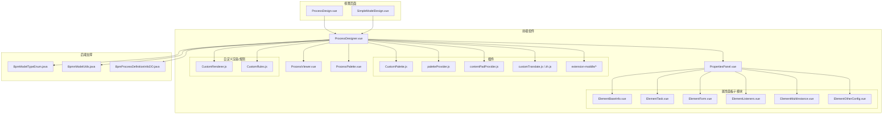
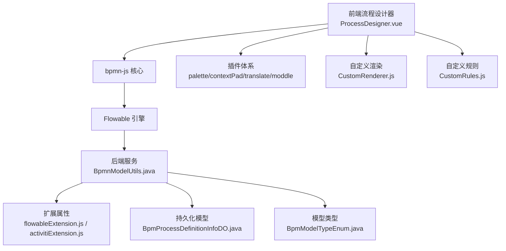
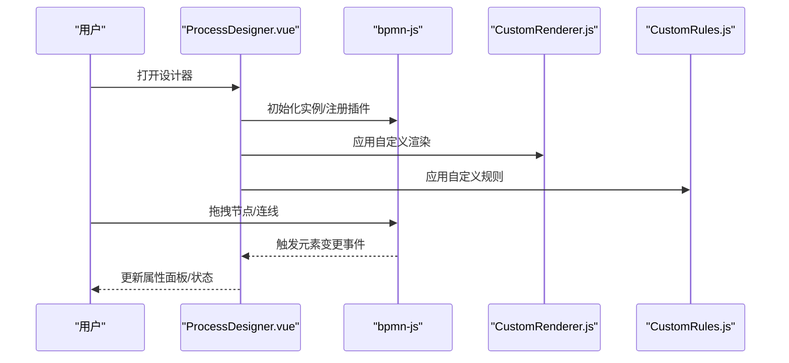
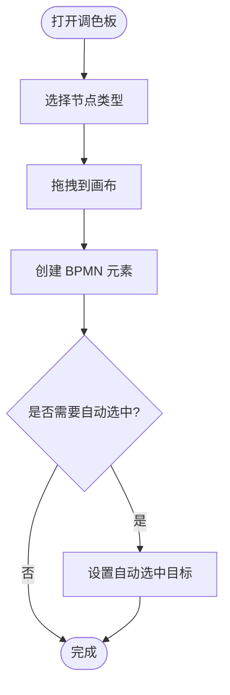
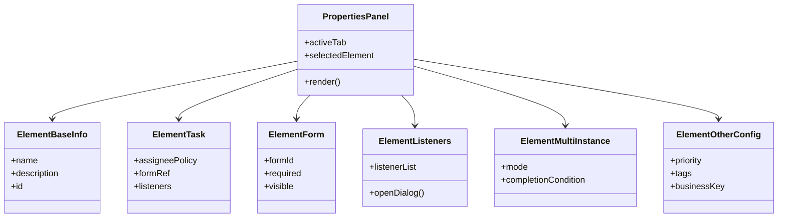
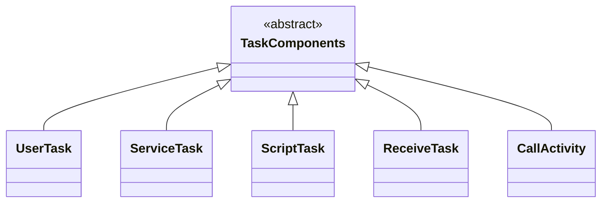
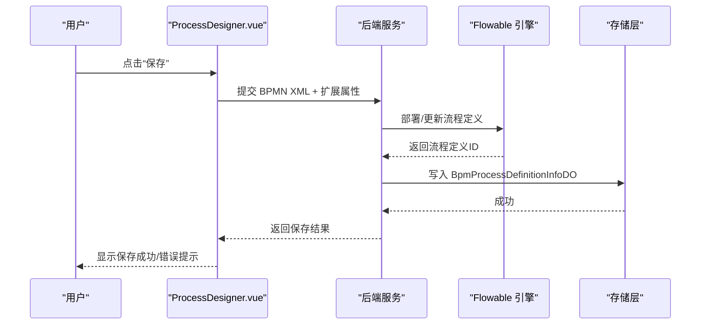
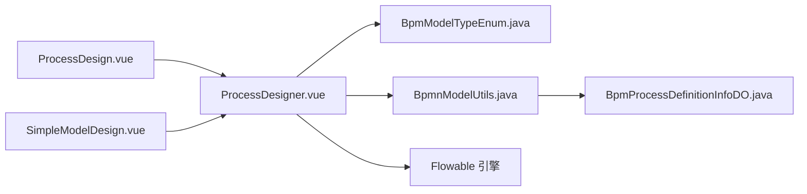

# 流程设计器

<cite>
**本文引用的文件**
- [ProcessDesigner.vue](file://yudao-ui/yudao-ui-admin-vue3/src/components/bpmnProcessDesigner/package/designer/ProcessDesigner.vue)
- [ProcessViewer.vue](file://yudao-ui/yudao-ui-admin-vue3/src/components/bpmnProcessDesigner/package/designer/ProcessViewer.vue)
- [ProcessPalette.vue](file://yudao-ui/yudao-ui-admin-vue3/src/components/bpmnProcessDesigner/package/palette/ProcessPalette.vue)
- [PropertiesPanel.vue](file://yudao-ui/yudao-ui-admin-vue3/src/components/bpmnProcessDesigner/package/penal/PropertiesPanel.vue)
- [ElementBaseInfo.vue](file://yudao-ui/yudao-ui-admin-vue3/src/components/bpmnProcessDesigner/package/penal/base/ElementBaseInfo.vue)
- [ElementTask.vue](file://yudao-ui/yudao-ui-admin-vue3/src/components/bpmnProcessDesigner/package/penal/task/ElementTask.vue)
- [UserTask.vue](file://yudao-ui/yudao-ui-admin-vue3/src/components/bpmnProcessDesigner/package/penal/task/task-components/UserTask.vue)
- [ServiceTask.vue](file://yudao-ui/yudao-ui-admin-vue3/src/components/bpmnProcessDesigner/package/penal/task/task-components/ServiceTask.vue)
- [ScriptTask.vue](file://yudao-ui/yudao-ui-admin-vue3/src/components/bpmnProcessDesigner/package/penal/task/task-components/ScriptTask.vue)
- [ReceiveTask.vue](file://yudao-ui/yudao-ui-admin-vue3/src/components/bpmnProcessDesigner/package/penal/task/task-components/ReceiveTask.vue)
- [CallActivity.vue](file://yudao-ui/yudao-ui-admin-vue3/src/components/bpmnProcessDesigner/package/penal/task/task-components/CallActivity.vue)
- [ElementForm.vue](file://yudao-ui/yudao-ui-admin-vue3/src/components/bpmnProcessDesigner/package/penal/form/ElementForm.vue)
- [ElementListeners.vue](file://yudao-ui/yudao-ui-admin-vue3/src/components/bpmnProcessDesigner/package/penal/listeners/ElementListeners.vue)
- [ProcessListenerDialog.vue](file://yudao-ui/yudao-ui-admin-vue3/src/components/bpmnProcessDesigner/package/penal/listeners/ProcessListenerDialog.vue)
- [ElementMultiInstance.vue](file://yudao-ui/yudao-ui-admin-vue3/src/components/bpmnProcessDesigner/package/penal/multi-instance/ElementMultiInstance.vue)
- [ElementOtherConfig.vue](file://yudao-ui/yudao-ui-admin-vue3/src/components/bpmnProcessDesigner/package/penal/other/ElementOtherConfig.vue)
- [CustomPalette.js](file://yudao-ui/yudao-ui-admin-vue3/src/components/bpmnProcessDesigner/package/designer/plugins/palette/CustomPalette.js)
- [paletteProvider.js](file://yudao-ui/yudao-ui-admin-vue3/src/components/bpmnProcessDesigner/package/designer/plugins/palette/paletteProvider.js)
- [contentPadProvider.js](file://yudao-ui/yudao-ui-admin-vue3/src/components/bpmnProcessDesigner/package/designer/plugins/content-pad/contentPadProvider.js)
- [customTranslate.js](file://yudao-ui/yudao-ui-admin-vue3/src/components/bpmnProcessDesigner/package/designer/plugins/translate/customTranslate.js)
- [zh.js](file://yudao-ui/yudao-ui-admin-vue3/src/components/bpmnProcessDesigner/package/designer/plugins/translate/zh.js)
- [flowableExtension.js](file://yudao-ui/yudao-ui-admin-vue3/src/components/bpmnProcessDesigner/package/designer/plugins/extension-moddle/flowable/flowableExtension.js)
- [activitiExtension.js](file://yudao-ui/yudao-ui-admin-vue3/src/components/bpmnProcessDesigner/package/designer/plugins/extension-moddle/activiti/activitiExtension.js)
- [CustomRenderer.js](file://yudao-ui/yudao-ui-admin-vue3/src/components/bpmnProcessDesigner/src/modules/custom-renderer/CustomRenderer.js)
- [CustomRules.js](file://yudao-ui/yudao-ui-admin-vue3/src/components/bpmnProcessDesigner/src/modules/rules/CustomRules.js)
- [ProcessDesign.vue](file://yudao-ui/yudao-ui-admin-vue3/src/views/bpm/model/form/ProcessDesign.vue)
- [SimpleModelDesign.vue](file://yudao-ui/yudao-ui-admin-vue3/src/views/bpm/simple/SimpleModelDesign.vue)
- [BpmModelTypeEnum.java](file://yudao-module-bpm/src/main/java/cn/iocoder/yudao/module/bpm/enums/definition/BpmModelTypeEnum.java)
- [BpmnModelUtils.java](file://yudao-module-bpm/src/main/java/cn/iocoder/yudao/module/bpm/framework/flowable/core/util/BpmnModelUtils.java)
- [BpmProcessDefinitionInfoDO.java](file://yudao-module-bpm/src/main/java/cn/iocoder/yudao/module/bpm/dal/dataobject/definition/BpmProcessDefinitionInfoDO.java)
- [auto-components.d.ts](file://yudao-ui/yudao-ui-admin-vue3/src/types/auto-components.d.ts)
</cite>

## 目录
1. [简介](#简介)
2. [项目结构](#项目结构)
3. [核心组件](#核心组件)
4. [架构总览](#架构总览)
5. [详细组件分析](#详细组件分析)
6. [依赖关系分析](#依赖关系分析)
7. [性能考量](#性能考量)
8. [故障排查指南](#故障排查指南)
9. [结论](#结论)
10. [附录](#附录)

## 简介
本文件为“流程设计器”的综合技术文档，聚焦于基于 BPMN 2.0 的可视化流程设计能力。系统由前端 Vue3 组件与后端 Java 服务协同构成：前端提供画布渲染、节点拖拽、连线绘制、属性配置与多语言本地化；后端通过 Flowable 引擎解析与持久化 BPMN 模型，并扩展了业务属性以满足复杂场景需求。本文档将从 UI 架构、节点类型、属性编辑器、保存/预览/导出机制、扩展开发与用户体验优化等方面进行系统性阐述。

## 项目结构
流程设计器位于前端工程 yudao-ui-admin-vue3 中的 bpmnProcessDesigner 组件包内，采用“按功能域分层 + 插件化扩展”的组织方式：
- 设计器核心：ProcessDesigner.vue、ProcessViewer.vue
- 工具栏与调色板：ProcessPalette.vue、CustomPalette.js、paletteProvider.js
- 属性面板：PropertiesPanel.vue、各元素配置子面板（任务、监听器、多实例、其他）
- 扩展与本地化：plugins 下的 content-pad、translate、extension-moddle
- 自定义渲染与规则：src/modules 下的 CustomRenderer.js、CustomRules.js
- 视图集成：ProcessDesign.vue、SimpleModelDesign.vue
- 后端支撑：BpmModelTypeEnum.java、BpmnModelUtils.java、BpmProcessDefinitionInfoDO.java

图表来源
- [ProcessDesigner.vue](file://yudao-ui/yudao-ui-admin-vue3/src/components/bpmnProcessDesigner/package/designer/ProcessDesigner.vue)
- [ProcessViewer.vue](file://yudao-ui/yudao-ui-admin-vue3/src/components/bpmnProcessDesigner/package/designer/ProcessViewer.vue)
- [ProcessPalette.vue](file://yudao-ui/yudao-ui-admin-vue3/src/components/bpmnProcessDesigner/package/palette/ProcessPalette.vue)
- [PropertiesPanel.vue](file://yudao-ui/yudao-ui-admin-vue3/src/components/bpmnProcessDesigner/package/penal/PropertiesPanel.vue)
- [ElementBaseInfo.vue](file://yudao-ui/yudao-ui-admin-vue3/src/components/bpmnProcessDesigner/package/penal/base/ElementBaseInfo.vue)
- [ElementTask.vue](file://yudao-ui/yudao-ui-admin-vue3/src/components/bpmnProcessDesigner/package/penal/task/ElementTask.vue)
- [ElementForm.vue](file://yudao-ui/yudao-ui-admin-vue3/src/components/bpmnProcessDesigner/package/penal/form/ElementForm.vue)
- [ElementListeners.vue](file://yudao-ui/yudao-ui-admin-vue3/src/components/bpmnProcessDesigner/package/penal/listeners/ElementListeners.vue)
- [ElementMultiInstance.vue](file://yudao-ui/yudao-ui-admin-vue3/src/components/bpmnProcessDesigner/package/penal/multi-instance/ElementMultiInstance.vue)
- [ElementOtherConfig.vue](file://yudao-ui/yudao-ui-admin-vue3/src/components/bpmnProcessDesigner/package/penal/other/ElementOtherConfig.vue)
- [CustomPalette.js](file://yudao-ui/yudao-ui-admin-vue3/src/components/bpmnProcessDesigner/package/designer/plugins/palette/CustomPalette.js)
- [paletteProvider.js](file://yudao-ui/yudao-ui-admin-vue3/src/components/bpmnProcessDesigner/package/designer/plugins/palette/paletteProvider.js)
- [contentPadProvider.js](file://yudao-ui/yudao-ui-admin-vue3/src/components/bpmnProcessDesigner/package/designer/plugins/content-pad/contentPadProvider.js)
- [customTranslate.js](file://yudao-ui/yudao-ui-admin-vue3/src/components/bpmnProcessDesigner/package/designer/plugins/translate/customTranslate.js)
- [zh.js](file://yudao-ui/yudao-ui-admin-vue3/src/components/bpmnProcessDesigner/package/designer/plugins/translate/zh.js)
- [flowableExtension.js](file://yudao-ui/yudao-ui-admin-vue3/src/components/bpmnProcessDesigner/package/designer/plugins/extension-moddle/flowable/flowableExtension.js)
- [activitiExtension.js](file://yudao-ui/yudao-ui-admin-vue3/src/components/bpmnProcessDesigner/package/designer/plugins/extension-moddle/activiti/activitiExtension.js)
- [CustomRenderer.js](file://yudao-ui/yudao-ui-admin-vue3/src/components/bpmnProcessDesigner/src/modules/custom-renderer/CustomRenderer.js)
- [CustomRules.js](file://yudao-ui/yudao-ui-admin-vue3/src/components/bpmnProcessDesigner/src/modules/rules/CustomRules.js)
- [ProcessDesign.vue](file://yudao-ui/yudao-ui-admin-vue3/src/views/bpm/model/form/ProcessDesign.vue)
- [SimpleModelDesign.vue](file://yudao-ui/yudao-ui-admin-vue3/src/views/bpm/simple/SimpleModelDesign.vue)
- [BpmModelTypeEnum.java](file://yudao-module-bpm/src/main/java/cn/iocoder/yudao/module/bpm/enums/definition/BpmModelTypeEnum.java)
- [BpmnModelUtils.java](file://yudao-module-bpm/src/main/java/cn/iocoder/yudao/module/bpm/framework/flowable/core/util/BpmnModelUtils.java)
- [BpmProcessDefinitionInfoDO.java](file://yudao-module-bpm/src/main/java/cn/iocoder/yudao/module/bpm/dal/dataobject/definition/BpmProcessDefinitionInfoDO.java)

章节来源
- [ProcessDesigner.vue](file://yudao-ui/yudao-ui-admin-vue3/src/components/bpmnProcessDesigner/package/designer/ProcessDesigner.vue)
- [ProcessPalette.vue](file://yudao-ui/yudao-ui-admin-vue3/src/components/bpmnProcessDesigner/package/palette/ProcessPalette.vue)
- [PropertiesPanel.vue](file://yudao-ui/yudao-ui-admin-vue3/src/components/bpmnProcessDesigner/package/penal/PropertiesPanel.vue)
- [ProcessDesign.vue](file://yudao-ui/yudao-ui-admin-vue3/src/views/bpm/model/form/ProcessDesign.vue)
- [SimpleModelDesign.vue](file://yudao-ui/yudao-ui-admin-vue3/src/views/bpm/simple/SimpleModelDesign.vue)

## 核心组件
- 设计器容器：ProcessDesigner.vue 提供画布、工具栏、属性面板与插件注册，负责整体交互与状态管理。
- 查看器：ProcessViewer.vue 用于只读展示流程图，便于预览与审计。
- 调色板：ProcessPalette.vue 与 CustomPalette.js/paletteProvider.js 提供 BPMN 2.0 节点拖拽入口。
- 属性面板：PropertiesPanel.vue 作为容器，动态加载各元素配置子面板（基础信息、任务、表单、监听器、多实例、其他）。
- 扩展与本地化：content-pad、translate、extension-moddle 插件分别增强上下文菜单、翻译与引擎扩展属性。
- 自定义渲染与规则：CustomRenderer.js、CustomRules.js 支持节点样式与约束定制。

章节来源
- [ProcessDesigner.vue](file://yudao-ui/yudao-ui-admin-vue3/src/components/bpmnProcessDesigner/package/designer/ProcessDesigner.vue)
- [ProcessViewer.vue](file://yudao-ui/yudao-ui-admin-vue3/src/components/bpmnProcessDesigner/package/designer/ProcessViewer.vue)
- [ProcessPalette.vue](file://yudao-ui/yudao-ui-admin-vue3/src/components/bpmnProcessDesigner/package/palette/ProcessPalette.vue)
- [PropertiesPanel.vue](file://yudao-ui/yudao-ui-admin-vue3/src/components/bpmnProcessDesigner/package/penal/PropertiesPanel.vue)
- [CustomPalette.js](file://yudao-ui/yudao-ui-admin-vue3/src/components/bpmnProcessDesigner/package/designer/plugins/palette/CustomPalette.js)
- [paletteProvider.js](file://yudao-ui/yudao-ui-admin-vue3/src/components/bpmnProcessDesigner/package/designer/plugins/palette/paletteProvider.js)
- [contentPadProvider.js](file://yudao-ui/yudao-ui-admin-vue3/src/components/bpmnProcessDesigner/package/designer/plugins/content-pad/contentPadProvider.js)
- [customTranslate.js](file://yudao-ui/yudao-ui-admin-vue3/src/components/bpmnProcessDesigner/package/designer/plugins/translate/customTranslate.js)
- [zh.js](file://yudao-ui/yudao-ui-admin-vue3/src/components/bpmnProcessDesigner/package/designer/plugins/translate/zh.js)
- [flowableExtension.js](file://yudao-ui/yudao-ui-admin-vue3/src/components/bpmnProcessDesigner/package/designer/plugins/extension-moddle/flowable/flowableExtension.js)
- [activitiExtension.js](file://yudao-ui/yudao-ui-admin-vue3/src/components/bpmnProcessDesigner/package/designer/plugins/extension-moddle/activiti/activitiExtension.js)
- [CustomRenderer.js](file://yudao-ui/yudao-ui-admin-vue3/src/components/bpmnProcessDesigner/src/modules/custom-renderer/CustomRenderer.js)
- [CustomRules.js](file://yudao-ui/yudao-ui-admin-vue3/src/components/bpmnProcessDesigner/src/modules/rules/CustomRules.js)

## 架构总览
前端通过 ProcessDesigner.vue 注入 bpmn-js 实例，挂载 palette、contextPad、translate、moddle 等插件，结合自定义渲染与规则实现 BPMN 2.0 可视化建模。后端以 Flowable 为核心，使用 BpmnModelUtils 进行模型扩展与解析，BpmProcessDefinitionInfoDO 存储额外业务属性，BpmModelTypeEnum 区分 BPMN 与 SIMPLE 设计器类型。

图表来源
- [ProcessDesigner.vue](file://yudao-ui/yudao-ui-admin-vue3/src/components/bpmnProcessDesigner/package/designer/ProcessDesigner.vue)
- [BpmnModelUtils.java](file://yudao-module-bpm/src/main/java/cn/iocoder/yudao/module/bpm/framework/flowable/core/util/BpmnModelUtils.java)
- [BpmProcessDefinitionInfoDO.java](file://yudao-module-bpm/src/main/java/cn/iocoder/yudao/module/bpm/dal/dataobject/definition/BpmProcessDefinitionInfoDO.java)
- [BpmModelTypeEnum.java](file://yudao-module-bpm/src/main/java/cn/iocoder/yudao/module/bpm/enums/definition/BpmModelTypeEnum.java)
- [flowableExtension.js](file://yudao-ui/yudao-ui-admin-vue3/src/components/bpmnProcessDesigner/package/designer/plugins/extension-moddle/flowable/flowableExtension.js)
- [activitiExtension.js](file://yudao-ui/yudao-ui-admin-vue3/src/components/bpmnProcessDesigner/package/designer/plugins/extension-moddle/activiti/activitiExtension.js)

## 详细组件分析

### 画布与渲染
- ProcessDesigner.vue 负责初始化 bpmn-js、注册插件、绑定事件与状态同步。
- CustomRenderer.js 通过覆盖默认渲染逻辑，实现节点图标、颜色、尺寸等视觉定制。
- CustomRules.js 定义节点间连接规则、校验条件，确保流程图合法性。

图表来源
- [ProcessDesigner.vue](file://yudao-ui/yudao-ui-admin-vue3/src/components/bpmnProcessDesigner/package/designer/ProcessDesigner.vue)
- [CustomRenderer.js](file://yudao-ui/yudao-ui-admin-vue3/src/components/bpmnProcessDesigner/src/modules/custom-renderer/CustomRenderer.js)
- [CustomRules.js](file://yudao-ui/yudao-ui-admin-vue3/src/components/bpmnProcessDesigner/src/modules/rules/CustomRules.js)

章节来源
- [ProcessDesigner.vue](file://yudao-ui/yudao-ui-admin-vue3/src/components/bpmnProcessDesigner/package/designer/ProcessDesigner.vue)
- [CustomRenderer.js](file://yudao-ui/yudao-ui-admin-vue3/src/components/bpmnProcessDesigner/src/modules/custom-renderer/CustomRenderer.js)
- [CustomRules.js](file://yudao-ui/yudao-ui-admin-vue3/src/components/bpmnProcessDesigner/src/modules/rules/CustomRules.js)

### 节点拖拽与调色板
- ProcessPalette.vue 提供节点选择区，支持开始事件、用户任务、服务任务、脚本任务、接收任务、子流程、参与者、组等。
- CustomPalette.js/paletteProvider.js 基于 bpmn-js PaletteProvider 扩展节点创建行为，统一处理拖拽起始、父子关系与自动选中。

图表来源
- [ProcessPalette.vue](file://yudao-ui/yudao-ui-admin-vue3/src/components/bpmnProcessDesigner/package/palette/ProcessPalette.vue)
- [CustomPalette.js](file://yudao-ui/yudao-ui-admin-vue3/src/components/bpmnProcessDesigner/package/designer/plugins/palette/CustomPalette.js)
- [paletteProvider.js](file://yudao-ui/yudao-ui-admin-vue3/src/components/bpmnProcessDesigner/package/designer/plugins/palette/paletteProvider.js)

章节来源
- [ProcessPalette.vue](file://yudao-ui/yudao-ui-admin-vue3/src/components/bpmnProcessDesigner/package/palette/ProcessPalette.vue)
- [CustomPalette.js](file://yudao-ui/yudao-ui-admin-vue3/src/components/bpmnProcessDesigner/package/designer/plugins/palette/CustomPalette.js)
- [paletteProvider.js](file://yudao-ui/yudao-ui-admin-vue3/src/components/bpmnProcessDesigner/package/designer/plugins/palette/paletteProvider.js)

### 属性配置面板
- PropertiesPanel.vue 作为容器，根据当前选中元素动态加载对应子面板。
- ElementBaseInfo.vue：通用基础属性（名称、描述、ID 等）。
- ElementTask.vue：任务类型通用配置（任务分配策略、表单关联、监听器等）。
- ElementForm.vue：表单配置（表单 ID/类型、显示/必填等）。
- ElementListeners.vue / ProcessListenerDialog.vue：监听器设置（执行前/后、异常、变量等）。
- ElementMultiInstance.vue：多实例配置（并行/串行、完成条件、入口/出口事件）。
- ElementOtherConfig.vue：其他扩展属性（优先级、标签、业务键等）。

图表来源
- [PropertiesPanel.vue](file://yudao-ui/yudao-ui-admin-vue3/src/components/bpmnProcessDesigner/package/penal/PropertiesPanel.vue)
- [ElementBaseInfo.vue](file://yudao-ui/yudao-ui-admin-vue3/src/components/bpmnProcessDesigner/package/penal/base/ElementBaseInfo.vue)
- [ElementTask.vue](file://yudao-ui/yudao-ui-admin-vue3/src/components/bpmnProcessDesigner/package/penal/task/ElementTask.vue)
- [ElementForm.vue](file://yudao-ui/yudao-ui-admin-vue3/src/components/bpmnProcessDesigner/package/penal/form/ElementForm.vue)
- [ElementListeners.vue](file://yudao-ui/yudao-ui-admin-vue3/src/components/bpmnProcessDesigner/package/penal/listeners/ElementListeners.vue)
- [ProcessListenerDialog.vue](file://yudao-ui/yudao-ui-admin-vue3/src/components/bpmnProcessDesigner/package/penal/listeners/ProcessListenerDialog.vue)
- [ElementMultiInstance.vue](file://yudao-ui/yudao-ui-admin-vue3/src/components/bpmnProcessDesigner/package/penal/multi-instance/ElementMultiInstance.vue)
- [ElementOtherConfig.vue](file://yudao-ui/yudao-ui-admin-vue3/src/components/bpmnProcessDesigner/package/penal/other/ElementOtherConfig.vue)

章节来源
- [PropertiesPanel.vue](file://yudao-ui/yudao-ui-admin-vue3/src/components/bpmnProcessDesigner/package/penal/PropertiesPanel.vue)
- [ElementBaseInfo.vue](file://yudao-ui/yudao-ui-admin-vue3/src/components/bpmnProcessDesigner/package/penal/base/ElementBaseInfo.vue)
- [ElementTask.vue](file://yudao-ui/yudao-ui-admin-vue3/src/components/bpmnProcessDesigner/package/penal/task/ElementTask.vue)
- [ElementForm.vue](file://yudao-ui/yudao-ui-admin-vue3/src/components/bpmnProcessDesigner/package/penal/form/ElementForm.vue)
- [ElementListeners.vue](file://yudao-ui/yudao-ui-admin-vue3/src/components/bpmnProcessDesigner/package/penal/listeners/ElementListeners.vue)
- [ProcessListenerDialog.vue](file://yudao-ui/yudao-ui-admin-vue3/src/components/bpmnProcessDesigner/package/penal/listeners/ProcessListenerDialog.vue)
- [ElementMultiInstance.vue](file://yudao-ui/yudao-ui-admin-vue3/src/components/bpmnProcessDesigner/package/penal/multi-instance/ElementMultiInstance.vue)
- [ElementOtherConfig.vue](file://yudao-ui/yudao-ui-admin-vue3/src/components/bpmnProcessDesigner/package/penal/other/ElementOtherConfig.vue)

### 任务组件族
- UserTask.vue：用户任务配置（指派人、候选组/人、表单、监听器）。
- ServiceTask.vue：服务任务配置（表达式、委托、结果变量）。
- ScriptTask.vue：脚本任务配置（脚本内容、语言、结果变量）。
- ReceiveTask.vue：接收任务配置（消息名称、变量）。
- CallActivity.vue：调用活动配置（被调流程、输入输出映射）。

图表来源
- [UserTask.vue](file://yudao-ui/yudao-ui-admin-vue3/src/components/bpmnProcessDesigner/package/penal/task/task-components/UserTask.vue)
- [ServiceTask.vue](file://yudao-ui/yudao-ui-admin-vue3/src/components/bpmnProcessDesigner/package/penal/task/task-components/ServiceTask.vue)
- [ScriptTask.vue](file://yudao-ui/yudao-ui-admin-vue3/src/components/bpmnProcessDesigner/package/penal/task/task-components/ScriptTask.vue)
- [ReceiveTask.vue](file://yudao-ui/yudao-ui-admin-vue3/src/components/bpmnProcessDesigner/package/penal/task/task-components/ReceiveTask.vue)
- [CallActivity.vue](file://yudao-ui/yudao-ui-admin-vue3/src/components/bpmnProcessDesigner/package/penal/task/task-components/CallActivity.vue)

章节来源
- [UserTask.vue](file://yudao-ui/yudao-ui-admin-vue3/src/components/bpmnProcessDesigner/package/penal/task/task-components/UserTask.vue)
- [ServiceTask.vue](file://yudao-ui/yudao-ui-admin-vue3/src/components/bpmnProcessDesigner/package/penal/task/task-components/ServiceTask.vue)
- [ScriptTask.vue](file://yudao-ui/yudao-ui-admin-vue3/src/components/bpmnProcessDesigner/package/penal/task/task-components/ScriptTask.vue)
- [ReceiveTask.vue](file://yudao-ui/yudao-ui-admin-vue3/src/components/bpmnProcessDesigner/package/penal/task/task-components/ReceiveTask.vue)
- [CallActivity.vue](file://yudao-ui/yudao-ui-admin-vue3/src/components/bpmnProcessDesigner/package/penal/task/task-components/CallActivity.vue)

### 保存、预览与导出
- 保存：在设计器中触发保存动作后，将当前 BPMN XML 通过后端接口提交至 Flowable 引擎，同时写入扩展属性（如图标、描述、分类等）。
- 预览：切换到 ProcessViewer.vue，仅读模式渲染流程图，便于审阅与对比。
- 导出：支持导出为 PNG/SVG/XML 等格式，便于归档或二次处理。

图表来源
- [ProcessDesigner.vue](file://yudao-ui/yudao-ui-admin-vue3/src/components/bpmnProcessDesigner/package/designer/ProcessDesigner.vue)
- [BpmnModelUtils.java](file://yudao-module-bpm/src/main/java/cn/iocoder/yudao/module/bpm/framework/flowable/core/util/BpmnModelUtils.java)
- [BpmProcessDefinitionInfoDO.java](file://yudao-module-bpm/src/main/java/cn/iocoder/yudao/module/bpm/dal/dataobject/definition/BpmProcessDefinitionInfoDO.java)

章节来源
- [ProcessDesigner.vue](file://yudao-ui/yudao-ui-admin-vue3/src/components/bpmnProcessDesigner/package/designer/ProcessDesigner.vue)
- [ProcessViewer.vue](file://yudao-ui/yudao-ui-admin-vue3/src/components/bpmnProcessDesigner/package/designer/ProcessViewer.vue)
- [BpmnModelUtils.java](file://yudao-module-bpm/src/main/java/cn/iocoder/yudao/module/bpm/framework/flowable/core/util/BpmnModelUtils.java)
- [BpmProcessDefinitionInfoDO.java](file://yudao-module-bpm/src/main/java/cn/iocoder/yudao/module/bpm/dal/dataobject/definition/BpmProcessDefinitionInfoDO.java)

### 扩展开发指南
- 自定义节点类型：通过 paletteProvider.js 或 CustomPalette.js 注册新节点，配合 elementFactory 创建形状与业务对象。
- 插件机制：在 plugins 目录下新增插件（如新的 moddle 扩展），并在 ProcessDesigner.vue 中注册注入。
- 自定义渲染：在 CustomRenderer.js 中扩展渲染逻辑，实现特殊图标、边框、阴影等视觉效果。
- 自定义规则：在 CustomRules.js 中添加连接规则、校验逻辑，提升流程图质量。
- 国际化：通过 customTranslate.js 与 zh.js 实现中英文切换与文案本地化。

章节来源
- [paletteProvider.js](file://yudao-ui/yudao-ui-admin-vue3/src/components/bpmnProcessDesigner/package/designer/plugins/palette/paletteProvider.js)
- [CustomPalette.js](file://yudao-ui/yudao-ui-admin-vue3/src/components/bpmnProcessDesigner/package/designer/plugins/palette/CustomPalette.js)
- [customTranslate.js](file://yudao-ui/yudao-ui-admin-vue3/src/components/bpmnProcessDesigner/package/designer/plugins/translate/customTranslate.js)
- [zh.js](file://yudao-ui/yudao-ui-admin-vue3/src/components/bpmnProcessDesigner/package/designer/plugins/translate/zh.js)
- [flowableExtension.js](file://yudao-ui/yudao-ui-admin-vue3/src/components/bpmnProcessDesigner/package/designer/plugins/extension-moddle/flowable/flowableExtension.js)
- [CustomRenderer.js](file://yudao-ui/yudao-ui-admin-vue3/src/components/bpmnProcessDesigner/src/modules/custom-renderer/CustomRenderer.js)
- [CustomRules.js](file://yudao-ui/yudao-ui-admin-vue3/src/components/bpmnProcessDesigner/src/modules/rules/CustomRules.js)

### 用户体验与响应式设计
- 响应式布局：通过 SCSS 主题变量与 Element Plus 组件适配不同屏幕尺寸。
- 操作反馈：拖拽、点击、保存等操作均提供即时反馈与错误提示。
- 无障碍：键盘导航、焦点管理与高对比度主题支持。
- 性能优化：延迟加载属性面板、按需渲染节点、虚拟滚动列表等。

章节来源
- [ProcessDesigner.vue](file://yudao-ui/yudao-ui-admin-vue3/src/components/bpmnProcessDesigner/package/designer/ProcessDesigner.vue)
- [PropertiesPanel.vue](file://yudao-ui/yudao-ui-admin-vue3/src/components/bpmnProcessDesigner/package/penal/PropertiesPanel.vue)

## 依赖关系分析
- 前端组件依赖关系：ProcessDesign.vue 与 SimpleModelDesign.vue 分别承载 BPMN 与 SIMPLE 设计器入口；BpmModelTypeEnum.java 决定渲染哪个设计器。
- 后端依赖关系：BpmnModelUtils.java 提供模型扩展与解析能力；BpmProcessDefinitionInfoDO.java 存储额外业务字段；Flowable 引擎负责部署与运行时。

图表来源
- [ProcessDesign.vue](file://yudao-ui/yudao-ui-admin-vue3/src/views/bpm/model/form/ProcessDesign.vue)
- [SimpleModelDesign.vue](file://yudao-ui/yudao-ui-admin-vue3/src/views/bpm/simple/SimpleModelDesign.vue)
- [ProcessDesigner.vue](file://yudao-ui/yudao-ui-admin-vue3/src/components/bpmnProcessDesigner/package/designer/ProcessDesigner.vue)
- [BpmModelTypeEnum.java](file://yudao-module-bpm/src/main/java/cn/iocoder/yudao/module/bpm/enums/definition/BpmModelTypeEnum.java)
- [BpmnModelUtils.java](file://yudao-module-bpm/src/main/java/cn/iocoder/yudao/module/bpm/framework/flowable/core/util/BpmnModelUtils.java)
- [BpmProcessDefinitionInfoDO.java](file://yudao-module-bpm/src/main/java/cn/iocoder/yudao/module/bpm/dal/dataobject/definition/BpmProcessDefinitionInfoDO.java)

章节来源
- [ProcessDesign.vue](file://yudao-ui/yudao-ui-admin-vue3/src/views/bpm/model/form/ProcessDesign.vue)
- [SimpleModelDesign.vue](file://yudao-ui/yudao-ui-admin-vue3/src/views/bpm/simple/SimpleModelDesign.vue)
- [BpmModelTypeEnum.java](file://yudao-module-bpm/src/main/java/cn/iocoder/yudao/module/bpm/enums/definition/BpmModelTypeEnum.java)
- [BpmnModelUtils.java](file://yudao-module-bpm/src/main/java/cn/iocoder/yudao/module/bpm/framework/flowable/core/util/BpmnModelUtils.java)
- [BpmProcessDefinitionInfoDO.java](file://yudao-module-bpm/src/main/java/cn/iocoder/yudao/module/bpm/dal/dataobject/definition/BpmProcessDefinitionInfoDO.java)

## 性能考量
- 渲染性能：对大规模流程图采用增量渲染与懒加载策略，避免一次性重绘。
- 交互性能：事件节流与防抖，减少频繁状态更新带来的重排。
- 存储与网络：批量保存、差量更新、离线草稿缓存，降低网络压力。
- 可访问性：确保键盘可达与屏幕阅读器友好，提升长期使用的稳定性。

## 故障排查指南
- 保存失败：检查后端接口返回与 Flowable 部署日志，确认 BPMN XML 合法性与扩展属性完整性。
- 节点渲染异常：核对 CustomRenderer.js 与自定义规则，确保节点类型与样式映射正确。
- 属性面板空白：确认 PropertiesPanel.vue 的激活标签与 selectedElement 是否同步。
- 多语言问题：检查 customTranslate.js 与 zh.js 的词条映射，确保翻译键一致。
- 插件冲突：逐项禁用插件定位冲突来源，优先保留核心 palette/contextPad/translate。

章节来源
- [ProcessDesigner.vue](file://yudao-ui/yudao-ui-admin-vue3/src/components/bpmnProcessDesigner/package/designer/ProcessDesigner.vue)
- [PropertiesPanel.vue](file://yudao-ui/yudao-ui-admin-vue3/src/components/bpmnProcessDesigner/package/penal/PropertiesPanel.vue)
- [customTranslate.js](file://yudao-ui/yudao-ui-admin-vue3/src/components/bpmnProcessDesigner/package/designer/plugins/translate/customTranslate.js)
- [zh.js](file://yudao-ui/yudao-ui-admin-vue3/src/components/bpmnProcessDesigner/package/designer/plugins/translate/zh.js)

## 结论
本流程设计器以 BPMN 2.0 为基础，结合 Vue3 组件化与 bpmn-js 插件生态，实现了从画布渲染、节点拖拽、连线绘制到属性配置的完整闭环。通过扩展 moddle、自定义渲染与规则，系统具备良好的可扩展性与可维护性。后端以 Flowable 为核心，配合扩展属性存储，满足复杂业务场景下的流程建模与运行时需求。

## 附录
- 组件类型声明：auto-components.d.ts 中集中声明了设计器相关组件类型，便于 TSX 开发与 IDE 提示。

章节来源
- [auto-components.d.ts](file://yudao-ui/yudao-ui-admin-vue3/src/types/auto-components.d.ts)