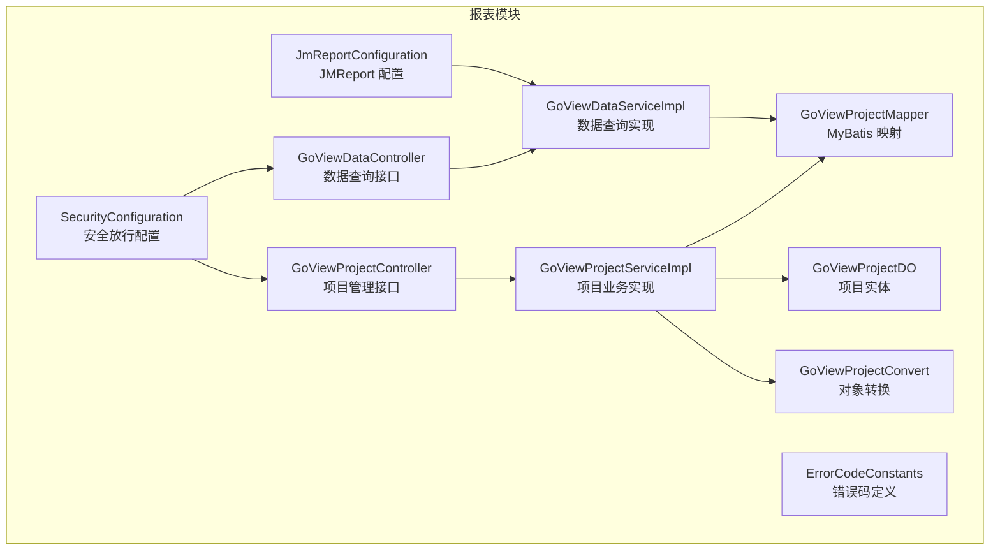
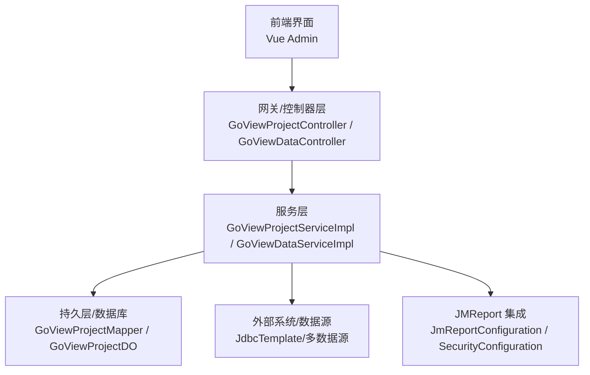
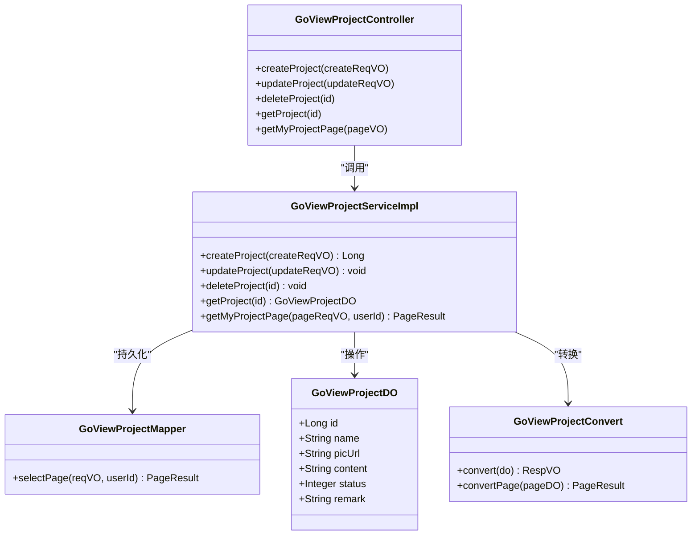
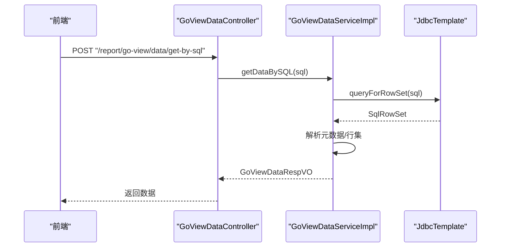
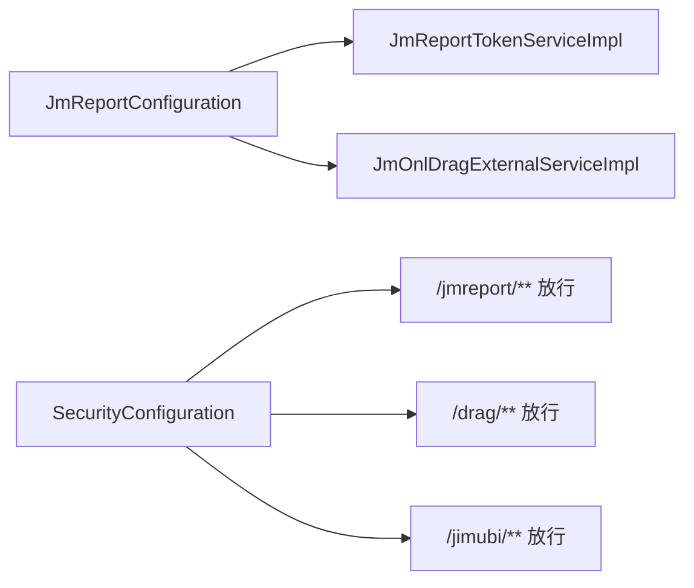
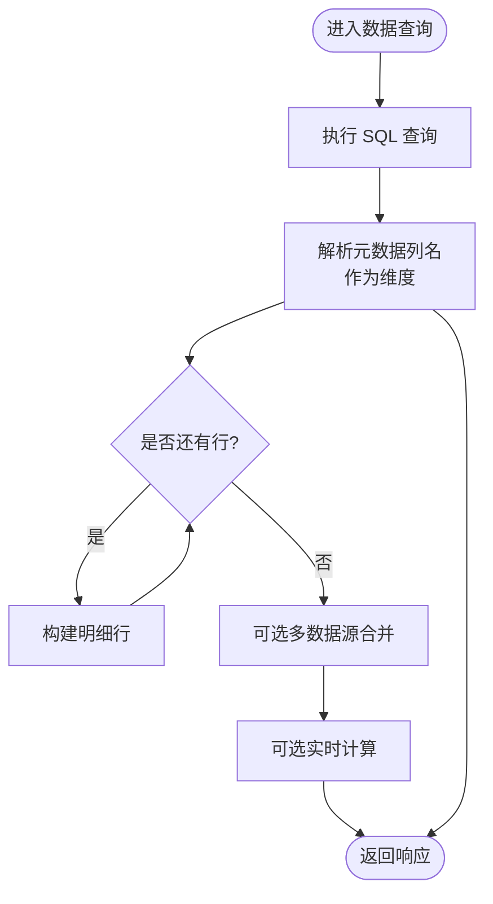
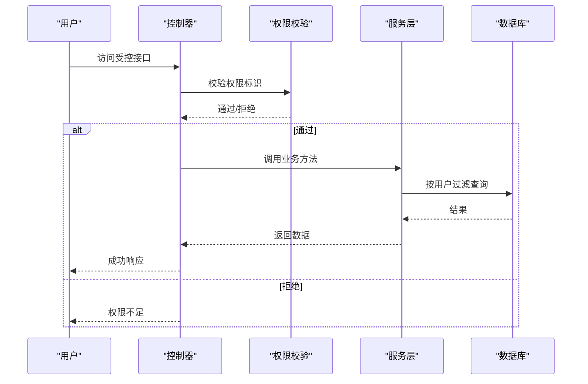
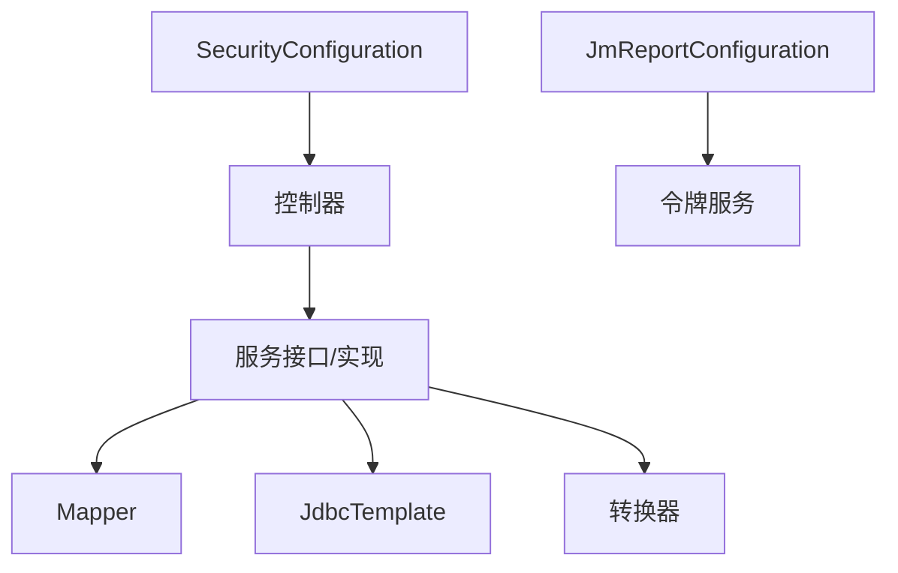

# 报表中心模块

<cite>
**本文引用的文件**
- [GoViewProjectController.java](file://yudao-module-report/src/main/java/cn/iocoder/yudao/module/report/controller/admin/goview/GoViewProjectController.java)
- [GoViewDataController.java](file://yudao-module-report/src/main/java/cn/iocoder/yudao/module/report/controller/admin/goview/GoViewDataController.java)
- [GoViewProjectServiceImpl.java](file://yudao-module-report/src/main/java/cn/iocoder/yudao/module/report/service/goview/GoViewProjectServiceImpl.java)
- [GoViewDataServiceImpl.java](file://yudao-module-report/src/main/java/cn/iocoder/yudao/module/report/service/goview/GoViewDataServiceImpl.java)
- [GoViewProjectDO.java](file://yudao-module-report/src/main/java/cn/iocoder/yudao/module/report/dal/dataobject/goview/GoViewProjectDO.java)
- [GoViewProjectMapper.java](file://yudao-module-report/src/main/java/cn/iocoder/yudao/module/report/dal/mysql/goview/GoViewProjectMapper.java)
- [JmReportConfiguration.java](file://yudao-module-report/src/main/java/cn/iocoder/yudao/module/report/framework/jmreport/config/JmReportConfiguration.java)
- [SecurityConfiguration.java](file://yudao-module-report/src/main/java/cn/iocoder/yudao/module/report/framework/security/config/SecurityConfiguration.java)
- [ErrorCodeConstants.java](file://yudao-module-report/src/main/java/cn/iocoder/yudao/module/report/enums/ErrorCodeConstants.java)
- [GoViewProjectCreateReqVO.java](file://yudao-module-report/src/main/java/cn/iocoder/yudao/module/report/controller/admin/goview/vo/project/GoViewProjectCreateReqVO.java)
- [GoViewProjectUpdateReqVO.java](file://yudao-module-report/src/main/java/cn/iocoder/yudao/module/report/controller/admin/goview/vo/project/GoViewProjectUpdateReqVO.java)
- [GoViewProjectRespVO.java](file://yudao-module-report/src/main/java/cn/iocoder/yudao/module/report/controller/admin/goview/vo/project/GoViewProjectRespVO.java)
- [GoViewDataGetBySqlReqVO.java](file://yudao-module-report/src/main/java/cn/iocoder/yudao/module/report/controller/admin/goview/vo/data/GoViewDataGetBySqlReqVO.java)
- [GoViewDataRespVO.java](file://yudao-module-report/src/main/java/cn/iocoder/yudao/module/report/controller/admin/goview/vo/data/GoViewDataRespVO.java)
- [GoViewProjectConvert.java](file://yudao-module-report/src/main/java/cn/iocoder/yudao/module/report/convert/goview/GoViewProjectConvert.java)
- [GoViewProjectService.java](file://yudao-module-report/src/main/java/cn/iocoder/yudao/module/report/service/goview/GoViewProjectService.java)
- [GoViewDataService.java](file://yudao-module-report/src/main/java/cn/iocoder/yudao/module/report/service/goview/GoViewDataService.java)
- [JmOnlDragExternalServiceImpl.java](file://yudao-module-report/src/main/java/cn/iocoder/yudao/module/report/framework/jmreport/core/service/JmOnlDragExternalServiceImpl.java)
- [JmReportTokenServiceImpl.java](file://yudao-module-report/src/main/java/cn/iocoder/yudao/module/report/framework/jmreport/core/service/JmReportTokenServiceImpl.java)
- [OAuth2TokenCommonApi.java](file://yudao-framework/yudao-common/src/main/java/cn/iocoder/yudao/framework/common/biz/system/oauth2/OAuth2TokenCommonApi.java)
- [PermissionCommonApi.java](file://yudao-framework/yudao-common/src/main/java/cn/iocoder/yudao/framework/common/biz/system/permission/PermissionCommonApi.java)
- [SecurityProperties.java](file://yudao-framework/yudao-spring-boot-starter-security/src/main/java/cn/iocoder/yudao/framework/security/config/SecurityProperties.java)
- [BannerApplicationRunner.java](file://yudao-framework/yudao-spring-boot-starter-web/src/main/java/cn/iocoder/yudao/framework/banner/core/BannerApplicationRunner.java)
- [GlobalExceptionHandler.java](file://yudao-framework/yudao-spring-boot-starter-web/src/main/java/cn/iocoder/yudao/framework/web/core/handler/GlobalExceptionHandler.java)
</cite>

## 目录
1. [引言](#引言)
2. [项目结构](#项目结构)
3. [核心组件](#核心组件)
4. [架构总览](#架构总览)
5. [详细组件分析](#详细组件分析)
6. [依赖分析](#依赖分析)
7. [性能考量](#性能考量)
8. [故障排除指南](#故障排除指南)
9. [结论](#结论)
10. [附录](#附录)

## 引言
本文件面向报表中心模块，系统性阐述在 Ruoyi-Vue-Pro 基础设施上集成 GoView 报表平台与 JMReport 报表引擎的实现方式，覆盖项目管理、数据源配置与可视化图表创建；解释 JMReport 的模板设计与数据绑定；说明报表数据的获取与处理机制（含多数据源聚合与实时计算思路）；介绍报表权限控制（数据权限与视图权限双层保护）；描述报表导出与分享能力（PDF 生成与链接分享）；并给出开发最佳实践（性能优化与缓存策略），以及集成示例、配置说明与故障排除指南。

## 项目结构
报表中心模块位于 yudao-module-report，采用“控制器-服务-持久层-枚举-转换器-框架”分层组织，支持：
- GoView 项目管理：创建、更新、删除、分页查询、按登录用户筛选
- GoView 数据查询：SQL 查询与 HTTP 示例接口
- JMReport 集成：令牌服务与拖拽外部服务的装配
- 安全配置：对 JMReport 前端路由放行

**图表来源**
- [GoViewProjectController.java:1-78](file://yudao-module-report/src/main/java/cn/iocoder/yudao/module/report/controller/admin/goview/GoViewProjectController.java#L1-L78)
- [GoViewDataController.java:1-64](file://yudao-module-report/src/main/java/cn/iocoder/yudao/module/report/controller/admin/goview/GoViewDataController.java#L1-L64)
- [GoViewProjectServiceImpl.java:1-75](file://yudao-module-report/src/main/java/cn/iocoder/yudao/module/report/service/goview/GoViewProjectServiceImpl.java#L1-L75)
- [GoViewDataServiceImpl.java:1-56](file://yudao-module-report/src/main/java/cn/iocoder/yudao/module/report/service/goview/GoViewDataServiceImpl.java#L1-L56)
- [GoViewProjectMapper.java:1-20](file://yudao-module-report/src/main/java/cn/iocoder/yudao/module/report/dal/mysql/goview/GoViewProjectMapper.java#L1-L20)
- [GoViewProjectDO.java:1-58](file://yudao-module-report/src/main/java/cn/iocoder/yudao/module/report/dal/dataobject/goview/GoViewProjectDO.java#L1-L58)
- [GoViewProjectConvert.java](file://yudao-module-report/src/main/java/cn/iocoder/yudao/module/report/convert/goview/GoViewProjectConvert.java)
- [ErrorCodeConstants.java](file://yudao-module-report/src/main/java/cn/iocoder/yudao/module/report/enums/ErrorCodeConstants.java)
- [JmReportConfiguration.java:1-38](file://yudao-module-report/src/main/java/cn/iocoder/yudao/module/report/framework/jmreport/config/JmReportConfiguration.java#L1-L38)
- [SecurityConfiguration.java:1-32](file://yudao-module-report/src/main/java/cn/iocoder/yudao/module/report/framework/security/config/SecurityConfiguration.java#L1-L32)

**章节来源**
- [GoViewProjectController.java:1-78](file://yudao-module-report/src/main/java/cn/iocoder/yudao/module/report/controller/admin/goview/GoViewProjectController.java#L1-L78)
- [GoViewDataController.java:1-64](file://yudao-module-report/src/main/java/cn/iocoder/yudao/module/report/controller/admin/goview/GoViewDataController.java#L1-L64)
- [GoViewProjectServiceImpl.java:1-75](file://yudao-module-report/src/main/java/cn/iocoder/yudao/module/report/service/goview/GoViewProjectServiceImpl.java#L1-L75)
- [GoViewDataServiceImpl.java:1-56](file://yudao-module-report/src/main/java/cn/iocoder/yudao/module/report/service/goview/GoViewDataServiceImpl.java#L1-L56)
- [GoViewProjectMapper.java:1-20](file://yudao-module-report/src/main/java/cn/iocoder/yudao/module/report/dal/mysql/goview/GoViewProjectMapper.java#L1-L20)
- [GoViewProjectDO.java:1-58](file://yudao-module-report/src/main/java/cn/iocoder/yudao/module/report/dal/dataobject/goview/GoViewProjectDO.java#L1-L58)
- [JmReportConfiguration.java:1-38](file://yudao-module-report/src/main/java/cn/iocoder/yudao/module/report/framework/jmreport/config/JmReportConfiguration.java#L1-L38)
- [SecurityConfiguration.java:1-32](file://yudao-module-report/src/main/java/cn/iocoder/yudao/module/report/framework/security/config/SecurityConfiguration.java#L1-L32)

## 核心组件
- GoView 项目管理
  - 控制器：提供创建、更新、删除、单条查询、我的项目分页接口
  - 服务：封装校验、插入、更新、删除、查询与分页
  - 持久层：基于 MyBatis-Plus 的通用 Mapper，按创建者过滤
  - 实体：包含名称、预览图、JSON 内容、状态、备注等字段
  - 转换器：负责 VO/DO 间转换
- GoView 数据查询
  - 控制器：提供 SQL 查询与 HTTP 示例接口
  - 服务：基于 JdbcTemplate 执行 SQL，解析元数据与行集，组装响应
- JMReport 集成
  - 配置类：扫描积木报表包，注册令牌服务与拖拽外部服务 Bean
  - 安全配置：对 JMReport 前端路由放行
- 错误码
  - 定义报表模块错误码区间与具体异常

**章节来源**
- [GoViewProjectController.java:35-75](file://yudao-module-report/src/main/java/cn/iocoder/yudao/module/report/controller/admin/goview/GoViewProjectController.java#L35-L75)
- [GoViewDataController.java:34-61](file://yudao-module-report/src/main/java/cn/iocoder/yudao/module/report/controller/admin/goview/GoViewDataController.java#L34-L61)
- [GoViewProjectServiceImpl.java:31-72](file://yudao-module-report/src/main/java/cn/iocoder/yudao/module/report/service/goview/GoViewProjectServiceImpl.java#L31-L72)
- [GoViewDataServiceImpl.java:32-53](file://yudao-module-report/src/main/java/cn/iocoder/yudao/module/report/service/goview/GoViewDataServiceImpl.java#L32-L53)
- [GoViewProjectMapper.java:13-17](file://yudao-module-report/src/main/java/cn/iocoder/yudao/module/report/dal/mysql/goview/GoViewProjectMapper.java#L13-L17)
- [GoViewProjectDO.java:23-57](file://yudao-module-report/src/main/java/cn/iocoder/yudao/module/report/dal/dataobject/goview/GoViewProjectDO.java#L23-L57)
- [JmReportConfiguration.java:20-37](file://yudao-module-report/src/main/java/cn/iocoder/yudao/module/report/framework/jmreport/config/JmReportConfiguration.java#L20-L37)
- [SecurityConfiguration.java:15-29](file://yudao-module-report/src/main/java/cn/iocoder/yudao/module/report/framework/security/config/SecurityConfiguration.java#L15-L29)
- [ErrorCodeConstants.java](file://yudao-module-report/src/main/java/cn/iocoder/yudao/module/report/enums/ErrorCodeConstants.java)

## 架构总览
报表中心模块在后端采用标准三层架构，前端通过 Vue Admin 界面调用后端接口；JMReport 作为独立前端应用通过放行规则直接访问。

**图表来源**
- [GoViewProjectController.java:26-75](file://yudao-module-report/src/main/java/cn/iocoder/yudao/module/report/controller/admin/goview/GoViewProjectController.java#L26-L75)
- [GoViewDataController.java:25-61](file://yudao-module-report/src/main/java/cn/iocoder/yudao/module/report/controller/admin/goview/GoViewDataController.java#L25-L61)
- [GoViewProjectServiceImpl.java:24-72](file://yudao-module-report/src/main/java/cn/iocoder/yudao/module/report/service/goview/GoViewProjectServiceImpl.java#L24-L72)
- [GoViewDataServiceImpl.java:25-53](file://yudao-module-report/src/main/java/cn/iocoder/yudao/module/report/service/goview/GoViewDataServiceImpl.java#L25-L53)
- [JmReportConfiguration.java:20-37](file://yudao-module-report/src/main/java/cn/iocoder/yudao/module/report/framework/jmreport/config/JmReportConfiguration.java#L20-L37)
- [SecurityConfiguration.java:15-29](file://yudao-module-report/src/main/java/cn/iocoder/yudao/module/report/framework/security/config/SecurityConfiguration.java#L15-L29)

## 详细组件分析

### GoView 项目管理组件
- 控制器职责
  - 创建项目：鉴权与参数校验后委托服务层
  - 更新项目：鉴权与参数校验后执行更新
  - 删除项目：鉴权与存在性校验后删除
  - 获取项目：鉴权后查询并转换返回
  - 我的项目分页：按当前登录用户过滤并分页返回
- 服务层职责
  - 插入新项目，默认状态为未发布
  - 更新与删除均进行存在性校验
  - 分页查询按创建者排序
- 持久层与实体
  - Mapper 提供按创建者分页查询
  - 实体包含名称、预览图、JSON 内容、状态、备注等字段

**图表来源**
- [GoViewProjectController.java:30-75](file://yudao-module-report/src/main/java/cn/iocoder/yudao/module/report/controller/admin/goview/GoViewProjectController.java#L30-L75)
- [GoViewProjectServiceImpl.java:24-72](file://yudao-module-report/src/main/java/cn/iocoder/yudao/module/report/service/goview/GoViewProjectServiceImpl.java#L24-L72)
- [GoViewProjectMapper.java:10-17](file://yudao-module-report/src/main/java/cn/iocoder/yudao/module/report/dal/mysql/goview/GoViewProjectMapper.java#L10-L17)
- [GoViewProjectDO.java:23-57](file://yudao-module-report/src/main/java/cn/iocoder/yudao/module/report/dal/dataobject/goview/GoViewProjectDO.java#L23-L57)
- [GoViewProjectConvert.java](file://yudao-module-report/src/main/java/cn/iocoder/yudao/module/report/convert/goview/GoViewProjectConvert.java)

**章节来源**
- [GoViewProjectController.java:35-75](file://yudao-module-report/src/main/java/cn/iocoder/yudao/module/report/controller/admin/goview/GoViewProjectController.java#L35-L75)
- [GoViewProjectServiceImpl.java:31-72](file://yudao-module-report/src/main/java/cn/iocoder/yudao/module/report/service/goview/GoViewProjectServiceImpl.java#L31-L72)
- [GoViewProjectMapper.java:13-17](file://yudao-module-report/src/main/java/cn/iocoder/yudao/module/report/dal/mysql/goview/GoViewProjectMapper.java#L13-L17)
- [GoViewProjectDO.java:23-57](file://yudao-module-report/src/main/java/cn/iocoder/yudao/module/report/dal/dataobject/goview/GoViewProjectDO.java#L23-L57)

### GoView 数据查询组件
- 控制器职责
  - SQL 查询：接收 SQL 请求，鉴权后委托服务层执行
  - HTTP 示例：演示如何接收请求参数与请求体，构造维度与明细数据
- 服务层职责
  - 使用 JdbcTemplate 执行 SQL，解析元数据列名作为维度
  - 遍历行集构建明细列表，返回统一响应结构

**图表来源**
- [GoViewDataController.java:34-39](file://yudao-module-report/src/main/java/cn/iocoder/yudao/module/report/controller/admin/goview/GoViewDataController.java#L34-L39)
- [GoViewDataServiceImpl.java:32-53](file://yudao-module-report/src/main/java/cn/iocoder/yudao/module/report/service/goview/GoViewDataServiceImpl.java#L32-L53)

**章节来源**
- [GoViewDataController.java:34-61](file://yudao-module-report/src/main/java/cn/iocoder/yudao/module/report/controller/admin/goview/GoViewDataController.java#L34-L61)
- [GoViewDataServiceImpl.java:32-53](file://yudao-module-report/src/main/java/cn/iocoder/yudao/module/report/service/goview/GoViewDataServiceImpl.java#L32-L53)

### JMReport 集成组件
- 配置类职责
  - 组件扫描积木报表包
  - 注册令牌服务 Bean，注入 OAuth2 与权限 API、安全属性
  - 可选注册拖拽外部服务 Bean
- 安全配置职责
  - 对 JMReport 前端路由放行，便于直接访问

**图表来源**
- [JmReportConfiguration.java:20-37](file://yudao-module-report/src/main/java/cn/iocoder/yudao/module/report/framework/jmreport/config/JmReportConfiguration.java#L20-L37)
- [SecurityConfiguration.java:15-29](file://yudao-module-report/src/main/java/cn/iocoder/yudao/module/report/framework/security/config/SecurityConfiguration.java#L15-L29)

**章节来源**
- [JmReportConfiguration.java:20-37](file://yudao-module-report/src/main/java/cn/iocoder/yudao/module/report/framework/jmreport/config/JmReportConfiguration.java#L20-L37)
- [SecurityConfiguration.java:15-29](file://yudao-module-report/src/main/java/cn/iocoder/yudao/module/report/framework/security/config/SecurityConfiguration.java#L15-L29)

### 报表数据获取与处理机制
- 单数据源查询
  - 通过 JdbcTemplate 执行 SQL，解析列名作为维度，逐行构建明细集合
- 多数据源聚合
  - 当前实现默认使用单一数据源；如需多数据源，可在服务层扩展对应数据源的 JdbcTemplate 并合并结果
- 实时计算
  - 可在服务层对查询结果进行二次聚合或计算，以满足实时展示需求

**图表来源**
- [GoViewDataServiceImpl.java:32-53](file://yudao-module-report/src/main/java/cn/iocoder/yudao/module/report/service/goview/GoViewDataServiceImpl.java#L32-L53)

**章节来源**
- [GoViewDataServiceImpl.java:16-24](file://yudao-module-report/src/main/java/cn/iocoder/yudao/module/report/service/goview/GoViewDataServiceImpl.java#L16-L24)

### 报表权限控制
- 视图权限
  - 控制器使用注解式鉴权，要求具备相应权限标识
- 数据权限
  - 项目分页查询按当前登录用户过滤，避免越权查看他人项目
- 安全放行
  - 对 JMReport 前端路由放行，便于其独立运行

**图表来源**
- [GoViewProjectController.java:35-75](file://yudao-module-report/src/main/java/cn/iocoder/yudao/module/report/controller/admin/goview/GoViewProjectController.java#L35-L75)
- [GoViewProjectMapper.java:13-17](file://yudao-module-report/src/main/java/cn/iocoder/yudao/module/report/dal/mysql/goview/GoViewProjectMapper.java#L13-L17)

**章节来源**
- [GoViewProjectController.java:35-75](file://yudao-module-report/src/main/java/cn/iocoder/yudao/module/report/controller/admin/goview/GoViewProjectController.java#L35-L75)
- [GoViewProjectMapper.java:13-17](file://yudao-module-report/src/main/java/cn/iocoder/yudao/module/report/dal/mysql/goview/GoViewProjectMapper.java#L13-L17)
- [SecurityConfiguration.java:20-26](file://yudao-module-report/src/main/java/cn/iocoder/yudao/module/report/framework/security/config/SecurityConfiguration.java#L20-L26)

### 报表导出与分享
- 导出能力
  - 可在服务层对查询结果进行二次处理，结合前端或第三方库实现 PDF/Excel 导出
- 分享能力
  - 通过生成带权限令牌的链接，结合安全配置与令牌服务实现受控分享

[本节为概念性说明，不直接分析具体文件，故不附加章节来源]

### 报表开发最佳实践
- 性能优化
  - 合理使用索引与分页，避免一次性加载大量明细
  - 对高频查询结果进行缓存，降低数据库压力
- 缓存策略
  - 使用分布式缓存存储热点报表数据，设置合理过期时间
- 多数据源
  - 在服务层按需扩展不同数据源的 JdbcTemplate，并统一合并策略

[本节为通用建议，不直接分析具体文件，故不附加章节来源]

## 依赖分析
- 组件耦合
  - 控制器仅依赖服务接口，保持低耦合
  - 服务层依赖 Mapper 与转换器，职责清晰
- 外部依赖
  - JdbcTemplate 用于 SQL 查询
  - MyBatis-Plus 提供通用 Mapper 能力
  - Spring Security 注解实现权限控制
  - JMReport 配置类与安全配置类分别承担集成与放行职责

**图表来源**
- [GoViewProjectController.java:30-33](file://yudao-module-report/src/main/java/cn/iocoder/yudao/module/report/controller/admin/goview/GoViewProjectController.java#L30-L33)
- [GoViewDataController.java:31-32](file://yudao-module-report/src/main/java/cn/iocoder/yudao/module/report/controller/admin/goview/GoViewDataController.java#L31-L32)
- [GoViewProjectServiceImpl.java:28-29](file://yudao-module-report/src/main/java/cn/iocoder/yudao/module/report/service/goview/GoViewProjectServiceImpl.java#L28-L29)
- [GoViewDataServiceImpl.java:29-30](file://yudao-module-report/src/main/java/cn/iocoder/yudao/module/report/service/goview/GoViewDataServiceImpl.java#L29-L30)
- [JmReportConfiguration.java:24-35](file://yudao-module-report/src/main/java/cn/iocoder/yudao/module/report/framework/jmreport/config/JmReportConfiguration.java#L24-L35)
- [SecurityConfiguration.java:15-29](file://yudao-module-report/src/main/java/cn/iocoder/yudao/module/report/framework/security/config/SecurityConfiguration.java#L15-L29)

**章节来源**
- [GoViewProjectController.java:30-33](file://yudao-module-report/src/main/java/cn/iocoder/yudao/module/report/controller/admin/goview/GoViewProjectController.java#L30-L33)
- [GoViewDataController.java:31-32](file://yudao-module-report/src/main/java/cn/iocoder/yudao/module/report/controller/admin/goview/GoViewDataController.java#L31-L32)
- [GoViewProjectServiceImpl.java:28-29](file://yudao-module-report/src/main/java/cn/iocoder/yudao/module/report/service/goview/GoViewProjectServiceImpl.java#L28-L29)
- [GoViewDataServiceImpl.java:29-30](file://yudao-module-report/src/main/java/cn/iocoder/yudao/module/report/service/goview/GoViewDataServiceImpl.java#L29-L30)
- [JmReportConfiguration.java:24-35](file://yudao-module-report/src/main/java/cn/iocoder/yudao/module/report/framework/jmreport/config/JmReportConfiguration.java#L24-L35)
- [SecurityConfiguration.java:15-29](file://yudao-module-report/src/main/java/cn/iocoder/yudao/module/report/framework/security/config/SecurityConfiguration.java#L15-L29)

## 性能考量
- 查询性能
  - 使用分页与索引，避免全表扫描
  - 对高并发场景，优先使用只读副本或缓存
- 内存与序列化
  - 服务层使用链表存储明细，减少扩容复制开销
- 多数据源
  - 按需扩展数据源连接池，避免阻塞

[本节为通用建议，不直接分析具体文件，故不附加章节来源]

## 故障排除指南
- 模块未启用提示
  - 若控制台提示报表模块已禁用，请检查模块是否正确引入与打包
- 表结构未导入
  - 若出现表结构未导入提示，请根据文档指引导入相关 SQL
- 权限不足
  - 确认接口权限标识是否正确配置，且当前用户具备相应角色

**章节来源**
- [BannerApplicationRunner.java:32-34](file://yudao-framework/yudao-spring-boot-starter-web/src/main/java/cn/iocoder/yudao/framework/banner/core/BannerApplicationRunner.java#L32-L34)
- [GlobalExceptionHandler.java:395-399](file://yudao-framework/yudao-spring-boot-starter-web/src/main/java/cn/iocoder/yudao/framework/web/core/handler/GlobalExceptionHandler.java#L395-L399)

## 结论
报表中心模块通过清晰的分层设计与权限控制，实现了对 GoView 项目的管理与数据查询能力，并提供了 JMReport 的集成入口与安全放行策略。结合多数据源扩展与缓存策略，可进一步提升性能与可用性。建议在生产环境中完善导出与分享能力，并持续优化查询与缓存策略以应对高并发场景。

## 附录
- 集成示例
  - 项目管理：通过控制器提供的创建/更新/删除/查询接口完成项目生命周期管理
  - 数据查询：通过 SQL 查询接口获取可视化所需数据
- 配置说明
  - JMReport 配置类负责注册令牌服务与拖拽外部服务
  - 安全配置类对 JMReport 前端路由放行
- 错误码
  - 报表模块错误码区间与具体异常定义见错误码常量类

**章节来源**
- [JmReportConfiguration.java:20-37](file://yudao-module-report/src/main/java/cn/iocoder/yudao/module/report/framework/jmreport/config/JmReportConfiguration.java#L20-L37)
- [SecurityConfiguration.java:15-29](file://yudao-module-report/src/main/java/cn/iocoder/yudao/module/report/framework/security/config/SecurityConfiguration.java#L15-L29)
- [ErrorCodeConstants.java](file://yudao-module-report/src/main/java/cn/iocoder/yudao/module/report/enums/ErrorCodeConstants.java)