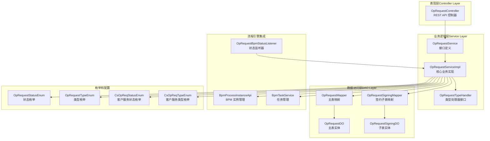
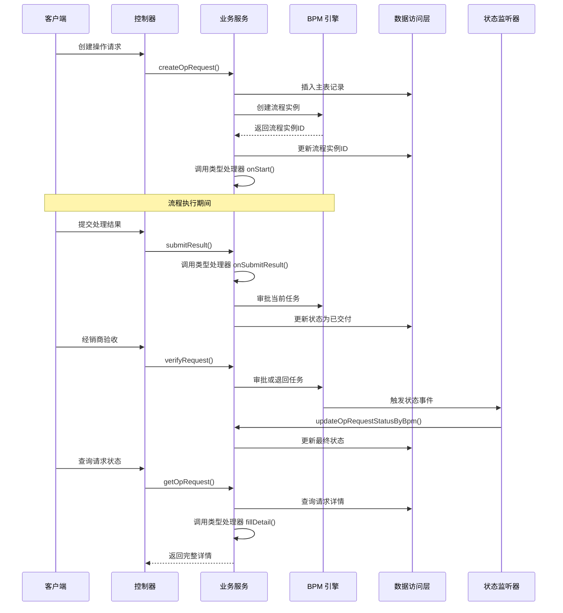
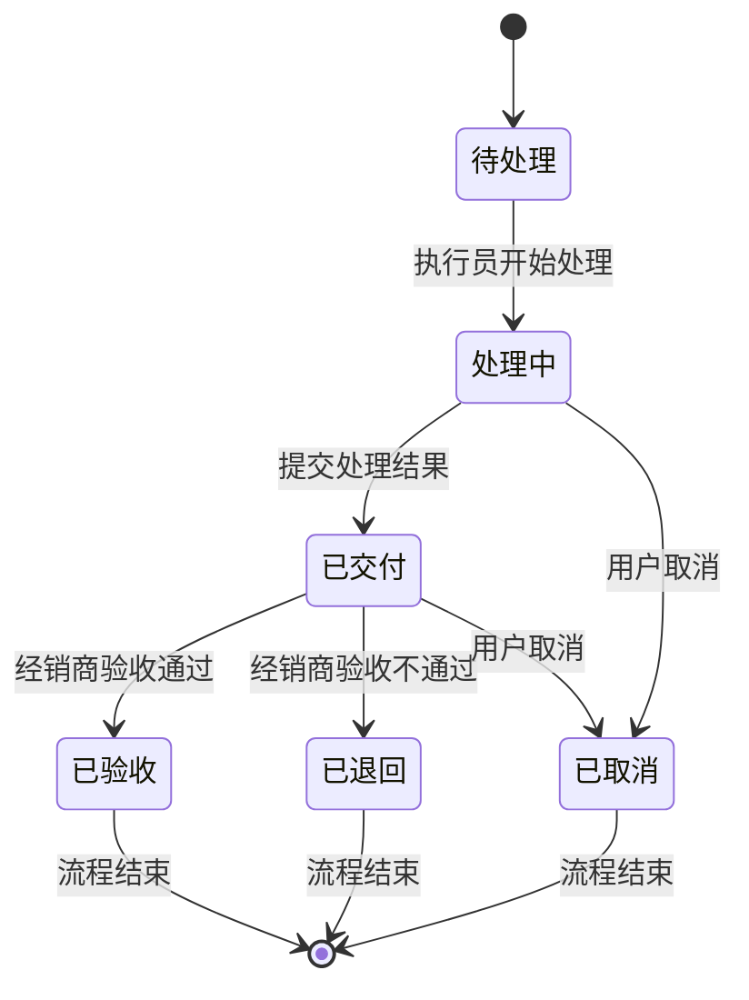
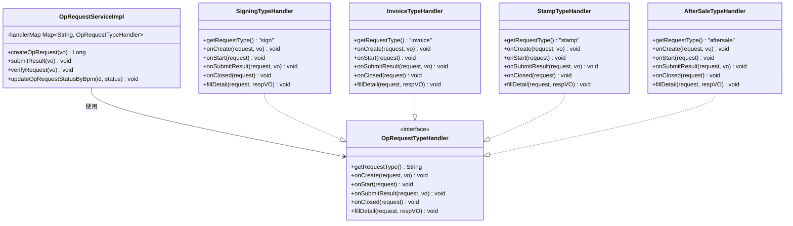
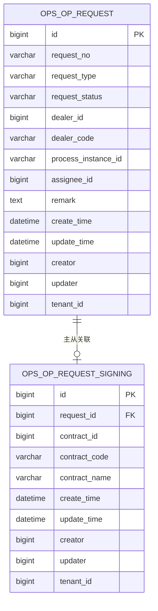
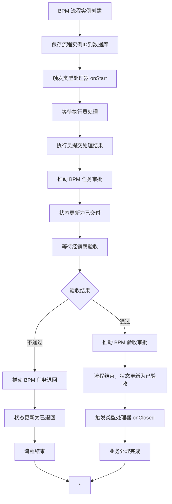
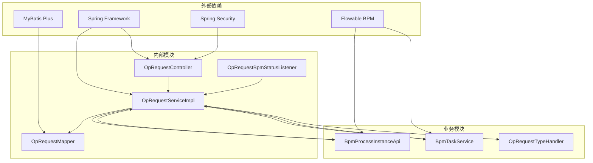

# 操作请求工作流模块

<cite>
**本文档引用的文件**
- [OpRequestController.java](file://yudao-module-opshub/src/main/java/cn/iocoder/yudao/module/opshub/controller/admin/oprequest/OpRequestController.java)
- [OpRequestService.java](file://yudao-module-opshub/src/main/java/cn/iocoder/yudao/module/opshub/service/oprequest/OpRequestService.java)
- [OpRequestServiceImpl.java](file://yudao-module-opshub/src/main/java/cn/iocoder/yudao/module/opshub/service/oprequest/impl/OpRequestServiceImpl.java)
- [OpRequestTypeHandler.java](file://yudao-module-opshub/src/main/java/cn/iocoder/yudao/module/opshub/service/oprequest/handler/OpRequestTypeHandler.java)
- [OpRequestDO.java](file://yudao-module-opshub/src/main/java/cn/iocoder/yudao/module/opshub/dal/dataobject/oprequest/OpRequestDO.java)
- [OpRequestSigningDO.java](file://yudao-module-opshub/src/main/java/cn/iocoder/yudao/module/opshub/dal/dataobject/oprequest/OpRequestSigningDO.java)
- [OpRequestMapper.java](file://yudao-module-opshub/src/main/java/cn/iocoder/yudao/module/opshub/dal/mysql/oprequest/OpRequestMapper.java)
- [OpRequestSigningMapper.java](file://yudao-module-opshub/src/main/java/cn/iocoder/yudao/module/opshub/dal/mysql/oprequest/OpRequestSigningMapper.java)
- [OpRequestBpmStatusListener.java](file://yudao-module-opshub/src/main/java/cn/iocoder/yudao/module/opshub/service/oprequest/listener/OpRequestBpmStatusListener.java)
- [OpRequestStatusEnum.java](file://yudao-module-opshub/src/main/java/cn/iocoder/yudao/module/opshub/enums/OpRequestStatusEnum.java)
- [OpRequestTypeEnum.java](file://yudao-module-opshub/src/main/java/cn/iocoder/yudao/module/opshub/enums/OpRequestTypeEnum.java)
- [CsOpReqStatusEnum.java](file://yudao-module-opshub/src/main/java/cn/iocoder/yudao/module/opshub/enums/CsOpReqStatusEnum.java)
- [CsOpReqTypeEnum.java](file://yudao-module-opshub/src/main/java/cn/iocoder/yudao/module/opshub/enums/CsOpReqTypeEnum.java)
</cite>

## 目录
1. [简介](#简介)
2. [项目结构](#项目结构)
3. [核心组件](#核心组件)
4. [架构概览](#架构概览)
5. [详细组件分析](#详细组件分析)
6. [依赖关系分析](#依赖关系分析)
7. [性能考虑](#性能考虑)
8. [故障排除指南](#故障排除指南)
9. [结论](#结论)

## 简介

操作请求工作流模块是基于 BPM（业务流程管理）引擎构建的企业级工作流管理系统，专门用于处理各种业务操作请求。该模块实现了完整的业务流程生命周期管理，包括请求创建、流程启动、执行员处理、经销商验收和流程终结等环节。

该模块采用策略模式和工厂模式相结合的设计，支持多种操作类型（签约、开票、盖章、售后），并通过 BPM 引擎实现流程自动化。系统通过事件驱动的方式实现流程状态的实时同步，并提供完善的权限控制和审计功能。

## 项目结构

操作请求工作流模块遵循标准的分层架构设计，主要包含以下层次：

**图表来源**
- [OpRequestController.java:1-78](file://yudao-module-opshub/src/main/java/cn/iocoder/yudao/module/opshub/controller/admin/oprequest/OpRequestController.java#L1-L78)
- [OpRequestServiceImpl.java:1-298](file://yudao-module-opshub/src/main/java/cn/iocoder/yudao/module/opshub/service/oprequest/impl/OpRequestServiceImpl.java#L1-L298)

**章节来源**
- [OpRequestController.java:1-78](file://yudao-module-opshub/src/main/java/cn/iocoder/yudao/module/opshub/controller/admin/oprequest/OpRequestController.java#L1-L78)
- [OpRequestService.java:1-48](file://yudao-module-opshub/src/main/java/cn/iocoder/yudao/module/opshub/service/oprequest/OpRequestService.java#L1-L48)

## 核心组件

### 1. 控制器层

控制器层负责处理外部请求和响应，提供 RESTful API 接口：

- **OpRequestController**: 提供操作请求的完整 CRUD 操作
- **权限控制**: 基于 Spring Security 的细粒度权限控制
- **参数验证**: 使用 Bean Validation 进行参数校验

### 2. 业务逻辑层

业务逻辑层是系统的核心，实现复杂的业务规则和流程控制：

- **OpRequestService**: 定义操作请求的标准业务接口
- **OpRequestServiceImpl**: 实现核心业务逻辑，包括流程编排
- **OpRequestTypeHandler**: 策略接口，支持不同类型的操作请求

### 3. 数据持久化层

数据持久化层提供数据访问和对象关系映射：

- **OpRequestMapper**: 主表数据访问接口
- **OpRequestSigningMapper**: 签约子表数据访问接口
- **实体类**: 封装数据库表结构和业务属性

### 4. 流程引擎集成

与 BPM 引擎的深度集成确保了流程的自动化执行：

- **BpmProcessInstanceApi**: BPM 实例创建和管理
- **BpmTaskService**: 任务审批和状态变更
- **OpRequestBpmStatusListener**: 流程状态事件监听

**章节来源**
- [OpRequestService.java:1-48](file://yudao-module-opshub/src/main/java/cn/iocoder/yudao/module/opshub/service/oprequest/OpRequestService.java#L1-L48)
- [OpRequestServiceImpl.java:1-298](file://yudao-module-opshub/src/main/java/cn/iocoder/yudao/module/opshub/service/oprequest/impl/OpRequestServiceImpl.java#L1-L298)

## 架构概览

操作请求工作流采用事件驱动的异步架构，实现了业务逻辑与流程控制的解耦：

**图表来源**
- [OpRequestController.java:29-75](file://yudao-module-opshub/src/main/java/cn/iocoder/yudao/module/opshub/controller/admin/oprequest/OpRequestController.java#L29-L75)
- [OpRequestServiceImpl.java:74-186](file://yudao-module-opshub/src/main/java/cn/iocoder/yudao/module/opshub/service/oprequest/impl/OpRequestServiceImpl.java#L74-L186)
- [OpRequestBpmStatusListener.java:24-28](file://yudao-module-opshub/src/main/java/cn/iocoder/yudao/module/opshub/service/oprequest/listener/OpRequestBpmStatusListener.java#L24-L28)

## 详细组件分析

### 1. 操作请求状态管理

系统实现了完整的工作流状态管理机制，确保业务流程的可控性和可追溯性：

**状态枚举定义**：
- **WAITING**: 待处理 - 初始状态，等待执行员处理
- **IN_PROGRESS**: 处理中 - 执行员正在处理业务
- **DELIVERED**: 已交付 - 执行员已完成处理，等待验收
- **CLOSED**: 已验收 - 经销商验收通过，流程结束
- **REJECTED**: 已退回 - 经销商验收不通过，流程结束
- **CANCEL**: 已取消 - 用户主动取消，流程结束

**章节来源**
- [OpRequestStatusEnum.java:1-39](file://yudao-module-opshub/src/main/java/cn/iocoder/yudao/module/opshub/enums/OpRequestStatusEnum.java#L1-L39)

### 2. 操作请求类型管理

系统支持多种操作类型的灵活扩展，通过策略模式实现类型特定的业务逻辑：

**支持的操作类型**：
- **SIGN**: 签约操作 - 处理合同签署相关的业务
- **INVOICE**: 开票操作 - 处理发票开具相关的业务  
- **STAMP**: 盖章操作 - 处理印章使用的相关业务
- **AFTERSALE**: 售后操作 - 处理售后服务相关的业务

**章节来源**
- [OpRequestTypeHandler.java:1-47](file://yudao-module-opshub/src/main/java/cn/iocoder/yudao/module/opshub/service/oprequest/handler/OpRequestTypeHandler.java#L1-L47)
- [OpRequestTypeEnum.java:1-37](file://yudao-module-opshub/src/main/java/cn/iocoder/yudao/module/opshub/enums/OpRequestTypeEnum.java#L1-L37)

### 3. 数据模型设计

系统采用主从表结构设计，支持不同类型操作的特定数据存储：

**主表字段说明**：
- **id**: 主键标识
- **requestNo**: 自动生成的请求编号（格式：OP-YYYYMMDD-NNN）
- **requestType**: 操作类型编码
- **requestStatus**: 当前状态
- **dealerId/dealerCode**: 经销商相关信息
- **processInstanceId**: BPM 流程实例ID
- **assigneeId**: 当前处理人ID
- **remark**: 备注信息

**子表设计**：
- **签约子表**: 存储与合同相关的特定信息
- **扩展性**: 支持未来添加更多子表以满足不同操作类型的需求

**章节来源**
- [OpRequestDO.java:1-68](file://yudao-module-opshub/src/main/java/cn/iocoder/yudao/module/opshub/dal/dataobject/oprequest/OpRequestDO.java#L1-L68)
- [OpRequestSigningDO.java:1-42](file://yudao-module-opshub/src/main/java/cn/iocoder/yudao/module/opshub/dal/dataobject/oprequest/OpRequestSigningDO.java#L1-L42)

### 4. API 接口设计

系统提供完整的 RESTful API 接口，支持操作请求的全生命周期管理：

| 接口 | 方法 | 路径 | 权限 | 功能描述 |
|------|------|------|------|----------|
| 创建操作请求 | POST | /opshub/op-request/create | dealer:op-request:create | 创建新的操作请求 |
| 获取操作请求分页 | GET | /opshub/op-request/page | dealer:op-request:query | 分页查询操作请求列表 |
| 获取操作请求详情 | GET | /opshub/op-request/get | dealer:op-request:query | 获取单个操作请求详情 |
| 提交处理结果 | POST | /opshub/op-request/submit-result | dealer:op-request:process | 执行员提交处理结果 |
| 经销商验收 | POST | /opshub/op-request/verify | dealer:op-request:verify | 经销商进行验收操作 |
| 获取进行中请求 | GET | /opshub/op-request/get-active-by-contract | dealer:op-request:query | 根据合同ID获取进行中的请求 |

**章节来源**
- [OpRequestController.java:29-75](file://yudao-module-opshub/src/main/java/cn/iocoder/yudao/module/opshub/controller/admin/oprequest/OpRequestController.java#L29-L75)

### 5. BPM 集成机制

系统通过事件驱动的方式与 BPM 引擎深度集成，实现流程状态的实时同步：

**图表来源**
- [OpRequestServiceImpl.java:94-108](file://yudao-module-opshub/src/main/java/cn/iocoder/yudao/module/opshub/service/oprequest/impl/OpRequestServiceImpl.java#L94-L108)
- [OpRequestServiceImpl.java:178-186](file://yudao-module-opshub/src/main/java/cn/iocoder/yudao/module/opshub/service/oprequest/impl/OpRequestServiceImpl.java#L178-L186)

**章节来源**
- [OpRequestBpmStatusListener.java:1-31](file://yudao-module-opshub/src/main/java/cn/iocoder/yudao/module/opshub/service/oprequest/listener/OpRequestBpmStatusListener.java#L1-L31)

## 依赖关系分析

操作请求工作流模块的依赖关系体现了清晰的分层架构和松耦合设计：

**主要依赖特点**：
- **低耦合高内聚**: 各组件职责明确，依赖关系清晰
- **接口隔离**: 通过接口定义规范各组件间的交互
- **可扩展性**: 策略模式支持新类型操作的快速添加
- **事务一致性**: 核心业务逻辑在统一的事务边界内执行

**章节来源**
- [OpRequestServiceImpl.java:55-58](file://yudao-module-opshub/src/main/java/cn/iocoder/yudao/module/opshub/service/oprequest/impl/OpRequestServiceImpl.java#L55-L58)

## 性能考虑

### 1. 数据访问优化

- **分页查询**: 主表查询默认按ID降序排列，支持关键词搜索
- **条件过滤**: 支持按类型、状态、经销商编码等多维度过滤
- **索引设计**: 建议在常用查询字段上建立适当索引

### 2. 缓存策略

- **状态枚举缓存**: 枚举值使用静态缓存，减少重复创建
- **处理器缓存**: 类型处理器通过Map缓存，避免重复实例化
- **请求编号生成**: 可考虑引入数据库序列或Redis优化

### 3. 并发控制

- **乐观锁**: 使用版本号防止并发更新冲突
- **事务边界**: 核心业务逻辑在统一事务中执行
- **BPM 任务锁定**: 通过流程引擎保证任务处理的原子性

## 故障排除指南

### 1. 常见问题诊断

**问题**: BPM 任务审批失败
- **检查**: 流程实例ID是否正确
- **验证**: 当前任务是否存在且未被其他用户处理
- **日志**: 查看审批失败的具体异常信息

**问题**: 请求状态更新异常
- **检查**: BPM 状态事件是否正确触发
- **验证**: 监听器是否正确注册
- **日志**: 确认状态转换逻辑的执行情况

**问题**: 类型处理器未生效
- **检查**: 处理器是否正确注册到Spring容器
- **验证**: requestType 是否与处理器支持的类型匹配
- **日志**: 确认处理器方法的调用链

### 2. 错误码对照

| 错误码 | 错误描述 | 可能原因 | 解决方案 |
|--------|----------|----------|----------|
| OP_REQUEST_NOT_EXISTS | 操作请求不存在 | 请求ID错误或已被删除 | 验证请求ID的有效性 |
| OP_REQUEST_STATUS_INVALID | 操作请求状态无效 | 当前状态不允许该操作 | 检查状态转换规则 |
| OP_REQUEST_TYPE_NOT_SUPPORTED | 不支持的操作类型 | 类型编码错误 | 确认类型处理器已实现 |

**章节来源**
- [OpRequestServiceImpl.java:140-147](file://yudao-module-opshub/src/main/java/cn/iocoder/yudao/module/opshub/service/oprequest/impl/OpRequestServiceImpl.java#L140-L147)
- [OpRequestServiceImpl.java:225-228](file://yudao-module-opshub/src/main/java/cn/iocoder/yudao/module/opshub/service/oprequest/impl/OpRequestServiceImpl.java#L225-L228)

### 3. 日志监控

系统提供了完善的日志记录机制，便于问题排查和性能监控：

- **操作日志**: 记录关键业务操作的时间戳和操作人
- **异常日志**: 详细记录异常堆栈信息
- **流程日志**: 跟踪流程状态变化的完整轨迹

## 结论

操作请求工作流模块是一个设计精良、功能完备的企业级工作流管理系统。其核心优势包括：

1. **架构清晰**: 采用分层架构和策略模式，具有良好的可维护性和扩展性
2. **流程自动化**: 深度集成 BPM 引擎，实现业务流程的自动化执行
3. **类型扩展**: 通过策略接口支持多种操作类型的灵活扩展
4. **状态管理**: 完整的工作流状态管理，确保业务流程的可控性
5. **权限控制**: 基于角色的细粒度权限控制，保障系统安全

该模块为企业的业务流程数字化转型提供了坚实的技术基础，能够有效提升业务处理效率和管理水平。通过持续的优化和扩展，可以满足更多复杂业务场景的需求。