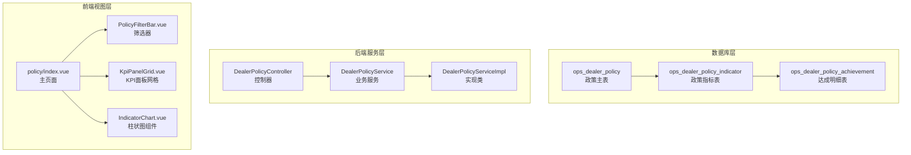
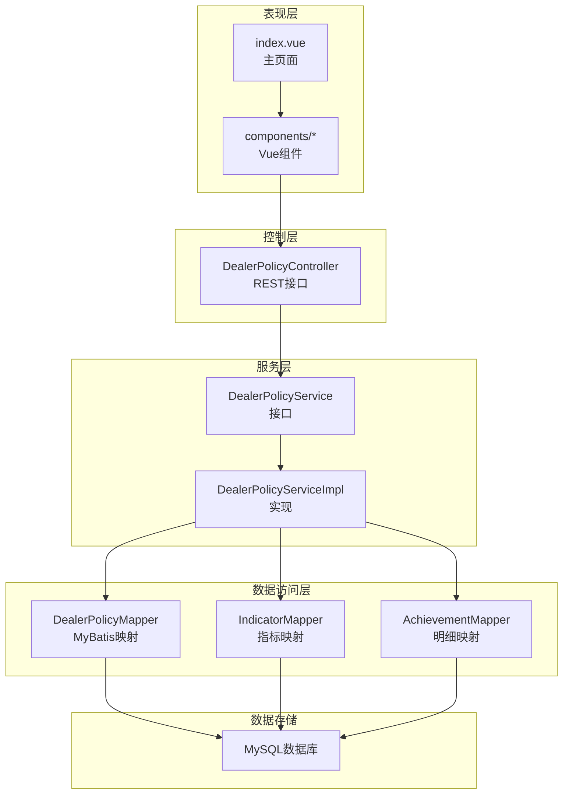
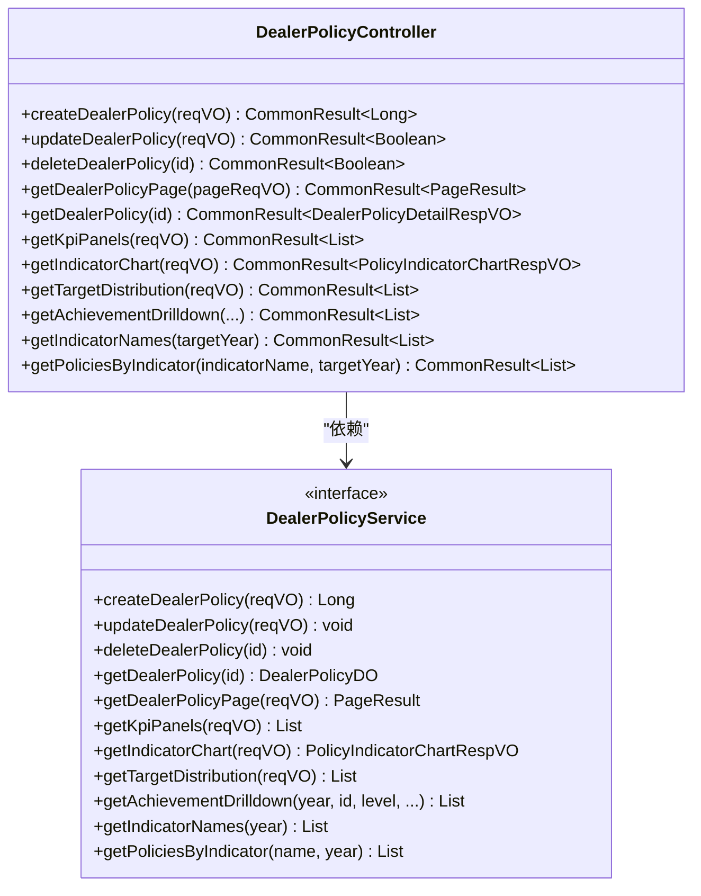
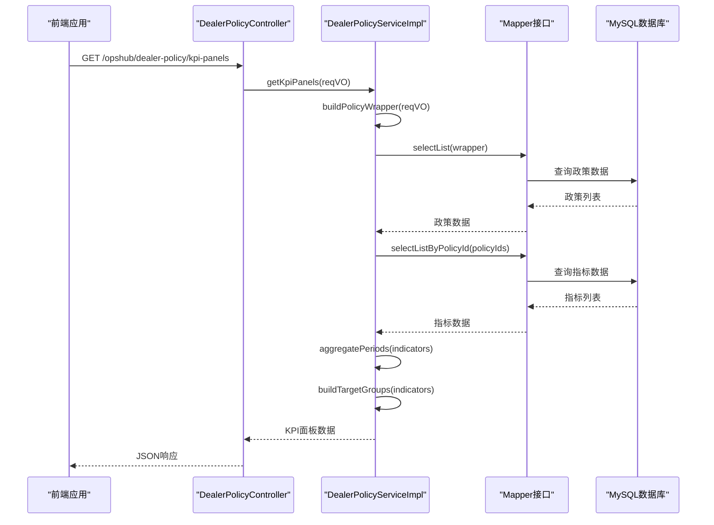
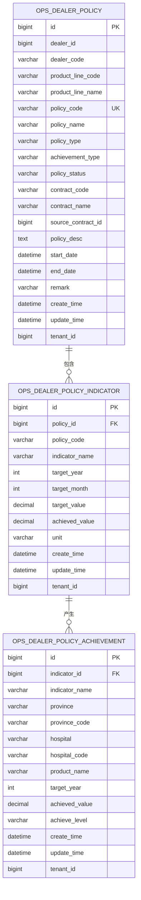
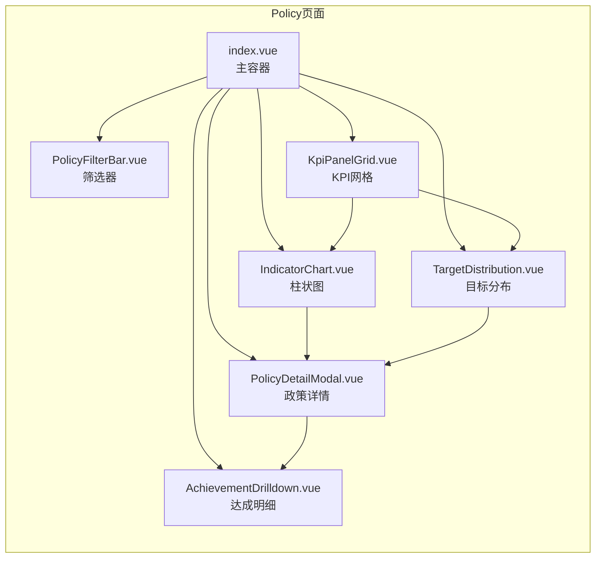
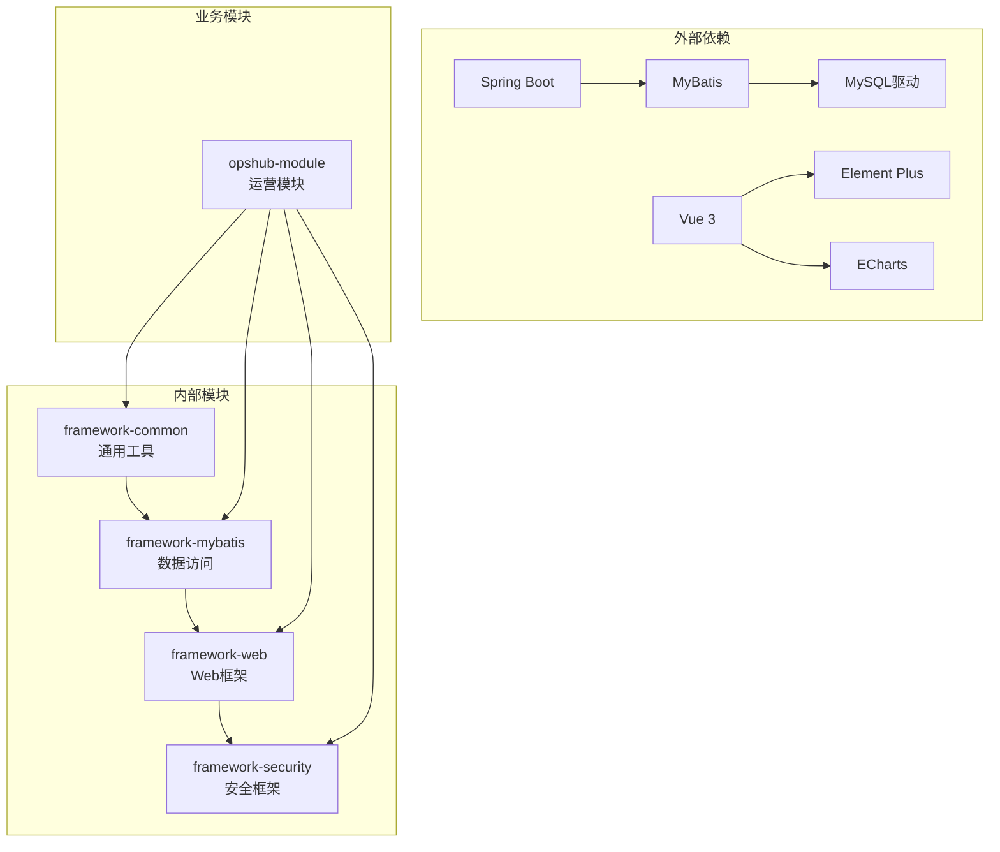
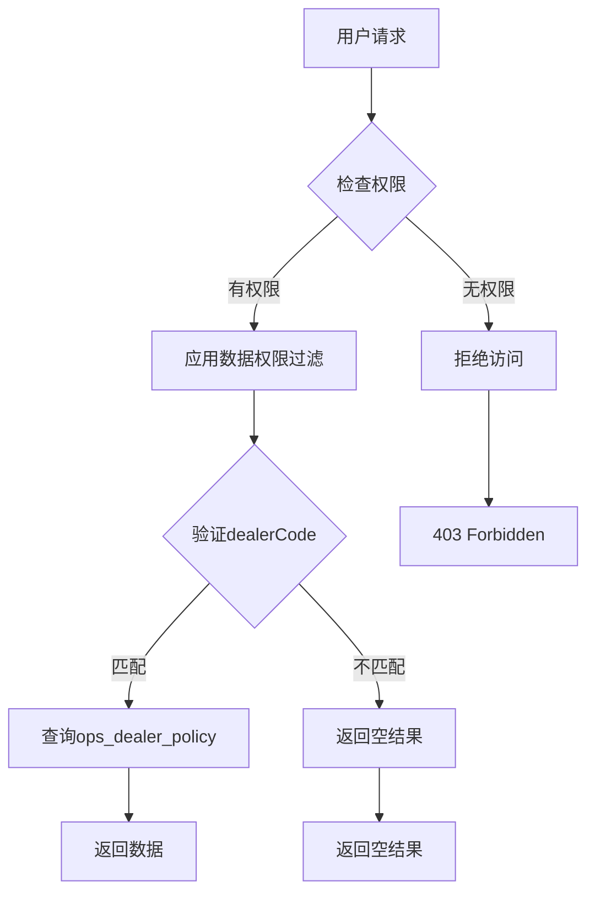

# 政策看板模块

<cite>
**本文档引用的文件**
- [PRD-Step19-政策看板模块.md](file://docs/PRD-Step19-政策看板模块.md)
- [feature_step19-政策看板_ddl.sql](file://db/branches/feature_step19-政策看板/feature_step19-政策看板_ddl.sql)
- [feature_step19-政策看板_dml.sql](file://db/branches/feature_step19-政策看板/feature_step19-政策看板_dml.sql)
- [DealerPolicyController.java](file://yudao-module-opshub/src/main/java/cn/iocoder/yudao/module/opshub/controller/admin/policy/DealerPolicyController.java)
- [DealerPolicyServiceImpl.java](file://yudao-module-opshub/src/main/java/cn/iocoder/yudao/module/opshub/service/policy/DealerPolicyServiceImpl.java)
- [PolicyTypeEnum.java](file://yudao-module-opshub/src/main/java/cn/iocoder/yudao/module/opshub/enums/PolicyTypeEnum.java)
- [index.vue](file://yudao-ui/yudao-ui-admin-vue3/src/views/opshub/policy/index.vue)
</cite>

## 目录
1. [简介](#简介)
2. [项目结构](#项目结构)
3. [核心组件](#核心组件)
4. [架构概览](#架构概览)
5. [详细组件分析](#详细组件分析)
6. [依赖分析](#依赖分析)
7. [性能考虑](#性能考虑)
8. [故障排除指南](#故障排除指南)
9. [结论](#结论)
10. [附录](#附录)

## 简介
政策看板模块是为 OpsHub 平台构建的独立 KPI 仪表盘系统，用于多维度展示经销商政策执行情况。该模块提供完整的政策生命周期管理、实时数据可视化和三级钻取交互体验。

### 主要特性
- **多维度 KPI 仪表盘**：8 大核心指标面板 + 季度柱状图 + 目标分布
- **三级钻取交互**：政策列表 → 政策详情 → 达成明细
- **灵活筛选**：按政策类型、达成类型、指标类型、时间维度等多维筛选
- **Excel 批量导入**：支持政策、指标、达成明细的批量数据导入
- **数据权限控制**：基于经销商编码和产品线编码的数据隔离

## 项目结构
政策看板模块采用前后端分离架构，后端使用 Spring Boot + MyBatis，前端使用 Vue 3 + TypeScript。

**图表来源**
- [feature_step19-政策看板_ddl.sql:8-87](file://db/branches/feature_step19-政策看板/feature_step19-政策看板_ddl.sql#L8-L87)
- [DealerPolicyController.java:31-35](file://yudao-module-opshub/src/main/java/cn/iocoder/yudao/module/opshub/controller/admin/policy/DealerPolicyController.java#L31-L35)
- [index.vue:1-155](file://yudao-ui/yudao-ui-admin-vue3/src/views/opshub/policy/index.vue#L1-L155)

**章节来源**
- [PRD-Step19-政策看板模块.md:1-654](file://docs/PRD-Step19-政策看板模块.md#L1-L654)

## 核心组件
政策看板模块包含三个核心层次：数据模型层、业务服务层和用户界面层。

### 数据模型层
- **PolicyDO**：政策主表实体，包含政策基本信息、状态管理和元数据
- **PolicyIndicatorDO**：政策指标实体，支持多指标、多时间维度的灵活配置
- **PolicyAchievementDO**：达成明细实体，支持省/医院/产品三级钻取

### 业务服务层
- **DealerPolicyService**：定义政策看板的核心业务接口
- **DealerPolicyServiceImpl**：实现 KPI 计算、数据聚合和复杂查询逻辑
- **枚举类**：PolicyTypeEnum、PolicyStatusEnum、PolicyAchievementTypeEnum

### 用户界面层
- **主页面**：整合筛选器、KPI 面板、柱状图和目标分布
- **组件化设计**：可复用的筛选器、面板、图表组件
- **交互流程**：支持三级钻取和多维筛选

**章节来源**
- [DealerPolicyServiceImpl.java:31-557](file://yudao-module-opshub/src/main/java/cn/iocoder/yudao/module/opshub/service/policy/DealerPolicyServiceImpl.java#L31-L557)
- [PolicyTypeEnum.java:1-29](file://yudao-module-opshub/src/main/java/cn/iocoder/yudao/module/opshub/enums/PolicyTypeEnum.java#L1-L29)

## 架构概览
政策看板模块采用分层架构设计，确保职责分离和代码可维护性。

**图表来源**
- [DealerPolicyController.java:31-35](file://yudao-module-opshub/src/main/java/cn/iocoder/yudao/module/opshub/controller/admin/policy/DealerPolicyController.java#L31-L35)
- [DealerPolicyServiceImpl.java:34-36](file://yudao-module-opshub/src/main/java/cn/iocoder/yudao/module/opshub/service/policy/DealerPolicyServiceImpl.java#L34-L36)

## 详细组件分析

### 控制器层组件
控制器层负责处理 HTTP 请求和响应，提供 RESTful API 接口。

**图表来源**
- [DealerPolicyController.java:35-186](file://yudao-module-opshub/src/main/java/cn/iocoder/yudao/module/opshub/controller/admin/policy/DealerPolicyController.java#L35-L186)
- [DealerPolicyServiceImpl.java:34-557](file://yudao-module-opshub/src/main/java/cn/iocoder/yudao/module/opshub/service/policy/DealerPolicyServiceImpl.java#L34-L557)

### 业务服务层组件
业务服务层实现复杂的聚合计算和数据处理逻辑。

**图表来源**
- [DealerPolicyController.java:115-127](file://yudao-module-opshub/src/main/java/cn/iocoder/yudao/module/opshub/controller/admin/policy/DealerPolicyController.java#L115-L127)
- [DealerPolicyServiceImpl.java:129-190](file://yudao-module-opshub/src/main/java/cn/iocoder/yudao/module/opshub/service/policy/DealerPolicyServiceImpl.java#L129-L190)

### 数据模型组件
数据模型层定义了三层数据结构，支持灵活的政策管理。

**图表来源**
- [feature_step19-政策看板_ddl.sql:8-87](file://db/branches/feature_step19-政策看板/feature_step19-政策看板_ddl.sql#L8-L87)

### 前端组件架构
前端采用组件化设计，支持灵活的页面组合和交互。

**图表来源**
- [index.vue:1-155](file://yudao-ui/yudao-ui-admin-vue3/src/views/opshub/policy/index.vue#L1-L155)

**章节来源**
- [DealerPolicyController.java:31-187](file://yudao-module-opshub/src/main/java/cn/iocoder/yudao/module/opshub/controller/admin/policy/DealerPolicyController.java#L31-L187)
- [DealerPolicyServiceImpl.java:31-557](file://yudao-module-opshub/src/main/java/cn/iocoder/yudao/module/opshub/service/policy/DealerPolicyServiceImpl.java#L31-L557)
- [index.vue:1-155](file://yudao-ui/yudao-ui-admin-vue3/src/views/opshub/policy/index.vue#L1-L155)

## 依赖分析
政策看板模块的依赖关系清晰，遵循单一职责原则。

**图表来源**
- [PRD-Step19-政策看板模块.md:588-654](file://docs/PRD-Step19-政策看板模块.md#L588-L654)

### 数据权限设计
系统实现了基于数据权限的过滤机制：

**图表来源**
- [PRD-Step19-政策看板模块.md:74-74](file://docs/PRD-Step19-政策看板模块.md#L74-L74)

**章节来源**
- [PRD-Step19-政策看板模块.md:588-654](file://docs/PRD-Step19-政策看板模块.md#L588-L654)

## 性能考虑
政策看板模块在设计时充分考虑了性能优化：

### 查询优化策略
- **索引设计**：为常用查询字段建立复合索引
- **分页查询**：支持大数据量的分页浏览
- **缓存机制**：利用数据库连接池和查询缓存
- **批量操作**：支持批量数据导入和导出

### 数据聚合优化
- **内存计算**：在服务层进行数据聚合，减少数据库压力
- **懒加载**：按需加载相关数据，避免不必要的查询
- **结果集优化**：只返回必要的字段和数据

## 故障排除指南
常见问题及解决方案：

### 数据查询问题
1. **查询结果为空**
   - 检查筛选条件是否过于严格
   - 验证目标年份设置是否正确
   - 确认数据权限配置

2. **KPI计算异常**
   - 检查指标数据的完整性
   - 验证目标值和达成值的数值格式
   - 确认时间维度的正确性

### 接口调用问题
1. **权限不足**
   - 检查用户角色和权限配置
   - 验证菜单权限是否正确分配
   - 确认数据权限范围

2. **数据导入失败**
   - 检查Excel模板格式
   - 验证必填字段的完整性
   - 查看错误日志获取具体原因

**章节来源**
- [feature_step19-政策看板_dml.sql:7-34](file://db/branches/feature_step19-政策看板/feature_step19-政策看板_dml.sql#L7-L34)

## 结论
政策看板模块成功实现了企业级的政策管理需求，提供了完整的数据可视化和交互体验。模块设计具有以下优势：

1. **架构清晰**：分层设计确保了代码的可维护性和可扩展性
2. **功能完整**：覆盖了从数据管理到可视化的全流程需求
3. **性能优秀**：通过合理的索引设计和查询优化保证了系统的响应速度
4. **用户体验良好**：直观的界面设计和流畅的交互体验

该模块为后续的功能扩展奠定了坚实的基础，可以支持更多高级分析功能的集成。

## 附录

### API 接口规范
模块提供完整的 RESTful API 接口，支持政策的全生命周期管理。

### 数据字典
- **政策类型**：返利、促销、其他
- **状态类型**：执行中、待执行、已完成
- **达成类型**：季度政策、月度政策

### 配置选项
- **默认筛选条件**：按当前年度筛选
- **数据权限**：基于经销商编码和产品线编码
- **Excel导入**：支持批量数据处理

**章节来源**
- [PRD-Step19-政策看板模块.md:178-192](file://docs/PRD-Step19-政策看板模块.md#L178-L192)