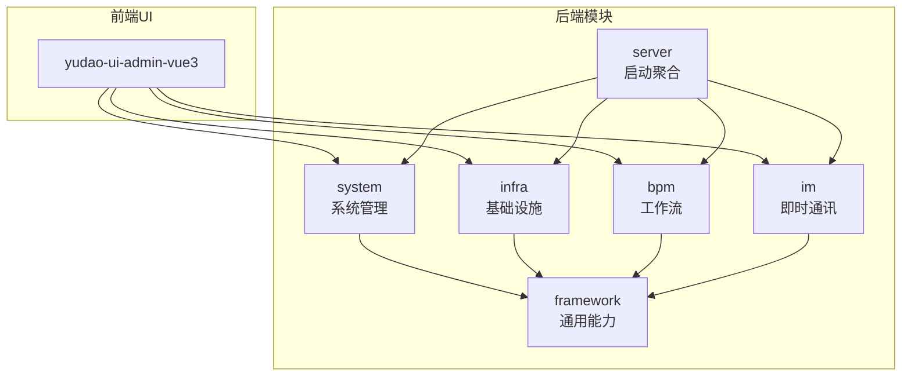
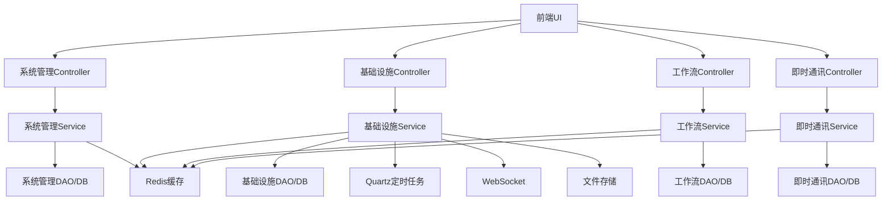
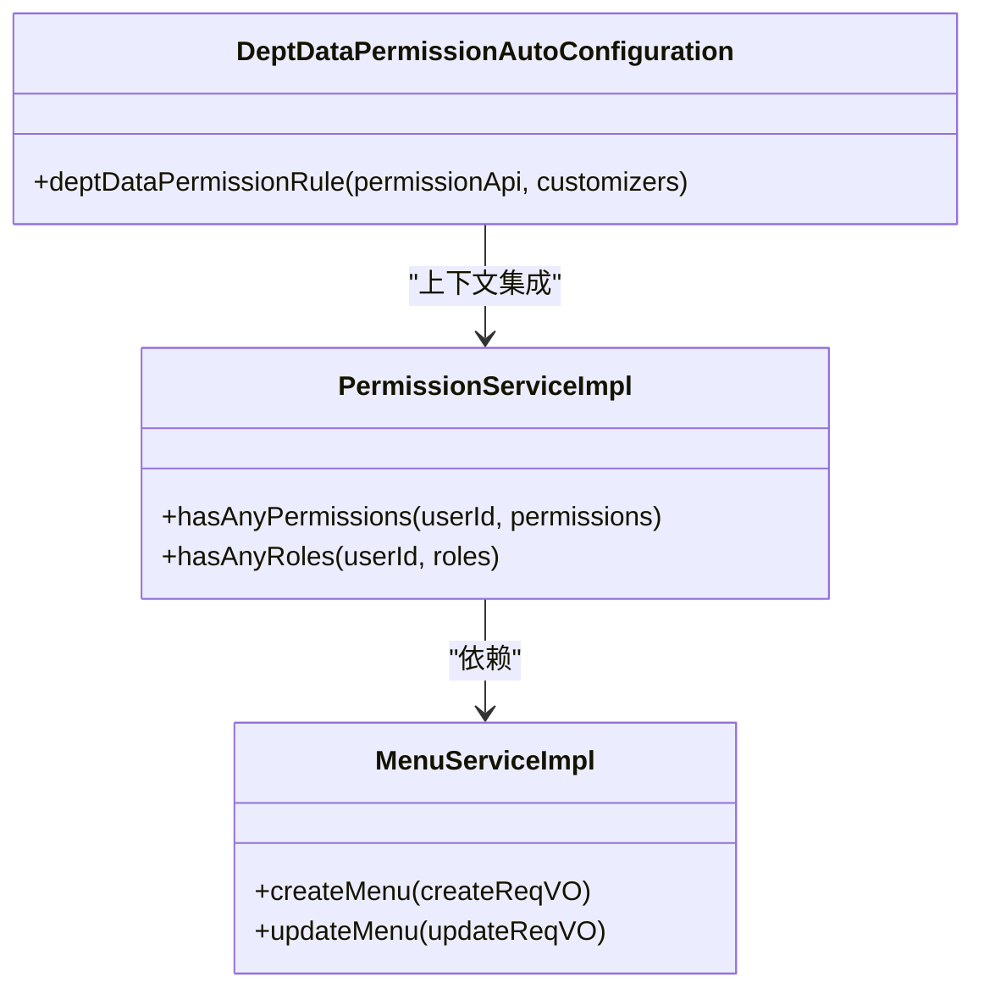
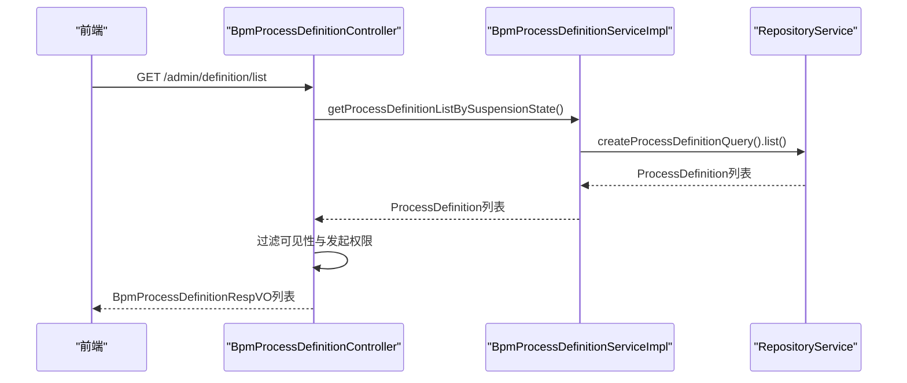
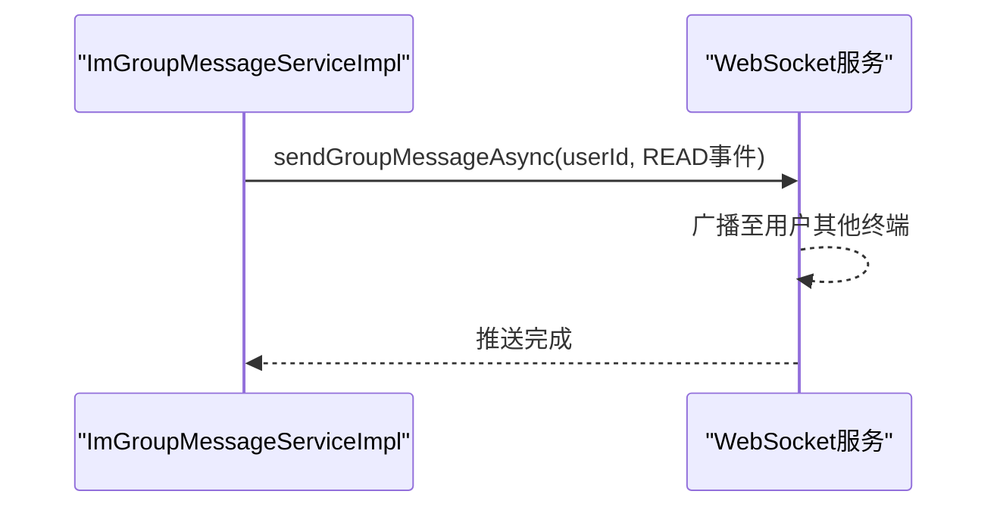
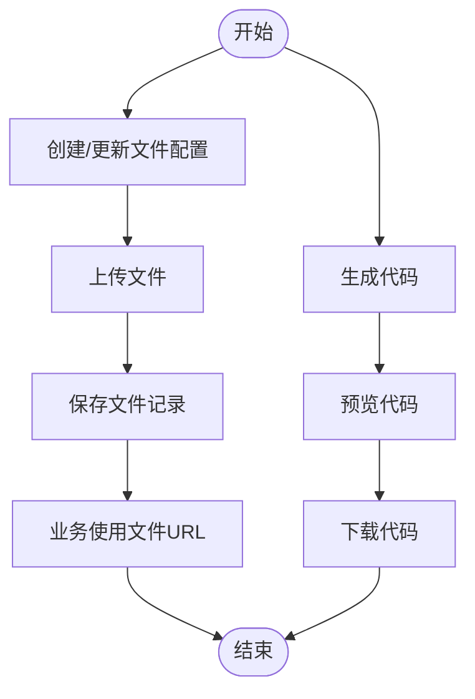
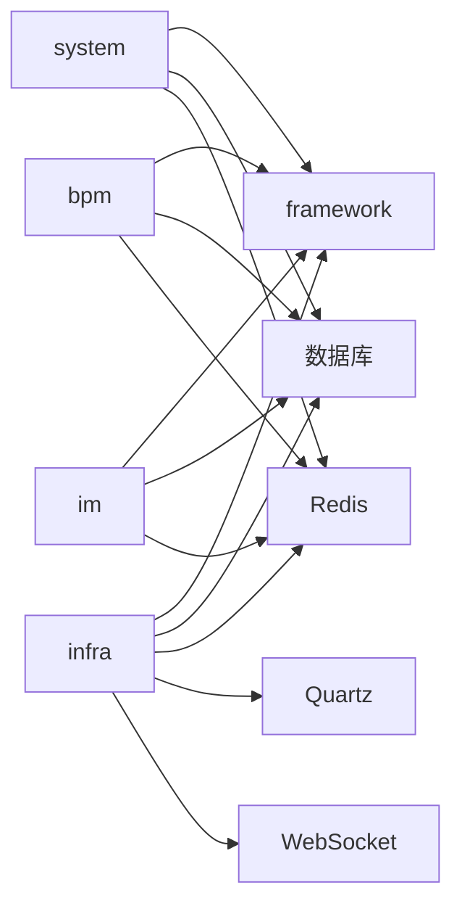

# 核心模块

<cite>
**本文引用的文件**
- [PermissionServiceImpl.java](file://yudao-module-system/src/main/java/cn/iocoder/yudao/module/system/service/permission/PermissionServiceImpl.java)
- [MenuServiceImpl.java](file://yudao-module-system/src/main/java/cn/iocoder/yudao/module/system/service/permission/MenuServiceImpl.java)
- [MenuRespVO.java](file://yudao-module-system/src/main/java/cn/iocoder/yudao/module/system/controller/admin/permission/vo/menu/MenuRespVO.java)
- [YudaoDeptDataPermissionAutoConfiguration.java](file://yudao-framework/yudao-spring-boot-starter-biz-data-permission/src/main/java/cn/iocoder/yudao/framework/datapermission/config/YudaoDeptDataPermissionAutoConfiguration.java)
- [PRD-用户权限设计.md](file://docs/PRD-用户权限设计.md)
- [BpmProcessDefinitionServiceImpl.java](file://yudao-module-bpm/src/main/java/cn/iocoder/yudao/module/bpm/service/definition/BpmProcessDefinitionServiceImpl.java)
- [BpmProcessDefinitionController.java](file://yudao-module-bpm/src/main/java/cn/iocoder/yudao/module/bpm/controller/admin/definition/BpmProcessDefinitionController.java)
- [BpmProcessDefinitionRespVO.java](file://yudao-module-bpm/src/main/java/cn/iocoder/yudao/module/bpm/controller/admin/definition/vo/process/BpmProcessDefinitionRespVO.java)
- [BpmProcessDefinitionInfoDO.java](file://yudao-module-bpm/src/main/java/cn/iocoder/yudao/module/bpm/dal/dataobject/definition/BpmProcessDefinitionInfoDO.java)
- [FlowableUtilsTest.java](file://yudao-module-bpm/src/test/java/cn/iocoder/yudao/module/bpm/framework/flowable/core/util/FlowableUtilsTest.java)
- [ImGroupMessageServiceImpl.java](file://yudao-module-im/src/main/java/cn/iocoder/yudao/module/im/service/message/ImGroupMessageServiceImpl.java)
- [application-dev.yaml](file://yudao-server/src/main/resources/application-dev.yaml)
- [application-local.yaml](file://yudao-server/src/main/resources/application-local.yaml)
- [FileConfigController.java](file://yudao-module-infra/src/main/java/cn/iocoder/yudao/module/infra/controller/admin/file/FileConfigController.java)
- [FileCreateReqVO.java](file://yudao-module-infra/src/main/java/cn/iocoder/yudao/module/infra/controller/admin/file/vo/file/FileCreateReqVO.java)
- [FileRespVO.java](file://yudao-module-infra/src/main/java/cn/iocoder/yudao/module/infra/controller/admin/file/vo/file/FileRespVO.java)
- [index.ts（文件配置接口）](file://yudao-ui/yudao-ui-admin-vue3/src/api/infra/fileConfig/index.ts)
- [index.ts（代码生成接口）](file://yudao-ui/yudao-ui-admin-vue3/src/api/infra/codegen/index.ts)
- [create_tables.sql（代码生成表）](file://yudao-module-infra/src/test/resources/sql/create_tables.sql)
- [ApiAccessLogCommonApi.java](file://yudao-framework/yudao-common/src/main/java/cn/iocoder/yudao/framework/common/biz/infra/logger/ApiAccessLogCommonApi.java)
- [create_tables.sql（API访问日志）](file://yudao-module-infra/src/test/resources/sql/create_tables.sql)
- [index.ts（API访问日志接口）](file://yudao-ui/yudao-ui-admin-vue3/src/api/infra/apiAccessLog/index.ts)
- [index.ts（API错误日志接口）](file://yudao-ui/yudao-ui-admin-vue3/src/api/infra/apiErrorLog/index.ts)
- [package-info.java（IM模块包说明）](file://yudao-module-im/src/main/java/cn/iocoder/yudao/module/im/package-info.java)
</cite>

## 目录
1. [简介](#简介)
2. [项目结构](#项目结构)
3. [核心组件](#核心组件)
4. [架构总览](#架构总览)
5. [详细组件分析](#详细组件分析)
6. [依赖分析](#依赖分析)
7. [性能考虑](#性能考虑)
8. [故障排查指南](#故障排查指南)
9. [结论](#结论)
10. [附录](#附录)

## 简介
本文件面向芋道 Ruoyi-Vue-Pro 的核心模块，系统性梳理以下能力：
- 系统管理模块：用户、角色、菜单、部门等基础功能与 RBAC 权限控制、数据权限过滤。
- 基础设施模块：文件管理、代码生成、定时任务、API 监控等支撑能力。
- 工作流模块：基于 Flowable 的流程设计、任务管理、流程监控。
- 即时通讯模块：WebSocket 实时通信、消息持久化、群组管理。
- 模块间协作与数据流转、扩展与定制化最佳实践。

## 项目结构
- 后端采用多模块划分：system（系统）、infra（基础设施）、bpm（工作流）、im（即时通讯）、server（启动聚合）、framework（通用能力封装）。
- 前端 UI 在 yudao-ui-admin-vue3 中，通过 API 与后端交互。
- 配置集中在 yudao-server 的 application-*.yaml 中，Quartz 定时任务默认 JDBC 存储并支持集群。

**章节来源**
- [application-dev.yaml:67-92](file://yudao-server/src/main/resources/application-dev.yaml#L67-L92)
- [application-local.yaml:92-115](file://yudao-server/src/main/resources/application-local.yaml#L92-L115)

## 核心组件
- 系统管理（RBAC + 数据权限）
  - 权限服务：用户权限/角色权限判定、角色-菜单关联。
  - 菜单服务：菜单树构建、父子校验、组件名校验、缓存失效。
  - 数据权限：部门规则与经销商/产品线规则按模块启用。
- 基础设施（文件/代码生成/定时任务/API监控）
  - 文件：配置多存储（本地/FTP/S3 等），统一上传/下载/测试。
  - 代码生成：基于数据库表定义生成前后端代码。
  - 定时任务：Quartz JDBC 存储、集群、线程池配置。
  - API 监控：访问/错误日志采集与导出。
- 工作流（Flowable）
  - 流程定义：部署、查询、可见性与发起权限控制。
  - 任务管理：任务查询、委托、转办、退回、结束等。
  - 流程监控：流程变量摘要、节点监听、事件驱动。
- 即时通讯（WebSocket）
  - 群组消息：已读回执、多端同步、异步推送。
  - 通道/好友/敏感词/统计：配套能力完善。

**章节来源**
- [PermissionServiceImpl.java:62-131](file://yudao-module-system/src/main/java/cn/iocoder/yudao/module/system/service/permission/PermissionServiceImpl.java#L62-L131)
- [MenuServiceImpl.java:50-58](file://yudao-module-system/src/main/java/cn/iocoder/yudao/module/system/service/permission/MenuServiceImpl.java#L50-L58)
- [YudaoDeptDataPermissionAutoConfiguration.java:24-32](file://yudao-framework/yudao-spring-boot-starter-biz-data-permission/src/main/java/cn/iocoder/yudao/framework/datapermission/config/YudaoDeptDataPermissionAutoConfiguration.java#L24-L32)
- [PRD-用户权限设计.md:314-358](file://docs/PRD-用户权限设计.md#L314-L358)
- [BpmProcessDefinitionServiceImpl.java:58-74](file://yudao-module-bpm/src/main/java/cn/iocoder/yudao/module/bpm/service/definition/BpmProcessDefinitionServiceImpl.java#L58-L74)
- [BpmProcessDefinitionController.java:78-97](file://yudao-module-bpm/src/main/java/cn/iocoder/yudao/module/bpm/controller/admin/definition/BpmProcessDefinitionController.java#L78-L97)
- [ImGroupMessageServiceImpl.java:434-449](file://yudao-module-im/src/main/java/cn/iocoder/yudao/module/im/service/message/ImGroupMessageServiceImpl.java#L434-L449)
- [ApiAccessLogCommonApi.java:12-31](file://yudao-framework/yudao-common/src/main/java/cn/iocoder/yudao/framework/common/biz/infra/logger/ApiAccessLogCommonApi.java#L12-L31)

## 架构总览
系统采用“模块化 + 分层”架构：
- 表现层：前端 UI 通过 REST API 与后端交互。
- 控制层：各模块 Controller 提供 Admin/App 接口。
- 业务层：Service 封装领域逻辑与编排。
- 数据层：MyBatis-Plus Mapper/DAO 访问数据库；Redis 缓存热点数据。
- 基础设施：Quartz 定时任务、WebSocket、文件存储、日志监控等。

**图表来源**
- [application-dev.yaml:67-92](file://yudao-server/src/main/resources/application-dev.yaml#L67-L92)
- [application-local.yaml:92-115](file://yudao-server/src/main/resources/application-local.yaml#L92-L115)

## 详细组件分析

### 系统管理模块（RBAC + 数据权限）
- 权限判定
  - 用户任一权限满足或角色集合包含任一角色即放行。
  - 通过缓存获取启用状态的角色列表，避免重复查询。
- 菜单管理
  - 校验父级菜单存在性、名称唯一性、组件名合法性。
  - 创建/更新菜单时对权限字段进行缓存失效，保证权限生效及时。
- 数据权限
  - 部门规则：系统管理模块启用，按部门树继承过滤。
  - 经销商/产品线规则：Opshub 等业务模块启用，按 dealer_id/product_line_id 过滤。
  - 通过注解开关与规则定制器动态装配。

**图表来源**
- [PermissionServiceImpl.java:62-131](file://yudao-module-system/src/main/java/cn/iocoder/yudao/module/system/service/permission/PermissionServiceImpl.java#L62-L131)
- [MenuServiceImpl.java:50-58](file://yudao-module-system/src/main/java/cn/iocoder/yudao/module/system/service/permission/MenuServiceImpl.java#L50-L58)
- [YudaoDeptDataPermissionAutoConfiguration.java:24-32](file://yudao-framework/yudao-spring-boot-starter-biz-data-permission/src/main/java/cn/iocoder/yudao/framework/datapermission/config/YudaoDeptDataPermissionAutoConfiguration.java#L24-L32)

**章节来源**
- [PermissionServiceImpl.java:62-131](file://yudao-module-system/src/main/java/cn/iocoder/yudao/module/system/service/permission/PermissionServiceImpl.java#L62-L131)
- [MenuServiceImpl.java:50-58](file://yudao-module-system/src/main/java/cn/iocoder/yudao/module/system/service/permission/MenuServiceImpl.java#L50-L58)
- [MenuRespVO.java:1-33](file://yudao-module-system/src/main/java/cn/iocoder/yudao/module/system/controller/admin/permission/vo/menu/MenuRespVO.java#L1-L33)
- [YudaoDeptDataPermissionAutoConfiguration.java:24-32](file://yudao-framework/yudao-spring-boot-starter-biz-data-permission/src/main/java/cn/iocoder/yudao/framework/datapermission/config/YudaoDeptDataPermissionAutoConfiguration.java#L24-L32)
- [PRD-用户权限设计.md:314-358](file://docs/PRD-用户权限设计.md#L314-L358)

### 工作流模块（Flowable）
- 流程定义
  - 通过 RepositoryService 查询流程定义，结合业务信息表（模型类型、分类、图标、描述等）增强展示。
  - 控制台列表过滤：仅展示可见且允许当前用户发起的流程定义。
- 流程变量摘要
  - 基于表单字段与摘要配置，抽取关键字段生成摘要，便于审批查看。
- 任务管理与监控
  - 任务查询、委托、转办、退回、结束等操作由 TaskService 驱动。
  - 事件监听与流程变量变更联动，支持通知与后续动作。

**图表来源**
- [BpmProcessDefinitionController.java:78-97](file://yudao-module-bpm/src/main/java/cn/iocoder/yudao/module/bpm/controller/admin/definition/BpmProcessDefinitionController.java#L78-L97)
- [BpmProcessDefinitionServiceImpl.java:58-74](file://yudao-module-bpm/src/main/java/cn/iocoder/yudao/module/bpm/service/definition/BpmProcessDefinitionServiceImpl.java#L58-L74)
- [BpmProcessDefinitionRespVO.java:1-35](file://yudao-module-bpm/src/main/java/cn/iocoder/yudao/module/bpm/controller/admin/definition/vo/process/BpmProcessDefinitionRespVO.java#L1-L35)
- [BpmProcessDefinitionInfoDO.java:36-77](file://yudao-module-bpm/src/main/java/cn/iocoder/yudao/module/bpm/dal/dataobject/definition/BpmProcessDefinitionInfoDO.java#L36-L77)

**章节来源**
- [BpmProcessDefinitionController.java:78-97](file://yudao-module-bpm/src/main/java/cn/iocoder/yudao/module/bpm/controller/admin/definition/BpmProcessDefinitionController.java#L78-L97)
- [BpmProcessDefinitionServiceImpl.java:58-74](file://yudao-module-bpm/src/main/java/cn/iocoder/yudao/module/bpm/service/definition/BpmProcessDefinitionServiceImpl.java#L58-L74)
- [BpmProcessDefinitionRespVO.java:1-35](file://yudao-module-bpm/src/main/java/cn/iocoder/yudao/module/bpm/controller/admin/definition/vo/process/BpmProcessDefinitionRespVO.java#L1-L35)
- [BpmProcessDefinitionInfoDO.java:36-77](file://yudao-module-bpm/src/main/java/cn/iocoder/yudao/module/bpm/dal/dataobject/definition/BpmProcessDefinitionInfoDO.java#L36-L77)
- [FlowableUtilsTest.java:25-33](file://yudao-module-bpm/src/test/java/cn/iocoder/yudao/module/bpm/framework/flowable/core/util/FlowableUtilsTest.java#L25-L33)

### 即时通讯模块（WebSocket）
- 群组消息已读回执
  - 异步推送 READ 事件到当前用户所有终端，实现多端已读同步。
- 模块命名规范
  - Controller 以 /im/ 开头，实体表名以 im_ 开头，避免与其他模块冲突。

**图表来源**
- [ImGroupMessageServiceImpl.java:434-449](file://yudao-module-im/src/main/java/cn/iocoder/yudao/module/im/service/message/ImGroupMessageServiceImpl.java#L434-L449)

**章节来源**
- [ImGroupMessageServiceImpl.java:434-449](file://yudao-module-im/src/main/java/cn/iocoder/yudao/module/im/service/message/ImGroupMessageServiceImpl.java#L434-L449)
- [package-info.java:1-8](file://yudao-module-im/src/main/java/cn/iocoder/yudao/module/im/package-info.java#L1-L8)

### 基础设施模块（文件/代码生成/定时任务/API监控）
- 文件管理
  - 支持多种存储配置（本地/FTP/S3 等），统一上传、下载、测试连通性。
  - 前端接口定义清晰，包含存储配置对象与文件对象。
- 代码生成
  - 基于数据库表结构生成前后端代码，支持模板类型、父子菜单、树形结构等配置。
  - 提供预览、下载、同步数据库定义等能力。
- 定时任务
  - Quartz JDBC 存储，支持集群、线程池大小、misfire 阈值等配置。
- API 监控
  - 访问日志与错误日志采集，支持分页查询与 Excel 导出。

**图表来源**
- [FileConfigController.java:65-98](file://yudao-module-infra/src/main/java/cn/iocoder/yudao/module/infra/controller/admin/file/FileConfigController.java#L65-L98)
- [FileCreateReqVO.java:1-33](file://yudao-module-infra/src/main/java/cn/iocoder/yudao/module/infra/controller/admin/file/vo/file/FileCreateReqVO.java#L1-L33)
- [FileRespVO.java:1-36](file://yudao-module-infra/src/main/java/cn/iocoder/yudao/module/infra/controller/admin/file/vo/file/FileRespVO.java#L1-L36)
- [index.ts（文件配置接口）:1-59](file://yudao-ui/yudao-ui-admin-vue3/src/api/infra/fileConfig/index.ts#L1-L59)
- [index.ts（代码生成接口）:1-112](file://yudao-ui/yudao-ui-admin-vue3/src/api/infra/codegen/index.ts#L1-L112)
- [create_tables.sql（代码生成表）:163-189](file://yudao-module-infra/src/test/resources/sql/create_tables.sql#L163-L189)
- [application-dev.yaml:67-92](file://yudao-server/src/main/resources/application-dev.yaml#L67-L92)
- [application-local.yaml:92-115](file://yudao-server/src/main/resources/application-local.yaml#L92-L115)
- [ApiAccessLogCommonApi.java:12-31](file://yudao-framework/yudao-common/src/main/java/cn/iocoder/yudao/framework/common/biz/infra/logger/ApiAccessLogCommonApi.java#L12-L31)
- [create_tables.sql（API访问日志）:88-115](file://yudao-module-infra/src/test/resources/sql/create_tables.sql#L88-L115)
- [index.ts（API访问日志接口）:1-34](file://yudao-ui/yudao-ui-admin-vue3/src/api/infra/apiAccessLog/index.ts#L1-L34)
- [index.ts（API错误日志接口）:1-48](file://yudao-ui/yudao-ui-admin-vue3/src/api/infra/apiErrorLog/index.ts#L1-L48)

**章节来源**
- [FileConfigController.java:65-98](file://yudao-module-infra/src/main/java/cn/iocoder/yudao/module/infra/controller/admin/file/FileConfigController.java#L65-L98)
- [FileCreateReqVO.java:1-33](file://yudao-module-infra/src/main/java/cn/iocoder/yudao/module/infra/controller/admin/file/vo/file/FileCreateReqVO.java#L1-L33)
- [FileRespVO.java:1-36](file://yudao-module-infra/src/main/java/cn/iocoder/yudao/module/infra/controller/admin/file/vo/file/FileRespVO.java#L1-L36)
- [index.ts（文件配置接口）:1-59](file://yudao-ui/yudao-ui-admin-vue3/src/api/infra/fileConfig/index.ts#L1-L59)
- [index.ts（代码生成接口）:1-112](file://yudao-ui/yudao-ui-admin-vue3/src/api/infra/codegen/index.ts#L1-L112)
- [create_tables.sql（代码生成表）:163-189](file://yudao-module-infra/src/test/resources/sql/create_tables.sql#L163-L189)
- [application-dev.yaml:67-92](file://yudao-server/src/main/resources/application-dev.yaml#L67-L92)
- [application-local.yaml:92-115](file://yudao-server/src/main/resources/application-local.yaml#L92-L115)
- [ApiAccessLogCommonApi.java:12-31](file://yudao-framework/yudao-common/src/main/java/cn/iocoder/yudao/framework/common/biz/infra/logger/ApiAccessLogCommonApi.java#L12-L31)
- [create_tables.sql（API访问日志）:88-115](file://yudao-module-infra/src/test/resources/sql/create_tables.sql#L88-L115)
- [index.ts（API访问日志接口）:1-34](file://yudao-ui/yudao-ui-admin-vue3/src/api/infra/apiAccessLog/index.ts#L1-L34)
- [index.ts（API错误日志接口）:1-48](file://yudao-ui/yudao-ui-admin-vue3/src/api/infra/apiErrorLog/index.ts#L1-L48)

## 依赖分析
- 模块耦合
  - system 依赖 framework 的权限与数据权限能力；infra 提供文件、定时任务、监控等通用能力；bpm/ im 依赖 framework 的 Web/WebSocket/安全等能力。
- 外部依赖
  - Quartz（定时任务）、Flowable（工作流）、Redis（缓存）、数据库（MySQL/PG/SQLServer 等）。
- 循环依赖规避
  - 菜单服务对租户服务使用延迟加载，避免循环依赖。

**图表来源**
- [application-dev.yaml:67-92](file://yudao-server/src/main/resources/application-dev.yaml#L67-L92)
- [application-local.yaml:92-115](file://yudao-server/src/main/resources/application-local.yaml#L92-L115)

**章节来源**
- [MenuServiceImpl.java:47-48](file://yudao-module-system/src/main/java/cn/iocoder/yudao/module/system/service/permission/MenuServiceImpl.java#L47-L48)

## 性能考虑
- 缓存与热点数据
  - 权限相关菜单列表通过缓存减少数据库压力；更新菜单时主动失效缓存。
- 数据权限过滤
  - 通过规则自动拼接 WHERE 条件，避免业务层重复判断，降低出错概率。
- 定时任务
  - JDBC 存储 + 集群模式提升可靠性；合理设置线程池大小与 misfire 阈值，避免任务堆积。
- 日志与监控
  - 异步记录 API 访问/错误日志，避免阻塞主流程；提供导出能力便于离线分析。

[本节为通用指导，不直接分析具体文件]

## 故障排查指南
- 权限问题
  - 确认用户是否拥有启用状态的角色；核对角色-菜单映射是否正确。
  - 检查数据权限规则是否按模块启用（系统管理模块启用部门规则，业务模块启用经销商/产品线规则）。
- 工作流问题
  - 流程定义不可见或无法发起：检查业务信息表的 visible 字段与 canUserStartProcessDefinition 判定。
  - 流程变量摘要异常：核对表单字段与摘要配置。
- 即时通讯问题
  - 已读回执不同步：确认异步推送是否触发，WebSocket 服务是否在线。
- 基础设施问题
  - 文件上传失败：检查文件配置连通性测试结果；确认存储类型与参数正确。
  - 代码生成异常：核对数据库表定义同步状态与模板类型。
  - 定时任务未执行：检查 Quartz 配置、集群模式、线程池大小。
  - API 日志缺失：确认异步写入是否正常，导出参数是否正确。

**章节来源**
- [PRD-用户权限设计.md:314-358](file://docs/PRD-用户权限设计.md#L314-L358)
- [BpmProcessDefinitionController.java:78-97](file://yudao-module-bpm/src/main/java/cn/iocoder/yudao/module/bpm/controller/admin/definition/BpmProcessDefinitionController.java#L78-L97)
- [ImGroupMessageServiceImpl.java:434-449](file://yudao-module-im/src/main/java/cn/iocoder/yudao/module/im/service/message/ImGroupMessageServiceImpl.java#L434-L449)
- [FileConfigController.java:91-98](file://yudao-module-infra/src/main/java/cn/iocoder/yudao/module/infra/controller/admin/file/FileConfigController.java#L91-L98)
- [index.ts（代码生成接口）:1-112](file://yudao-ui/yudao-ui-admin-vue3/src/api/infra/codegen/index.ts#L1-L112)
- [application-dev.yaml:67-92](file://yudao-server/src/main/resources/application-dev.yaml#L67-L92)
- [ApiAccessLogCommonApi.java:26-29](file://yudao-framework/yudao-common/src/main/java/cn/iocoder/yudao/framework/common/biz/infra/logger/ApiAccessLogCommonApi.java#L26-L29)
- [index.ts（API访问日志接口）:27-34](file://yudao-ui/yudao-ui-admin-vue3/src/api/infra/apiAccessLog/index.ts#L27-L34)
- [index.ts（API错误日志接口）:31-48](file://yudao-ui/yudao-ui-admin-vue3/src/api/infra/apiErrorLog/index.ts#L31-L48)

## 结论
- 本项目通过模块化与分层架构实现了高内聚低耦合，RBAC 与数据权限规则覆盖系统管理与业务场景。
- 基础设施模块提供了完善的文件、代码生成、定时任务与 API 监控能力，支撑上层业务快速迭代。
- 工作流模块基于 Flowable 提供了从流程设计到任务管理的完整闭环。
- 即时通讯模块以 WebSocket 为核心，配合消息持久化与群组管理，满足实时通信需求。
- 建议在扩展新模块时遵循现有命名规范与分层约定，并优先复用 framework 能力。

[本节为总结性内容，不直接分析具体文件]

## 附录
- 最佳实践
  - 模块命名：Controller 以模块前缀开头，实体表名以模块前缀开头。
  - 权限与数据权限：优先使用注解开关，按模块启用不同规则。
  - 定时任务：生产环境开启 JDBC 存储与集群，合理配置线程池。
  - 日志：使用异步记录 API 访问/错误日志，定期导出分析。
- 示例与配置
  - 文件配置接口定义与调用路径参考：[index.ts（文件配置接口）:1-59](file://yudao-ui/yudao-ui-admin-vue3/src/api/infra/fileConfig/index.ts#L1-L59)
  - 代码生成接口定义与调用路径参考：[index.ts（代码生成接口）:1-112](file://yudao-ui/yudao-ui-admin-vue3/src/api/infra/codegen/index.ts#L1-L112)
  - 定时任务配置参考：[application-dev.yaml:67-92](file://yudao-server/src/main/resources/application-dev.yaml#L67-L92)、[application-local.yaml:92-115](file://yudao-server/src/main/resources/application-local.yaml#L92-L115)
  - API 日志接口定义参考：[index.ts（API访问日志接口）:1-34](file://yudao-ui/yudao-ui-admin-vue3/src/api/infra/apiAccessLog/index.ts#L1-L34)、[index.ts（API错误日志接口）:1-48](file://yudao-ui/yudao-ui-admin-vue3/src/api/infra/apiErrorLog/index.ts#L1-L48)