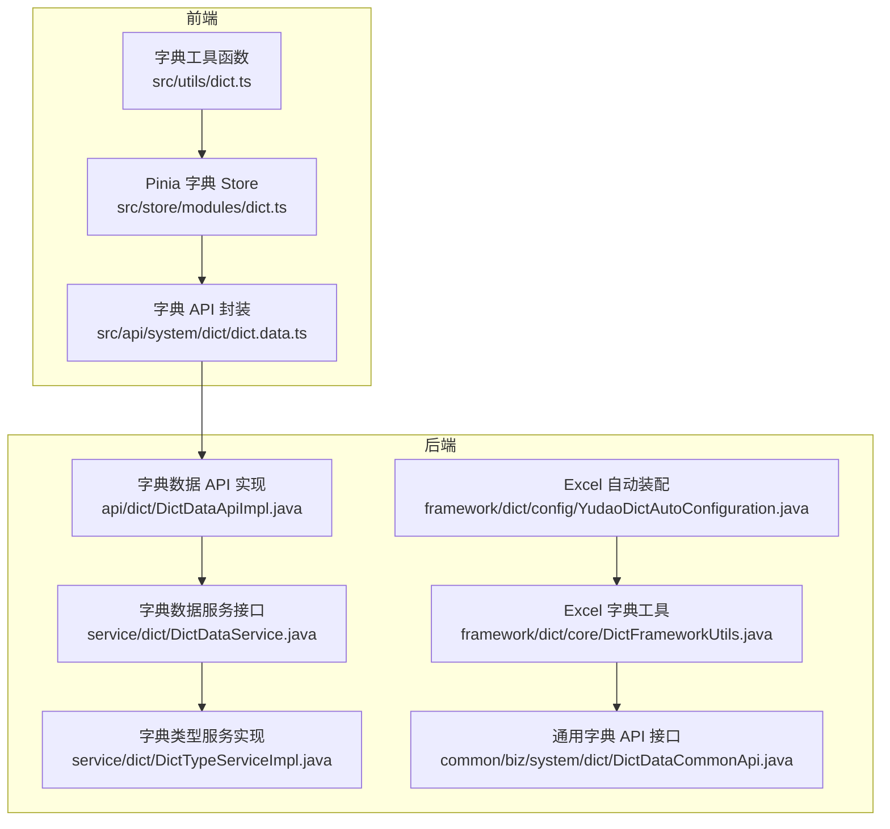
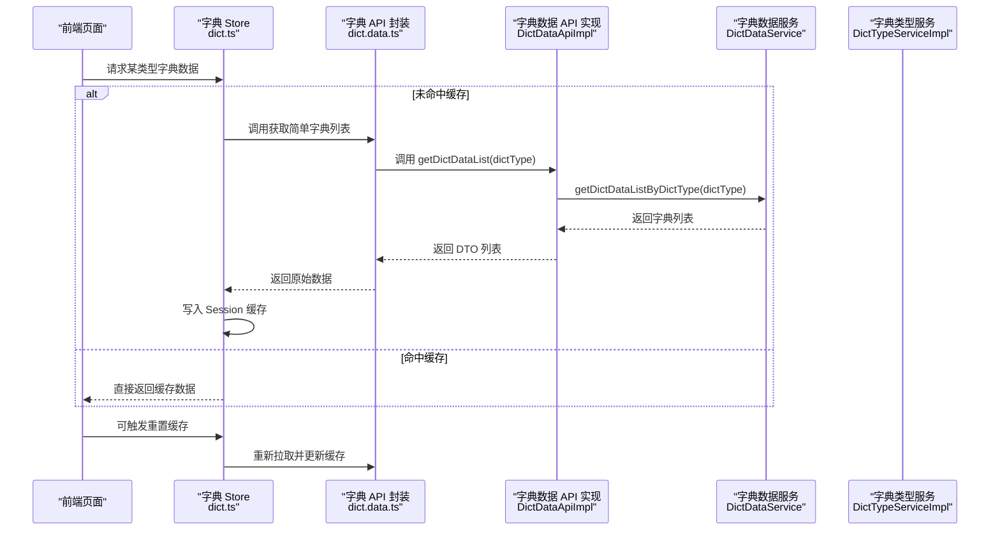
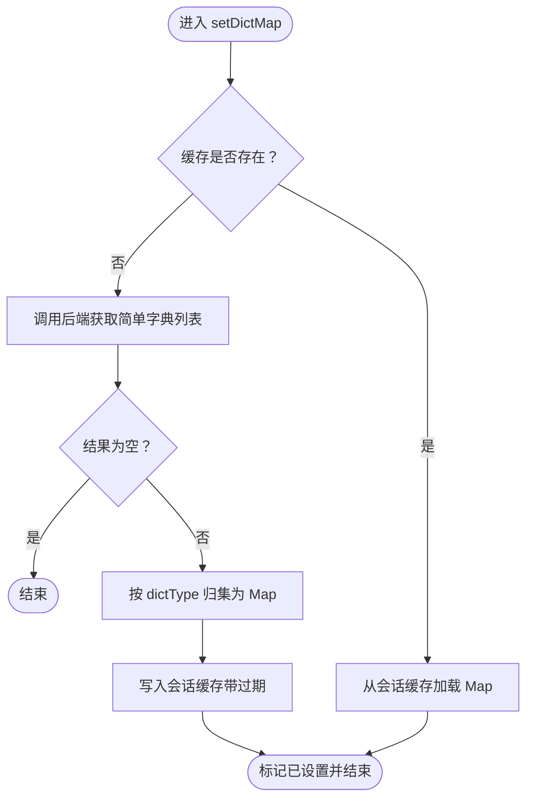
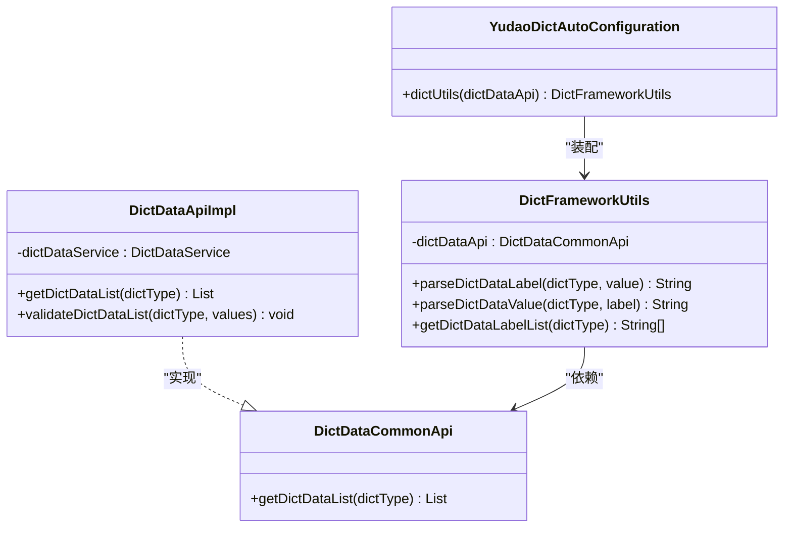
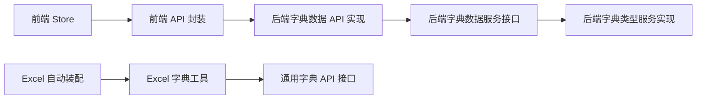

# 数据字典

<cite>
**本文引用的文件**
- [yudao-ui/yudao-ui-admin-vue3/src/store/modules/dict.ts](file://yudao-ui/yudao-ui-admin-vue3/src/store/modules/dict.ts)
- [yudao-ui/yudao-ui-admin-vue3/src/utils/dict.ts](file://yudao-ui/yudao-ui-admin-vue3/src/utils/dict.ts)
- [yudao-ui/yudao-ui-admin-vue3/src/api/system/dict/dict.data.ts](file://yudao-ui/yudao-ui-admin-vue3/src/api/system/dict/dict.data.ts)
- [yudao-module-system/src/main/java/cn/iocoder/yudao/module/system/service/dict/DictDataService.java](file://yudao-module-system/src/main/java/cn/iocoder/yudao/module/system/service/dict/DictDataService.java)
- [yudao-module-system/src/main/java/cn/iocoder/yudao/module/system/service/dict/DictTypeServiceImpl.java](file://yudao-module-system/src/main/java/cn/iocoder/yudao/module/system/service/dict/DictTypeServiceImpl.java)
- [yudao-module-system/src/main/java/cn/iocoder/yudao/module/system/api/dict/DictDataApiImpl.java](file://yudao-module-system/src/main/java/cn/iocoder/yudao/module/system/api/dict/DictDataApiImpl.java)
- [yudao-framework/yudao-common/src/main/java/cn/iocoder/yudao/framework/common/biz/system/dict/DictDataCommonApi.java](file://yudao-framework/yudao-common/src/main/java/cn/iocoder/yudao/framework/common/biz/system/dict/DictDataCommonApi.java)
- [yudao-framework/yudao-spring-boot-starter-excel/src/main/java/cn/iocoder/yudao/framework/dict/core/DictFrameworkUtils.java](file://yudao-framework/yudao-spring-boot-starter-excel/src/main/java/cn/iocoder/yudao/framework/dict/core/DictFrameworkUtils.java)
- [yudao-framework/yudao-spring-boot-starter-excel/src/main/java/cn/iocoder/yudao/framework/dict/config/YudaoDictAutoConfiguration.java](file://yudao-framework/yudao-spring-boot-starter-excel/src/main/java/cn/iocoder/yudao/framework/dict/config/YudaoDictAutoConfiguration.java)
- [yudao-module-system/src/main/java/cn/iocoder/yudao/module/system/enums/DictTypeConstants.java](file://yudao-module-system/src/main/java/cn/iocoder/yudao/module/system/enums/DictTypeConstants.java)
</cite>

## 目录
1. [引言](#引言)
2. [项目结构](#项目结构)
3. [核心组件](#核心组件)
4. [架构总览](#架构总览)
5. [详细组件分析](#详细组件分析)
6. [依赖关系分析](#依赖关系分析)
7. [性能考虑](#性能考虑)
8. [故障排查指南](#故障排查指南)
9. [结论](#结论)
10. [附录](#附录)

## 引言
本文件系统性梳理并阐述“数据字典”在后端与前端的整体设计与实现，覆盖以下主题：
- 字典类型与字典数据的模型与职责边界
- 增删改查、批量导入导出与数据校验规则
- 前端下拉选择、标签显示与表格渲染的使用方式
- 热更新与缓存失效策略
- 扩展字典类型、自定义查询与集成第三方字典服务的方法
- 接口文档与前端使用示例路径
- 性能优化建议

## 项目结构
数据字典能力横跨后端模块与前端应用两大侧：
- 后端：System 模块提供字典类型与字典数据的服务层、API 层与持久化；Excel 工具链通过通用 API 获取字典数据并构建本地缓存。
- 前端：Pinia Store 负责拉取与缓存字典数据；工具函数提供解析与渲染支持；API 文件封装后端接口。

图示来源
- [yudao-ui/yudao-ui-admin-vue3/src/store/modules/dict.ts:1-110](file://yudao-ui/yudao-ui-admin-vue3/src/store/modules/dict.ts#L1-L110)
- [yudao-ui/yudao-ui-admin-vue3/src/utils/dict.ts](file://yudao-ui/yudao-ui-admin-vue3/src/utils/dict.ts)
- [yudao-ui/yudao-ui-admin-vue3/src/api/system/dict/dict.data.ts](file://yudao-ui/yudao-ui-admin-vue3/src/api/system/dict/dict.data.ts)
- [yudao-module-system/src/main/java/cn/iocoder/yudao/module/system/service/dict/DictDataService.java:57-117](file://yudao-module-system/src/main/java/cn/iocoder/yudao/module/system/service/dict/DictDataService.java#L57-L117)
- [yudao-module-system/src/main/java/cn/iocoder/yudao/module/system/service/dict/DictTypeServiceImpl.java:1-43](file://yudao-module-system/src/main/java/cn/iocoder/yudao/module/system/service/dict/DictTypeServiceImpl.java#L1-L43)
- [yudao-module-system/src/main/java/cn/iocoder/yudao/module/system/api/dict/DictDataApiImpl.java:1-35](file://yudao-module-system/src/main/java/cn/iocoder/yudao/module/system/api/dict/DictDataApiImpl.java#L1-L35)
- [yudao-framework/yudao-common/src/main/java/cn/iocoder/yudao/framework/common/biz/system/dict/DictDataCommonApi.java:1-35](file://yudao-framework/yudao-common/src/main/java/cn/iocoder/yudao/framework/common/biz/system/dict/DictDataCommonApi.java#L1-L35)
- [yudao-framework/yudao-spring-boot-starter-excel/src/main/java/cn/iocoder/yudao/framework/dict/core/DictFrameworkUtils.java:1-74](file://yudao-framework/yudao-spring-boot-starter-excel/src/main/java/cn/iocoder/yudao/framework/dict/core/DictFrameworkUtils.java#L1-L74)
- [yudao-framework/yudao-spring-boot-starter-excel/src/main/java/cn/iocoder/yudao/framework/dict/config/YudaoDictAutoConfiguration.java:1-35](file://yudao-framework/yudao-spring-boot-starter-excel/src/main/java/cn/iocoder/yudao/framework/dict/config/YudaoDictAutoConfiguration.java#L1-L35)

章节来源
- [yudao-ui/yudao-ui-admin-vue3/src/store/modules/dict.ts:1-110](file://yudao-ui/yudao-ui-admin-vue3/src/store/modules/dict.ts#L1-L110)
- [yudao-ui/yudao-ui-admin-vue3/src/utils/dict.ts](file://yudao-ui/yudao-ui-admin-vue3/src/utils/dict.ts)
- [yudao-ui/yudao-ui-admin-vue3/src/api/system/dict/dict.data.ts](file://yudao-ui/yudao-ui-admin-vue3/src/api/system/dict/dict.data.ts)
- [yudao-module-system/src/main/java/cn/iocoder/yudao/module/system/service/dict/DictDataService.java:57-117](file://yudao-module-system/src/main/java/cn/iocoder/yudao/module/system/service/dict/DictDataService.java#L57-L117)
- [yudao-module-system/src/main/java/cn/iocoder/yudao/module/system/service/dict/DictTypeServiceImpl.java:1-43](file://yudao-module-system/src/main/java/cn/iocoder/yudao/module/system/service/dict/DictTypeServiceImpl.java#L1-L43)
- [yudao-module-system/src/main/java/cn/iocoder/yudao/module/system/api/dict/DictDataApiImpl.java:1-35](file://yudao-module-system/src/main/java/cn/iocoder/yudao/module/system/api/dict/DictDataApiImpl.java#L1-L35)
- [yudao-framework/yudao-common/src/main/java/cn/iocoder/yudao/framework/common/biz/system/dict/DictDataCommonApi.java:1-35](file://yudao-framework/yudao-common/src/main/java/cn/iocoder/yudao/framework/common/biz/system/dict/DictDataCommonApi.java#L1-L35)
- [yudao-framework/yudao-spring-boot-starter-excel/src/main/java/cn/iocoder/yudao/framework/dict/core/DictFrameworkUtils.java:1-74](file://yudao-framework/yudao-spring-boot-starter-excel/src/main/java/cn/iocoder/yudao/framework/dict/core/DictFrameworkUtils.java#L1-L74)
- [yudao-framework/yudao-spring-boot-starter-excel/src/main/java/cn/iocoder/yudao/framework/dict/config/YudaoDictAutoConfiguration.java:1-35](file://yudao-framework/yudao-spring-boot-starter-excel/src/main/java/cn/iocoder/yudao/framework/dict/config/YudaoDictAutoConfiguration.java#L1-L35)

## 核心组件
- 前端字典 Store：负责拉取、缓存与按类型获取字典数据，支持重置缓存。
- 前端字典工具：提供基于类型与值/标签的解析、渲染辅助方法。
- 前端 API 封装：统一调用后端字典接口，返回简单字典列表。
- 后端字典数据服务：提供分页、详情、按类型查询、校验等能力。
- 后端字典类型服务：提供类型分页、详情等能力。
- 后端字典数据 API 实现：对外暴露校验与按类型查询能力。
- 通用字典 API 接口：供 Excel 工具链等模块消费。
- Excel 字典工具：基于通用接口构建异步可重载缓存，加速字典解析。
- Excel 自动装配：注册并初始化字典工具。

章节来源
- [yudao-ui/yudao-ui-admin-vue3/src/store/modules/dict.ts:1-110](file://yudao-ui/yudao-ui-admin-vue3/src/store/modules/dict.ts#L1-L110)
- [yudao-ui/yudao-ui-admin-vue3/src/utils/dict.ts](file://yudao-ui/yudao-ui-admin-vue3/src/utils/dict.ts)
- [yudao-ui/yudao-ui-admin-vue3/src/api/system/dict/dict.data.ts](file://yudao-ui/yudao-ui-admin-vue3/src/api/system/dict/dict.data.ts)
- [yudao-module-system/src/main/java/cn/iocoder/yudao/module/system/service/dict/DictDataService.java:57-117](file://yudao-module-system/src/main/java/cn/iocoder/yudao/module/system/service/dict/DictDataService.java#L57-L117)
- [yudao-module-system/src/main/java/cn/iocoder/yudao/module/system/service/dict/DictTypeServiceImpl.java:1-43](file://yudao-module-system/src/main/java/cn/iocoder/yudao/module/system/service/dict/DictTypeServiceImpl.java#L1-L43)
- [yudao-module-system/src/main/java/cn/iocoder/yudao/module/system/api/dict/DictDataApiImpl.java:1-35](file://yudao-module-system/src/main/java/cn/iocoder/yudao/module/system/api/dict/DictDataApiImpl.java#L1-L35)
- [yudao-framework/yudao-common/src/main/java/cn/iocoder/yudao/framework/common/biz/system/dict/DictDataCommonApi.java:1-35](file://yudao-framework/yudao-common/src/main/java/cn/iocoder/yudao/framework/common/biz/system/dict/DictDataCommonApi.java#L1-L35)
- [yudao-framework/yudao-spring-boot-starter-excel/src/main/java/cn/iocoder/yudao/framework/dict/core/DictFrameworkUtils.java:1-74](file://yudao-framework/yudao-spring-boot-starter-excel/src/main/java/cn/iocoder/yudao/framework/dict/core/DictFrameworkUtils.java#L1-L74)
- [yudao-framework/yudao-spring-boot-starter-excel/src/main/java/cn/iocoder/yudao/framework/dict/config/YudaoDictAutoConfiguration.java:1-35](file://yudao-framework/yudao-spring-boot-starter-excel/src/main/java/cn/iocoder/yudao/framework/dict/config/YudaoDictAutoConfiguration.java#L1-L35)

## 架构总览
从前端到后端的数据流与缓存策略如下：

图示来源
- [yudao-ui/yudao-ui-admin-vue3/src/store/modules/dict.ts:42-104](file://yudao-ui/yudao-ui-admin-vue3/src/store/modules/dict.ts#L42-L104)
- [yudao-ui/yudao-ui-admin-vue3/src/api/system/dict/dict.data.ts](file://yudao-ui/yudao-ui-admin-vue3/src/api/system/dict/dict.data.ts)
- [yudao-module-system/src/main/java/cn/iocoder/yudao/module/system/api/dict/DictDataApiImpl.java:24-33](file://yudao-module-system/src/main/java/cn/iocoder/yudao/module/system/api/dict/DictDataApiImpl.java#L24-L33)
- [yudao-module-system/src/main/java/cn/iocoder/yudao/module/system/service/dict/DictDataService.java:109-115](file://yudao-module-system/src/main/java/cn/iocoder/yudao/module/system/service/dict/DictDataService.java#L109-L115)
- [yudao-module-system/src/main/java/cn/iocoder/yudao/module/system/service/dict/DictTypeServiceImpl.java:35-43](file://yudao-module-system/src/main/java/cn/iocoder/yudao/module/system/service/dict/DictTypeServiceImpl.java#L35-L43)

## 详细组件分析

### 前端：字典 Store（Pinia）
- 职责
  - 拉取后端简单字典列表并按类型归集为 Map
  - 使用会话缓存存储，带过期时间
  - 提供按类型获取、重置缓存等动作
- 关键行为
  - 首次访问时若缓存为空则拉取并写入缓存
  - 支持手动重置缓存以触发热更新
- 复杂度
  - 初始化与写缓存为 O(n)，n 为字典项数
  - 查询为 O(k)，k 为该类型字典项数

图示来源
- [yudao-ui/yudao-ui-admin-vue3/src/store/modules/dict.ts:42-72](file://yudao-ui/yudao-ui-admin-vue3/src/store/modules/dict.ts#L42-L72)

章节来源
- [yudao-ui/yudao-ui-admin-vue3/src/store/modules/dict.ts:1-110](file://yudao-ui/yudao-ui-admin-vue3/src/store/modules/dict.ts#L1-L110)

### 前端：字典工具函数
- 职责
  - 基于类型与值/标签进行解析，支持颜色/样式字段透传
  - 与 Store 的 Map 结构配合，用于下拉、标签、表格渲染
- 使用场景
  - 下拉选择：将 Map 转为 {value,label} 列表
  - 标签显示：根据 value 获取 label 并应用 colorType/cssClass
  - 表格渲染：按 label 渲染展示文本

章节来源
- [yudao-ui/yudao-ui-admin-vue3/src/utils/dict.ts](file://yudao-ui/yudao-ui-admin-vue3/src/utils/dict.ts)

### 前端：字典 API 封装
- 职责
  - 统一调用后端接口，返回简单字典列表
  - 作为 Store 与后端之间的桥梁
- 注意
  - 仅返回简单列表，不包含复杂业务逻辑

章节来源
- [yudao-ui/yudao-ui-admin-vue3/src/api/system/dict/dict.data.ts](file://yudao-ui/yudao-ui-admin-vue3/src/api/system/dict/dict.data.ts)

### 后端：字典数据服务接口
- 能力
  - 分页查询、详情查询、按类型查询、按标签解析、校验多值有效性
- 设计要点
  - 将“校验”与“查询”解耦，便于业务层复用
  - 支持按类型统计数量，便于前端分页与容量评估

章节来源
- [yudao-module-system/src/main/java/cn/iocoder/yudao/module/system/service/dict/DictDataService.java:57-117](file://yudao-module-system/src/main/java/cn/iocoder/yudao/module/system/service/dict/DictDataService.java#L57-L117)

### 后端：字典类型服务实现
- 能力
  - 类型分页、详情查询
- 与字典数据服务协作
  - 在类型维度上驱动数据服务进行数据量统计与校验

章节来源
- [yudao-module-system/src/main/java/cn/iocoder/yudao/module/system/service/dict/DictTypeServiceImpl.java:1-43](file://yudao-module-system/src/main/java/cn/iocoder/yudao/module/system/service/dict/DictTypeServiceImpl.java#L1-L43)

### 后端：字典数据 API 实现
- 能力
  - 对外暴露按类型查询与校验能力
  - 将 DO 转换为 DTO 返回
- 与通用接口对接
  - 供 Excel 工具链等模块消费

章节来源
- [yudao-module-system/src/main/java/cn/iocoder/yudao/module/system/api/dict/DictDataApiImpl.java:1-35](file://yudao-module-system/src/main/java/cn/iocoder/yudao/module/system/api/dict/DictDataApiImpl.java#L1-L35)

### 通用字典 API 与 Excel 工具链
- 通用接口
  - 定义按类型获取字典列表的标准契约
- Excel 工具
  - 基于通用接口构建异步可重载缓存
  - 提供按值/标签解析、批量标签提取等便捷方法
- 自动装配
  - 注册并初始化字典工具，确保全局可用

图示来源
- [yudao-framework/yudao-common/src/main/java/cn/iocoder/yudao/framework/common/biz/system/dict/DictDataCommonApi.java:1-35](file://yudao-framework/yudao-common/src/main/java/cn/iocoder/yudao/framework/common/biz/system/dict/DictDataCommonApi.java#L1-L35)
- [yudao-module-system/src/main/java/cn/iocoder/yudao/module/system/api/dict/DictDataApiImpl.java:1-35](file://yudao-module-system/src/main/java/cn/iocoder/yudao/module/system/api/dict/DictDataApiImpl.java#L1-L35)
- [yudao-framework/yudao-spring-boot-starter-excel/src/main/java/cn/iocoder/yudao/framework/dict/core/DictFrameworkUtils.java:1-74](file://yudao-framework/yudao-spring-boot-starter-excel/src/main/java/cn/iocoder/yudao/framework/dict/core/DictFrameworkUtils.java#L1-L74)
- [yudao-framework/yudao-spring-boot-starter-excel/src/main/java/cn/iocoder/yudao/framework/dict/config/YudaoDictAutoConfiguration.java:1-35](file://yudao-framework/yudao-spring-boot-starter-excel/src/main/java/cn/iocoder/yudao/framework/dict/config/YudaoDictAutoConfiguration.java#L1-L35)

## 依赖关系分析
- 前端依赖
  - Store 依赖 API 封装
  - 工具函数依赖 Store 的 Map 结构
- 后端依赖
  - API 实现依赖服务接口
  - 服务实现依赖 Mapper 与领域对象
- 工具链依赖
  - Excel 工具依赖通用接口
  - 自动装配负责初始化

图示来源
- [yudao-ui/yudao-ui-admin-vue3/src/store/modules/dict.ts:1-110](file://yudao-ui/yudao-ui-admin-vue3/src/store/modules/dict.ts#L1-L110)
- [yudao-ui/yudao-ui-admin-vue3/src/api/system/dict/dict.data.ts](file://yudao-ui/yudao-ui-admin-vue3/src/api/system/dict/dict.data.ts)
- [yudao-module-system/src/main/java/cn/iocoder/yudao/module/system/api/dict/DictDataApiImpl.java:1-35](file://yudao-module-system/src/main/java/cn/iocoder/yudao/module/system/api/dict/DictDataApiImpl.java#L1-L35)
- [yudao-module-system/src/main/java/cn/iocoder/yudao/module/system/service/dict/DictDataService.java:57-117](file://yudao-module-system/src/main/java/cn/iocoder/yudao/module/system/service/dict/DictDataService.java#L57-L117)
- [yudao-module-system/src/main/java/cn/iocoder/yudao/module/system/service/dict/DictTypeServiceImpl.java:1-43](file://yudao-module-system/src/main/java/cn/iocoder/yudao/module/system/service/dict/DictTypeServiceImpl.java#L1-L43)
- [yudao-framework/yudao-common/src/main/java/cn/iocoder/yudao/framework/common/biz/system/dict/DictDataCommonApi.java:1-35](file://yudao-framework/yudao-common/src/main/java/cn/iocoder/yudao/framework/common/biz/system/dict/DictDataCommonApi.java#L1-L35)
- [yudao-framework/yudao-spring-boot-starter-excel/src/main/java/cn/iocoder/yudao/framework/dict/core/DictFrameworkUtils.java:1-74](file://yudao-framework/yudao-spring-boot-starter-excel/src/main/java/cn/iocoder/yudao/framework/dict/core/DictFrameworkUtils.java#L1-L74)
- [yudao-framework/yudao-spring-boot-starter-excel/src/main/java/cn/iocoder/yudao/framework/dict/config/YudaoDictAutoConfiguration.java:1-35](file://yudao-framework/yudao-spring-boot-starter-excel/src/main/java/cn/iocoder/yudao/framework/dict/config/YudaoDictAutoConfiguration.java#L1-L35)

章节来源
- [yudao-ui/yudao-ui-admin-vue3/src/store/modules/dict.ts:1-110](file://yudao-ui/yudao-ui-admin-vue3/src/store/modules/dict.ts#L1-L110)
- [yudao-ui/yudao-ui-admin-vue3/src/api/system/dict/dict.data.ts](file://yudao-ui/yudao-ui-admin-vue3/src/api/system/dict/dict.data.ts)
- [yudao-module-system/src/main/java/cn/iocoder/yudao/module/system/api/dict/DictDataApiImpl.java:1-35](file://yudao-module-system/src/main/java/cn/iocoder/yudao/module/system/api/dict/DictDataApiImpl.java#L1-L35)
- [yudao-module-system/src/main/java/cn/iocoder/yudao/module/system/service/dict/DictDataService.java:57-117](file://yudao-module-system/src/main/java/cn/iocoder/yudao/module/system/service/dict/DictDataService.java#L57-L117)
- [yudao-module-system/src/main/java/cn/iocoder/yudao/module/system/service/dict/DictTypeServiceImpl.java:1-43](file://yudao-module-system/src/main/java/cn/iocoder/yudao/module/system/service/dict/DictTypeServiceImpl.java#L1-L43)
- [yudao-framework/yudao-common/src/main/java/cn/iocoder/yudao/framework/common/biz/system/dict/DictDataCommonApi.java:1-35](file://yudao-framework/yudao-common/src/main/java/cn/iocoder/yudao/framework/common/biz/system/dict/DictDataCommonApi.java#L1-L35)
- [yudao-framework/yudao-spring-boot-starter-excel/src/main/java/cn/iocoder/yudao/framework/dict/core/DictFrameworkUtils.java:1-74](file://yudao-framework/yudao-spring-boot-starter-excel/src/main/java/cn/iocoder/yudao/framework/dict/core/DictFrameworkUtils.java#L1-L74)
- [yudao-framework/yudao-spring-boot-starter-excel/src/main/java/cn/iocoder/yudao/framework/dict/config/YudaoDictAutoConfiguration.java:1-35](file://yudao-framework/yudao-spring-boot-starter-excel/src/main/java/cn/iocoder/yudao/framework/dict/config/YudaoDictAutoConfiguration.java#L1-L35)

## 性能考虑
- 前端缓存
  - 使用会话缓存存储 Map，减少重复请求
  - 建议合理设置过期时间，兼顾新鲜度与性能
- 后端缓存
  - Excel 工具链采用异步可重载缓存，降低频繁查询成本
  - 建议结合业务热点类型做预热
- 查询优化
  - 按类型查询为 O(k)，建议前端按需加载与懒加载
  - 标签解析使用一次遍历匹配，建议避免在高频渲染路径中重复计算
- 导入导出
  - 批量导入建议分批处理，避免一次性超大事务
  - 导出前先进行数据校验，减少无效 IO

## 故障排查指南
- 前端无数据或显示异常
  - 检查 Store 是否成功写入缓存
  - 确认 API 返回非空且包含目标类型
  - 若出现脏数据，尝试调用重置缓存动作
- 后端校验失败
  - 校验多值时，确认值集合与类型一致
  - 检查字典状态是否启用
- Excel 工具解析异常
  - 确认通用字典 API 已正确装配
  - 检查缓存是否过期或被清理

章节来源
- [yudao-ui/yudao-ui-admin-vue3/src/store/modules/dict.ts:79-104](file://yudao-ui/yudao-ui-admin-vue3/src/store/modules/dict.ts#L79-L104)
- [yudao-module-system/src/main/java/cn/iocoder/yudao/module/system/service/dict/DictDataService.java:82-89](file://yudao-module-system/src/main/java/cn/iocoder/yudao/module/system/service/dict/DictDataService.java#L82-L89)
- [yudao-framework/yudao-spring-boot-starter-excel/src/main/java/cn/iocoder/yudao/framework/dict/core/DictFrameworkUtils.java:30-41](file://yudao-framework/yudao-spring-boot-starter-excel/src/main/java/cn/iocoder/yudao/framework/dict/core/DictFrameworkUtils.java#L30-L41)

## 结论
本方案通过前后端协同的缓存策略与清晰的职责划分，实现了稳定、可扩展的数据字典能力。前端以 Store 为中心组织缓存与渲染，后端以服务接口为核心提供查询与校验，Excel 工具链进一步增强解析效率。通过合理的热更新与缓存失效策略，既能保证性能，又能满足业务对实时性的需求。

## 附录

### 接口文档（后端）
- 获取字典类型分页列表
  - 方法：GET
  - 路径：/admin-api/system/dict-type/page
  - 请求体：分页参数
  - 响应：分页结果
- 获取字典类型详情
  - 方法：GET
  - 路径：/admin-api/system/dict-type/get/{id}
  - 响应：类型对象
- 获取字典数据分页列表
  - 方法：GET
  - 路径：/admin-api/system/dict-data/page
  - 请求体：分页参数
  - 响应：分页结果
- 获取字典数据详情
  - 方法：GET
  - 路径：/admin-api/system/dict-data/get/{id}
  - 响应：数据对象
- 校验字典数据有效性
  - 方法：POST
  - 路径：/admin-api/system/dict-data/validate
  - 请求体：{ dictType, values[] }
  - 响应：无错误表示有效
- 按类型获取字典数据列表（通用）
  - 方法：GET
  - 路径：/admin-api/system/dict-data/list/{dictType}
  - 响应：数据列表

章节来源
- [yudao-module-system/src/main/java/cn/iocoder/yudao/module/system/service/dict/DictTypeServiceImpl.java:35-43](file://yudao-module-system/src/main/java/cn/iocoder/yudao/module/system/service/dict/DictTypeServiceImpl.java#L35-L43)
- [yudao-module-system/src/main/java/cn/iocoder/yudao/module/system/service/dict/DictDataService.java:57-117](file://yudao-module-system/src/main/java/cn/iocoder/yudao/module/system/service/dict/DictDataService.java#L57-L117)
- [yudao-module-system/src/main/java/cn/iocoder/yudao/module/system/api/dict/DictDataApiImpl.java:24-33](file://yudao-module-system/src/main/java/cn/iocoder/yudao/module/system/api/dict/DictDataApiImpl.java#L24-L33)

### 前端使用示例（路径）
- 下拉选择
  - 使用 Store 获取类型数据，转换为 {value,label} 列表
  - 参考路径：[yudao-ui/yudao-ui-admin-vue3/src/store/modules/dict.ts:73-78](file://yudao-ui/yudao-ui-admin-vue3/src/store/modules/dict.ts#L73-L78)
- 标签显示
  - 使用工具函数解析 label，并应用 colorType/cssClass
  - 参考路径：[yudao-ui/yudao-ui-admin-vue3/src/utils/dict.ts](file://yudao-ui/yudao-ui-admin-vue3/src/utils/dict.ts)
- 表格渲染
  - 使用解析后的 label 渲染单元格
  - 参考路径：[yudao-ui/yudao-ui-admin-vue3/src/store/modules/dict.ts:73-78](file://yudao-ui/yudao-ui-admin-vue3/src/store/modules/dict.ts#L73-L78)
- 热更新
  - 调用重置缓存动作，触发重新拉取
  - 参考路径：[yudao-ui/yudao-ui-admin-vue3/src/store/modules/dict.ts:79-104](file://yudao-ui/yudao-ui-admin-vue3/src/store/modules/dict.ts#L79-L104)

### 扩展字典类型与自定义查询
- 新增字典类型
  - 在后端新增类型并维护对应字典数据
  - 前端直接使用类型名即可获取
  - 参考路径：[yudao-module-system/src/main/java/cn/iocoder/yudao/module/system/enums/DictTypeConstants.java](file://yudao-module-system/src/main/java/cn/iocoder/yudao/module/system/enums/DictTypeConstants.java)
- 自定义字典查询
  - 通过通用字典 API 获取列表，再在前端进行二次过滤
  - 参考路径：[yudao-framework/yudao-common/src/main/java/cn/iocoder/yudao/framework/common/biz/system/dict/DictDataCommonApi.java:1-35](file://yudao-framework/yudao-common/src/main/java/cn/iocoder/yudao/framework/common/biz/system/dict/DictDataCommonApi.java#L1-L35)
- 集成第三方字典服务
  - 将第三方服务适配为通用字典 API 实现，由自动装配注入
  - 参考路径：
    - [yudao-framework/yudao-spring-boot-starter-excel/src/main/java/cn/iocoder/yudao/framework/dict/config/YudaoDictAutoConfiguration.java:1-35](file://yudao-framework/yudao-spring-boot-starter-excel/src/main/java/cn/iocoder/yudao/framework/dict/config/YudaoDictAutoConfiguration.java#L1-L35)
    - [yudao-framework/yudao-spring-boot-starter-excel/src/main/java/cn/iocoder/yudao/framework/dict/core/DictFrameworkUtils.java:41-74](file://yudao-framework/yudao-spring-boot-starter-excel/src/main/java/cn/iocoder/yudao/framework/dict/core/DictFrameworkUtils.java#L41-L74)

### 数据验证规则
- 校验规则
  - 字典数据不存在或被禁用即视为无效
  - 支持批量校验，输入为类型与值集合
- 建议
  - 在提交前进行前端轻量校验，在后端进行强一致校验

章节来源
- [yudao-module-system/src/main/java/cn/iocoder/yudao/module/system/service/dict/DictDataService.java:82-89](file://yudao-module-system/src/main/java/cn/iocoder/yudao/module/system/service/dict/DictDataService.java#L82-L89)