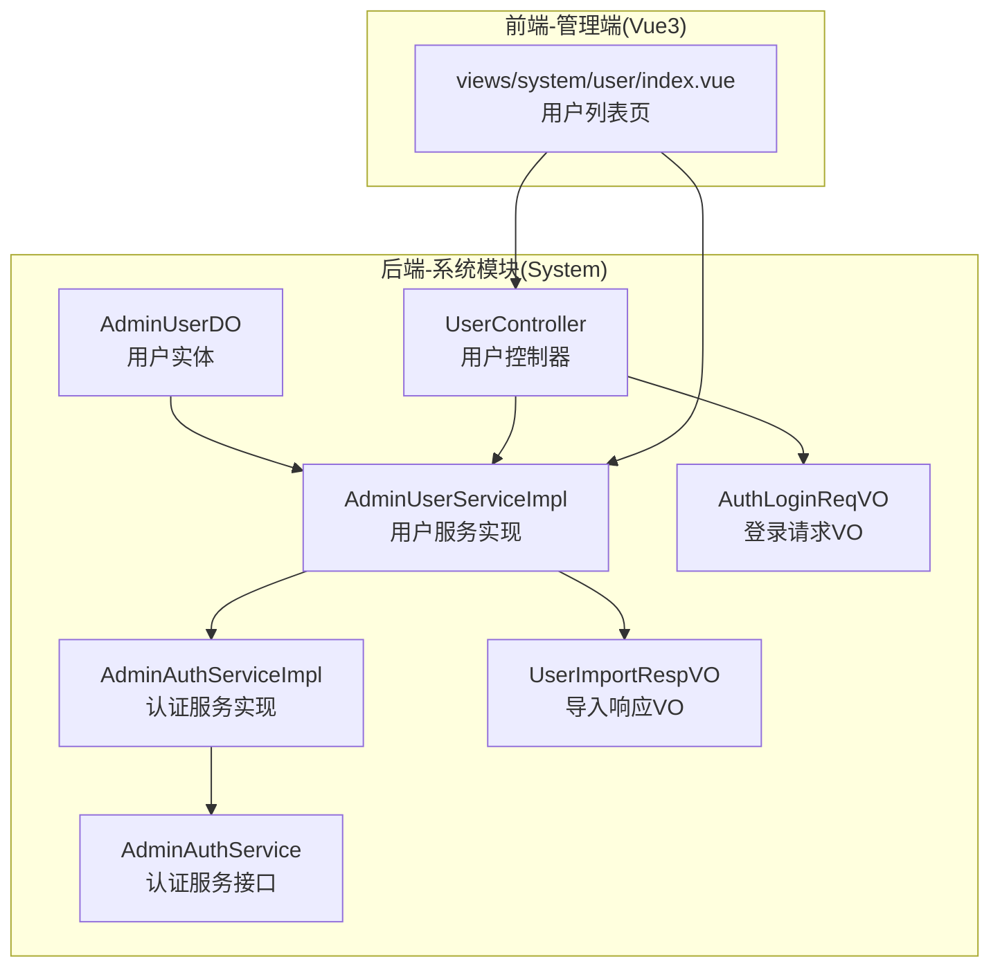
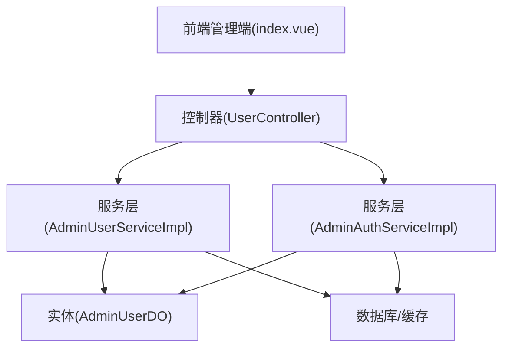
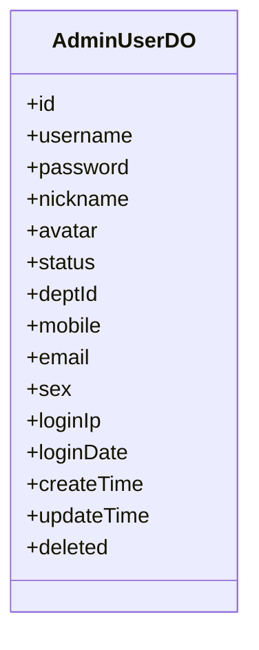
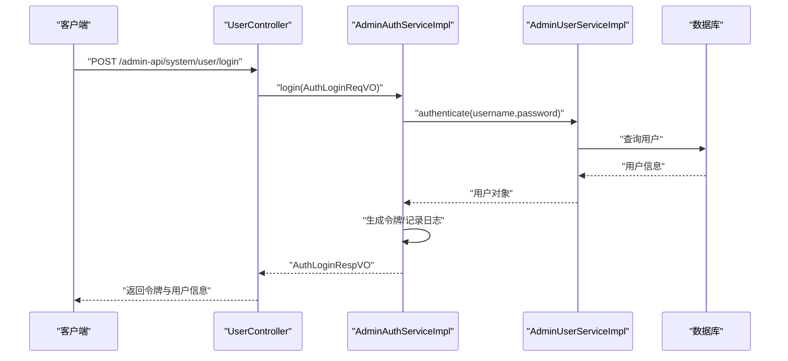
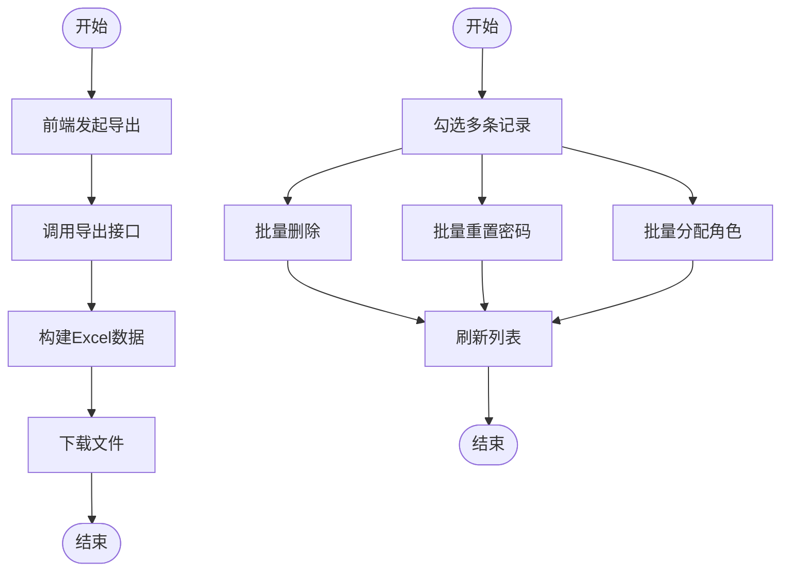
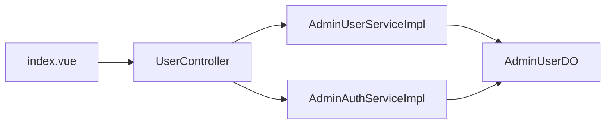

# 用户管理

<cite>
**本文引用的文件**
- [AdminUserDO.java](file://yudao-module-system/src/main/java/cn/iocoder/yudao/module/system/dal/dataobject/user/AdminUserDO.java)
- [UserController.java](file://yudao-module-system/src/main/java/cn/iocoder/yudao/module/system/controller/admin/user/UserController.java)
- [AdminUserServiceImpl.java](file://yudao-module-system/src/main/java/cn/iocoder/yudao/module/system/service/user/AdminUserServiceImpl.java)
- [AdminAuthService.java](file://yudao-module-system/src/main/java/cn/iocoder/yudao/module/system/service/auth/AdminAuthService.java)
- [AdminAuthServiceImpl.java](file://yudao-module-system/src/main/java/cn/iocoder/yudao/module/system/service/auth/AdminAuthServiceImpl.java)
- [AuthLoginReqVO.java](file://yudao-module-system/src/main/java/cn/iocoder/yudao/module/system/controller/admin/auth/vo/AuthLoginReqVO.java)
- [UserImportRespVO.java](file://yudao-module-system/src/main/java/cn/iocoder/yudao/module/system/controller/admin/user/vo/user/UserImportRespVO.java)
- [index.vue](file://yudao-ui/yudao-ui-admin-vue3/src/views/system/user/index.vue)
- [PermissionApi.java](file://yudao-module-system/src/main/java/cn/iocoder/yudao/module/system/api/permission/PermissionApi.java)
- [PermissionAssignUserRoleReqVO.java](file://yudao-module-system/src/main/java/cn/iocoder/yudao/module/system/controller/admin/permission/vo/permission/PermissionAssignUserRoleReqVO.java)
- [PRD-用户权限设计.md](file://docs/PRD-用户权限设计.md)
</cite>

## 目录
1. [简介](#简介)
2. [项目结构](#项目结构)
3. [核心组件](#核心组件)
4. [架构总览](#架构总览)
5. [详细组件分析](#详细组件分析)
6. [依赖关系分析](#依赖关系分析)
7. [性能考虑](#性能考虑)
8. [故障排查指南](#故障排查指南)
9. [结论](#结论)
10. [附录](#附录)

## 简介
本文件面向用户管理功能，系统性梳理从后端实体模型、服务层到前端界面与接口的完整实现，覆盖用户注册、登录、个人信息管理、密码管理、用户导入导出、批量操作与数据同步、权限继承与扩展等主题。文档同时给出可直接定位到源码位置的路径指引，便于开发者快速定位与扩展。

## 项目结构
用户管理相关能力主要分布在以下模块与目录：
- 后端系统模块（System）：用户实体、控制器、服务实现、认证与授权相关接口与 VO
- 前端管理端（Vue3）：用户列表页面、导出与批量操作交互
- 文档：用户权限设计说明

图表来源
- [AdminUserDO.java:1-200](file://yudao-module-system/src/main/java/cn/iocoder/yudao/module/system/dal/dataobject/user/AdminUserDO.java#L1-L200)
- [UserController.java:1-200](file://yudao-module-system/src/main/java/cn/iocoder/yudao/module/system/controller/admin/user/UserController.java#L1-L200)
- [AdminUserServiceImpl.java:1-200](file://yudao-module-system/src/main/java/cn/iocoder/yudao/module/system/service/user/AdminUserServiceImpl.java#L1-L200)
- [AdminAuthService.java:1-63](file://yudao-module-system/src/main/java/cn/iocoder/yudao/module/system/service/auth/AdminAuthService.java#L1-L63)
- [AdminAuthServiceImpl.java:239-274](file://yudao-module-system/src/main/java/cn/iocoder/yudao/module/system/service/auth/AdminAuthServiceImpl.java#L239-L274)
- [AuthLoginReqVO.java:1-120](file://yudao-module-system/src/main/java/cn/iocoder/yudao/module/system/controller/admin/auth/vo/AuthLoginReqVO.java#L1-L120)
- [UserImportRespVO.java:1-24](file://yudao-module-system/src/main/java/cn/iocoder/yudao/module/system/controller/admin/user/vo/user/UserImportRespVO.java#L1-L24)
- [index.vue:302-365](file://yudao-ui/yudao-ui-admin-vue3/src/views/system/user/index.vue#L302-L365)

章节来源
- [AdminUserDO.java:1-200](file://yudao-module-system/src/main/java/cn/iocoder/yudao/module/system/dal/dataobject/user/AdminUserDO.java#L1-L200)
- [UserController.java:1-200](file://yudao-module-system/src/main/java/cn/iocoder/yudao/module/system/controller/admin/user/UserController.java#L1-L200)
- [AdminUserServiceImpl.java:1-200](file://yudao-module-system/src/main/java/cn/iocoder/yudao/module/system/service/user/AdminUserServiceImpl.java#L1-L200)
- [AdminAuthService.java:1-63](file://yudao-module-system/src/main/java/cn/iocoder/yudao/module/system/service/auth/AdminAuthService.java#L1-L63)
- [AdminAuthServiceImpl.java:239-274](file://yudao-module-system/src/main/java/cn/iocoder/yudao/module/system/service/auth/AdminAuthServiceImpl.java#L239-L274)
- [AuthLoginReqVO.java:1-120](file://yudao-module-system/src/main/java/cn/iocoder/yudao/module/system/controller/admin/auth/vo/AuthLoginReqVO.java#L1-L120)
- [UserImportRespVO.java:1-24](file://yudao-module-system/src/main/java/cn/iocoder/yudao/module/system/controller/admin/user/vo/user/UserImportRespVO.java#L1-L24)
- [index.vue:302-365](file://yudao-ui/yudao-ui-admin-vue3/src/views/system/user/index.vue#L302-L365)

## 核心组件
- 用户实体模型：AdminUserDO，承载用户基本信息、状态、关联部门与岗位等字段，用于持久化与跨层传递
- 用户控制器：UserController，提供用户增删改查、重置密码、导入导出等接口
- 用户服务实现：AdminUserServiceImpl，负责业务校验（如唯一性、启用状态）、数据权限忽略执行、岗位与部门有效性校验
- 认证服务：AdminAuthService 及其实现，提供账号密码登录、短信登录、社交登录、注册、登出等能力
- 登录请求参数：AuthLoginReqVO，封装登录所需的账号、密码、验证码等输入
- 导入响应：UserImportRespVO，描述导入成功/更新/失败的统计与明细
- 前端用户视图：index.vue，提供导出、删除、批量删除、重置密码、分配角色等交互

章节来源
- [AdminUserDO.java:1-200](file://yudao-module-system/src/main/java/cn/iocoder/yudao/module/system/dal/dataobject/user/AdminUserDO.java#L1-L200)
- [UserController.java:1-200](file://yudao-module-system/src/main/java/cn/iocoder/yudao/module/system/controller/admin/user/UserController.java#L1-L200)
- [AdminUserServiceImpl.java:402-432](file://yudao-module-system/src/main/java/cn/iocoder/yudao/module/system/service/user/AdminUserServiceImpl.java#L402-L432)
- [AdminAuthService.java:1-63](file://yudao-module-system/src/main/java/cn/iocoder/yudao/module/system/service/auth/AdminAuthService.java#L1-L63)
- [AdminAuthServiceImpl.java:239-274](file://yudao-module-system/src/main/java/cn/iocoder/yudao/module/system/service/auth/AdminAuthServiceImpl.java#L239-L274)
- [AuthLoginReqVO.java:1-120](file://yudao-module-system/src/main/java/cn/iocoder/yudao/module/system/controller/admin/auth/vo/AuthLoginReqVO.java#L1-L120)
- [UserImportRespVO.java:1-24](file://yudao-module-system/src/main/java/cn/iocoder/yudao/module/system/controller/admin/user/vo/user/UserImportRespVO.java#L1-L24)
- [index.vue:302-365](file://yudao-ui/yudao-ui-admin-vue3/src/views/system/user/index.vue#L302-L365)

## 架构总览
用户管理采用典型的分层架构：前端通过 HTTP 接口调用后端控制器；控制器协调服务层完成业务处理；服务层访问数据访问层进行持久化；认证服务贯穿登录、注册、登出流程。

图表来源
- [index.vue:302-365](file://yudao-ui/yudao-ui-admin-vue3/src/views/system/user/index.vue#L302-L365)
- [UserController.java:1-200](file://yudao-module-system/src/main/java/cn/iocoder/yudao/module/system/controller/admin/user/UserController.java#L1-L200)
- [AdminUserServiceImpl.java:1-200](file://yudao-module-system/src/main/java/cn/iocoder/yudao/module/system/service/user/AdminUserServiceImpl.java#L1-L200)
- [AdminAuthServiceImpl.java:239-274](file://yudao-module-system/src/main/java/cn/iocoder/yudao/module/system/service/auth/AdminAuthServiceImpl.java#L239-L274)
- [AdminUserDO.java:1-200](file://yudao-module-system/src/main/java/cn/iocoder/yudao/module/system/dal/dataobject/user/AdminUserDO.java#L1-L200)

## 详细组件分析

### 用户实体模型设计
- 字段职责与约束
  - 基本信息：用户名、昵称、头像、性别、生日、手机、邮箱、状态等
  - 组织关联：部门 ID、岗位集合等
  - 安全与审计：加密盐值、密码、登录 IP/时间、注册 IP/时间、最后登录 IP/时间、备注等
  - 业务约束：唯一性（用户名、手机号、邮箱）、启用状态校验、部门/岗位有效性
- 数据验证与业务约束
  - 唯一性校验在创建/更新时执行，避免并发冲突
  - 部门与岗位状态校验，确保仅对启用状态的数据进行关联
  - 数据权限忽略执行，保证唯一性校验不受当前租户/数据范围限制影响
- 复杂度与性能
  - 唯一性校验涉及数据库查询，建议在高频场景下结合索引与缓存优化
  - 关联校验（部门/岗位）会触发额外查询，建议批量校验与缓存复用

图表来源
- [AdminUserDO.java:1-200](file://yudao-module-system/src/main/java/cn/iocoder/yudao/module/system/dal/dataobject/user/AdminUserDO.java#L1-L200)

章节来源
- [AdminUserDO.java:1-200](file://yudao-module-system/src/main/java/cn/iocoder/yudao/module/system/dal/dataobject/user/AdminUserDO.java#L1-L200)
- [AdminUserServiceImpl.java:402-432](file://yudao-module-system/src/main/java/cn/iocoder/yudao/module/system/service/user/AdminUserServiceImpl.java#L402-L432)

### 用户注册与登录流程
- 注册流程
  - 校验图形验证码
  - 调用用户服务创建用户
- 登录流程
  - 账号密码登录：校验凭据，生成令牌并记录登录日志
  - 短信登录：发送/校验短信验证码后完成登录
  - 社交登录：基于授权码完成第三方登录
- 登出流程
  - 基于 Token 退出，记录登出日志

图表来源
- [AdminAuthService.java:1-63](file://yudao-module-system/src/main/java/cn/iocoder/yudao/module/system/service/auth/AdminAuthService.java#L1-L63)
- [AdminAuthServiceImpl.java:239-274](file://yudao-module-system/src/main/java/cn/iocoder/yudao/module/system/service/auth/AdminAuthServiceImpl.java#L239-L274)
- [AuthLoginReqVO.java:1-120](file://yudao-module-system/src/main/java/cn/iocoder/yudao/module/system/controller/admin/auth/vo/AuthLoginReqVO.java#L1-L120)

章节来源
- [AdminAuthService.java:1-63](file://yudao-module-system/src/main/java/cn/iocoder/yudao/module/system/service/auth/AdminAuthService.java#L1-L63)
- [AdminAuthServiceImpl.java:239-274](file://yudao-module-system/src/main/java/cn/iocoder/yudao/module/system/service/auth/AdminAuthServiceImpl.java#L239-L274)
- [AuthLoginReqVO.java:1-120](file://yudao-module-system/src/main/java/cn/iocoder/yudao/module/system/controller/admin/auth/vo/AuthLoginReqVO.java#L1-L120)

### 个人信息管理与密码管理
- 个人信息管理
  - 支持更新昵称、头像、性别、生日、手机、邮箱、部门、岗位等
  - 更新前进行唯一性与有效性校验
- 密码管理
  - 支持重置密码（管理员操作）
  - 登录时进行密码校验与安全策略检查（如历史密码策略、强度要求等）

章节来源
- [UserController.java:1-200](file://yudao-module-system/src/main/java/cn/iocoder/yudao/module/system/controller/admin/user/UserController.java#L1-L200)
- [AdminUserServiceImpl.java:402-432](file://yudao-module-system/src/main/java/cn/iocoder/yudao/module/system/service/user/AdminUserServiceImpl.java#L402-L432)

### 用户状态管理、锁定机制与安全策略
- 状态管理
  - 用户状态字段用于控制启用/停用，影响登录与业务访问
- 锁定机制
  - 可结合登录失败次数与封禁策略实现账户锁定（具体策略以实现为准）
- 安全策略
  - 登录日志记录、IP/UA 记录、Token 管理、密码加密存储
  - 登出时记录日志，便于审计

章节来源
- [AdminAuthServiceImpl.java:239-274](file://yudao-module-system/src/main/java/cn/iocoder/yudao/module/system/service/auth/AdminAuthServiceImpl.java#L239-L274)

### 用户导入导出、批量操作与数据同步
- 导入
  - 导入响应包含创建成功、更新成功、失败用户名及原因，便于二次处理
- 导出
  - 前端触发导出，后端返回 Excel 流，前端下载
- 批量操作
  - 支持批量删除、批量重置密码、批量分配角色等

图表来源
- [index.vue:302-365](file://yudao-ui/yudao-ui-admin-vue3/src/views/system/user/index.vue#L302-L365)
- [UserImportRespVO.java:1-24](file://yudao-module-system/src/main/java/cn/iocoder/yudao/module/system/controller/admin/user/vo/user/UserImportRespVO.java#L1-L24)

章节来源
- [index.vue:302-365](file://yudao-ui/yudao-ui-admin-vue3/src/views/system/user/index.vue#L302-L365)
- [UserImportRespVO.java:1-24](file://yudao-module-system/src/main/java/cn/iocoder/yudao/module/system/controller/admin/user/vo/user/UserImportRespVO.java#L1-L24)

### 权限继承与扩展
- 权限 API
  - 提供按角色集合查询拥有这些角色的用户集合能力
- 分配角色请求
  - 通过 PermissionAssignUserRoleReqVO 指定用户与角色集合
- 扩展建议
  - 可在权限服务中增加角色继承规则（如父子角色、数据范围继承）
  - 结合数据权限框架实现按部门/区域等维度的自动继承

章节来源
- [PermissionApi.java:1-23](file://yudao-module-system/src/main/java/cn/iocoder/yudao/module/system/api/permission/PermissionApi.java#L1-L23)
- [PermissionAssignUserRoleReqVO.java:1-21](file://yudao-module-system/src/main/java/cn/iocoder/yudao/module/system/controller/admin/permission/vo/permission/PermissionAssignUserRoleReqVO.java#L1-L21)
- [PRD-用户权限设计.md:767-789](file://docs/PRD-用户权限设计.md#L767-L789)

## 依赖关系分析
- 控制器依赖服务层，服务层依赖实体与数据访问层
- 认证服务与用户服务协作，共同完成登录态管理
- 前端通过控制器提供的接口完成用户管理操作

图表来源
- [UserController.java:1-200](file://yudao-module-system/src/main/java/cn/iocoder/yudao/module/system/controller/admin/user/UserController.java#L1-L200)
- [AdminUserServiceImpl.java:1-200](file://yudao-module-system/src/main/java/cn/iocoder/yudao/module/system/service/user/AdminUserServiceImpl.java#L1-L200)
- [AdminAuthServiceImpl.java:239-274](file://yudao-module-system/src/main/java/cn/iocoder/yudao/module/system/service/auth/AdminAuthServiceImpl.java#L239-L274)
- [AdminUserDO.java:1-200](file://yudao-module-system/src/main/java/cn/iocoder/yudao/module/system/dal/dataobject/user/AdminUserDO.java#L1-L200)
- [index.vue:302-365](file://yudao-ui/yudao-ui-admin-vue3/src/views/system/user/index.vue#L302-L365)

章节来源
- [UserController.java:1-200](file://yudao-module-system/src/main/java/cn/iocoder/yudao/module/system/controller/admin/user/UserController.java#L1-L200)
- [AdminUserServiceImpl.java:1-200](file://yudao-module-system/src/main/java/cn/iocoder/yudao/module/system/service/user/AdminUserServiceImpl.java#L1-L200)
- [AdminAuthServiceImpl.java:239-274](file://yudao-module-system/src/main/java/cn/iocoder/yudao/module/system/service/auth/AdminAuthServiceImpl.java#L239-L274)
- [AdminUserDO.java:1-200](file://yudao-module-system/src/main/java/cn/iocoder/yudao/module/system/dal/dataobject/user/AdminUserDO.java#L1-L200)
- [index.vue:302-365](file://yudao-ui/yudao-ui-admin-vue3/src/views/system/user/index.vue#L302-L365)

## 性能考虑
- 唯一性校验与查询
  - 在创建/更新用户时进行用户名、手机号、邮箱唯一性校验，建议在数据库层面建立唯一索引，并在服务层进行幂等处理
- 批量操作
  - 导入/导出与批量删除应分批处理，避免一次性加载过多数据
- 缓存策略
  - 对常用字典（如状态、性别）与热点用户信息进行缓存，降低数据库压力
- 日志与审计
  - 登录日志与操作日志建议异步写入，避免阻塞主流程

## 故障排查指南
- 登录失败
  - 检查账号是否存在、状态是否启用、密码是否正确
  - 查看登录日志与异常堆栈，确认认证服务是否抛出业务异常
- 导入失败
  - 根据导入响应中的失败原因逐项修正（如格式错误、唯一性冲突、岗位/部门不存在）
- 导出无数据
  - 确认查询条件与数据范围，检查导出接口是否返回空数据集
- 批量操作异常
  - 检查勾选数量与权限，确认批量接口是否正确接收 ID 列表

章节来源
- [AdminAuthServiceImpl.java:239-274](file://yudao-module-system/src/main/java/cn/iocoder/yudao/module/system/service/auth/AdminAuthServiceImpl.java#L239-L274)
- [UserImportRespVO.java:1-24](file://yudao-module-system/src/main/java/cn/iocoder/yudao/module/system/controller/admin/user/vo/user/UserImportRespVO.java#L1-L24)
- [index.vue:302-365](file://yudao-ui/yudao-ui-admin-vue3/src/views/system/user/index.vue#L302-L365)

## 结论
用户管理模块以清晰的分层设计实现了从实体建模到接口暴露的完整闭环。通过统一的认证服务、严格的业务校验与完善的导入导出能力，满足日常运营与管理需求。建议在生产环境中进一步完善缓存、异步与监控体系，持续提升可用性与可观测性。

## 附录

### 接口文档（示例）
- 用户登录
  - 方法：POST
  - 路径：/admin-api/system/user/login
  - 请求体：AuthLoginReqVO
  - 返回：AuthLoginRespVO
- 用户导出
  - 方法：GET
  - 路径：/admin-api/system/user/export
  - 查询参数：与列表查询一致
  - 返回：Excel 文件流
- 批量删除
  - 方法：DELETE
  - 路径：/admin-api/system/user/delete-list
  - 查询参数：ids=1,2,3
  - 返回：无内容

章节来源
- [AuthLoginReqVO.java:1-120](file://yudao-module-system/src/main/java/cn/iocoder/yudao/module/system/controller/admin/auth/vo/AuthLoginReqVO.java#L1-L120)
- [index.vue:302-365](file://yudao-ui/yudao-ui-admin-vue3/src/views/system/user/index.vue#L302-L365)

### 配置说明
- 登录日志与审计
  - 登录/登出日志记录用户 IP、UA、结果等信息，便于审计与排障
- 数据权限
  - 唯一性校验在忽略数据权限的上下文中执行，避免因权限范围导致误判
- 导入导出
  - 导入响应包含成功/更新/失败明细，便于二次处理与回滚

章节来源
- [AdminAuthServiceImpl.java:239-274](file://yudao-module-system/src/main/java/cn/iocoder/yudao/module/system/service/auth/AdminAuthServiceImpl.java#L239-L274)
- [AdminUserServiceImpl.java:402-432](file://yudao-module-system/src/main/java/cn/iocoder/yudao/module/system/service/user/AdminUserServiceImpl.java#L402-L432)
- [UserImportRespVO.java:1-24](file://yudao-module-system/src/main/java/cn/iocoder/yudao/module/system/controller/admin/user/vo/user/UserImportRespVO.java#L1-L24)

### 常见问题与解决方案
- 无法登录
  - 确认账号状态为启用，核对密码与验证码
- 导入报错
  - 按失败原因修正数据格式或唯一性冲突
- 导出空白
  - 调整筛选条件或检查数据范围
- 批量操作无效
  - 确认勾选项与权限，检查 ID 列表是否为空

章节来源
- [index.vue:302-365](file://yudao-ui/yudao-ui-admin-vue3/src/views/system/user/index.vue#L302-L365)
- [UserImportRespVO.java:1-24](file://yudao-module-system/src/main/java/cn/iocoder/yudao/module/system/controller/admin/user/vo/user/UserImportRespVO.java#L1-L24)