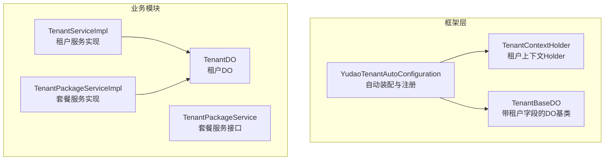
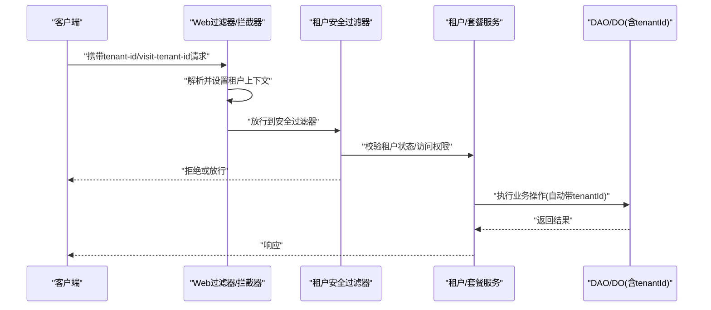
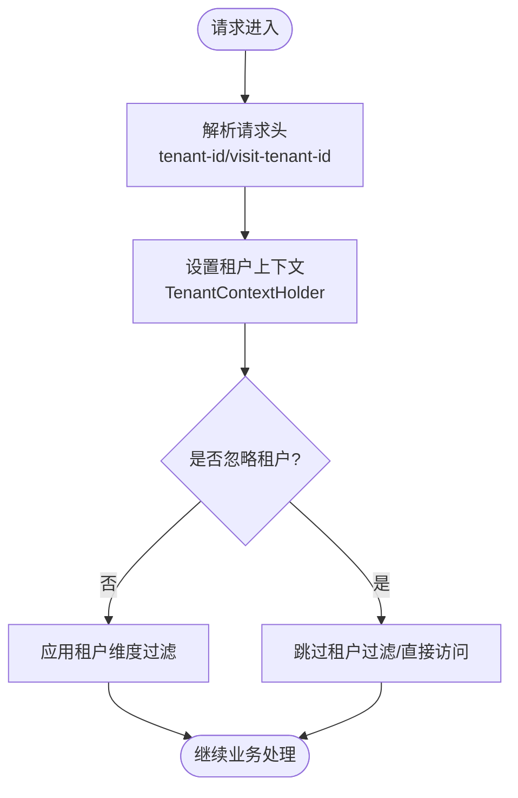
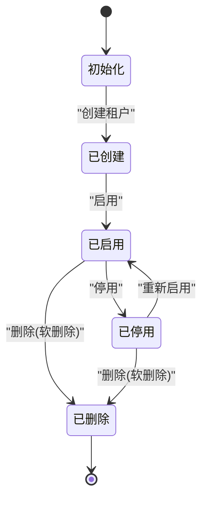
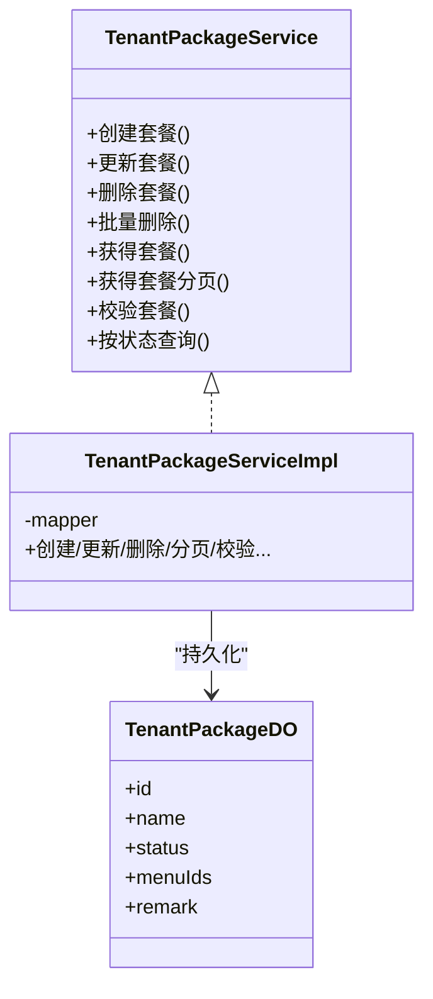
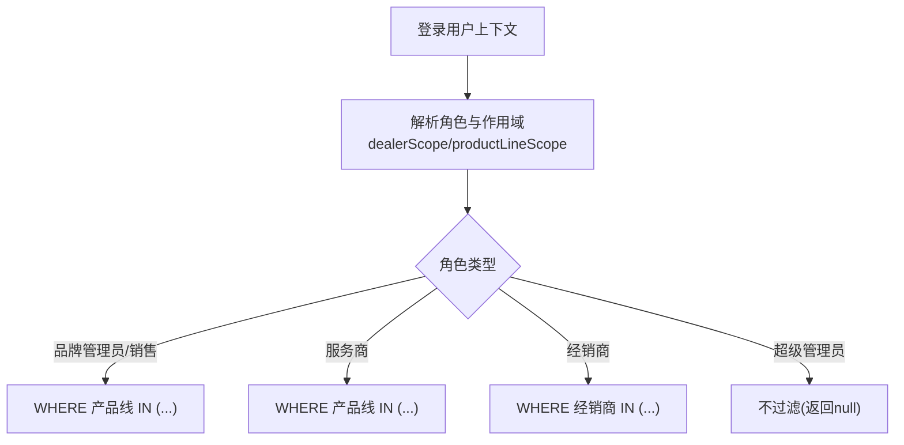
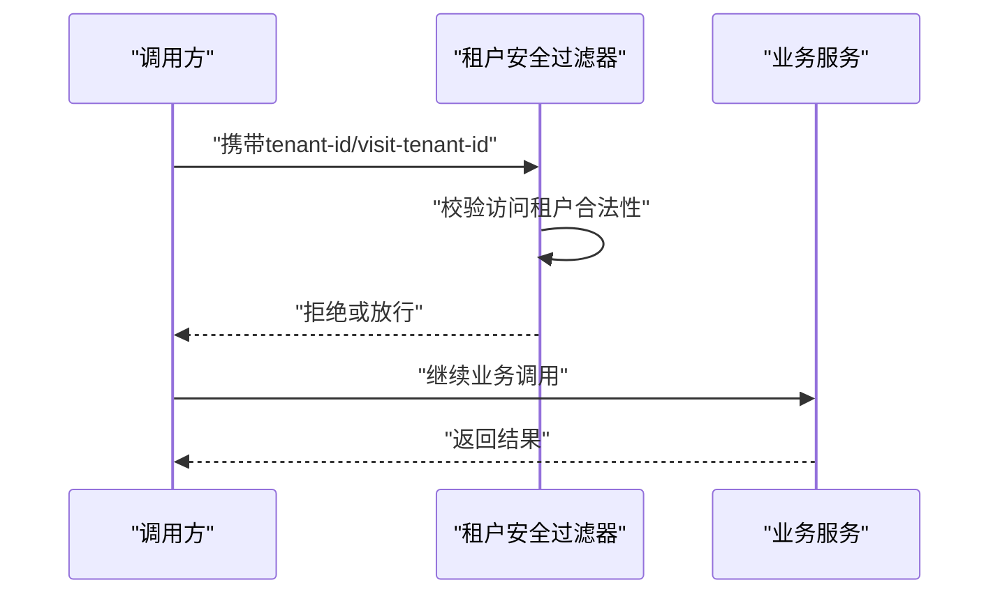
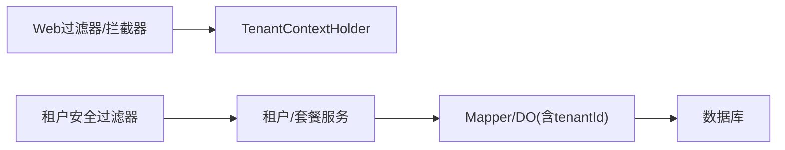

# 租户管理

<cite>
**本文引用的文件**
- [YudaoTenantAutoConfiguration.java](file://yudao-framework/yudao-spring-boot-starter-biz-tenant/src/main/java/cn/iocoder/yudao/framework/tenant/config/YudaoTenantAutoConfiguration.java)
- [TenantContextHolder.java](file://yudao-framework/yudao-spring-boot-starter-biz-tenant/src/main/java/cn/iocoder/yudao/framework/tenant/core/context/TenantContextHolder.java)
- [TenantBaseDO.java](file://yudao-framework/yudao-spring-boot-starter-biz-tenant/src/main/java/cn/iocoder/yudao/framework/tenant/core/db/TenantBaseDO.java)
- [TenantPackageService.java](file://yudao-module-system/src/main/java/cn/iocoder/yudao/module/system/service/tenant/TenantPackageService.java)
- [TenantPackageServiceImpl.java](file://yudao-module-system/src/main/java/cn/iocoder/yudao/module/system/service/tenant/TenantPackageServiceImpl.java)
- [TenantDO.java](file://yudao-module-system/src/main/java/cn/iocoder/yudao/module/system/dal/dataobject/tenant/TenantDO.java)
- [TenantServiceImpl.java](file://yudao-module-system/src/main/java/cn/iocoder/yudao/module/system/service/tenant/TenantServiceImpl.java)
- [UserController.http](file://yudao-module-system/src/main/java/cn/iocoder/yudao/module/system/controller/admin/user/UserController.http)
- [PRD-用户权限设计.md](file://docs/PRD-用户权限设计.md)
</cite>

## 目录
1. [引言](#引言)
2. [项目结构](#项目结构)
3. [核心组件](#核心组件)
4. [架构总览](#架构总览)
5. [详细组件分析](#详细组件分析)
6. [依赖关系分析](#依赖关系分析)
7. [性能考虑](#性能考虑)
8. [故障排查指南](#故障排查指南)
9. [结论](#结论)
10. [附录](#附录)

## 引言
本文件面向多租户 SaaS 平台的租户管理能力，系统性阐述租户隔离策略、数据维度隔离、资源隔离方案、生命周期管理、套餐与计费、配额控制、数据权限隔离与全局过滤、跨租户访问控制，以及接口与最佳实践。文档以仓库现有实现为依据，结合代码级图示与路径引用，帮助开发者快速理解与落地。

## 项目结构
租户管理能力主要由“框架层”和“业务模块”两部分组成：
- 框架层（yudao-spring-boot-starter-biz-tenant）：提供租户上下文、Web 过滤器、安全拦截器、消息中间件隔离、作业隔离、Redis 隔离等基础设施。
- 业务模块（yudao-module-system）：提供租户与套餐的领域模型、服务接口与实现、控制器与 VO。

图表来源
- [YudaoTenantAutoConfiguration.java:83-182](file://yudao-framework/yudao-spring-boot-starter-biz-tenant/src/main/java/cn/iocoder/yudao/framework/tenant/config/YudaoTenantAutoConfiguration.java#L83-L182)
- [TenantContextHolder.java:1-68](file://yudao-framework/yudao-spring-boot-starter-biz-tenant/src/main/java/cn/iocoder/yudao/framework/tenant/core/context/TenantContextHolder.java#L1-L68)
- [TenantBaseDO.java:1-21](file://yudao-framework/yudao-spring-boot-starter-biz-tenant/src/main/java/cn/iocoder/yudao/framework/tenant/core/db/TenantBaseDO.java#L1-L21)
- [TenantServiceImpl.java](file://yudao-module-system/src/main/java/cn/iocoder/yudao/module/system/service/tenant/TenantServiceImpl.java)
- [TenantPackageService.java:1-79](file://yudao-module-system/src/main/java/cn/iocoder/yudao/module/system/service/tenant/TenantPackageService.java#L1-L79)
- [TenantPackageServiceImpl.java:1-35](file://yudao-module-system/src/main/java/cn/iocoder/yudao/module/system/service/tenant/TenantPackageServiceImpl.java#L1-L35)
- [TenantDO.java](file://yudao-module-system/src/main/java/cn/iocoder/yudao/module/system/dal/dataobject/tenant/TenantDO.java)

章节来源
- [YudaoTenantAutoConfiguration.java:83-182](file://yudao-framework/yudao-spring-boot-starter-biz-tenant/src/main/java/cn/iocoder/yudao/framework/tenant/config/YudaoTenantAutoConfiguration.java#L83-L182)
- [TenantContextHolder.java:1-68](file://yudao-framework/yudao-spring-boot-starter-biz-tenant/src/main/java/cn/iocoder/yudao/framework/tenant/core/context/TenantContextHolder.java#L1-L68)
- [TenantBaseDO.java:1-21](file://yudao-framework/yudao-spring-boot-starter-biz-tenant/src/main/java/cn/iocoder/yudao/framework/tenant/core/db/TenantBaseDO.java#L1-L21)
- [TenantPackageService.java:1-79](file://yudao-module-system/src/main/java/cn/iocoder/yudao/module/system/service/tenant/TenantPackageService.java#L1-L79)
- [TenantPackageServiceImpl.java:1-35](file://yudao-module-system/src/main/java/cn/iocoder/yudao/module/system/service/tenant/TenantPackageServiceImpl.java#L1-L35)
- [TenantDO.java](file://yudao-module-system/src/main/java/cn/iocoder/yudao/module/system/dal/dataobject/tenant/TenantDO.java)
- [TenantServiceImpl.java](file://yudao-module-system/src/main/java/cn/iocoder/yudao/module/system/service/tenant/TenantServiceImpl.java)

## 核心组件
- 租户上下文持有者：在请求线程内保存当前租户 ID 与“是否忽略租户”的标记，支持跨线程传递。
- 自动装配与注册：注册 Web 过滤器、拦截器、消息中间件初始化器、定时任务切面、Redis 隔离等 Bean。
- 基础数据对象：所有需要按租户隔离的表统一增加 tenantId 字段，便于后续全局过滤与权限控制。
- 租户与套餐服务：提供租户生命周期管理与套餐配置能力，支撑计费与配额控制。

章节来源
- [TenantContextHolder.java:1-68](file://yudao-framework/yudao-spring-boot-starter-biz-tenant/src/main/java/cn/iocoder/yudao/framework/tenant/core/context/TenantContextHolder.java#L1-L68)
- [YudaoTenantAutoConfiguration.java:83-182](file://yudao-framework/yudao-spring-boot-starter-biz-tenant/src/main/java/cn/iocoder/yudao/framework/tenant/config/YudaoTenantAutoConfiguration.java#L83-L182)
- [TenantBaseDO.java:1-21](file://yudao-framework/yudao-spring-boot-starter-biz-tenant/src/main/java/cn/iocoder/yudao/framework/tenant/core/db/TenantBaseDO.java#L1-L21)
- [TenantPackageService.java:1-79](file://yudao-module-system/src/main/java/cn/iocoder/yudao/module/system/service/tenant/TenantPackageService.java#L1-L79)
- [TenantPackageServiceImpl.java:1-35](file://yudao-module-system/src/main/java/cn/iocoder/yudao/module/system/service/tenant/TenantPackageServiceImpl.java#L1-L35)

## 架构总览
租户管理的运行时架构围绕“请求进入—上下文解析—安全校验—业务执行—结果返回”展开，关键节点包括：
- Web 层：注册租户上下文过滤器与访问拦截器，解析请求头中的租户标识。
- 安全层：租户安全过滤器对未授权或越权访问进行拦截。
- 业务层：服务层通过上下文与数据权限规则完成数据隔离与全局过滤。
- 存储层：DAO 层基于 DO 基类自动带上 tenantId，配合全局过滤生效。

图表来源
- [YudaoTenantAutoConfiguration.java:83-182](file://yudao-framework/yudao-spring-boot-starter-biz-tenant/src/main/java/cn/iocoder/yudao/framework/tenant/config/YudaoTenantAutoConfiguration.java#L83-L182)
- [UserController.http:1-11](file://yudao-module-system/src/main/java/cn/iocoder/yudao/module/system/controller/admin/user/UserController.http#L1-L11)
- [TenantBaseDO.java:1-21](file://yudao-framework/yudao-spring-boot-starter-biz-tenant/src/main/java/cn/iocoder/yudao/framework/tenant/core/db/TenantBaseDO.java#L1-L21)

## 详细组件分析

### 组件一：租户上下文与全局过滤
- 租户上下文持有者负责在线程本地存储当前租户 ID 与忽略标志，避免在分布式链路中丢失。
- Web 层注册过滤器与拦截器，将请求头中的租户标识注入上下文；同时提供“访问租户”参数，支持跨租户访问场景。
- 结合数据权限与全局过滤，确保所有数据访问均受租户维度约束。

图表来源
- [YudaoTenantAutoConfiguration.java:83-124](file://yudao-framework/yudao-spring-boot-starter-biz-tenant/src/main/java/cn/iocoder/yudao/framework/tenant/config/YudaoTenantAutoConfiguration.java#L83-L124)
- [TenantContextHolder.java:1-68](file://yudao-framework/yudao-spring-boot-starter-biz-tenant/src/main/java/cn/iocoder/yudao/framework/tenant/core/context/TenantContextHolder.java#L1-L68)

章节来源
- [YudaoTenantAutoConfiguration.java:83-124](file://yudao-framework/yudao-spring-boot-starter-biz-tenant/src/main/java/cn/iocoder/yudao/framework/tenant/config/YudaoTenantAutoConfiguration.java#L83-L124)
- [TenantContextHolder.java:1-68](file://yudao-framework/yudao-spring-boot-starter-biz-tenant/src/main/java/cn/iocoder/yudao/framework/tenant/core/context/TenantContextHolder.java#L1-L68)

### 组件二：租户生命周期管理（创建/配置/停用/删除）
- 生命周期入口：系统模块提供租户服务接口与实现，封装租户的创建、更新、删除、启用/停用、校验等能力。
- 配置与套餐：租户与套餐解耦，套餐定义菜单权限与状态，租户绑定套餐后继承相应权限集。
- 删除策略：建议采用软删除+异步清理，避免强一致带来的长事务与锁竞争。

图表来源
- [TenantPackageService.java:1-79](file://yudao-module-system/src/main/java/cn/iocoder/yudao/module/system/service/tenant/TenantPackageService.java#L1-L79)
- [TenantPackageServiceImpl.java:1-35](file://yudao-module-system/src/main/java/cn/iocoder/yudao/module/system/service/tenant/TenantPackageServiceImpl.java#L1-L35)
- [TenantServiceImpl.java](file://yudao-module-system/src/main/java/cn/iocoder/yudao/module/system/service/tenant/TenantServiceImpl.java)

章节来源
- [TenantPackageService.java:1-79](file://yudao-module-system/src/main/java/cn/iocoder/yudao/module/system/service/tenant/TenantPackageService.java#L1-L79)
- [TenantPackageServiceImpl.java:1-35](file://yudao-module-system/src/main/java/cn/iocoder/yudao/module/system/service/tenant/TenantPackageServiceImpl.java#L1-L35)
- [TenantServiceImpl.java](file://yudao-module-system/src/main/java/cn/iocoder/yudao/module/system/service/tenant/TenantServiceImpl.java)

### 组件三：租户套餐管理、计费模式与配额控制
- 套餐模型：套餐包含名称、状态、菜单集合、备注等，用于控制租户可用功能范围。
- 计费与配额：可通过套餐状态与菜单集合实现“功能开关”，结合业务侧的用量统计与阈值告警实现配额控制。
- 变更流程：修改套餐不影响存量租户，新增租户可选择新套餐；支持批量操作与状态筛选。

图表来源
- [TenantPackageService.java:1-79](file://yudao-module-system/src/main/java/cn/iocoder/yudao/module/system/service/tenant/TenantPackageService.java#L1-L79)
- [TenantPackageServiceImpl.java:1-35](file://yudao-module-system/src/main/java/cn/iocoder/yudao/module/system/service/tenant/TenantPackageServiceImpl.java#L1-L35)
- [TenantDO.java](file://yudao-module-system/src/main/java/cn/iocoder/yudao/module/system/dal/dataobject/tenant/TenantDO.java)

章节来源
- [TenantPackageService.java:1-79](file://yudao-module-system/src/main/java/cn/iocoder/yudao/module/system/service/tenant/TenantPackageService.java#L1-L79)
- [TenantPackageServiceImpl.java:1-35](file://yudao-module-system/src/main/java/cn/iocoder/yudao/module/system/service/tenant/TenantPackageServiceImpl.java#L1-L35)
- [TenantDO.java](file://yudao-module-system/src/main/java/cn/iocoder/yudao/module/system/dal/dataobject/tenant/TenantDO.java)

### 组件四：数据维度隔离与全局过滤
- 数据维度：系统 PRD 中明确业务模块以“经销商/产品线”为隔离维度，而非传统部门维度；系统管理模块仍可使用部门维度。
- 全局过滤：结合租户上下文与数据权限规则，自动在 SQL 中追加 WHERE 条件，实现跨模块的全局过滤。
- 跨模块共存：不同模块通过注解启用不同的数据权限规则，避免冲突。

图表来源
- [PRD-用户权限设计.md:314-343](file://docs/PRD-用户权限设计.md#L314-L343)

章节来源
- [PRD-用户权限设计.md:304-343](file://docs/PRD-用户权限设计.md#L304-L343)

### 组件五：跨租户访问控制
- 访问控制：通过请求头中的“访问租户”参数允许特定场景下的跨租户访问；默认以当前租户上下文为准。
- 安全校验：安全过滤器在放行前校验访问合法性，防止越权访问。

图表来源
- [YudaoTenantAutoConfiguration.java:114-124](file://yudao-framework/yudao-spring-boot-starter-biz-tenant/src/main/java/cn/iocoder/yudao/framework/tenant/config/YudaoTenantAutoConfiguration.java#L114-L124)
- [UserController.http:1-11](file://yudao-module-system/src/main/java/cn/iocoder/yudao/module/system/controller/admin/user/UserController.http#L1-L11)

章节来源
- [YudaoTenantAutoConfiguration.java:114-124](file://yudao-framework/yudao-spring-boot-starter-biz-tenant/src/main/java/cn/iocoder/yudao/framework/tenant/config/YudaoTenantAutoConfiguration.java#L114-L124)
- [UserController.http:1-11](file://yudao-module-system/src/main/java/cn/iocoder/yudao/module/system/controller/admin/user/UserController.http#L1-L11)

### 组件六：租户感知的数据访问与配置管理
- 数据访问：所有需要按租户隔离的实体继承带租户字段的 DO 基类，确保持久化层自动带上 tenantId。
- 配置管理：通过套餐与菜单集合实现功能开关；租户绑定套餐后继承其权限集。
- 示例路径：以下路径展示了关键实现位置，便于定位与扩展。
  - [租户上下文持有者:1-68](file://yudao-framework/yudao-spring-boot-starter-biz-tenant/src/main/java/cn/iocoder/yudao/framework/tenant/core/context/TenantContextHolder.java#L1-L68)
  - [自动装配与注册:83-182](file://yudao-framework/yudao-spring-boot-starter-biz-tenant/src/main/java/cn/iocoder/yudao/framework/tenant/config/YudaoTenantAutoConfiguration.java#L83-L182)
  - [DO 基类:1-21](file://yudao-framework/yudao-spring-boot-starter-biz-tenant/src/main/java/cn/iocoder/yudao/framework/tenant/core/db/TenantBaseDO.java#L1-L21)
  - [租户服务接口:1-79](file://yudao-module-system/src/main/java/cn/iocoder/yudao/module/system/service/tenant/TenantPackageService.java#L1-L79)
  - [租户服务实现:1-35](file://yudao-module-system/src/main/java/cn/iocoder/yudao/module/system/service/tenant/TenantPackageServiceImpl.java#L1-L35)
  - [租户 DO](file://yudao-module-system/src/main/java/cn/iocoder/yudao/module/system/dal/dataobject/tenant/TenantDO.java)

章节来源
- [TenantContextHolder.java:1-68](file://yudao-framework/yudao-spring-boot-starter-biz-tenant/src/main/java/cn/iocoder/yudao/framework/tenant/core/context/TenantContextHolder.java#L1-L68)
- [YudaoTenantAutoConfiguration.java:83-182](file://yudao-framework/yudao-spring-boot-starter-biz-tenant/src/main/java/cn/iocoder/yudao/framework/tenant/config/YudaoTenantAutoConfiguration.java#L83-L182)
- [TenantBaseDO.java:1-21](file://yudao-framework/yudao-spring-boot-starter-biz-tenant/src/main/java/cn/iocoder/yudao/framework/tenant/core/db/TenantBaseDO.java#L1-L21)
- [TenantPackageService.java:1-79](file://yudao-module-system/src/main/java/cn/iocoder/yudao/module/system/service/tenant/TenantPackageService.java#L1-L79)
- [TenantPackageServiceImpl.java:1-35](file://yudao-module-system/src/main/java/cn/iocoder/yudao/module/system/service/tenant/TenantPackageServiceImpl.java#L1-L35)
- [TenantDO.java](file://yudao-module-system/src/main/java/cn/iocoder/yudao/module/system/dal/dataobject/tenant/TenantDO.java)

### 组件七：租户迁移方案（概念性）
- 数据迁移：建议采用“双写+延迟切换”策略，先在新租户写入，再逐步迁移旧数据，最后切换流量。
- 配置迁移：套餐与菜单集合保持一致，确保迁移前后功能一致。
- 风险控制：迁移过程中保留回滚路径，监控迁移进度与一致性。

（本节为概念性内容，不直接对应具体源码）

## 依赖关系分析
- 框架层依赖业务模块的租户与套餐实体，通过 DO 基类统一注入 tenantId。
- 业务模块的服务实现依赖 Mapper 与 DO，提供完整的 CRUD 与分页能力。
- Web 层与安全层依赖框架提供的上下文与过滤器，形成闭环的租户感知链路。

图表来源
- [YudaoTenantAutoConfiguration.java:83-182](file://yudao-framework/yudao-spring-boot-starter-biz-tenant/src/main/java/cn/iocoder/yudao/framework/tenant/config/YudaoTenantAutoConfiguration.java#L83-L182)
- [TenantBaseDO.java:1-21](file://yudao-framework/yudao-spring-boot-starter-biz-tenant/src/main/java/cn/iocoder/yudao/framework/tenant/core/db/TenantBaseDO.java#L1-L21)

章节来源
- [YudaoTenantAutoConfiguration.java:83-182](file://yudao-framework/yudao-spring-boot-starter-biz-tenant/src/main/java/cn/iocoder/yudao/framework/tenant/config/YudaoTenantAutoConfiguration.java#L83-L182)
- [TenantBaseDO.java:1-21](file://yudao-framework/yudao-spring-boot-starter-biz-tenant/src/main/java/cn/iocoder/yudao/framework/tenant/core/db/TenantBaseDO.java#L1-L21)

## 性能考虑
- 线程本地存储：使用可跨线程传递的上下文容器，减少参数透传成本。
- 全局过滤：尽量在 SQL 层面一次性完成过滤，避免在业务层重复判断。
- 缓存与索引：对常用查询（如按租户分页）建立合适索引，必要时引入缓存降低 DB 压力。
- 异步处理：删除与迁移等重操作采用异步队列，避免阻塞主流程。
- 并发控制：在高并发场景下，注意租户维度的锁粒度与超时策略。

（本节提供通用指导，不直接分析具体文件）

## 故障排查指南
- 问题：租户上下文缺失导致空指针
  - 排查：确认 Web 层过滤器是否正确解析请求头并设置上下文。
  - 参考：[租户上下文持有者:1-68](file://yudao-framework/yudao-spring-boot-starter-biz-tenant/src/main/java/cn/iocoder/yudao/framework/tenant/core/context/TenantContextHolder.java#L1-L68)
- 问题：跨租户访问被拒绝
  - 排查：检查安全过滤器配置与访问租户参数是否正确。
  - 参考：[租户安全过滤器注册:114-124](file://yudao-framework/yudao-spring-boot-starter-biz-tenant/src/main/java/cn/iocoder/yudao/framework/tenant/config/YudaoTenantAutoConfiguration.java#L114-L124)、[示例请求:1-11](file://yudao-module-system/src/main/java/cn/iocoder/yudao/module/system/controller/admin/user/UserController.http#L1-L11)
- 问题：数据越权可见
  - 排查：确认 DO 是否继承带租户字段的基类，SQL 是否正确追加过滤条件。
  - 参考：[DO 基类:1-21](file://yudao-framework/yudao-spring-boot-starter-biz-tenant/src/main/java/cn/iocoder/yudao/framework/tenant/core/db/TenantBaseDO.java#L1-L21)

章节来源
- [TenantContextHolder.java:1-68](file://yudao-framework/yudao-spring-boot-starter-biz-tenant/src/main/java/cn/iocoder/yudao/framework/tenant/core/context/TenantContextHolder.java#L1-L68)
- [YudaoTenantAutoConfiguration.java:114-124](file://yudao-framework/yudao-spring-boot-starter-biz-tenant/src/main/java/cn/iocoder/yudao/framework/tenant/config/YudaoTenantAutoConfiguration.java#L114-L124)
- [UserController.http:1-11](file://yudao-module-system/src/main/java/cn/iocoder/yudao/module/system/controller/admin/user/UserController.http#L1-L11)
- [TenantBaseDO.java:1-21](file://yudao-framework/yudao-spring-boot-starter-biz-tenant/src/main/java/cn/iocoder/yudao/framework/tenant/core/db/TenantBaseDO.java#L1-L21)

## 结论
本项目通过“框架层基础设施 + 业务模块领域模型”的组合，构建了完善的多租户能力：租户上下文贯穿请求全链路，安全过滤器保障访问合规，数据权限与全局过滤实现细粒度隔离，套餐体系支撑灵活的计费与配额控制。建议在生产环境中结合缓存、索引与异步处理进一步提升性能，并完善迁移与回滚策略以保障稳定性。

## 附录
- 示例路径（仅路径，不含代码内容）：
  - [租户上下文持有者:1-68](file://yudao-framework/yudao-spring-boot-starter-biz-tenant/src/main/java/cn/iocoder/yudao/framework/tenant/core/context/TenantContextHolder.java#L1-L68)
  - [自动装配与注册:83-182](file://yudao-framework/yudao-spring-boot-starter-biz-tenant/src/main/java/cn/iocoder/yudao/framework/tenant/config/YudaoTenantAutoConfiguration.java#L83-L182)
  - [DO 基类:1-21](file://yudao-framework/yudao-spring-boot-starter-biz-tenant/src/main/java/cn/iocoder/yudao/framework/tenant/core/db/TenantBaseDO.java#L1-L21)
  - [租户服务接口:1-79](file://yudao-module-system/src/main/java/cn/iocoder/yudao/module/system/service/tenant/TenantPackageService.java#L1-L79)
  - [租户服务实现:1-35](file://yudao-module-system/src/main/java/cn/iocoder/yudao/module/system/service/tenant/TenantPackageServiceImpl.java#L1-L35)
  - [租户 DO](file://yudao-module-system/src/main/java/cn/iocoder/yudao/module/system/dal/dataobject/tenant/TenantDO.java)
  - [跨租户访问示例:1-11](file://yudao-module-system/src/main/java/cn/iocoder/yudao/module/system/controller/admin/user/UserController.http#L1-L11)
  - [数据维度隔离设计:314-343](file://docs/PRD-用户权限设计.md#L314-L343)