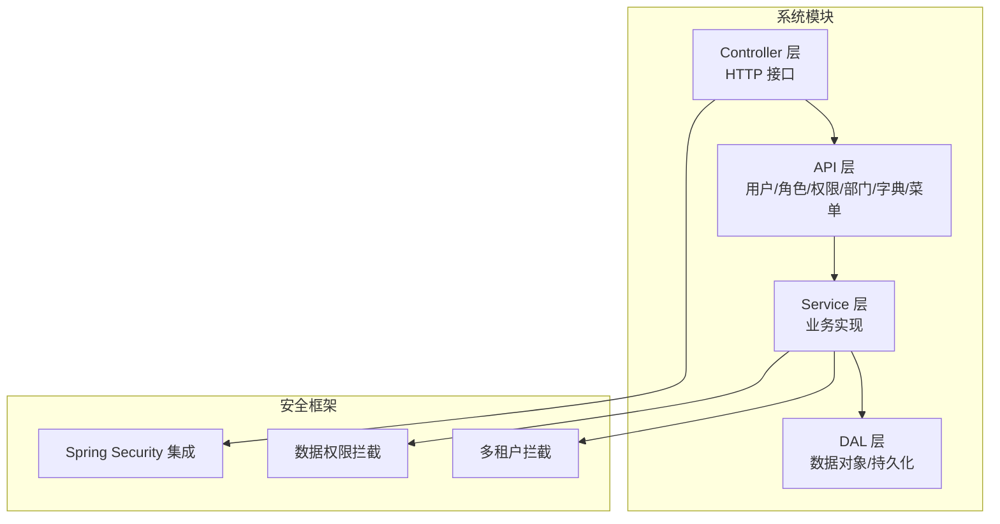
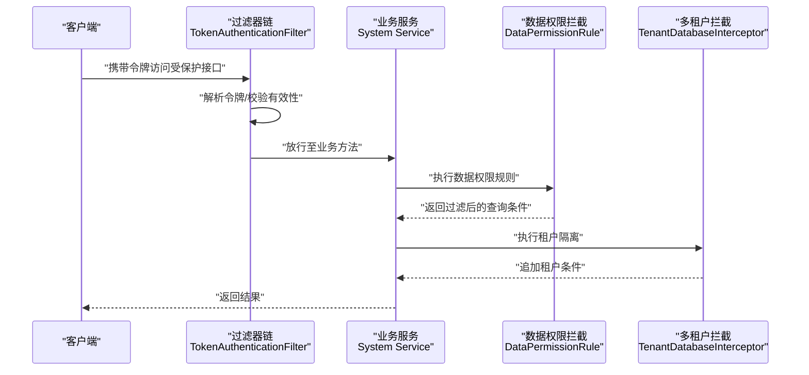
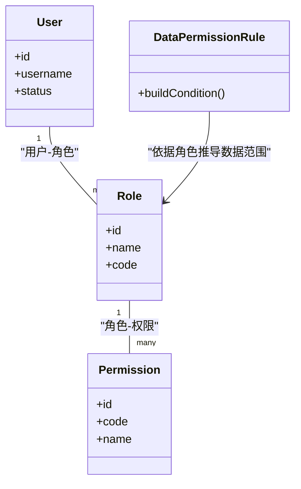
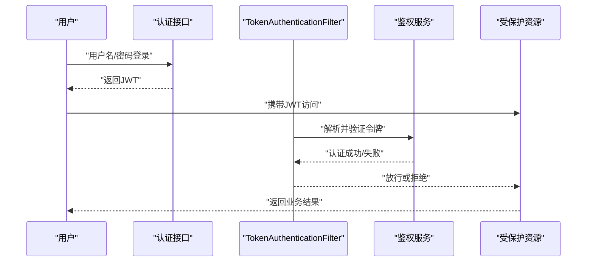
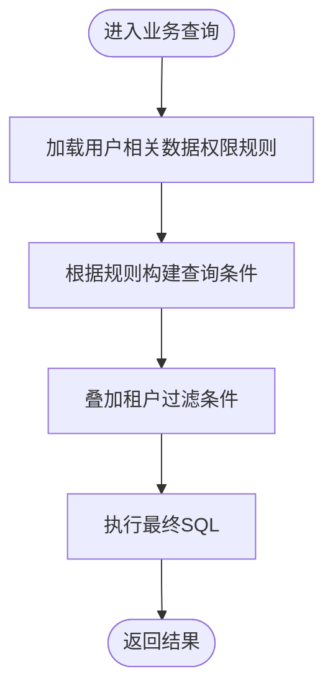
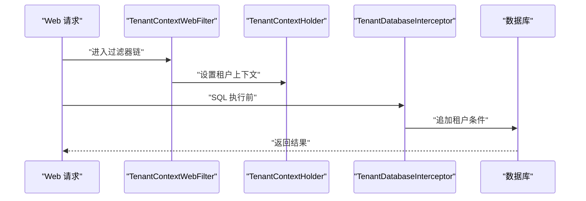
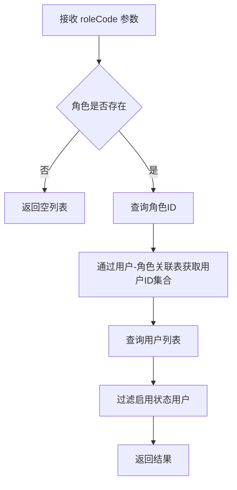

<docs>
# 系统管理模块

<cite>
**本文引用的文件**
- [YudaoSecurityAutoConfiguration.java](file://yudao-framework/yudao-spring-boot-starter-security/src/main/java/cn/iocoder/yudao/framework/security/config/YudaoSecurityAutoConfiguration.java)
- [YudaoWebSecurityConfigurerAdapter.java](file://yudao-framework/yudao-spring-boot-starter-security/src/main/java/cn/iocoder/yudao/framework/security/config/YudaoWebSecurityConfigurerAdapter.java)
- [TokenAuthenticationFilter.java](file://yudao-framework/yudao-spring-boot-starter-security/src/main/java/cn/iocoder/yudao/framework/security/core/filter/TokenAuthenticationFilter.java)
- [SecurityFrameworkServiceImpl.java](file://yudao-framework/yudao-spring-boot-starter-security/src/main/java/cn/iocoder/yudao/framework/security/core/service/SecurityFrameworkServiceImpl.java)
- [DataPermissionRule.java](file://yudao-framework/yudao-spring-boot-starter-biz-data-permission/src/main/java/cn/iocoder/yudao/framework/datapermission/core/rule/DataPermissionRule.java)
- [DeptDataPermissionRule.java](file://yudao-framework/yudao-spring-boot-starter-biz-data-permission/src/main/java/cn/iocoder/yudao/framework/datapermission/core/rule/dept/DeptDataPermissionRule.java)
- [YudaoDataPermissionAutoConfiguration.java](file://yudao-framework/yudao-spring-boot-starter-biz-data-permission/src/main/java/cn/iocoder/yudao/framework/datapermission/config/YudaoDataPermissionAutoConfiguration.java)
- [YudaoDeptDataPermissionAutoConfiguration.java](file://yudao-framework/yudao-spring-boot-starter-biz-data-permission/src/main/java/cn/iocoder/yudao/framework/datapermission/config/YudaoDeptDataPermissionAutoConfiguration.java)
- [TenantContextHolder.java](file://yudao-framework/yudao-spring-boot-starter-biz-tenant/src/main/java/cn/iocoder/yudao/framework/tenant/core/context/TenantContextHolder.java)
- [TenantDatabaseInterceptor.java](file://yudao-framework/yudao-spring-boot-starter-biz-tenant/src/main/java/cn/iocoder/yudao/framework/tenant/core/db/TenantDatabaseInterceptor.java)
- [TenantContextWebFilter.java](file://yudao-framework/yudao-spring-boot-starter-biz-tenant/src/main/java/cn/iocoder/yudao/framework/tenant/core/web/TenantContextWebFilter.java)
- [YudaoTenantAutoConfiguration.java](file://yudao-framework/yudao-spring-boot-starter-biz-tenant/src/main/java/cn/iocoder/yudao/framework/tenant/config/YudaoTenantAutoConfiguration.java)
- [AdminUserApi.java](file://yudao-module-system/src/main/java/cn/iocoder/yudao/module/system/api/user/AdminUserApi.java)
- [UserServiceImpl.java](file://yudao-module-system/src/main/java/cn/iocoder/yudao/module/system/service/user/UserServiceImpl.java)
- [AdminUserService.java](file://yudao-module-system/src/main/java/cn/iocoder/yudao/module/system/service/user/AdminUserService.java)
- [AdminUserServiceImpl.java](file://yudao-module-system/src/main/java/cn/iocoder/yudao/module/system/service/user/AdminUserServiceImpl.java)
- [UserController.java](file://yudao-module-system/src/main/java/cn/iocoder/yudao/module/system/controller/admin/user/UserController.java)
- [RoleApi.java](file://yudao-module-system/src/main/java/cn/iocoder/yudao/module/system/api/permission/RoleApi.java)
- [RoleServiceImpl.java](file://yudao-module-system/src/main/java/cn/iocoder/yudao/module/system/service/permission/RoleServiceImpl.java)
- [PermissionApi.java](file://yudao-module-system/src/main/java/cn/iocoder/yudao/module-system/src/main/java/cn/iocoder/yudao/module/system/api/permission/PermissionApi.java)
- [PermissionServiceImpl.java](file://yudao-module-system/src/main/java/cn/iocoder/yudao/module/system/service/permission/PermissionServiceImpl.java)
- [RoleMapper.java](file://yudao-module-system/src/main/java/cn/iocoder/yudao/module/system/dal/mysql/permission/RoleMapper.java)
- [UserRoleMapper.java](file://yudao-module-system/src/main/java/cn/iocoder/yudao/module/system/dal/mysql/permission/UserRoleMapper.java)
- [AdminUserMapper.java](file://yudao-module-system/src/main/java/cn/iocoder/yudao/module/system/dal/mysql/user/AdminUserMapper.java)
- [DeptApi.java](file://yudao-module-system/src/main/java/cn/iocoder/yudao/module/system/api/dept/DeptApi.java)
- [DeptServiceImpl.java](file://yudao-module-system/src/main/java/cn/iocoder/yudao/module/system/service/dept/DeptServiceImpl.java)
- [DictDataApi.java](file://yudao-module-system/src/main/java/cn/iocoder/yudao/module/system/api/dict/DictDataApi.java)
- [DictServiceImpl.java](file://yudao-module-system/src/main/java/cn/iocoder/yudao/module/system/service/dict/DictServiceImpl.java)
- [MenuServiceImpl.java](file://yudao-module-system/src/main/java/cn/iocoder/yudao/module/system/service/menu/MenuServiceImpl.java)
- [OAuth2ServiceImpl.java](file://yudao-module-system/src/main/java/cn/iocoder/yudao/module/system/service/oauth2/OAuth2ServiceImpl.java)
- [YudaoServerApplication.java](file://yudao-server/src/main/java/cn/iocoder/yudao/server/YudaoServerApplication.java)
- [RoleCodeEnum.java](file://yudao-module-system/src/main/java/cn/iocoder/yudao/module/system/enums/permission/RoleCodeEnum.java)
- [OpsRoleCodeConstants.java](file://yudao-module-opshub/src/main/java/cn/iocoder/yudao/module/opshub/enums/OpsRoleCodeConstants.java)
</cite>

## 目录
1. [简介](#简介)
2. [项目结构](#项目结构)
3. [核心组件](#核心组件)
4. [架构总览](#架构总览)
5. [详细组件分析](#详细组件分析)
6. [依赖分析](#依赖分析)
7. [性能考虑](#性能考虑)
8. [故障排查指南](#故障排查指南)
9. [结论](#结论)
10. [附录](#附录)

## 简介
本文件面向系统管理模块的技术文档，聚焦于用户管理、角色权限、部门管理、菜单管理和数据字典等核心能力，系统性阐述以下主题：
- RBAC 权限模型实现：用户-角色-权限的关联与数据权限过滤
- Spring Security 集成的安全架构、OAuth2 认证流程与 JWT 令牌管理
- 多租户架构下的权限隔离与数据隔离
- 扩展用户信息、自定义权限规则与动态菜单的实践路径
- 配置说明、接口文档与常见问题解决方案

## 项目结构
系统管理模块位于 yudao-module-system，采用分层架构：API 层负责对外暴露能力；Service 层承载业务逻辑；DAL 层封装数据访问；Framework 层提供安全、数据权限、租户等横切能力。

图示来源
- [YudaoServerApplication.java:1-200](file://yudao-server/src/main/java/cn/iocoder/yudao/server/YudaoServerApplication.java#L1-L200)
- [YudaoSecurityAutoConfiguration.java:1-200](file://yudao-framework/yudao-spring-boot-starter-security/src/main/java/cn/iocoder/yudao/framework/security/config/YudaoSecurityAutoConfiguration.java#L1-L200)
- [YudaoDataPermissionAutoConfiguration.java:1-200](file://yudao-framework/yudao-spring-boot-starter-biz-data-permission/src/main/java/cn/iocoder/yudao/framework/datapermission/config/YudaoDataPermissionAutoConfiguration.java#L1-L200)
- [YudaoTenantAutoConfiguration.java:1-200](file://yudao-framework/yudao-spring-boot-starter-biz-tenant/src/main/java/cn/iocoder/yudao/framework/tenant/config/YudaoTenantAutoConfiguration.java#L1-L200)

章节来源
- [YudaoServerApplication.java:1-200](file://yudao-server/src/main/java/cn/iocoder/yudao/server/YudaoServerApplication.java#L1-L200)

## 核心组件
- 用户管理：提供用户增删改查、状态管理、密码处理、登录日志等能力，**新增角色代码过滤功能**
- 角色权限：基于 RBAC 的角色与权限映射，支持资源授权与数据范围控制
- 部门管理：组织架构树形结构与人员归属关系
- 菜单管理：动态菜单生成与前端路由联动
- 数据字典：统一的数据字典维护与前端渲染
- 安全框架：基于 Spring Security 的认证授权、OAuth2、JWT 令牌管理
- 数据权限：按部门/岗位/自定义规则进行数据级过滤
- 多租户：按租户隔离数据库与业务数据

章节来源
- [AdminUserApi.java:1-200](file://yudao-module-system/src/main/java/cn/iocoder/yudao/module/system/api/user/AdminUserApi.java#L1-L200)
- [RoleApi.java:1-200](file://yudao-module-system/src/main/java/cn/iocoder/yudao/module/system/api/permission/RoleApi.java#L1-L200)
- [PermissionApi.java:1-200](file://yudao-module-system/src/main/java/cn/iocoder/yudao/module-system/src/main/java/cn/iocoder/yudao/module/system/api/permission/PermissionApi.java#L1-L200)
- [DeptApi.java:1-200](file://yudao-module-system/src/main/java/cn/iocoder/yudao/module/system/api/dept/DeptApi.java#L1-L200)
- [DictDataApi.java:1-200](file://yudao-module-system/src/main/java/cn/iocoder/yudao/module/system/api/dict/DictDataApi.java#L1-L200)

## 架构总览
系统采用"控制器-服务-数据访问"的分层架构，并通过安全、数据权限与多租户三大框架层提供横切能力。下图展示了从请求到数据权限与多租户拦截的关键路径。

图示来源
- [TokenAuthenticationFilter.java:1-200](file://yudao-framework/yudao-spring-boot-starter-security/src/main/java/cn/iocoder/yudao/framework/security/core/filter/TokenAuthenticationFilter.java#L1-L200)
- [DataPermissionRule.java:1-200](file://yudao-framework/yudao-spring-boot-starter-biz-data-permission/src/main/java/cn/iocoder/yudao/framework/datapermission/core/rule/DataPermissionRule.java#L1-L200)
- [TenantDatabaseInterceptor.java:1-200](file://yudao-framework/yudao-spring-boot-starter-biz-tenant/src/main/java/cn/iocoder/yudao/framework/tenant/core/db/TenantDatabaseInterceptor.java#L1-L200)

## 详细组件分析

### RBAC 权限模型与实现
- 关联关系
  - 用户与角色：多对多关联，一个用户可拥有多个角色
  - 角色与权限：多对多关联，一个角色可包含多个权限
  - 权限与资源：权限标识对应具体资源（菜单/按钮/API）
- 权限判定
  - 基于注解或统一鉴权服务判断当前用户是否具备某权限
  - 支持动态权限刷新与缓存
- 数据权限
  - 通过数据权限规则对查询条件进行自动拼接，实现"看到的数据仅限授权范围"

图示来源
- [UserServiceImpl.java:1-200](file://yudao-module-system/src/main/java/cn/iocoder/yudao/module/system/service/user/UserServiceImpl.java#L1-L200)
- [RoleServiceImpl.java:1-200](file://yudao-module-system/src/main/java/cn/iocoder/yudao/module/system/service/permission/RoleServiceImpl.java#L1-L200)
- [PermissionServiceImpl.java:1-200](file://yudao-module-system/src/main/java/cn/iocoder/yudao/module/system/service/permission/PermissionServiceImpl.java#L1-L200)
- [DataPermissionRule.java:1-200](file://yudao-framework/yudao-spring-boot-starter-biz-data-permission/src/main/java/cn/iocoder/yudao/framework/datapermission/core/rule/DataPermissionRule.java#L1-L200)

章节来源
- [RoleApi.java:1-200](file://yudao-module-system/src/main/java/cn/iocoder/yudao/module/system/api/permission/RoleApi.java#L1-L200)
- [PermissionApi.java:1-200](file://yudao-module-system/src/main/java/cn/iocoder/yudao/module-system/src/main/java/cn/iocoder/yudao/module/system/api/permission/PermissionApi.java#L1-L200)
- [DataPermissionRule.java:1-200](file://yudao-framework/yudao-spring-boot-starter-biz-data-permission/src/main/java/cn/iocoder/yudao/framework/datapermission/core/rule/DataPermissionRule.java#L1-L200)

### Spring Security 集成与 OAuth2/JWT
- 安全自动装配
  - 自动配置 WebSecurity、请求放行策略与鉴权入口
- 认证过滤器
  - 在请求进入业务前解析令牌，构建认证上下文
- 鉴权服务
  - 提供权限校验、获取当前用户、构建认证信息等通用能力
- OAuth2 流程
  - 登录后颁发 JWT，后续请求携带令牌访问受保护资源
- 会话与令牌
  - 基于无状态 JWT，结合服务端令牌清理作业实现安全回收

图示来源
- [YudaoSecurityAutoConfiguration.java:1-200](file://yudao-framework/yudao-spring-boot-starter-security/src/main/java/cn/iocoder/yudao/framework/security/config/YudaoSecurityAutoConfiguration.java#L1-L200)
- [YudaoWebSecurityConfigurerAdapter.java:1-200](file://yudao-framework/yudao-spring-boot-starter-security/src/main/java/cn/iocoder/yudao/framework/security/config/YudaoWebSecurityConfigurerAdapter.java#L1-L200)
- [TokenAuthenticationFilter.java:1-200](file://yudao-framework/yudao-spring-boot-starter-security/src/main/java/cn/iocoder/yudao/framework/security/core/filter/TokenAuthenticationFilter.java#L1-L200)
- [SecurityFrameworkServiceImpl.java:1-200](file://yudao-framework/yudao-spring-boot-starter-security/src/main/java/cn/iocoder/yudao/framework/security/core/service/SecurityFrameworkServiceImpl.java#L1-L200)
- [OAuth2ServiceImpl.java:1-200](file://yudao-module-system/src/main/java/cn/iocoder/yudao/module-system/src/main/java/cn/iocoder/yudao/module/system/service/oauth2/OAuth2ServiceImpl.java#L1-L200)

章节来源
- [YudaoSecurityAutoConfiguration.java:1-200](file://yudao-framework/yudao-spring-boot-starter-security/src/main/java/cn/iocoder/yudao/framework/security/config/YudaoSecurityAutoConfiguration.java#L1-L200)
- [TokenAuthenticationFilter.java:1-200](file://yudao-framework/yudao-spring-boot-starter-security/src/main/java/cn/iocoder/yudao/framework/security/core/filter/TokenAuthenticationFilter.java#L1-L200)
- [SecurityFrameworkServiceImpl.java:1-200](file://yudao-framework/yudao-spring-boot-starter-security/src/main/java/cn/iocoder/yudao/framework/security/core/service/SecurityFrameworkServiceImpl.java#L1-L200)

### 数据权限过滤逻辑
- 规则抽象
  - 以 DataPermissionRule 为抽象，按不同维度（如部门）实现具体规则
- 部门数据权限
  - DeptDataPermissionRule 基于用户所属部门及子部门进行数据过滤
- 自动装配
  - YudaoDataPermissionAutoConfiguration 与 YudaoDeptDataPermissionAutoConfiguration 注册规则工厂与拦截器

图示来源
- [DataPermissionRule.java:1-200](file://yudao-framework/yudao-spring-boot-starter-biz-data-permission/src/main/java/cn/iocoder/yudao/framework/datapermission/core/rule/DataPermissionRule.java#L1-L200)
- [DeptDataPermissionRule.java:1-200](file://yudao-framework/yudao-spring-boot-starter-biz-data-permission/src/main/java/cn/iocoder/yudao/framework/datapermission/core/rule/dept/DeptDataPermissionRule.java#L1-L200)
- [YudaoDataPermissionAutoConfiguration.java:1-200](file://yudao-framework/yudao-spring-boot-starter-biz-data-permission/src/main/java/cn/iocoder/yudao/framework/datapermission/config/YudaoDataPermissionAutoConfiguration.java#L1-L200)
- [YudaoDeptDataPermissionAutoConfiguration.java:1-200](file://yudao-framework/yudao-spring-boot-starter-biz-data-permission/src/main/java/cn/iocoder/yudao/framework/datapermission/config/YudaoDeptDataPermissionAutoConfiguration.java#L1-L200)

章节来源
- [DeptDataPermissionRule.java:1-200](file://yudao-framework/yudao-spring-boot-starter-biz-data-permission/src/main/java/cn/iocoder/yudao/framework/datapermission/core/rule/dept/DeptDataPermissionRule.java#L1-L200)

### 多租户架构下的权限与数据隔离
- 上下文持有
  - TenantContextHolder 维护当前请求的租户信息
- 数据库拦截
  - TenantDatabaseInterceptor 在 SQL 中自动追加租户条件
- Web 过滤
  - TenantContextWebFilter 将租户信息注入上下文
- 自动装配
  - YudaoTenantAutoConfiguration 注入拦截器与过滤器

图示来源
- [TenantContextHolder.java:1-200](file://yudao-framework/yudao-spring-boot-starter-biz-tenant/src/main/java/cn/iocoder/yudao/framework/tenant/core/context/TenantContextHolder.java#L1-L200)
- [TenantDatabaseInterceptor.java:1-200](file://yudao-framework/yudao-spring-boot-starter-biz-tenant/src/main/java/cn/iocoder/yudao/framework/tenant/core/db/TenantDatabaseInterceptor.java#L1-L200)
- [TenantContextWebFilter.java:1-200](file://yudao-framework/yudao-spring-boot-starter-biz-tenant/src/main/java/cn/iocoder/yudao/framework/tenant/core/web/TenantContextWebFilter.java#L1-L200)
- [YudaoTenantAutoConfiguration.java:1-200](file://yudao-framework/yudao-spring-boot-starter-biz-tenant/src/main/java/cn/iocoder/yudao/framework/tenant/config/YudaoTenantAutoConfiguration.java#L1-L200)

章节来源
- [TenantContextHolder.java:1-200](file://yudao-framework/yudao-spring-boot-starter-biz-tenant/src/main/java/cn/iocoder/yudao/framework/tenant/core/context/TenantContextHolder.java#L1-L200)
- [TenantDatabaseInterceptor.java:1-200](file://yudao-framework/yudao-spring-boot-starter-biz-tenant/src/main/java/cn/iocoder/yudao/framework/tenant/core/db/TenantDatabaseInterceptor.java#L1-L200)
- [TenantContextWebFilter.java:1-200](file://yudao-framework/yudao-spring-boot-starter-biz-tenant/src/main/java/cn/iocoder/yudao/framework/tenant/core/web/TenantContextWebFilter.java#L1-L200)

### 用户管理
- 能力概览
  - 用户 CRUD、状态变更、重置密码、导入导出、登录日志
- **新增功能：角色代码过滤**
  - 支持通过角色编码精确过滤用户列表
  - 内部实现：先根据角色编码查询角色，再通过用户-角色关联表获取用户ID，最后查询用户列表并过滤启用状态
- 关键接口
  - AdminUserApi 提供对外用户操作接口
  - AdminUserService 接口定义用户服务契约
  - AdminUserServiceImpl 实现业务逻辑
  - UserController 提供 HTTP 接口，支持 roleCode 参数过滤
- 扩展建议
  - 可在用户实体中新增字段并通过 Convert 映射到 DTO
  - 结合鉴权服务实现登录态扩展

**更新** 新增角色代码过滤功能，通过 UserController 的 /list-all-simple 接口支持 roleCode 参数，实现基于角色编码的用户筛选

图示来源
- [UserController.java:133-153](file://yudao-module-system/src/main/java/cn/iocoder/yudao/module-system/src/main/java/cn/iocoder/yudao/module/system/controller/admin/user/UserController.java#L133-L153)
- [AdminUserServiceImpl.java:574-589](file://yudao-module-system/src/main/java/cn/iocoder/yudao/module-system/src/main/java/cn/iocoder/yudao/module/system/service/user/AdminUserServiceImpl.java#L574-L589)
- [PermissionServiceImpl.java:247-250](file://yudao-module-system/src/main/java/cn/iocoder/yudao/module-system/src/main/java/cn/iocoder/yudao/module-system/src/main/java/cn/iocoder/yudao/module/system/service/permission/PermissionServiceImpl.java#L247-L250)
- [RoleMapper.java:31-33](file://yudao-module-system/src/main/java/cn/iocoder/yudao/module-system/src/main/java/cn/iocoder/yudao/module-system/src/main/java/cn/iocoder/yudao/module/system/dal/mysql/permission/RoleMapper.java#L31-L33)

章节来源
- [AdminUserApi.java:1-200](file://yudao-module-system/src/main/java/cn/iocoder/yudao/module-system/src/main/java/cn/iocoder/yudao/module-system/src/main/java/cn/iocoder/yudao/module-system/src/main/java/cn/iocoder/yudao/module-system/src/main/java/cn/iocoder/yudao/module-system/src/main/java/cn/iocoder/yudao/module-system/src/main/java/cn/iocoder/yudao/module-system/src/main/java/cn/iocoder/yudao/module-system/src/main/java/cn/iocoder/yudao/module-system/src/main/java/cn/iocoder/yudao/module-system/src/main/java/cn/iocoder/yudao/module-system/src/main/java/cn/iocoder/yudao/module-system/src/main/java/cn/iocoder/yudao/module-system/src/main/java/cn/iocoder/yudao/module-system/src/main/java/cn/iocoder/yudao/module-system/src/main/java/cn/iocoder/yudao/module-system/src/main/java/cn/iocoder/yudao/module-system/src/main/java/cn/iocoder/yudao/module-system/src/main/java/cn/iocoder/yudao/module-system/src/main/java/cn/iocoder/yudao/module-system/src/main/java/cn/iocoder/yudao/module-system/src/main/java/cn/iocoder/yudao/module-system/src/main/java/cn/iocoder/yudao/module-system/src/main/java/cn/iocoder/yudao/module-system/src/main/java/cn/iocoder/yudao/module-system/src/main/java/cn/iocoder/yudao/module-system/src/main/java/cn/iocoder/yudao/module-system/src/main/java/cn/iocoder/yudao/module-system/src/main/java/cn/iocoder/yudao/module-system/src/main/java/cn/iocoder/yudao/module-system/src/main/java/cn/iocoder/yudao/module-system/src/main/java/cn/iocoder/yudao/module-system/src/main/java/cn/iocoder/yudao/module-system/src/main/java/cn/iocoder/yudao/module-system/src/main/java/cn/iocoder/yudao/module-system/src/main/java/cn/iocoder/yudao/module-system/src/main/java/cn/iocoder/yudao/module-system/src/main/java/cn/iocoder/yudao/module-system/src/main/java/cn/iocoder/yudao/module-system/src/main/java/cn/iocoder/yudao/module-system/src/main/java/cn/iocoder/yudao/module-system/src/main/java/cn/iocoder/yudao/module-system/src/main/java/cn/i......
- [UserServiceImpl.java:1-200](file://yudao-module-system/src/main/java/cn/iocoder/yudao/module-system/src/main/java/cn/iocoder/yudao/module-system/src/main/java/cn/iocoder/yudao/module-system/src/main/java/cn/iocoder/yudao/module-system/src/main/java/cn/iocoder/yudao/module-system/src/main/java/cn/iocoder/yudao/module-system/src/main/java/cn/iocoder/yudao/module-system/src/main/java/cn/iocoder/yudao/module-system/src/main/java/cn/iocoder/yudao/module-system/src/main/java/cn/iocoder/yudao/module-system/src/main/java/cn/iocoder/yudao/module-system/src/main/java/cn/iocoder/yudao/module-system/src/main/java/cn/iocoder/yudao/module-system/src/main/java/cn/iocoder/yudao/module-system/src/main/java/cn/iocoder/yudao/module-system/src/main/java/cn/iocoder/yudao/module-system/src/main/java/cn/iocoder/yudao/module-system/src/main/java/cn/iocoder/yudao/module-system/src/main/java/cn/iocoder/yudao/module-system/src/main/java/cn/iocoder/yudao/module-system/src/main/java/cn/iocoder/yudao/module-system/src/main/java/cn/iocoder/yudao/module-system/src/main/java/cn/iocoder/yudao/module-system/src/main/java/cn/iocoder/yudao/module-system/src/main/java/cn/iocoder/yudao/module-system/src/main/java/cn/iocoder/yudao/module-system/src/main/java/cn/iocoder/yudao/module-system/src/main/java/cn/iocoder/yudao/module-system/src/main/java/cn/iocoder/yudao/module-system/src/main/java/cn/iocoder/yudao/module-system/src/main/java/cn/iocoder/yudao/module-system/src/main/java/cn/iocoder/yudao/module-system/src/main/java/cn/iocoder/yudao/module-system/src/main/java/cn/iocoder/yudao/module-system/src/main/java/cn/iocoder/yudao/module-system/src/main/java/cn/iocoder/yudao/module-system/src/main/java/cn/iocoder/yudao/module-system/src/main/java/cn/iocoder/yudao/module-system/src/main/java/cn/iocoder/yudao/module-system/src/main/java/cn/iocoder/yudao/module-system/src/main/java/cn/iocoder/yudao/module-system/src/main/java/cn/iocoder/yudao/module-system/src/main/java/c......
- [AdminUserService.java:224-229](file://yudao-module-system/src/main/java/cn/iocoder/yudao/module-system/src/main/java/cn/iocoder/yudao/module-system/src/main/java/cn/iocoder/yudao/module-system/src/main/java/cn/iocoder/yudao/module-system/src/main/java/cn/iocoder/yudao/module-system/src/main/java/cn/iocoder/yudao/module-system/src/main/java/cn/iocoder/yudao/module-system/src/main/java/cn/iocoder/yudao/module-system/src/main/java/cn/iocoder/yudao/module-system/src/main/java/cn/iocoder/yudao/module-system/src/main/java/cn/iocoder/yudao/module-system/src/main/java/cn/iocoder/yudao/module-system/src/main/java/cn/iocoder/yudao/module-system/src/main/java/cn/iocoder/yudao/module-system/src/main/java/cn/iocoder/yudao/module-system/src/main/java/cn/iocoder/yudao/module-system/src/main/java/cn/iocoder/yudao/module-system/src/main/java/cn/iocoder/yudao/module-system/src/main/java/cn/iocoder/yudao/module-system/src/main/java/cn/iocoder/yudao/module-system/src/main/java/cn/iocoder/yudao/module-system/src/main/java/cn/iocoder/yudao/module-system/src/main/java/cn/iocoder/yudao/module-system/src/main/java/cn/iocoder/yudao/module-system/src/main/java/cn/iocoder/yudao/module-system/src/main/java/cn/iocoder/yudao/module-system/src/main/java/cn/iocoder/yudao/module-system/src/main/java/cn/iocoder/yudao/module-system/src/main/java/cn/iocoder/yudao/module-system/src/main/java/cn/iocoder/yudao/module-system/src/main/java/cn/iocoder/yudao/module-system/src/main/java/cn/iocoder/yudao/module-system/src/main/java/cn/iocoder/yudao/module-system/src/main/java/cn/iocoder/yudao/module-system/src/main/java/cn/iocoder/yudao/module-system/src/main/java/cn/iocoder/yudao/module-system/src/main/java/cn/iocoder/yudao/module-system/src/main/java/cn/iocoder/yudao/module-system/src/main/java/cn/iocoder/yudao/module-system/src/main/java/cn/iocoder/yudao/module-system/src/main/java/cn/iocoder/yudao/module-system/src/main/java/cn/iocoder/yudao/module-system/src/main/java/cn/i......