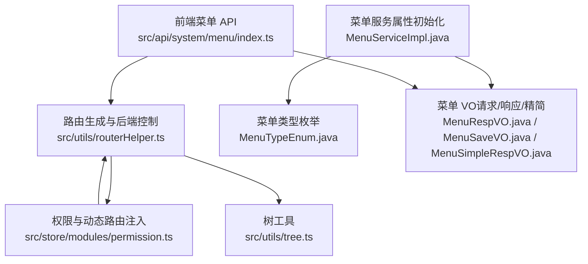
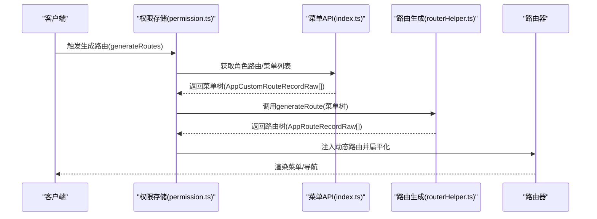
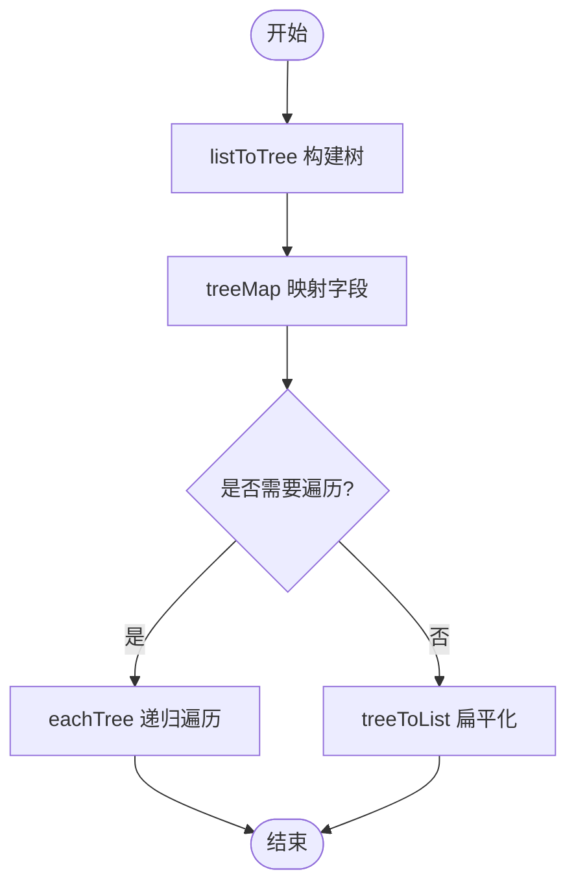
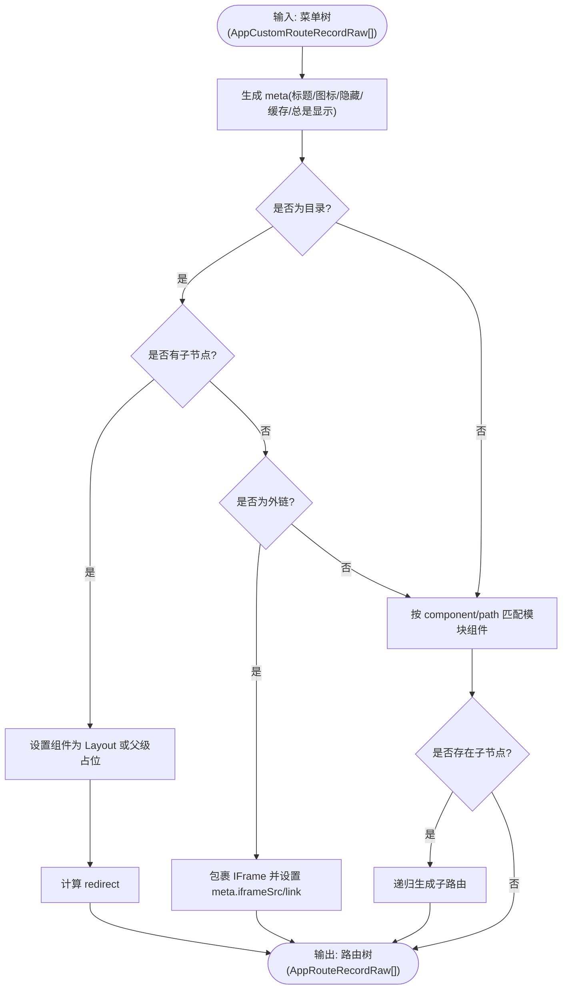
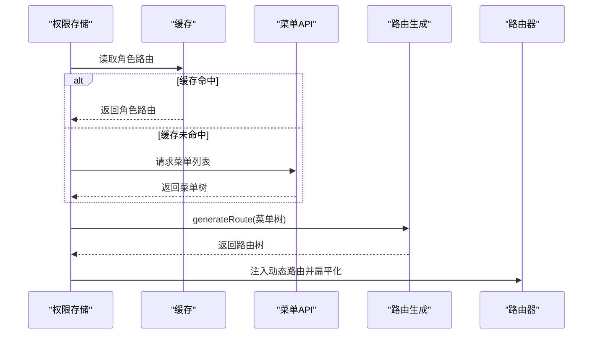
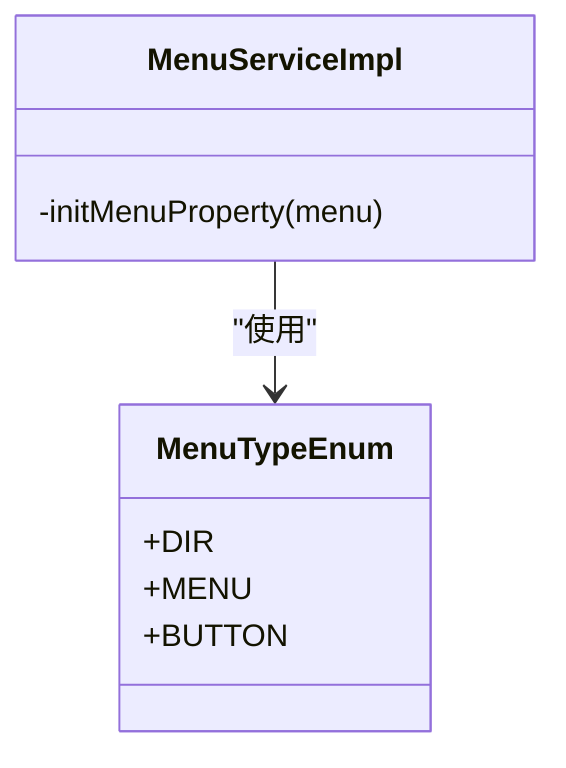
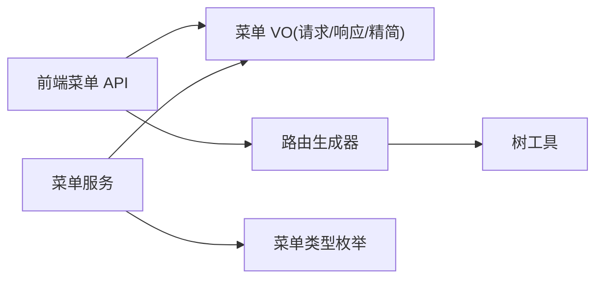

# 菜单管理

<cite>
**本文引用的文件**
- [routerHelper.ts](file://yudao-ui/yudao-ui-admin-vue3/src/utils/routerHelper.ts)
- [permission.ts](file://yudao-ui/yudao-ui-admin-vue3/src/store/modules/permission.ts)
- [tree.ts](file://yudao-ui/yudao-ui-admin-vue3/src/utils/tree.ts)
- [index.ts](file://yudao-ui/yudao-ui-admin-vue3/src/api/system/menu/index.ts)
- [MenuTypeEnum.java](file://yudao-module-system/src/main/java/cn/iocoder/yudao/module/system/enums/permission/MenuTypeEnum.java)
- [MenuServiceImpl.java](file://yudao-module-system/src/main/java/cn/iocoder/yudao/module/system/service/permission/MenuServiceImpl.java)
- [MenuSaveVO.java](file://yudao-module-system/src/main/java/cn/iocoder/yudao/module/system/controller/admin/permission/vo/menu/MenuSaveVO.java)
- [MenuListReqVO.java](file://yudao-module-system/src/main/java/cn/iocoder/yudao/module/system/controller/admin/permission/vo/menu/MenuListReqVO.java)
- [MenuRespVO.java](file://yudao-module-system/src/main/java/cn/iocoder/yudao/module/system/controller/admin/permission/vo/menu/MenuRespVO.java)
- [MenuSimpleRespVO.java](file://yudao-module-system/src/main/java/cn/iocoder/yudao/module/system/controller/admin/permission/vo/menu/MenuSimpleRespVO.java)
- [icon.d.ts](file://yudao-ui/yudao-ui-admin-vue3/src/types/icon.d.ts)
- [contextMenu.d.ts](file://yudao-ui/yudao-ui-admin-vue3/src/types/contextMenu.d.ts)
- [localeDropdown.d.ts](file://yudao-ui/yudao-ui-admin-vue3/src/types/localeDropdown.d.ts)
- [api.ts.vm](file://yudao-module-infra/src/main/resources/codegen/vue3_vben5_ele/general/api/api.ts.vm)
- [api.js.vm](file://yudao-module-infra/src/main/resources/codegen/vue/api/api.js.vm)
</cite>

## 目录
1. [简介](#简介)
2. [项目结构](#项目结构)
3. [核心组件](#核心组件)
4. [架构总览](#架构总览)
5. [详细组件分析](#详细组件分析)
6. [依赖分析](#依赖分析)
7. [性能考虑](#性能考虑)
8. [故障排查指南](#故障排查指南)
9. [结论](#结论)
10. [附录](#附录)

## 简介
本文件系统性梳理菜单管理功能的技术实现，涵盖菜单树形结构设计与渲染、后端路由生成策略、菜单类型（目录、菜单、按钮）的差异与使用场景、权限控制（动态菜单、过滤与验证）、国际化与图标配置、前端组件化渲染、接口定义与前端路由配置，以及菜单导入导出能力与性能优化建议。文档面向前后端工程师与产品/测试人员，既提供高层架构视图，也给出代码级定位与参考。

## 项目结构
围绕菜单管理的关键位置如下：
- 前端
  - 菜单 API 封装：src/api/system/menu/index.ts
  - 路由生成与后端控制：src/utils/routerHelper.ts
  - 权限与动态路由注入：src/store/modules/permission.ts
  - 树工具：src/utils/tree.ts
  - 类型定义：src/types/*.d.ts（图标、上下文菜单、语言）
- 后端
  - 菜单类型枚举：yudao-module-system/.../enums/permission/MenuTypeEnum.java
  - 菜单服务（含属性初始化）：yudao-module-system/.../service/permission/MenuServiceImpl.java
  - 菜单 VO（请求/响应/精简）：yudao-module-system/.../controller/admin/permission/vo/menu/*
- 代码生成（导入导出模板）
  - Vue3 Vben/Ele 模板：yudao-module-infra/.../codegen/vue3_vben5_ele/general/api/api.ts.vm
  - Vue 模板：yudao-module-infra/.../codegen/vue/api/api.js.vm

图表来源
- [index.ts:1-50](file://yudao-ui/yudao-ui-admin-vue3/src/api/system/menu/index.ts#L1-L50)
- [routerHelper.ts:73-267](file://yudao-ui/yudao-ui-admin-vue3/src/utils/routerHelper.ts#L73-L267)
- [permission.ts:17-56](file://yudao-ui/yudao-ui-admin-vue3/src/store/modules/permission.ts#L17-L56)
- [tree.ts:1-403](file://yudao-ui/yudao-ui-admin-vue3/src/utils/tree.ts#L1-L403)
- [MenuTypeEnum.java:1-25](file://yudao-module-system/src/main/java/cn/iocoder/yudao/module/system/enums/permission/MenuTypeEnum.java#L1-L25)
- [MenuServiceImpl.java:290-307](file://yudao-module-system/src/main/java/cn/iocoder/yudao/module/system/service/permission/MenuServiceImpl.java#L290-L307)
- [MenuRespVO.java:1-70](file://yudao-module-system/src/main/java/cn/iocoder/yudao/module/system/controller/admin/permission/vo/menu/MenuRespVO.java#L1-L70)
- [MenuSaveVO.java:1-36](file://yudao-module-system/src/main/java/cn/iocoder/yudao/module/system/controller/admin/permission/vo/menu/MenuSaveVO.java#L1-L36)
- [MenuSimpleRespVO.java:1-23](file://yudao-module-system/src/main/java/cn/iocoder/yudao/module/system/controller/admin/vo/menu/MenuSimpleRespVO.java#L1-L23)

章节来源
- [index.ts:1-50](file://yudao-ui/yudao-ui-admin-vue3/src/api/system/menu/index.ts#L1-L50)
- [routerHelper.ts:73-267](file://yudao-ui/yudao-ui-admin-vue3/src/utils/routerHelper.ts#L73-L267)
- [permission.ts:17-56](file://yudao-ui/yudao-ui-admin-vue3/src/store/modules/permission.ts#L17-L56)
- [tree.ts:1-403](file://yudao-ui/yudao-ui-admin-vue3/src/utils/tree.ts#L1-L403)
- [MenuTypeEnum.java:1-25](file://yudao-module-system/src/main/java/cn/iocoder/yudao/module/system/enums/permission/MenuTypeEnum.java#L1-L25)
- [MenuServiceImpl.java:290-307](file://yudao-module-system/src/main/java/cn/iocoder/yudao/module/system/service/permission/MenuServiceImpl.java#L290-L307)
- [MenuRespVO.java:1-70](file://yudao-module-system/src/main/java/cn/iocoder/yudao/module/system/controller/admin/permission/vo/menu/MenuRespVO.java#L1-L70)
- [MenuSaveVO.java:1-36](file://yudao-module-system/src/main/java/cn/iocoder/yudao/module/system/controller/admin/permission/vo/menu/MenuSaveVO.java#L1-L36)
- [MenuSimpleRespVO.java:1-23](file://yudao-module-system/src/main/java/cn/iocoder/yudao/module/system/controller/admin/permission/vo/menu/MenuSimpleRespVO.java#L1-L23)

## 核心组件
- 菜单树工具：提供 listToTree、handleTree、treeMap、eachTree 等方法，支撑菜单树构建、扁平化、映射与遍历。
- 路由生成器：根据后端返回的菜单结构，生成符合前端路由规范的树形结构，处理外链、目录与菜单组件映射、name 唯一性与折叠。
- 权限存储与动态注入：从缓存或后端拉取角色路由，调用路由生成器，扁平化多级路由并注入到路由器。
- 菜单 API：封装菜单的增删改查、列表与精简列表等接口。
- 菜单类型与属性：后端枚举定义类型，服务层按类型初始化组件、图标、路径等属性。

章节来源
- [tree.ts:22-309](file://yudao-ui/yudao-ui-admin-vue3/src/utils/tree.ts#L22-L309)
- [routerHelper.ts:73-267](file://yudao-ui/yudao-ui-admin-vue3/src/utils/routerHelper.ts#L73-L267)
- [permission.ts:17-56](file://yudao-ui/yudao-ui-admin-vue3/src/store/modules/permission.ts#L17-L56)
- [index.ts:21-49](file://yudao-ui/yudao-ui-admin-vue3/src/api/system/menu/index.ts#L21-L49)
- [MenuTypeEnum.java:11-25](file://yudao-module-system/src/main/java/cn/iocoder/yudao/module/system/enums/permission/MenuTypeEnum.java#L11-L25)
- [MenuServiceImpl.java:297-305](file://yudao-module-system/src/main/java/cn/iocoder/yudao/module/system/service/permission/MenuServiceImpl.java#L297-L305)

## 架构总览
菜单管理的端到端流程如下：
- 后端维护菜单树（目录/菜单/按钮），按类型初始化组件、图标、路径等属性。
- 前端通过菜单 API 获取菜单树或精简列表，结合权限存储与路由生成器，动态构建路由树。
- 路由生成器负责：
  - 将后端菜单元信息映射为前端 meta（标题、图标、是否隐藏、是否缓存、是否总是显示）。
  - 处理外链与内链，目录与菜单的组件选择与重定向。
  - 解析动态路由参数与查询参数，确保 meta.query/hash/params 一致性。
  - 处理父子同名导致的路由 name 冲突，必要时折叠默认子页到父级。
- 权限存储将生成的路由扁平化并注入路由器，完成动态菜单渲染。

图表来源
- [permission.ts:39-56](file://yudao-ui/yudao-ui-admin-vue3/src/store/modules/permission.ts#L39-L56)
- [index.ts:21-49](file://yudao-ui/yudao-ui-admin-vue3/src/api/system/menu/index.ts#L21-L49)
- [routerHelper.ts:73-267](file://yudao-ui/yudao-ui-admin-vue3/src/utils/routerHelper.ts#L73-L267)

## 详细组件分析

### 菜单树形结构与渲染
- 树构建
  - listToTree：基于 id/pid 构建标准树结构。
  - handleTree/handleTree2：二次加工树结构，适配 children 字段与根节点。
  - treeToList：将树扁平化，便于表格/级联选择等场景。
- 树映射与遍历
  - treeMap/treeMapEach：对树节点执行转换，常用于将后端字段映射为前端展示字段。
  - eachTree：递归遍历树，支持对每个节点应用回调。
- 树字符串化
  - treeToString：根据节点 id 获取其完整路径字符串，便于面包屑或定位。

图表来源
- [tree.ts:22-309](file://yudao-ui/yudao-ui-admin-vue3/src/utils/tree.ts#L22-L309)

章节来源
- [tree.ts:22-309](file://yudao-ui/yudao-ui-admin-vue3/src/utils/tree.ts#L22-L309)

### 路由生成与后端控制
- 元信息生成：将后端菜单的 name/icon/visible/keepAlive/alwaysShow 等映射为前端 meta。
- 外链与内链：识别外链并生成 IFrame 包裹的外部路由；内链解析组件路径与动态参数。
- 目录与菜单组件选择：顶级目录承载框架布局，非顶级目录仅占位避免多级嵌套；菜单组件按后端 component 或 path 自动匹配模块。
- 名称冲突处理：当父子同名且满足条件时，将默认子页折叠到父级，保证 name 全局唯一。
- 重定向策略：目录自动计算 redirect，避免空路由跳转异常。

图表来源
- [routerHelper.ts:73-267](file://yudao-ui/yudao-ui-admin-vue3/src/utils/routerHelper.ts#L73-L267)

章节来源
- [routerHelper.ts:73-267](file://yudao-ui/yudao-ui-admin-vue3/src/utils/routerHelper.ts#L73-L267)

### 权限存储与动态注入
- generateRoutes：优先从缓存读取角色路由，否则从后端获取；调用 generateRoute 生成路由树；将 404 放到最后；扁平化多级路由后注入路由器。
- getAddRouters：返回扁平化的多级路由集合，供菜单栏/标签页等消费。

图表来源
- [permission.ts:39-56](file://yudao-ui/yudao-ui-admin-vue3/src/store/modules/permission.ts#L39-L56)
- [index.ts:21-49](file://yudao-ui/yudao-ui-admin-vue3/src/api/system/menu/index.ts#L21-L49)
- [routerHelper.ts:73-267](file://yudao-ui/yudao-ui-admin-vue3/src/utils/routerHelper.ts#L73-L267)

章节来源
- [permission.ts:17-56](file://yudao-ui/yudao-ui-admin-vue3/src/store/modules/permission.ts#L17-L56)

### 菜单类型与属性初始化
- 类型定义：目录（1）、菜单（2）、按钮（3）。按钮类型不设置 component、icon、path。
- 属性初始化：服务层在保存/更新前，按类型清理按钮类型的冗余属性，确保前端渲染正确。

图表来源
- [MenuTypeEnum.java:11-25](file://yudao-module-system/src/main/java/cn/iocoder/yudao/module/system/enums/permission/MenuTypeEnum.java#L11-L25)
- [MenuServiceImpl.java:297-305](file://yudao-module-system/src/main/java/cn/iocoder/yudao/module/system/service/permission/MenuServiceImpl.java#L297-L305)

章节来源
- [MenuTypeEnum.java:11-25](file://yudao-module-system/src/main/java/cn/iocoder/yudao/module/system/enums/permission/MenuTypeEnum.java#L11-L25)
- [MenuServiceImpl.java:297-305](file://yudao-module-system/src/main/java/cn/iocoder/yudao/module/system/service/permission/MenuServiceImpl.java#L297-L305)

### 前端类型与国际化/图标配置
- 图标类型：IconTypes 提供 size/color/icon 字段，用于统一图标渲染。
- 上下文菜单：contextMenuSchema 定义了禁用、分隔、图标、标签与命令回调。
- 语言切换：LocaleDropdownType 定义语言切换所需字段，配合 i18n 使用。
- 菜单 API 类型：MenuVO 定义了菜单字段（含 component/componentName、visible/keepAlive/alwaysShow 等），用于前端渲染与表单绑定。

章节来源
- [icon.d.ts:1-5](file://yudao-ui/yudao-ui-admin-vue3/src/types/icon.d.ts#L1-L5)
- [contextMenu.d.ts:1-7](file://yudao-ui/yudao-ui-admin-vue3/src/types/contextMenu.d.ts#L1-L7)
- [localeDropdown.d.ts:1-10](file://yudao-ui/yudao-ui-admin-vue3/src/types/localeDropdown.d.ts#L1-L10)
- [index.ts:3-19](file://yudao-ui/yudao-ui-admin-vue3/src/api/system/menu/index.ts#L3-L19)

### 菜单接口文档
- 获取精简菜单列表：GET /system/menu/simple-list
- 获取菜单列表：GET /system/menu/list
- 获取菜单详情：GET /system/menu/get?id=...
- 创建菜单：POST /system/menu/create
- 更新菜单：PUT /system/menu/update
- 删除菜单：DELETE /system/menu/delete?id=...

章节来源
- [index.ts:21-49](file://yudao-ui/yudao-ui-admin-vue3/src/api/system/menu/index.ts#L21-L49)

### 菜单导入导出（代码生成模板）
- 导出 Excel：download('/system/xxx/export-excel', params)
- 下载导入模板：download('/system/xxx/get-import-template')
- 导入：POST /system/xxx/import（FormData）

章节来源
- [api.ts.vm:99-114](file://yudao-module-infra/src/main/resources/codegen/vue3_vben5_ele/general/api/api.ts.vm#L99-L114)
- [api.js.vm:138-180](file://yudao-module-infra/src/main/resources/codegen/vue/api/api.js.vm#L138-L180)

## 依赖分析
- 前端
  - 菜单 API 依赖 axios 配置，返回后端 VO 结构。
  - 路由生成依赖树工具与模块映射，处理外链与动态参数。
  - 权限存储依赖路由生成器与路由器，负责注入与扁平化。
- 后端
  - 菜单服务依赖类型枚举与 VO，按类型初始化属性。
  - 控制器 VO 定义了菜单的请求/响应字段约束。

图表来源
- [index.ts:21-49](file://yudao-ui/yudao-ui-admin-vue3/src/api/system/menu/index.ts#L21-L49)
- [routerHelper.ts:73-267](file://yudao-ui/yudao-ui-admin-vue3/src/utils/routerHelper.ts#L73-L267)
- [tree.ts:1-403](file://yudao-ui/yudao-ui-admin-vue3/src/utils/tree.ts#L1-L403)
- [MenuServiceImpl.java:297-305](file://yudao-module-system/src/main/java/cn/iocoder/yudao/module/system/service/permission/MenuServiceImpl.java#L297-L305)
- [MenuTypeEnum.java:11-25](file://yudao-module-system/src/main/java/cn/iocoder/yudao/module/system/enums/permission/MenuTypeEnum.java#L11-L25)
- [MenuRespVO.java:1-70](file://yudao-module-system/src/main/java/cn/iocoder/yudao/module/system/controller/admin/permission/vo/menu/MenuRespVO.java#L1-L70)
- [MenuSaveVO.java:1-36](file://yudao-module-system/src/main/java/cn/iocoder/yudao/module/system/controller/admin/permission/vo/menu/MenuSaveVO.java#L1-L36)
- [MenuSimpleRespVO.java:1-23](file://yudao-module-system/src/main/java/cn/iocoder/yudao/module/system/controller/admin/permission/vo/menu/MenuSimpleRespVO.java#L1-L23)

章节来源
- [index.ts:21-49](file://yudao-ui/yudao-ui-admin-vue3/src/api/system/menu/index.ts#L21-L49)
- [routerHelper.ts:73-267](file://yudao-ui/yudao-ui-admin-vue3/src/utils/routerHelper.ts#L73-L267)
- [tree.ts:1-403](file://yudao-ui/yudao-ui-admin-vue3/src/utils/tree.ts#L1-L403)
- [MenuServiceImpl.java:297-305](file://yudao-module-system/src/main/java/cn/iocoder/yudao/module/system/service/permission/MenuServiceImpl.java#L297-L305)
- [MenuTypeEnum.java:11-25](file://yudao-module-system/src/main/java/cn/iocoder/yudao/module/system/enums/permission/MenuTypeEnum.java#L11-L25)
- [MenuRespVO.java:1-70](file://yudao-module-system/src/main/java/cn/iocoder/yudao/module/system/controller/admin/permission/vo/menu/MenuRespVO.java#L1-L70)
- [MenuSaveVO.java:1-36](file://yudao-module-system/src/main/java/cn/iocoder/yudao/module/system/controller/admin/permission/vo/menu/MenuSaveVO.java#L1-L36)
- [MenuSimpleRespVO.java:1-23](file://yudao-module-system/src/main/java/cn/iocoder/yudao/module/system/controller/admin/permission/vo/menu/MenuSimpleRespVO.java#L1-L23)

## 性能考虑
- 树遍历与映射
  - 使用 forEach 的早停逻辑避免大规模树节点的无效遍历，降低浏览器卡顿风险。
  - treeMapEach 递归映射时尽量减少不必要的对象拷贝，按需转换。
- 路由生成
  - 优先从缓存读取角色路由，减少重复请求。
  - 对父子同名折叠采用精确引用定位，避免全量替换带来的开销。
- 渲染
  - 目录组件仅占位，避免深层嵌套 Layout 导致的渲染复杂度上升。
  - 外链路由单独包裹 IFrame，避免主应用生命周期干扰。

章节来源
- [tree.ts:151-166](file://yudao-ui/yudao-ui-admin-vue3/src/utils/tree.ts#L151-L166)
- [routerHelper.ts:228-267](file://yudao-ui/yudao-ui-admin-vue3/src/utils/routerHelper.ts#L228-L267)
- [permission.ts:39-56](file://yudao-ui/yudao-ui-admin-vue3/src/store/modules/permission.ts#L39-L56)

## 故障排查指南
- 菜单不显示或路由缺失
  - 检查后端菜单类型是否为目录/菜单，按钮类型不会生成路由。
  - 确认菜单的 component/path 是否正确，路由生成器会据此匹配模块组件。
- 外链无法打开
  - 确认外链地址与 meta.link/iframeSrc 设置是否正确。
- 路由 name 冲突
  - 若父子同名且默认子页满足折叠条件，路由生成器会将其折叠到父级；如不期望，请调整 name 或 children 结构。
- 精简列表与完整列表
  - 精简列表用于选择器/联动场景；完整列表包含更多元信息，用于编辑/详情页。

章节来源
- [MenuServiceImpl.java:297-305](file://yudao-module-system/src/main/java/cn/iocoder/yudao/module/system/service/permission/MenuServiceImpl.java#L297-L305)
- [routerHelper.ts:73-267](file://yudao-ui/yudao-ui-admin-vue3/src/utils/routerHelper.ts#L73-L267)
- [index.ts:21-49](file://yudao-ui/yudao-ui-admin-vue3/src/api/system/menu/index.ts#L21-L49)

## 结论
菜单管理通过“后端树 + 前端路由生成”的模式，实现了灵活的目录/菜单/按钮三层结构与动态路由注入。树工具、路由生成器与权限存储协同工作，保障了菜单渲染的正确性与性能。配合完善的类型定义与国际化/图标配置，前端组件化渲染具备良好的扩展性。导入导出模板进一步提升了业务系统的快速落地效率。

## 附录

### 菜单类型与使用场景
- 目录：用于组织页面分组，通常承载框架布局，不直接对应具体页面。
- 菜单：对应具体页面，需提供路由地址与组件路径。
- 按钮：用于细粒度权限控制，不参与路由渲染。

章节来源
- [MenuTypeEnum.java:11-25](file://yudao-module-system/src/main/java/cn/iocoder/yudao/module/system/enums/permission/MenuTypeEnum.java#L11-L25)

### 菜单权限控制要点
- 按钮权限标识：仅按钮类型需要 permission 字段，用于前端指令与后端校验。
- 菜单属性初始化：服务层按类型清理按钮类型的冗余属性，避免前端误渲染。

章节来源
- [MenuSaveVO.java:22-24](file://yudao-module-system/src/main/java/cn/iocoder/yudao/module/system/controller/admin/permission/vo/menu/MenuSaveVO.java#L22-L24)
- [MenuServiceImpl.java:297-305](file://yudao-module-system/src/main/java/cn/iocoder/yudao/module/system/service/permission/MenuServiceImpl.java#L297-L305)

### 前端路由配置与渲染
- 路由生成：依据后端菜单生成 meta、组件与重定向。
- 动态注入：权限存储扁平化多级路由并注入路由器。
- 外链处理：统一 IFrame 包裹，避免跨域与安全问题。

章节来源
- [routerHelper.ts:73-267](file://yudao-ui/yudao-ui-admin-vue3/src/utils/routerHelper.ts#L73-L267)
- [permission.ts:39-56](file://yudao-ui/yudao-ui-admin-vue3/src/store/modules/permission.ts#L39-L56)

### 菜单树查询与权限菜单获取
- 菜单树查询：通过菜单 API 的列表接口获取完整树结构。
- 权限菜单获取：通过精简列表接口获取用于选择器/联动的数据。

章节来源
- [index.ts:21-49](file://yudao-ui/yudao-ui-admin-vue3/src/api/system/menu/index.ts#L21-L49)
- [MenuListReqVO.java:1-17](file://yudao-module-system/src/main/java/cn/iocoder/yudao/module/system/controller/admin/permission/vo/menu/MenuListReqVO.java#L1-L17)
- [MenuSimpleRespVO.java:1-23](file://yudao-module-system/src/main/java/cn/iocoder/yudao/module/system/controller/admin/permission/vo/menu/MenuSimpleRespVO.java#L1-L23)

### 菜单导入导出接口
- 导出：download('/system/xxx/export-excel', params)
- 下载模板：download('/system/xxx/get-import-template')
- 导入：POST /system/xxx/import（FormData）

章节来源
- [api.ts.vm:99-114](file://yudao-module-infra/src/main/resources/codegen/vue3_vben5_ele/general/api/api.ts.vm#L99-L114)
- [api.js.vm:138-180](file://yudao-module-infra/src/main/resources/codegen/vue/api/api.js.vm#L138-L180)