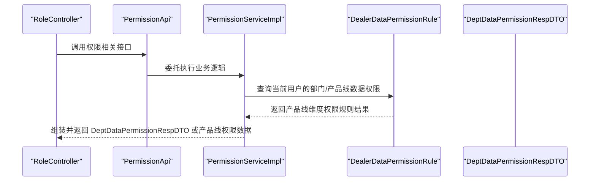
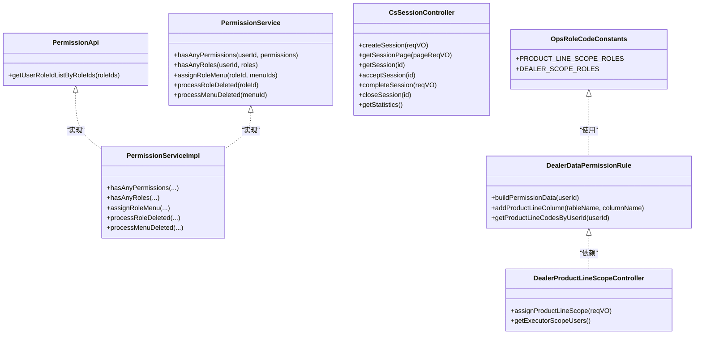
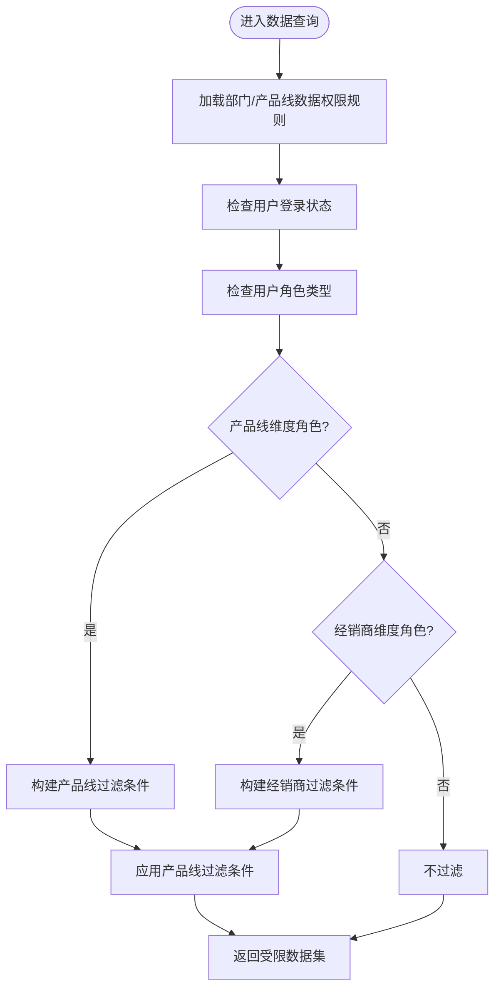
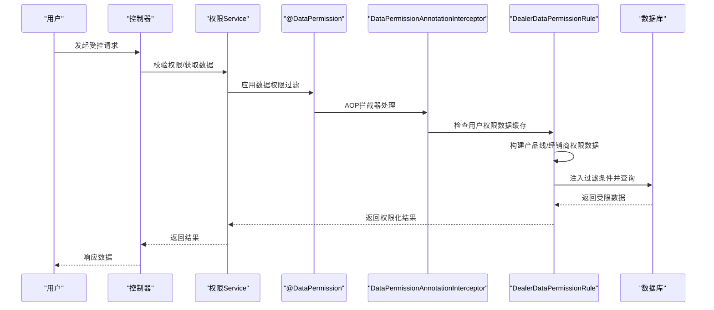
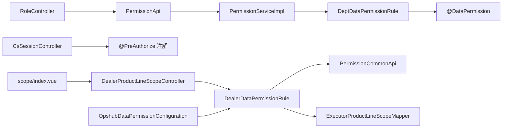

# 角色权限

<cite>
**本文引用的文件**   
- [PermissionApi.java](file://yudao-module-system/src/main/java/cn/iocoder/yudao/module/system/api/permission/PermissionApi.java)
- [PermissionService.java](file://yudao-module-system/src/main/java/cn/iocoder/yudao/module/system/service/permission/PermissionService.java)
- [PermissionServiceImpl.java](file://yudao-module-system/src/main/java/cn/iocoder/yudao/module/system/service/permission/PermissionServiceImpl.java)
- [RoleController.java](file://yudao-module-system/src/main/java/cn/iocoder/yudao/module/system/controller/admin/permission/RoleController.java)
- [DeptDataPermissionRespDTO.java](file://yudao-framework/yudao-common/src/main/java/cn/iocoder/yudao/framework/common/biz/system/permission/dto/DeptDataPermissionRespDTO.java)
- [YudaoDeptDataPermissionAutoConfiguration.java](file://yudao-framework/yudao-spring-boot-starter-biz-data-permission/src/main/java/cn/iocoder/yudao/framework/datapermission/config/YudaoDeptDataPermissionAutoConfiguration.java)
- [DeptDataPermissionRule.java](file://yudao-framework/yudao-spring-boot-starter-biz-data-permission/src/main/java/cn/iocoder/yudao/framework/datapermission/core/rule/dept/DeptDataPermissionRule.java)
- [DataPermission.java](file://yudao-framework/yudao-spring-boot-starter-biz-data-permission/src/main/java/cn/iocoder/yudao/framework/datapermission/core/annotation/DataPermission.java)
- [AdminUserServiceImpl.java](file://yudao-module-system/src/main/java/cn/iocoder/yudao/module/system/service/user/AdminUserServiceImpl.java)
- [feature_step8-咨询服务集成_dml.sql](file://db/branches/feature_step8-咨询服务集成/feature_step8-咨询服务集成_dml.sql)
- [CsSessionController.java](file://yudao-module-opshub/src/main/java/cn/iocoder/yudao/module/opshub/controller/admin/cs/CsSessionController.java)
- [OpsRoleCodeConstants.java](file://yudao-module-opshub/src/main/java/cn/iocoder/yudao/module/opshub/enums/OpsRoleCodeConstants.java)
- [CsConsultTypeEnum.java](file://yudao-module-opshub/src/main/java/cn/iocoder/yudao/module/opshub/enums/CsConsultTypeEnum.java)
- [DealerDataPermissionRule.java](file://yudao-module-opshub/src/main/java/cn/iocoder/yudao/module/opshub/framework/datapermission/rule/DealerDataPermissionRule.java)
- [ExecutorProductLineScopeServiceImpl.java](file://yudao-module-opshub/src/main/java/cn/iocoder/yudao/module/opshub/service/dealer/impl/ExecutorProductLineScopeServiceImpl.java)
- [ExecutorProductLineScopeAssignReqVO.java](file://yudao-module-opshub/src/main/java/cn/iocoder/yudao/module/opshub/controller/admin/dealer/vo/ExecutorProductLineScopeAssignReqVO.java)
- [ExecutorProductLineScopeDO.java](file://yudao-module-opshub/src/main/java/cn/iocoder/yudao/module/opshub/dal/dataobject/dealer/ExecutorProductLineScopeDO.java)
- [DealerProductLineScopeController.java](file://yudao-module-opshub/src/main/java/cn/iocoder/yudao/module/opshub/controller/admin/dealer/DealerProductLineScopeController.java)
- [index.vue](file://yudao-ui/yudao-ui-admin-vue3/src/views/opshub/scope/index.vue)
- [hasPermi.ts](file://yudao-ui/yudao-ui-admin-vue3/src/directives/permission/hasPermi.ts)
- [PRD-用户权限设计.md](file://docs/PRD-用户权限设计.md)
- [OpshubDataPermissionConfiguration.java](file://yudao-module-opshub/src/main/java/cn/iocoder/yudao/module/opshub/framework/datapermission/config/OpshubDataPermissionConfiguration.java)
- [DataPermissionContextHolder.java](file://yudao-framework/yudao-spring-boot-starter-biz-data-permission/src/main/java/cn/iocoder/yudao/framework/datapermission/core/aop/DataPermissionContextHolder.java)
- [DataPermissionAnnotationInterceptor.java](file://yudao-framework/yudao-spring-boot-starter-biz-data-permission/src/main/java/cn/iocoder/yudao/framework/datapermission/core/aop/DataPermissionAnnotationInterceptor.java)
- [DataPermissionAnnotationAdvisor.java](file://yudao-framework/yudao-spring-boot-starter-biz-data-permission/src/main/java/cn/iocoder/yudao/framework/datapermission/core/aop/DataPermissionAnnotationAdvisor.java)
</cite>

## 更新摘要
**变更内容**   
- 新增了service_executor角色代码和相关权限控制，支持客户服务工作台的访问控制
- 扩展了产品线维度的数据权限过滤机制，支持基于产品线的精细化权限控制
- 完善了服务单执行员的授权管理功能，包括产品线授权分配和用户管理
- 新增了dealer:basedata:consult和dealer:cs-consult:create两种新的权限类型
- 更新了客户服务模块的权限验证机制，涵盖基础数据咨询和客服会话发起咨询功能
- 新增了产品线维度权限控制的扩展权限类型和服务单执行员角色的精细化权限管理

## 目录
1. [引言](#引言)
2. [项目结构](#项目结构)
3. [核心组件](#核心组件)
4. [架构总览](#架构总览)
5. [详细组件分析](#详细组件分析)
6. [依赖关系分析](#依赖关系分析)
7. [性能考量](#性能考量)
8. [故障排查指南](#故障排查指南)
9. [结论](#结论)
10. [附录](#附录)

## 引言
本技术文档围绕 RBAC（基于角色的访问控制）权限模型展开，系统性阐述角色定义、权限分配与用户角色绑定机制；详解权限类型、权限表达式与权限继承规则；深入解析数据权限过滤的实现原理（部门数据权限、自定义数据权限规则）；介绍动态权限控制、权限缓存与权限验证流程；并提供接口文档、配置说明与调试技巧。文档同时给出面向开发者的代码级参考路径，帮助快速定位实现细节。

**更新** 本次更新反映了服务单执行员（service_executor）角色的新增和产品线维度数据权限控制的增强，以及客户服务工作台访问控制的完善。

## 项目结构
权限体系由"系统模块"与"权限框架"两部分协同构成，新增了"客户服务模块"的深度集成：
- 系统模块（system）：提供角色、菜单、用户等实体的业务能力，以及权限 API、Service、Controller 层。
- 权限框架（datapermission）：提供数据权限规则抽象、注解驱动的动态过滤、自动装配等能力。
- 客户服务模块（opshub）：提供客户服务工作台、产品线授权管理、数据权限控制等高级功能。

```mermaid
graph TB
subgraph "系统模块(system)"
API["PermissionApi 接口"]
SVC["PermissionService 接口<br/>PermissionServiceImpl 实现"]
CTRL["RoleController 控制器"]
DTO["DeptDataPermissionRespDTO 数据传输对象"]
end
subgraph "权限框架(datapermission)"
ANNOT["@DataPermission 注解"]
RULE["DeptDataPermissionRule 数据权限规则"]
CONF["YudaoDeptDataPermissionAutoConfiguration 自动装配"]
end
subgraph "客户服务模块(opshub)"
CSCTRL["CsSessionController 控制器"]
ENUM["OpsRoleCodeConstants 角色常量"]
DEALERRULE["DealerDataPermissionRule 产品线数据权限规则"]
EXECCTRL["DealerProductLineScopeController 执行员授权控制器"]
OPSHUBCONF["OpshubDataPermissionConfiguration 配置"]
end
subgraph "前端界面"
UI["scope/index.vue 授权管理界面"]
END
CTRL --> API
API --> SVC
SVC --> RULE
RULE --> ANNOT
CONF --> RULE
ENUM --> DEALERRULE
DEALERRULE --> EXECCTRL
EXECCTRL --> UI
CSCTRL --> ENUM
OPSHUBCONF --> DEALERRULE
```

**图表来源**
- [PermissionApi.java:1-23](file://yudao-module-system/src/main/java/cn/iocoder/yudao/module/system/api/permission/PermissionApi.java#L1-L23)
- [PermissionService.java:1-58](file://yudao-module-system/src/main/java/cn/iocoder/yudao/module/system/service/permission/PermissionService.java#L1-L58)
- [PermissionServiceImpl.java:1-25](file://yudao-module-system/src/main/java/cn/iocoder/yudao/module/system/service/permission/PermissionServiceImpl.java#L1-L25)
- [RoleController.java:1-27](file://yudao-module-system/src/main/java/cn/iocoder/yudao/module/system/controller/admin/permission/RoleController.java#L1-L27)
- [DeptDataPermissionRespDTO.java:1-35](file://yudao-framework/yudao-common/src/main/java/cn/iocoder/yudao/framework/common/biz/system/permission/dto/DeptDataPermissionRespDTO.java#L1-L35)
- [YudaoDeptDataPermissionAutoConfiguration.java:1-34](file://yudao-framework/yudao-spring-boot-starter-biz-data-permission/src/main/java/cn/iocoder/yudao/framework/datapermission/config/YudaoDeptDataPermissionAutoConfiguration.java#L1-L34)
- [DeptDataPermissionRule.java](file://yudao-framework/yudao-spring-boot-starter-biz-data-permission/src/main/java/cn/iocoder/yudao/framework/datapermission/core/rule/dept/DeptDataPermissionRule.java)
- [DataPermission.java](file://yudao-framework/yudao-spring-boot-starter-biz-data-permission/src/main/java/cn/iocoder/yudao/framework/datapermission/core/annotation/DataPermission.java)
- [CsSessionController.java:1-98](file://yudao-module-opshub/src/main/java/cn/iocoder/yudao/module/opshub/controller/admin/cs/CsSessionController.java#L1-L98)
- [OpsRoleCodeConstants.java:1-27](file://yudao-module-opshub/src/main/java/cn/iocoder/yudao/module/opshub/enums/OpsRoleCodeConstants.java#L1-L27)
- [DealerDataPermissionRule.java:1-367](file://yudao-module-opshub/src/main/java/cn/iocoder/yudao/module/opshub/framework/datapermission/rule/DealerDataPermissionRule.java#L1-L367)
- [DealerProductLineScopeController.java:52-66](file://yudao-module-opshub/src/main/java/cn/iocoder/yudao/module/opshub/controller/admin/dealer/DealerProductLineScopeController.java#L52-L66)
- [index.vue:1-426](file://yudao-ui/yudao-ui-admin-vue3/src/views/opshub/scope/index.vue#L1-L426)
- [OpshubDataPermissionConfiguration.java:1-18](file://yudao-module-opshub/src/main/java/cn/iocoder/yudao/module/opshub/framework/datapermission/config/OpshubDataPermissionConfiguration.java#L1-L18)

**章节来源**
- [PermissionApi.java:1-23](file://yudao-module-system/src/main/java/cn/iocoder/yudao/module/system/api/permission/PermissionApi.java#L1-L23)
- [PermissionService.java:1-58](file://yudao-module-system/src/main/java/cn/iocoder/yudao/module/system/service/permission/PermissionService.java#L1-L58)
- [YudaoDeptDataPermissionAutoConfiguration.java:1-34](file://yudao-framework/yudao-spring-boot-starter-biz-data-permission/src/main/java/cn/iocoder/yudao/framework/datapermission/config/YudaoDeptDataPermissionAutoConfiguration.java#L1-L34)

## 核心组件
- 权限 API 与 Service
  - PermissionApi：对外暴露权限相关能力，如按角色批量查询用户列表等。
  - PermissionService：定义权限判断、角色-菜单授权、角色/菜单删除后的清理等接口。
  - PermissionServiceImpl：具体实现权限判断、角色-菜单授权、数据权限响应组装等逻辑。
- 角色控制器
  - RoleController：提供角色分页、保存、导出等接口，配合权限框架进行访问控制。
- 数据权限 DTO
  - DeptDataPermissionRespDTO：封装部门数据权限结果，包含"全部可见"、"仅本人"、"可见部门集合"等字段。
- 数据权限框架
  - @DataPermission：注解驱动的数据权限过滤开关。
  - DeptDataPermissionRule：部门维度的数据权限规则实现，支持自定义扩展。
  - YudaoDeptDataPermissionAutoConfiguration：基于条件装配 DeptDataPermissionRule，并注入自定义规则定制器。
- 客户服务模块权限
  - CsSessionController：提供客户服务会话的创建、查询、处理等功能，使用权限注解进行访问控制。
  - OpsRoleCodeConstants：定义 OpsHub 业务角色标识常量，包括新增的 service_executor 角色。
  - DealerDataPermissionRule：实现基于产品线维度的数据权限控制，支持 service_executor 角色的精细化权限管理。
  - DealerProductLineScopeController：提供执行员产品线授权的管理接口，支持产品线授权的分配和查询。
  - OpshubDataPermissionConfiguration：配置 OpsHub 数据权限规则，注册 DealerDataPermissionRule Bean。
- 前端界面组件
  - scope/index.vue：提供服务单执行员授权管理的前端界面，支持产品线授权的可视化管理。

**更新** 新增了服务单执行员角色、产品线维度数据权限控制和授权管理界面等核心组件。

**章节来源**
- [PermissionApi.java:1-23](file://yudao-module-system/src/main/java/cn/iocoder/yudao/module/system/api/permission/PermissionApi.java#L1-L23)
- [PermissionService.java:1-58](file://yudao-module-system/src/main/java/cn/iocoder/yudao/module/system/service/permission/PermissionService.java#L1-L58)
- [PermissionServiceImpl.java:1-25](file://yudao-module-system/src/main/java/cn/iocoder/yudao/module/system/service/permission/PermissionServiceImpl.java#L1-L25)
- [RoleController.java:1-27](file://yudao-module-system/src/main/java/cn/iocoder/yudao/module/system/controller/admin/permission/RoleController.java#L1-L27)
- [DeptDataPermissionRespDTO.java:1-35](file://yudao-framework/yudao-common/src/main/java/cn/iocoder/yudao/framework/common/biz/system/permission/dto/DeptDataPermissionRespDTO.java#L1-L35)
- [YudaoDeptDataPermissionAutoConfiguration.java:1-34](file://yudao-framework/yudao-spring-boot-starter-biz-data-permission/src/main/java/cn/iocoder/yudao/framework/datapermission/config/YudaoDeptDataPermissionAutoConfiguration.java#L1-L34)
- [DeptDataPermissionRule.java](file://yudao-framework/yudao-spring-boot-starter-biz-data-permission/src/main/java/cn/iocoder/yudao/framework/datapermission/core/rule/dept/DeptDataPermissionRule.java)
- [DataPermission.java](file://yudao-framework/yudao-spring-boot-starter-biz-data-permission/src/main/java/cn/iocoder/yudao/framework/datapermission/core/annotation/DataPermission.java)
- [CsSessionController.java:1-98](file://yudao-module-opshub/src/main/java/cn/iocoder/yudao/module/opshub/controller/admin/cs/CsSessionController.java#L1-L98)
- [OpsRoleCodeConstants.java:1-27](file://yudao-module-opshub/src/main/java/cn/iocoder/yudao/module/opshub/enums/OpsRoleCodeConstants.java#L1-L27)
- [DealerDataPermissionRule.java:1-367](file://yudao-module-opshub/src/main/java/cn/iocoder/yudao/module/opshub/framework/datapermission/rule/DealerDataPermissionRule.java#L1-L367)
- [DealerProductLineScopeController.java:52-66](file://yudao-module-opshub/src/main/java/cn/iocoder/yudao/module/opshub/controller/admin/dealer/DealerProductLineScopeController.java#L52-L66)
- [index.vue:1-426](file://yudao-ui/yudao-ui-admin-vue3/src/views/opshub/scope/index.vue#L1-L426)
- [OpshubDataPermissionConfiguration.java:1-18](file://yudao-module-opshub/src/main/java/cn/iocoder/yudao/module/opshub/framework/datapermission/config/OpshubDataPermissionConfiguration.java#L1-L18)

## 架构总览
下图展示了从控制器到服务层、再到数据权限规则的调用链路，以及注解驱动的数据权限过滤如何生效，特别体现了产品线维度权限控制的实现。



**图表来源**
- [RoleController.java:1-27](file://yudao-module-system/src/main/java/cn/iocoder/yudao/module/system/controller/admin/permission/RoleController.java#L1-L27)
- [PermissionApi.java:1-23](file://yudao-module-system/src/main/java/cn/iocoder/yudao/module/system/api/permission/PermissionApi.java#L1-L23)
- [PermissionServiceImpl.java:1-25](file://yudao-module-system/src/main/java/cn/iocoder/yudao/module/system/service/permission/PermissionServiceImpl.java#L1-L25)
- [DealerDataPermissionRule.java:129-156](file://yudao-module-opshub/src/main/java/cn/iocoder/yudao/module/opshub/framework/datapermission/rule/DealerDataPermissionRule.java#L129-L156)
- [DeptDataPermissionRespDTO.java:1-35](file://yudao-framework/yudao-common/src/main/java/cn/iocoder/yudao/framework/common/biz/system/permission/dto/DeptDataPermissionRespDTO.java#L1-L35)

## 详细组件分析

### RBAC 权限模型与实现
- 角色定义
  - 角色作为权限的聚合载体，通过角色-菜单关联控制页面与操作权限。
  - 角色-菜单授权通过 PermissionService.assignRoleMenu 完成。
  - **新增角色**：service_executor（服务单执行员），支持产品线维度的数据权限控制。
- 权限分配
  - 权限判断采用"任一满足即通过"的策略，分别提供按权限字符串与按角色标识的判断接口。
- 用户角色绑定
  - 用户-角色绑定关系用于确定用户所拥有的角色集合，从而决定其可访问的菜单与数据范围。



**更新** 新增了 DealerDataPermissionRule 和 DealerProductLineScopeController 类，展示了产品线维度权限控制的实现。

**图表来源**
- [PermissionService.java:1-58](file://yudao-module-system/src/main/java/cn/iocoder/yudao/module/system/service/permission/PermissionService.java#L1-L58)
- [PermissionApi.java:1-23](file://yudao-module-system/src/main/java/cn/iocoder/yudao/module/system/api/permission/PermissionApi.java#L1-L23)
- [PermissionServiceImpl.java:1-25](file://yudao-module-system/src/main/java/cn/iocoder/yudao/module/system/service/permission/PermissionServiceImpl.java#L1-L25)
- [DealerDataPermissionRule.java:129-156](file://yudao-module-opshub/src/main/java/cn/iocoder/yudao/module/opshub/framework/datapermission/rule/DealerDataPermissionRule.java#L129-L156)
- [DealerProductLineScopeController.java:52-66](file://yudao-module-opshub/src/main/java/cn/iocoder/yudao/module/opshub/controller/admin/dealer/DealerProductLineScopeController.java#L52-L66)
- [CsSessionController.java:1-98](file://yudao-module-opshub/src/main/java/cn/iocoder/yudao/module/opshub/controller/admin/cs/CsSessionController.java#L1-L98)
- [OpsRoleCodeConstants.java:20-24](file://yudao-module-opshub/src/main/java/cn/iocoder/yudao/module/opshub/enums/OpsRoleCodeConstants.java#L20-L24)

**章节来源**
- [PermissionService.java:1-58](file://yudao-module-system/src/main/java/cn/iocoder/yudao/module/system/service/permission/PermissionService.java#L1-L58)
- [PermissionServiceImpl.java:1-25](file://yudao-module-system/src/main/java/cn/iocoder/yudao/module/system/service/permission/PermissionServiceImpl.java#L1-L25)

### 权限类型、权限表达式与继承规则
- 权限类型
  - 字符串型权限标识，用于菜单、按钮、接口等资源的细粒度控制。
  - **新增权限类型**：
    - `dealer:basedata:consult` - 基础数据模块的咨询权限
    - `dealer:cs-consult:create` - 客服会话发起咨询的创建权限
  - **服务单执行员角色权限**：
    - 支持产品线维度的数据权限控制，通过 `productLineScope` 限定可见授权产品线内的所有经销商数据
    - 可操作：工单接单/转单/提交、咨询回复/完成处理、操作请求接单/提交
- 权限表达式
  - 采用"任一满足即通过"的布尔表达式，简化权限组合判断。
- 权限继承
  - 用户通过角色获得权限集合，角色通过菜单获得权限集合，形成"用户 → 角色 → 菜单 → 权限"的层级继承链。
  - **新增继承规则**：service_executor 角色继承自品牌管理角色集合，支持产品线维度的精细化权限控制。

**更新** 新增了服务单执行员角色的权限类型和继承规则，扩展了权限矩阵的覆盖范围。

**章节来源**
- [PermissionService.java:19-34](file://yudao-module-system/src/main/java/cn/iocoder/yudao/module/system/service/permission/PermissionService.java#L19-L34)
- [feature_step8-咨询服务集成_dml.sql:14-16](file://db/branches/feature_step8-咨询服务集成/feature_step8-咨询服务集成_dml.sql#L14-L16)
- [OpsRoleCodeConstants.java:18-22](file://yudao-module-opshub/src/main/java/cn/iocoder/yudao/module/opshub/enums/OpsRoleCodeConstants.java#L18-L22)
- [PRD-用户权限设计.md:108-127](file://docs/PRD-用户权限设计.md#L108-L127)

### 数据权限过滤：部门维度与自定义规则
- 部门数据权限
  - 通过 DeptDataPermissionRespDTO 描述"全部可见"、"仅本人"、"可见部门集合"三种模式。
  - 通过 DeptDataPermissionRule 动态生成 SQL 过滤条件，限制用户只能访问被授权的部门数据。
- 自定义数据权限规则
  - 通过 YudaoDeptDataPermissionAutoConfiguration 条件装配 DeptDataPermissionRule，并注入 DeptDataPermissionRuleCustomizer 扩展器完成表级别的规则定制。
- **产品线维度数据权限**（新增）
  - 通过 DealerDataPermissionRule 实现基于产品线维度的数据权限控制。
  - 支持 service_executor 角色的精细化权限管理，通过 `ops_executor_product_line_scope` 表存储产品线授权关系。
  - 支持产品线代码集合的动态过滤，实现跨多个表的统一权限控制。
  - **新增配置**：OpshubDataPermissionConfiguration 注册 DealerDataPermissionRule Bean，支持产品线维度权限控制。



**图表来源**
- [YudaoDeptDataPermissionAutoConfiguration.java:1-34](file://yudao-framework/yudao-spring-boot-starter-biz-data-permission/src/main/java/cn/iocoder/yudao/framework/datapermission/config/YudaoDeptDataPermissionAutoConfiguration.java#L1-L34)
- [DealerDataPermissionRule.java:88-124](file://yudao-module-opshub/src/main/java/cn/iocoder/yudao/module/opshub/framework/datapermission/rule/DealerDataPermissionRule.java#L88-L124)
- [DealerDataPermissionRule.java:129-156](file://yudao-module-opshub/src/main/java/cn/iocoder/yudao/module/opshub/framework/datapermission/rule/DealerDataPermissionRule.java#L129-L156)
- [DeptDataPermissionRespDTO.java:1-35](file://yudao-framework/yudao-common/src/main/java/cn/iocoder/yudao/framework/common/biz/system/permission/dto/DeptDataPermissionRespDTO.java#L1-L35)
- [OpshubDataPermissionConfiguration.java:10-18](file://yudao-module-opshub/src/main/java/cn/iocoder/yudao/module/opshub/framework/datapermission/config/OpshubDataPermissionConfiguration.java#L10-L18)

**章节来源**
- [DeptDataPermissionRespDTO.java:1-35](file://yudao-framework/yudao-common/src/main/java/cn/iocoder/yudao/framework/common/biz/system/permission/dto/DeptDataPermissionRespDTO.java#L1-L35)
- [YudaoDeptDataPermissionAutoConfiguration.java:1-34](file://yudao-framework/yudao-spring-boot-starter-biz-data-permission/src/main/java/cn/iocoder/yudao/framework/datapermission/config/YudaoDeptDataPermissionAutoConfiguration.java#L1-L34)
- [DealerDataPermissionRule.java:129-156](file://yudao-module-opshub/src/main/java/cn/iocoder/yudao/module/opshub/framework/datapermission/rule/DealerDataPermissionRule.java#L129-L156)
- [OpshubDataPermissionConfiguration.java:10-18](file://yudao-module-opshub/src/main/java/cn/iocoder/yudao/module/opshub/framework/datapermission/config/OpshubDataPermissionConfiguration.java#L10-L18)

### 动态权限控制、权限缓存与验证流程
- 动态权限控制
  - 使用 @DataPermission 注解标记需要进行数据权限过滤的方法或类，框架在运行时自动注入过滤逻辑。
  - **客户服务权限验证**：CsSessionController 使用 @PreAuthorize 注解验证权限，如 `@PreAuthorize("@ss.hasPermission('dealer:cs-consult:create')")`。
  - **产品线权限控制**：通过 DealerDataPermissionRule 实现基于产品线维度的动态权限控制。
  - **AOP拦截器**：DataPermissionAnnotationInterceptor 和 DataPermissionAnnotationAdvisor 提供注解级别的权限拦截和上下文管理。
- 权限缓存
  - 在用户登录或权限变更场景，建议对用户权限集合进行缓存，减少重复查询。
  - **新增缓存机制**：DealerDataPermissionRule 将权限数据缓存到 LoginUser.context 中，支持请求级的有效缓存。
- 权限验证流程
  - 控制器 → 权限 API/Service → 数据权限规则 → SQL 过滤 → 结果返回。



**更新** 新增了产品线维度权限控制的动态权限验证流程，展示了 DealerDataPermissionRule 的缓存机制和 AOP拦截器的作用。

**图表来源**
- [DataPermission.java](file://yudao-framework/yudao-spring-boot-starter-biz-data-permission/src/main/java/cn/iocoder/yudao/framework/datapermission/core/annotation/DataPermission.java)
- [PermissionServiceImpl.java:1-25](file://yudao-module-system/src/main/java/cn/iocoder/yudao/module/system/service/permission/PermissionServiceImpl.java#L1-L25)
- [DealerDataPermissionRule.java:100-105](file://yudao-module-opshub/src/main/java/cn/iocoder/yudao/module/opshub/framework/datapermission/rule/DealerDataPermissionRule.java#L100-L105)
- [CsSessionController.java:36-41](file://yudao-module-opshub/src/main/java/cn/iocoder/yudao/module/opshub/controller/admin/cs/CsSessionController.java#L36-L41)
- [DataPermissionAnnotationInterceptor.java:21-30](file://yudao-framework/yudao-spring-boot-starter-biz-data-permission/src/main/java/cn/iocoder/yudao/framework/datapermission/core/aop/DataPermissionAnnotationInterceptor.java#L21-L30)
- [DataPermissionAnnotationAdvisor.java:17-36](file://yudao-framework/yudao-spring-boot-starter-biz-data-permission/src/main/java/cn/iocoder/yudao/framework/datapermission/core/aop/DataPermissionAnnotationAdvisor.java#L17-L36)

**章节来源**
- [DataPermission.java](file://yudao-framework/yudao-spring-boot-starter-biz-data-permission/src/main/java/cn/iocoder/yudao/framework/datapermission/core/annotation/DataPermission.java)
- [PermissionServiceImpl.java:1-25](file://yudao-module-system/src/main/java/cn/iocoder/yudao/module/system/service/permission/PermissionServiceImpl.java#L1-L25)
- [DealerDataPermissionRule.java:100-105](file://yudao-module-opshub/src/main/java/cn/iocoder/yudao/module/opshub/framework/datapermission/rule/DealerDataPermissionRule.java#L100-L105)
- [DataPermissionAnnotationInterceptor.java:21-30](file://yudao-framework/yudao-spring-boot-starter-biz-data-permission/src/main/java/cn/iocoder/yudao/framework/datapermission/core/aop/DataPermissionAnnotationInterceptor.java#L21-L30)
- [DataPermissionAnnotationAdvisor.java:17-36](file://yudao-framework/yudao-spring-boot-starter-biz-data-permission/src/main/java/cn/iocoder/yudao/framework/datapermission/core/aop/DataPermissionAnnotationAdvisor.java#L17-L36)

### 自定义权限注解、条件权限与扩展权限类型
- 自定义权限注解
  - 基于 @DataPermission 的使用方式，可在业务方法上直接标注以启用数据权限过滤。
  - **客户服务注解使用**：CsSessionController 中使用 `@PreAuthorize("@ss.hasPermission('dealer:cs-consult:create')")` 进行权限验证。
  - **产品线权限注解**：通过 DealerDataPermissionRule 实现基于产品线维度的权限控制。
- 条件权限
  - 通过 DeptDataPermissionRule 的定制器扩展，为不同表设置差异化过滤条件（如仅本人、部门树、全部可见）。
  - **新增条件权限**：产品线维度角色（brand_admin / brand_sales / service_executor）使用 `productLineScope` 过滤。
- 扩展权限类型
  - 可在现有权限字符串基础上扩展新的资源类型（菜单、按钮、接口），并在规则中映射到相应的过滤逻辑。
  - **新增权限类型**：`dealer:basedata:consult` 和 `dealer:cs-consult:create` 已在系统中注册并分配给相应角色。
  - **服务单执行员扩展**：支持产品线维度的精细化权限控制，通过 `ops_executor_product_line_scope` 表管理授权关系。

**更新** 新增了产品线维度权限控制的扩展权限类型和服务单执行员角色的权限管理。

**章节来源**
- [YudaoDeptDataPermissionAutoConfiguration.java:19-32](file://yudao-framework/yudao-spring-boot-starter-biz-data-permission/src/main/java/cn/iocoder/yudao/framework/datapermission/config/YudaoDeptDataPermissionAutoConfiguration.java#L19-L32)
- [DealerDataPermissionRule.java:138-146](file://yudao-module-opshub/src/main/java/cn/iocoder/yudao/module/opshub/framework/datapermission/rule/DealerDataPermissionRule.java#L138-L146)
- [CsSessionController.java:36-41](file://yudao-module-opshub/src/main/java/cn/iocoder/yudao/module/opshub/controller/admin/cs/CsSessionController.java#L36-L41)
- [OpsRoleCodeConstants.java:18-22](file://yudao-module-opshub/src/main/java/cn/iocoder/yudao/module/opshub/enums/OpsRoleCodeConstants.java#L18-L22)

### 权限管理接口文档
- 角色管理接口
  - 分页查询、保存/更新、导出等接口由 RoleController 提供，结合权限框架进行访问控制。
- 权限 API
  - PermissionApi 提供按角色批量查询用户列表等通用能力，供其他模块复用。
- **客户服务接口权限**
  - CsSessionController 提供客户服务会话的完整 CRUD 操作，使用权限注解保护各个接口：
    - 创建会话：`@PreAuthorize("@ss.hasPermission('dealer:cs-consult:create')")`
    - 查询会话：`@PreAuthorize("@ss.hasPermission('dealer:cs-consult:query')")`
    - 接单处理：`@PreAuthorize("@ss.hasPermission('dealer:cs-consult:reply')")`
    - 完成处理：`@PreAuthorize("@ss.hasPermission('dealer:cs-consult:complete')")`
    - 关闭会话：`@PreAuthorize("@ss.hasPermission('dealer:cs-consult:close')")`
- **产品线授权管理接口**
  - DealerProductLineScopeController 提供执行员产品线授权的管理接口：
    - 分配产品线授权：`@PreAuthorize("@ss.hasPermission('system:user:update')")`
    - 查询执行员授权用户：`@PreAuthorize("@ss.hasPermission('system:user:query')")`

**更新** 新增了产品线授权管理接口的权限说明。

**章节来源**
- [RoleController.java:1-27](file://yudao-module-system/src/main/java/cn/iocoder/yudao/module/system/controller/admin/permission/RoleController.java#L1-L27)
- [PermissionApi.java:13-21](file://yudao-module-system/src/main/java/cn/iocoder/yudao/module/system/api/permission/PermissionApi.java#L13-L21)
- [CsSessionController.java:36-95](file://yudao-module-opshub/src/main/java/cn/iocoder/yudao/module/opshub/controller/admin/cs/CsSessionController.java#L36-L95)
- [DealerProductLineScopeController.java:52-66](file://yudao-module-opshub/src/main/java/cn/iocoder/yudao/module/opshub/controller/admin/dealer/DealerProductLineScopeController.java#L52-L66)

### 配置说明
- 自动装配
  - 当存在 LoginUser 类且存在 DeptDataPermissionRuleCustomizer Bean 时，自动装配 DeptDataPermissionRule 并注入自定义规则。
- 规则定制
  - 通过实现 DeptDataPermissionRuleCustomizer 接口，为特定表添加数据权限规则。
- **角色菜单关联配置**
  - 新增的权限类型已通过数据库脚本完成角色-菜单关联：
    - `dealer:basedata:consult` → brand_admin(157) / service_executor(159) / dealer(160)
    - `dealer:cs-consult:create` → brand_admin(157) / service_executor(159) / dealer(160)
- **产品线授权配置**
  - 通过 `ops_executor_product_line_scope` 表存储服务单执行员的产品线授权关系。
  - 支持产品线代码集合的动态授权和撤销。
- **数据权限配置**
  - OpshubDataPermissionConfiguration 注册 DealerDataPermissionRule Bean，支持产品线维度权限控制。

**更新** 新增了产品线授权配置和角色菜单关联配置的说明。

**章节来源**
- [YudaoDeptDataPermissionAutoConfiguration.java:19-32](file://yudao-framework/yudao-spring-boot-starter-biz-data-permission/src/main/java/cn/iocoder/yudao/framework/datapermission/config/YudaoDeptDataPermissionAutoConfiguration.java#L19-L32)
- [feature_step8-咨询服务集成_dml.sql:24-34](file://db/branches/feature_step8-咨询服务集成/feature_step8-咨询服务集成_dml.sql#L24-L34)
- [ExecutorProductLineScopeDO.java:13-33](file://yudao-module-opshub/src/main/java/cn/iocoder/yudao/module/opshub/dal/dataobject/dealer/ExecutorProductLineScopeDO.java#L13-L33)
- [OpshubDataPermissionConfiguration.java:10-18](file://yudao-module-opshub/src/main/java/cn/iocoder/yudao/module/opshub/framework/datapermission/config/OpshubDataPermissionConfiguration.java#L10-L18)

### 权限调试技巧
- 关闭数据权限进行唯一性校验
  - 在用户新增/修改时，若涉及唯一性校验，可通过忽略数据权限的方式临时绕过权限限制，确保校验准确性。
- 日志与断点
  - 在 PermissionServiceImpl 和 DealerDataPermissionRule 中的关键节点增加日志输出，定位权限判断与数据权限过滤的执行路径。
- **客户服务权限调试**
  - 使用浏览器开发者工具检查 hasPermi 指令的权限验证逻辑，确认用户权限集合是否包含所需的权限标识。
- **产品线权限调试**
  - 检查 DealerDataPermissionRule 的权限数据缓存机制，确认用户的产品线授权是否正确加载。
  - 验证 `ops_executor_product_line_scope` 表中的授权记录是否与用户角色匹配。
- **AOP拦截器调试**
  - 检查 DataPermissionAnnotationInterceptor 和 DataPermissionAnnotationAdvisor 的拦截效果，确认注解级别的权限控制是否正常工作。

**更新** 新增了产品线权限调试技巧和AOP拦截器调试方法。

**章节来源**
- [AdminUserServiceImpl.java:402-420](file://yudao-module-system/src/main/java/cn/iocoder/yudao/module/system/service/user/AdminUserServiceImpl.java#L402-L420)
- [hasPermi.ts:24-31](file://yudao-ui/yudao-ui-admin-vue3/src/directives/permission/hasPermi.ts#L24-L31)
- [DealerDataPermissionRule.java:100-105](file://yudao-module-opshub/src/main/java/cn/iocoder/yudao/module/opshub/framework/datapermission/rule/DealerDataPermissionRule.java#L100-L105)
- [DataPermissionAnnotationInterceptor.java:21-30](file://yudao-framework/yudao-spring-boot-starter-biz-data-permission/src/main/java/cn/iocoder/yudao/framework/datapermission/core/aop/DataPermissionAnnotationInterceptor.java#L21-L30)
- [DataPermissionAnnotationAdvisor.java:17-36](file://yudao-framework/yudao-spring-boot-starter-biz-data-permission/src/main/java/cn/iocoder/yudao/framework/datapermission/core/aop/DataPermissionAnnotationAdvisor.java#L17-L36)

## 依赖关系分析
- 组件耦合
  - RoleController 依赖 PermissionApi；PermissionApi 由 PermissionServiceImpl 实现；PermissionServiceImpl 依赖 DeptDataPermissionRule 以实现数据权限过滤。
  - **新增依赖**：CsSessionController 依赖权限验证框架，使用 @PreAuthorize 注解进行权限控制；DealerDataPermissionRule 依赖权限 API 和数据访问层实现产品线维度权限控制；OpshubDataPermissionConfiguration 注册 DealerDataPermissionRule Bean。
- 外部依赖
  - 权限框架通过 Spring 条件装配机制引入，避免硬编码依赖。
- 循环依赖
  - 当前结构清晰，未见循环依赖迹象。



**更新** 新增了产品线维度权限控制的依赖关系，展示了服务单执行员授权管理的完整链路和配置依赖。

**图表来源**
- [RoleController.java:1-27](file://yudao-module-system/src/main/java/cn/iocoder/yudao/module/system/controller/admin/permission/RoleController.java#L1-L27)
- [PermissionApi.java:1-23](file://yudao-module-system/src/main/java/cn/iocoder/yudao/module/system/api/permission/PermissionApi.java#L1-L23)
- [PermissionServiceImpl.java:1-25](file://yudao-module-system/src/main/java/cn/iocoder/yudao/module/system/service/permission/PermissionServiceImpl.java#L1-L25)
- [DeptDataPermissionRule.java](file://yudao-framework/yudao-spring-boot-starter-biz-data-permission/src/main/java/cn/iocoder/yudao/framework/datapermission/core/rule/dept/DeptDataPermissionRule.java)
- [DataPermission.java](file://yudao-framework/yudao-spring-boot-starter-biz-data-permission/src/main/java/cn/iocoder/yudao/framework/datapermission/core/annotation/DataPermission.java)
- [CsSessionController.java:36-41](file://yudao-module-opshub/src/main/java/cn/iocoder/yudao/module/opshub/controller/admin/cs/CsSessionController.java#L36-L41)
- [DealerDataPermissionRule.java:54-80](file://yudao-module-opshub/src/main/java/cn/iocoder/yudao/module/opshub/framework/datapermission/rule/DealerDataPermissionRule.java#L54-L80)
- [DealerProductLineScopeController.java:52-66](file://yudao-module-opshub/src/main/java/cn/iocoder/yudao/module/opshub/controller/admin/dealer/DealerProductLineScopeController.java#L52-L66)
- [index.vue:1-426](file://yudao-ui/yudao-ui-admin-vue3/src/views/opshub/scope/index.vue#L1-L426)
- [OpshubDataPermissionConfiguration.java:10-18](file://yudao-module-opshub/src/main/java/cn/iocoder/yudao/module/opshub/framework/datapermission/config/OpshubDataPermissionConfiguration.java#L10-L18)

**章节来源**
- [PermissionServiceImpl.java:1-25](file://yudao-module-system/src/main/java/cn/iocoder/yudao/module/system/service/permission/PermissionServiceImpl.java#L1-L25)

## 性能考量
- 缓存策略
  - 将用户权限集合与角色-菜单映射缓存至 Redis，降低频繁查询带来的数据库压力。
  - **新增缓存机制**：DealerDataPermissionRule 将权限数据缓存到 LoginUser.context 中，支持请求级的有效缓存，避免重复查询产品线授权。
- 查询优化
  - 数据权限规则尽量使用索引列参与过滤，避免全表扫描。
  - **产品线权限优化**：通过 `ops_executor_product_line_scope` 表的索引优化，提升产品线授权查询效率。
- 批量操作
  - 角色-菜单授权采用批量插入/删除，减少事务开销。
- **客户服务权限优化**
  - 客户服务模块的权限验证采用前端指令和后端注解双重验证，提高用户体验和安全性。
  - **产品线权限优化**：通过权限数据缓存和批量授权管理，提升服务单执行员的权限控制效率。
- **AOP拦截器优化**
  - DataPermissionAnnotationInterceptor 使用 ThreadLocal 存储注解上下文，避免重复反射开销。

**更新** 新增了产品线权限控制的性能优化考虑和AOP拦截器优化策略。

## 故障排查指南
- 权限不生效
  - 检查是否正确标注 @DataPermission；确认 DeptDataPermissionRule 是否被自动装配；核对自定义规则是否覆盖目标表。
  - **客户服务权限问题**：检查 CsSessionController 中的 @PreAuthorize 注解是否正确配置，确认权限字符串与数据库中的权限标识一致。
  - **产品线权限问题**：检查 DealerDataPermissionRule 的权限数据缓存是否正常，确认用户的产品线授权是否正确加载。
  - **AOP拦截器问题**：检查 DataPermissionAnnotationInterceptor 和 DataPermissionAnnotationAdvisor 是否正确注册。
- 数据越权
  - 核查 DeptDataPermissionRespDTO 的 all/self/deptIds 字段组合是否符合预期；检查用户所属部门与其可见范围是否一致。
  - **产品线权限问题**：核查 `ops_executor_product_line_scope` 表中的授权记录是否正确，确认产品线代码集合是否包含预期的授权。
- 唯一性校验失败
  - 若在用户新增/修改时出现唯一性校验异常，确认是否已通过忽略数据权限的方式进行校验。
- **客户服务权限调试**
  - 检查用户权限集合中是否包含 `dealer:cs-consult:create` 等权限标识；确认角色菜单关联是否正确配置。
- **产品线授权调试**
  - 验证服务单执行员的用户列表是否正确过滤，确认产品线授权分配接口是否正常工作。
  - 检查前端授权管理界面是否正确显示和操作产品线授权。
- **配置问题排查**
  - 确认 OpshubDataPermissionConfiguration 是否正确注册 DealerDataPermissionRule Bean。
  - 检查权限注解是否正确配置 includeRules 参数。

**更新** 新增了产品线权限控制、授权管理、AOP拦截器和配置问题的故障排查指导。

**章节来源**
- [YudaoDeptDataPermissionAutoConfiguration.java:19-32](file://yudao-framework/yudao-spring-boot-starter-biz-data-permission/src/main/java/cn/iocoder/yudao/framework/datapermission/config/YudaoDeptDataPermissionAutoConfiguration.java#L19-L32)
- [DeptDataPermissionRespDTO.java:16-33](file://yudao-framework/yudao-common/src/main/java/cn/iocoder/yudao/framework/common/biz/system/permission/dto/DeptDataPermissionRespDTO.java#L16-L33)
- [AdminUserServiceImpl.java:402-420](file://yudao-module-system/src/main/java/cn/iocoder/yudao/module/system/service/user/AdminUserServiceImpl.java#L402-L420)
- [DealerDataPermissionRule.java:100-105](file://yudao-module-opshub/src/main/java/cn/iocoder/yudao/module/opshub/framework/datapermission/rule/DealerDataPermissionRule.java#L100-L105)
- [OpshubDataPermissionConfiguration.java:10-18](file://yudao-module-opshub/src/main/java/cn/iocoder/yudao/module/opshub/framework/datapermission/config/OpshubDataPermissionConfiguration.java#L10-L18)

## 结论
本权限体系以 RBAC 为核心，结合注解驱动的数据权限过滤与灵活的规则定制，实现了对菜单、按钮、接口与数据的多维控制。通过缓存与批量操作优化，兼顾了易用性与性能。**新增的服务单执行员角色和产品线维度数据权限控制进一步完善了系统的权限覆盖范围，支持精细化的客户服务工作台访问控制。** 建议在生产环境中完善权限缓存策略与规则审计，确保权限模型稳定可靠。

## 附录
- 数据权限在模块中的应用与表级过滤配置可参考 PRD 文档中的对应章节，了解各模块主表、dealer_id 与 product_line_id 的过滤方式及 JOIN 过滤场景。
- **新增权限类型说明**：
  - `dealer:basedata:consult` - 允许用户在基础数据模块发起咨询请求
  - `dealer:cs-consult:create` - 允许用户创建客户服务会话，用于发起各类咨询
- **服务单执行员角色说明**：
  - 角色标识：`service_executor`
  - 菜单权限：签约进度、政策看板、售后模块、订单模块、基础数据、客户服务（全部 6 个业务模块）
  - 数据权限：按 `productLineScope` 限定，可见授权产品线内的所有经销商数据
  - 操作权限：可操作工单接单/转单/提交、咨询回复/完成处理、操作请求接单/提交
  - UI 特征：经销商筛选器隐藏、表格经销商列显示、导航栏显示待处理咨询角标
- **产品线授权表结构**：
  - 表名：`ops_executor_product_line_scope`
  - 主键：`id`
  - 用户ID：`user_id`
  - 产品线编码：`product_line_code`
  - 索引：用户ID索引、产品线编码索引

**章节来源**
- [PRD-用户权限设计.md:108-127](file://docs/PRD-用户权限设计.md#L108-L127)
- [PRD-用户权限设计.md:140-407](file://docs/PRD-用户权限设计.md#L140-L407)
- [feature_step8-咨询服务集成_dml.sql:14-16](file://db/branches/feature_step8-咨询服务集成/feature_step8-咨询服务集成_dml.sql#L14-L16)
- [OpsRoleCodeConstants.java:14-15](file://yudao-module-opshub/src/main/java/cn/iocoder/yudao/module/opshub/enums/OpsRoleCodeConstants.java#L14-L15)
- [ExecutorProductLineScopeDO.java:13-33](file://yudao-module-opshub/src/main/java/cn/iocoder/yudao/module/opshub/dal/dataobject/dealer/ExecutorProductLineScopeDO.java#L13-L33)