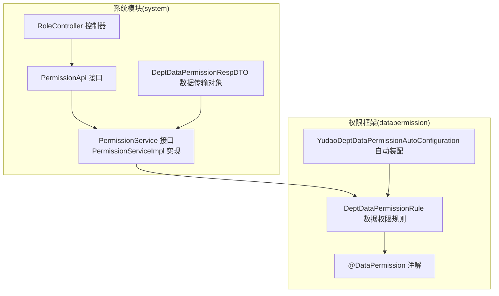
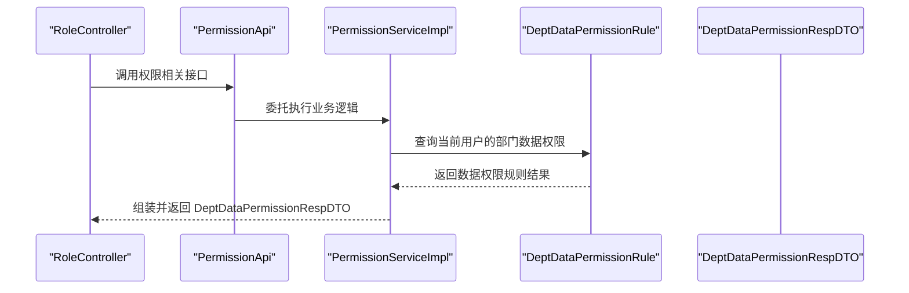
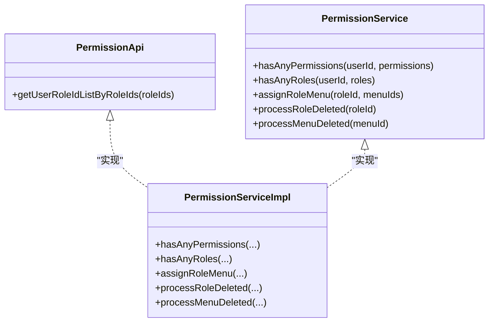
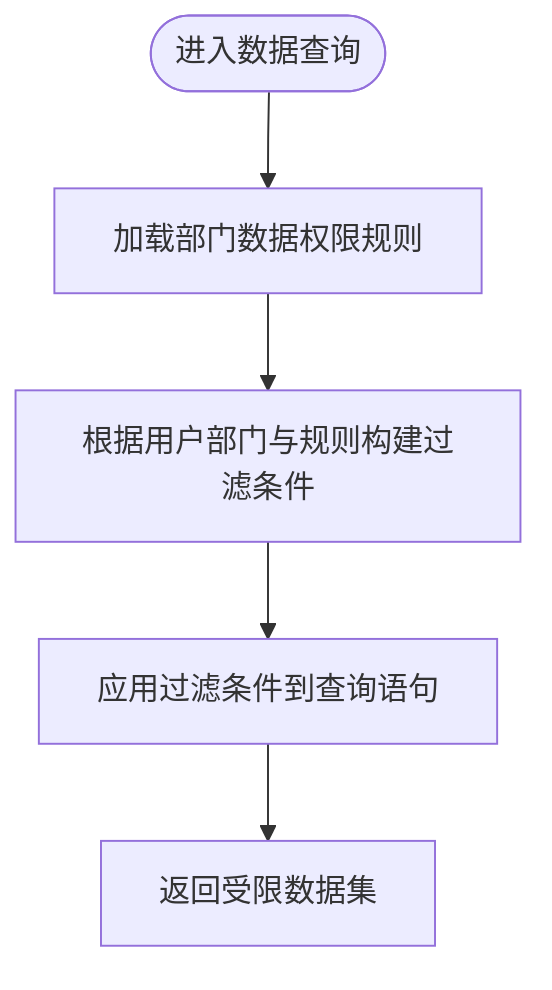
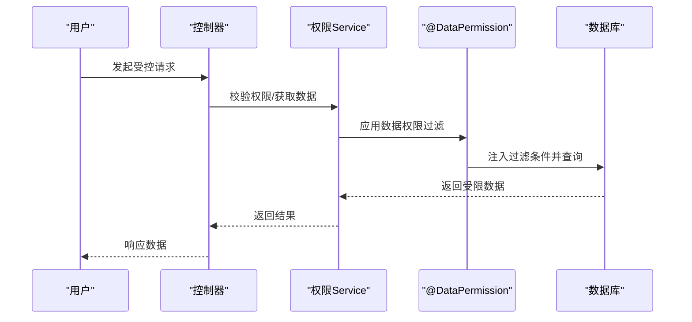

# 角色权限

<cite>
**本文引用的文件**   
- [PermissionApi.java](file://yudao-module-system/src/main/java/cn/iocoder/yudao/module/system/api/permission/PermissionApi.java)
- [PermissionService.java](file://yudao-module-system/src/main/java/cn/iocoder/yudao/module/system/service/permission/PermissionService.java)
- [PermissionServiceImpl.java](file://yudao-module-system/src/main/java/cn/iocoder/yudao/module/system/service/permission/PermissionServiceImpl.java)
- [RoleController.java](file://yudao-module-system/src/main/java/cn/iocoder/yudao/module/system/controller/admin/permission/RoleController.java)
- [DeptDataPermissionRespDTO.java](file://yudao-framework/yudao-common/src/main/java/cn/iocoder/yudao/framework/common/biz/system/permission/dto/DeptDataPermissionRespDTO.java)
- [YudaoDeptDataPermissionAutoConfiguration.java](file://yudao-framework/yudao-spring-boot-starter-biz-data-permission/src/main/java/cn/iocoder/yudao/framework/datapermission/config/YudaoDeptDataPermissionAutoConfiguration.java)
- [DeptDataPermissionRule.java](file://yudao-framework/yudao-spring-boot-starter-biz-data-permission/src/main/java/cn/iocoder/yudao/framework/datapermission/core/rule/dept/DeptDataPermissionRule.java)
- [DataPermission.java](file://yudao-framework/yudao-spring-boot-starter-biz-data-permission/src/main/java/cn/iocoder/yudao/framework/datapermission/core/annotation/DataPermission.java)
- [AdminUserServiceImpl.java](file://yudao-module-system/src/main/java/cn/iocoder/yudao/module/system/service/user/AdminUserServiceImpl.java)
- [PRD-用户权限设计.md](file://docs/PRD-用户权限设计.md)
</cite>

## 目录
1. [引言](#引言)
2. [项目结构](#项目结构)
3. [核心组件](#核心组件)
4. [架构总览](#架构总览)
5. [详细组件分析](#详细组件分析)
6. [依赖关系分析](#依赖关系分析)
7. [性能考量](#性能考量)
8. [故障排查指南](#故障排查指南)
9. [结论](#结论)
10. [附录](#附录)

## 引言
本技术文档围绕 RBAC（基于角色的访问控制）权限模型展开，系统性阐述角色定义、权限分配与用户角色绑定机制；详解权限类型、权限表达式与权限继承规则；深入解析数据权限过滤的实现原理（部门数据权限、自定义数据权限规则）；介绍动态权限控制、权限缓存与权限验证流程；并提供接口文档、配置说明与调试技巧。文档同时给出面向开发者的代码级参考路径，帮助快速定位实现细节。

## 项目结构
权限体系由“系统模块”与“权限框架”两部分协同构成：
- 系统模块（system）：提供角色、菜单、用户等实体的业务能力，以及权限 API、Service、Controller 层。
- 权限框架（datapermission）：提供数据权限规则抽象、注解驱动的动态过滤、自动装配等能力。

图表来源
- [PermissionApi.java:1-23](file://yudao-module-system/src/main/java/cn/iocoder/yudao/module/system/api/permission/PermissionApi.java#L1-L23)
- [PermissionService.java:1-58](file://yudao-module-system/src/main/java/cn/iocoder/yudao/module/system/service/permission/PermissionService.java#L1-L58)
- [PermissionServiceImpl.java:1-25](file://yudao-module-system/src/main/java/cn/iocoder/yudao/module/system/service/permission/PermissionServiceImpl.java#L1-L25)
- [RoleController.java:1-27](file://yudao-module-system/src/main/java/cn/iocoder/yudao/module/system/controller/admin/permission/RoleController.java#L1-L27)
- [DeptDataPermissionRespDTO.java:1-35](file://yudao-framework/yudao-common/src/main/java/cn/iocoder/yudao/framework/common/biz/system/permission/dto/DeptDataPermissionRespDTO.java#L1-L35)
- [YudaoDeptDataPermissionAutoConfiguration.java:1-34](file://yudao-framework/yudao-spring-boot-starter-biz-data-permission/src/main/java/cn/iocoder/yudao/framework/datapermission/config/YudaoDeptDataPermissionAutoConfiguration.java#L1-L34)
- [DeptDataPermissionRule.java](file://yudao-framework/yudao-spring-boot-starter-biz-data-permission/src/main/java/cn/iocoder/yudao/framework/datapermission/core/rule/dept/DeptDataPermissionRule.java)
- [DataPermission.java](file://yudao-framework/yudao-spring-boot-starter-biz-data-permission/src/main/java/cn/iocoder/yudao/framework/datapermission/core/annotation/DataPermission.java)

章节来源
- [PermissionApi.java:1-23](file://yudao-module-system/src/main/java/cn/iocoder/yudao/module/system/api/permission/PermissionApi.java#L1-L23)
- [PermissionService.java:1-58](file://yudao-module-system/src/main/java/cn/iocoder/yudao/module/system/service/permission/PermissionService.java#L1-L58)
- [YudaoDeptDataPermissionAutoConfiguration.java:1-34](file://yudao-framework/yudao-spring-boot-starter-biz-data-permission/src/main/java/cn/iocoder/yudao/framework/datapermission/config/YudaoDeptDataPermissionAutoConfiguration.java#L1-L34)

## 核心组件
- 权限 API 与 Service
  - PermissionApi：对外暴露权限相关能力，如按角色批量查询用户列表等。
  - PermissionService：定义权限判断、角色-菜单授权、角色/菜单删除后的清理等接口。
  - PermissionServiceImpl：具体实现权限判断、角色-菜单授权、数据权限响应组装等逻辑。
- 角色控制器
  - RoleController：提供角色分页、保存、导出等接口，配合权限框架进行访问控制。
- 数据权限 DTO
  - DeptDataPermissionRespDTO：封装部门数据权限结果，包含“全部可见”、“仅本人”、“可见部门集合”等字段。
- 数据权限框架
  - @DataPermission：注解驱动的数据权限过滤开关。
  - DeptDataPermissionRule：部门维度的数据权限规则实现，支持自定义扩展。
  - YudaoDeptDataPermissionAutoConfiguration：基于条件装配 DeptDataPermissionRule，并注入自定义规则定制器。

章节来源
- [PermissionApi.java:1-23](file://yudao-module-system/src/main/java/cn/iocoder/yudao/module/system/api/permission/PermissionApi.java#L1-L23)
- [PermissionService.java:1-58](file://yudao-module-system/src/main/java/cn/iocoder/yudao/module/system/service/permission/PermissionService.java#L1-L58)
- [PermissionServiceImpl.java:1-25](file://yudao-module-system/src/main/java/cn/iocoder/yudao/module/system/service/permission/PermissionServiceImpl.java#L1-L25)
- [RoleController.java:1-27](file://yudao-module-system/src/main/java/cn/iocoder/yudao/module/system/controller/admin/permission/RoleController.java#L1-L27)
- [DeptDataPermissionRespDTO.java:1-35](file://yudao-framework/yudao-common/src/main/java/cn/iocoder/yudao/framework/common/biz/system/permission/dto/DeptDataPermissionRespDTO.java#L1-L35)
- [YudaoDeptDataPermissionAutoConfiguration.java:1-34](file://yudao-framework/yudao-spring-boot-starter-biz-data-permission/src/main/java/cn/iocoder/yudao/framework/datapermission/config/YudaoDeptDataPermissionAutoConfiguration.java#L1-L34)
- [DeptDataPermissionRule.java](file://yudao-framework/yudao-spring-boot-starter-biz-data-permission/src/main/java/cn/iocoder/yudao/framework/datapermission/core/rule/dept/DeptDataPermissionRule.java)
- [DataPermission.java](file://yudao-framework/yudao-spring-boot-starter-biz-data-permission/src/main/java/cn/iocoder/yudao/framework/datapermission/core/annotation/DataPermission.java)

## 架构总览
下图展示了从控制器到服务层、再到数据权限规则的调用链路，以及注解驱动的数据权限过滤如何生效。

图表来源
- [RoleController.java:1-27](file://yudao-module-system/src/main/java/cn/iocoder/yudao/module/system/controller/admin/permission/RoleController.java#L1-L27)
- [PermissionApi.java:1-23](file://yudao-module-system/src/main/java/cn/iocoder/yudao/module/system/api/permission/PermissionApi.java#L1-L23)
- [PermissionServiceImpl.java:1-25](file://yudao-module-system/src/main/java/cn/iocoder/yudao/module/system/service/permission/PermissionServiceImpl.java#L1-L25)
- [DeptDataPermissionRule.java](file://yudao-framework/yudao-spring-boot-starter-biz-data-permission/src/main/java/cn/iocoder/yudao/framework/datapermission/core/rule/dept/DeptDataPermissionRule.java)
- [DeptDataPermissionRespDTO.java:1-35](file://yudao-framework/yudao-common/src/main/java/cn/iocoder/yudao/framework/common/biz/system/permission/dto/DeptDataPermissionRespDTO.java#L1-L35)

## 详细组件分析

### RBAC 权限模型与实现
- 角色定义
  - 角色作为权限的聚合载体，通过角色-菜单关联控制页面与操作权限。
  - 角色-菜单授权通过 PermissionService.assignRoleMenu 完成。
- 权限分配
  - 权限判断采用“任一满足即通过”的策略，分别提供按权限字符串与按角色标识的判断接口。
- 用户角色绑定
  - 用户-角色绑定关系用于确定用户所拥有的角色集合，从而决定其可访问的菜单与数据范围。

图表来源
- [PermissionService.java:1-58](file://yudao-module-system/src/main/java/cn/iocoder/yudao/module/system/service/permission/PermissionService.java#L1-L58)
- [PermissionApi.java:1-23](file://yudao-module-system/src/main/java/cn/iocoder/yudao/module/system/api/permission/PermissionApi.java#L1-L23)
- [PermissionServiceImpl.java:1-25](file://yudao-module-system/src/main/java/cn/iocoder/yudao/module/system/service/permission/PermissionServiceImpl.java#L1-L25)

章节来源
- [PermissionService.java:1-58](file://yudao-module-system/src/main/java/cn/iocoder/yudao/module/system/service/permission/PermissionService.java#L1-L58)
- [PermissionServiceImpl.java:1-25](file://yudao-module-system/src/main/java/cn/iocoder/yudao/module/system/service/permission/PermissionServiceImpl.java#L1-L25)

### 权限类型、权限表达式与继承规则
- 权限类型
  - 字符串型权限标识，用于菜单、按钮、接口等资源的细粒度控制。
- 权限表达式
  - 采用“任一满足即通过”的布尔表达式，简化权限组合判断。
- 权限继承
  - 用户通过角色获得权限集合，角色通过菜单获得权限集合，形成“用户 → 角色 → 菜单 → 权限”的层级继承链。

章节来源
- [PermissionService.java:19-34](file://yudao-module-system/src/main/java/cn/iocoder/yudao/module/system/service/permission/PermissionService.java#L19-L34)

### 数据权限过滤：部门维度与自定义规则
- 部门数据权限
  - 通过 DeptDataPermissionRespDTO 描述“全部可见”、“仅本人”、“可见部门集合”三种模式。
  - 通过 DeptDataPermissionRule 动态生成 SQL 过滤条件，限制用户只能访问被授权的部门数据。
- 自定义数据权限规则
  - 通过 YudaoDeptDataPermissionAutoConfiguration 条件装配 DeptDataPermissionRule，并注入 DeptDataPermissionRuleCustomizer 扩展器完成表级别的规则定制。

图表来源
- [YudaoDeptDataPermissionAutoConfiguration.java:1-34](file://yudao-framework/yudao-spring-boot-starter-biz-data-permission/src/main/java/cn/iocoder/yudao/framework/datapermission/config/YudaoDeptDataPermissionAutoConfiguration.java#L1-L34)
- [DeptDataPermissionRule.java](file://yudao-framework/yudao-spring-boot-starter-biz-data-permission/src/main/java/cn/iocoder/yudao/framework/datapermission/core/rule/dept/DeptDataPermissionRule.java)
- [DeptDataPermissionRespDTO.java:1-35](file://yudao-framework/yudao-common/src/main/java/cn/iocoder/yudao/framework/common/biz/system/permission/dto/DeptDataPermissionRespDTO.java#L1-L35)

章节来源
- [DeptDataPermissionRespDTO.java:1-35](file://yudao-framework/yudao-common/src/main/java/cn/iocoder/yudao/framework/common/biz/system/permission/dto/DeptDataPermissionRespDTO.java#L1-L35)
- [YudaoDeptDataPermissionAutoConfiguration.java:1-34](file://yudao-framework/yudao-spring-boot-starter-biz-data-permission/src/main/java/cn/iocoder/yudao/framework/datapermission/config/YudaoDeptDataPermissionAutoConfiguration.java#L1-L34)

### 动态权限控制、权限缓存与验证流程
- 动态权限控制
  - 使用 @DataPermission 注解标记需要进行数据权限过滤的方法或类，框架在运行时自动注入过滤逻辑。
- 权限缓存
  - 在用户登录或权限变更场景，建议对用户权限集合进行缓存，减少重复查询。
- 权限验证流程
  - 控制器 → 权限 API/Service → 数据权限规则 → SQL 过滤 → 结果返回。

图表来源
- [DataPermission.java](file://yudao-framework/yudao-spring-boot-starter-biz-data-permission/src/main/java/cn/iocoder/yudao/framework/datapermission/core/annotation/DataPermission.java)
- [PermissionServiceImpl.java:1-25](file://yudao-module-system/src/main/java/cn/iocoder/yudao/module/system/service/permission/PermissionServiceImpl.java#L1-L25)

章节来源
- [DataPermission.java](file://yudao-framework/yudao-spring-boot-starter-biz-data-permission/src/main/java/cn/iocoder/yudao/framework/datapermission/core/annotation/DataPermission.java)
- [PermissionServiceImpl.java:1-25](file://yudao-module-system/src/main/java/cn/iocoder/yudao/module/system/service/permission/PermissionServiceImpl.java#L1-L25)

### 自定义权限注解、条件权限与扩展权限类型
- 自定义权限注解
  - 基于 @DataPermission 的使用方式，可在业务方法上直接标注以启用数据权限过滤。
- 条件权限
  - 通过 DeptDataPermissionRule 的定制器扩展，为不同表设置差异化过滤条件（如仅本人、部门树、全部可见）。
- 扩展权限类型
  - 可在现有权限字符串基础上扩展新的资源类型（菜单、按钮、接口），并在规则中映射到相应的过滤逻辑。

章节来源
- [YudaoDeptDataPermissionAutoConfiguration.java:19-32](file://yudao-framework/yudao-spring-boot-starter-biz-data-permission/src/main/java/cn/iocoder/yudao/framework/datapermission/config/YudaoDeptDataPermissionAutoConfiguration.java#L19-L32)
- [DeptDataPermissionRule.java](file://yudao-framework/yudao-spring-boot-starter-biz-data-permission/src/main/java/cn/iocoder/yudao/framework/datapermission/core/rule/dept/DeptDataPermissionRule.java)

### 权限管理接口文档
- 角色管理接口
  - 分页查询、保存/更新、导出等接口由 RoleController 提供，结合权限框架进行访问控制。
- 权限 API
  - PermissionApi 提供按角色批量查询用户列表等通用能力，供其他模块复用。

章节来源
- [RoleController.java:1-27](file://yudao-module-system/src/main/java/cn/iocoder/yudao/module/system/controller/admin/permission/RoleController.java#L1-L27)
- [PermissionApi.java:13-21](file://yudao-module-system/src/main/java/cn/iocoder/yudao/module/system/api/permission/PermissionApi.java#L13-L21)

### 配置说明
- 自动装配
  - 当存在 LoginUser 类且存在 DeptDataPermissionRuleCustomizer Bean 时，自动装配 DeptDataPermissionRule 并注入自定义规则。
- 规则定制
  - 通过实现 DeptDataPermissionRuleCustomizer 接口，为特定表添加数据权限规则。

章节来源
- [YudaoDeptDataPermissionAutoConfiguration.java:19-32](file://yudao-framework/yudao-spring-boot-starter-biz-data-permission/src/main/java/cn/iocoder/yudao/framework/datapermission/config/YudaoDeptDataPermissionAutoConfiguration.java#L19-L32)

### 权限调试技巧
- 关闭数据权限进行唯一性校验
  - 在用户新增/修改时，若涉及唯一性校验，可通过忽略数据权限的方式临时绕过权限限制，确保校验准确性。
- 日志与断点
  - 在 PermissionServiceImpl 中的关键节点增加日志输出，定位权限判断与数据权限过滤的执行路径。

章节来源
- [AdminUserServiceImpl.java:402-420](file://yudao-module-system/src/main/java/cn/iocoder/yudao/module/system/service/user/AdminUserServiceImpl.java#L402-L420)

## 依赖关系分析
- 组件耦合
  - RoleController 依赖 PermissionApi；PermissionApi 由 PermissionServiceImpl 实现；PermissionServiceImpl 依赖 DeptDataPermissionRule 以实现数据权限过滤。
- 外部依赖
  - 权限框架通过 Spring 条件装配机制引入，避免硬编码依赖。
- 循环依赖
  - 当前结构清晰，未见循环依赖迹象。

图表来源
- [RoleController.java:1-27](file://yudao-module-system/src/main/java/cn/iocoder/yudao/module/system/controller/admin/permission/RoleController.java#L1-L27)
- [PermissionApi.java:1-23](file://yudao-module-system/src/main/java/cn/iocoder/yudao/module/system/api/permission/PermissionApi.java#L1-L23)
- [PermissionServiceImpl.java:1-25](file://yudao-module-system/src/main/java/cn/iocoder/yudao/module/system/service/permission/PermissionServiceImpl.java#L1-L25)
- [DeptDataPermissionRule.java](file://yudao-framework/yudao-spring-boot-starter-biz-data-permission/src/main/java/cn/iocoder/yudao/framework/datapermission/core/rule/dept/DeptDataPermissionRule.java)
- [DataPermission.java](file://yudao-framework/yudao-spring-boot-starter-biz-data-permission/src/main/java/cn/iocoder/yudao/framework/datapermission/core/annotation/DataPermission.java)

章节来源
- [PermissionServiceImpl.java:1-25](file://yudao-module-system/src/main/java/cn/iocoder/yudao/module/system/service/permission/PermissionServiceImpl.java#L1-L25)

## 性能考量
- 缓存策略
  - 将用户权限集合与角色-菜单映射缓存至 Redis，降低频繁查询带来的数据库压力。
- 查询优化
  - 数据权限规则尽量使用索引列参与过滤，避免全表扫描。
- 批量操作
  - 角色-菜单授权采用批量插入/删除，减少事务开销。

## 故障排查指南
- 权限不生效
  - 检查是否正确标注 @DataPermission；确认 DeptDataPermissionRule 是否被自动装配；核对自定义规则是否覆盖目标表。
- 数据越权
  - 核查 DeptDataPermissionRespDTO 的 all/self/deptIds 字段组合是否符合预期；检查用户所属部门与其可见范围是否一致。
- 唯一性校验失败
  - 若在用户新增/修改时出现唯一性校验异常，确认是否已通过忽略数据权限的方式进行校验。

章节来源
- [YudaoDeptDataPermissionAutoConfiguration.java:19-32](file://yudao-framework/yudao-spring-boot-starter-biz-data-permission/src/main/java/cn/iocoder/yudao/framework/datapermission/config/YudaoDeptDataPermissionAutoConfiguration.java#L19-L32)
- [DeptDataPermissionRespDTO.java:16-33](file://yudao-framework/yudao-common/src/main/java/cn/iocoder/yudao/framework/common/biz/system/permission/dto/DeptDataPermissionRespDTO.java#L16-L33)
- [AdminUserServiceImpl.java:402-420](file://yudao-module-system/src/main/java/cn/iocoder/yudao/module/system/service/user/AdminUserServiceImpl.java#L402-L420)

## 结论
本权限体系以 RBAC 为核心，结合注解驱动的数据权限过滤与灵活的规则定制，实现了对菜单、按钮、接口与数据的多维控制。通过缓存与批量操作优化，兼顾了易用性与性能。建议在生产环境中完善权限缓存策略与规则审计，确保权限模型稳定可靠。

## 附录
- 数据权限在模块中的应用与表级过滤配置可参考 PRD 文档中的对应章节，了解各模块主表、dealer_id 与 product_line_id 的过滤方式及 JOIN 过滤场景。

章节来源
- [PRD-用户权限设计.md:245-358](file://docs/PRD-用户权限设计.md#L245-L358)