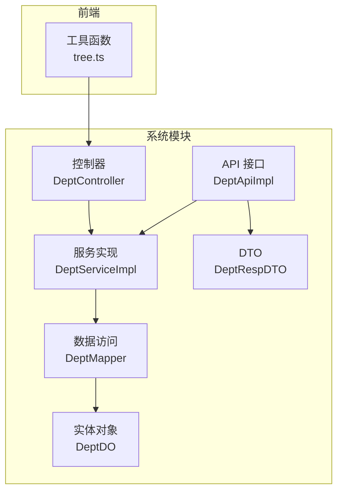
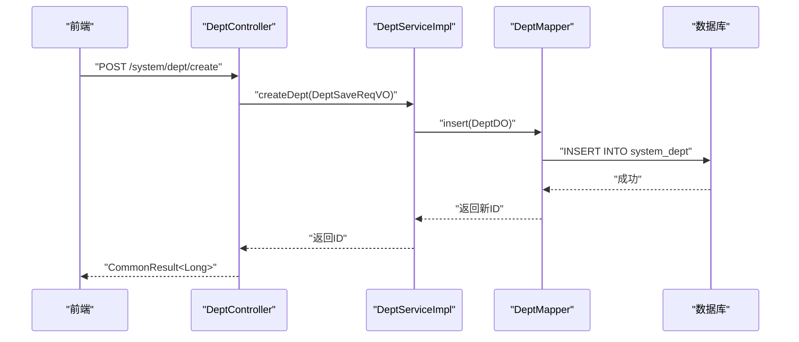
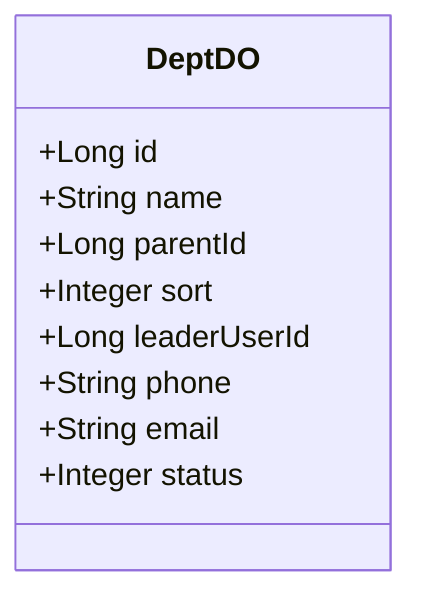
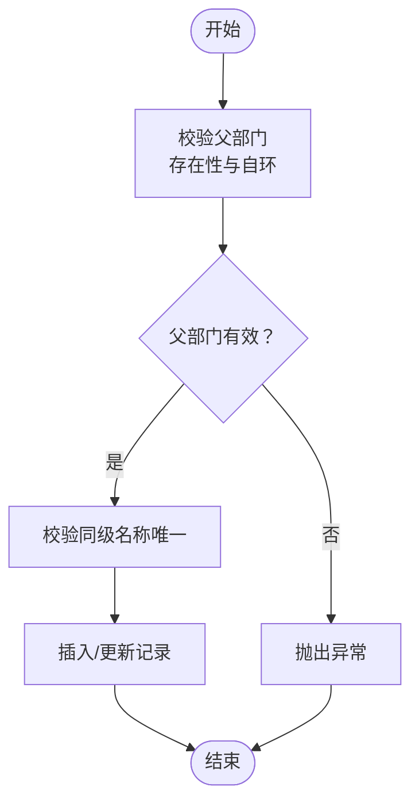
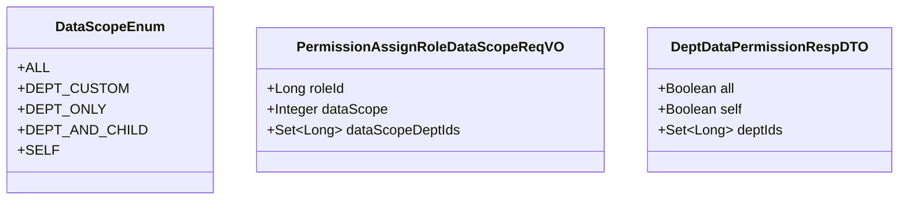
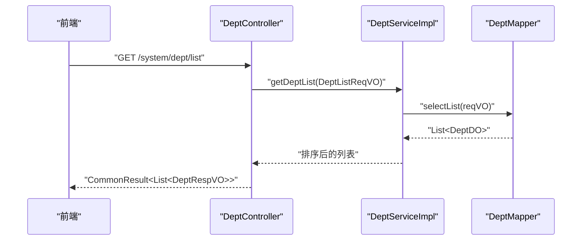
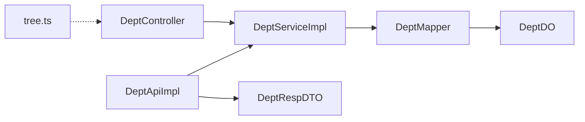

# 部门管理

<cite>
**本文引用的文件**
- [DeptDO.java](file://yudao-module-system/src/main/java/cn/iocoder/yudao/module/system/dal/dataobject/dept/DeptDO.java)
- [DeptController.java](file://yudao-module-system/src/main/java/cn/iocoder/yudao/module/system/controller/admin/dept/DeptController.java)
- [DeptService.java](file://yudao-module-system/src/main/java/cn/iocoder/yudao/module/system/service/dept/DeptService.java)
- [DeptServiceImpl.java](file://yudao-module-system/src/main/java/cn/iocoder/yudao/module/system/service/dept/DeptServiceImpl.java)
- [DeptMapper.java](file://yudao-module-system/src/main/java/cn/iocoder/yudao/module/system/dal/mysql/dept/DeptMapper.java)
- [DeptSaveReqVO.java](file://yudao-module-system/src/main/java/cn/iocoder/yudao/module/system/controller/admin/dept/vo/dept/DeptSaveReqVO.java)
- [DeptListReqVO.java](file://yudao-module-system/src/main/java/cn/iocoder/yudao/module/system/controller/admin/dept/vo/dept/DeptListReqVO.java)
- [DeptRespVO.java](file://yudao-module-system/src/main/java/cn/iocoder/yudao/module/system/controller/admin/dept/vo/dept/DeptRespVO.java)
- [DeptSimpleRespVO.java](file://yudao-module-system/src/main/java/cn/iocoder/yudao/module/system/controller/admin/dept/vo/dept/DeptSimpleRespVO.java)
- [DeptApi.java](file://yudao-module-system/src/main/java/cn/iocoder/yudao/module/system/api/dept/DeptApi.java)
- [DeptApiImpl.java](file://yudao-module-system/src/main/java/cn/iocoder/yudao/module/system/api/dept/DeptApiImpl.java)
- [DeptRespDTO.java](file://yudao-module-system/src/main/java/cn/iocoder/yudao/module/system/api/dept/dto/DeptRespDTO.java)
- [DataScopeEnum.java](file://yudao-module-system/src/main/java/cn/iocoder/yudao/module/system/enums/permission/DataScopeEnum.java)
- [PermissionAssignRoleDataScopeReqVO.java](file://yudao-module-system/src/main/java/cn/iocoder/yudao/module/system/controller/admin/permission/vo/permission/PermissionAssignRoleDataScopeReqVO.java)
- [DeptDataPermissionRespDTO.java](file://yudao-framework/yudao-common/src/main/java/cn/iocoder/yudao/framework/common/biz/system/permission/dto/DeptDataPermissionRespDTO.java)
- [tree.ts](file://yudao-ui/yudao-ui-admin-vue3/src/utils/tree.ts)
- [BpmTaskCandidateDeptLeaderStrategy.java](file://yudao-module-bpm/src/main/java/cn/iocoder/yudao/module/bpm/framework/flowable/core/candidate/strategy/dept/AbstractBpmTaskCandidateDeptLeaderStrategy.java)
- [BpmTaskCandidateDeptLeaderMultiStrategyTest.java](file://yudao-module-bpm/src/test/java/cn/iocoder/yudao/module/bpm/framework/flowable/core/candidate/strategy/dept/BpmTaskCandidateDeptLeaderMultiStrategyTest.java)
- [serviceImpl.vm](file://yudao-module-infra/src/main/resources/codegen/java/service/serviceImpl.vm)
</cite>

## 目录
1. [简介](#简介)
2. [项目结构](#项目结构)
3. [核心组件](#核心组件)
4. [架构总览](#架构总览)
5. [详细组件分析](#详细组件分析)
6. [依赖分析](#依赖分析)
7. [性能考量](#性能考量)
8. [故障排查指南](#故障排查指南)
9. [结论](#结论)
10. [附录](#附录)

## 简介
本文件面向“部门管理”功能，系统化梳理组织架构树形结构的设计与实现，覆盖部门层级关系、父子节点管理、部门合并与拆分策略建议；详述部门属性（编码、排序、负责人、联系方式等）与数据模型映射；阐述部门与用户、角色的关联关系与权限传递机制；介绍基于部门范围的数据权限实现；并提供部门树查询、批量操作与统计分析的实践路径与接口文档。文档同时给出代码级架构图与流程图，帮助读者快速定位实现位置与扩展点。

## 项目结构
部门管理功能主要位于 system 模块，采用典型的分层架构：
- 控制器层：对外暴露 REST API，负责参数接收与响应封装
- 服务层：业务编排与规则校验，含缓存与数据权限注解
- 数据访问层：MyBatis Mapper 封装 SQL 查询
- API 层：跨模块（如 BPM）的部门信息查询接口
- 前端工具：树形结构构造与遍历工具函数

图表来源
- [DeptController.java:25-94](file://yudao-module-system/src/main/java/cn/iocoder/yudao/module/system/controller/admin/dept/DeptController.java#L25-L94)
- [DeptServiceImpl.java:32-239](file://yudao-module-system/src/main/java/cn/iocoder/yudao/module/system/service/dept/DeptServiceImpl.java#L32-L239)
- [DeptMapper.java:12-37](file://yudao-module-system/src/main/java/cn/iocoder/yudao/module/system/dal/mysql/dept/DeptMapper.java#L12-L37)
- [DeptDO.java:18-67](file://yudao-module-system/src/main/java/cn/iocoder/yudao/module/system/dal/dataobject/dept/DeptDO.java#L18-L67)
- [DeptApiImpl.java:18-47](file://yudao-module-system/src/main/java/cn/iocoder/yudao/module/system/api/dept/DeptApiImpl.java#L18-L47)
- [DeptRespDTO.java:11-37](file://yudao-module-system/src/main/java/cn/iocoder/yudao/module/system/api/dept/dto/DeptRespDTO.java#L11-L37)
- [tree.ts:226-273](file://yudao-ui/yudao-ui-admin-vue3/src/utils/tree.ts#L226-L273)

章节来源
- [DeptController.java:25-94](file://yudao-module-system/src/main/java/cn/iocoder/yudao/module/system/controller/admin/dept/DeptController.java#L25-L94)
- [DeptServiceImpl.java:32-239](file://yudao-module-system/src/main/java/cn/iocoder/yudao/module/system/service/dept/DeptServiceImpl.java#L32-L239)
- [DeptMapper.java:12-37](file://yudao-module-system/src/main/java/cn/iocoder/yudao/module/system/dal/mysql/dept/DeptMapper.java#L12-L37)
- [DeptDO.java:18-67](file://yudao-module-system/src/main/java/cn/iocoder/yudao/module/system/dal/dataobject/dept/DeptDO.java#L18-L67)
- [DeptApiImpl.java:18-47](file://yudao-module-system/src/main/java/cn/iocoder/yudao/module/system/api/dept/DeptApiImpl.java#L18-L47)
- [DeptRespDTO.java:11-37](file://yudao-module-system/src/main/java/cn/iocoder/yudao/module/system/api/dept/dto/DeptRespDTO.java#L11-L37)
- [tree.ts:226-273](file://yudao-ui/yudao-ui-admin-vue3/src/utils/tree.ts#L226-L273)

## 核心组件
- 数据模型 DeptDO：定义部门表结构，包含 id、name、parentId、sort、leaderUserId、phone、email、status 等字段，并继承多租户基类
- 控制器 DeptController：提供创建、更新、删除、批量删除、列表查询、精简列表、详情查询等接口
- 服务 DeptServiceImpl：实现业务规则校验（父部门有效性、名称唯一性、环路校验）、缓存失效、批量删除、子部门递归查询、数据权限校验等
- 数据访问 DeptMapper：封装按名称/状态筛选、按父节点查询、按负责人查询、计数等常用查询
- API 接口 DeptApiImpl：对外提供部门查询、子部门查询、校验等能力
- 前端工具 tree.ts：提供树形结构构造、遍历、路径拼接等通用方法

章节来源
- [DeptDO.java:18-67](file://yudao-module-system/src/main/java/cn/iocoder/yudao/module/system/dal/dataobject/dept/DeptDO.java#L18-L67)
- [DeptController.java:25-94](file://yudao-module-system/src/main/java/cn/iocoder/yudao/module/system/controller/admin/dept/DeptController.java#L25-L94)
- [DeptService.java:15-124](file://yudao-module-system/src/main/java/cn/iocoder/yudao/module/system/service/dept/DeptService.java#L15-L124)
- [DeptServiceImpl.java:32-239](file://yudao-module-system/src/main/java/cn/iocoder/yudao/module/system/service/dept/DeptServiceImpl.java#L32-L239)
- [DeptMapper.java:12-37](file://yudao-module-system/src/main/java/cn/iocoder/yudao/module/system/dal/mysql/dept/DeptMapper.java#L12-L37)
- [DeptApiImpl.java:18-47](file://yudao-module-system/src/main/java/cn/iocoder/yudao/module/system/api/dept/DeptApiImpl.java#L18-L47)
- [tree.ts:226-273](file://yudao-ui/yudao-ui-admin-vue3/src/utils/tree.ts#L226-L273)

## 架构总览
部门管理遵循“控制器-服务-数据访问-实体”的分层设计，配合缓存与数据权限注解，确保高性能与安全可控。前端通过树工具将扁平数据转换为树形结构，供选择器与表格使用。

图表来源
- [DeptController.java:34-40](file://yudao-module-system/src/main/java/cn/iocoder/yudao/module/system/controller/admin/dept/DeptController.java#L34-L40)
- [DeptServiceImpl.java:40-56](file://yudao-module-system/src/main/java/cn/iocoder/yudao/module/system/service/dept/DeptServiceImpl.java#L40-L56)
- [DeptMapper.java:12-19](file://yudao-module-system/src/main/java/cn/iocoder/yudao/module/system/dal/mysql/dept/DeptMapper.java#L12-L19)

## 详细组件分析

### 数据模型与属性管理
- 字段说明
  - id：部门编号，主键
  - name：部门名称
  - parentId：父部门编号，自关联，根节点 parentId=0
  - sort：显示顺序，用于排序展示
  - leaderUserId：负责人用户编号
  - phone/email/status：联系方式与状态
- 设计要点
  - 支持多租户（继承租户基类）
  - 通过 sort 字段保证稳定排序输出
  - 通过 leaderUserId 关联用户，便于后续权限与流程候选人计算

图表来源
- [DeptDO.java:18-67](file://yudao-module-system/src/main/java/cn/iocoder/yudao/module/system/dal/dataobject/dept/DeptDO.java#L18-L67)

章节来源
- [DeptDO.java:18-67](file://yudao-module-system/src/main/java/cn/iocoder/yudao/module/system/dal/dataobject/dept/DeptDO.java#L18-L67)

### 组织架构树形结构与父子节点管理
- 树形结构
  - 后端通过扁平 DeptDO 列表，结合 parentId 构建树
  - 前端提供 handleTree/handleTree2 等工具函数，支持多种场景
- 父子节点管理
  - 新增/更新时校验父部门存在性与自环（父不得等于子，且不得形成环路）
  - 删除前检查是否存在子部门，避免破坏树结构
- 子部门递归查询
  - 服务层提供 getChildDeptList，逐层查询并聚合结果
  - 提供缓存版本 getChildDeptIdListFromCache，提升高频查询性能

图表来源
- [DeptServiceImpl.java:117-150](file://yudao-module-system/src/main/java/cn/iocoder/yudao/module/system/service/dept/DeptServiceImpl.java#L117-L150)
- [DeptServiceImpl.java:152-165](file://yudao-module-system/src/main/java/cn/iocoder/yudao/module/system/service/dept/DeptServiceImpl.java#L152-L165)

章节来源
- [DeptServiceImpl.java:117-165](file://yudao-module-system/src/main/java/cn/iocoder/yudao/module/system/service/dept/DeptServiceImpl.java#L117-L165)
- [tree.ts:226-273](file://yudao-ui/yudao-ui-admin-vue3/src/utils/tree.ts#L226-L273)

### 部门合并与拆分（策略建议）
- 合并
  - 建议保留原父节点，将目标部门的子部门迁移至目标父节点，保持树的连续性
  - 合并前需校验名称唯一性与状态
- 拆分
  - 通过移动子部门到新的父节点实现；注意维护 sort 与名称唯一性
- 生成树专属校验
  - 代码生成模板对树表的父节点环路校验提供了参考实现，可用于规范合并/拆分流程

章节来源
- [serviceImpl.vm:240-276](file://yudao-module-infra/src/main/resources/codegen/java/service/serviceImpl.vm#L240-L276)

### 部门属性管理（编码、排序、负责人、联系方式）
- 编码：当前模型未内置部门编码字段，如需可扩展
- 排序：通过 sort 字段控制展示顺序，后端在查询时进行排序
- 负责人：leaderUserId 关联用户，便于流程候选人与权限传递
- 联系方式：phone/email 字段便于沟通与通知

章节来源
- [DeptDO.java:24-67](file://yudao-module-system/src/main/java/cn/iocoder/yudao/module/system/dal/dataobject/dept/DeptDO.java#L24-L67)
- [DeptSaveReqVO.java:15-50](file://yudao-module-system/src/main/java/cn/iocoder/yudao/module/system/controller/admin/dept/vo/dept/DeptSaveReqVO.java#L15-L50)

### 部门与用户、角色的关联与权限传递
- 用户关联
  - 部门负责人 leaderUserId 关联用户，便于流程审批与任务候选
- 角色与数据权限
  - 数据范围枚举支持“部门及以下”、“指定部门”等范围
  - 通过 PermissionAssignRoleDataScopeReqVO 为角色分配数据范围与部门集合
  - DeptDataPermissionRespDTO 用于返回当前用户的部门数据权限集合

图表来源
- [DataScopeEnum.java:16-40](file://yudao-module-system/src/main/java/cn/iocoder/yudao/module/system/enums/permission/DataScopeEnum.java#L16-L40)
- [PermissionAssignRoleDataScopeReqVO.java:12-28](file://yudao-module-system/src/main/java/cn/iocoder/yudao/module/system/controller/admin/permission/vo/permission/PermissionAssignRoleDataScopeReqVO.java#L12-L28)
- [DeptDataPermissionRespDTO.java:13-35](file://yudao-framework/yudao-common/src/main/java/cn/iocoder/yudao/framework/common/biz/system/permission/dto/DeptDataPermissionRespDTO.java#L13-L35)

章节来源
- [DataScopeEnum.java:16-40](file://yudao-module-system/src/main/java/cn/iocoder/yudao/module/system/enums/permission/DataScopeEnum.java#L16-L40)
- [PermissionAssignRoleDataScopeReqVO.java:12-28](file://yudao-module-system/src/main/java/cn/iocoder/yudao/module/system/controller/admin/permission/vo/permission/PermissionAssignRoleDataScopeReqVO.java#L12-L28)
- [DeptDataPermissionRespDTO.java:13-35](file://yudao-framework/yudao-common/src/main/java/cn/iocoder/yudao/framework/common/biz/system/permission/dto/DeptDataPermissionRespDTO.java#L13-L35)

### 部门数据权限实现（部门范围内数据访问控制）
- 数据范围枚举
  - DEPT_AND_CHILD：部门及其子部门可见
  - DEPT_ONLY：仅部门可见
  - DEPT_CUSTOM：指定部门集合可见
- 权限赋值
  - 通过 PermissionAssignRoleDataScopeReqVO 为角色绑定数据范围与部门集合
- 响应结构
  - DeptDataPermissionRespDTO 返回 all/self/deptIds，便于前端与后端统一判断

章节来源
- [DataScopeEnum.java:16-40](file://yudao-module-system/src/main/java/cn/iocoder/yudao/module/system/enums/permission/DataScopeEnum.java#L16-L40)
- [PermissionAssignRoleDataScopeReqVO.java:12-28](file://yudao-module-system/src/main/java/cn/iocoder/yudao/module/system/controller/admin/permission/vo/permission/PermissionAssignRoleDataScopeReqVO.java#L12-L28)
- [DeptDataPermissionRespDTO.java:13-35](file://yudao-framework/yudao-common/src/main/java/cn/iocoder/yudao/framework/common/biz/system/permission/dto/DeptDataPermissionRespDTO.java#L13-L35)

### 部门树查询、批量操作与统计分析
- 部门树查询
  - 后端：DeptController.list 获取列表并按 sort 排序；前端：tree.ts 构造树
  - 子部门递归：DeptServiceImpl.getChildDeptList 逐层查询
- 批量操作
  - 删除：DeptController.delete-list 批量删除；DeptServiceImpl.deleteDeptList 校验并批量删除
- 统计分析
  - 可基于 DeptMapper 的计数与筛选能力进行统计（如按状态、负责人等维度）

图表来源
- [DeptController.java:68-74](file://yudao-module-system/src/main/java/cn/iocoder/yudao/module/system/controller/admin/dept/DeptController.java#L68-L74)
- [DeptServiceImpl.java:180-185](file://yudao-module-system/src/main/java/cn/iocoder/yudao/module/system/service/dept/DeptServiceImpl.java#L180-L185)
- [DeptMapper.java:15-19](file://yudao-module-system/src/main/java/cn/iocoder/yudao/module/system/dal/mysql/dept/DeptMapper.java#L15-L19)

章节来源
- [DeptController.java:59-74](file://yudao-module-system/src/main/java/cn/iocoder/yudao/module/system/controller/admin/dept/DeptController.java#L59-L74)
- [DeptServiceImpl.java:180-204](file://yudao-module-system/src/main/java/cn/iocoder/yudao/module/system/service/dept/DeptServiceImpl.java#L180-L204)
- [DeptMapper.java:15-37](file://yudao-module-system/src/main/java/cn/iocoder/yudao/module/system/dal/mysql/dept/DeptMapper.java#L15-L37)

### 部门管理接口文档
- 创建部门
  - 方法：POST
  - 路径：/system/dept/create
  - 请求体：DeptSaveReqVO
  - 权限：system:dept:create
- 更新部门
  - 方法：PUT
  - 路径：/system/dept/update
  - 请求体：DeptSaveReqVO
  - 权限：system:dept:update
- 删除部门
  - 方法：DELETE
  - 路径：/system/dept/delete
  - 参数：id
  - 权限：system:dept:delete
- 批量删除
  - 方法：DELETE
  - 路径：/system/dept/delete-list
  - 参数：ids
  - 权限：system:dept:delete
- 获取部门列表
  - 方法：GET
  - 路径：/system/dept/list
  - 查询：DeptListReqVO
  - 权限：system:dept:query
- 获取部门精简列表
  - 方法：GET
  - 路径：/system/dept/list-all-simple 或 /system/dept/simple-list
  - 用途：前端下拉框
- 获取部门详情
  - 方法：GET
  - 路径：/system/dept/get
  - 参数：id
  - 权限：system:dept:query

章节来源
- [DeptController.java:34-91](file://yudao-module-system/src/main/java/cn/iocoder/yudao/module/system/controller/admin/dept/DeptController.java#L34-L91)
- [DeptSaveReqVO.java:15-50](file://yudao-module-system/src/main/java/cn/iocoder/yudao/module/system/controller/admin/dept/vo/dept/DeptSaveReqVO.java#L15-L50)
- [DeptListReqVO.java:8-16](file://yudao-module-system/src/main/java/cn/iocoder/yudao/module/system/controller/admin/dept/vo/dept/DeptListReqVO.java#L8-L16)
- [DeptRespVO.java:10-39](file://yudao-module-system/src/main/java/cn/iocoder/yudao/module/system/controller/admin/dept/vo/dept/DeptRespVO.java#L10-L39)
- [DeptSimpleRespVO.java:12-23](file://yudao-module-system/src/main/java/cn/iocoder/yudao/module/system/controller/admin/dept/vo/dept/DeptSimpleRespVO.java#L12-L23)

### 组织架构设计最佳实践
- 树结构一致性
  - 严格校验父节点存在性与自环，避免形成环路
  - 删除前检查是否存在子节点
- 性能优化
  - 使用 getChildDeptIdListFromCache 缓存子部门 ID 集合
  - 列表查询按 sort 排序，减少前端二次排序
- 数据权限
  - 为角色配置合适的数据范围（DEPT_AND_CHILD/DEPT_ONLY/DEPT_CUSTOM），避免越权
- 前端体验
  - 使用 tree.ts 构造树，支持多级展开与路径拼接

章节来源
- [DeptServiceImpl.java:117-150](file://yudao-module-system/src/main/java/cn/iocoder/yudao/module/system/service/dept/DeptServiceImpl.java#L117-L150)
- [DeptServiceImpl.java:211-217](file://yudao-module-system/src/main/java/cn/iocoder/yudao/module/system/service/dept/DeptServiceImpl.java#L211-L217)
- [tree.ts:226-273](file://yudao-ui/yudao-ui-admin-vue3/src/utils/tree.ts#L226-L273)

### 常见问题与解决方案
- 父部门不存在或自环
  - 现象：新增/更新时报错
  - 处理：检查 parentId 是否为根或存在；避免将子节点设为父节点
- 名称重复
  - 现象：同级部门名称冲突
  - 处理：确保同一父节点下的名称唯一
- 删除失败（仍有子部门）
  - 现象：删除时报“存在子部门”
  - 处理：先迁移或删除子部门，再执行删除
- 数据权限越权
  - 现象：查询到非授权数据
  - 处理：核对角色数据范围配置，必要时调整为 DEPT_AND_CHILD 或 DEPT_CUSTOM

章节来源
- [DeptServiceImpl.java:117-165](file://yudao-module-system/src/main/java/cn/iocoder/yudao/module/system/service/dept/DeptServiceImpl.java#L117-L165)
- [DeptServiceImpl.java:80-104](file://yudao-module-system/src/main/java/cn/iocoder/yudao/module/system/service/dept/DeptServiceImpl.java#L80-L104)

## 依赖分析
部门管理模块内部依赖清晰，职责边界明确：控制器仅做参数与响应封装；服务层承担业务规则与缓存；数据访问层专注 SQL；API 层为跨模块提供只读能力；前端工具独立于后端。

图表来源
- [DeptController.java:25-94](file://yudao-module-system/src/main/java/cn/iocoder/yudao/module/system/controller/admin/dept/DeptController.java#L25-L94)
- [DeptServiceImpl.java:32-239](file://yudao-module-system/src/main/java/cn/iocoder/yudao/module/system/service/dept/DeptServiceImpl.java#L32-L239)
- [DeptMapper.java:12-37](file://yudao-module-system/src/main/java/cn/iocoder/yudao/module/system/dal/mysql/dept/DeptMapper.java#L12-L37)
- [DeptDO.java:18-67](file://yudao-module-system/src/main/java/cn/iocoder/yudao/module/system/dal/dataobject/dept/DeptDO.java#L18-L67)
- [DeptApiImpl.java:18-47](file://yudao-module-system/src/main/java/cn/iocoder/yudao/module/system/api/dept/DeptApiImpl.java#L18-L47)
- [DeptRespDTO.java:11-37](file://yudao-module-system/src/main/java/cn/iocoder/yudao/module/system/api/dept/dto/DeptRespDTO.java#L11-L37)
- [tree.ts:226-273](file://yudao-ui/yudao-ui-admin-vue3/src/utils/tree.ts#L226-L273)

## 性能考量
- 缓存策略
  - 子部门 ID 列表缓存：getChildDeptIdListFromCache 提升频繁查询性能
  - 缓存失效：创建/更新/删除部门时清空缓存，避免脏读
- 查询优化
  - 列表按 sort 排序，减少前端处理成本
  - 按父节点批量查询子部门，降低多次往返
- 并发与事务
  - 校验与写入在单事务内完成，保证一致性

章节来源
- [DeptServiceImpl.java:40-104](file://yudao-module-system/src/main/java/cn/iocoder/yudao/module/system/service/dept/DeptServiceImpl.java#L40-L104)
- [DeptServiceImpl.java:211-217](file://yudao-module-system/src/main/java/cn/iocoder/yudao/module/system/service/dept/DeptServiceImpl.java#L211-L217)
- [DeptMapper.java:29-31](file://yudao-module-system/src/main/java/cn/iocoder/yudao/module/system/dal/mysql/dept/DeptMapper.java#L29-L31)

## 故障排查指南
- 接口返回错误码
  - 部门不存在：DEPT_NOT_FOUND
  - 父部门错误：DEPT_PARENT_ERROR
  - 父部门不存在：DEPT_PARENT_NOT_EXITS
  - 父部门是子部门：DEPT_PARENT_IS_CHILD
  - 部门名称重复：DEPT_NAME_DUPLICATE
  - 存在子部门不可删除：DEPT_EXITS_CHILDREN
- 排查步骤
  - 确认 parentId 是否为根或存在
  - 确认同级名称唯一
  - 确认删除时无子部门
  - 检查数据权限范围配置

章节来源
- [DeptServiceImpl.java:106-165](file://yudao-module-system/src/main/java/cn/iocoder/yudao/module/system/service/dept/DeptServiceImpl.java#L106-L165)
- [DeptServiceImpl.java:220-236](file://yudao-module-system/src/main/java/cn/iocoder/yudao/module/system/service/dept/DeptServiceImpl.java#L220-L236)

## 结论
部门管理功能以 DeptDO 为核心，围绕树形结构的完整性与性能进行了系统化设计：严格的父子节点校验、缓存与批量操作、以及与数据权限的协同。通过标准化的接口与前端树工具，既满足了管理需求，也为后续扩展（如部门编码、合并拆分）预留了空间。

## 附录
- 部门与流程候选人关联
  - BPM 模块通过 DeptApi 获取部门信息，并根据层级获取负责人作为任务候选人
- 测试参考
  - BPM 部门负责人多策略测试，验证候选人计算逻辑

章节来源
- [AbstractBpmTaskCandidateDeptLeaderStrategy.java:19-47](file://yudao-module-bpm/src/main/java/cn/iocoder/yudao/module/bpm/framework/flowable/core/candidate/strategy/dept/AbstractBpmTaskCandidateDeptLeaderStrategy.java#L19-L47)
- [BpmTaskCandidateDeptLeaderMultiStrategyTest.java:27-41](file://yudao-module-bpm/src/test/java/cn/iocoder/yudao/module/bpm/framework/flowable/core/candidate/strategy/dept/BpmTaskCandidateDeptLeaderMultiStrategyTest.java#L27-L41)