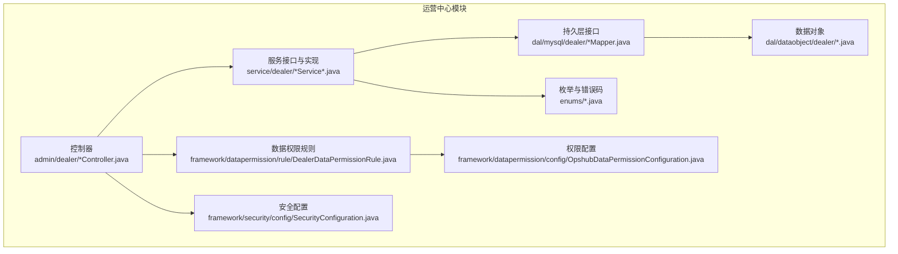
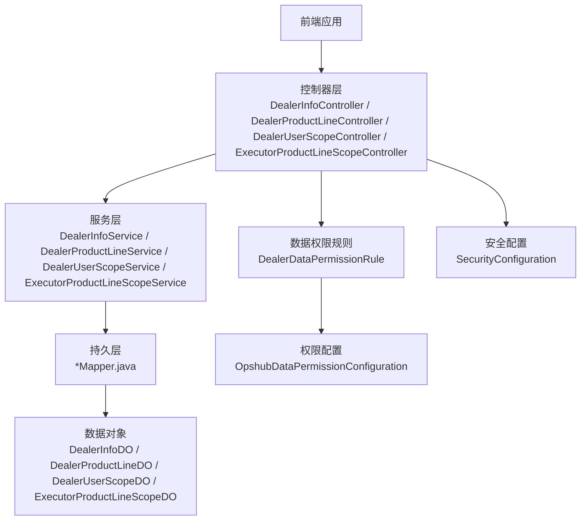
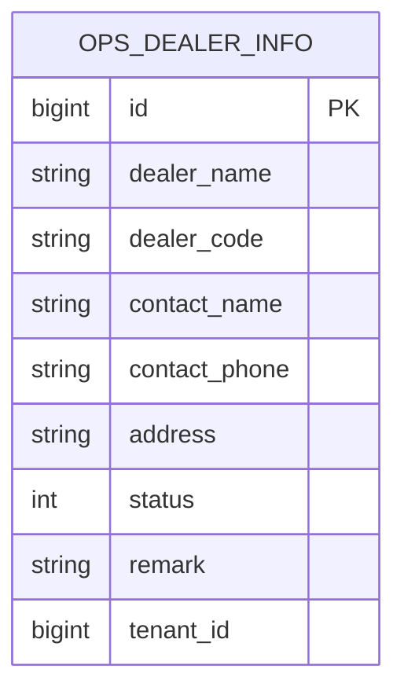
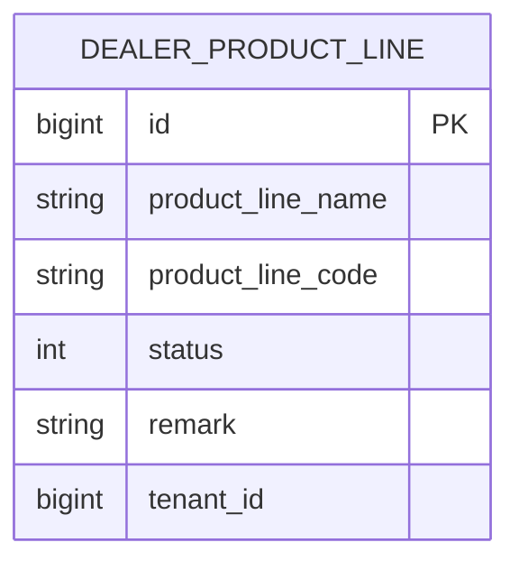
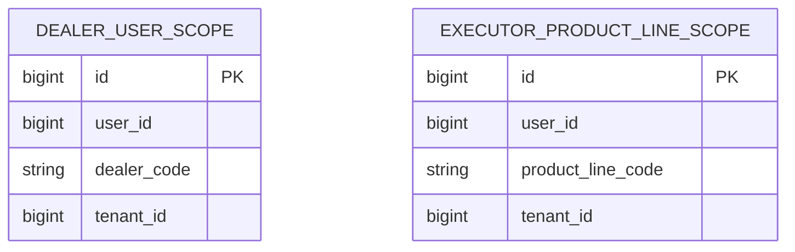
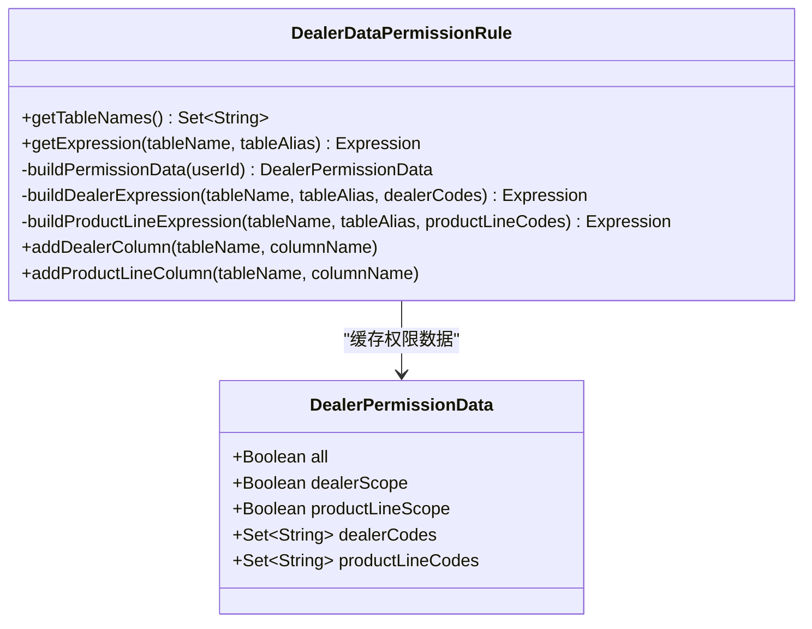
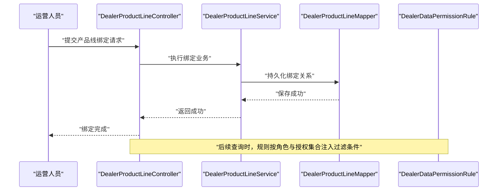
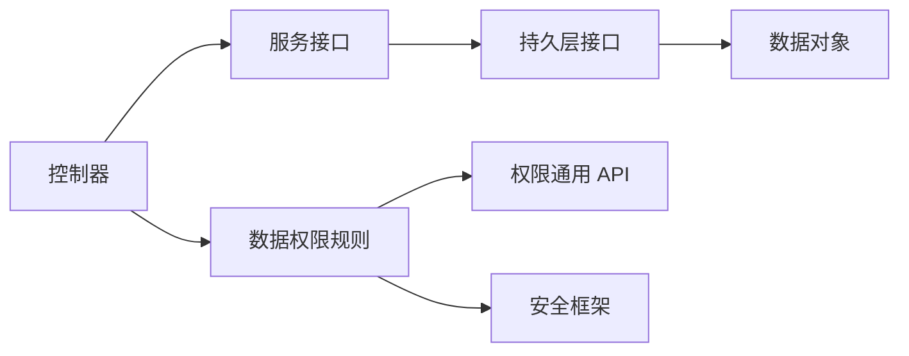

# 运营中心模块

<cite>
**本文引用的文件**
- [DealerInfoController.java](file://yudao-module-opshub/src/main/java/cn/iocoder/yudao/module/opshub/controller/admin/dealer/DealerInfoController.java)
- [DealerInfoService.java](file://yudao-module-opshub/src/main/java/cn/iocoder/yudao/module/opshub/service/dealer/DealerInfoService.java)
- [DealerInfoDO.java](file://yudao-module-opshub/src/main/java/cn/iocoder/yudao/module/opshub/dal/dataobject/dealer/DealerInfoDO.java)
- [DealerDataPermissionRule.java](file://yudao-module-opshub/src/main/java/cn/iocoder/yudao/module/opshub/framework/datapermission/rule/DealerDataPermissionRule.java)
- [OpshubDataPermissionConfiguration.java](file://yudao-module-opshub/src/main/java/cn/iocoder/yudao/module/opshub/framework/datapermission/config/OpshubDataPermissionConfiguration.java)
- [DealerUserScopeMapper.java](file://yudao-module-opshub/src/main/java/cn/iocoder/yudao/module/opshub/dal/mysql/dealer/DealerUserScopeMapper.java)
- [ExecutorProductLineScopeMapper.java](file://yudao-module-opshub/src/main/java/cn/iocoder/yudao/module/opshub/dal/mysql/dealer/ExecutorProductLineScopeMapper.java)
- [DealerInfoServiceImpl.java](file://yudao-module-opshub/src/main/java/cn/iocoder/yudao/module/opshub/service/dealer/impl/DealerInfoServiceImpl.java)
- [DealerProductLineController.java](file://yudao-module-opshub/src/main/java/cn/iocoder/yudao/module/opshub/controller/admin/dealer/DealerProductLineController.java)
- [DealerProductLineService.java](file://yudao-module-opshub/src/main/java/cn/iocoder/yudao/module/opshub/service/dealer/DealerProductLineService.java)
- [DealerProductLineDO.java](file://yudao-module-opshub/src/main/java/cn/iocoder/yudao/module/opshub/dal/dataobject/dealer/DealerProductLineDO.java)
- [DealerProductLineMapper.java](file://yudao-module-opshub/src/main/java/cn/iocoder/yudao/module/opshub/dal/mysql/dealer/DealerProductLineMapper.java)
- [DealerUserScopeController.java](file://yudao-module-opshub/src/main/java/cn/iocoder/yudao/module/opshub/controller/admin/dealer/DealerUserScopeController.java)
- [DealerUserScopeService.java](file://yudao-module-opshub/src/main/java/cn/iocoder/yudao/module/opshub/service/dealer/DealerUserScopeService.java)
- [DealerUserScopeDO.java](file://yudao-module-opshub/src/main/java/cn/iocoder/yudao/module/opshub/dal/dataobject/dealer/DealerUserScopeDO.java)
- [DealerUserScopeMapper.java](file://yudao-module-opshub/src/main/java/cn/iocoder/yudao/module/opshub/dal/mysql/dealer/DealerUserScopeMapper.java)
- [ExecutorProductLineScopeController.java](file://yudao-module-opshub/src/main/java/cn/iocoder/yudao/module/opshub/controller/admin/dealer/ExecutorProductLineScopeController.java)
- [ExecutorProductLineScopeService.java](file://yudao-module-opshub/src/main/java/cn/iocoder/yudao/module/opshub/service/dealer/ExecutorProductLineScopeService.java)
- [ExecutorProductLineScopeDO.java](file://yudao-module-opshub/src/main/java/cn/iocoder/yudao/module/opshub/dal/dataobject/dealer/ExecutorProductLineScopeDO.java)
- [ExecutorProductLineScopeMapper.java](file://yudao-module-opshub/src/main/java/cn/iocoder/yudao/module/opshub/dal/mysql/dealer/ExecutorProductLineScopeMapper.java)
- [SecurityConfiguration.java](file://yudao-module-opshub/src/main/java/cn/iocoder/yudao/module/opshub/framework/security/config/SecurityConfiguration.java)
- [ErrorCodeConstants.java](file://yudao-module-opshub/src/main/java/cn/iocoder/yudao/module/opshub/enums/ErrorCodeConstants.java)
- [OpsRoleCodeConstants.java](file://yudao-module-opshub/src/main/java/cn/iocoder/yudao/module/opshub/enums/OpsRoleCodeConstants.java)
- [opshub-step1.sql](file://sql/postgresql/opshub-step1.sql)
</cite>

## 目录
1. [简介](#简介)
2. [项目结构](#项目结构)
3. [核心组件](#核心组件)
4. [架构总览](#架构总览)
5. [详细组件分析](#详细组件分析)
6. [依赖分析](#依赖分析)
7. [性能考虑](#性能考虑)
8. [故障排查指南](#故障排查指南)
9. [结论](#结论)
10. [附录](#附录)

## 简介
本文件面向运营中心模块，系统化阐述经销商管理、产品线管理与用户范围控制的业务与技术实现，重点覆盖：
- 经销商信息维护：新增、编辑、删除、查询与分页展示
- 产品线管理：产品线定义、绑定与范围控制
- 用户范围控制：基于角色的经销商/产品线维度访问控制
- 数据权限控制机制：基于租户与角色的多维数据隔离
- 业务流程：数据录入、审核与发布（以产品线绑定为例）
- 基础数据管理：字典与数据标准化（结合系统模块）
- 多租户架构：租户隔离与数据共享策略
- 配置示例、流程图与集成指南
- 数据迁移、备份恢复与性能监控最佳实践

## 项目结构
运营中心模块位于 yudao-module-opshub，采用“控制器-服务-持久层-数据对象-枚举-权限配置”的分层组织方式，围绕“经销商”“产品线”“用户范围”三大领域展开。

图表来源
- [DealerInfoController.java:1-81](file://yudao-module-opshub/src/main/java/cn/iocoder/yudao/module/opshub/controller/admin/dealer/DealerInfoController.java#L1-L81)
- [DealerInfoService.java:1-33](file://yudao-module-opshub/src/main/java/cn/iocoder/yudao/module/opshub/service/dealer/DealerInfoService.java#L1-L33)
- [DealerInfoDO.java:1-54](file://yudao-module-opshub/src/main/java/cn/iocoder/yudao/module/opshub/dal/dataobject/dealer/DealerInfoDO.java#L1-L54)
- [DealerDataPermissionRule.java:1-246](file://yudao-module-opshub/src/main/java/cn/iocoder/yudao/module/opshub/framework/datapermission/rule/DealerDataPermissionRule.java#L1-L246)
- [OpshubDataPermissionConfiguration.java](file://yudao-module-opshub/src/main/java/cn/iocoder/yudao/module/opshub/framework/datapermission/config/OpshubDataPermissionConfiguration.java)
- [SecurityConfiguration.java](file://yudao-module-opshub/src/main/java/cn/iocoder/yudao/module/opshub/framework/security/config/SecurityConfiguration.java)

章节来源
- [DealerInfoController.java:1-81](file://yudao-module-opshub/src/main/java/cn/iocoder/yudao/module/opshub/controller/admin/dealer/DealerInfoController.java#L1-L81)
- [DealerInfoService.java:1-33](file://yudao-module-opshub/src/main/java/cn/iocoder/yudao/module/opshub/service/dealer/DealerInfoService.java#L1-L33)
- [DealerInfoDO.java:1-54](file://yudao-module-opshub/src/main/java/cn/iocoder/yudao/module/opshub/dal/dataobject/dealer/DealerInfoDO.java#L1-L54)
- [DealerDataPermissionRule.java:1-246](file://yudao-module-opshub/src/main/java/cn/iocoder/yudao/module/opshub/framework/datapermission/rule/DealerDataPermissionRule.java#L1-L246)
- [OpshubDataPermissionConfiguration.java](file://yudao-module-opshub/src/main/java/cn/iocoder/yudao/module/opshub/framework/datapermission/config/OpshubDataPermissionConfiguration.java)
- [SecurityConfiguration.java](file://yudao-module-opshub/src/main/java/cn/iocoder/yudao/module/opshub/framework/security/config/SecurityConfiguration.java)

## 核心组件
- 经销商管理
  - 控制器：提供新增、修改、删除、单查、分页、精简列表等接口
  - 服务：封装业务逻辑，负责参数校验与调用持久层
  - 数据对象：映射 ops_dealer_info 表，继承租户基类
- 产品线管理
  - 控制器：提供产品线的增删改查与分页接口
  - 服务：封装产品线业务
  - 数据对象：映射产品线相关表
- 用户范围控制
  - 经销商用户范围：记录用户可访问的经销商集合
  - 执行者产品线范围：记录执行者可访问的产品线集合
- 数据权限规则
  - 基于角色的经销商/产品线维度过滤
  - 支持超级管理员全量可见
- 安全与权限
  - 基于注解的权限校验
  - 角色常量与错误码

章节来源
- [DealerInfoController.java:1-81](file://yudao-module-opshub/src/main/java/cn/iocoder/yudao/module/opshub/controller/admin/dealer/DealerInfoController.java#L1-L81)
- [DealerInfoService.java:1-33](file://yudao-module-opshub/src/main/java/cn/iocoder/yudao/module/opshub/service/dealer/DealerInfoService.java#L1-L33)
- [DealerInfoDO.java:1-54](file://yudao-module-opshub/src/main/java/cn/iocoder/yudao/module/opshub/dal/dataobject/dealer/DealerInfoDO.java#L1-L54)
- [DealerProductLineController.java](file://yudao-module-opshub/src/main/java/cn/iocoder/yudao/module/opshub/controller/admin/dealer/DealerProductLineController.java)
- [DealerProductLineService.java](file://yudao-module-opshub/src/main/java/cn/iocoder/yudao/module/opshub/service/dealer/DealerProductLineService.java)
- [DealerProductLineDO.java](file://yudao-module-opshub/src/main/java/cn/iocoder/yudao/module/opshub/dal/dataobject/dealer/DealerProductLineDO.java)
- [DealerUserScopeController.java](file://yudao-module-opshub/src/main/java/cn/iocoder/yudao/module/opshub/controller/admin/dealer/DealerUserScopeController.java)
- [DealerUserScopeService.java](file://yudao-module-opshub/src/main/java/cn/iocoder/yudao/module/opshub/service/dealer/DealerUserScopeService.java)
- [DealerUserScopeDO.java](file://yudao-module-opshub/src/main/java/cn/iocoder/yudao/module/opshub/dal/dataobject/dealer/DealerUserScopeDO.java)
- [ExecutorProductLineScopeController.java](file://yudao-module-opshub/src/main/java/cn/iocoder/yudao/module/opshub/controller/admin/dealer/ExecutorProductLineScopeController.java)
- [ExecutorProductLineScopeService.java](file://yudao-module-opshub/src/main/java/cn/iocoder/yudao/module/opshub/service/dealer/ExecutorProductLineScopeService.java)
- [ExecutorProductLineScopeDO.java](file://yudao-module-opshub/src/main/java/cn/iocoder/yudao/module/opshub/dal/dataobject/dealer/ExecutorProductLineScopeDO.java)

## 架构总览
运营中心模块遵循标准分层架构，前端通过控制器暴露 REST 接口，服务层编排业务，持久层访问数据库；数据权限规则在 SQL 查询阶段自动注入 WHERE 条件，确保按角色维度进行数据隔离。

图表来源
- [DealerInfoController.java:1-81](file://yudao-module-opshub/src/main/java/cn/iocoder/yudao/module/opshub/controller/admin/dealer/DealerInfoController.java#L1-L81)
- [DealerInfoService.java:1-33](file://yudao-module-opshub/src/main/java/cn/iocoder/yudao/module/opshub/service/dealer/DealerInfoService.java#L1-L33)
- [DealerInfoDO.java:1-54](file://yudao-module-opshub/src/main/java/cn/iocoder/yudao/module/opshub/dal/dataobject/dealer/DealerInfoDO.java#L1-L54)
- [DealerDataPermissionRule.java:1-246](file://yudao-module-opshub/src/main/java/cn/iocoder/yudao/module/opshub/framework/datapermission/rule/DealerDataPermissionRule.java#L1-L246)
- [OpshubDataPermissionConfiguration.java](file://yudao-module-opshub/src/main/java/cn/iocoder/yudao/module/opshub/framework/datapermission/config/OpshubDataPermissionConfiguration.java)
- [SecurityConfiguration.java](file://yudao-module-opshub/src/main/java/cn/iocoder/yudao/module/opshub/framework/security/config/SecurityConfiguration.java)

## 详细组件分析

### 经销商信息管理
- 功能职责
  - 新增/修改/删除/查询/分页/精简列表
  - 基于租户隔离的经销商数据存储
- 关键实现
  - 控制器：声明权限注解，调用服务层完成业务
  - 服务接口：定义 CRUD 与分页能力
  - 数据对象：映射 ops_dealer_info 表，包含基础字段与状态
- 数据模型

图表来源
- [DealerInfoDO.java:1-54](file://yudao-module-opshub/src/main/java/cn/iocoder/yudao/module/opshub/dal/dataobject/dealer/DealerInfoDO.java#L1-L54)

章节来源
- [DealerInfoController.java:1-81](file://yudao-module-opshub/src/main/java/cn/iocoder/yudao/module/opshub/controller/admin/dealer/DealerInfoController.java#L1-L81)
- [DealerInfoService.java:1-33](file://yudao-module-opshub/src/main/java/cn/iocoder/yudao/module/opshub/service/dealer/DealerInfoService.java#L1-L33)
- [DealerInfoDO.java:1-54](file://yudao-module-opshub/src/main/java/cn/iocoder/yudao/module/opshub/dal/dataobject/dealer/DealerInfoDO.java#L1-L54)

### 产品线管理
- 功能职责
  - 产品线的新增、修改、删除、查询与分页
  - 与经销商建立绑定关系，支持按产品线维度进行数据访问控制
- 关键实现
  - 控制器：提供 REST 接口
  - 服务：封装产品线业务逻辑
  - 数据对象：映射产品线相关表
- 数据模型

图表来源
- [DealerProductLineDO.java](file://yudao-module-opshub/src/main/java/cn/iocoder/yudao/module/opshub/dal/dataobject/dealer/DealerProductLineDO.java)

章节来源
- [DealerProductLineController.java](file://yudao-module-opshub/src/main/java/cn/iocoder/yudao/module/opshub/controller/admin/dealer/DealerProductLineController.java)
- [DealerProductLineService.java](file://yudao-module-opshub/src/main/java/cn/iocoder/yudao/module/opshub/service/dealer/DealerProductLineService.java)
- [DealerProductLineDO.java](file://yudao-module-opshub/src/main/java/cn/iocoder/yudao/module/opshub/dal/dataobject/dealer/DealerProductLineDO.java)

### 用户范围控制
- 经销商用户范围
  - 记录用户可访问的经销商集合，用于经销商维度的数据权限过滤
- 执行者产品线范围
  - 记录执行者可访问的产品线集合，用于产品线维度的数据权限过滤
- 关键实现
  - 控制器：提供范围分配与查询接口
  - 服务：封装范围分配与查询逻辑
  - 数据对象：映射范围表
- 数据模型

图表来源
- [DealerUserScopeDO.java](file://yudao-module-opshub/src/main/java/cn/iocoder/yudao/module/opshub/dal/dataobject/dealer/DealerUserScopeDO.java)
- [ExecutorProductLineScopeDO.java](file://yudao-module-opshub/src/main/java/cn/iocoder/yudao/module/opshub/dal/dataobject/dealer/ExecutorProductLineScopeDO.java)

章节来源
- [DealerUserScopeController.java](file://yudao-module-opshub/src/main/java/cn/iocoder/yudao/module/opshub/controller/admin/dealer/DealerUserScopeController.java)
- [DealerUserScopeService.java](file://yudao-module-opshub/src/main/java/cn/iocoder/yudao/module/opshub/service/dealer/DealerUserScopeService.java)
- [DealerUserScopeDO.java](file://yudao-module-opshub/src/main/java/cn/iocoder/yudao/module/opshub/dal/dataobject/dealer/DealerUserScopeDO.java)
- [ExecutorProductLineScopeController.java](file://yudao-module-opshub/src/main/java/cn/iocoder/yudao/module/opshub/controller/admin/dealer/ExecutorProductLineScopeController.java)
- [ExecutorProductLineScopeService.java](file://yudao-module-opshub/src/main/java/cn/iocoder/yudao/module/opshub/service/dealer/ExecutorProductLineScopeService.java)
- [ExecutorProductLineScopeDO.java](file://yudao-module-opshub/src/main/java/cn/iocoder/yudao/module/opshub/dal/dataobject/dealer/ExecutorProductLineScopeDO.java)

### 数据权限控制机制
- 角色与维度
  - 超级管理员：全量可见
  - 品牌管理员/品牌销售/服务执行者：按产品线维度过滤
  - 经销商用户：按经销商维度过滤
- 实现原理
  - 在查询阶段通过 DealerDataPermissionRule 自动注入 WHERE 条件
  - 将授权集合缓存至登录用户上下文，避免重复计算
  - 通过配置类注册规则并指定生效表与字段映射
- 权限规则类图

图表来源
- [DealerDataPermissionRule.java:1-246](file://yudao-module-opshub/src/main/java/cn/iocoder/yudao/module/opshub/framework/datapermission/rule/DealerDataPermissionRule.java#L1-L246)

章节来源
- [DealerDataPermissionRule.java:1-246](file://yudao-module-opshub/src/main/java/cn/iocoder/yudao/module/opshub/framework/datapermission/rule/DealerDataPermissionRule.java#L1-L246)
- [OpshubDataPermissionConfiguration.java](file://yudao-module-opshub/src/main/java/cn/iocoder/yudao/module/opshub/framework/datapermission/config/OpshubDataPermissionConfiguration.java)
- [DealerUserScopeMapper.java](file://yudao-module-opshub/src/main/java/cn/iocoder/yudao/module/opshub/dal/mysql/dealer/DealerUserScopeMapper.java)
- [ExecutorProductLineScopeMapper.java](file://yudao-module-opshub/src/main/java/cn/iocoder/yudao/module/opshub/dal/mysql/dealer/ExecutorProductLineScopeMapper.java)

### 业务流程：产品线绑定与数据访问
- 流程说明
  - 产品线绑定：运营人员在产品线管理中维护产品线，随后在“产品线绑定”界面将产品线与经销商关联
  - 数据访问：当执行者登录后，系统根据其角色与授权范围，自动在查询阶段注入 WHERE 条件，仅返回可访问的数据
- 序列图

图表来源
- [DealerProductLineController.java](file://yudao-module-opshub/src/main/java/cn/iocoder/yudao/module/opshub/controller/admin/dealer/DealerProductLineController.java)
- [DealerProductLineService.java](file://yudao-module-opshub/src/main/java/cn/iocoder/yudao/module/opshub/service/dealer/DealerProductLineService.java)
- [DealerProductLineMapper.java](file://yudao-module-opshub/src/main/java/cn/iocoder/yudao/module/opshub/dal/mysql/dealer/DealerProductLineMapper.java)
- [DealerDataPermissionRule.java:1-246](file://yudao-module-opshub/src/main/java/cn/iocoder/yudao/module/opshub/framework/datapermission/rule/DealerDataPermissionRule.java#L1-L246)

### 基础数据管理与字典配置
- 字典与数据标准化
  - 通过系统模块的字典能力对状态、类型等进行标准化管理
  - 经销商状态、产品线状态等统一使用字典值，保证前后端一致性
- 集成建议
  - 在控制器或服务层调用系统提供的字典 API 获取枚举值
  - 使用统一的响应体包装与错误码体系

章节来源
- [ErrorCodeConstants.java](file://yudao-module-opshub/src/main/java/cn/iocoder/yudao/module/opshub/enums/ErrorCodeConstants.java)
- [OpsRoleCodeConstants.java](file://yudao-module-opshub/src/main/java/cn/iocoder/yudao/module/opshub/enums/OpsRoleCodeConstants.java)

### 多租户架构下的运营数据管理
- 租户隔离
  - 经销商与产品线等实体均继承租户基类，天然具备租户字段
  - 数据权限规则与查询条件共同作用，确保跨租户数据隔离
- 数据共享策略
  - 通过角色与范围表实现“最小授权”，避免越权访问
  - 超级管理员可选择性地跨租户查看（由权限规则决定）

章节来源
- [DealerInfoDO.java:1-54](file://yudao-module-opshub/src/main/java/cn/iocoder/yudao/module/opshub/dal/dataobject/dealer/DealerInfoDO.java#L1-L54)

## 依赖分析
- 组件耦合
  - 控制器依赖服务接口，服务依赖持久层接口，降低上层对下层的直接依赖
  - 数据权限规则通过接口注入授权集合，避免硬编码
- 外部依赖
  - 权限规则依赖系统通用权限 API 与安全框架
  - MyBatis 工具用于动态构建列表达式

图表来源
- [DealerInfoController.java:1-81](file://yudao-module-opshub/src/main/java/cn/iocoder/yudao/module/opshub/controller/admin/dealer/DealerInfoController.java#L1-L81)
- [DealerDataPermissionRule.java:1-246](file://yudao-module-opshub/src/main/java/cn/iocoder/yudao/module/opshub/framework/datapermission/rule/DealerDataPermissionRule.java#L1-L246)

章节来源
- [DealerInfoController.java:1-81](file://yudao-module-opshub/src/main/java/cn/iocoder/yudao/module/opshub/controller/admin/dealer/DealerInfoController.java#L1-L81)
- [DealerDataPermissionRule.java:1-246](file://yudao-module-opshub/src/main/java/cn/iocoder/yudao/module/opshub/framework/datapermission/rule/DealerDataPermissionRule.java#L1-L246)

## 性能考虑
- 查询优化
  - 在数据权限规则中缓存用户授权集合，减少重复查询
  - 合理设置索引：dealer_code、product_line_code、tenant_id 等常用过滤字段
- 分页与批量
  - 使用分页接口避免一次性加载大量数据
  - 对范围分配等批量操作，采用批处理策略
- 监控与告警
  - 结合链路追踪与指标监控，关注慢查询与高并发场景

## 故障排查指南
- 权限问题
  - 若出现“无数据”或“越权访问”，检查用户角色与范围表是否正确配置
  - 确认数据权限规则已注册且生效
- 接口异常
  - 查看错误码与异常日志，定位具体业务异常
- 数据不一致
  - 核对租户字段是否正确传递，避免跨租户误操作

章节来源
- [ErrorCodeConstants.java](file://yudao-module-opshub/src/main/java/cn/iocoder/yudao/module/opshub/enums/ErrorCodeConstants.java)
- [SecurityConfiguration.java](file://yudao-module-opshub/src/main/java/cn/iocoder/yudao/module/opshub/framework/security/config/SecurityConfiguration.java)

## 结论
运营中心模块通过清晰的分层设计与完善的数据权限机制，实现了经销商、产品线与用户范围的精细化管理。结合多租户与角色维度的访问控制，既能满足业务灵活性，又能保障数据安全与合规。

## 附录

### 配置示例与集成指南
- 开启数据权限规则
  - 在权限配置类中注册 DealerDataPermissionRule，并添加需要过滤的表与字段映射
- 角色与权限
  - 使用角色常量标识不同维度的访问角色，配合权限注解保护接口
- 基础数据
  - 通过系统模块的字典能力统一管理状态与类型

章节来源
- [OpshubDataPermissionConfiguration.java](file://yudao-module-opshub/src/main/java/cn/iocoder/yudao/module/opshub/framework/datapermission/config/OpshubDataPermissionConfiguration.java)
- [OpsRoleCodeConstants.java](file://yudao-module-opshub/src/main/java/cn/iocoder/yudao/module/opshub/enums/OpsRoleCodeConstants.java)

### 数据迁移、备份恢复与性能监控最佳实践
- 数据迁移
  - 使用数据库迁移工具维护 ops_dealer_info、产品线与范围表结构变更
  - 迁移前备份存量数据，迁移后验证关键查询与权限规则
- 备份恢复
  - 定期对数据库进行增量与全量备份，确保可快速回滚
- 性能监控
  - 建立慢查询与高延迟告警，持续优化热点表的索引与查询计划

### 初始化脚本参考
- 运营中心初始化脚本包含表结构与基础数据，可作为模块部署的起点

章节来源
- [opshub-step1.sql](file://sql/postgresql/opshub-step1.sql)