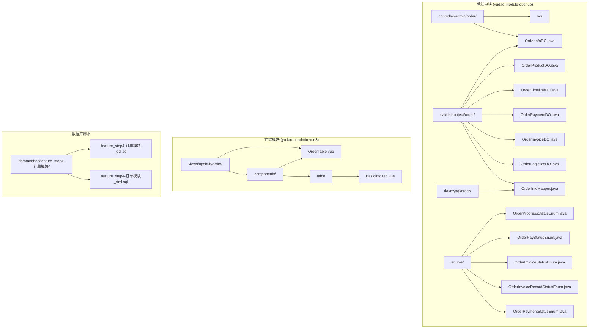
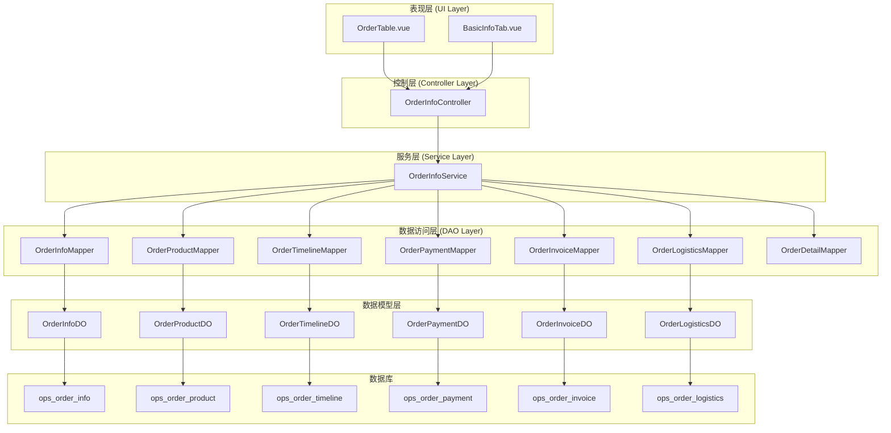
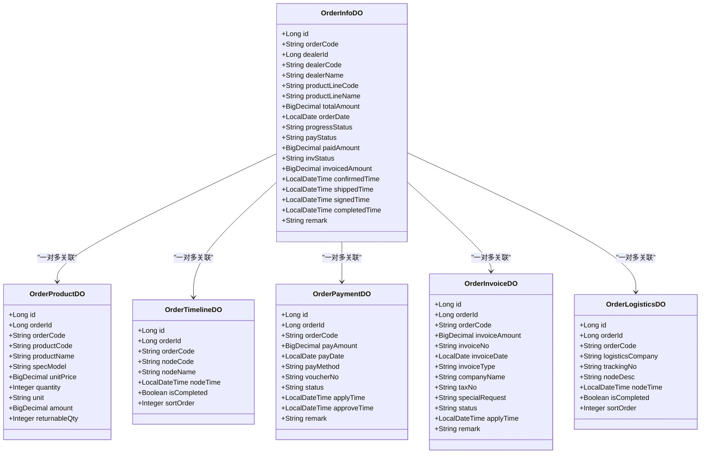
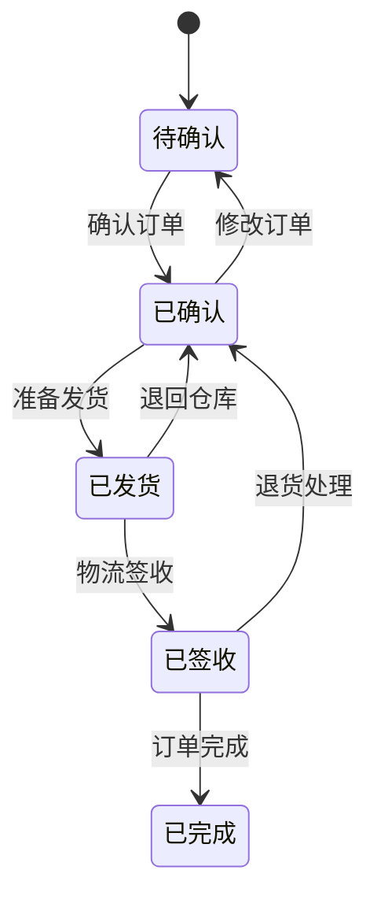
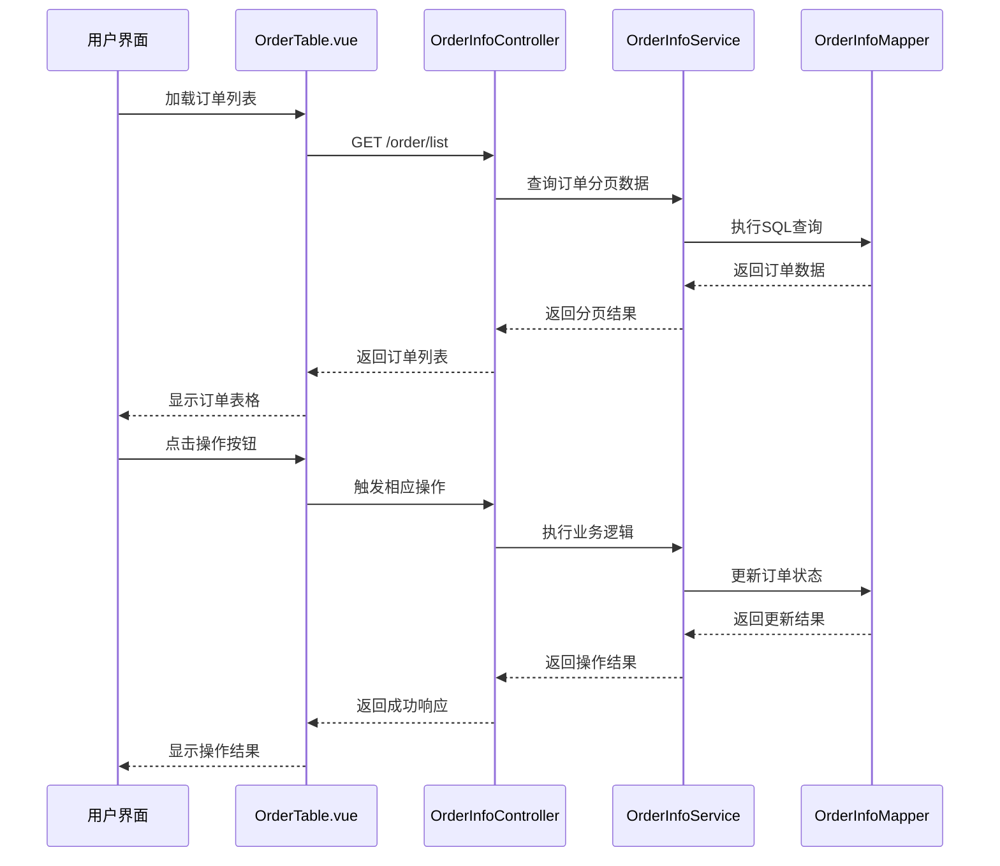
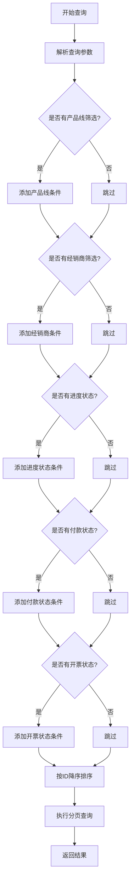
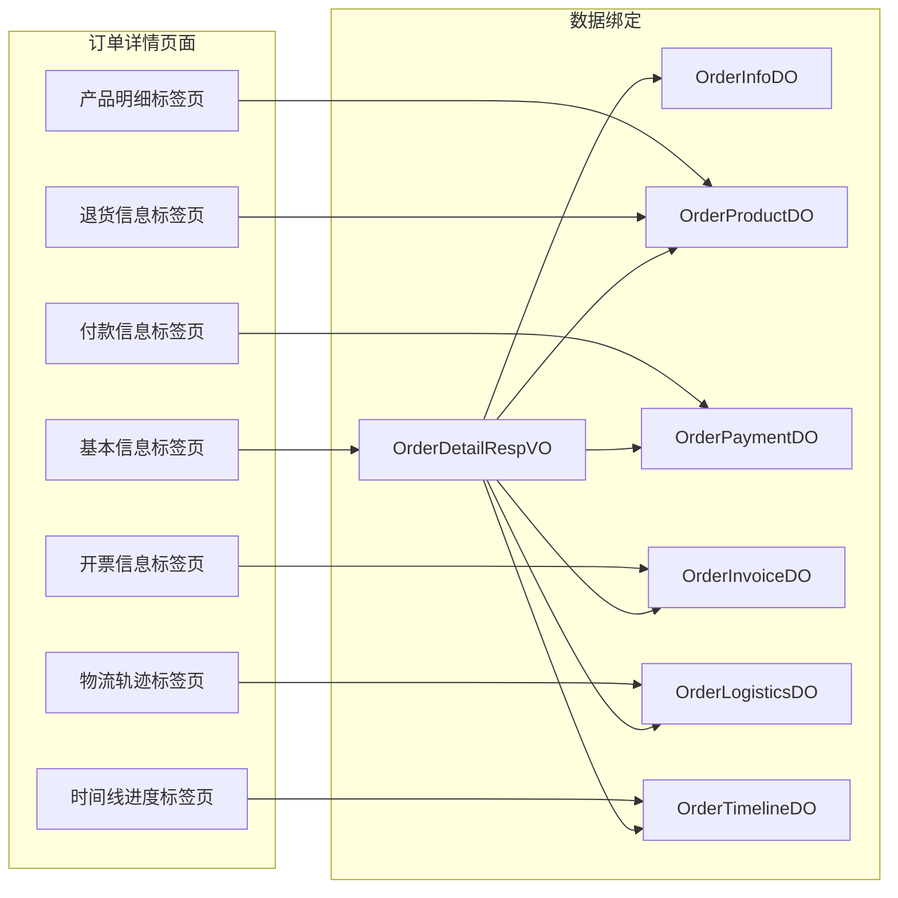
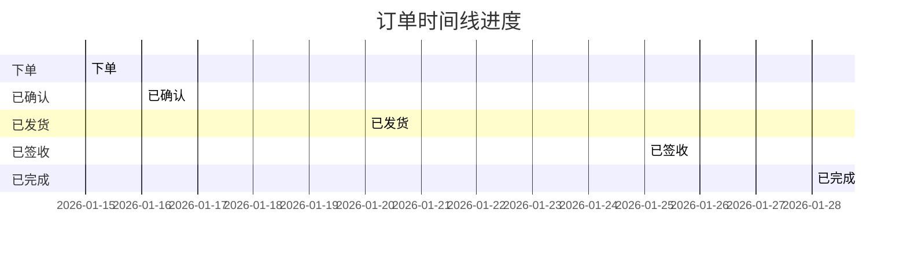
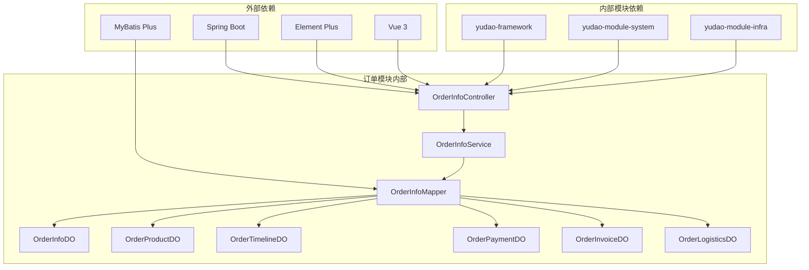

# 订单管理模块

<cite>
**本文档引用的文件**
- [OrderInfoDO.java](file://yudao-module-opshub/src/main/java/cn/iocoder/yudao/module/opshub/dal/dataobject/order/OrderInfoDO.java)
- [OrderProductDO.java](file://yudao-module-opshub/src/main/java/cn/iocoder/yudao/module/opshub/dal/dataobject/order/OrderProductDO.java)
- [OrderInvoiceDO.java](file://yudao-module-opshub/src/main/java/cn/iocoder/yudao/module/opshub/dal/dataobject/order/OrderInvoiceDO.java)
- [OrderTimelineDO.java](file://yudao-module-opshub/src/main/java/cn/iocoder/yudao/module/opshub/dal/dataobject/order/OrderTimelineDO.java)
- [OrderPaymentDO.java](file://yudao-module-opshub/src/main/java/cn/iocoder/yudao/module/opshub/dal/dataobject/order/OrderPaymentDO.java)
- [OrderLogisticsDO.java](file://yudao-module-opshub/src/main/java/cn/iocoder/yudao/module/opshub/dal/dataobject/order/OrderLogisticsDO.java)
- [OrderInfoMapper.java](file://yudao-module-opshub/src/main/java/cn/iocoder/yudao/module/opshub/dal/mysql/order/OrderInfoMapper.java)
- [OrderInfoPageReqVO.java](file://yudao-module-opshub/src/main/java/cn/iocoder/yudao/module/opshub/controller/admin/order/vo/OrderInfoPageReqVO.java)
- [OrderDetailRespVO.java](file://yudao-module-opshub/src/main/java/cn/iocoder/yudao/module/opshub/controller/admin/order/vo/OrderDetailRespVO.java)
- [OrderInfoSimpleRespVO.java](file://yudao-module-opshub/src/main/java/cn/iocoder/yudao/module/opshub/controller/admin/order/vo/OrderInfoSimpleRespVO.java)
- [OrderProgressStatusEnum.java](file://yudao-module-opshub/src/main/java/cn/iocoder/yudao/module/opshub/enums/OrderProgressStatusEnum.java)
- [OrderPayStatusEnum.java](file://yudao-module-opshub/src/main/java/cn/iocoder/yudao/module/opshub/enums/OrderPayStatusEnum.java)
- [OrderInvoiceStatusEnum.java](file://yudao-module-opshub/src/main/java/cn/iocoder/yudao/module/opshub/enums/OrderInvoiceStatusEnum.java)
- [OrderInvoiceRecordStatusEnum.java](file://yudao-module-opshub/src/main/java/cn/iocoder/yudao/module/opshub/enums/OrderInvoiceRecordStatusEnum.java)
- [OrderPaymentStatusEnum.java](file://yudao-module-opshub/src/main/java/cn/iocoder/yudao/module/opshub/enums/OrderPaymentStatusEnum.java)
- [OrderTable.vue](file://yudao-ui/yudao-ui-admin-vue3/src/views/opshub/order/components/OrderTable.vue)
- [BasicInfoTab.vue](file://yudao-ui/yudao-ui-admin-vue3/src/views/opshub/order/components/tabs/BasicInfoTab.vue)
- [feature_step4-订单模块_ddl.sql](file://db/branches/feature_step4-订单模块/feature_step4-订单模块_ddl.sql)
- [feature_step4-订单模块_dml.sql](file://db/branches/feature_step4-订单模块/feature_step4-订单模块_dml.sql)
</cite>

## 更新摘要
**所做更改**
- 新增订单时间线表和物流轨迹表的数据模型
- 新增订单付款记录和开票记录的详细数据模型
- 更新订单状态枚举和权限控制机制
- 新增订单详情响应对象，包含6个标签页的数据结构
- 更新前端订单表格组件，新增进度更新操作权限
- 新增测试数据，涵盖完整的订单生命周期场景

## 目录
1. [简介](#简介)
2. [项目结构](#项目结构)
3. [核心组件](#核心组件)
4. [架构概览](#架构概览)
5. [详细组件分析](#详细组件分析)
6. [依赖关系分析](#依赖关系分析)
7. [性能考虑](#性能考虑)
8. [故障排除指南](#故障排除指南)
9. [结论](#结论)

## 简介

订单管理模块是基于 ruoyi-vue-pro 企业级中台解决方案的核心业务模块之一，专门用于管理医疗器械行业的订单生命周期。该模块实现了完整的订单管理功能，包括订单创建、状态跟踪、付款管理、发票管理和退货处理等核心业务流程。

系统采用前后端分离架构，后端基于 Spring Boot 和 MyBatis Plus，前端使用 Vue 3 + Element Plus 技术栈。模块支持多租户隔离、数据权限控制和完整的业务状态流转管理。

**更新** 本次更新引入了订单时间线管理和物流轨迹跟踪功能，完善了订单全生命周期的可视化管理能力。

## 项目结构

订单管理模块主要分布在以下目录结构中：

**图表来源**
- [OrderInfoDO.java:1-108](file://yudao-module-opshub/src/main/java/cn/iocoder/yudao/module/opshub/dal/dataobject/order/OrderInfoDO.java#L1-L108)
- [OrderTimelineDO.java:1-56](file://yudao-module-opshub/src/main/java/cn/iocoder/yudao/module/opshub/dal/dataobject/order/OrderTimelineDO.java#L1-L56)
- [OrderTable.vue:1-189](file://yudao-ui/yudao-ui-admin-vue3/src/views/opshub/order/components/OrderTable.vue#L1-L189)

**章节来源**
- [OrderInfoDO.java:1-108](file://yudao-module-opshub/src/main/java/cn/iocoder/yudao/module/opshub/dal/dataobject/order/OrderInfoDO.java#L1-L108)
- [OrderProductDO.java:1-68](file://yudao-module-opshub/src/main/java/cn/iocoder/yudao/module/opshub/dal/dataobject/order/OrderProductDO.java#L1-L68)
- [OrderTimelineDO.java:1-56](file://yudao-module-opshub/src/main/java/cn/iocoder/yudao/module/opshub/dal/dataobject/order/OrderTimelineDO.java#L1-L56)
- [OrderInfoMapper.java:1-28](file://yudao-module-opshub/src/main/java/cn/iocoder/yudao/module/opshub/dal/mysql/order/OrderInfoMapper.java#L1-L28)

## 核心组件

### 数据模型层

订单管理模块包含七个核心数据模型：

1. **订单主表 (OrderInfoDO)**：存储订单基本信息和状态
2. **订单产品明细 (OrderProductDO)**：存储订单中的具体产品信息
3. **订单时间线 (OrderTimelineDO)**：存储订单进度节点信息
4. **订单付款记录 (OrderPaymentDO)**：存储订单付款相关信息
5. **订单开票记录 (OrderInvoiceDO)**：存储订单开票相关信息
6. **订单物流轨迹 (OrderLogisticsDO)**：存储订单物流配送信息

### 控制器层

- **OrderInfoController**：提供订单管理的 REST API 接口
- **OrderInfoPageReqVO**：订单分页查询请求参数
- **OrderDetailRespVO**：订单详情响应数据结构，包含6个标签页
- **OrderInfoSimpleRespVO**：订单列表简要信息响应

### 枚举状态管理

系统定义了完整的业务状态枚举：

- **进度状态**：pending → confirmed → shipped → signed → completed
- **付款状态**：unpaid → paid
- **开票状态**：uninvoiced → partial → invoiced
- **付款记录状态**：pending → approved → rejected
- **开票记录状态**：pending → invoiced

**更新** 新增订单时间线和物流轨迹的数据模型，完善订单全生命周期管理。

**章节来源**
- [OrderDetailRespVO.java:1-113](file://yudao-module-opshub/src/main/java/cn/iocoder/yudao/module/opshub/controller/admin/order/vo/OrderDetailRespVO.java#L1-L113)
- [OrderInfoSimpleRespVO.java:1-55](file://yudao-module-opshub/src/main/java/cn/iocoder/yudao/module/opshub/controller/admin/order/vo/OrderInfoSimpleRespVO.java#L1-L55)
- [OrderInvoiceRecordStatusEnum.java:1-35](file://yudao-module-opshub/src/main/java/cn/iocoder/yudao/module/opshub/enums/OrderInvoiceRecordStatusEnum.java#L1-L35)
- [OrderPaymentStatusEnum.java:1-36](file://yudao-module-opshub/src/main/java/cn/iocoder/yudao/module/opshub/enums/OrderPaymentStatusEnum.java#L1-L36)

## 架构概览

订单管理模块采用经典的三层架构设计：

**图表来源**
- [OrderTable.vue:113-189](file://yudao-ui/yudao-ui-admin-vue3/src/views/opshub/order/components/OrderTable.vue#L113-L189)
- [OrderInfoMapper.java:1-28](file://yudao-module-opshub/src/main/java/cn/iocoder/yudao/module/opshub/dal/mysql/order/OrderInfoMapper.java#L1-L28)

## 详细组件分析

### 订单主表数据模型

订单主表是整个订单管理的核心数据结构，包含了订单的所有关键信息：

**图表来源**
- [OrderInfoDO.java:14-108](file://yudao-module-opshub/src/main/java/cn/iocoder/yudao/module/opshub/dal/dataobject/order/OrderInfoDO.java#L14-L108)
- [OrderProductDO.java:12-68](file://yudao-module-opshub/src/main/java/cn/iocoder/yudao/module/opshub/dal/dataobject/order/OrderProductDO.java#L12-L68)
- [OrderTimelineDO.java:12-56](file://yudao-module-opshub/src/main/java/cn/iocoder/yudao/module/opshub/dal/dataobject/order/OrderTimelineDO.java#L12-L56)
- [OrderPaymentDO.java:14-72](file://yudao-module-opshub/src/main/java/cn/iocoder/yudao/module/opshub/dal/dataobject/order/OrderPaymentDO.java#L14-L72)
- [OrderInvoiceDO.java:14-80](file://yudao-module-opshub/src/main/java/cn/iocoder/yudao/module/opshub/dal/dataobject/order/OrderInvoiceDO.java#L14-L80)
- [OrderLogisticsDO.java:12-60](file://yudao-module-opshub/src/main/java/cn/iocoder/yudao/module/opshub/dal/dataobject/order/OrderLogisticsDO.java#L12-L60)

#### 订单状态流转

订单状态采用严格的业务流程控制：

**图表来源**
- [OrderProgressStatusEnum.java:11-37](file://yudao-module-opshub/src/main/java/cn/iocoder/yudao/module/opshub/enums/OrderProgressStatusEnum.java#L11-L37)

#### 前端订单表格组件

前端订单表格组件提供了完整的订单管理界面：

**图表来源**
- [OrderTable.vue:160-189](file://yudao-ui/yudao-ui-admin-vue3/src/views/opshub/order/components/OrderTable.vue#L160-L189)
- [OrderInfoMapper.java:21-28](file://yudao-module-opshub/src/main/java/cn/iocoder/yudao/module/opshub/dal/mysql/order/OrderInfoMapper.java#L21-L28)

**章节来源**
- [OrderInfoDO.java:1-108](file://yudao-module-opshub/src/main/java/cn/iocoder/yudao/module/opshub/dal/dataobject/order/OrderInfoDO.java#L1-L108)
- [OrderProductDO.java:1-68](file://yudao-module-opshub/src/main/java/cn/iocoder/yudao/module/opshub/dal/dataobject/order/OrderProductDO.java#L1-L68)
- [OrderTable.vue:1-189](file://yudao-ui/yudao-ui-admin-vue3/src/views/opshub/order/components/OrderTable.vue#L1-L189)

### 订单查询与分页

订单查询功能支持多种筛选条件和排序方式：

**图表来源**
- [OrderInfoMapper.java:21-28](file://yudao-module-opshub/src/main/java/cn/iocoder/yudao/module/opshub/dal/mysql/order/OrderInfoMapper.java#L21-L28)

**章节来源**
- [OrderInfoMapper.java:1-28](file://yudao-module-opshub/src/main/java/cn/iocoder/yudao/module/opshub/dal/mysql/order/OrderInfoMapper.java#L1-L28)
- [OrderInfoPageReqVO.java:1-45](file://yudao-module-opshub/src/main/java/cn/iocoder/yudao/module/opshub/controller/admin/order/vo/OrderInfoPageReqVO.java#L1-L45)

### 前端订单详情展示

订单详情页面采用多标签页设计，提供完整的订单信息展示：

**图表来源**
- [OrderDetailRespVO.java:12-113](file://yudao-module-opshub/src/main/java/cn/iocoder/yudao/module/opshub/controller/admin/order/vo/OrderDetailRespVO.java#L12-L113)
- [BasicInfoTab.vue:1-78](file://yudao-ui/yudao-ui-admin-vue3/src/views/opshub/order/components/tabs/BasicInfoTab.vue#L1-L78)

**章节来源**
- [OrderDetailRespVO.java:1-113](file://yudao-module-opshub/src/main/java/cn/iocoder/yudao/module/opshub/controller/admin/order/vo/OrderDetailRespVO.java#L1-L113)
- [BasicInfoTab.vue:1-78](file://yudao-ui/yudao-ui-admin-vue3/src/views/opshub/order/components/tabs/BasicInfoTab.vue#L1-L78)

### 订单时间线管理

**新增** 订单时间线功能提供了订单进度的可视化管理：

**图表来源**
- [OrderTimelineDO.java:35-53](file://yudao-module-opshub/src/main/java/cn/iocoder/yudao/module/opshub/dal/dataobject/order/OrderTimelineDO.java#L35-L53)

## 依赖关系分析

订单管理模块的依赖关系清晰明确，遵循了分层架构的设计原则：

**图表来源**
- [OrderInfoController.java](file://yudao-module-opshub/src/main/java/cn/iocoder/yudao/module/opshub/controller/admin/order/OrderInfoController.java)
- [OrderInfoService.java](file://yudao-module-opshub/src/main/java/cn/iocoder/yudao/module/opshub/service/order/OrderInfoService.java)
- [OrderInfoMapper.java:1-28](file://yudao-module-opshub/src/main/java/cn/iocoder/yudao/module/opshub/dal/mysql/order/OrderInfoMapper.java#L1-L28)

**章节来源**
- [OrderProgressStatusEnum.java:1-37](file://yudao-module-opshub/src/main/java/cn/iocoder/yudao/module/opshub/enums/OrderProgressStatusEnum.java#L1-L37)
- [OrderPayStatusEnum.java:1-34](file://yudao-module-opshub/src/main/java/cn/iocoder/yudao/module/opshub/enums/OrderPayStatusEnum.java#L1-L34)
- [OrderInvoiceStatusEnum.java:1-35](file://yudao-module-opshub/src/main/java/cn/iocoder/yudao/module/opshub/enums/OrderInvoiceStatusEnum.java#L1-L35)

## 性能考虑

### 数据库优化策略

1. **索引设计**：为常用查询字段建立合适的索引
2. **分页查询**：使用 LIMIT 和 OFFSET 实现高效分页
3. **缓存策略**：对热点数据进行缓存处理
4. **批量操作**：支持批量更新和删除操作

### 前端性能优化

1. **虚拟滚动**：大数据量表格使用虚拟滚动技术
2. **懒加载**：标签页内容按需加载
3. **防抖处理**：查询参数变更时使用防抖机制
4. **状态缓存**：本地缓存用户选择的状态

**更新** 新增订单时间线和物流轨迹的性能优化考虑，包括节点状态缓存和轨迹数据分页加载。

## 故障排除指南

### 常见问题及解决方案

1. **订单状态异常**
   - 检查状态枚举定义是否正确
   - 验证状态转换规则是否符合业务需求
   - 查看日志中是否有状态更新失败的记录

2. **查询结果不准确**
   - 确认查询参数是否正确传递
   - 检查数据库连接配置
   - 验证分页参数设置

3. **前端显示异常**
   - 检查数据格式转换是否正确
   - 验证组件属性绑定是否正确
   - 确认样式类名是否匹配

4. **订单时间线显示错误**
   - 检查时间线节点顺序是否正确
   - 验证节点完成状态标记
   - 确认时间戳格式是否一致

**更新** 新增订单时间线和物流轨迹相关的故障排除指导。

**章节来源**
- [OrderInvoiceRecordStatusEnum.java:1-35](file://yudao-module-opshub/src/main/java/cn/iocoder/yudao/module/opshub/enums/OrderInvoiceRecordStatusEnum.java#L1-L35)
- [feature_step4-订单模块_dml.sql:78-337](file://db/branches/feature_step4-订单模块/feature_step4-订单模块_dml.sql#L78-L337)

## 结论

订单管理模块是一个功能完整、架构清晰的企业级订单管理系统。模块采用了现代化的技术栈和设计模式，具有以下特点：

1. **业务完整性**：覆盖了订单管理的全流程业务需求，包括新增的时间线管理和物流轨迹跟踪
2. **技术先进性**：使用了 Spring Boot、Vue 3 等现代技术
3. **扩展性强**：模块化设计便于功能扩展和维护
4. **用户体验好**：提供了直观易用的管理界面
5. **性能优异**：通过合理的架构设计保证了系统的高性能

**更新** 本次更新显著增强了订单管理的可视化能力和全生命周期跟踪能力，为医疗器械行业的订单管理提供了更加完善的解决方案。

该模块为医疗器械行业的订单管理提供了完整的解决方案，可以有效提升企业的运营效率和管理水平。