# 运营中心模块

<cite>
**本文引用的文件**
- [DealerInfoController.java](file://yudao-module-opshub/src/main/java/cn/iocoder/yudao/module/opshub/controller/admin/dealer/DealerInfoController.java)
- [DealerInfoService.java](file://yudao-module-opshub/src/main/java/cn/iocoder/yudao/module/opshub/service/dealer/DealerInfoService.java)
- [DealerInfoDO.java](file://yudao-module-opshub/src/main/java/cn/iocoder/yudao/module/opshub/dal/dataobject/dealer/DealerInfoDO.java)
- [DealerDataPermissionRule.java](file://yudao-module-opshub/src/main/java/cn/iocoder/yudao/module/opshub/framework/datapermission/rule/DealerDataPermissionRule.java)
- [OpshubDataPermissionConfiguration.java](file://yudao-module-opshub/src/main/java/cn/iocoder/yudao/module/opshub/framework/datapermission/config/OpshubDataPermissionConfiguration.java)
- [DealerUserScopeMapper.java](file://yudao-module-opshub/src/main/java/cn/iocoder/yudao/module/opshub/dal/mysql/dealer/DealerUserScopeMapper.java)
- [ExecutorProductLineScopeMapper.java](file://yudao-module-opshub/src/main/java/cn/iocoder/yudao/module/opshub/dal/mysql/dealer/ExecutorProductLineScopeMapper.java)
- [DealerInfoServiceImpl.java](file://yudao-module-opshub/src/main/java/cn/iocoder/yudao/module/opshub/service/dealer/impl/DealerInfoServiceImpl.java)
- [DealerProductLineController.java](file://yudao-module-opshub/src/main/java/cn/iocoder/yudao/module/opshub/controller/admin/dealer/DealerProductLineController.java)
- [DealerProductLineService.java](file://yudao-module-opshub/src/main/java/cn/iocoder/yudao/module/opshub/service/dealer/DealerProductLineService.java)
- [DealerProductLineDO.java](file://yudao-module-opshub/src/main/java/cn/iocoder/yudao/module/opshub/dal/dataobject/dealer/DealerProductLineDO.java)
- [DealerProductLineMapper.java](file://yudao-module-opshub/src/main/java/cn/iocoder/yudao/module/opshub/dal/mysql/dealer/DealerProductLineMapper.java)
- [DealerUserScopeController.java](file://yudao-module-opshub/src/main/java/cn/iocoder/yudao/module/opshub/controller/admin/dealer/DealerUserScopeController.java)
- [DealerUserScopeService.java](file://yudao-module-opshub/src/main/java/cn/iocoder/yudao/module/opshub/service/dealer/DealerUserScopeService.java)
- [DealerUserScopeDO.java](file://yudao-module-opshub/src/main/java/cn/iocoder/yudao/module/opshub/dal/dataobject/dealer/DealerUserScopeDO.java)
- [ExecutorProductLineScopeController.java](file://yudao-module-opshub/src/main/java/cn/iocoder/yudao/module/opshub/controller/admin/dealer/ExecutorProductLineScopeController.java)
- [ExecutorProductLineScopeService.java](file://yudao-module-opshub/src/main/java/cn/iocoder/yudao/module/opshub/service/dealer/ExecutorProductLineScopeService.java)
- [ExecutorProductLineScopeDO.java](file://yudao-module-opshub/src/main/java/cn/iocoder/yudao/module/opshub/dal/dataobject/dealer/ExecutorProductLineScopeDO.java)
- [SecurityConfiguration.java](file://yudao-module-opshub/src/main/java/cn/iocoder/yudao/module/opshub/framework/security/config/SecurityConfiguration.java)
- [ErrorCodeConstants.java](file://yudao-module-opshub/src/main/java/cn/iocoder/yudao/module/opshub/enums/ErrorCodeConstants.java)
- [OpsRoleCodeConstants.java](file://yudao-module-opshub/src/main/java/cn/iocoder/yudao/module/opshub/enums/OpsRoleCodeConstants.java)
- [OrderInfoController.java](file://yudao-module-opshub/src/main/java/cn/iocoder/yudao/module/opshub/controller/admin/order/OrderInfoController.java)
- [OrderInfoService.java](file://yudao-module-opshub/src/main/java/cn/iocoder/yudao/module/opshub/service/order/OrderInfoService.java)
- [OrderInfoDO.java](file://yudao-module-opshub/src/main/java/cn/iocoder/yudao/module/opshub/dal/dataobject/order/OrderInfoDO.java)
- [OrderInvoiceDO.java](file://yudao-module-opshub/src/main/java/cn/iocoder/yudao/module/opshub/dal/dataobject/order/OrderInvoiceDO.java)
- [OrderLogisticsDO.java](file://yudao-module-opshub/src/main/java/cn/iocoder/yudao/module/opshub/dal/dataobject/order/OrderLogisticsDO.java)
- [OrderPaymentDO.java](file://yudao-module-opshub/src/main/java/cn/iocoder/yudao/module/opshub/dal/dataobject/order/OrderPaymentDO.java)
- [OrderProductDO.java](file://yudao-module-opshub/src/main/java/cn/iocoder/yudao/module/opshub/dal/dataobject/order/OrderProductDO.java)
- [OrderTimelineDO.java](file://yudao-module-opshub/src/main/java/cn/iocoder/yudao/module/opshub/dal/dataobject/order/OrderTimelineDO.java)
- [OrderInfoMapper.java](file://yudao-module-opshub/src/main/java/cn/iocoder/yudao/module/opshub/dal/mysql/order/OrderInfoMapper.java)
- [OrderInvoiceMapper.java](file://yudao-module-opshub/src/main/java/cn/iocoder/yudao/module/opshub/dal/mysql/order/OrderInvoiceMapper.java)
- [OrderLogisticsMapper.java](file://yudao-module-opshub/src/main/java/cn/iocoder/yudao/module/opshub/dal/mysql/order/OrderLogisticsMapper.java)
- [OrderPaymentMapper.java](file://yudao-module-opshub/src/main/java/cn/iocoder/yudao/module/opshub/dal/mysql/order/OrderPaymentMapper.java)
- [OrderProductMapper.java](file://yudao-module-opshub/src/main/java/cn/iocoder/yudao/module/opshub/dal/mysql/order/OrderProductMapper.java)
- [OrderTimelineMapper.java](file://yudao-module-opshub/src/main/java/cn/iocoder/yudao/module/opshub/dal/mysql/order/OrderTimelineMapper.java)
- [AfterSaleInfoController.java](file://yudao-module-opshub/src/main/java/cn/iocoder/yudao/module/opshub/controller/admin/aftersale/AfterSaleInfoController.java)
- [AfterSaleInfoService.java](file://yudao-module-opshub/src/main/java/cn/iocoder/yudao/module/opshub/service/aftersale/AfterSaleInfoService.java)
- [CsTaskController.java](file://yudao-module-opshub/src/main/java/cn/iocoder/yudao/module/opshub/controller/admin/cs/CsTaskController.java)
- [CsTaskService.java](file://yudao-module-opshub/src/main/java/cn/iocoder/yudao/module/opshub/service/cs/CsTaskService.java)
- [BasedataFileController.java](file://yudao-module-opshub/src/main/java/cn/iocoder/yudao/module/opshub/controller/admin/basedata/BasedataFileController.java)
- [BasedataFileService.java](file://yudao-module-opshub/src/main/java/cn/iocoder/yudao/module/opshub/service/basedata/BasedataFileService.java)
- [SigningContractController.java](file://yudao-module-opshub/src/main/java/cn/iocoder/yudao/module/opshub/controller/admin/signing/SigningContractController.java)
- [SigningContractService.java](file://yudao-module-opshub/src/main/java/cn/iocoder/yudao/module/opshub/service/signing/SigningContractService.java)
- [opshub-step1.sql](file://sql/postgresql/opshub-step1.sql)
- [index.vue](file://yudao-ui/yudao-ui-admin-vue3/src/views/opshub/scope/index.vue)
- [index.vue](file://yudao-ui/yudao-ui-admin-vue3/src/views/system/user/index.vue)
- [index.vue](file://yudao-ui/yudao-ui-admin-vue3/src/views/opshub/customerservice/index.vue)
- [ConsultTab.vue](file://yudao-ui/yudao-ui-admin-vue3/src/views/opshub/customerservice/components/ConsultTab.vue)
- [CsWebSocketService.java](file://yudao-module-opshub/src/main/java/cn/iocoder/yudao/module/opshub/service/cs/websocket/CsWebSocketService.java)
- [PRD-用户权限设计.md](file://docs/PRD-用户权限设计.md)
- [PRD-Step7-电商客服系统.md](file://docs/PRD-Step7-电商客服系统.md)
- [dealerScope/index.ts](file://yudao-ui/yudao-ui-admin-vue3/src/api/opshub/dealerScope/index.ts)
- [DealerUserScopeService.java](file://yudao-module-opshub/src/main/java/cn/iocoder/yudao/module/opshub/service/dealer/DealerUserScopeService.java)
- [ExecutorProductLineScopeService.java](file://yudao-module-opshub/src/main/java/cn/iocoder/yudao/module/opshub/service/dealer/ExecutorProductLineScopeService.java)
</cite>

## 更新摘要
**所做更改**
- 新增授权管理系统重大升级：从表单界面转变为表格驱动系统
- 新增抽屉式编辑功能和批量用户授权管理
- 更新用户管理系统增强支持角色代码过滤的功能说明
- 扩展客户服务模块的咨询队列和聊天窗口功能
- 完善电商客服系统的数据权限控制机制

## 目录
1. [简介](#简介)
2. [项目结构](#项目结构)
3. [核心组件](#核心组件)
4. [架构总览](#架构总览)
5. [详细组件分析](#详细组件分析)
6. [依赖分析](#依赖分析)
7. [性能考虑](#性能考虑)
8. [故障排查指南](#故障排查指南)
9. [结论](#结论)
10. [附录](#附录)

## 简介
本文件面向运营中心模块，系统化阐述经销商管理、产品线管理、用户范围控制、售后管理、客户服务以及新增的订单管理功能的业务与技术实现，重点覆盖：
- 经销商信息维护：新增、编辑、删除、查询与分页展示
- 产品线管理：产品线定义、绑定与范围控制
- 用户范围控制：基于角色的经销商/产品线维度访问控制
- 售后管理：售后服务申请、处理流程、状态跟踪与统计分析
- 客户服务：工单创建、分配、转交、处理与实时通信，支持咨询队列和聊天窗口
- 订单管理：订单信息维护、支付管理、发票管理、物流跟踪与订单状态管理
- 基础数据管理：字典配置、文件管理与数据标准化
- 签约管理：合同创建、审批、统计与趋势分析
- 数据权限控制机制：基于租户与角色的多维数据隔离
- 业务流程：数据录入、审核与发布（以产品线绑定为例）
- 多租户架构：租户隔离与数据共享策略
- SaaS平台服务能力：完整的云服务解决方案
- 配置示例、流程图与集成指南
- 数据迁移、备份恢复与性能监控最佳实践

## 项目结构
运营中心模块位于 yudao-module-opshub，采用"控制器-服务-持久层-数据对象-枚举-权限配置"的分层组织方式，围绕"经销商""产品线""用户范围""订单""售后""客服""基础数据""签约"八大领域展开。

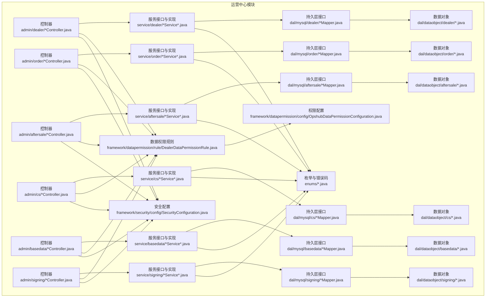

**图表来源**
- [DealerInfoController.java:1-81](file://yudao-module-opshub/src/main/java/cn/iocoder/yudao/module/opshub/controller/admin/dealer/DealerInfoController.java#L1-L81)
- [OrderInfoController.java:1-81](file://yudao-module-opshub/src/main/java/cn/iocoder/yudao/module/opshub/controller/admin/order/OrderInfoController.java#L1-L81)
- [AfterSaleInfoController.java](file://yudao-module-opshub/src/main/java/cn/iocoder/yudao/module/opshub/controller/admin/aftersale/AfterSaleInfoController.java)
- [CsTaskController.java](file://yudao-module-opshub/src/main/java/cn/iocoder/yudao/module/opshub/controller/admin/cs/CsTaskController.java)
- [BasedataFileController.java](file://yudao-module-opshub/src/main/java/cn/iocoder/yudao/module/opshub/controller/admin/basedata/BasedataFileController.java)
- [SigningContractController.java](file://yudao-module-opshub/src/main/java/cn/iocoder/yudao/module/opshub/controller/admin/signing/SigningContractController.java)

**章节来源**
- [DealerInfoController.java:1-81](file://yudao-module-opshub/src/main/java/cn/iocoder/yudao/module/opshub/controller/admin/dealer/DealerInfoController.java#L1-L81)
- [OrderInfoController.java:1-81](file://yudao-module-opshub/src/main/java/cn/iocoder/yudao/module/opshub/controller/admin/order/OrderInfoController.java#L1-L81)
- [AfterSaleInfoController.java](file://yudao-module-opshub/src/main/java/cn/iocoder/yudao/module/opshub/controller/admin/aftersale/AfterSaleInfoController.java)
- [CsTaskController.java](file://yudao-module-opshub/src/main/java/cn/iocoder/yudao/module/opshub/controller/admin/cs/CsTaskController.java)
- [BasedataFileController.java](file://yudao-module-opshub/src/main/java/cn/iocoder/yudao/module/opshub/controller/admin/basedata/BasedataFileController.java)
- [SigningContractController.java](file://yudao-module-opshub/src/main/java/cn/iocoder/yudao/module/opshub/controller/admin/signing/SigningContractController.java)

## 核心组件
- 经销商管理
  - 控制器：提供新增、修改、删除、单查、分页、精简列表等接口
  - 服务：封装业务逻辑，负责参数校验与调用持久层
  - 数据对象：映射 ops_dealer_info 表，继承租户基类
- 产品线管理
  - 控制器：提供产品线的增删改查与分页接口
  - 服务：封装产品线业务
  - 数据对象：映射产品线相关表
- 用户范围控制
  - 经销商用户范围：记录用户可访问的经销商集合
  - 执行者产品线范围：记录执行者可访问的产品线集合
  - **更新** 授权管理界面重构：采用表格化显示，支持服务单执行员和经销商两个Tab的授权管理
  - **新增** 抽屉式编辑功能：提供新增、编辑、删除、清空等完整的授权操作
  - **新增** 批量用户授权管理：支持批量授权和范围分配
- 订单管理
  - 订单信息管理：订单基本信息、状态管理、进度跟踪
  - 订单支付管理：支付状态、支付记录管理
  - 订单发票管理：发票状态、发票信息管理
  - 订单物流管理：物流状态、配送信息跟踪
  - 订单产品管理：订单商品明细、数量规格管理
  - 订单时间轴：订单各环节的时间节点记录
- 售后管理
  - 售后申请管理：客户售后申请、审核与处理
  - 售后流程管理：售后处理流程、状态跟踪与节点管理
  - 售后统计分析：售后数据统计、趋势分析与报表生成
  - 售后原因分类：售后原因归类、处理方法配置
- 客户服务
  - 工单管理：工单创建、分配、转交、处理与关闭
  - 实时通信：WebSocket连接、消息推送、状态通知
  - 服务监听：工单状态变化监听、自动化处理
  - 服务等级：紧急程度分级、优先级管理
  - **新增** 咨询队列：支持按状态、类型、来源模块筛选的咨询列表
  - **新增** 聊天窗口：集成CsChatWindow组件，支持文本、附件、链接等多种消息类型
- 基础数据管理
  - 文件管理：基础数据文件上传、下载、版本管理
  - 数据字典：系统字典维护、数据标准化
  - 配置管理：系统配置、参数管理
- 签约管理
  - 合同管理：合同创建、编辑、删除、查询与分页
  - 状态管理：合同状态跟踪、审批流程
  - 统计分析：签约数据统计、趋势分析
- 数据权限规则
  - 基于角色的经销商/产品线维度过滤
  - 支持超级管理员全量可见
  - **新增** 电商客服系统数据权限：注册ops_cs_session到DealerDataPermissionRule
- 安全与权限
  - 基于注解的权限校验
  - 角色常量与错误码
  - **新增** 用户管理系统增强：支持角色代码过滤

**章节来源**
- [DealerInfoController.java:1-81](file://yudao-module-opshub/src/main/java/cn/iocoder/yudao/module/opshub/controller/admin/dealer/DealerInfoController.java#L1-L81)
- [DealerInfoService.java:1-33](file://yudao-module-opshub/src/main/java/cn/iocoder/yudao/module/opshub/service/dealer/DealerInfoService.java#L1-L33)
- [DealerInfoDO.java:1-54](file://yudao-module-opshub/src/main/java/cn/iocoder/yudao/module/opshub/dal/dataobject/dealer/DealerInfoDO.java#L1-L54)
- [DealerProductLineController.java](file://yudao-module-opshub/src/main/java/cn/iocoder/yudao/module/opshub/controller/admin/dealer/DealerProductLineController.java)
- [DealerProductLineService.java](file://yudao-module-opshub/src/main/java/cn/iocoder/yudao/module/opshub/service/dealer/DealerProductLineService.java)
- [DealerProductLineDO.java](file://yudao-module-opshub/src/main/java/cn/iocoder/yudao/module/opshub/dal/dataobject/dealer/DealerProductLineDO.java)
- [DealerUserScopeController.java](file://yudao-module-opshub/src/main/java/cn/iocoder/yudao/module/opshub/controller/admin/dealer/DealerUserScopeController.java)
- [DealerUserScopeService.java](file://yudao-module-opshub/src/main/java/cn/iocoder/yudao/module/opshub/service/dealer/DealerUserScopeService.java)
- [DealerUserScopeDO.java](file://yudao-module-opshub/src/main/java/cn/iocoder/yudao/module/opshub/dal/dataobject/dealer/DealerUserScopeDO.java)
- [ExecutorProductLineScopeController.java](file://yudao-module-opshub/src/main/java/cn/iocoder/yudao/module/opshub/controller/admin/dealer/ExecutorProductLineScopeController.java)
- [ExecutorProductLineScopeService.java](file://yudao-module-opshub/src/main/java/cn/iocoder/yudao/module/opshub/service/dealer/ExecutorProductLineScopeService.java)
- [ExecutorProductLineScopeDO.java](file://yudao-module-opshub/src/main/java/cn/iocoder/yudao/module/opshub/dal/dataobject/dealer/ExecutorProductLineScopeDO.java)
- [OrderInfoController.java:1-81](file://yudao-module-opshub/src/main/java/cn/iocoder/yudao/module/opshub/controller/admin/order/OrderInfoController.java#L1-L81)
- [OrderInfoService.java:1-33](file://yudao-module-opshub/src/main/java/cn/iocoder/yudao/module/opshub/service/order/OrderInfoService.java#L1-L33)
- [OrderInfoDO.java:1-54](file://yudao-module-opshub/src/main/java/cn/iocoder/yudao/module/opshub/dal/dataobject/order/OrderInfoDO.java#L1-L54)
- [AfterSaleInfoController.java](file://yudao-module-opshub/src/main/java/cn/iocoder/yudao/module/opshub/controller/admin/aftersale/AfterSaleInfoController.java)
- [AfterSaleInfoService.java](file://yudao-module-opshub/src/main/java/cn/iocoder/yudao/module/opshub/service/aftersale/AfterSaleInfoService.java)
- [CsTaskController.java](file://yudao-module-opshub/src/main/java/cn/iocoder/yudao/module/opshub/controller/admin/cs/CsTaskController.java)
- [CsTaskService.java](file://yudao-module-opshub/src/main/java/cn/iocoder/yudao/module/opshub/service/cs/CsTaskService.java)
- [BasedataFileController.java](file://yudao-module-opshub/src/main/java/cn/iocoder/yudao/module/opshub/controller/admin/basedata/BasedataFileController.java)
- [BasedataFileService.java](file://yudao-module-opshub/src/main/java/cn/iocoder/yudao/module/opshub/service/basedata/BasedataFileService.java)
- [SigningContractController.java](file://yudao-module-opshub/src/main/java/cn/iocoder/yudao/module/opshub/controller/admin/signing/SigningContractController.java)
- [SigningContractService.java](file://yudao-module-opshub/src/main/java/cn/iocoder/yudao/module/opshub/service/signing/SigningContractService.java)

## 架构总览
运营中心模块遵循标准分层架构，前端通过控制器暴露 REST 接口，服务层编排业务，持久层访问数据库；数据权限规则在 SQL 查询阶段自动注入 WHERE 条件，确保按角色维度进行数据隔离。新增的售后管理、客户服务、基础数据和签约管理模块与现有模块保持一致的架构风格，共同构成完整的SaaS平台运营管理体系。

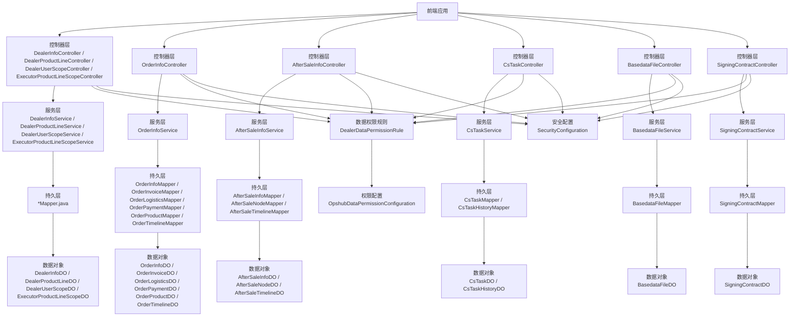

**图表来源**
- [DealerInfoController.java:1-81](file://yudao-module-opshub/src/main/java/cn/iocoder/yudao/module/opshub/controller/admin/dealer/DealerInfoController.java#L1-L81)
- [OrderInfoController.java:1-81](file://yudao-module-opshub/src/main/java/cn/iocoder/yudao/module/opshub/controller/admin/order/OrderInfoController.java#L1-L81)
- [AfterSaleInfoController.java](file://yudao-module-opshub/src/main/java/cn/iocoder/yudao/module/opshub/controller/admin/aftersale/AfterSaleInfoController.java)
- [CsTaskController.java](file://yudao-module-opshub/src/main/java/cn/iocoder/yudao/module/opshub/controller/admin/cs/CsTaskController.java)
- [BasedataFileController.java](file://yudao-module-opshub/src/main/java/cn/iocoder/yudao/module/opshub/controller/admin/basedata/BasedataFileController.java)
- [SigningContractController.java](file://yudao-module-opshub/src/main/java/cn/iocoder/yudao/module/opshub/controller/admin/signing/SigningContractController.java)
- [DealerDataPermissionRule.java:1-246](file://yudao-module-opshub/src/main/java/cn/iocoder/yudao/module/opshub/framework/datapermission/rule/DealerDataPermissionRule.java#L1-L246)
- [OpshubDataPermissionConfiguration.java](file://yudao-module-opshub/src/main/java/cn/iocoder/yudao/module/opshub/framework/datapermission/config/OpshubDataPermissionConfiguration.java)
- [SecurityConfiguration.java](file://yudao-module-opshub/src/main/java/cn/iocoder/yudao/module/opshub/framework/security/config/SecurityConfiguration.java)

## 详细组件分析

### 经销商信息管理
- 功能职责
  - 新增/修改/删除/查询/分页/精简列表
  - 基于租户隔离的经销商数据存储
- 关键实现
  - 控制器：声明权限注解，调用服务层完成业务
  - 服务接口：定义 CRUD 与分页能力
  - 数据对象：映射 ops_dealer_info 表，包含基础字段与状态
- 数据模型

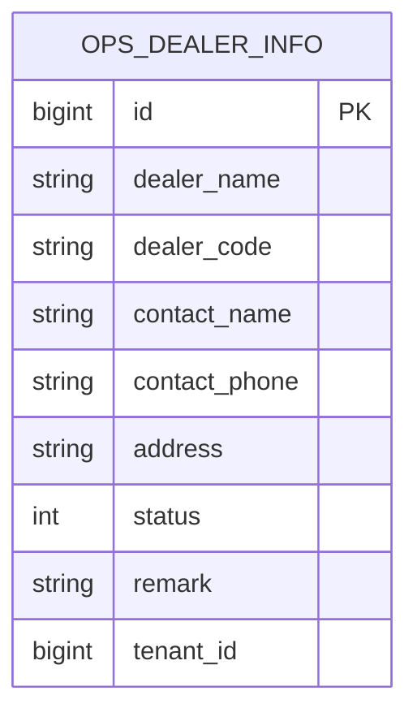

**图表来源**
- [DealerInfoDO.java:1-54](file://yudao-module-opshub/src/main/java/cn/iocoder/yudao/module/opshub/dal/dataobject/dealer/DealerInfoDO.java#L1-L54)

**章节来源**
- [DealerInfoController.java:1-81](file://yudao-module-opshub/src/main/java/cn/iocoder/yudao/module/opshub/controller/admin/dealer/DealerInfoController.java#L1-L81)
- [DealerInfoService.java:1-33](file://yudao-module-opshub/src/main/java/cn/iocoder/yudao/module/opshub/service/dealer/DealerInfoService.java#L1-L33)
- [DealerInfoDO.java:1-54](file://yudao-module-opshub/src/main/java/cn/iocoder/yudao/module/opshub/dal/dataobject/dealer/DealerInfoDO.java#L1-L54)

### 产品线管理
- 功能职责
  - 产品线的新增、修改、删除、查询与分页
  - 与经销商建立绑定关系，支持按产品线维度进行数据访问控制
- 关键实现
  - 控制器：提供 REST 接口
  - 服务：封装产品线业务逻辑
  - 数据对象：映射产品线相关表
- 数据模型

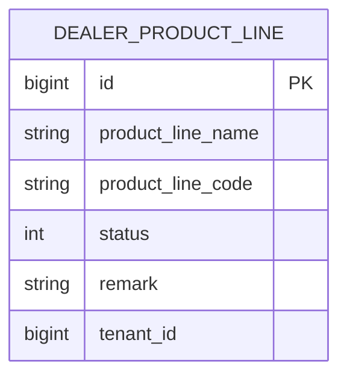

**图表来源**
- [DealerProductLineDO.java](file://yudao-module-opshub/src/main/java/cn/iocoder/yudao/module/opshub/dal/dataobject/dealer/DealerProductLineDO.java)

**章节来源**
- [DealerProductLineController.java](file://yudao-module-opshub/src/main/java/cn/iocoder/yudao/module/opshub/controller/admin/dealer/DealerProductLineController.java)
- [DealerProductLineService.java](file://yudao-module-opshub/src/main/java/cn/iocoder/yudao/module/opshub/service/dealer/DealerProductLineService.java)
- [DealerProductLineDO.java](file://yudao-module-opshub/src/main/java/cn/iocoder/yudao/module/opshub/dal/dataobject/dealer/DealerProductLineDO.java)

### 用户范围控制
- 经销商用户范围
  - 记录用户可访问的经销商集合，用于经销商维度的数据权限过滤
- 执行者产品线范围
  - 记录执行者可访问的产品线集合，用于产品线维度的数据权限过滤
- **更新** 授权管理界面重构
  - 采用表格化显示，支持服务单执行员和经销商两个Tab的授权管理
  - 提供新增、编辑、删除、清空等完整的授权操作
  - 集成用户选择器和产品线/经销商选择器
  - **新增** 抽屉式编辑功能：提供直观的授权编辑体验
  - **新增** 批量用户授权管理：支持批量授权和范围分配
- 关键实现
  - 控制器：提供范围分配与查询接口
  - 服务：封装范围分配与查询逻辑
  - 数据对象：映射范围表
  - **新增** 前端授权管理界面：基于Element Plus的表格化UI设计
  - **新增** API接口：提供授权管理的RESTful API
- 数据模型

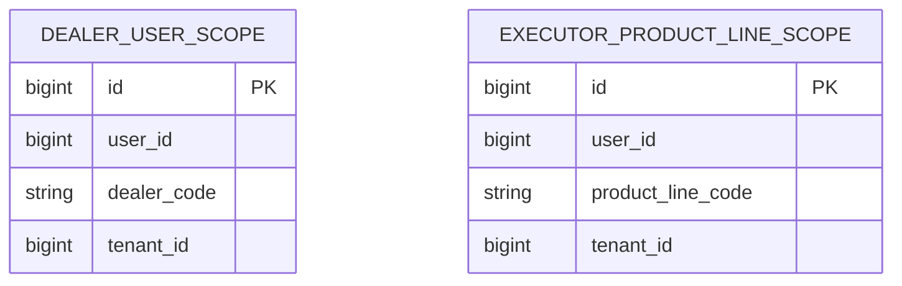

**图表来源**
- [DealerUserScopeDO.java](file://yudao-module-opshub/src/main/java/cn/iocoder/yudao/module/opshub/dal/dataobject/dealer/DealerUserScopeDO.java)
- [ExecutorProductLineScopeDO.java](file://yudao-module-opshub/src/main/java/cn/iocoder/yudao/module/opshub/dal/dataobject/dealer/ExecutorProductLineScopeDO.java)

**章节来源**
- [DealerUserScopeController.java](file://yudao-module-opshub/src/main/java/cn/iocoder/yudao/module/opshub/controller/admin/dealer/DealerUserScopeController.java)
- [DealerUserScopeService.java](file://yudao-module-opshub/src/main/java/cn/iocoder/yudao/module/opshub/service/dealer/DealerUserScopeService.java)
- [DealerUserScopeDO.java](file://yudao-module-opshub/src/main/java/cn/iocoder/yudao/module/opshub/dal/dataobject/dealer/DealerUserScopeDO.java)
- [ExecutorProductLineScopeController.java](file://yudao-module-opshub/src/main/java/cn/iocoder/yudao/module/opshub/controller/admin/dealer/ExecutorProductLineScopeController.java)
- [ExecutorProductLineScopeService.java](file://yudao-module-opshub/src/main/java/cn/iocoder/yudao/module/opshub/service/dealer/ExecutorProductLineScopeService.java)
- [ExecutorProductLineScopeDO.java](file://yudao-module-opshub/src/main/java/cn/iocoder/yudao/module/opshub/dal/dataobject/dealer/ExecutorProductLineScopeDO.java)
- [index.vue](file://yudao-ui/yudao-ui-admin-vue3/src/views/opshub/scope/index.vue)
- [dealerScope/index.ts](file://yudao-ui/yudao-ui-admin-vue3/src/api/opshub/dealerScope/index.ts)

### 订单管理
- 功能职责
  - 订单信息维护：订单基本信息、状态管理、进度跟踪
  - 订单支付管理：支付状态、支付记录管理
  - 订单发票管理：发票状态、发票信息管理
  - 订单物流管理：物流状态、配送信息跟踪
  - 订单产品管理：订单商品明细、数量规格管理
  - 订单时间轴：订单各环节的时间节点记录
- 关键实现
  - 控制器：提供订单相关的 REST 接口
  - 服务：封装订单业务逻辑，协调多个子模块
  - 持久层：管理订单相关表的 CRUD 操作
  - 数据对象：映射订单主表及各个子表
- 数据模型

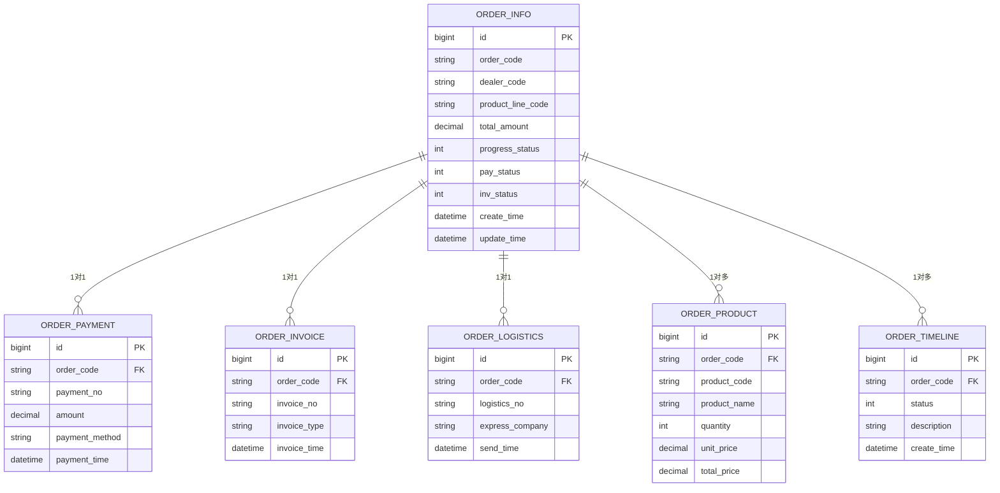

**图表来源**
- [OrderInfoDO.java](file://yudao-module-opshub/src/main/java/cn/iocoder/yudao/module/opshub/dal/dataobject/order/OrderInfoDO.java)
- [OrderPaymentDO.java](file://yudao-module-opshub/src/main/java/cn/iocoder/yudao/module/opshub/dal/dataobject/order/OrderPaymentDO.java)
- [OrderInvoiceDO.java](file://yudao-module-opshub/src/main/java/cn/iocoder/yudao/module/opshub/dal/dataobject/order/OrderInvoiceDO.java)
- [OrderLogisticsDO.java](file://yudao-module-opshub/src/main/java/cn/iocoder/yudao/module/opshub/dal/dataobject/order/OrderLogisticsDO.java)
- [OrderProductDO.java](file://yudao-module-opshub/src/main/java/cn/iocoder/yudao/module/opshub/dal/dataobject/order/OrderProductDO.java)
- [OrderTimelineDO.java](file://yudao-module-opshub/src/main/java/cn/iocoder/yudao/module/opshub/dal/dataobject/order/OrderTimelineDO.java)

**章节来源**
- [OrderInfoController.java:1-81](file://yudao-module-opshub/src/main/java/cn/iocoder/yudao/module/opshub/controller/admin/order/OrderInfoController.java#L1-L81)
- [OrderInfoService.java:1-33](file://yudao-module-opshub/src/main/java/cn/iocoder/yudao/module/opshub/service/order/OrderInfoService.java#L1-L33)
- [OrderInfoDO.java:1-54](file://yudao-module-opshub/src/main/java/cn/iocoder/yudao/module/opshub/dal/dataobject/order/OrderInfoDO.java#L1-L54)
- [OrderInvoiceDO.java](file://yudao-module-opshub/src/main/java/cn/iocoder/yudao/module/opshub/dal/dataobject/order/OrderInvoiceDO.java)
- [OrderLogisticsDO.java](file://yudao-module-opshub/src/main/java/cn/iocoder/yudao/module/opshub/dal/dataobject/order/OrderLogisticsDO.java)
- [OrderPaymentDO.java](file://yudao-module-opshub/src/main/java/cn/iocoder/yudao/module/opshub/dal/dataobject/order/OrderPaymentDO.java)
- [OrderProductDO.java](file://yudao-module-opshub/src/main/java/cn/iocoder/yudao/module/opshub/dal/dataobject/order/OrderProductDO.java)
- [OrderTimelineDO.java](file://yudao-module-opshub/src/main/java/cn/iocoder/yudao/module/opshub/dal/dataobject/order/OrderTimelineDO.java)

### 售后管理
- 功能职责
  - 售后申请管理：客户售后申请、审核与处理
  - 售后流程管理：售后处理流程、状态跟踪与节点管理
  - 售后统计分析：售后数据统计、趋势分析与报表生成
  - 售后原因分类：售后原因归类、处理方法配置
- 关键实现
  - 控制器：提供售后相关的 REST 接口
  - 服务：封装售后业务逻辑，协调处理流程
  - 持久层：管理售后相关信息的 CRUD 操作
  - 数据对象：映射售后主表及各个子表
- 数据模型

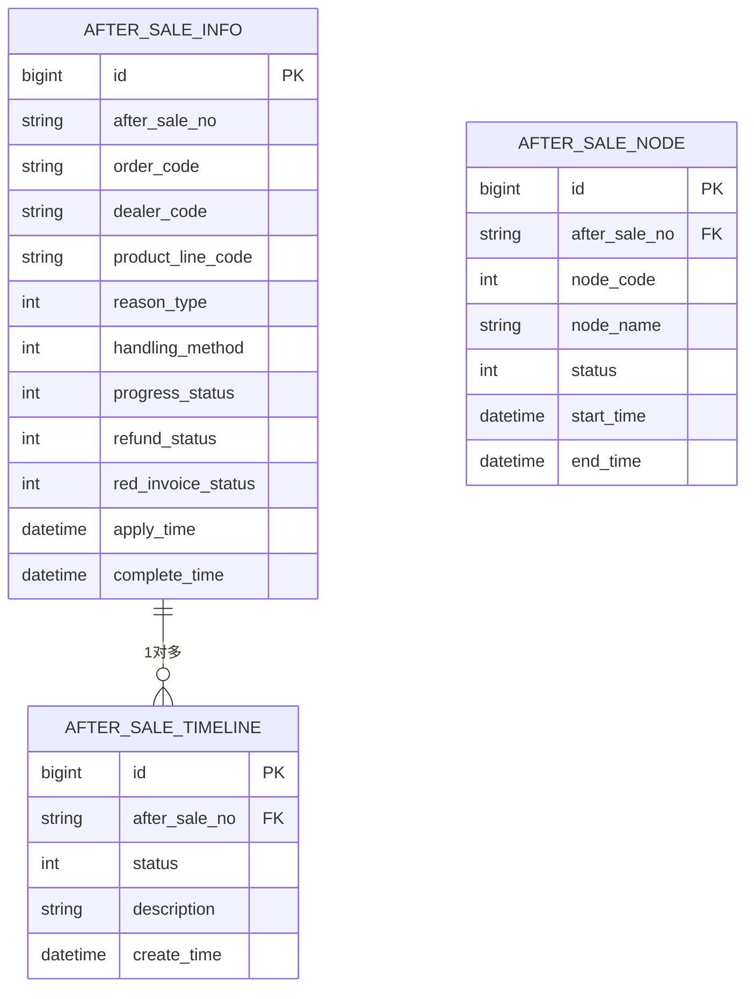

**图表来源**
- [AfterSaleInfoController.java](file://yudao-module-opshub/src/main/java/cn/iocoder/yudao/module/opshub/controller/admin/aftersale/AfterSaleInfoController.java)
- [AfterSaleInfoService.java](file://yudao-module-opshub/src/main/java/cn/iocoder/yudao/module/opshub/service/aftersale/AfterSaleInfoService.java)

**章节来源**
- [AfterSaleInfoController.java](file://yudao-module-opshub/src/main/java/cn/iocoder/yudao/module/opshub/controller/admin/aftersale/AfterSaleInfoController.java)
- [AfterSaleInfoService.java](file://yudao-module-opshub/src/main/java/cn/iocoder/yudao/module/opshub/service/aftersale/AfterSaleInfoService.java)

### 客户服务
- 功能职责
  - 工单管理：工单创建、分配、转交、处理与关闭
  - 实时通信：WebSocket连接、消息推送、状态通知
  - 服务监听：工单状态变化监听、自动化处理
  - 服务等级：紧急程度分级、优先级管理
  - **新增** 咨询队列：支持按状态、类型、来源模块筛选的咨询列表
  - **新增** 聊天窗口：集成CsChatWindow组件，支持文本、附件、链接等多种消息类型
- 关键实现
  - 控制器：提供客服工单相关的 REST 接口
  - 服务：封装客服业务逻辑，支持实时通信
  - 持久层：管理客服工单及相关历史记录
  - 数据对象：映射客服工单主表及历史表
  - **新增** 前端客户服务界面：包含工单管理、操作请求、咨询队列三个Tab
- 数据模型

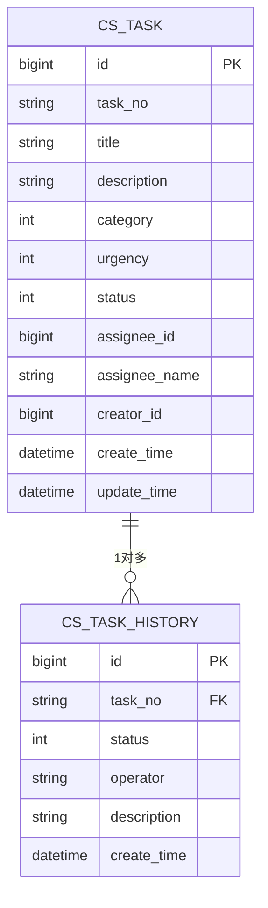

**图表来源**
- [CsTaskController.java](file://yudao-module-opshub/src/main/java/cn/iocoder/yudao/module/opshub/controller/admin/cs/CsTaskController.java)
- [CsTaskService.java](file://yudao-module-opshub/src/main/java/cn/iocoder/yudao/module/opshub/service/cs/CsTaskService.java)

**章节来源**
- [CsTaskController.java](file://yudao-module-opshub/src/main/java/cn/iocoder/yudao/module/opshub/controller/admin/cs/CsTaskController.java)
- [CsTaskService.java](file://yudao-module-opshub/src/main/java/cn/iocoder/yudao/module/opshub/service/cs/CsTaskService.java)
- [index.vue](file://yudao-ui/yudao-ui-admin-vue3/src/views/opshub/customerservice/index.vue)
- [ConsultTab.vue](file://yudao-ui/yudao-ui-admin-vue3/src/views/opshub/customerservice/components/ConsultTab.vue)
- [CsWebSocketService.java](file://yudao-module-opshub/src/main/java/cn/iocoder/yudao/module/opshub/service/cs/websocket/CsWebSocketService.java)

### 基础数据管理
- 功能职责
  - 文件管理：基础数据文件上传、下载、版本管理
  - 数据字典：系统字典维护、数据标准化
  - 配置管理：系统配置、参数管理
- 关键实现
  - 控制器：提供基础数据管理相关接口
  - 服务：封装基础数据业务逻辑
  - 持久层：管理基础数据相关信息
  - 数据对象：映射基础数据相关表
- 数据模型

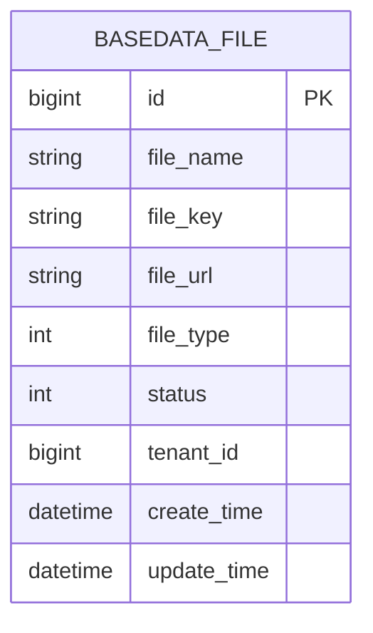

**图表来源**
- [BasedataFileController.java](file://yudao-module-opshub/src/main/java/cn/iocoder/yudao/module/opshub/controller/admin/basedata/BasedataFileController.java)
- [BasedataFileService.java](file://yudao-module-opshub/src/main/java/cn/iocoder/yudao/module/opshub/service/basedata/BasedataFileService.java)

**章节来源**
- [BasedataFileController.java](file://yudao-module-opshub/src/main/java/cn/iocoder/yudao/module/opshub/controller/admin/basedata/BasedataFileController.java)
- [BasedataFileService.java](file://yudao-module-opshub/src/main/java/cn/iocoder/yudao/module/opshub/service/basedata/BasedataFileService.java)

### 签约管理
- 功能职责
  - 合同管理：合同创建、编辑、删除、查询与分页
  - 状态管理：合同状态跟踪、审批流程
  - 统计分析：签约数据统计、趋势分析
- 关键实现
  - 控制器：提供签约合同相关接口
  - 服务：封装签约业务逻辑
  - 持久层：管理合同相关信息
  - 数据对象：映射合同相关表
- 数据模型

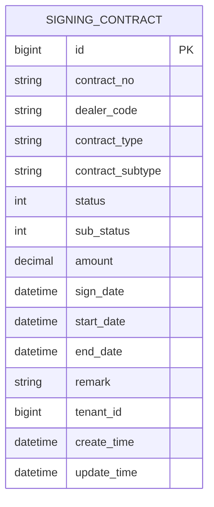

**图表来源**
- [SigningContractController.java](file://yudao-module-opshub/src/main/java/cn/iocoder/yudao/module/opshub/controller/admin/signing/SigningContractController.java)
- [SigningContractService.java](file://yudao-module-opshub/src/main/java/cn/iocoder/yudao/module/opshub/service/signing/SigningContractService.java)

**章节来源**
- [SigningContractController.java](file://yudao-module-opshub/src/main/java/cn/iocoder/yudao/module/opshub/controller/admin/signing/SigningContractController.java)
- [SigningContractService.java](file://yudao-module-opshub/src/main/java/cn/iocoder/yudao/module/opshub/service/signing/SigningContractService.java)

### 数据权限控制机制
- 角色与维度
  - 超级管理员：全量可见
  - 品牌管理员/品牌销售/服务执行者：按产品线维度过滤
  - 经销商用户：按经销商维度过滤
- 实现原理
  - 在查询阶段通过 DealerDataPermissionRule 自动注入 WHERE 条件
  - 将授权集合缓存至登录用户上下文，避免重复计算
  - 通过配置类注册规则并指定生效表与字段映射
  - **新增** 电商客服系统数据权限：注册ops_cs_session到DealerDataPermissionRule
- 权限规则类图

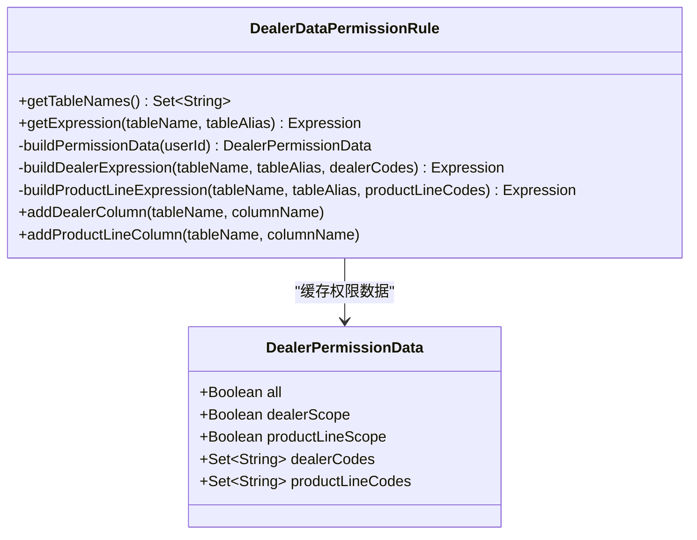

**图表来源**
- [DealerDataPermissionRule.java:1-246](file://yudao-module-opshub/src/main/java/cn/iocoder/yudao/module/opshub/framework/datapermission/rule/DealerDataPermissionRule.java#L1-L246)

**章节来源**
- [DealerDataPermissionRule.java:1-246](file://yudao-module-opshub/src/main/java/cn/iocoder/yudao/module/opshub/framework/datapermission/rule/DealerDataPermissionRule.java#L1-L246)
- [OpshubDataPermissionConfiguration.java](file://yudao-module-opshub/src/main/java/cn/iocoder/yudao/module/opshub/framework/datapermission/config/OpshubDataPermissionConfiguration.java)
- [DealerUserScopeMapper.java](file://yudao-module-opshub/src/main/java/cn/iocoder/yudao/module/opshub/dal/mysql/dealer/DealerUserScopeMapper.java)
- [ExecutorProductLineScopeMapper.java](file://yudao-module-opshub/src/main/java/cn/iocoder/yudao/module/opshub/dal/mysql/dealer/ExecutorProductLineScopeMapper.java)

### 业务流程：产品线绑定与数据访问
- 流程说明
  - 产品线绑定：运营人员在产品线管理中维护产品线，随后在"产品线绑定"界面将产品线与经销商关联
  - 数据访问：当执行者登录后，系统根据其角色与授权范围，自动在查询阶段注入 WHERE 条件，仅返回可访问的数据
- 序列图

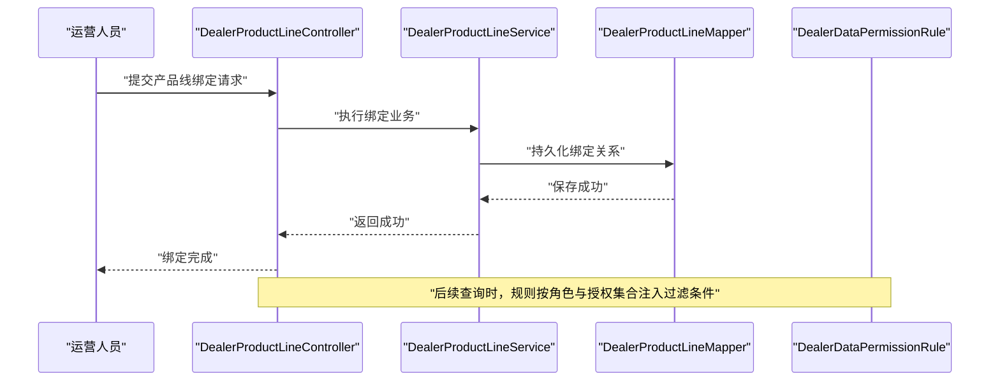

**图表来源**
- [DealerProductLineController.java](file://yudao-module-opshub/src/main/java/cn/iocoder/yudao/module/opshub/controller/admin/dealer/DealerProductLineController.java)
- [DealerProductLineService.java](file://yudao-module-opshub/src/main/java/cn/iocoder/yudao/module/opshub/service/dealer/DealerProductLineService.java)
- [DealerProductLineMapper.java](file://yudao-module-opshub/src/main/java/cn/iocoder/yudao/module/opshub/dal/mysql/dealer/DealerProductLineMapper.java)
- [DealerDataPermissionRule.java:1-246](file://yudao-module-opshub/src/main/java/cn/iocoder/yudao/module/opshub/framework/datapermission/rule/DealerDataPermissionRule.java#L1-L246)

### 基础数据管理与字典配置
- 字典与数据标准化
  - 通过系统模块的字典能力对状态、类型等进行标准化管理
  - 经销商状态、产品线状态、订单状态、售后原因等统一使用字典值，保证前后端一致性
- 集成建议
  - 在控制器或服务层调用系统提供的字典 API 获取枚举值
  - 使用统一的响应体包装与错误码体系

**章节来源**
- [ErrorCodeConstants.java](file://yudao-module-opshub/src/main/java/cn/iocoder/yudao/module/opshub/enums/ErrorCodeConstants.java)
- [OpsRoleCodeConstants.java](file://yudao-module-opshub/src/main/java/cn/iocoder/yudao/module/opshub/enums/OpsRoleCodeConstants.java)

### 多租户架构下的运营数据管理
- 租户隔离
  - 经销商、产品线、订单、售后、客服等实体均继承租户基类，天然具备租户字段
  - 数据权限规则与查询条件共同作用，确保跨租户数据隔离
- 数据共享策略
  - 通过角色与范围表实现"最小授权"，避免越权访问
  - 超级管理员可选择性地跨租户查看（由权限规则决定）

**章节来源**
- [DealerInfoDO.java:1-54](file://yudao-module-opshub/src/main/java/cn/iocoder/yudao/module/opshub/dal/dataobject/dealer/DealerInfoDO.java#L1-L54)
- [OrderInfoDO.java:1-54](file://yudao-module-opshub/src/main/java/cn/iocoder/yudao/module/opshub/dal/dataobject/order/OrderInfoDO.java#L1-L54)
- [AfterSaleInfoController.java](file://yudao-module-opshub/src/main/java/cn/iocoder/yudao/module/opshub/controller/admin/aftersale/AfterSaleInfoController.java)
- [CsTaskController.java](file://yudao-module-opshub/src/main/java/cn/iocoder/yudao/module/opshub/controller/admin/cs/CsTaskController.java)

### 用户管理系统增强
- **更新** 角色代码过滤增强
  - 用户管理界面支持按角色代码进行过滤查询
  - 提升大规模用户场景下的查询效率
  - 与授权管理界面形成完整的用户权限管理体系
- 关键实现
  - 前端用户管理页面：基于Element Plus的表格化UI设计
  - 支持用户名、手机号码、状态、创建时间等多维度查询
  - 集成Excel导入导出功能，提升批量操作效率

**章节来源**
- [index.vue](file://yudao-ui/yudao-ui-admin-vue3/src/views/system/user/index.vue)

### 电商客服系统集成
- **新增** 客服系统架构
  - 基于WebSocket的实时通信架构
  - 支持文本、附件、链接等多种消息类型
  - 集成咨询队列、聊天窗口、工单管理等功能
- 关键实现
  - WebSocket服务：CsWebSocketService提供消息推送能力
  - 咨询队列：支持按状态、类型、来源模块筛选的咨询列表
  - 聊天窗口：集成CsChatWindow组件，支持历史消息加载
  - 数据权限：注册ops_cs_session到DealerDataPermissionRule
- 数据模型

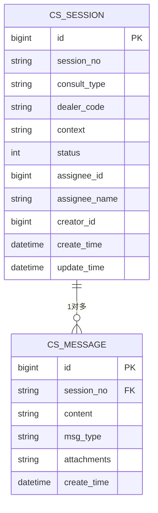

**图表来源**
- [PRD-Step7-电商客服系统.md](file://docs/PRD-Step7-电商客服系统.md)

**章节来源**
- [PRD-Step7-电商客服系统.md](file://docs/PRD-Step7-电商客服系统.md)
- [CsWebSocketService.java](file://yudao-module-opshub/src/main/java/cn/iocoder/yudao/module/opshub/service/cs/websocket/CsWebSocketService.java)
- [ConsultTab.vue](file://yudao-ui/yudao-ui-admin-vue3/src/views/opshub/customerservice/components/ConsultTab.vue)

### 授权管理系统重大升级
- **更新** 授权管理界面重构
  - 从传统的表单界面转变为现代化的表格驱动系统
  - 采用双Tab设计：服务单执行员和经销商分别管理
  - 支持实时授权状态展示和快速操作
- **新增** 抽屉式编辑功能
  - 提供直观的授权编辑体验
  - 支持用户选择器和产品线/经销商选择器
  - 实现授权范围的精确控制
- **新增** 批量用户授权管理
  - 支持批量授权和范围分配
  - 提供清空授权功能，便于快速重置
  - 集成确认对话框，确保操作安全性
- **新增** API接口设计
  - 提供完整的授权管理RESTful API
  - 支持用户授权查询、授权分配、用户列表获取
  - 实现前后端分离的授权管理架构

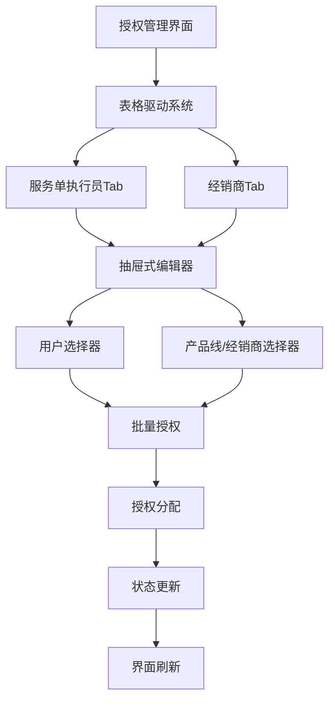

**图表来源**
- [index.vue](file://yudao-ui/yudao-ui-admin-vue3/src/views/opshub/scope/index.vue)
- [dealerScope/index.ts](file://yudao-ui/yudao-ui-admin-vue3/src/api/opshub/dealerScope/index.ts)

**章节来源**
- [index.vue](file://yudao-ui/yudao-ui-admin-vue3/src/views/opshub/scope/index.vue)
- [dealerScope/index.ts](file://yudao-ui/yudao-ui-admin-vue3/src/api/opshub/dealerScope/index.ts)
- [DealerUserScopeController.java](file://yudao-module-opshub/src/main/java/cn/iocoder/yudao/module/opshub/controller/admin/dealer/DealerUserScopeController.java)
- [ExecutorProductLineScopeController.java](file://yudao-module-opshub/src/main/java/cn/iocoder/yudao/module/opshub/controller/admin/dealer/DealerProductLineScopeController.java)

## 依赖分析
- 组件耦合
  - 控制器依赖服务接口，服务依赖持久层接口，降低上层对下层的直接依赖
  - 数据权限规则通过接口注入授权集合，避免硬编码
  - 订单模块内部各子模块通过订单编号关联，形成完整的订单生命周期管理
  - 售后模块与订单模块存在关联关系，支持售后基于订单的处理
  - 客服模块独立运行，支持实时通信与工单管理
  - **新增** 授权管理界面与用户管理界面解耦，通过独立的授权管理菜单提供服务
  - **新增** 前端授权管理界面与后端API接口完全分离，实现前后端解耦
- 外部依赖
  - 权限规则依赖系统通用权限 API 与安全框架
  - MyBatis 工具用于动态构建表达式
  - 订单模块依赖数据权限规则进行访问控制
  - 客服模块依赖WebSocket进行实时通信
  - **新增** 电商客服系统依赖CsWebSocketService进行消息推送
  - **新增** 授权管理界面依赖Element Plus UI组件库
  - **新增** 授权管理API依赖Axios HTTP客户端

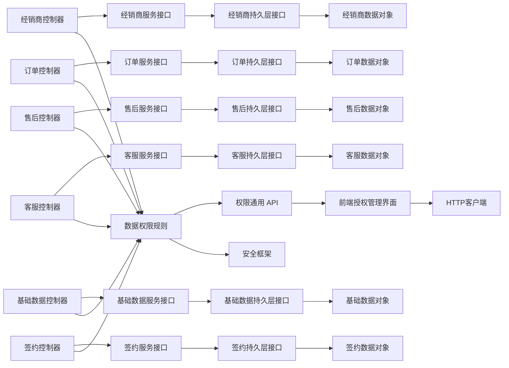

**图表来源**
- [DealerInfoController.java:1-81](file://yudao-module-opshub/src/main/java/cn/iocoder/yudao/module/opshub/controller/admin/dealer/DealerInfoController.java#L1-L81)
- [OrderInfoController.java:1-81](file://yudao-module-opshub/src/main/java/cn/iocoder/yudao/module/opshub/controller/admin/order/OrderInfoController.java#L1-L81)
- [AfterSaleInfoController.java](file://yudao-module-opshub/src/main/java/cn/iocoder/yudao/module/opshub/controller/admin/aftersale/AfterSaleInfoController.java)
- [CsTaskController.java](file://yudao-module-opshub/src/main/java/cn/iocoder/yudao/module/opshub/controller/admin/cs/CsTaskController.java)
- [BasedataFileController.java](file://yudao-module-opshub/src/main/java/cn/iocoder/yudao/module/opshub/controller/admin/basedata/BasedataFileController.java)
- [SigningContractController.java](file://yudao-module-opshub/src/main/java/cn/iocoder/yudao/module/opshub/controller/admin/signing/SigningContractController.java)
- [DealerDataPermissionRule.java:1-246](file://yudao-module-opshub/src/main/java/cn/iocoder/yudao/module/opshub/framework/datapermission/rule/DealerDataPermissionRule.java#L1-L246)

**章节来源**
- [DealerInfoController.java:1-81](file://yudao-module-opshub/src/main/java/cn/iocoder/yudao/module/opshub/controller/admin/dealer/DealerInfoController.java#L1-L81)
- [OrderInfoController.java:1-81](file://yudao-module-opshub/src/main/java/cn/iocoder/yudao/module/opshub/controller/admin/order/OrderInfoController.java#L1-L81)
- [AfterSaleInfoController.java](file://yudao-module-opshub/src/main/java/cn/iocoder/yudao/module/opshub/controller/admin/aftersale/AfterSaleInfoController.java)
- [CsTaskController.java](file://yudao-module-opshub/src/main/java/cn/iocoder/yudao/module/opshub/controller/admin/cs/CsTaskController.java)
- [BasedataFileController.java](file://yudao-module-opshub/src/main/java/cn/iocoder/yudao/module/opshub/controller/admin/basedata/BasedataFileController.java)
- [SigningContractController.java](file://yudao-module-opshub/src/main/java/cn/iocoder/yudao/module/opshub/controller/admin/signing/SigningContractController.java)
- [DealerDataPermissionRule.java:1-246](file://yudao-module-opshub/src/main/java/cn/iocoder/yudao/module/opshub/framework/datapermission/rule/DealerDataPermissionRule.java#L1-L246)

## 性能考虑
- 查询优化
  - 在数据权限规则中缓存用户授权集合，减少重复查询
  - 合理设置索引：dealer_code、product_line_code、order_code、after_sale_no、task_no、tenant_id 等常用过滤字段
  - 订单模块针对高频查询字段建立复合索引，如订单状态组合索引
  - 售后模块针对售后状态、申请时间等建立索引
  - 客服模块针对工单状态、紧急程度等建立索引
  - **新增** 咨询队列模块针对会话状态、创建时间等建立索引
  - **新增** 授权管理界面表格数据分页加载，提升大数据量场景下的响应性能
- 分页与批量
  - 使用分页接口避免一次性加载大量数据
  - 对范围分配等批量操作，采用批处理策略
  - 订单报表统计使用聚合查询，避免全表扫描
  - 售后统计分析使用预聚合策略
  - **新增** 授权管理界面支持批量授权操作，提升管理效率
  - **新增** 前端表格组件优化渲染性能，支持虚拟滚动
- 实时通信优化
  - 客服模块使用WebSocket长连接，合理设置心跳机制
  - 实时消息推送采用消息队列异步处理
  - **新增** 咨询队列采用WebSocket广播机制，确保消息实时性
  - **新增** 授权管理界面采用懒加载策略，减少初始渲染压力
- 监控与告警
  - 结合链路追踪与指标监控，关注慢查询与高并发场景
  - 订单模块建立专门的性能监控指标，包括订单处理时延、支付成功率等
  - 售后模块监控售后处理时效、客服模块监控工单响应时间
  - **新增** 客服模块监控WebSocket连接状态、消息推送成功率等指标
  - **新增** 授权管理界面监控表格渲染性能、API响应时间等指标

## 故障排查指南
- 权限问题
  - 若出现"无数据"或"越权访问"，检查用户角色与范围表是否正确配置
  - 确认数据权限规则已注册且生效
  - **新增** 检查授权管理界面的表格化显示是否正常
  - **新增** 验证抽屉式编辑功能的交互体验
- 接口异常
  - 查看错误码与异常日志，定位具体业务异常
  - **新增** 检查授权管理API接口的响应状态
- 数据不一致
  - 核对租户字段是否正确传递，避免跨租户误操作
- 订单状态异常
  - 检查订单状态流转逻辑，确认状态转换的前置条件
  - 验证订单时间轴记录的完整性
- 售后处理异常
  - 检查售后状态流转是否符合流程定义
  - 验证售后节点记录的完整性
- 客服通信异常
  - 检查WebSocket连接状态与消息推送机制
  - 验证工单状态监听器是否正常工作
  - **新增** 检查咨询队列的WebSocket广播功能是否正常
- **新增** 授权管理界面问题
  - 检查表格化界面的Tab切换功能是否正常
  - 验证抽屉式授权编辑功能的交互体验
  - 确认角色代码过滤查询功能的准确性
  - **新增** 检查批量授权操作的执行结果
  - **新增** 验证授权清空功能的安全性

**章节来源**
- [ErrorCodeConstants.java](file://yudao-module-opshub/src/main/java/cn/iocoder/yudao/module/opshub/enums/ErrorCodeConstants.java)
- [SecurityConfiguration.java](file://yudao-module-opshub/src/main/java/cn/iocoder/yudao/module/opshub/framework/security/config/SecurityConfiguration.java)

## 结论
运营中心模块通过清晰的分层设计与完善的数据权限机制，实现了经销商、产品线、用户范围、订单管理、售后管理、客户服务以及基础数据管理的精细化管理。新增的售后管理与客户服务模块进一步完善了运营中心的业务闭环，扩展了完整的SaaS平台服务能力。**特别更新**：授权管理界面重构为表格化显示，提升了用户体验和操作效率；新增客户服务系统集成，支持实时聊天、咨询队列等功能；用户管理系统增强支持角色代码过滤，提升了大规模用户的管理效率；**授权管理系统重大升级**：从表单界面转变为表格驱动系统，新增抽屉式编辑功能和批量用户授权管理，显著提升了授权管理的效率和用户体验。结合多租户与角色维度的访问控制，既能满足业务灵活性，又能保障数据安全与合规。四大核心功能模块相互协作，形成了完整的云运营解决方案。

## 附录

### 配置示例与集成指南
- 开启数据权限规则
  - 在权限配置类中注册 DealerDataPermissionRule，并添加需要过滤的表与字段映射
  - 订单、售后、客服模块继承相同的权限控制机制
  - **新增** 电商客服系统需注册ops_cs_session表到权限规则
- 角色与权限
  - 使用角色常量标识不同维度的访问角色，配合权限注解保护接口
  - 订单模块支持按经销商、产品线、订单状态等多维度权限控制
  - 售后模块支持按经销商、产品线、售后状态等多维度权限控制
  - 客服模块支持按工单状态、紧急程度等多维度权限控制
  - **新增** 授权管理界面支持按角色代码进行过滤查询
  - **新增** 授权管理API支持批量授权和范围分配
- 基础数据
  - 通过系统模块的字典能力统一管理状态与类型
  - 订单状态、支付状态、发票状态、售后原因等统一使用字典值
- SaaS平台集成
  - 客服模块支持WebSocket实时通信，便于集成第三方客服系统
  - 售后模块提供标准化API，便于与供应链系统对接
  - **新增** 授权管理界面提供统一的权限配置入口，简化用户管理流程
  - **新增** 授权管理API支持前后端分离的授权管理架构
- **新增** 授权管理界面集成
  - 前端采用Element Plus UI组件库，提供现代化的表格化界面
  - 支持响应式设计，适配多种设备和屏幕尺寸
  - 集成用户友好的交互体验，包括确认对话框、加载状态等

**章节来源**
- [OpshubDataPermissionConfiguration.java](file://yudao-module-opshub/src/main/java/cn/iocoder/yudao/module/opshub/framework/datapermission/config/OpshubDataPermissionConfiguration.java)
- [OpsRoleCodeConstants.java](file://yudao-module-opshub/src/main/java/cn/iocoder/yudao/module/opshub/enums/OpsRoleCodeConstants.java)
- [PRD-用户权限设计.md](file://docs/PRD-用户权限设计.md)
- [PRD-Step7-电商客服系统.md](file://docs/PRD-Step7-电商客服系统.md)

### 数据迁移、备份恢复与性能监控最佳实践
- 数据迁移
  - 使用数据库迁移工具维护 ops_dealer_info、产品线与范围表结构变更
  - 订单模块的表结构变更需同步考虑历史数据的兼容性
  - 售后模块新增表结构需考虑与订单数据的关联关系
  - 客服模块的WebSocket配置需考虑集群部署的一致性
  - **新增** 授权管理界面的表格化数据结构迁移需考虑用户体验
  - **新增** 授权管理API的数据结构变更需向后兼容
  - 迁移前备份存量数据，迁移后验证关键查询与权限规则
- 备份恢复
  - 定期对数据库进行增量与全量备份，确保可快速回滚
  - 订单数据、售后数据、客服数据建立专门的备份策略，确保交易数据的完整性
  - 实时通信数据（WebSocket）需考虑会话状态的备份
  - **新增** 咨询队列数据的备份策略需考虑消息历史的完整性
  - **新增** 授权管理界面的用户授权数据备份策略
- 性能监控
  - 建立慢查询与高延迟告警，持续优化热点表的索引与查询计划
  - 订单模块建立专门的监控指标，包括订单处理吞吐量、支付成功率等
  - 售后模块监控售后处理时效、退款处理时间等关键指标
  - 客服模块监控工单响应时间、解决时间、客户满意度等指标
  - **新增** 授权管理界面监控表格渲染性能、API响应时间等指标
  - **新增** 授权管理API监控授权操作的成功率和失败率
  - **新增** 前端授权管理界面监控用户交互响应时间和错误率

### 初始化脚本参考
- 运营中心初始化脚本包含表结构与基础数据，可作为模块部署的起点
- 订单模块的初始化脚本包含订单相关表的完整结构定义
- 售后模块的初始化脚本包含售后相关表的完整结构定义
- 客服模块的初始化脚本包含客服相关表的完整结构定义
- **新增** 授权管理界面的初始化脚本包含表格化数据结构的定义
- **新增** 授权管理API的初始化脚本包含RESTful接口的定义

**章节来源**
- [opshub-step1.sql](file://sql/postgresql/opshub-step1.sql)