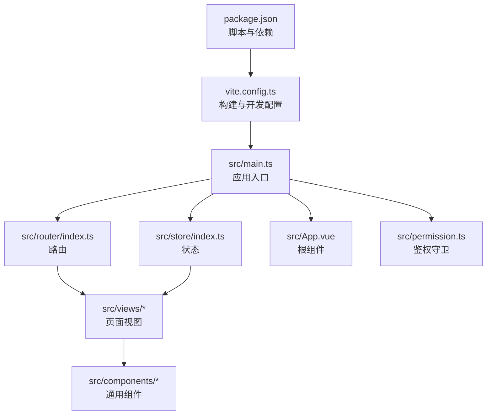
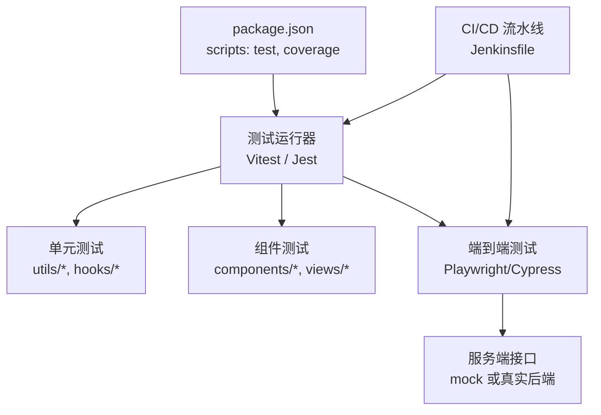
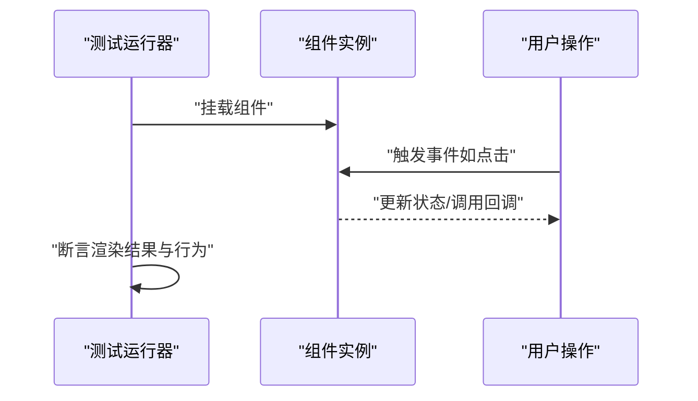
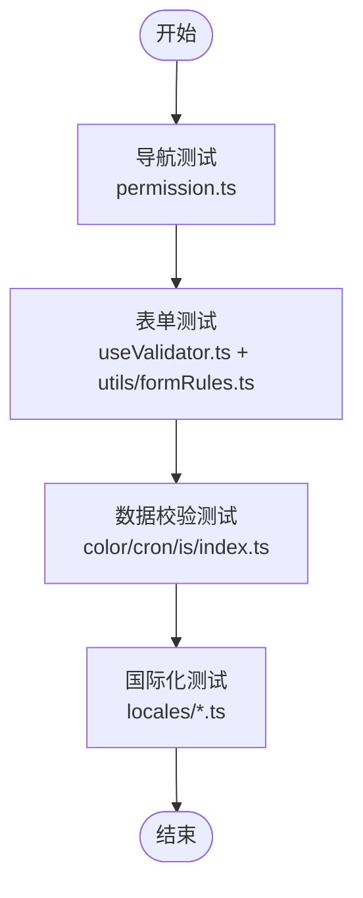
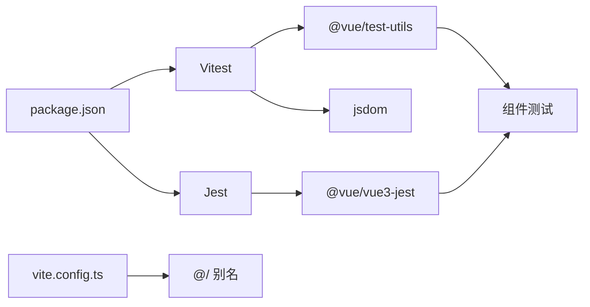

# 前端测试

<cite>
**本文引用的文件**
- [package.json](file://yudao-ui/yudao-ui-admin-vue3/package.json)
- [vite.config.ts](file://yudao-ui/yudao-ui-admin-vue3/vite.config.ts)
- [index.ts](file://yudao-ui/yudao-ui-admin-vue3/src/router/index.ts)
- [index.ts](file://yudao-ui/yudao-ui-admin-vue3/src/store/index.ts)
- [App.vue](file://yudao-ui/yudao-ui-admin-vue3/src/App.vue)
- [main.ts](file://yudao-ui/yudao-ui-admin-vue3/src/main.ts)
- [permission.ts](file://yudao-ui/yudao-ui-admin-vue3/src/permission.ts)
- [en.ts](file://yudao-ui/yudao-ui-admin-vue3/src/locales/en.ts)
- [zh-CN.ts](file://yudao-ui/yudao-ui-admin-vue3/src/locales/zh-CN.ts)
- [useValidator.ts](file://yudao-ui/yudao-ui-admin-vue3/src/hooks/web/useValidator.ts)
- [color.ts](file://yudao-ui/yudao-ui-admin-vue3/src/utils/color.ts)
- [cron.ts](file://yudao-ui/yudao-ui-admin-vue3/src/utils/cron.ts)
- [is.ts](file://yudao-ui/yudao-ui-admin-vue3/src/utils/is.ts)
- [index.ts](file://yudao-ui/yudao-ui-admin-vue3/src/utils/index.ts)
- [audioBar/index.vue](file://yudao-ui/yudao-ui-admin-vue3/src/views/ai/music/index/list/audioBar/index.vue)
- [index.vue](file://yudao-ui/yudao-ui-admin-vue3/src/views/ai/music/index/list/index.vue)
- [Jenkinsfile](file://script/jenkins/Jenkinsfile)
</cite>

## 目录
1. [引言](#引言)
2. [项目结构](#项目结构)
3. [核心组件](#核心组件)
4. [架构总览](#架构总览)
5. [详细组件分析](#详细组件分析)
6. [依赖分析](#依赖分析)
7. [性能考虑](#性能考虑)
8. [故障排查指南](#故障排查指南)
9. [结论](#结论)
10. [附录](#附录)

## 引言
本文件面向“芋道 ruoyi-vue-pro”前端工程，系统化梳理并输出一套完整的前端测试体系方案，覆盖单元测试、组件测试与端到端测试（E2E），明确 Vitest 与 Jest 的配置与使用路径，并给出 Vue 组件测试的实施指南、用户交互测试方法、前端性能测试策略、覆盖率统计与质量评估方法，以及在 CI/CD 流水线中的集成与自动化执行建议。当前仓库未内置测试框架配置文件，本文将提供从零到一的落地步骤与最佳实践。

## 项目结构
前端工程位于 yudao-ui/yudao-ui-admin-vue3，采用 Vite + Vue 3 + TypeScript 技术栈，核心目录包含：
- src/api：接口封装与业务模块 API
- src/components：通用组件库
- src/views：页面级视图
- src/router：路由配置
- src/store：状态管理（Pinia）
- src/utils 与 src/hooks：工具函数与组合式逻辑
- vite.config.ts：构建与开发服务器配置
- package.json：脚本与依赖声明

图表来源
- [package.json:1-158](file://yudao-ui/yudao-ui-admin-vue3/package.json#L1-L158)
- [vite.config.ts:1-102](file://yudao-ui/yudao-ui-admin-vue3/vite.config.ts#L1-L102)
- [main.ts](file://yudao-ui/yudao-ui-admin-vue3/src/main.ts)
- [router/index.ts](file://yudao-ui/yudao-ui-admin-vue3/src/router/index.ts)
- [store/index.ts](file://yudao-ui/yudao-ui-admin-vue3/src/store/index.ts)
- [App.vue](file://yudao-ui/yudao-ui-admin-vue3/src/App.vue)
- [permission.ts](file://yudao-ui/yudao-ui-admin-vue3/src/permission.ts)

章节来源
- [package.json:1-158](file://yudao-ui/yudao-ui-admin-vue3/package.json#L1-L158)
- [vite.config.ts:1-102](file://yudao-ui/yudao-ui-admin-vue3/vite.config.ts#L1-L102)

## 核心组件
- 应用入口与初始化
  - main.ts：挂载应用、注册插件、安装路由与状态管理
  - App.vue：根组件，承载布局与全局样式
- 路由与权限
  - router/index.ts：路由定义与懒加载
  - permission.ts：导航守卫与鉴权逻辑
- 状态管理
  - store/index.ts：创建 Pinia 实例并启用持久化插件
- 国际化
  - locales/en.ts 与 zh-CN.ts：多语言词条
- 工具与校验
  - hooks/web/useValidator.ts：表单校验组合式逻辑
  - utils/color.ts、cron.ts、is.ts、index.ts：常用工具函数

章节来源
- [main.ts](file://yudao-ui/yudao-ui-admin-vue3/src/main.ts)
- [App.vue](file://yudao-ui/yudao-ui-admin-vue3/src/App.vue)
- [router/index.ts](file://yudao-ui/yudao-ui-admin-vue3/src/router/index.ts)
- [permission.ts](file://yudao-ui/yudao-ui-admin-vue3/src/permission.ts)
- [store/index.ts](file://yudao-ui/yudao-ui-admin-vue3/src/store/index.ts)
- [en.ts](file://yudao-ui/yudao-ui-admin-vue3/src/locales/en.ts)
- [zh-CN.ts](file://yudao-ui/yudao-ui-admin-vue3/src/locales/zh-CN.ts)
- [useValidator.ts](file://yudao-ui/yudao-ui-admin-vue3/src/hooks/web/useValidator.ts)
- [color.ts](file://yudao-ui/yudao-ui-admin-vue3/src/utils/color.ts)
- [cron.ts](file://yudao-ui/yudao-ui-admin-vue3/src/utils/cron.ts)
- [is.ts](file://yudao-ui/yudao-ui-admin-vue3/src/utils/is.ts)
- [index.ts](file://yudao-ui/yudao-ui-admin-vue3/src/utils/index.ts)

## 架构总览
下图展示前端测试体系在工程中的位置与关系：测试脚本通过 package.json 的 scripts 字段统一调度；Vitest/Jest 作为测试运行器与断言库；Vue 组件与工具函数作为被测对象；CI/CD 流水线负责自动化执行与报告输出。

图表来源
- [package.json:7-26](file://yudao-ui/yudao-ui-admin-vue3/package.json#L7-L26)
- [Jenkinsfile](file://script/jenkins/Jenkinsfile)

## 详细组件分析

### Vitest 配置与使用
- 目标与范围
  - 单元测试：utils/*、hooks/web/useValidator.ts 等纯函数与组合式逻辑
  - 组件测试：components/*、views/* 中的可独立渲染组件
- 配置要点
  - 测试文件命名：以 .spec.ts/.test.ts 结尾，放置于对应源码同级或 tests 目录
  - 环境隔离：使用 jsdom 或 DOM 环境，确保浏览器 API 可用
  - 别名解析：保持与 vite.config.ts 中的 @/ 别名一致
  - 快照与覆盖率：开启覆盖率统计，选择语句、分支、函数、行数维度
- 建议脚本
  - 在 package.json 的 scripts 中新增：
    - "test": "vitest"
    - "test:run": "vitest run"
    - "coverage": "vitest --coverage"
    - "watch": "vitest --watch"

章节来源
- [package.json:7-26](file://yudao-ui/yudao-ui-admin-vue3/package.json#L7-L26)
- [vite.config.ts:67-75](file://yudao-ui/yudao-ui-admin-vue3/vite.config.ts#L67-L75)

### Jest 配置与使用
- 适用场景
  - 与现有 Jest 生态兼容的项目迁移或混合测试
- 配置要点
  - 安装 jest、@vue/vue3-jest、jest-environment-jsdom
  - 配置 jest.config.* 支持 TS、Vue 单文件组件与别名解析
  - 设置 transform 与 moduleFileExtensions
- 建议脚本
  - 在 package.json 的 scripts 中新增：
    - "test:jest": "jest"
    - "test:jest:watch": "jest --watch"
    - "coverage:jest": "jest --coverage"

章节来源
- [package.json:89-142](file://yudao-ui/yudao-ui-admin-vue3/package.json#L89-L142)

### Vue 组件测试指南
- 渲染测试
  - 使用 @vue/test-utils 或 Vitest + jsdom
  - 断言组件渲染结果、DOM 结构与类名
- 事件处理测试
  - 触发用户交互（点击、输入、选择等）
  - 断言回调调用次数、参数与副作用
- 生命周期测试
  - 断言 mounted/unmounted 时的状态变化
  - 对异步逻辑使用 flushPromises 或等待微任务
- 示例路径
  - audioBar/index.vue 与 index.vue：可作为交互组件测试范例

图表来源
- [audioBar/index.vue:18-25](file://yudao-ui/yudao-ui-admin-vue3/src/views/ai/music/index/list/audioBar/index.vue#L18-L25)
- [index.vue:66](file://yudao-ui/yudao-ui-admin-vue3/src/views/ai/music/index/list/index.vue#L66)

章节来源
- [audioBar/index.vue:18-25](file://yudao-ui/yudao-ui-admin-vue3/src/views/ai/music/index/list/audioBar/index.vue#L18-L25)
- [index.vue:66](file://yudao-ui/yudao-ui-admin-vue3/src/views/ai/music/index/list/index.vue#L66)

### 用户交互测试（页面导航、表单填写、数据验证）
- 页面导航测试
  - 使用路由守卫与鉴权逻辑（permission.ts）进行导航拦截与放行测试
  - 断言路由跳转、面包屑与页面标题
- 表单填写测试
  - 使用组合式校验（hooks/web/useValidator.ts）与工具函数（utils/formRules.ts）
  - 断言字段联动、禁用状态与提交行为
- 数据验证测试
  - 针对颜色格式（utils/color.ts）、定时规则（utils/cron.ts）、路径判断（utils/is.ts）等工具函数编写单元测试
  - 对国际化词条（locales/en.ts、zh-CN.ts）进行键一致性与占位符校验

图表来源
- [permission.ts](file://yudao-ui/yudao-ui-admin-vue3/src/permission.ts)
- [useValidator.ts](file://yudao-ui/yudao-ui-admin-vue3/src/hooks/web/useValidator.ts)
- [color.ts](file://yudao-ui/yudao-ui-admin-vue3/src/utils/color.ts)
- [cron.ts](file://yudao-ui/yudao-ui-admin-vue3/src/utils/cron.ts)
- [is.ts](file://yudao-ui/yudao-ui-admin-vue3/src/utils/is.ts)
- [index.ts](file://yudao-ui/yudao-ui-admin-vue3/src/utils/index.ts)
- [en.ts](file://yudao-ui/yudao-ui-admin-vue3/src/locales/en.ts)
- [zh-CN.ts](file://yudao-ui/yudao-ui-admin-vue3/src/locales/zh-CN.ts)

章节来源
- [permission.ts](file://yudao-ui/yudao-ui-admin-vue3/src/permission.ts)
- [useValidator.ts](file://yudao-ui/yudao-ui-admin-vue3/src/hooks/web/useValidator.ts)
- [color.ts](file://yudao-ui/yudao-ui-admin-vue3/src/utils/color.ts)
- [cron.ts](file://yudao-ui/yudao-ui-admin-vue3/src/utils/cron.ts)
- [is.ts](file://yudao-ui/yudao-ui-admin-vue3/src/utils/is.ts)
- [index.ts](file://yudao-ui/yudao-ui-admin-vue3/src/utils/index.ts)
- [en.ts](file://yudao-ui/yudao-ui-admin-vue3/src/locales/en.ts)
- [zh-CN.ts](file://yudao-ui/yudao-ui-admin-vue3/src/locales/zh-CN.ts)

### 前端性能测试
- 首屏加载时间（FCP/LCP/INP）
  - 使用浏览器性能 API 或 Lighthouse 进行采集
  - 在 CI 中固定网络与设备模拟，保证指标可比性
- 资源加载测试
  - 分析包体大小与分包策略（vite.config.ts 优化依赖分组）
- 内存使用测试
  - 通过性能面板与内存快照，定位组件卸载不彻底导致的泄漏
- 建议指标
  - 首屏渲染时间阈值、缓存命中率、内存峰值与 GC 次数

章节来源
- [vite.config.ts:76-98](file://yudao-ui/yudao-ui-admin-vue3/vite.config.ts#L76-L98)

### 覆盖率统计与质量评估
- 覆盖率维度
  - 语句、分支、函数、行数
- 质量门禁
  - 设定最小覆盖率阈值，失败则阻断合并
- 报告输出
  - 生成 HTML/JSON 报告并在 CI 中归档

章节来源
- [package.json:7-26](file://yudao-ui/yudao-ui-admin-vue3/package.json#L7-L26)

### CI/CD 集成与自动化执行
- Jenkins 流水线
  - 在 Jenkinsfile 中添加测试阶段，调用 npm run test 或 npm run coverage
  - 将覆盖率报告与测试日志上传 Artifacts
- 最佳实践
  - 并行执行不同类型的测试（单元、组件、E2E）
  - 使用缓存加速依赖安装（pnpm cache）

章节来源
- [Jenkinsfile](file://script/jenkins/Jenkinsfile)
- [package.json:7-26](file://yudao-ui/yudao-ui-admin-vue3/package.json#L7-L26)

## 依赖分析
- 测试相关依赖
  - Vitest：测试运行器与断言库
  - @vue/test-utils：Vue 组件测试工具
  - jsdom：DOM 环境
  - @types/jest 或 Jest（按需）
- 工程依赖与别名
  - @/ 别名与 vite.config.ts 保持一致，避免测试导入失败

图表来源
- [package.json:89-142](file://yudao-ui/yudao-ui-admin-vue3/package.json#L89-L142)
- [vite.config.ts:67-75](file://yudao-ui/yudao-ui-admin-vue3/vite.config.ts#L67-L75)

章节来源
- [package.json:89-142](file://yudao-ui/yudao-ui-admin-vue3/package.json#L89-L142)
- [vite.config.ts:67-75](file://yudao-ui/yudao-ui-admin-vue3/vite.config.ts#L67-L75)

## 性能考虑
- 测试执行性能
  - 使用 watch 模式进行增量测试，提升反馈速度
  - 合理拆分测试套件，避免单文件过大
- 资源与内存
  - 控制并发度，避免内存峰值过高
  - 在 CI 中限制超时与重试次数

## 故障排查指南
- 测试无法启动
  - 检查 package.json 中的脚本是否存在
  - 确认 Node 版本与 pnpm 版本满足工程要求
- 别名导入失败
  - 确保测试配置中的别名与 vite.config.ts 一致
- 路由/权限相关测试失败
  - 使用内存路由与 mock 鉴权逻辑，避免真实后端干扰
- 覆盖率异常
  - 检查忽略规则与源码路径映射

章节来源
- [package.json:153-156](file://yudao-ui/yudao-ui-admin-vue3/package.json#L153-L156)
- [vite.config.ts:67-75](file://yudao-ui/yudao-ui-admin-vue3/vite.config.ts#L67-L75)
- [permission.ts](file://yudao-ui/yudao-ui-admin-vue3/src/permission.ts)

## 结论
本文件为 ruoyi-vue-pro 前端工程提供了从零起步的测试体系蓝图：以 Vitest 为主、Jest 为辅，结合单元测试、组件测试与端到端测试，配合性能与覆盖率评估，并在 CI/CD 中实现自动化执行。建议优先完成 Vitest 配置与关键模块的测试用例编写，逐步扩展至全量覆盖。

## 附录
- 快速清单
  - 新增测试脚本与依赖
  - 编写首个组件测试与工具函数测试
  - 在流水线中加入测试与覆盖率步骤
  - 设定质量门禁与报告归档