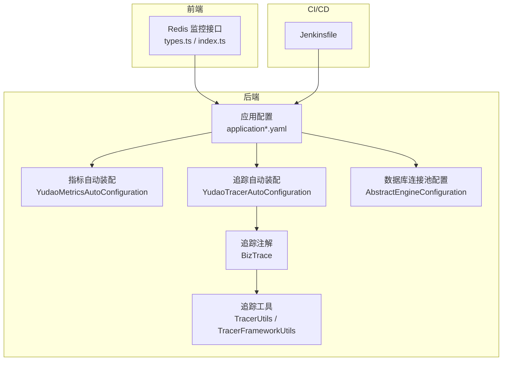
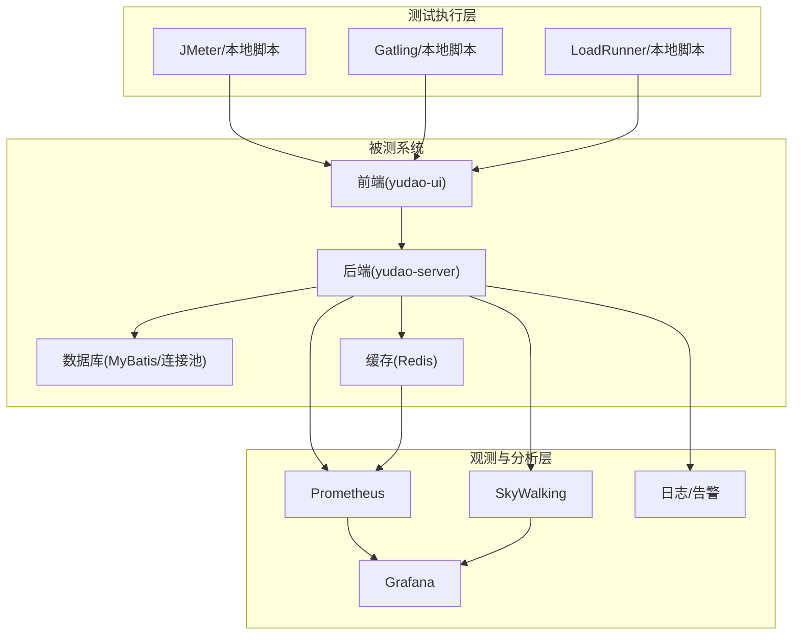
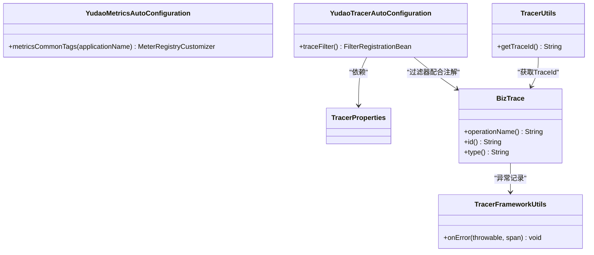
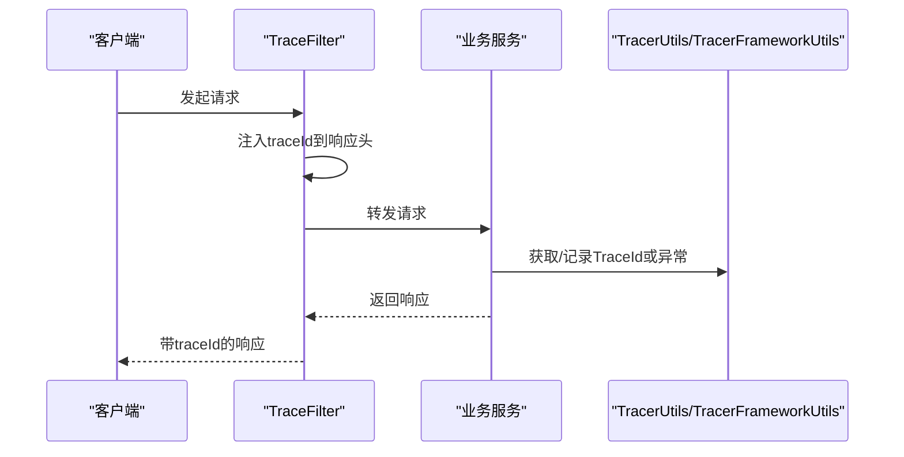
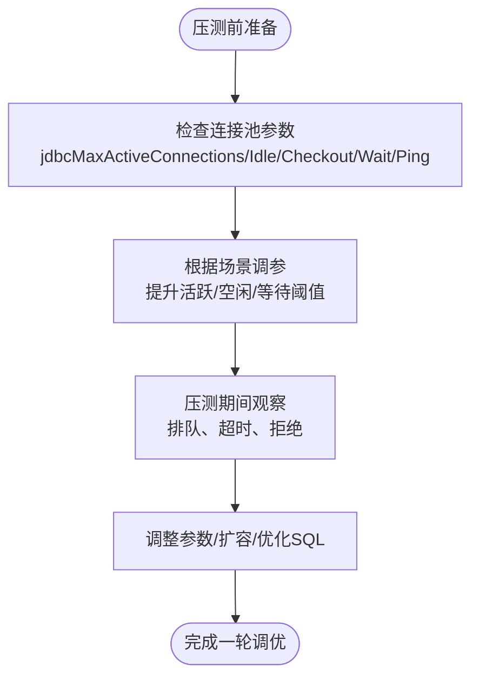
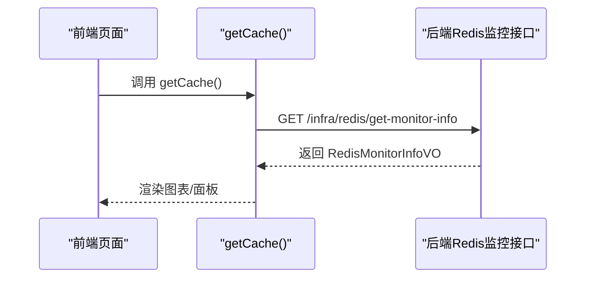
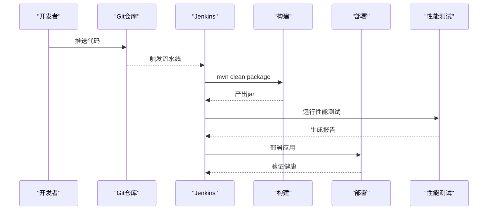
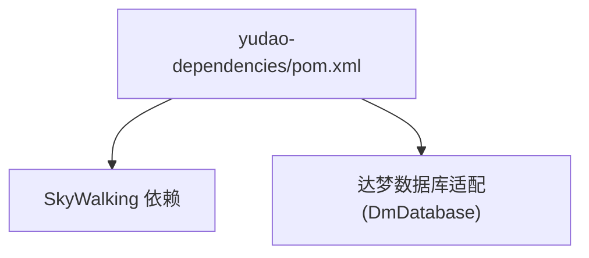

# 性能测试

<cite>
**本文引用的文件**
- [application.yaml](file://yudao-server/src/main/resources/application.yaml)
- [application-dev.yaml](file://yudao-server/src/main/resources/application-dev.yaml)
- [application-local.yaml](file://yudao-server/src/main/resources/application-local.yaml)
- [YudaoMetricsAutoConfiguration.java](file://yudao-framework/yudao-spring-boot-starter-monitor/src/main/java/cn/iocoder/yudao/framework/tracer/config/YudaoMetricsAutoConfiguration.java)
- [YudaoTracerAutoConfiguration.java](file://yudao-framework/yudao-spring-boot-starter-monitor/src/main/java/cn/iocoder/yudao/framework/tracer/config/YudaoTracerAutoConfiguration.java)
- [TracerProperties.java](file://yudao-framework/yudao-spring-boot-starter-monitor/src/main/java/cn/iocoder/yudao/framework/tracer/config/TracerProperties.java)
- [BizTrace.java](file://yudao-framework/yudao-spring-boot-starter-monitor/src/main/java/cn/iocoder/yudao/framework/tracer/core/annotation/BizTrace.java)
- [TracerFrameworkUtils.java](file://yudao-framework/yudao-spring-boot-starter-monitor/src/main/java/cn/iocoder/yudao/framework/tracer/core/util/TracerFrameworkUtils.java)
- [TracerUtils.java](file://yudao-framework/yudao-common/src/main/java/cn/iocoder/yudao/framework/common/util/monitor/TracerUtils.java)
- [pom.xml（依赖聚合）](file://yudao-dependencies/pom.xml)
- [AbstractEngineConfiguration.java](file://sql/dm/flowable-patch/src/main/java/org/flowable/common/engine/impl/AbstractEngineConfiguration.java)
- [DmDatabase.java](file://sql/dm/flowable-patch/src/main/java/liquibase/database/core/DmDatabase.java)
- [types.ts（Redis 监控接口定义）](file://yudao-ui/yudao-ui-admin-vue3/src/api/infra/redis/types.ts)
- [index.ts（Redis 监控接口）](file://yudao-ui/yudao-ui-admin-vue3/src/api/infra/redis/index.ts)
- [Jenkinsfile](file://script/jenkins/Jenkinsfile)
- [ApiAccessLogCreateReqDTO.java](file://yudao-framework/yudao-common/src/main/java/cn/iocoder/yudao/framework/common/biz/infra/logger/dto/ApiAccessLogCreateReqDTO.java)
</cite>

## 目录
1. [简介](#简介)
2. [项目结构](#项目结构)
3. [核心组件](#核心组件)
4. [架构总览](#架构总览)
5. [详细组件分析](#详细组件分析)
6. [依赖关系分析](#依赖关系分析)
7. [性能考量与优化建议](#性能考量与优化建议)
8. [故障排查指南](#故障排查指南)
9. [结论](#结论)
10. [附录](#附录)

## 简介
本文件面向“芋道 ruoyi-vue-pro”项目，系统化阐述如何开展性能测试，覆盖负载测试、压力测试、稳定性测试与并发测试；给出基于 Micrometer/Actuator 的指标采集、SkyWalking 链路追踪能力、前端 Redis 监控接口等现有能力的落地实践；并提供性能测试报告生成、趋势分析与持续性能监控的实施方案。

## 项目结构
围绕性能测试的关键支撑点，项目中与之相关的主要模块与文件如下：
- 后端配置与监控
  - 应用配置：application.yaml、application-dev.yaml、application-local.yaml
  - 指标与监控自动装配：YudaoMetricsAutoConfiguration、YudaoTracerAutoConfiguration
  - 链路追踪注解与工具：BizTrace、TracerFrameworkUtils、TracerUtils
  - 数据库连接池配置：AbstractEngineConfiguration（MyBatis 连接池参数）
- 前端监控与可视化
  - Redis 监控接口定义与调用：types.ts、index.ts
- 持续集成与部署
  - Jenkinsfile（流水线示例）

**图示来源**
- [application.yaml](file://yudao-server/src/main/resources/application.yaml)
- [application-dev.yaml](file://yudao-server/src/main/resources/application-dev.yaml)
- [application-local.yaml](file://yudao-server/src/main/resources/application-local.yaml)
- [YudaoMetricsAutoConfiguration.java](file://yudao-framework/yudao-spring-boot-starter-monitor/src/main/java/cn/iocoder/yudao/framework/tracer/config/YudaoMetricsAutoConfiguration.java)
- [YudaoTracerAutoConfiguration.java](file://yudao-framework/yudao-spring-boot-starter-monitor/src/main/java/cn/iocoder/yudao/framework/tracer/config/YudaoTracerAutoConfiguration.java)
- [BizTrace.java](file://yudao-framework/yudao-spring-boot-starter-monitor/src/main/java/cn/iocoder/yudao/framework/tracer/core/annotation/BizTrace.java)
- [TracerUtils.java](file://yudao-framework/yudao-common/src/main/java/cn/iocoder/yudao/framework/common/util/monitor/TracerUtils.java)
- [TracerFrameworkUtils.java](file://yudao-framework/yudao-spring-boot-starter-monitor/src/main/java/cn/iocoder/yudao/framework/tracer/core/util/TracerFrameworkUtils.java)
- [AbstractEngineConfiguration.java](file://sql/dm/flowable-patch/src/main/java/org/flowable/common/engine/impl/AbstractEngineConfiguration.java)
- [types.ts（Redis 监控接口定义）](file://yudao-ui/yudao-ui-admin-vue3/src/api/infra/redis/types.ts)
- [index.ts（Redis 监控接口）](file://yudao-ui/yudao-ui-admin-vue3/src/api/infra/redis/index.ts)
- [Jenkinsfile](file://script/jenkins/Jenkinsfile)

**章节来源**
- [application.yaml](file://yudao-server/src/main/resources/application.yaml)
- [application-dev.yaml](file://yudao-server/src/main/resources/application-dev.yaml)
- [application-local.yaml](file://yudao-server/src/main/resources/application-local.yaml)
- [YudaoMetricsAutoConfiguration.java](file://yudao-framework/yudao-spring-boot-starter-monitor/src/main/java/cn/iocoder/yudao/framework/tracer/config/YudaoMetricsAutoConfiguration.java)
- [YudaoTracerAutoConfiguration.java](file://yudao-framework/yudao-spring-boot-starter-monitor/src/main/java/cn/iocoder/yudao/framework/tracer/config/YudaoTracerAutoConfiguration.java)
- [BizTrace.java](file://yudao-framework/yudao-spring-boot-starter-monitor/src/main/java/cn/iocoder/yudao/framework/tracer/core/annotation/BizTrace.java)
- [TracerUtils.java](file://yudao-framework/yudao-common/src/main/java/cn/iocoder/yudao/framework/common/util/monitor/TracerUtils.java)
- [TracerFrameworkUtils.java](file://yudao-framework/yudao-spring-boot-starter-monitor/src/main/java/cn/iocoder/yudao/framework/tracer/core/util/TracerFrameworkUtils.java)
- [AbstractEngineConfiguration.java](file://sql/dm/flowable-patch/src/main/java/org/flowable/common/engine/impl/AbstractEngineConfiguration.java)
- [types.ts（Redis 监控接口定义）](file://yudao-ui/yudao-ui-admin-vue3/src/api/infra/redis/types.ts)
- [index.ts（Redis 监控接口）](file://yudao-ui/yudao-ui-admin-vue3/src/api/infra/redis/index.ts)
- [Jenkinsfile](file://script/jenkins/Jenkinsfile)

## 核心组件
- 指标与监控
  - 通过 YudaoMetricsAutoConfiguration 注入通用标签，便于在 Prometheus/Grafana 等平台进行多实例聚合与对比。
  - Actuator 暴露 JVM/进程/业务指标，结合 Micrometer 使用。
- 链路追踪
  - YudaoTracerAutoConfiguration 提供 TraceFilter，统一注入 traceId。
  - BizTrace 注解用于打点业务维度标签（如 biz.id、biz.type），TracerFrameworkUtils 支持异常日志落盘。
  - TracerUtils 提供便捷获取 TraceId 的工具方法。
- 数据库连接池
  - AbstractEngineConfiguration 提供 jdbcMaxActiveConnections、jdbcMaxIdleConnections、jdbcMaxCheckoutTime、jdbcMaxWaitTime、jdbcPingEnabled 等参数，直接影响并发与资源占用。
- 前端监控
  - types.ts 定义 Redis 监控返回结构，index.ts 提供 /infra/redis/get-monitor-info 接口调用封装，可用于前端展示内存、命令统计等指标。
- CI/CD
  - Jenkinsfile 展示了打包与部署流程，可作为性能回归测试的触发入口。

**章节来源**
- [YudaoMetricsAutoConfiguration.java](file://yudao-framework/yudao-spring-boot-starter-monitor/src/main/java/cn/iocoder/yudao/framework/tracer/config/YudaoMetricsAutoConfiguration.java)
- [YudaoTracerAutoConfiguration.java](file://yudao-framework/yudao-spring-boot-starter-monitor/src/main/java/cn/iocoder/yudao/framework/tracer/config/YudaoTracerAutoConfiguration.java)
- [BizTrace.java](file://yudao-framework/yudao-spring-boot-starter-monitor/src/main/java/cn/iocoder/yudao/framework/tracer/core/annotation/BizTrace.java)
- [TracerFrameworkUtils.java](file://yudao-framework/yudao-spring-boot-starter-monitor/src/main/java/cn/iocoder/yudao/framework/tracer/core/util/TracerFrameworkUtils.java)
- [TracerUtils.java](file://yudao-framework/yudao-common/src/main/java/cn/iocoder/yudao/framework/common/util/monitor/TracerUtils.java)
- [AbstractEngineConfiguration.java](file://sql/dm/flowable-patch/src/main/java/org/flowable/common/engine/impl/AbstractEngineConfiguration.java)
- [types.ts（Redis 监控接口定义）](file://yudao-ui/yudao-ui-admin-vue3/src/api/infra/redis/types.ts)
- [index.ts（Redis 监控接口）](file://yudao-ui/yudao-ui-admin-vue3/src/api/infra/redis/index.ts)
- [Jenkinsfile](file://script/jenkins/Jenkinsfile)

## 架构总览
性能测试涉及“测试执行层—被测系统—观测与分析层”的闭环。ruoyi-vue-pro 已具备可观测性基础：后端通过 Micrometer/Actuator 暴露指标，SkyWalking 提供链路追踪；前端通过 Redis 监控接口获取缓存状态。CI/CD 可作为回归测试的触发器。

[此图为概念性架构示意，不直接映射具体源码文件，故无“图示来源”]

## 详细组件分析

### 指标与监控组件
- 自动装配
  - YudaoMetricsAutoConfiguration 在启用时为 MeterRegistry 注入通用标签，便于跨实例聚合。
- 配置开关
  - 通过 yudao.metrics.enable 控制是否启用指标导出。
- 实践要点
  - 在压测前确认 Actuator 暴露端点与网络策略；在 Grafana 中建立仪表盘，关注 CPU、堆外内存、GC、HTTP 请求速率、错误率、慢查询等。

**图示来源**
- [YudaoMetricsAutoConfiguration.java](file://yudao-framework/yudao-spring-boot-starter-monitor/src/main/java/cn/iocoder/yudao/framework/tracer/config/YudaoMetricsAutoConfiguration.java)
- [YudaoTracerAutoConfiguration.java](file://yudao-framework/yudao-spring-boot-starter-monitor/src/main/java/cn/iocoder/yudao/framework/tracer/config/YudaoTracerAutoConfiguration.java)
- [TracerProperties.java](file://yudao-framework/yudao-spring-boot-starter-monitor/src/main/java/cn/iocoder/yudao/framework/tracer/config/TracerProperties.java)
- [BizTrace.java](file://yudao-framework/yudao-spring-boot-starter-monitor/src/main/java/cn/iocoder/yudao/framework/tracer/core/annotation/BizTrace.java)
- [TracerFrameworkUtils.java](file://yudao-framework/yudao-spring-boot-starter-monitor/src/main/java/cn/iocoder/yudao/framework/tracer/core/util/TracerFrameworkUtils.java)
- [TracerUtils.java](file://yudao-framework/yudao-common/src/main/java/cn/iocoder/yudao/framework/common/util/monitor/TracerUtils.java)

**章节来源**
- [YudaoMetricsAutoConfiguration.java](file://yudao-framework/yudao-spring-boot-starter-monitor/src/main/java/cn/iocoder/yudao/framework/tracer/config/YudaoMetricsAutoConfiguration.java)
- [YudaoTracerAutoConfiguration.java](file://yudao-framework/yudao-spring-boot-starter-monitor/src/main/java/cn/iocoder/yudao/framework/tracer/config/YudaoTracerAutoConfiguration.java)
- [TracerProperties.java](file://yudao-framework/yudao-spring-boot-starter-monitor/src/main/java/cn/iocoder/yudao/framework/tracer/config/TracerProperties.java)
- [BizTrace.java](file://yudao-framework/yudao-spring-boot-starter-monitor/src/main/java/cn/iocoder/yudao/framework/tracer/core/annotation/BizTrace.java)
- [TracerFrameworkUtils.java](file://yudao-framework/yudao-spring-boot-starter-monitor/src/main/java/cn/iocoder/yudao/framework/tracer/core/util/TracerFrameworkUtils.java)
- [TracerUtils.java](file://yudao-framework/yudao-common/src/main/java/cn/iocoder/yudao/framework/common/util/monitor/TracerUtils.java)

### 链路追踪组件
- 过滤器
  - TraceFilter 注入 traceId 到响应头，便于跨服务关联。
- 注解与工具
  - BizTrace 用于标注业务维度；TracerFrameworkUtils 记录异常栈与错误标签；TracerUtils 提供 TraceId 获取。
- 实践要点
  - 在 SkyWalking UI 中按 biz.type、biz.id 等标签检索；结合慢事务与调用链定位热点。

**图示来源**
- [YudaoTracerAutoConfiguration.java](file://yudao-framework/yudao-spring-boot-starter-monitor/src/main/java/cn/iocoder/yudao/framework/tracer/config/YudaoTracerAutoConfiguration.java)
- [TracerUtils.java](file://yudao-framework/yudao-common/src/main/java/cn/iocoder/yudao/framework/common/util/monitor/TracerUtils.java)
- [TracerFrameworkUtils.java](file://yudao-framework/yudao-spring-boot-starter-monitor/src/main/java/cn/iocoder/yudao/framework/tracer/core/util/TracerFrameworkUtils.java)

**章节来源**
- [YudaoTracerAutoConfiguration.java](file://yudao-framework/yudao-spring-boot-starter-monitor/src/main/java/cn/iocoder/yudao/framework/tracer/config/YudaoTracerAutoConfiguration.java)
- [TracerUtils.java](file://yudao-framework/yudao-common/src/main/java/cn/iocoder/yudao/framework/common/util/monitor/TracerUtils.java)
- [TracerFrameworkUtils.java](file://yudao-framework/yudao-spring-boot-starter-monitor/src/main/java/cn/iocoder/yudao/framework/tracer/core/util/TracerFrameworkUtils.java)

### 数据库连接池组件
- 关键参数
  - jdbcMaxActiveConnections、jdbcMaxIdleConnections、jdbcMaxCheckoutTime、jdbcMaxWaitTime、jdbcPingEnabled 等。
- 实践要点
  - 并发压测前评估最大活跃连接数与等待时间阈值；观察连接池排队与超时指标，避免成为瓶颈。

**图示来源**
- [AbstractEngineConfiguration.java](file://sql/dm/flowable-patch/src/main/java/org/flowable/common/engine/impl/AbstractEngineConfiguration.java)

**章节来源**
- [AbstractEngineConfiguration.java](file://sql/dm/flowable-patch/src/main/java/org/flowable/common/engine/impl/AbstractEngineConfiguration.java)

### 前端 Redis 监控组件
- 接口定义
  - types.ts 定义 RedisMonitorInfoVO、RedisInfoVO、RedisCommandStatsVO 等结构。
  - index.ts 提供 getCache() 调用 /infra/redis/get-monitor-info。
- 实践要点
  - 在压测中关注 used_memory、used_memory_rss、instantaneous_ops_per_sec、connected_clients、evicted_keys 等指标，评估缓存命中与淘汰情况。

**图示来源**
- [types.ts（Redis 监控接口定义）](file://yudao-ui/yudao-ui-admin-vue3/src/api/infra/redis/types.ts)
- [index.ts（Redis 监控接口）](file://yudao-ui/yudao-ui-admin-vue3/src/api/infra/redis/index.ts)

**章节来源**
- [types.ts（Redis 监控接口定义）](file://yudao-ui/yudao-ui-admin-vue3/src/api/infra/redis/types.ts)
- [index.ts（Redis 监控接口）](file://yudao-ui/yudao-ui-admin-vue3/src/api/infra/redis/index.ts)

### CI/CD 与性能回归
- Jenkinsfile 展示了拉取代码、构建、归档与部署的基本流程。
- 实践要点
  - 在构建阶段增加性能测试步骤（如执行 JUnit 压测任务或外部压测脚本），并将结果上传至报告平台或制品库；在部署后进行冒烟验证与关键指标对比。

**图示来源**
- [Jenkinsfile](file://script/jenkins/Jenkinsfile)

**章节来源**
- [Jenkinsfile](file://script/jenkins/Jenkinsfile)

## 依赖关系分析
- 监控与追踪
  - yudao-dependencies 中包含 SkyWalking 相关依赖，便于链路追踪与日志采集。
- 数据库适配
  - DmDatabase 为达梦数据库提供支持，间接影响连接池与 SQL 行为，需在压测中考虑数据库差异。

**图示来源**
- [pom.xml（依赖聚合）](file://yudao-dependencies/pom.xml)
- [DmDatabase.java](file://sql/dm/flowable-patch/src/main/java/liquibase/database/core/DmDatabase.java)

**章节来源**
- [pom.xml（依赖聚合）](file://yudao-dependencies/pom.xml)
- [DmDatabase.java](file://sql/dm/flowable-patch/src/main/java/liquibase/database/core/DmDatabase.java)

## 性能考量与优化建议
- 响应时间测试
  - 使用 JMeter/Gatling/LR 编写脚本，覆盖登录、列表、详情、导出等关键路径；关注 p50/p95/p99 延迟与错误率。
- 吞吐量测试
  - 逐步提升并发用户数，观察每秒事务数（TPS）、每秒请求数（RPS）与错误率拐点。
- 资源利用率测试
  - 结合 Actuator 指标与系统监控，关注 CPU、堆内外内存、GC、线程数、连接池排队/超时、Redis 内存与命中率。
- 并发测试设计
  - 多用户并发：模拟真实业务场景（登录态复用、Token 刷新、鉴权校验）。
  - 数据库连接池：调整 jdbcMaxActiveConnections 等参数，观察排队与超时。
  - 缓存命中率：压测前后对比 Redis 命中/未命中、淘汰、内存使用。
- 瓶颈分析
  - CPU：关注 GC 频率与停顿；内存：堆外内存、Direct/Buffer；网络：连接数、TLS 握手、DNS 查询。
- 优化策略
  - SQL 优化与索引；连接池参数调优；缓存预热与淘汰策略；异步化与限流降级；CDN/静态资源优化。

[本节为通用指导，不直接分析具体文件，故无“章节来源”]

## 故障排查指南
- 指标不可见
  - 检查 yudao.metrics.enable 与 Actuator 暴露端点；确认防火墙与网关策略。
- 链路追踪缺失
  - 确认 TraceFilter 生效与响应头 traceId 注入；BizTrace 注解是否正确标注业务维度。
- 数据库连接池问题
  - 观察排队与超时指标，适当提高 jdbcMaxActiveConnections、降低 jdbcMaxCheckoutTime；开启 ping 校验。
- 缓存异常
  - 关注 Redis 命中率下降、内存增长、连接数峰值；必要时进行缓存预热与淘汰策略调整。
- 日志与异常
  - 使用 TracerFrameworkUtils 记录异常栈与错误标签，便于 SkyWalking 快速定位。

**章节来源**
- [YudaoMetricsAutoConfiguration.java](file://yudao-framework/yudao-spring-boot-starter-monitor/src/main/java/cn/iocoder/yudao/framework/tracer/config/YudaoMetricsAutoConfiguration.java)
- [YudaoTracerAutoConfiguration.java](file://yudao-framework/yudao-spring-boot-starter-monitor/src/main/java/cn/iocoder/yudao/framework/tracer/config/YudaoTracerAutoConfiguration.java)
- [BizTrace.java](file://yudao-framework/yudao-spring-boot-starter-monitor/src/main/java/cn/iocoder/yudao/framework/tracer/core/annotation/BizTrace.java)
- [TracerFrameworkUtils.java](file://yudao-framework/yudao-spring-boot-starter-monitor/src/main/java/cn/iocoder/yudao/framework/tracer/core/util/TracerFrameworkUtils.java)
- [AbstractEngineConfiguration.java](file://sql/dm/flowable-patch/src/main/java/org/flowable/common/engine/impl/AbstractEngineConfiguration.java)
- [types.ts（Redis 监控接口定义）](file://yudao-ui/yudao-ui-admin-vue3/src/api/infra/redis/types.ts)

## 结论
ruoyi-vue-pro 已具备完善的可观测性基础：Micrometer/Actuator 指标、SkyWalking 链路追踪、前端 Redis 监控接口与 CI/CD 流水线。结合本文提供的测试方法与优化建议，可在不同阶段（负载/压力/稳定性/并发）系统性地评估系统性能，并通过持续监控与回归测试保障线上质量。

[本节为总结性内容，不直接分析具体文件，故无“章节来源”]

## 附录
- 性能测试报告生成与分析
  - 指标采集：Prometheus 抓取 Actuator 指标；Grafana 可视化；日志与告警联动。
  - 结果对比：同一场景不同版本对比；不同并发下的 RPS/延迟/错误率对比。
  - 趋势分析：按天/周/月汇总，识别回归与改进点。
- 持续性能监控与回归
  - 在 Jenkins 中增加性能回归任务，设定阈值告警；将报告归档并与制品库集成；对关键路径进行自动化冒烟验证。

[本节为通用指导，不直接分析具体文件，故无“章节来源”]